# 图解大模型：生成式AI原理与实战


---

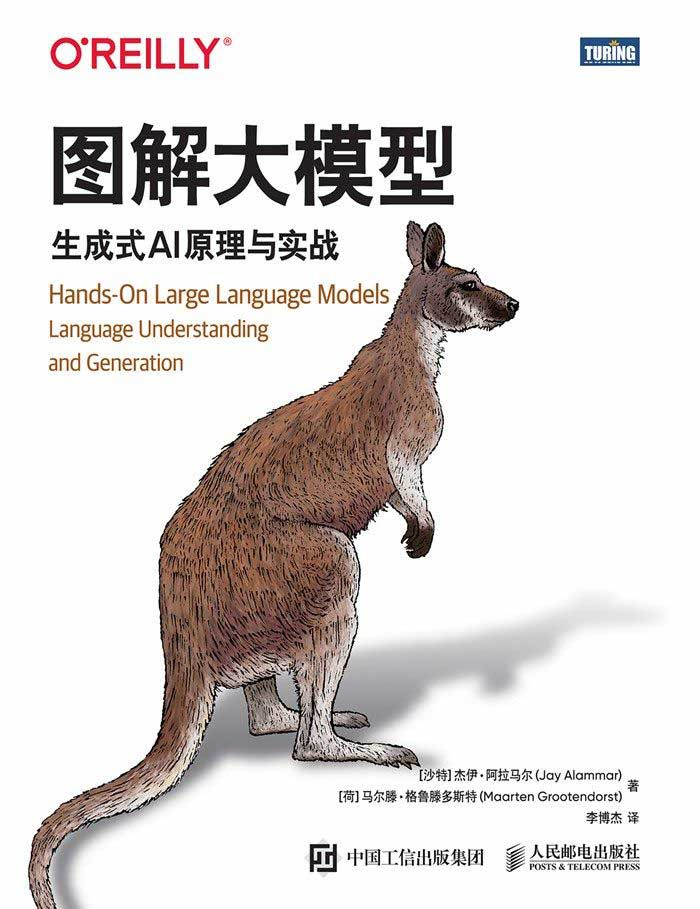


---

# 版权信息

**COPYRIGHT**

书名：图解大模型：生成式AI原理与实战

作者：【沙特】杰伊·阿拉马尔【荷】马尔滕·格鲁滕多斯特

译者：李博杰

出版社：人民邮电出版社

出版时间：2025年5月

ISBN：9787115670830

字数：267千字


感谢 Telegram 频道 @sharebooks4you 制作，欢迎大家扫码订阅


---

# O'Reilly Media, Inc. 介绍

O'Reilly以“分享创新知识、改变世界”为己任。40多年来我们一直向企业、个人提供成功所必需之技能及思想，激励他们创新并做得更好。

O'Reilly业务的核心是独特的专家及创新者网络，众多专家及创新者通过我们分享知识。我们的在线学习（Online Learning）平台提供独家的直播培训、互动学习、认证体验、图书、视频等，使客户更容易获取业务成功所需的专业知识。几十年来O'Reilly图书一直被视为学习开创未来之技术的权威资料。我们所做的一切是为了帮助各领域的专业人士学习最佳实践，发现并塑造科技行业未来的新趋势。

我们的客户渴望做出推动世界前进的创新之举，我们希望能助他们一臂之力。

**业界评论**

“O'Reilly Radar博客有口皆碑。”

——Wired

“O'Reilly凭借一系列非凡想法（真希望当初我也想到了）建立了数百万美元的业务。”

——Business 2.0

“O'Reilly Conference是聚集关键思想领袖的绝对典范。”

——CRN

“一本O'Reilly的书就代表一个有用、有前途、需要学习的主题。”

——Irish Times

“Tim是位特立独行的商人，他不光放眼于最长远、最广阔的领域，并且切实地按照Yogi Berra的建议去做了：‘如果你在路上遇到岔路口，那就走小路。’回顾过去，Tim似乎每一次都选择了小路，而且有几次都是一闪即逝的机会，尽管大路也不错。”

——Linux Journal


---

# 对本书的赞誉

这本书堪称探索大模型技术与行业实践应用的权威指南。全书通过高度可视化的方式解析大模型的生成、表示与检索应用，帮助读者快速理解技术原理、落地实践并优化大模型。强烈推荐！

——Nils Reimers，Cohere机器学习总监、sentence-transformers库创建者

这本书延续了Jay和Maarten一贯的风格，通过精美的插图搭配深入浅出的文字，将复杂概念讲解得形象生动。书中不仅配备可一键运行的代码，还梳理了技术发展脉络，并引用核心论文，为想要深入理解大模型底层技术的读者提供了宝贵的学习资源。

——吴恩达（Andrew Ng），DeepLearning.AI创始人

在大模型时代，想不出还有哪本书比这本更值得一读！不要错过书中任何一页，你会从中学到至关重要的知识。

——Josh Starmer，YouTube热门频道StatQuest作者

若想快速、全面地掌握大模型知识，阅读这本书就够了！在书中，Jay与Maarten将带你从零起步，深入了解大模型的历史与前沿，最终成为领域专家。凭借直观的阐释、生动的案例、清晰的图解和完整的代码实践，这本书揭开了Transformer模型、分词器、语义搜索、RAG等尖端技术的神秘面纱，实乃AI前沿探索者的必读之作！

——Luis Serrano博士，Serrano Academy创始人兼CEO

在快速演进的生成式AI领域，这本书是不可或缺的指南。书中聚焦文本嵌入与视觉嵌入技术，完美融合算法演进、理论深度与实践智慧。无论学者、研究员还是从业者，都将从中获得提升认知的实战方案。精湛之作！

——Chris Fregly，AWS前生成式AI首席解决方案架构师

在这场生成式AI革命的核心地带，这本书以精妙的“理论 - 实践”平衡艺术，引领读者穿越大模型的广袤版图，赋予读者在AI领域实现突破性创新的知识储备。

——Tarun Narayanan Venkatachalam，华盛顿大学AI研究员

获取语言模型实战经验的及时指南。

——Emir Muñoz，Genesys高级经理

这本书通过清晰的讲解和真实案例帮助读者破除AI泡沫，聚焦真正重要和实际可用的知识。书中配有丰富的图示，帮助读者形象地理解知识，辅以示例和代码将抽象概念具象化，便于读者实践。读者将从简单的入门知识开始，循序渐进，到最后，能够信心满满地完成大模型的微调和构建。

——Leland McInnes，Tutte数学与计算研究所研究员

终于有一本书，避开了对大模型的泛泛之谈，深入探讨了相关技术的来龙去脉，可谓通俗易懂、引人入胜！两位作者打造了一部权威指南——纵使领域日新月异，此书仍将长驻经典之列。

——Roman Egger，SmartVisions CEO、维也纳模都尔大学教授


---

# 对本书中文版的赞誉

这本书以“图解”为特色，将复杂的大模型技术转化为直观易懂的视觉语言，让抽象概念一目了然，堪称技术人的“视觉化学习手册”！书中既剖析语言模型和Transformer的核心原理，又涵盖提示工程和微调等实战技巧，兼具深度与实用性，是掌握生成式AI的绝佳指南！无论是初学者还是从业者，都能基于本书快速构建知识框架并落地实践。译者李博杰博士是业界一线专家，有趣的是，他在翻译这本书的过程中就适当借助了前沿大模型的能力，真正践行了“绝知此事要躬行”的理念。

——袁进辉（@老师木），硅基流动（SiliconFlow）创始人

这是一本少见的将原理讲解、实践操作与直观图示融合得如此出色的入门书。中文版由技术功底深厚的李博杰老师精心翻译，并特别补充了DeepSeek原理介绍的内容，展现出对技术本质与时代脉搏的双重把握，是理解生成式AI这一核心技术变革的重要起点。

——周礼栋，微软亚洲研究院院长

这本书深入浅出地介绍了与大模型相关的基础知识（包括NLP以及当前大模型的核心技术），并用通俗易懂的方式引导读者学习和使用大模型。书中提供了丰富的插图和案例，帮助读者掌握大模型基础知识，了解不同类型的大模型及其在不同场景中的典型用法。不论对于大模型初学者还是行业专家，这都是一本不可多得的好教材，推荐阅读！

——林俊旸，阿里巴巴Qwen算法负责人

这本书结合丰富的代码示例和清晰的图解，以通俗易懂的方式深入剖析了大模型的核心技术，可帮助读者快速理解并动手实践大模型，是非常适合入门的优秀教材。原作者思路清晰、逻辑严密，善于将复杂的原理抽丝剥茧、层层展开；译者则用准确而流畅的语言再现了原作的精髓，确保中文读者同样能够轻松理解并掌握这些前沿技术。

——李国豪，CAMEL-AI社区创始人

这本书不仅内容全面，而且脉络清晰，还配有丰富的插图和大量代码示例——从大模型的核心理论到实战，通过一本书就能学透。对于“大模型训练师”这样的热门职业，这本书堪称经典入门教材，强烈推荐！

——仲泰，特工宇宙（AgentUniverse）创始人


---

# 译者序

既然翻开这本书，你就已经是时代的幸运儿。大模型是近10年来最大的技术浪潮，机器第一次能够掌握世界知识，像人一样思考。遇到这样大的技术浪潮是我人生最幸运的事情，在GPT-4发布之后，我就果断投身创业。

如今，大模型已经走进千行百业——程序员用Cursor可以提升一倍以上的开发效率；不懂编程的人也可以用Lovable开发产品原型；OpenAI Deep Research生成的调研报告比大部分实习生做的专业；只需两小时，我就能使用AI根据录音整理出5万字的访谈稿；有了AI，一名运营人员就可以管理几十个网站、上百个社交媒体账号；在公司举行会议的过程中，项目管理工具中的工作项就能实时更新相关信息……一些公司已经开始组建AI原生团队，每名真人员工带几名数字员工，真人员工将大多数时间用于思考和讨论，烦冗的执行工作则交给24小时不休息的数字员工。大模型也已经走进普通人的日常生活——餐厅服务员教我用Kimi写点评，家里的老人和亲戚用DeepSeek-R1写拜年短信，小区里的小孩天天“抱着”豆包聊天……

大模型发展迅速，可谓“AI一天，人间一年”。很多人在百花齐放的模型花园中迷失了方向，不知道手头的应用场景应该用什么模型，也无法预判未来一年模型的发展方向，时常陷入焦虑。其实，如今几乎所有大模型都是基于Transformer架构的，万变不离其宗。

而你手里的这本书正是帮你系统了解Transformer和大模型的基本原理和能力边界的绝佳资料。当图灵公司找到我翻译这本书时，我看到作者的名字就第一时间答应了，因为我当年就是读了Jay Alammar的“The Illustrated Transformer”这篇博客文章才真正弄懂Transformer的（本书第3章就是由这篇博客文章扩展而来的）。如今讲解大模型的图书和文章浩如烟海，但本书的插图之精美、讲解之深入浅出是罕见的。本书从词元和嵌入讲起，不局限于生成模型，还包括很多人忽视的表示模型。此外，书中还包括文本分类、文本聚类、提示工程、RAG、模型微调等实用内容。

花些时间读一下本书，系统地了解Transformer和大模型的基本原理和能力边界，就如同在大模型的探险之旅中拥有了地图和指南针。这样，我们不但不会担心新发布的模型一夜之间让长期的工程积累变得无用，还可以为未来的模型开发产品。模型能力一旦就绪，产品就可以马上起量。

1. 这里的试题是一个精华版，李博杰老师为本书整理了大模型面试题200问，作为免费的配套阅读资料，具体请前往 https://www.ituring.com.cn/book/3285 页面的“随书下载”下载阅读。——编者注

**配套阅读：大模型面试题60问**
 [](#footnote-5-14)

我在面试候选人和参加业内研讨会时，常常发现很多人有大量实战经验，但对模型的基本原理知之甚少。为了帮助大家更好地理解本书，也为了方便部分有面试需求的朋友更有针对性地阅读本书，围绕本书各章主题，我系统梳理了大模型领域常见的面试题，其中的大多数问题可以在书中直接找到答案，部分进阶问题可以从本书的参考文献或网络上的最新论文中找到答案。希望所有的朋友都能够带着这些问题阅读本书。

## 第1章 大语言模型简介

Q1：仅编码器（BERT类）、仅解码器（GPT类）和完整的编码器 - 解码器架构各有什么优缺点？

Q2：自注意力机制如何使大模型能够捕捉长距离依赖关系，它跟RNN有什么区别？

Q3：大模型为什么有上下文长度的概念？为什么它是指输入和输出的总长度？

## 第2章 词元和嵌入

Q4：大模型的分词器和传统的中文分词有什么区别？对于指定的词表，一句话是不是只有唯一的分词方式？

Q5：大模型是如何区分聊天历史中用户说的话和AI说的话的？

Q6：传统的静态词嵌入（如word2vec）与大模型产生的上下文相关的嵌入相比，有什么区别？有了与上下文相关的嵌入，静态词嵌入还有什么价值？

Q7：在word2vec等词嵌入空间中，存在king - man + woman ≈ queen的现象，这是为什么？大模型的词元嵌入空间是否也有类似的属性？

## 第3章 LLM的内部机制

Q8：注意力机制是如何计算上下文各个词元之间的相关性的？每个注意力头只关注一个词元吗？

Q9：如果需要通过修改尽可能少的参数值，让模型忘记某一特定知识，应该修改注意力层还是前馈神经网络层的参数？

Q10：为什么注意力机制需要多个头？跟简单地减少注意力头的数量相比，多查询注意力和分组查询注意力优化有什么不同？它们优化的是训练阶段还是推理阶段？

Q11：Flash Attention并不能减少计算量，为什么能提升推理速度？Flash Attention是如何实现增量计算softmax的？

Q12：跟原始Transformer论文中的绝对位置编码相比，RoPE（旋转位置嵌入）有什么优点？RoPE在长上下文外推时会面临什么挑战？

## 第4章 文本分类

Q13：在本章中，嵌入模型 + 逻辑回归的分类方式获得了0.85的F1分数，而零样本分类方式获得了0.78的F1分数。如果有标注数据，什么情况下会选择零样本分类？

Q14：与BERT的掩蔽策略相比，掩码语言建模有何不同？这种预训练方式如何帮助模型在下游的文本分类任务中获得更好的性能？

Q15：假设你有一个包含100万条客户评论的数据集，但只有1000条带有标签的数据，请同时利用有标签和无标签的数据，结合表示模型和生成模型的优势，构建一个分类系统。

## 第5章 文本聚类和主题建模

Q16：有了强大的生成式大模型，嵌入模型还有什么用？（提示：推荐系统）

Q17：词袋法和文档嵌入在实现原理上有什么区别？词袋法是不是一无是处了？

Q18：BERTopic中的c-TF-IDF与传统的TF-IDF有何不同？这种差异如何帮助改进主题表示的质量？

Q19：基于质心和基于密度的文本聚类算法有什么优缺点？

Q20：在一个主题建模项目中，你发现生成的主题中有大量重叠的关键词，如何使用本章介绍的技术来提高主题之间的区分度？

## 第6章 提示工程

Q21：针对翻译类、创意写作类、头脑风暴类任务，分别如何设置temperature和top_p？

Q22：一个专业的提示词模板由哪几部分构成？为什么提示词中需要描述角色定义？

Q23：为了尽可能防止提示词注入，如何设计提示词模板？如何在系统层面检测提示词注入攻击？

Q24：在没有推理模型之前，如何让模型先思考后回答？思维链、自洽性、思维树等几种技术各有什么优缺点？

Q25：如何保证模型的输出一定是合法的JSON格式？将大模型用于分类任务时，如何保证其输出一定是几个类别之一，而不会输出无关内容？如果开发一个学习英语的应用，如何确保其输出的语言始终限定在指定的词汇表中？

## 第7章 高级文本生成技术与工具

Q26：如果我们需要生成小说的标题、角色描述和故事梗概，当单次模型调用生成效果不佳时，如何分步生成？

Q27：如果用户跟模型对话轮次过多，超出了模型的上下文限制，但我们又希望尽可能保留用户的对话信息，该怎么办？

Q28：如何编写一个智能体，帮助用户规划一次包含机票预订、酒店安排和景点游览的旅行？需要配置哪些工具？如何确保系统在面对不完整或矛盾的信息时仍能提供合理建议？

Q29：如果单一智能体的提示词过长，导致性能下降，如何将其拆分为多个智能体，并在合适的时机调用不同的智能体？

## 第8章 语义搜索与RAG

Q30：在RAG中，为什么要把文档划分成多个块进行索引？如何解决文档分块后内容上下文缺失的问题？如何处理跨片段的依赖关系？

Q31：向量相似度检索不能实现关键词的精确匹配，基于倒排索引的关键词检索不能匹配语义相近的词，如何解决这对矛盾？为什么需要重排序模型？

Q32：为什么要在向量相似度检索前，对用户输入的话进行改写？

Q33：如果需要根据某长篇小说的内容回答问题，而小说的长度远远超出了上下文限制，应该如何综合利用摘要和RAG技术，使其能同时回答故事梗概和故事细节？

## 第9章 多模态LLM

Q34：在CLIP训练过程中，为什么需要同时最大化匹配图文对的相似度和最小化非匹配图文对的相似度？

Q35：BLIP-2为何不直接将视觉编码器的输出连接到语言模型，而要引入Q-Former这一中间层结构？

Q36：现有一个能力较弱的多模态模型和一个能力较强的文本模型（如DeepSeek-R1），如何结合两者的能力来回答与多模态相关的问题？

Q37：如何构建一个AI照片助手，能够对用户的上万张照片进行索引，根据用户的查询高效地检索相关照片？

## 第10章 构建文本嵌入模型

Q38：相比交叉编码器，为什么双编码器在大规模相似度搜索中更受欢迎？

Q39：在训练嵌入模型时，MNR（多负例排序）损失、余弦相似度损失和softmax损失各有哪些优缺点？在哪些场景下，余弦相似度损失可能比MNR损失更合适？

Q40：如何生成负例以提升模型性能？如何构建高质量的难负例？

Q41：为什么TSDAE选择使用特殊词元而非平均池化作为句子表征？

Q42：相比STSB，MTEB有哪些改进？其中包括哪些类别的嵌入任务？

## 第11章 为分类任务微调表示模型

Q43：如果标注的训练数据很少，如何扩增训练数据的数量？（提示：SetFit）

Q44：在继续预训练时，如何在保证模型获得特定领域知识的同时，最大限度地保留其通用能力？

Q45：请比较以下三种方案在医疗领域文本分类任务上的优缺点：(a) 直接使用通用BERT模型微调；(b) 在医疗文本上继续预训练BERT后再微调；(c) 从头开始用医疗文本预训练模型再微调。

Q46：在命名实体识别任务中，当BERT将单词拆分成多个词元时，如何解决标签对齐问题？

Q47：假设一个嵌入模型的训练语料主要由英文构成，在中文任务上表现不佳，如何用较低的继续预训练成本提升其中文能力？

## 第12章 微调生成模型

Q48：有人声称一篇文章是用DeepSeek-R1生成的，并给了你生成所用的完整提示词，如何证实或证伪这个说法？（提示：利用困惑度）

Q49：如何微调一个Llama开源模型，使其输出风格更简洁、更像微信聊天，并保证输出的内容符合国内的大模型安全要求？

Q50：QLoRA中的分块量化如何解决普通量化导致的信息损失问题？

Q51：现有一个由若干篇文章组成的企业知识库，如何将其转换成适合SFT的数据集？

Q52：PPO和DPO相比有什么优缺点？

Q53：在PPO中，如何防止模型在微调数据集以外的问题上泛化能力下降？如何防止模型收敛到单一类型的高奖励回答？

Q54：设想一个网站上都是AI生成的内容，我们统计了每篇文章的平均用户停留时长，如何将其转化为DPO所需的偏好数据？对于小红书和知乎两种类型的网站，处理方式有什么区别？

Q55：提示工程、RAG、SFT、RL、RLHF应该分别在什么场景下应用？例如：快速迭代基本能力（提示工程）、用户个性化记忆（提示工程）、案例库和事实知识（RAG）、输出格式和语言风格（SFT）、领域深度思考能力和工具调用能力（RL）、根据用户反馈持续优化（RLHF）。

**附录：图解DeepSeek-R1**（建议补充阅读DeepSeek的原始论文）

Q56：DeepSeek-R1（简称R1）与DeepSeek-R1-Zero（简称R1-Zero）的训练过程有什么区别，各自有什么优缺点？既然R1-Zero生成的推理过程可读性差，在非推理任务上的表现也不如R1，那么R1-Zero存在的价值是什么？R1训练过程是如何解决R1-Zero的上述问题的？

Q57：DeepSeek是如何把R1的推理能力蒸馏到较小的模型中的？如果我们要自己蒸馏一个较小的垂直领域模型，如何尽可能保留R1在特定领域的能力？

Q58：R1-Zero的方法主要适用于有明确验证机制的任务（如数学、编程），如何将这一方法扩展到更主观的领域（如创意写作或战略分析）？

Q59：如果要在一个非推理型模型的基础上通过强化学习（RL）训练出一个1000以内的整数四则运算错误率低于1% 的模型，预计基座模型至少需要多大？RL过程需要多少张GPU和多少训练时长？（提示：TinyZero）

Q60：在QwQ-32B推理模型的基础上，通过RL在类似OpenAI Deep Research的场景中强化垂直领域能力，如何构建训练数据集？预计需要多少张GPU和多少训练时长？

**关于翻译**

本书是我的首部译作，本书的翻译也是在大模型的辅助下完成的。翻译与修改过程大体如下。

第一轮：使用Claude 3.5 Sonnet对文本内容进行初步翻译，借助其多模态能力提取近300张图片的文字并进行翻译。

第二轮：由于技术图书对术语表达的一致性、格式的一致性、语言的流畅度等要求很高，在刘美英编辑的指导下，我又用大模型生成了术语表，参考术语表批量修正了术语翻译和格式问题。

第三轮：编辑中耕并提出修改反馈，按照编辑意见进行人工修改。

第四轮：编辑编加并提出修改反馈，按照编辑意见进行人工修改。

第五轮：排版后内容审读，通读全书内容并对个别问题进行人工修改。

由此可见，机器翻译虽然做了大量工作，但翻译过程仍然涉及多轮人工修改和校对。虽然我和编辑已竭尽所能地提升内容质量，但书中难免有错漏和不当之处，恳请读者指正。

本书初稿翻译完成之际，恰逢DeepSeek-R1发布。推理模型开启了缩放定律的第二曲线，不仅解决了数学计算和逻辑推理的可靠性问题，文字的流畅度和创造力也有了很大的提升。它背后的强化学习技术更是让我们看到了模型智力超越人类的曙光，也为中小企业利用行业数据建立护城河提供了一条路径。我们看到本书作者关于DeepSeek-R1的精彩图解博客文章后，又征得作者授权，补充了一个附录，让本书涵盖了读者最关心的主题之一。

我最近尝试用DeepSeek-R1和Claude 3.7 Sonnet再次运行我的翻译流水线，发现原有的术语不一致、翻译味重等问题大多数已经能自动解决。如果今天才开始翻译这本书，也许出版周期能缩短很多。这就是大模型的魅力，每过半年或一年，一件事情就有了全新的做法。

希望本书能够成为大模型花园的观光巴士，让更多人看到大模型的全景。这样，大模型不断扩展的能力边界就是一场视觉盛宴，而非吞噬一切的怪兽；我们就有机会站在AI的潮头，实现更多梦想，获得更多自由。

李博杰，2025年3月


---

# 中文版序

我们很高兴推出*Hands-OnLargeLanguageModels:LanguageUnderstandingandGeneration*的中文版《图解大模型：生成式AI原理与实战》！在AI研究中持续涌现中国智慧的当下，本书的出版恰逢其时。中文版新增附录——探讨性能卓越的DeepSeek-R1模型——反映了大语言模型领域的快速演进。我们相信，对于深耕AI研究和应用前沿的中国从业者而言，新增内容具有重要的参考价值。新增内容既体现了全球技术趋势，也展现了来自中国AI社区的突出成果。作为一本持续更新的图书，我们还为希望深入探索高阶主题的读者提供了更多进阶内容。

We are excited to introduce the Chinese edition of *Hands-OnLargeLanguageModels:LanguageUnderstandingandGeneration* (《图解大模型：生成式AI原理与实战》)! As China continues to make remarkable contributions to AI research and development, this translation arrives at a pivotal moment. The inclusion of one new appendix—showcasing the impressive DeepSeek-R1 model—reflects the rapidly evolving landscape of large language models. We believe these additions will be particularly valuable for Chinese practitioners working at the cutting edge of AI research and application. These additional contents highlight both global trends and the impressive achievements coming from within China's AI community. As an ever-evolving book, additional in-depth content is available for those that want to take a deep-dive into more advanced subjects.


---

# 前言

1. 在本书中，大语言模型也简称大模型。大部分情况下我们使用其英文缩写LLM来代指。——编者注

大语言模型（large language model，LLM）
 [](#footnote-7-31)已经对世界产生了深远的影响。通过使机器更好地理解和生成人类语言，LLM在人工智能（artificial intelligence，AI）领域开创了新的可能性，并影响了众多行业。

本书以图文并茂的方式，全面介绍了LLM领域，涵盖了理论基础和实践应用两个方面。从深度学习之前的词表示方法，到撰写本书时最先进的Transformer架构，我们将探索LLM的历史与演进，深入研究LLM的内部运作机制，探讨其架构、训练方法和微调技术。我们还将考察LLM在文本分类、聚类、主题建模、聊天机器人、搜索引擎等领域的各种应用。

本书独特地结合了直观理解、实际应用和图解风格，我们希望那些想探索LLM这一激动人心的领域的读者能够通过本书打下坚实的基础。无论你是初学者还是专家，我们都诚挚地邀请你与我们一起踏上这段探索LLM的旅程。

**以直观理解为先的理念**

本书的主要目标是帮助读者直观地理解LLM。语言人工智能（Language AI）领域发展迅猛，试图紧跟最新技术让人很有“压力”。因此，我们将重点放在LLM的基础知识上，致力于提供一个轻松、有趣的学习过程。

为了实现这种以直观理解为先的理念，我们大量运用视觉语言。插图将帮助读者对LLM学习过程中的主要概念和流程建立直观认识。通过这种图解式的叙事方法，我们希望带你踏上通往这个令人振奋且可能改变世界的领域的旅程。

在本书中，我们明确区分表示模型和生成模型。表示模型不生成文本，通常用于特定任务，如分类；而生成模型则可以生成文本，如GPT模型。尽管提到LLM时人们首先想到的通常是生成模型，但表示模型仍然具有重要用途。此外，我们对“大语言模型”中“大”这个字的使用较为宽松，常常简单地称之为“语言模型”，因为对规模的描述往往比较随意，并不总能反映模型的实际能力。

**基础知识要求**

本书假定读者具有Python编程经验，并熟悉机器学习的基础知识。我们将重点放在建立直观理解上，而不是推导数学公式。因此，图解配合实践示例将贯穿本书的学习过程。本书不要求读者预先了解PyTorch或TensorFlow等流行的深度学习框架，也不需要生成式建模的相关知识。

如果你不熟悉Python，推荐从LearnPython网站开始，这个网站上有许多关于Python基础知识的教程。为了进一步简化学习过程，本书的所有代码都可在Google Colab上直接运行，你无须在本地安装任何软件。

**本书结构**

本书大致分为三部分。图P-1展示了全书结构。请注意，每章都可以独立阅读，因此你可以略过已经熟悉的章节。

第一部分：理解语言模型

在第一部分中，我们探索大、小语言模型的内部运作机制。首先概述该领域和常用技术（见第1章），然后讨论这些模型的两个核心组件（见第2章）：词元（token）和嵌入（embedding）。本部分最后是对Jay的大名鼎鼎的文章“The Illustrated Transformer”的更新和扩展，深入探讨了这些模型的架构（见第3章）。本部分还将介绍许多贯穿全书的术语及其定义。

第二部分：使用预训练语言模型

在第二部分中，我们通过常见用例探索如何使用LLM。我们将使用预训练模型并展示它们的功能，无须进行微调。

你将学习如何使用语言模型进行监督分类（见第4章）、文本聚类和主题建模（见第5章），利用嵌入模型进行文本生成（见第6章和第7章）、语义搜索（见第8章），以及将文本生成能力扩展到视觉领域（见第9章）。

学习这些独立的语言模型功能将使你具备用LLM解决问题的技能，并能够构建越来越高级的系统和流程。

第三部分：训练和微调语言模型

在第三部分中，我们通过训练和微调各种语言模型来探索高级概念。我们将探讨如何构建和微调嵌入模型（见第10章），回顾如何针对分类任务微调BERT（见第11章），并以几种生成模型的微调方法结束本书（见第12章）。

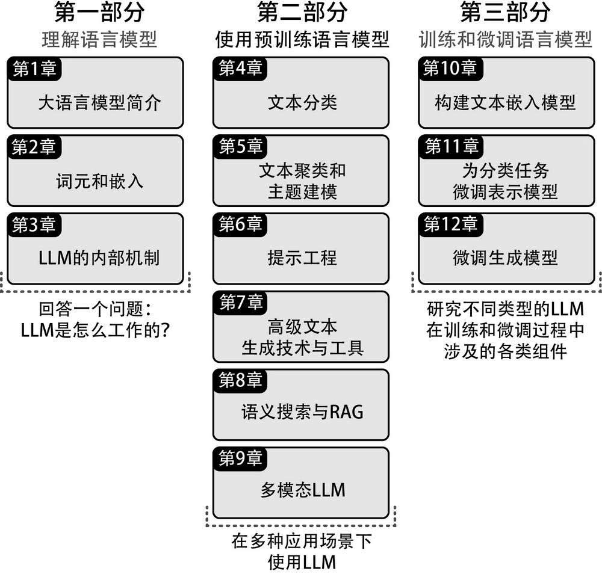

图P-1：本书章节结构

**硬件和软件要求**

运行生成模型通常是计算密集型任务，需要配备高性能GPU的计算机。由于并非每位读者都具备这样的硬件条件，本书中的所有示例都可在在线平台Google Colab上运行。在撰写本书时，该平台允许你免费使用NVIDIA GPU（T4）来运行代码。这款GPU有16 GB显存（GPU的内存），这是我们对本书示例的最低显存要求。


 需要注意的是，并非所有章节都需要最少16 GB显存，因为某些示例（如训练和微调）比其他示例（如提示工程）更消耗计算资源。在本书代码仓库中，你可以找到每章的最低GPU要求。

所有代码、相关要求和附加教程都可以在本书GitHub仓库（https://github.com/HandsOnLLM/Hands-On-Large-Language-Models）中找到。如果你想在本地运行示例，我们建议使用配备至少16 GB显存的NVIDIA GPU。如需本地安装，例如使用conda，你可以按照以下步骤创建环境：

```
conda create -n thellmbook python=3.10
conda activate thellmbook
```

要安装所有必要的依赖项，首先fork或克隆代码仓库，然后在新创建的Python 3.10环境中运行以下命令：

```
pip install -r requirements.txt
```

**API密钥**

在示例中，我们同时使用开源模型和专有模型来展示它们各自的优势和劣势。对于专有模型，使用OpenAI和Cohere的服务前，你需要创建一个免费账户。

OpenAI

在网站上点击“Sign Up”（注册）创建免费账户。该账户允许你创建API密钥，用于访问GPT-3.5。然后，进入“API keys”（API密钥）创建密钥。

Cohere

在网站上注册免费账户。然后，进入“API keys”创建密钥。

请注意，这两个账户都有使用速率限制，这些免费API密钥每分钟只允许有限次数的调用。在所有示例中，我们都考虑到了这一点，并在必要时提供了本地替代方案。

对于开源模型，除了第2章中的Llama 2模型外，你无须创建账户。要使用该模型，你需要一个Hugging Face账户。

Hugging Face

在Hugging Face网站上点击“Sign Up”创建免费账户。然后，在“Settings”（设置）中进入“Access Tokens”（访问令牌）创建令牌，用于下载某些LLM。

**本书使用的约定**

本书使用以下排版约定：

**黑体**

表示新术语或重点强调的内容。

等宽字体（constant width）

表示程序片段，以及正文中出现的变量、函数、数据库、数据类型、环境变量、语句和关键字等。

等宽粗体（**constantwidthbold）**

表示用户应该逐字键入的命令或其他文本。

等宽斜体（*constantwidthitalic*）

表示应该用用户提供的值或上下文决定的值替换的文本。


 该图标表示提示或建议。


 该图标表示一般注释。

**代码示例的使用**

补充材料（代码示例、练习等）可以从本书GitHub仓库下载。

如果你有技术问题或使用代码示例时遇到问题，请发送电子邮件至support@oreilly.com。

本书旨在帮助你完成工作。一般来说，如果书中提供了示例代码，你可以在程序和文档中使用。除非你要复制大量代码，否则无须联系我们获得许可。例如，编写的程序使用了本书的几个代码片段，就不需要许可。销售或分发O'Reilly图书中的示例需要获得许可。通过引用本书的内容或引用示例代码来回答问题不需要获得许可。将本书中大量示例代码整合到产品文档中需要获得许可。

引用书中的示例代码通常不要求注明出处，但如果你能够注明，我们表示感谢。出处信息通常包括书名、作者、出版商和ISBN。例如，英文版可以这样注明：*Hands-OnLargeLanguageModels* by Jay Alammar and Maarten Grootendorst (O'Reilly). Copyright © 2024 Jay Alammar and Maarten Pieter Grootendorst, 978-1-098-15096-9；中文版可以这样注明：《图解大模型：生成式AI原理与实战》（李博杰译，人民邮电出版社），原始版本*Hands-OnLargeLanguageModels* by Jay Alammar and Maarten Grootendorst (O'Reilly)。如果你认为自己对代码示例的使用超出了合理使用范围或上述许可范围，请随时通过permissions@oreilly.com与我们联系。

**O'Reilly在线学习平台（O'ReillyOnlineLearning）**


40多年来，O'Reilly Media致力于提供技术和商业培训、知识和卓越见解，来帮助众多公司取得成功。

我们拥有独特的由专家和创新者组成的庞大网络，他们通过图书、文章和我们的在线学习平台分享他们的知识和经验。O'Reilly在线学习平台让你能够按需访问现场培训课程、深入的学习路径、交互式编程环境，以及O'Reilly和200多家其他出版商提供的大量文本资源和视频资源。更多信息，请访问https://www.oreilly.com。

**联系我们**

请把对本书的评价和问题发给出版社。

美国：

# O'Reilly Media, Inc.

1005 Gravenstein Highway North

Sebastopol, CA 95472

中国：

北京市西城区西直门南大街2号成铭大厦C座807室（100035）

奥莱利技术咨询（北京）有限公司

对于本书的评论和技术性问题，请发送电子邮件到errata@oreilly.com.cn。

要了解更多O'Reilly图书和培训课程等信息，请访问以下网站：https://www.oreilly.com。

我们在LinkedIn的地址如下：https://linkedin.com/company/oreilly-media。

我们的YouTube视频地址如下：https://youtube.com/oreillymedia。

**致谢**

撰写本书对我们来说是一种不可思议的体验、一次精诚的合作，也是一段难忘的旅程。

LLM是当今最具活力的技术领域之一。在写作本书期间，我们目睹了这个领域的惊人进展。然而，尽管变化迅猛，但其基本原理始终如一，这也为写作增添了不少趣味。我们非常感激能有机会在这个关键时刻深入探索这一领域。

与O'Reilly团队的合作令人难忘！特别感谢Michele Cronin从本书创作之初就以满腔热忱投入其中，给予我们宝贵的反馈和坚定的支持。你是我们见过的最棒的编辑——你太出色了！感谢Nicole Butterfield策划这本书并帮助我们在整个写作过程中遵循结构化方法。感谢Karen Montgomery设计了精彩的封面，我们很喜欢封面上的袋鼠！非常感谢Kate Dullea，在陪我们反复检查数百幅插图的过程中，始终极富耐心。Clare Laylock及时发布的预览版让我们得以见证工作的进展，这极大地激励了我们，谢谢你。感谢Ashley Stussy和Charles Roumeliotis在出版最后阶段的工作，同时也感谢O'Reilly团队的其他所有贡献者。

感谢出色的技术审阅团队——Harm Buisman、Emir Muñoz、Luba Elliott、Guarav Chawla、Rafael V. Pierre、Tarun Narayanan、Nikhil Buduma和Patrick Harrison为我们提供了宝贵的反馈。

Jay致谢

向我的家人表达最深切的感激，感谢你们给予我坚定不移的支持和源源不断的启发。特别感谢我的父母Abdullah和Mishael，以及我的两位姑姑Hussah和Aljoharah。

感谢那些在理解和阐释书中复杂概念方面给予我帮助的朋友、同事和合作伙伴，也感谢Cohere团队营造了支持学习和分享的环境。感谢Adrien Morisot、Aidan Gomez、Andy Toulis、Anfal Alatawi、Arash Ahmadian、Bharat Venkitesh、Edward Grefenstette、Ivan Zhang、Joao Araújo、Luis Serrano、Matthias Gallé、Meor Amer、Nick Frosst、Patrick Lewis、Phil Blunsom、Sara Hooker和Suhas Pai。

如果没有我的合著者Maarten非凡的才华和不懈的努力，我无法想象这个项目能达到如今的高度。你在反复推敲技术细节（从第*n*导入依赖的固定版本到最新的LLM量化技术）的同时，还能创造出世界上最好的视觉叙事，这真是令人叹为观止！

最后，要向沙特阿拉伯首都利雅得那些绝妙的咖啡馆致敬——那真是集中注意力写作的好去处，我常常从黎明待到午夜，需要提神醒脑的时候就喝喝咖啡。正是在这些咖啡馆里，我阅读了大部分与LLM相关的论文并形成了自己的见解（特别是Elixir Bunn咖啡馆，向你致意）。

Maarten致谢

首先，衷心感谢我的合著者Jay。你的见解不仅使这本书成为可能，而且让写作过程变得无比充实。这段旅程绝对精彩，与你合作是一种纯粹的快乐。

真诚地感谢IKNL优秀的同事们在这段旅程中持续给予的支持。特别要提一下Harm——每周一早上跟你讨论这本书的咖啡时光对我来说一直是莫大的鼓励。

感谢我的家人和朋友们坚定不移的支持，特别是我的父母。爸爸，尽管面对重重困难，但在我最需要的时候，你总能出现在我身边，谢谢你。妈妈，我们作为怀抱写作梦想的朋友之间的对话异常精彩，这对我的激励超出了你的想象。感谢两位无尽的支持和鼓励。

最后，语言已经难以表达我对爱妻Ilse的感激之情。你那无限的热情和耐心令人敬佩，特别是当我长时间滔滔不绝地谈论最新的LLM进展时——你是我最大的支持。对不起，我可爱的女儿Sarah，才两岁的你已经耳闻了远超常人一生所能听到的LLM相关知识！我保证我们会用数不尽的游戏时光和冒险来弥补这一切。


---

# 第一部分

# 理解语言模型


---

## 第1章 大语言模型简介

人类正站在一个转折点上。从2012年开始，基于深度神经网络的AI系统发展日新月异，如今已经诞生了首个能够生成与人类作品几乎无异的文章的软件系统，这个系统就是名为GPT-2（Generative Pre-Trained Transformer 2，生成式预训练Transformer 2）的AI模型。2022年ChatGPT的发布，展示了这项技术将如何彻底改变我们与技术和信息交互的方式。ChatGPT在5天内达到百万活跃用户，2个月内活跃用户数突破1亿。新一代AI模型最初只是像人一样的聊天机器人（chatbot），但很快发展为一场革命性的变革，改变了我们处理翻译、文本生成、摘要等常见任务的方式。它已成为程序员、教育工作者和研究人员的宝贵工具。

ChatGPT前所未有的成功推动了对其背后的技术——大语言模型（LLM）的深入研究。不同专有和开源模型稳步发布，逐渐接近并最终赶上了ChatGPT的性能。可以毫不夸张地说，几乎所有的关注都集中在了LLM上。

因此，对我们而言，2023年，作为彻底改变语言人工智能领域的一年，将永远被铭记。语言人工智能领域旨在开发能够理解和生成人类语言的系统。

然而，尽管LLM已经存在了一段时间，但较小的模型至今仍然具有重要意义。LLM远不只是单一的模型，语言人工智能领域还有许多其他值得探索的技术和模型。

本书旨在让读者深入理解LLM和语言人工智能领域的基本原理。本章为全书搭建框架，将介绍贯穿全书的概念和术语。

最重要的是，我们将在本章回答以下问题：

·什么是语言人工智能？

·什么是LLM ？

·LLM的常见使用场景和应用有哪些？

·我们如何使用LLM ？

### 1.1 什么是语言人工智能

“人工智能”（AI）这个术语通常用于描述致力于执行接近人类智能任务（如语音识别、语言翻译和视觉感知）的计算机系统。它是指软件产生的智能，而不是人类的智能。

以下是AI学科创始人之一John McCarthy给出的更正式的定义：

（人工智能）是制造智能机器，特别是智能计算机程序的科学和工程。它与使用计算机理解人类智能的任务相似，但人工智能不必局限于生物学上可观察到的那些方法。

1. 参见John McCarthy的文章“What is Artificial Intelligence?”。

——John McCarthy，2007
 [](#footnote-9-20)

由于人工智能不断发展，这个术语被用来描述各种各样的系统，其中有些可能并不真正体现智能行为。例如，电脑游戏中的NPC（nonplayable character，非玩家角色）经常被称为AI，尽管许多只是简单的if-else语句。

**语言人工智能是人工智能的一个子领域，专注于开发能够理解、处理和生成人类语言的技术。随着机器学习方法在解决语言处理问题方面取得持续成功，语言人工智能这个术语与自然语言处理**（natural language processing，NLP）经常可以互换使用。

我们使用语言人工智能这个术语来涵盖那些在技术上可能不是LLM，但仍对该领域有重大影响的技术，比如检索系统（它能赋予LLM“超能力”，见第8章）。

在本书中，我们想要关注那些在塑造语言人工智能领域方面发挥重要作用的模型。这意味着我们要探索的不单是LLM。然而，这就引出了一个问题：什么是LLM ？为了在本章开始回答这个问题，让我们先探索语言人工智能的历史。

### 1.2 语言人工智能的近期发展史

如图1-1所示，语言人工智能的发展历史涉及许多技术进展和模型，这些技术和模型的目标是使计算机能够表示和生成语言。

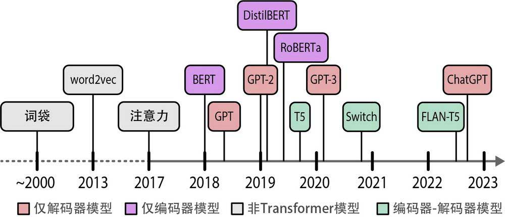

图1-1：语言人工智能的历史一瞥

然而，对计算机来说，语言是一个复杂的概念。文本本质上是非结构化的，当用0和1（单个字符）表示时就会失去其含义。因此，在语言人工智能的发展历程中，人们一直非常关注如何以结构化的方式表示语言，使计算机能够更容易地使用。图1-2展示了语言人工智能任务的示例。

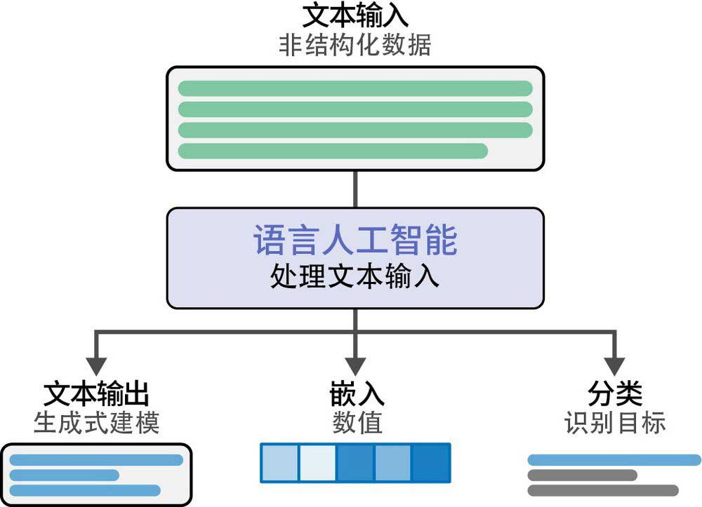

图1-2：通过处理文本输入，语言人工智能可以完成多种任务

**1.2.1将语言表示为词袋模型**

1. Fabrizio Sebastiani. “Machine Learning in Automated Text Categorization.” ACM Computing Surveys (CSUR) 34.1 (2002): 1-47.

语言人工智能历史始于一种名为词袋（bag-of-words）的技术，这是一种表示非结构化文本的方法
 [](#footnote-9-49)。它早在20世纪50年代就被提出，但直到2000年前后才开始流行。

词袋模型的工作原理如下。假设我们有两个句子需要创建数值表示。词袋模型的第一步是**分词（tokenization），即将句子拆分成单个词或子词（词元**，token），如图1-3所示。

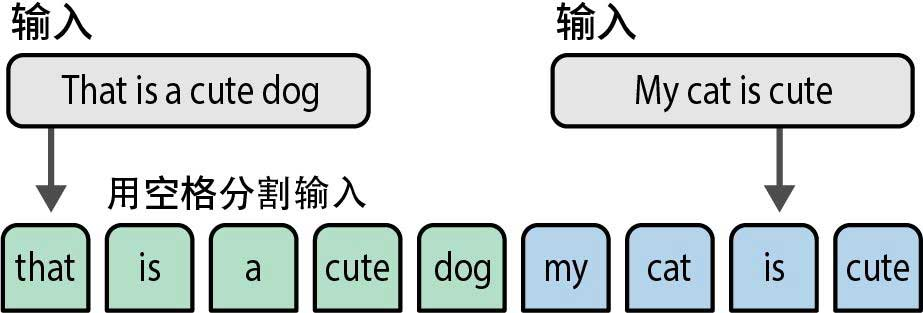

图1-3：通过在空格处分割，每个句子被拆分成词（词元）

最常见的分词方法是通过空格分割来把句子分割成词。然而，这种方法也有其缺点，因为某些语言（如汉语）的词之间没有空格。在下一章中，我们将深入探讨分词技术以及它如何影响语言模型。如图1-4所示，在分词之后，我们将每个句子中所有不同的词组合起来，创建一个可用于表示句子的词表（vocabulary）。

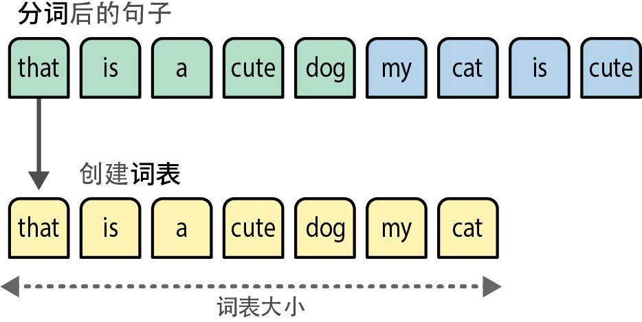

图1-4：通过保留两个句子中所有不同的词来创建词表

使用词表，我们只需计算每个句子中词出现的次数，就创建了一个词袋。因此，词袋模型旨在以数字形式创建文本的表示（representation），也称为向量或向量表示，如图1-5所示。在本书中，我们将这类模型称为**表示模型**（representation model）。

虽然词袋是一种经典方法，但这不代表它现在就完全过时了。在第5章中，我们将探讨如何将它与最新的语言模型结合使用。

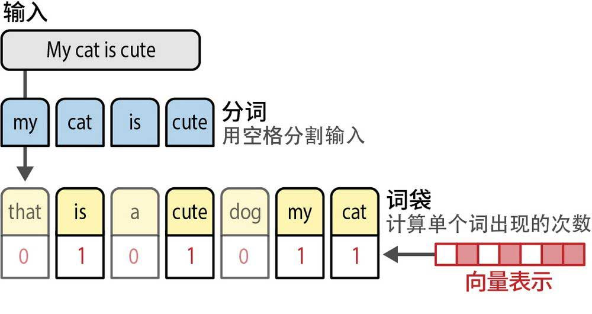

图1-5：通过计算单个词出现的次数创建词袋，这些值被称为向量表示

**1.2.2用稠密向量嵌入获得更好的表示**

词袋虽然是一种优雅的方法，但存在一个明显的缺陷。它仅仅把语言视为一个几乎字面意义上的“词袋”，而忽略了文本的语义特性和含义。

1. Tomas Mikolov et al. “Efficient Estimation of Word Representations in Vector Space.” arXiv preprint arXiv:1301.3781 (2013).

word2vec（词向量）于2013年发布，是首批成功利用**嵌入**（embedding）这个概念来捕捉文本含义的技术之一
 [](#footnote-9-58)。嵌入是数据的向量表示，试图捕捉数据的含义。为此，word2vec通过在大量文本数据（如整个维基百科）上训练来学习词的语义表示。

为了生成这些语义表示，word2vec利用了**神经网络（neural network）技术。神经网络由处理信息的多层互连节点组成。如图1-6所示，神经网络可以有多个“层”，每个连接都有一定的权重，这些权重通常被称为模型的参数**。

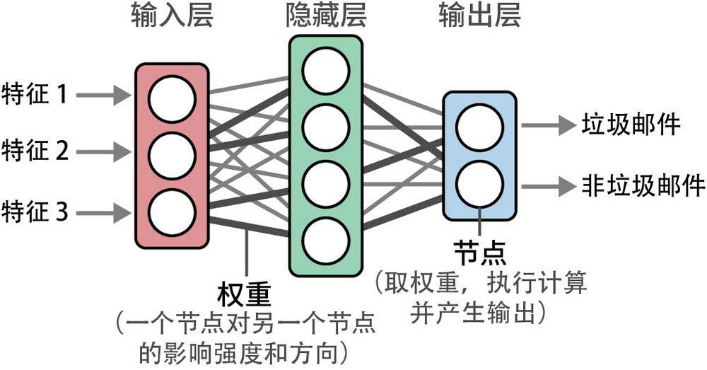

图1-6：神经网络由互连的多层节点组成，每个连接都是一个线性方程

利用这些神经网络，word2vec观察在给定句子中哪些词倾向于出现在其他词旁边，进而据此生成词嵌入。我们首先为词表中的每个词分配一个向量嵌入，比如说每个词有50个随机初始化的值。然后在每个训练步骤中，我们从训练数据中取出词对（pairs of words），用模型尝试预测它们是否可能在句子中相邻，如图1-7所示。

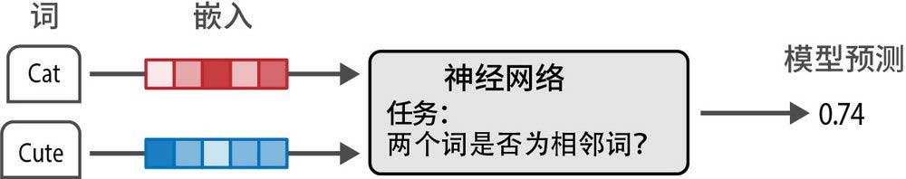

图1-7：训练神经网络来预测两个词是否为相邻词。在此过程中，词嵌入会根据真实标注进行更新

在训练过程中，word2vec会学习词与词之间的关系，并将这些信息提炼到词嵌入中。如果两个词各自的相邻词集合有更大的交集，它们的词嵌入向量就会更接近，反之亦然。在第2章中，我们将深入探讨word2vec的训练过程。

上述过程训练出的词嵌入能够捕捉词的含义，但这究竟意味着什么？为了说明这种现象，让我们稍作简化，设想我们有几个词的词嵌入，比如apple（苹果）和baby（婴儿）。词嵌入试图通过表示词的属性来捕捉其含义。例如，baby这个词在“newborn”（新生儿）和“human”（人类）这些属性上的得分可能很高，而apple在这些属性上的得分则较低。

如图1-8所示，词嵌入可以用多种属性来表示一个词的含义。由于嵌入向量的大小是固定的，这些属性需要经过精心选择，以构建用来代表词的“心智表征”的抽象表示。

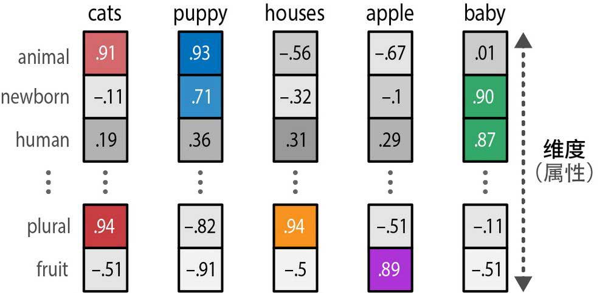

图1-8：词嵌入的值代表用于表征这个词的属性。我们可以简单地将维度理解为概念（实际上并非如此，但这有助于理解）

在实践中，这些属性通常相当抽象，很少与单一实体或人类可识别的概念相关。然而，这些属性组合在一起对计算机来说是有意义的，是将人类语言转换为计算机语言行之有效的方式。

词嵌入非常有用，因为它使我们能够衡量两个词的语义相似度。使用各种距离度量方法，我们可以判断一个词与另一个词的接近程度。如图1-9所示，如果我们将这些词嵌入压缩成二维表示，你会发现含义相似的词往往会更接近。在第5章中，我们将探讨如何将这些词嵌入压缩到*n*维空间。

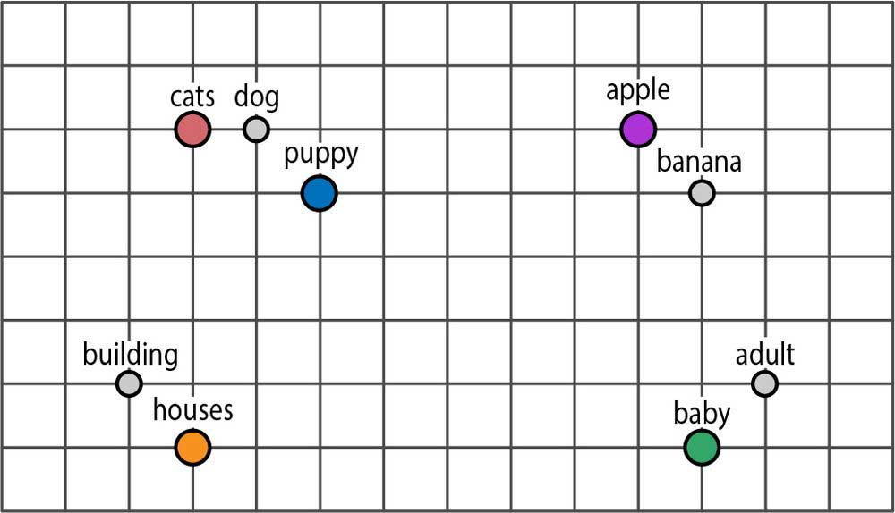

图1-9：相似词的词嵌入在高维空间中会彼此靠近

**1.2.3嵌入的类型**

如图1-10所示，有许多类型的嵌入，如词嵌入和句子嵌入，它们用于表示不同层次的抽象（词与句子）。

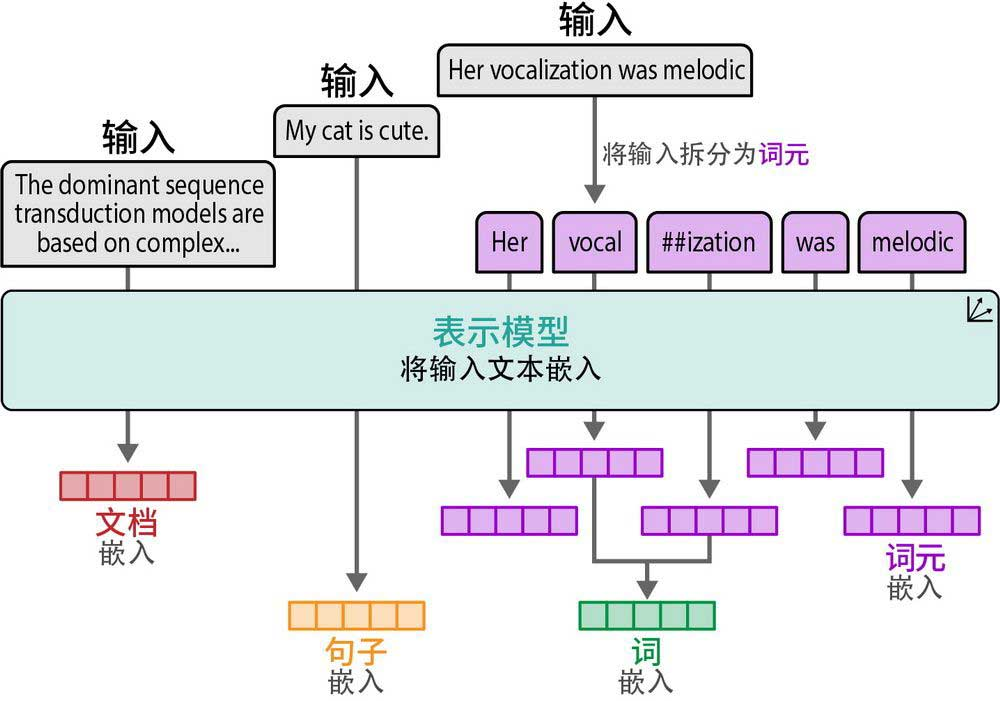

图1-10：可以为不同类型的输入创建嵌入

例如，词袋模型在文档层面创建嵌入，因为一个嵌入表示的是整个文档。相比之下，word2vec为每个词生成一个嵌入。

在本书中，嵌入将发挥核心作用，因为它们在许多用例中得到了应用，如分类（见第4章）、聚类（见第5章）以及语义搜索和检索增强生成（retrieval augmented generation，RAG）（见第8章）。在第2章中，我们将首先深入探讨词元嵌入（token embedding）。

**1.2.4使用注意力机制编解码上下文**

word2vec的训练过程会创建静态的、可下载的词表示。例如，bank这个词无论在什么上下文中使用，都会有相同的词嵌入。然而，bank既可以指银行，也可以指河岸。它的含义应该根据上下文而变化，因此它的嵌入也应该根据上下文而变化。

使用RNN（recurrent neural network，循环神经网络），可以实现文本编码的一个步骤。这些神经网络的变体可以将序列作为补充输入进行建模。

为此，这些RNN被用于两个任务：**编码，也就是表示输入句子；解码**，也就是生成输出句子。图1-11说明了这个概念，展示了如何将“I love llamas”（我喜欢美洲驼）这个英语句子翻译成荷兰语“Ik hou van lama's”。

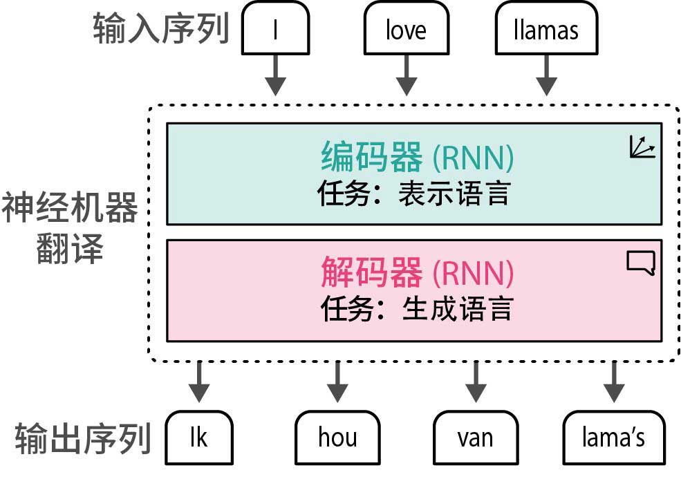

图1-11：两个RNN（解码器和编码器）将输入序列从英语翻译成荷兰语

该架构中的每个步骤都是**自回归**（auto-regressive）的。如图1-12所示，在生成下一个词时，该架构需要使用所有先前生成的词作为输入。

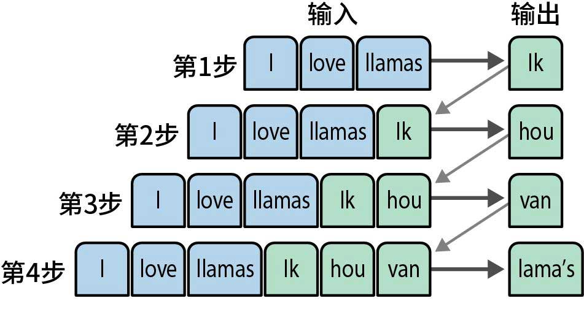

图1-12：每个之前输出的词元都被用作生成下一个词元的输入

上述编码步骤旨在尽可能准确地表示输入，以嵌入的形式生成上下文，作为解码器的输入。为了生成这种表示，它将嵌入作为词的输入，这意味着我们可以使用word2vec作为初始表示。在图1-13中，我们可以观察到这个过程。请注意输入是如何按顺序一次处理一个词的，输出也是如此。

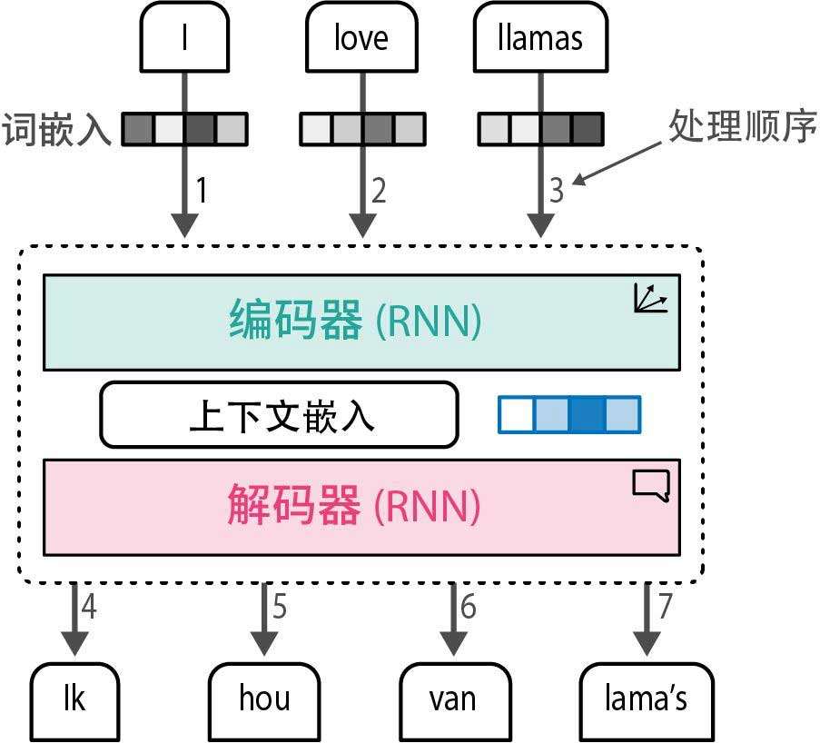

图1-13：使用word2vec嵌入，生成用于表示整个序列的上下文嵌入

1. Dzmitry Bahdanau, Kyunghyun Cho, and Yoshua Bengio. “Neural Machine Translation by Jointly Learning to Align and Translate.” arXiv preprint arXiv:1409.0473 (2014).

然而，这种上下文嵌入方式存在局限性，因为它仅用一个嵌入向量来表示整个输入，使得处理较长的句子变得困难。2014年，研究人员提出了**注意力**（attention）解决方案，大大改进了原始架构
 [](#footnote-9-92)。注意力允许模型关注输入序列中彼此相关（相互“注意”）的部分，并放大它们的信号，如图1-14所示。注意力机制通过选择性地聚焦于句子中最关键的词，来突出其重要性。

1. 即注意力权重或分数，后者均用这种简化表达。——编者注

例如，输出词lama's是荷兰语中llamas（美洲驼）的意思，这就是为什么两者之间的注意力
 [](#footnote-9-46)很高。反之，lama's和I这两个词之间的注意力较低，因为它们的相关性不大。在第3章中，我们将深入讨论注意力机制。

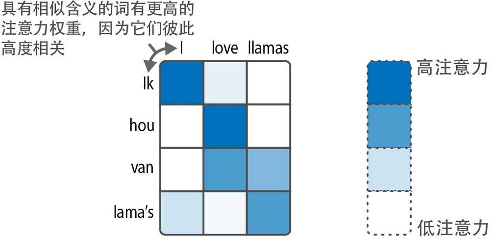

图1-14：注意力机制使模型能够“注意”序列中彼此相关程度更高或者更低的部分

通过在解码步骤中添加这些注意力机制，RNN可以为输入序列中的每个词生成与潜在输出相关的信号。这并不仅仅是将上下文嵌入传递给解码器，而是传递所有输入词的隐藏状态。这个过程如图1-15所示。

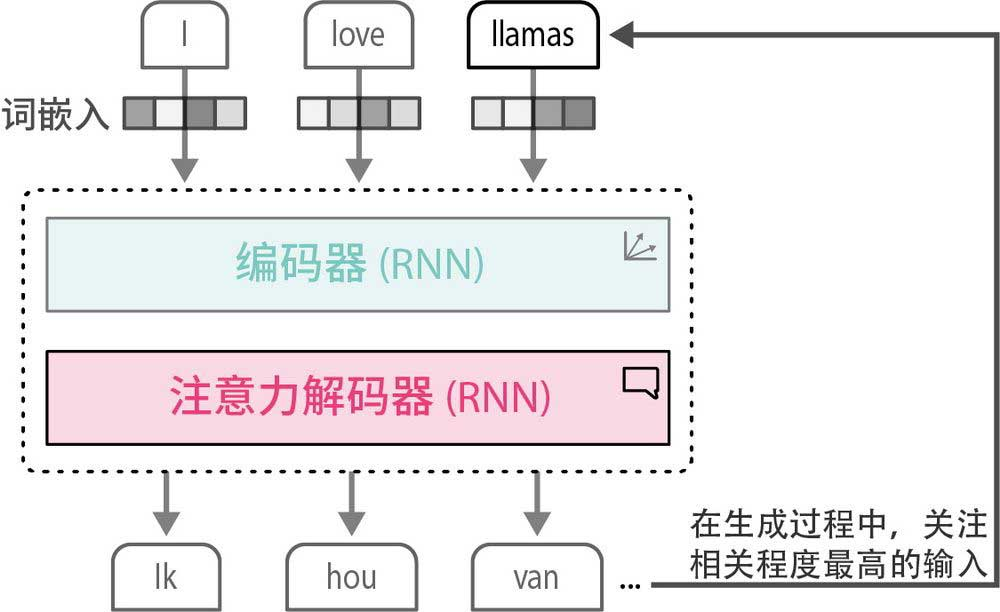

图1-15：在生成Ik、hou和van这些词之后，解码器的注意力机制使其能够关注到llamas这个词，进而生成它的荷兰语译文lama's

因此，在生成“Ik hou van lama's”的过程中，RNN会追踪它在进行翻译时主要关注的词。相比word2vec，基于注意力的RNN架构可以通过“关注”整个句子，更好地表征文本的序列特性及其上下文。然而，这种序列特性不利于模型训练过程中的并行化。

**1.2.5“AttentionIsAllYouNeed”**

1. Ashish Vaswani et al. “Attention is All You Need.” Advances in Neural Information Processing Systems 30 (2017).

2017年发表的著名论文“Attention is All You Need”
 [](#footnote-9-39)首次探讨了注意力机制的真正威力，以及驱动LLM展现出惊人能力的核心所在。作者提出了一种被称为Transformer（跟“变形金刚”是同一个英文单词）的网络架构，它完全基于注意力机制，摒弃了此前提到的RNN。与RNN相比，Transformer支持并行训练，这大大加快了训练速度。

在Transformer中，编码和解码组件相互堆叠，如图1-16所示。这种架构仍然是自回归的，每个新生成的词都被模型用于生成下一个词。

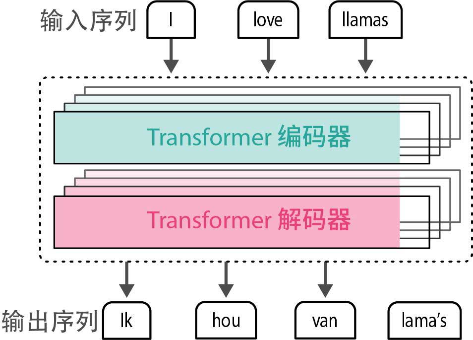

图1-16：Transformer由堆叠的编码器和解码器块组合而成，输入依次流经每个编码器和解码器

1. 原始的Transformer论文将注意力分为自注意力和交叉注意力。自注意力表示解码器层在生成一个词元时，与它之前已经生成的词元序列之间的关系，以及编码器层处理的输入序列内部的关系；而交叉注意力表示编码器层处理的输入序列和解码器层处理的输出序列之间的关系。从GPT开始，如今的大模型几乎都采用仅解码器架构，这意味着它们只使用自注意力机制。——译者注

我们看到，编码器和解码器块都围绕着注意力机制
 [](#footnote-9-22)展开，而不是利用带有注意力特征的RNN。Transformer中的编码器块由两部分组成：**自注意力（self-attention）和前馈神经网络**（feed-forward neural network），如图1-17所示。

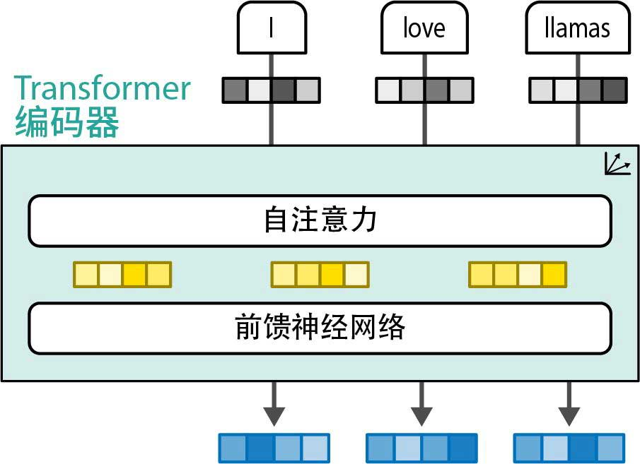

图1-17：编码器块围绕自注意力来生成中间表示

与之前的注意力方法相比，自注意力可以关注单个序列内部的不同位置，从而更高效且准确地表示输入序列，如图1-18所示。它可以一次性查看整个序列，而不是一次处理一个词元。

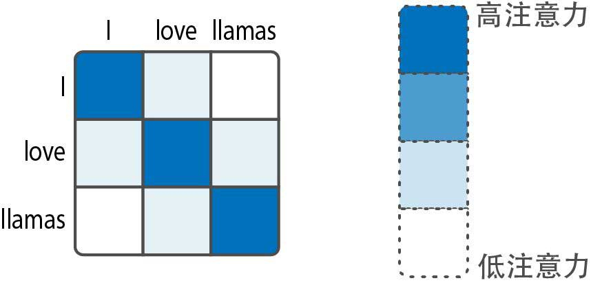

图1-18：自注意力机制能关注到输入序列的所有部分，使其可以在单个序列内同时“查看”前后文内容

与编码器相比，解码器多了一个注意力层，用于关注编码器的输出（以便找到输入中相关的部分）。如图1-19所示，这个过程类似于我们之前讨论过的RNN注意力解码器。

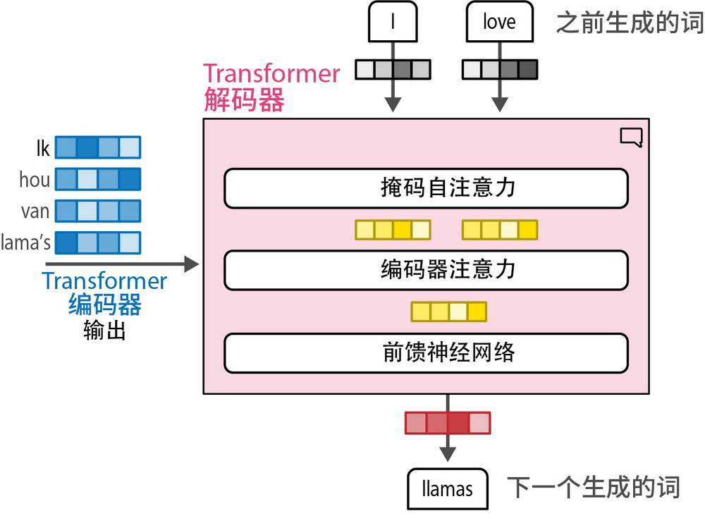

图1-19：解码器具有一个附加的注意力层，用于关注编码器的输出

如图1-20所示，解码器中的自注意力层会掩码未来的位置，这样在生成输出时就只会关注之前的位置，从而避免信息泄露。

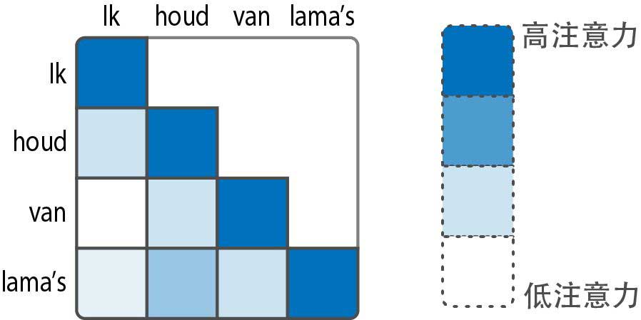

图1-20：仅关注之前的词元以避免“看到未来”

编码器、解码器这些模块共同构成了Transformer架构，是语言人工智能中许多影响深远的模型（如BERT和GPT-1）的基础，我们将在本章后面详细介绍。在本书中，我们使用的大多数模型是基于Transformer的。

关于Transformer架构，远不止我们目前探索的这些内容。在第2章和第3章中，我们将深入探讨Transformer模型如此成功的诸多原因，包括多头注意力（multi-head attention）、位置嵌入（positional embeddings）和层归一化（layer normalization）。

**1.2.6表示模型：仅编码器模型**

原始的Transformer模型是一个编码器 - 解码器架构，虽然非常适合翻译任务，但难以用于其他任务，比如文本分类。

1. Jacob Devlin et al. “BERT: Pre-Training of Deep Bidirectional Transformers for Language Understanding.” arXiv preprint arXiv:1810.04805 (2018).

2018年，研究人员提出了一种名为BERT（bidirectional encoder representations from Transformers，基于Transformer的双向编码器表示）的新架构，它可以应用于各种任务，并在未来几年成为语言人工智能的基石
 [](#footnote-9-133)。如图1-21所示，BERT是一个仅编码器架构，专注于语言表示。这意味着它只使用编码器，完全移除了解码器。

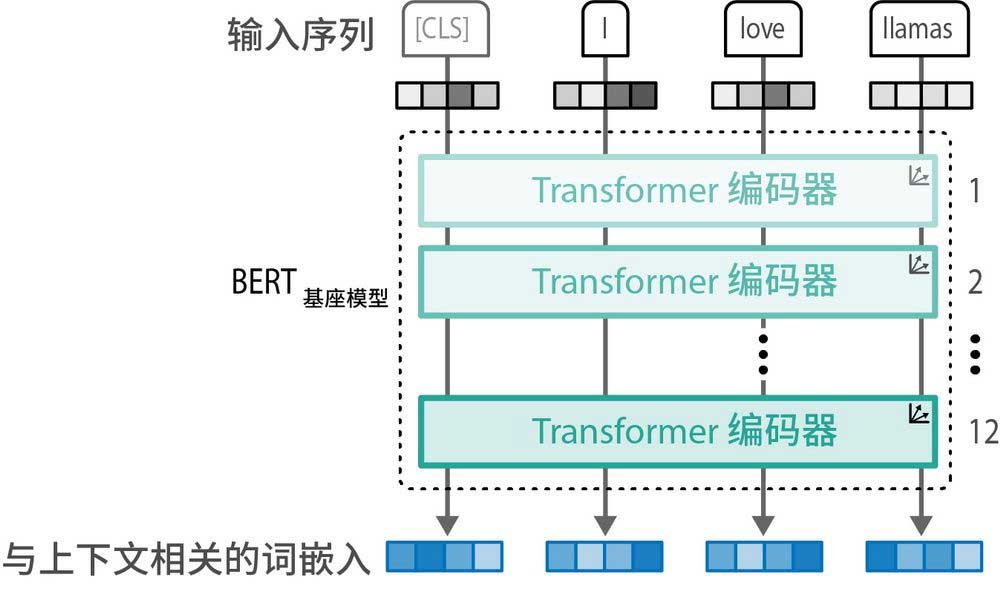

图1-21：BERT基座模型的架构，包含12个编码器

这些编码器模块与我们之前看到的相同：在自注意力层之后，接上前馈神经网络。输入中包含一个附加词元——[CLS]（分类词元），用于表示整个输入。通常，我们使用[CLS]词元作为输入嵌入（input embedding），用于在特定任务（如分类）上进行模型微调。

这些堆叠起来的编码器很难训练，因此BERT采用了一种被称为**掩码语言建模**（masked language modeling）的技术来解决这个问题（见第2章和第11章）。如图1-22所示，该方法会掩码部分输入，让模型预测被掩码的部分。这样的预测任务虽然困难，但能让BERT为输入序列创建更准确的（中间）表示。

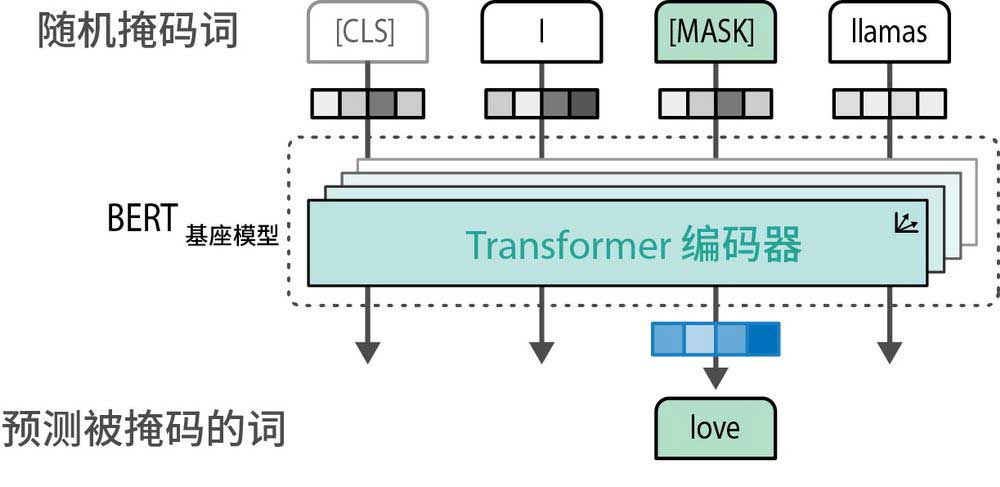

图1-22：用掩码语言建模方法训练BERT模型

这种架构和训练过程使BERT及相关架构在表示依赖上下文的文本方面表现十分出色。BERT类模型通常用于**迁移学习（transfer learning），这包括首先针对语言建模进行预训练（pretraining），然后针对特定任务进行微调**（fine-tuning）。例如，通过在整个维基百科的文本数据上训练BERT，它学会了理解文本的语义和上下文性质。然后，如图1-23所示，我们可以使用该预训练模型，针对特定任务（如文本分类）进行微调。

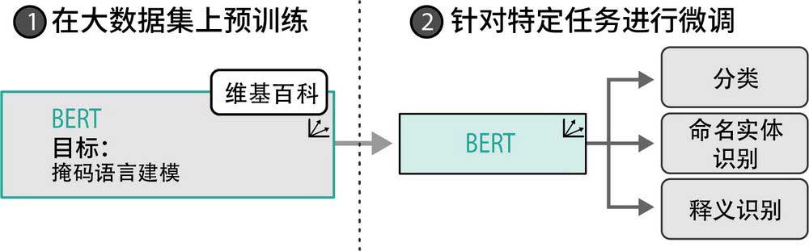

图1-23：在掩码语言模型上预训练BERT后，我们针对特定任务对其进行微调

预训练模型的一个巨大优势是大部分训练工作已经完成。针对特定任务的微调通常计算量较小，且需要的数据更少。此外，BERT类模型架构在处理过程中的几乎每一步都会生成嵌入，这使得BERT模型成为通用特征提取器，无须针对特定任务进行微调。

像BERT这样的仅编码器模型将在本书的多个章节中使用。多年以来，它们一直被用于常见任务，包括分类任务（见第4章）、聚类任务（见第5章）和语义搜索（见第8章）。

在本书中，我们将仅编码器模型称为**表示模型（representation model），以区别于仅解码器模型；将仅解码器模型称为生成模型**（generative model）。需要注意的是，表示模型和生成模型的主要区别并不在于底层架构和工作方式。表示模型主要关注语言的表示，例如创建嵌入，而通常不生成文本；相比之下，生成模型主要关注生成文本，通常不会被训练用于生成嵌入。

表示模型和生成模型及其组件的区别也会体现在本书的大多数图片中。表示模型用蓝绿色表示，配有一个小向量图标（表示其关注向量和嵌入）；而生成模型用粉红色表示，配有一个小对话图标（表示其生成能力）。

**1.2.7生成模型：仅解码器模型**

1. Alec Radford et al. “Improving Language Understanding by Generative Pre-Training”, (2018).

与BERT的仅编码器架构类似，2018年出现了一种用于处理生成任务的仅解码器架构—— GPT
 [](#footnote-9-46)（生成式预训练Transformer，现在被称为GPT-1，以区别于后续版本）。GPT因其生成能力而得名。如图1-24所示，它与BERT编码器堆叠架构类似，堆叠了多个解码器块。

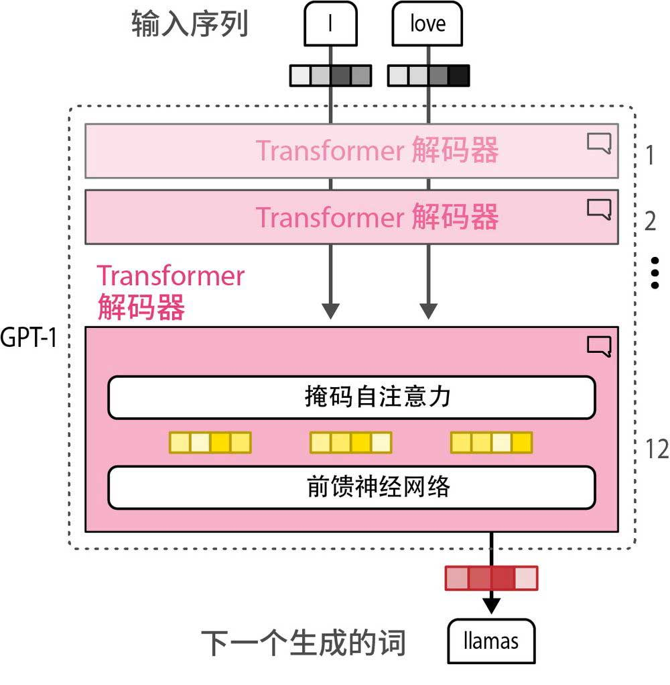

图1-24：GPT-1架构。GPT-1使用了仅解码器架构，去掉了编码器注意力块

GPT-1在7000本图书和Common Crawl（一个大型网页数据集）上进行训练。最终模型包含1.17亿个参数。每个参数都是一个数值，代表着模型对语言的理解。

1. Alec Radford et al. “Language Models are Unsupervised Multitask Learners.” OpenAI Blog 1.8 (2019): 9.

1. Tom Brown et al. “Language Models are Few-Shot Learners.” Advances in Neural Information Processing Systems 33 (2020): 1877-1901.

假设其他条件相同，我们预计更多的参数能显著提升语言模型的能力和性能。考虑到这一点，我们已经看到新发布的模型越来越大，模型规模稳步提升。如图1-25所示，GPT-2有15亿个参数
 [](#footnote-9-88)，GPT-3则有1750亿个参数
 [](#footnote-9-105)。

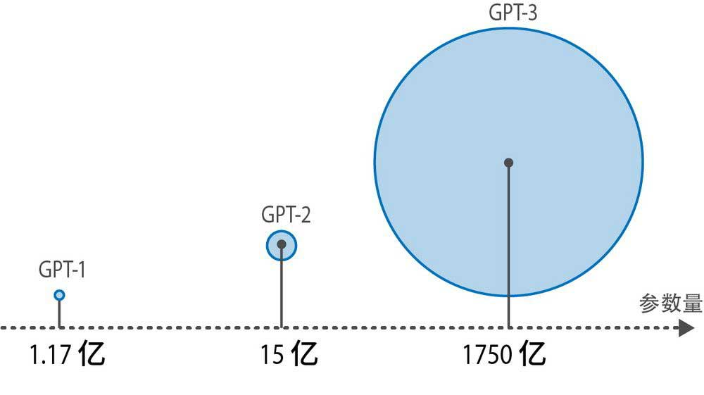

图1-25：GPT模型的规模迅速增长

这些生成式仅解码器模型，特别是“更大”的模型，通常被称为大语言模型（LLM）。正如我们将在本章后面讨论的，LLM这个术语不仅仅指代生成模型（仅解码器），也包括表示模型（仅编码器）。

生成式LLM作为一种序列到序列（sequence-to-sequence，Seq2Seq）的文本生成系统，其核心机制是接收文本输入并尝试自动补全。尽管自动补全功能很实用，但这类模型真正的强大之处在于经过训练成为聊天机器人。与其只是补全文本，不如将它们训练得能够回答问题。通过微调这些模型，我们可以创建能够遵循人类指示的**指令模型（instruct model）或对话模型**（chat model）。

如图1-26所示，由此创建的模型接收用户查询（提示词，prompt），输出最可能符合该提示词的响应。因此，你经常会听到生成模型被称为**补全模型**（completion model）。

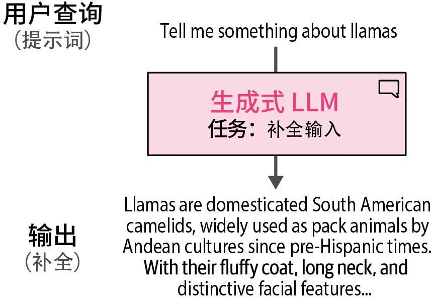

图1-26：生成式LLM接收输入并尝试补全。对于指令模型来说，则不仅仅是自动补全，而是试图回答问题

这些补全模型的一个要素是所谓的**上下文长度（context length），也称为上下文窗口**（context window）。如图1-27所示，上下文长度代表模型可以处理的最大词元数量。如果我们有较大的上下文长度，就可以将整个文档传递给LLM。需要注意的是，由于这些模型的自回归特性，当生成新的词元时，当前的上下文长度会增加。

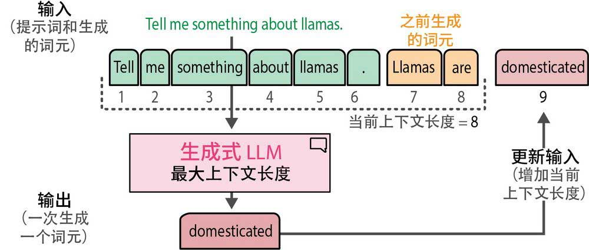

图1-27：上下文长度是LLM能处理的最长上下文

**1.2.8生成式AI元年**

1. OpenAI,“GPT-4 Technical Report.” arXiv preprint arXiv:2303.08774 (2023).

LLM对AI领域产生了巨大影响，随着ChatGPT（GPT-3.5）的发布、普及和媒体关注，一些人将2023年称为“生成式AI元年”。当我们提到ChatGPT时，我们实际上指的是这款产品而非其底层模型。它最初由GPT-3.5 LLM驱动，此后又发展出了几个性能更强的版本，如GPT-4
 [](#footnote-9-142)。

在生成式AI元年，产生影响力的模型不只是GPT-3.5。如图1-28所示，开源和专有的LLM都以惊人的速度走入大众视野。这些开源基座模型通常被称为**基础模型**（foundation model），可以针对特定任务，比如遵循指令进行微调。

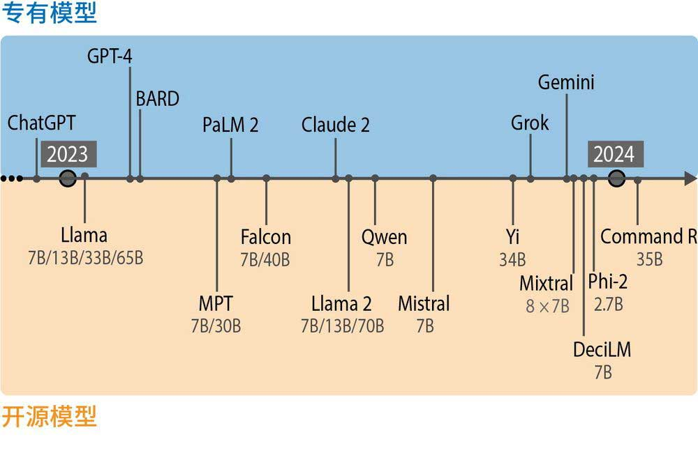

图1-28：生成式AI元年全景图。注意：图中仍有许多模型未列出

1. Albert Gu and Tri Dao. “Mamba: Linear-Time Sequence Modeling with Selective State Spaces.” arXiv preprint arXiv:2312.00752 (2023). 另参见“A Visual Guide to Mamba and State Space Models”，这是一份关于Mamba作为Transformer架构替代方案的图解和可视化指南。

1. Bo Peng et al. “RWKV: Reinventing RNNs for the Transformer Era.” arXiv preprint arXiv:2305.13048 (2023).

除了广受欢迎的Transformer架构外，还出现了一些有前景的新架构，如Mamba
 [](#footnote-9-42)和RWKV
 [](#footnote-9-48)。这些新型架构试图在达到Transformer级别的性能的同时，还有额外的优势，比如更大的上下文窗口或更快的推理速度。

这些模型和架构的发展是LLM领域进展的缩影，由此可见，2023年确实是AI发展突飞猛进的一年。我们竭尽全力才能跟上语言人工智能领域内外的众多进展。

### 1.3 “LLM”定义的演变

在我们回顾语言人工智能的近期历史时，我们观察到主要是生成式的仅解码器（Transformer）模型被称为LLM。很多人认为LLM的关键特点就是“大”，但在实践中，这样的描述显然有局限性。

如果我们创建一个与GPT-3能力相当但参数量减少到原来的1/10的模型，这样的模型是否就不属于“LLM”的范畴了？

同样，如果我们发布一个与GPT-4同等规模的模型，它能够进行准确的文本分类，但没有生成能力，那么它还能被称为“LLM”吗？即使它的主要功能不是语言生成，但它仍然可以表示文本。

这类定义的问题在于我们排除了一些能力很强的模型。无论我们给某个模型起什么名字，都不会改变它的行为方式。

由于“LLM”这个术语的定义随着新模型的发布而不断演变，我们需要明确说明它在本书中的含义。“大”的定义是相对的，今天被认为“大”的模型，明天可能就显得很小了。目前同一事物有很多不同的称呼，对我们来说，“LLM”也包括那些不生成文本且可以在消费级硬件上运行的模型。

因此，除了涵盖生成模型，本书还将介绍参数少于10亿且不生成文本的模型。我们将探索如何使用其他模型，如嵌入模型、表示模型，甚至词袋，来增强LLM的能力。

### 1.4 LLM的训练范式

传统机器学习通常是为特定任务（如分类）训练模型。如图1-29所示，我们认为这是一个单步过程。


图1-29：传统机器学习是一个单步过程：为特定任务（如分类或回归）训练模型

相比之下，创建LLM通常包含至少两个步骤。

### 语言建模

第一步称为**预训练**，占用了创建LLM过程中的大部分算力和训练时间。LLM在海量互联网文本语料库上进行训练，使模型能够学习语法、上下文和语言模式。这个宽泛的训练阶段并不是针对特定任务或应用的，而仅仅用于预测下一个词。由此产生的模型通常被称为基础模型或基座模型。这些模型通常不会遵循指令。

# 微调

1. Hugo Touvron et al. “Llama 2: Open Foundation and Fine-Tuned Chat Models.” arXiv preprint arXiv:2307.09288 (2023).

第二步是**微调，有时也称为后训练**（post-training），包括使用先前训练好的模型，并在更具体的任务上进行进一步训练。这使得LLM能够适应特定任务或展现符合人们期望的行为。例如，我们可以微调一个基座模型，使其在分类任务上表现良好或遵循指令。这可以节省大量资源，因为预训练阶段成本相当高，通常需要大多数人和组织难以企及的数据和计算资源。例如，Llama 2在包含2万亿词元的数据集上进行训练
 [](#footnote-9-196)。想象一下创建该模型所需的计算资源！在第12章中，我们将介绍几种在你的数据集上微调基础模型的方法。

对于任何经过第一步（预训练）的模型，我们都称之为预训练模型，这也包括经过微调的模型。这种两步训练方法如图1-30所示。

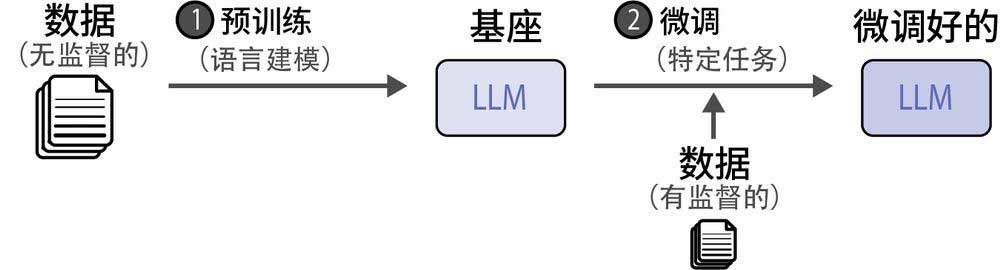

图1-30：与传统机器学习相比，LLM训练采用多步方法

如第12章所述，可以添加微调步骤来进一步使模型与用户偏好对齐。

### 1.5 LLM的应用

借助文本生成能力和提示词，LLM适用于广泛的任务，似乎限制它应用范围的只有人的想象力。让我们探索一些常见任务和技术来说明这一点。

检测客户评论是正面的还是负面的

这是（有监督的）分类任务，可以使用仅编码器和仅解码器模型来处理，既可以使用预训练模型（参见第4章），也可以使用微调模型（参见第11章）来完成。

开发一个系统，找出主题相同的工单问题

这是（无监督的）分类任务，没有预定义的标签。我们可以利用仅编码器模型来执行分类本身，并使用仅解码器模型来标记主题（参见第5章）。

构建一个用于检索和查看相关文档的系统

语言模型系统的一大重要特性是能够整合外部信息资源。使用语义搜索，我们可以构建系统，让LLM轻松访问和查找信息（参见第8章）。还可以通过创建或微调自定义嵌入模型来改进系统（参见第12章）。

构建一个能利用外部资源（如工具和文档）的LLM聊天机器人

这一应用是多种技术的组合，展示了如何通过外部组件来发挥LLM的真正潜力。提示工程（参见第6章）、RAG（参见第8章）和微调LLM（参见第12章）等方法都是LLM拼图的一部分。

构建一个能够根据冰箱中的食材图片生成食谱的LLM

这是一个多模态任务，LLM需要输入图像并对所看到的图像进行推理（参见第9章）。LLM正在被扩展到视觉等其他模态，这带来了各种有趣的用例。

创建LLM应用是极具吸引力的，因为在一定程度上，这些应用的能力仅仅受限于你的想象力。随着这些模型变得更加准确，我们将能够把模型应用于各种创新的场景，例如角色扮演和编写儿童读物，这将十分有趣。

### 1.6 开发和使用负责任的LLM

LLM的广泛应用已经带来深远的影响，且这种影响很可能越来越显著。在我们探索LLM令人难以置信的能力时，我们应该牢记它们的社会和伦理影响。以下是几个需要考虑的关键点。

偏见和公平性

LLM在训练时使用了大量可能包含偏见的数据。模型可能会从这些偏见中学习，再现乃至放大这些偏见。由于训练LLM的数据集很少公开，除非亲自尝试，否则很难明确它们可能包含哪些偏见。

透明度和问责制

由于LLM具有令人难以置信的能力，在与之交互时，我们并不总是能清楚分辨是在与人类还是模型对话。因此，当没有人类参与时，在人机交互中使用LLM可能会产生意想不到的后果。例如，在医疗领域使用的基于LLM的应用可能会被归类为医疗设备，因为它们可能会影响患者的健康。

有害内容

LLM生成的内容不一定是真实的，且它们可能“自信地”输出错误的文本。此外，它们还可能被用于生成假新闻、文章和其他具有误导性的信源。

知识产权

LLM输出内容的知识产权应该归属于你，还是模型创造者？当输出与训练数据中的某个短语相似时，知识产权是否属于该短语的作者？由于大多数情况下我们无法访问训练数据，我们很难确定模型何时使用了受版权保护的材料。

监管

由于LLM的巨大影响力，各国政府开始对商业应用进行监管。例如欧盟《人工智能法案》，该法案对包括LLM在内的基础模型的开发和部署进行监管。

我们要强调在开发和使用LLM时道德规范的重要性，敦促你多了解如何安全、负责任地使用LLM和人工智能系统。

### 1.7 有限的资源就够了

我们之前多次提到的计算资源通常是指系统中可用的GPU（graphics processing unit，图形处理单元，通常称显卡）资源。强大的GPU可以加速LLM的训练和使用。

在选择GPU时，一个重要的因素是可用的VRAM（video random access memory，视频随机存储器，通常称显存）容量，即GPU上可用的内存量。实践中，显存越大越好。原因是如果没有足够的显存，某些模型根本无法使用。

1. 这些模型的训练总共花费了3311616 GPU时，即单块GPU训练模型花费的时间乘以可用的GPU数量。

由于训练和微调LLM需要高昂的GPU成本，那些没有强大的GPU的人常被称为“GPU穷人”（GPU-poor）。这反映了训练这些庞大的模型时对计算资源的激烈争夺。例如，为了训练Llama 2系列模型，Meta使用了A100 80 GB GPU。假设租用一块这样的GPU成本是每小时1.50美元，训练Llama 2模型的总成本将超过500万美元
 [](#footnote-9-170)！

遗憾的是，不存在一种统一的规则，可以确定一个特定的模型需要多少显存。这取决于模型的架构和规模、压缩技术、上下文长度、运行模型的后端等因素。

本书正是为“GPU穷人”写的。我们将使用那些不需要最昂贵的GPU或高昂的预算就能运行的模型。为此，我们会在Google Colab实例中提供所有代码。在撰写本书时，免费的Google Colab实例提供了带有16 GB显存的T4 GPU，这是我们建议的最低显存容量。

### 1.8 与LLM交互

与LLM交互不仅可以让我们更好地使用它们，也是理解其内部工作原理的关键。由于LLM领域发展迅速，现已出现大量用来与LLM通信的技术、方法和软件包。在本书中，我们将探讨最常用的技术，包括使用专有（闭源）和公开可用的开源模型。

**1.8.1专有模型**

专有模型是闭源模型的一种。闭源LLM是指不向公众公开其权重和架构的模型。专有模型由特定组织开发，其底层代码保密。此类模型的例子包括OpenAI的GPT-4和Anthropic的Claude。专有模型通常有强大的商业支持，并已在其服务中进行了开发和集成。

你可以通过一个与LLM通信的接口（称为API，application program interface，应用程序接口）来访问这些模型，如图1-31所示。例如，要在Python中使用ChatGPT，你可以使用OpenAI的软件包来与服务交互，而无须直接访问它。


图1-31：专有LLM通过API访问。因此，LLM本身的细节，包括其代码和架构，都不会与用户共享

专有模型的一个巨大优势是用户无须拥有强大的GPU就能使用LLM。服务提供商负责托管和运行模型，而且通常拥有更多的计算资源。用户也无须具备托管和使用模型的专业知识，这显著降低了使用门槛。此外，由于相关组织的大量投资，专有模型往往比开源模型性能更强。

专有模型的一个缺点是LLM API服务可能成本较高。提供商承担托管LLM的风险和成本，这通常意味着需要付费使用。而且，由于无法直接访问模型的权重，用户也无法自行微调模型。最后，用户的数据会与提供商共享，在许多常见的应用场景中，这可能是用户不希望发生的，比如共享患者数据。

**1.8.2开源模型**

开源LLM是指向公众共享其权重和架构的模型。它们仍然由特定组织开发，但通常会共享用于创建或本地运行模型的代码。开源LLM具有不同级别的许可方式，有的允许模型的商业使用，有的不允许。Cohere的Command R、Mistral系列模型、微软的Phi和Meta的Llama系列模型都是开源模型。


 对于什么才是真正的开源模型，目前业界尚未达成共识。例如，一些公开共享的模型具有限制性商业许可，这意味着该模型不能用于商业目的。对许多人来说，这并不符合开源的真正定义，因为使用这些模型不应该有任何限制。此外，模型训练所用的数据及其源代码也很少开源。

只要你有能够处理这类模型的强大GPU，就可以下载这些模型并在自己的设备上使用，如图1-32所示。

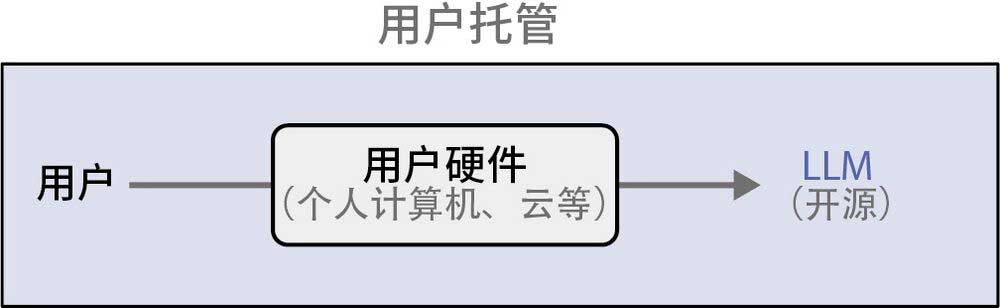

图1-32：开源LLM由用户直接使用。因此，LLM本身的细节（包括其代码和架构）都是与用户共享的

本地模型的一个主要优势是用户可以完全控制模型。你可以在不依赖API连接的情况下使用模型，对其进行微调，并通过它处理敏感数据。你不依赖于任何服务，并且可以完全透明地了解模型产生输出的过程。大型社区的支持进一步突出了这一优势，比如Hugging Face，展示了基于开源模型开展社区合作的可能性。

开源LLM的一个缺点是你需要强大的硬件来运行，在训练或微调时甚至需要更强大的硬件。此外，配置和使用这些模型需要特定的知识（我们将在本书中详细介绍）。

我们通常倾向于尽可能使用开源LLM。这种方式带来了更高的自由度，可以尝试各种选项、探索模型的内部工作原理以及本地使用模型，可以说，比使用闭源LLM好处更多。

**1.8.3开源框架**

与闭源LLM相比，开源LLM需要你使用某些软件包来运行它们。在2023年，大量软件包和框架面世，它们以各自的方式与LLM交互。从成百上千个框架中筛选合适的框架，不是什么令人愉快的体验。因此，你可能会发现本书遗漏了你最喜欢的框架。

我们不会试图涵盖所有现存的LLM框架（数量太多，而且还在持续增长），而是致力于为你打下利用LLM的坚实基础。我们的想法是，在阅读完本书后，你可以轻松上手大多数其他框架，因为它们的工作方式非常相似。

本书以直观理解为先的理念是这一过程的重要一环。如果你不仅对LLM有直观的理解，还熟悉常见框架的使用，那么转向其他框架应该是比较简单的。

具体来说，我们专注于后端软件包。这些是没有GUI（graphical user interface，图形用户界面）的软件包，专门用于在你的设备上高效加载和运行LLM，比如llama.cpp、LangChain，以及许多框架的核心Hugging Face Transformers。


 我们主要介绍通过代码与LLM交互的框架。虽然这有助于你学习这些框架的基础知识，但有时你可能只想要一个类似ChatGPT的本地LLM界面。幸好，有许多出色的框架可以实现这一点，例如text-generation-webui、KoboldCpp和LM Studio。

### 1.9 生成你的第一段文本

使用语言模型的一个重要步骤是选择模型。查找和下载LLM的一个重要网站是Hugging Face。Hugging Face是著名的Transformers软件包背后的组织，多年来一直推动着语言模型的整体发展。正如其名称所示，该软件包是建立在我们在此前提到过的transformers框架之上的。

在撰写本书时，Hugging Face平台上已有超过80万个模型，用途各种各样，从LLM，到计算机视觉模型，再到处理音频和表格数据的模型。在这个平台上，你几乎可以找到任何开源的LLM。

1. Marah Abdin et al. “Phi-3 Technical Report: A Highly Capable Language Model Locally on Your Phone.” arXiv preprint arXiv:2404.14219 (2024).

虽然本书会介绍各种模型，但让我们先用一个生成模型开始我们的第一行代码。我们在本书中使用的主要生成模型是Phi-3-mini，这是一个相对较小（38亿参数）但性能相当不错的模型
 [](#footnote-9-87)。由于其体积小，该模型可以在显存小于8 GB的设备上运行。如果你进行量化（一种压缩方式，我们将在第7章和第12章中进一步讨论），甚至可以使用小于6 GB的显存。此外，该模型采用MIT许可证，允许不受限地将模型用于商业用途。

请注意，新的、功能更强大的LLM会频繁发布。为确保本书保持时效性，本书设计的大多数示例适用于任何LLM。我们还会在本书关联的代码仓库中为你推荐多个可供尝试的模型。

让我们开始吧！当你使用LLM时，需要加载两个模型：

·生成模型本身

·其底层的分词器（tokenizer）

分词器负责在将输入文本送入生成模型之前，将其分割成词元。你可以在Hugging Face网站上找到分词器和模型，只需传入相应的ID即可。在本例中，我们使用microsoft/Phi-3-mini-4k-instruct作为模型的主路径。

我们可以使用transformers来加载分词器和模型。注意，我们假设你有NVIDIA GPU（device_map="cuda"），但你也可以选择其他设备。如果你没有GPU，可以使用我们在本书代码仓库中提供的免费Google Colab笔记本：

```
from transformers import AutoModelForCausalLM, AutoTokenizer
# 加载模型和分词器
model = AutoModelForCausalLM.from_pretrained(
    "microsoft/Phi-3-mini-4k-instruct",
    device_map="cuda",
    torch_dtype="auto",
    trust_remote_code=True,
)
tokenizer = AutoTokenizer.from_pretrained("microsoft/Phi-3-mini-4k-instruct")
```

运行上述代码将开始下载模型，具体耗时取决于你的网络连接速度，可能需要几分钟。

虽然我们现在已经具备了生成文本的基本条件，但transformers库中还有一个很棒的技巧可以简化这个过程，那就是transformers.pipeline。它将模型、分词器和文本生成过程封装成一个单一的函数：

```
from transformers import pipeline
# 创建流水线
generator = pipeline(
    "text-generation",
    model=model,
    tokenizer=tokenizer,
    return_full_text=False,
    max_new_tokens=500,
    do_sample=False
)
```

以下参数值得注意。

return_full_text

将其设置为False时，只返回模型的输出结果，而不包含提示词。

max_new_tokens

允许模型生成的最大词元数。通过设置限制，我们可以避免过长的输出和异常的输出，因为某些模型可能会一直生成输出，直到达到它们的上下文窗口限制。

do_sample

决定模型是否使用采样策略来选择下一个词元。将其设置为False时，模型将始终选择概率最高的下一个词元。在第6章中，我们将探讨几个采样参数，这些参数可以为模型的输出增添一些创造性。

为了生成我们的第一段文本，让我们指示模型讲一个关于鸡的笑话。为此，我们将提示词格式化为字典列表，其中每个字典都与对话中的一个实体相关。我们的角色是user，使用content键来定义我们的提示词：

```
# 提示词（用户输入/查询）
messages = [
    {"role": "user", "content": "Create a funny joke about chickens."}
]
# 生成输出
output = generator(messages)
print(output[0]["generated_text"])
Why don't chickens like to go to the gym? Because they can't crack the eggsistence of it!
```

就是这样！这是本书中我们用LLM生成的第一段文本，一个关于鸡的不错的笑话。

### 1.10 小结

在本章中，我们深入探讨了LLM对语言人工智能领域产生的革命性影响。它显著改变了我们处理翻译、分类、摘要等任务的方式。通过回顾语言人工智能的近期发展史，我们探索了几种LLM的基础知识，从简单的词袋表示到使用神经网络的更复杂的表示。

我们讨论了注意力机制，作为在模型中编码上下文的一个重要步骤，这是LLM如此强大的关键原因。我们简要介绍了使用这种强大机制的两大类模型：表示模型（仅编码器，如BERT）和生成模型（仅解码器，如GPT系列模型）。在本书中，这两类模型都被视为LLM。

总的来说，本章概述了语言人工智能的整体情况，包括其应用、社会影响和伦理影响，以及运行这类模型所需的资源。最后，我们使用Phi-3模型生成了我们的第一段文本，这个模型的使用将贯穿全书。

在接下来的两章中，你将了解一些底层过程。我们首先在第2章探讨词元和嵌入，这是语言人工智能领域两个经常被低估但至关重要的组成部分。随后在第3章，我们将深入探讨语言模型，这时你将学会生成文本的具体方法。


---

## 第2章 词元和嵌入

**词元和嵌入**是使用LLM的两个核心概念。正如我们在第1章所见，它们对理解语言人工智能的历史至关重要，而且如图2-1所示，如果没有对词元和嵌入的深入理解，我们就无法清楚地了解LLM的工作原理、构建方式及其未来的发展方向。

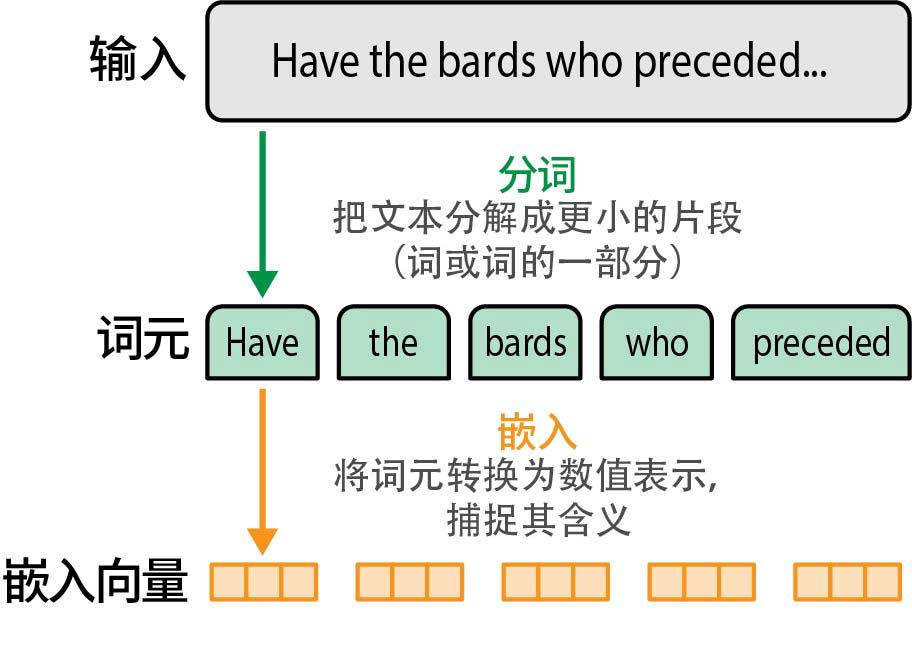

图2-1：语言模型处理文本时会将其分成小块，称为词元。为了理解自然语言，语言模型需要将词元转换为数值表示，即嵌入向量

本章我们将深入探讨词元的本质以及LLM使用的分词方法。然后，我们将探讨著名的word2vec嵌入方法，它是现代LLM的先驱。我们将了解word2vec如何扩展**词元嵌入**（token embedding）的概念，来构建商业推荐系统，我们使用的许多互联网应用都是由推荐系统支持的。最后，我们将从词元嵌入过渡到句子或文本嵌入，即整个句子或文档可以用一个向量来表示——这为本书第二部分将要介绍的语义搜索和主题建模等应用奠定了基础。

### 2.1 LLM的分词

在撰写本书时，大多数人与语言模型交互的方式是通过网页平台，它提供用户与语言模型之间的聊天界面。你可能会注意到，模型并不是一次性生成所有输出，而是一次生成一个词元。

词元不仅是模型的输出单位，也是模型查看输入的方式。发送给模型的提示词首先被分解成词元，我们接下来将对此进行讨论。

**2.1.1分词器如何处理语言模型的输入**

从外部来看，生成式LLM接收输入提示词并生成响应，如图2-2所示。

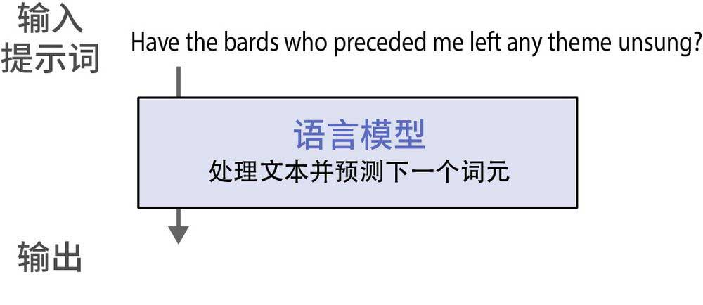

图2-2：语言模型及其输入提示词的架构图

1. 目前OpenAI平台默认展示的是GPT-4o和GPT-4o mini模型的分词器，它们是GPT-4的下一代模型。——译者注

然而，在将提示词呈现给语言模型之前，它首先要通过分词器将其分解成片段。你可以在OpenAI平台上找到GPT-4分词器的示例
 [](#footnote-10-61)。在文本框中输入文本，它会显示如图2-3中的输出，其中词元以不同的颜色显示。

让我们看一个代码示例，并亲自与这些词元进行交互。在这里，我们将下载一个LLM，并了解如何在使用LLM生成文本之前对输入进行分词。

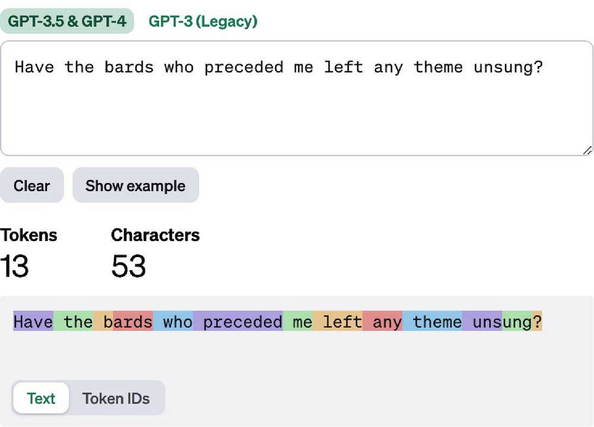

图2-3：在模型处理文本之前，分词器会将文本分解成词或子词。这是根据特定的方法和训练过程进行的（图片来源：OpenAI平台官网）

**2.1.2下载和运行LLM**

让我们首先像第1章那样，加载模型及其分词器：

```
from transformers import AutoModelForCausalLM, AutoTokenizer
# 加载模型及其分词器
model = AutoModelForCausalLM.from_pretrained(
    "microsoft/Phi-3-mini-4k-instruct",
    device_map="cuda",
    torch_dtype="auto",
    trust_remote_code=True,
)
tokenizer = AutoTokenizer.from_pretrained("microsoft/Phi-3-mini-4k-instruct")
```

然后我们就能进行实际的生成了。首先声明提示词，然后对其进行分词，再将这些词元传递给模型，模型随后生成输出。在这个例子中，我们要求模型只生成20个新词元：

```
prompt = "Write an email apologizing to Sarah for the tragic gardening mishap.
Explain how it happened.<|assistant|>"
# 对输入提示词进行分词
input_ids = tokenizer(prompt, return_tensors="pt").input_ids.to("cuda")
# 生成文本
generation_output = model.generate(
  input_ids=input_ids,
  max_new_tokens=20
)
# 打印输出
print(tokenizer.decode(generation_output[0]))
<s> Write an email apologizing to Sarah for the tragic gardening mishap.
Explain how it happened.<|assistant|> Subject: My Sincere Apologies for the
Gardening Mishap
Dear
```

### 输出：

粗体文本是模型生成的20个词元。

从代码中可以看到，模型实际上并没有直接处理提示词文本。相反，输入提示词是由分词器处理的。分词器在变量input_ids中返回了模型所需的信息，随后模型将其用作输入。

让我们打印input_ids看看它包含什么：

```
tensor([[ 1, 14350, 385, 4876, 27746, 5281, 304, 19235, 363, 278, 25305, 293,
16423, 292, 286, 728, 481, 29889, 12027, 7420, 920, 372, 9559, 29889, 32001]],
device='cuda:0')
```

这就是LLM输出的响应，如图2-4所示的一系列整数。每个整数都是特定词元（字符、词或词的一部分）的唯一ID。这些ID是分词器内部的一张词元表的索引，该表包含了分词器能够识别的所有词元。

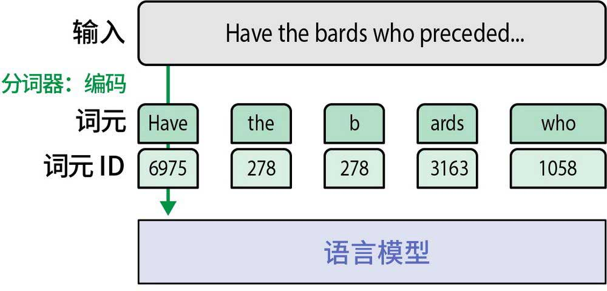

图2-4：分词器处理输入提示词，得到词元ID列表，这就是语言模型的实际输入。图中显示的具体词元ID仅作示例

如果想查看这些ID，可以使用分词器的decode方法将ID转换回人类可阅读的文本：

```
for id in input_ids[0]:
    print(tokenizer.decode(id))
```

这会得到以下输出（每个词元占一行）：

```
<s>
Write
email
apolog
izing
to
Sarah
the
trag
ic
garden
ing
ish
ap
Exp
lain
how
it
happened
<|assistant|>
```

### an

### for

### m

### .

### .

这就是分词器分解输入提示词的过程。需要注意以下几点：

·第一个词元是ID 1（<s>），这是一个表示文本开始的特殊词元；

·一些词元是完整的单词（例如Write、an、email）；

·一些词元是单词的部分（例如apolog、izing、trag、ic）；

·标点符号是独立的词元。

注意空格字符不用单独的词元表示，代表词的一部分的词元（如izing和ic）在开头有一个特殊的隐藏字符，表示它们与文本中前面的词元相连。没有这个特殊字符的词元前面则都被视为有一个空格。

在输出端，我们也可以通过打印generation_output变量来查看模型生成的词元。打印的内容同时包括输入词元和输出词元（我们将新词元用粗体突出显示）：

```
tensor([[ 1, 14350, 385, 4876, 27746, 5281, 304, 19235, 363, 278,
25305, 293, 16423, 292, 286, 728, 481, 29889, 12027, 7420,
920, 372, 9559, 29889, 32001, 3323, 622, 29901, 1619, 317,
3742, 406, 6225, 11763, 363, 278, 19906, 292, 341, 728,
481, 13, 13, 29928, 799 ]], device='cuda:0')
```

在上述例子中，模型生成了词元3323（Sub），接着是词元622（ject）。它们一起组成了Subject这个词。然后是词元29901，即冒号，等等。就像输入端一样，我们需要分词器在输出端将词元ID转换为实际文本。我们使用分词器的decode方法来实现这一点。我们可以传入单个词元ID或它们的列表：

```
print(tokenizer.decode(3323))
print(tokenizer.decode(622))
print(tokenizer.decode([3323, 622]))
print(tokenizer.decode(29901))
```

这会输出：

```
Sub
ject
Subject
:
```

**2.1.3分词器如何分解文本**

决定分词器如何分解输入提示词的因素主要有三个。

首先，在模型设计时，模型创建者会选择一种分词方法。流行的方法包括字节对编码（BPE，byte pair encoding，广泛用于GPT模型）和WordPiece（用于BERT模型）。这些方法的相似之处在于，它们都旨在找到一组尽可能高效的词元来表示文本数据集，但它们采用不同的方式实现这一目标。

其次，在选择方法之后，我们需要做出一些分词器设计选择，如词表大小和使用哪些特殊词元。更多内容请参见2.1.5节。

最后，分词器需要在特定数据集上进行训练，以建立能最好地表示该数据集的词表。即使我们设置相同的方法和参数，在英语文本数据集上训练的分词器也会与在代码数据集或多语言文本数据集上训练的分词器不同。

除了把输入文本处理成语言模型的输入外，分词器还负责处理语言模型的输出，将生成的词元ID转换为与之关联的输出词或词元，如图2-5所示。

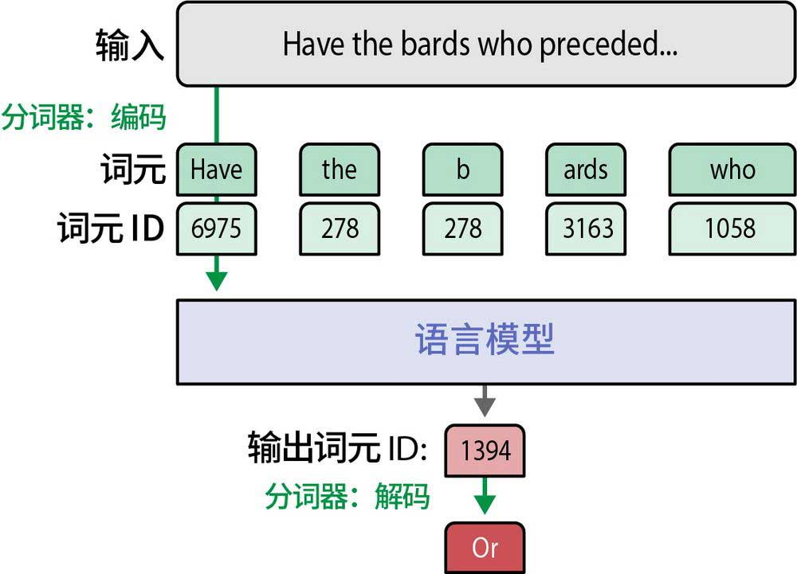

图2-5：分词器还负责处理模型的输出，将输出词元ID转换为与该ID关联的词或词元

**2.1.4词级、子词级、字符级与字节级分词**

我们刚才讨论的分词方案被称为**子词级分词**（subword tokenization）。这是最常用的分词方案，但并非唯一的方案。图2-6展示了四种主要的分词方式。

词级分词

这种方法在早期的word2vec等模型中很常见，但在NLP中的使用越来越少。不过，由于其实用性，它在推荐系统等NLP以外的场景中得以应用，我们将在本章后面详细介绍。词级分词的一个挑战是，分词器可能无法处理分词器训练完成之后才出现在数据集中的新词。这也导致词表中存在大量仅有细微差别的词元（如apology、apologize、apologetic、apologist）。这个问题可以通过子词级分词来解决，因为它有一个apolog词元，还有后缀词元（如-y、-ize、-etic、-ist），这些后缀词元与许多其他词元共用，从而形成更具表达能力的词表。

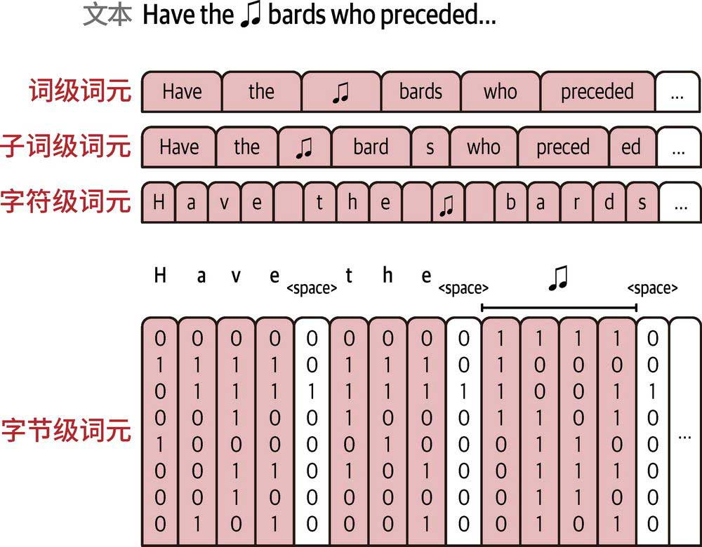

图2-6：四种分词方法将文本分解成不同大小的词元（词级、子词级、字符级和字节级）

子词级分词

这种方法包含词和词的一部分。除了前面提到的词表更具表达能力外，这种分词方法的另一个优势是能够表示新词，因为它可以将新词元分解成较小的字符，这些字符通常都在词表中。

字符级分词

这是另一种能够成功处理新词的分词方法，因为它仅仅依赖最原始的字母。虽然这使得分词更容易，但建模却变得更困难。在子词级分词中，模型可以用一个词元表示play，而使用字符级分词的模型则需要建模拼写出p-l-a-y的信息，此外还要建模序列的其他部分。

相比字符级分词，子词级分词可以在Transformer模型有限的上下文长度内，容纳更多文本。因此，在上下文长度为1024的模型中，使用子词级分词可以容纳字符级分词约三倍的文本（对于子词级词元，平均每个词元包含三个字符）。

字节级分词

还有一种分词方法是将词元分解为表示unicode（统一码）字符的单个字节。像“CANINE: Pre-training an Efficient Tokenization-Free Encoder for Language Representation”这样的论文概述了这类方法，它们也被称为“免分词编码”。其他研究成果如“ByT5: Towards a Token-Free Future with Pre-trained Byte-to-Byte Models”表明，字节级分词是一种颇具竞争力的方法，尤其是在多语言场景中。

这里需要强调一个区别：某些子词分词器也会在其词表中将字节作为词元，在遇到无法用其他方式表示的字符时，这是最终备选方案，例如GPT-2和RoBERTa分词器就是这样做的。但这并不意味着它们是无分词的字节级分词器，因为它们并不是用字节来表示所有内容，而只是表示一部分内容，我们将在下一节中了解这一点。

如果你想深入了解分词器，推荐阅读*DesigningLargeLanguageModelApplications*一书，其中对这一主题做了更详细的讨论。

**2.1.5比较训练好的LLM分词器**

我们之前提到，分词器中出现的词元是由三个主要因素决定的：分词方法、用于初始化分词器的参数和特殊词元，以及用于训练分词器的数据集。接下来，我们对多个实际训练好的分词器进行比较，看看这些因素如何影响它们的行为。我们会看到较新的分词器是如何改变其行为以提升模型性能的，还会看到专门的模型（如代码生成模型）通常需要专门的分词器。

我们使用多个分词器来编码以下文本：

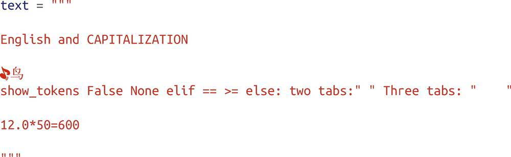

由此，我们能够看到每个分词器是如何处理不同类型的词元的：

·大小写

·英语以外的语言

·表情符号（emoji）

·编程代码，包括关键字和经常用于缩进的空白字符（例如在Python等语言中）

·数字

·特殊词元。这类词元具有特定的作用，而不仅仅表示文本。它们包括表示文本开始或结束的词元（模型用结束词元来向系统表明已完成生成），以及我们随后将看到的其他功能性词元

1. 此处列出的模型，除GPT-4外，均可在Hugging Face模型仓库获取。——编者注

我们按照从旧到新的时间顺序考察不同的分词器
 [](#footnote-10-21)，看看它们如何对这段文本进行分词，以及这可能反映出语言模型的哪些特点。我们将使用以下函数对文本进行分词，并用彩色背景显示每个词元：

```
colors_list = [
    '102;194;165', '252;141;98', '141;160;203',
    '231;138;195', '166;216;84', '255;217;47'
]
def show_tokens(sentence, tokenizer_name):
    tokenizer = AutoTokenizer.from_pretrained(tokenizer_name)
    token_ids = tokenizer(sentence).input_ids
    for idx, t in enumerate(token_ids):
        print(
            f'\x1b[0;30;48;2;{colors_list[idx % len(colors_list)]}m' +
            tokenizer.decode(t) +
            '\x1b[0m',
            end=' '
        )
```

**1.BERT基座模型（大小写不敏感）（2018）**

分词方法：WordPiece，参见论文“Japanese and Korean Voice Search”。

词表大小：30522。

特殊词元：

unk_token [UNK]

未知词元，当分词器没有为某类字符进行特定编码时使用。

sep_token [SEP]

分隔符词元，用于支持需要为模型提供两段文本的特定任务 [ 在这些情况下，模型被称为交叉编码器（cross-encoder）]。例如，我们将在第8章看到分隔符在重排序中的应用。

pad_token [PAD]

填充词元，用于填充模型输入中未使用的位置，因为模型通常要求输入数据具有固定的长度（也就是其上下文窗口）

cls_token [CLS]

分类词元，主要用于分类任务的特殊词元，我们将在第4章看到。

mask_token [MASK]

掩码词元，在训练过程中用于隐藏词元。

分词后的文本：

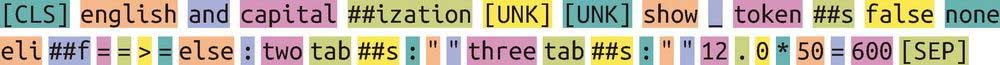

BERT分词器有两个版本：大小写敏感（保留大写字母）的版本和大小写不敏感（所有大写字母先转换为小写字母）的版本。对于大小写不敏感（也是更受欢迎）的BERT分词器版本，我们注意到以下特点。

·换行符消失了，这使得模型无法识别通过换行符体现的信息（例如，每一轮对话都位于新的一行的聊天记录）。

·所有文本都变成小写。


·capitalization这个词被编码为两个子词元：。
符号用来表示这个词元是与前面的词元相连的部分词元。这也是一种表示空格位置的方法，因为分词中约定没有 
前缀的词元前面应该有一个空格。


·表情符号和中文字符消失了，被替换成了特殊词元，即“未知词元”。

**2.BERT基座模型（大小写敏感）（2018）**

分词方法：WordPiece。

词表大小：28996。

特殊词元：与大小写不敏感版本相同

分词后的文本：

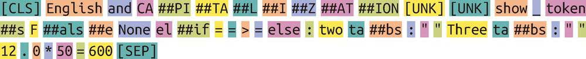

大小写敏感版本的BERT分词器的主要不同之处在于包含了大写词元。


·注意CAPITALIZATION现在被表示为八个词元：。


·两种BERT分词器都会在输入文本前后分别添加一个起始词元和结束词元。[CLS]和[SEP]是用于包裹输入文本的功能性词元，各有其用途。[CLS]代表分类（classification），因为它有时被用于句子分类。[SEP]代表分隔符（separator），用于在某些需要向模型传递两个句子的应用中分隔句子（例如，在第8章中，我们将使用[SEP]词元来分隔查询文本和候选结果）。

**3.GPT-2（2019）**

分词方法：BPE，参见论文“Neural Machine Translation of Rare Words with Subword Units”。

词表大小：50257。

特殊词元：<|endoftext|>

分词后的文本：

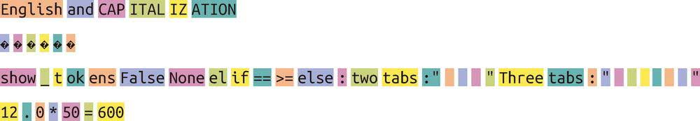

使用GPT-2分词器，我们注意到以下特点。

·分词器保留了换行符。

·保留了大小写，CAPITALIZATION这个词被表示为四个词元。

·表情符号和中文字符“
鸟”，分别被表示为多个词元。虽然我们看到这些词元显示为
字符，但它们实际上代表不同的词元。例如，
这个表情符号被分解成词元ID为8582、236和113的词元。分词器能够成功地从这些词元中重构出原始字符。我们可以通过打印tokenizer.decode([8582, 236, 113])来验证，它会输出
。

·两个制表符（tab）被表示为两个词元（在词表中的词元ID为197），三个制表符被表示为三个词元（词元号为220），最后一个空格被包含在表示闭合引号的词元中。


 空白字符有什么意义？这类字符对于模型理解或生成代码非常重要。一个能够使用单个词元来表示连续四个空白字符的模型，更适合处理Python代码数据集。虽然模型也可以将其表示为四个不同的词元，但这会增加建模的难度，因为模型需要追踪缩进级别，这通常会导致性能下降。这个例子说明，合理选择分词粒度，可以帮助模型在特定任务上取得更好的表现。

**4.FLAN-T5（2022）**

分词方法：SentencePiece，参见论文“SentencePiece: A simple and language independent subword tokenizer and detokenizer for Neural Text Processing”。它支持BPE和一元语言模型（unigram language model，参见论文“Subword Regularization: Improving Neural Network Translation Models with Multiple Subword Candidates”）。

词表大小：32100。

特殊词元：

·unk_token <unk>（未知词元）

·pad_token <pad>（填充词元）

分词后的文本：

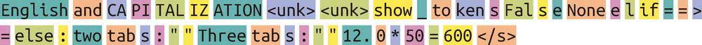

FLAN-T5系列模型使用SentencePiece方法。我们注意到以下两点：

·该方法中没有换行符或空白字符词元，这会使模型处理代码变得具有挑战性；

·表情符号和中文字符都被替换为<unk>词元，模型完全无法识别这类字符。

**5.GPT-4（2023）**

分词方法：BPE

词表大小：略多于100000

特殊词元：

·<|endoftext|>

·中间填充词元。以下三个词元使LLM能够在考虑前后文的情况下生成补全内容。这种方法在论文“Efficient Training of Language Models to Fill in the Middle”中有详细解释，具体细节不在本书的讨论范围。

·<|fim_prefix|>

·<|fim_middle|>

·<|fim_suffix|>

分词后的文本：

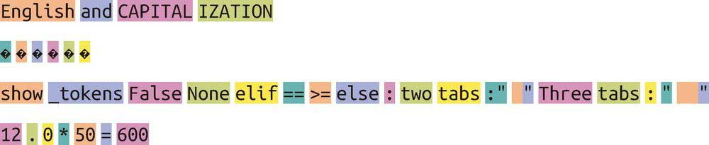

GPT-4的分词器行为与其前身GPT-2分词器类似，一些区别如下。

·GPT-4分词器将四个空白字符表示为单个词元。实际上，它甚至为各种长度的空白字符序列（最多83个）都设有特定的词元。


·Python关键字在GPT-4中有自己的词元。这一点和前一点都源于模型对代码和自然语言的关注。

·GPT-4分词器使用更少的词元来表示大多数词，例如CAPITALIZATION（用两个词元取代四个词元）和tokens（用一个词元取代三个词元）。

**6.StarCoder2（2024）**

StarCoder2是一个专注于生成代码的150亿参数模型，参见论文“StarCoder2 and The Stack v2: The Next Generation”。这是对StarCoder的原始工作的延续，参见论文“StarCoder: May the Source be with You!”。

分词方法：BPE

词表大小：49152

特殊词元示例：

·<|endoftext|>

·中间填充词元：

·<fim_prefix>

·<fim_middle>

·<fim_suffix>

·<fim_pad>

·在表示代码时，管理上下文很重要。一个文件可能会调用定义在另一个文件中的函数。因此，模型需要某种方式来识别同一代码仓库中位于不同文件中的代码，同时也要区分不同仓库中的代码。这就是为什么StarCoder2使用特殊词元来表示仓库名和文件名：

·<filename>

·<reponame>

·<gh_stars>

分词后的文本：

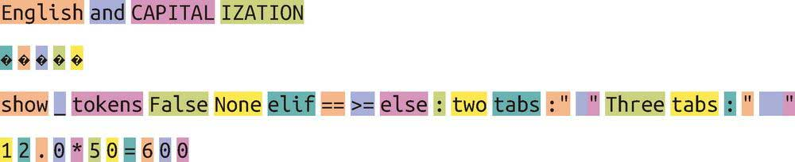

这是一个专注于代码生成的编码器。

·类似于GPT-4，它将一系列空白字符编码为单个词元。


·与我们之前看到的分词方法相比，此方法的主要不同之处是每个数字都被分配了词元（因此600变成了）。这种设计假设这样可以更好地表示数字和数学概念。例如，在GPT-2中，数字870用单个词元表示。但871用两个词元（8和71）表示。你可以直观地看到，这种表示方式可能会让模型混淆对数字的理解。

**7.Galactica**

Galactica模型（参见论文“Galactica: A Large Language Model for Science”）专注于科学知识领域，是在大量的科学论文、参考资料和知识库上训练而来的。它特别注重分词方式，旨在更好地理解其所表示的数据集的细微差别。例如，它包含了用于表示引用、推理、数学、氨基酸序列和DNA序列的特殊词元。

分词方法：BPE

词表大小：50000

特殊词元：

·<s>

·<pad>

·</s>

·<unk>

·引用。引用内容用以下两个特殊词元包裹：

·[START_REF]

·[END_REF]

下面是论文中的一个使用示例：Recurrent neural networks, long short-term memory [START_REF]Long Short-Term Memory, Hochreiter[END_REF]

·逐步推理：

·<work>是一个有趣的词元，模型用它来进行思维链（chain-of-thought，CoT）推理。

分词后的文本：

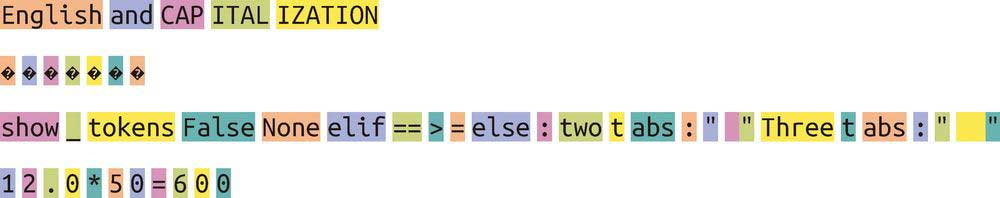

Galactica分词器在设计上与StarCoder2类似，都考虑了处理代码的需求。两者对空白字符的编码方式相同：将不同长度的空白字符序列分别编码为单个词元。不同之处在于，Galactica对制表符也进行了同样的处理。因此，在我们见过的所有分词器中，它是唯一一个将由两个制表符组成的字符串（"\t\t"）分配为单个词元的。

**8.Phi-3（和Llama2）**

本书中讨论的Phi-3模型重用了Llama 2的分词器，但添加了一些特殊词元。

分词方法：BPE

词表大小：32000

特殊词元：

·<|endoftext|>

·对话词元。随着对话LLM于2023年流行，LLM的对话特性开始成为其主要应用。分词器通过添加表示对话轮次和对话者角色的词元来适应这一趋势。这些特殊词元包括：

·<|user|>

·<|assistant|>

·<|system|>

现在，我们集中回顾一下以上示例：

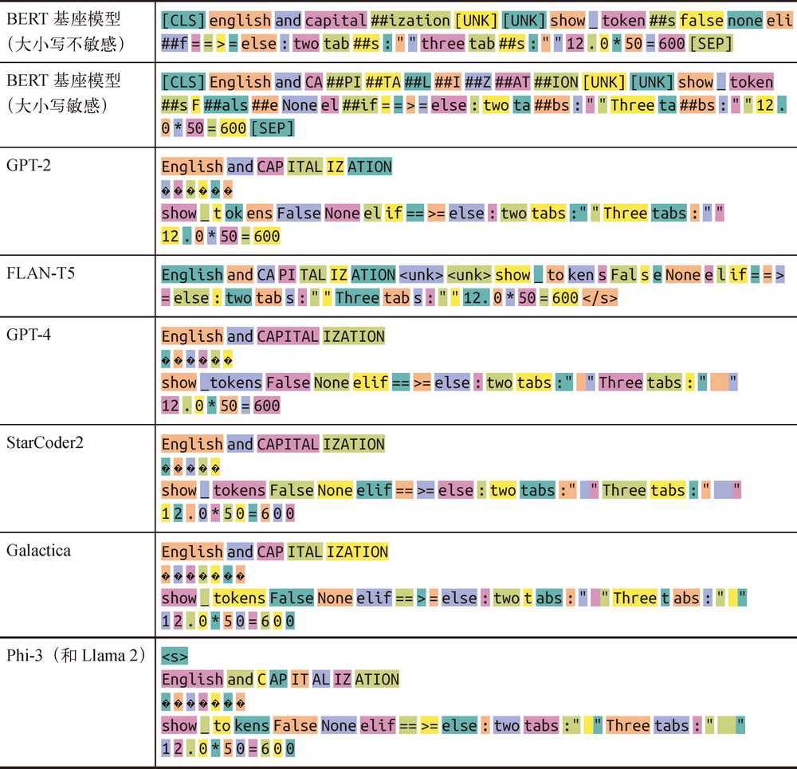

**2.1.6分词器属性**

前文简单讨论了一些训练好的分词器，展示了不同分词器之间的多种差异。是什么决定了它们的分词行为呢？有三大类设计上的选择决定了分词器如何分解文本：分词方法、用于初始化分词器的参数以及训练分词器的目标数据所在的领域。

**1.分词方法**

正如我们所见，分词方法有许多种，其中BPE是最流行的一种。每种方法都定义了一种算法，用于选择合适的词元集来表示数据集。要想大概了解这些方法，可以参考Hugging Face的分词器汇总页面。

**2.用于初始化分词器的参数**

选择分词方法后，LLM设计者需要设置分词器的一些关键参数，主要包括词表大小、特殊词元和大小写处理策略。

词表大小

1. K代表千（词元）。——编者注

分词器的词表中保留多少个词元？（常见的词表大小的值有30K
 [](#footnote-10-29)、50K，但我们越来越多地看到像100K这样更大规模的词表了。）

特殊词元

我们希望模型跟踪哪些特殊词元？我们可以根据需要添加任意数量的特殊词元，特别是要针对特定用例构建LLM时。常见的特殊词元包括：

·文本开始词元（例如<s>）

·文本结束词元

·填充词元

·未知词元

·CLS词元

·掩码词元

除此之外，LLM设计者还可以添加有助于对所关注问题领域建模的词元，例如Galactica的<work>和[START_REF]词元。

大小写处理策略

在英语等语言中，我们如何处理大小写？是否应该将所有内容转换为小写？（名称的大小写通常携带有用的信息，但我们是否愿意让那些全大写版本的单词额外占用词表空间？）

**3.数据领域**

即使我们选择相同的方法和参数，分词器的行为也会因其训练所用的数据集而有所不同（这甚至发生在模型训练开始之前）。前文提到的分词方法通过优化词表来表示特定数据集。从我们的示例中可以看到，这对代码、多语言文本等数据集都有影响。

例如在代码方面，我们看到，一个面向文本的分词器可能会对缩进空格进行如下分词（我们用颜色突出显示一些词元）：

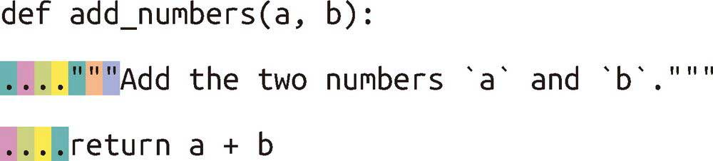

这对于面向代码的模型来说可能并不是最优方式。通过做出不同的分词选择，面向代码的模型往往可以得到改进：

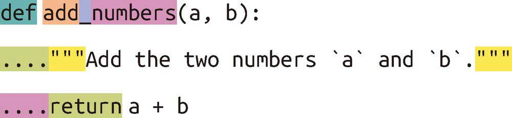

这些分词选择能够简化模型的处理过程，从而更有可能提升其性能。

如果想更详细地了解分词器的训练，可以参考Hugging Face上的NLP课程中分词器相关的部分，以及*NaturalLanguageProcessingwithTransformers,RevisedEdition*一书。

### 2.2 词元嵌入

现在我们理解了分词，就部分解决了将语言表示给语言模型这一问题。从这个意义上说，语言是词元的序列。如果我们在足够大的词元集上训练一个足够好的模型，它就会开始捕捉训练数据集中出现的复杂模式：

·如果训练数据包含大量英语文本，通过这些模式，模型就能够表示和生成英语；

·如果训练数据包含事实性信息（例如维基百科），模型就会具备生成一些事实性信息的能力（参见以下说明）。

解决这个难题的下一步是为这些词元找到最佳的数值表示，使模型能够计算并正确建模文本中的模式。这些模式呈现给我们的，是模型在特定语言上的连贯性、编码能力或我们期望语言模型具备的任何其他能力。

正如我们在第1章所看到的，这就是嵌入的作用。它们是用于捕捉语言中含义和模式的数值表示空间。


 注意：尽管模型的语言连贯性达到了一个较高的水平，事实生成能力也高于平均水平，但这也开始带来新的问题。一些用户开始过度信任模型的事实生成能力（例如，在2023年初，有文章将一些语言模型称为“Google杀手”）。但高级用户很快就认识到，仅靠生成模型并不能替代可靠的搜索引擎。于是，RAG（检索增强生成）应运而生，它将搜索和LLM结合起来。我们将在第8章中详细介绍RAG。

**2.2.1语言模型为其分词器的词表保存嵌入**

分词器经过初始化和训练，就会在其关联的语言模型的训练过程中使用。这就是为什么预训练语言模型与其分词器绑定，在未经训练的情况下不能使用不同的分词器。

如图2-7所示，语言模型为分词器词表中的每个词元都保存了一个嵌入向量。当我们下载预训练语言模型时，模型的一部分就是保存所有这些向量的嵌入矩阵。

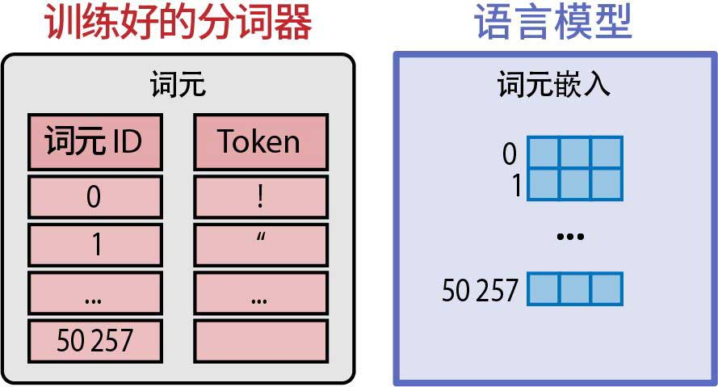

图2-7：语言模型为其分词器中的每个词元保存一个与之关联的嵌入向量

在训练开始之前，这些向量会像模型的其他权重一样被随机初始化，但训练过程会为它们分配值，使其能够执行有意义的行为。

**2.2.2使用语言模型创建与上下文相关的词嵌入**

我们已经介绍了作为语言模型输入的词元嵌入，接下来让我们看看语言模型如何**创建**更好的词元嵌入。这是使用语言模型进行文本表示的主要方式之一，为命名实体识别（named-entity recognition，NER）、抽取式文本摘要等应用提供了支持。抽取式文本摘要是指通过突出显示文本中最重要的部分来对长文本进行摘要提炼，而不是生成新的摘要文本。

与使用静态向量表示每个词元或词不同，语言模型会创建与**上下文相关**（contextualized）的词嵌入（如图2-8所示）。所谓上下文相关，就是根据词元在上下文中的含义使用不同的表示方式。这些向量可以被其他系统用于各种任务。除了我们在上一段中提到的文本应用外，这些与上下文相关的向量还为DALL·E、Midjourney和Stable Diffusion等AI图像生成系统提供了支持。

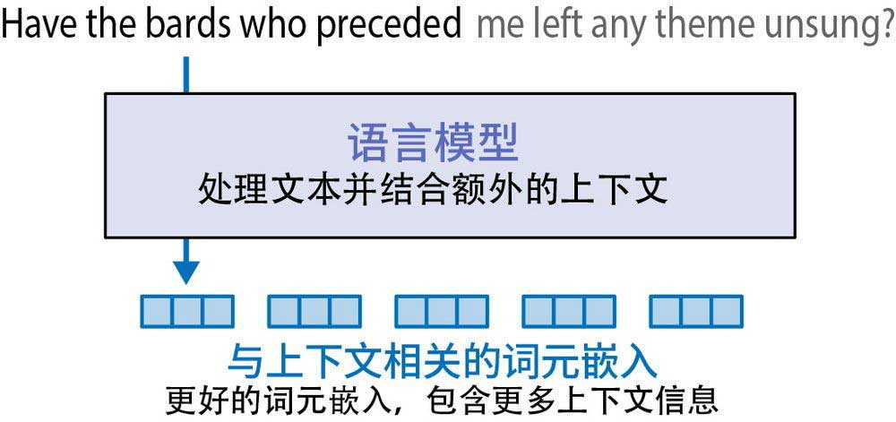

图2-8：语言模型产生的与上下文相关的词元嵌入比原始的静态词元嵌入更好

让我们看看如何生成与上下文相关的词元嵌入，以下这段代码的大部分内容你现在应该已经很熟悉了：

```
from transformers import AutoModel, AutoTokenizer
# 加载分词器
tokenizer = AutoTokenizer.from_pretrained("microsoft/deberta-base")
# 加载语言模型
model = AutoModel.from_pretrained("microsoft/deberta-v3-xsmall")
# 对句子进行分词
tokens = tokenizer('Hello world', return_tensors='pt')
# 处理词元
output = model(**tokens)[0]
```

我们在这里使用的是DeBERTaV3模型，在撰写本书时，它是最适合生成词元嵌入的语言模型之一，具有体积小、效率高的特点。论文“DeBERTaV3: Improving DeBERTa Using ELECTRA-Style Pre-Training with Gradient-Disentangled Embedding Sharing”详细描述了该模型。

这段代码下载了一个预训练的分词器和模型，并用它们来处理字符串"Hello world"。模型的输出保存在output变量中。我们先打印它的各维度来检查这个变量（我们预计它是一个多维数组）：

```
output.shape
```

输出结果为：

```
torch.Size([1, 4, 384])
```

跳过第一个维度，我们可以将这个结果理解为4个词元，每个词元都嵌入到一个包含384个值的向量中。第一个维度是批次（batch）维度，要同时向模型发送多个输入句子（如训练时）就要用到它。此时，多个输入句子会被同时处理，从而加快处理速度。

那么，这4个向量是什么？是分词器将两个词拆分成了4个词元，还是发生了其他情况？我们可以运用已经学过的分词器知识来检查它们：

```
for token in tokens['input_ids'][0]:
    print(tokenizer.decode(token))
```

输出结果为：

```
[CLS]
Hello
world
[SEP]
```

可见，这个分词器和模型会在字符串的开头和结尾分别添加[CLS]和[SEP]词元。

我们的语言模型现在已经处理了文本输入。其输出结果如下：

```
tensor([[
[-3.3060, -0.0507, -0.1098, ..., -0.1704, -0.1618, 0.6932],
[ 0.8918, 0.0740, -0.1583, ..., 0.1869, 1.4760, 0.0751],
[ 0.0871, 0.6364, -0.3050, ..., 0.4729, -0.1829, 1.0157],
[-3.1624, -0.1436, -0.0941, ..., -0.0290, -0.1265, 0.7954]
]], grad_fn=<NativeLayerNormBackward0>)
```

这是语言模型的原始输出。LLM的应用就是建立在这样的输出之上的。

我们在图2-9中回顾了语言模型的输入分词和输出结果。从技术上讲，将词元ID转换为原始嵌入向量是语言模型内部发生的第一步。

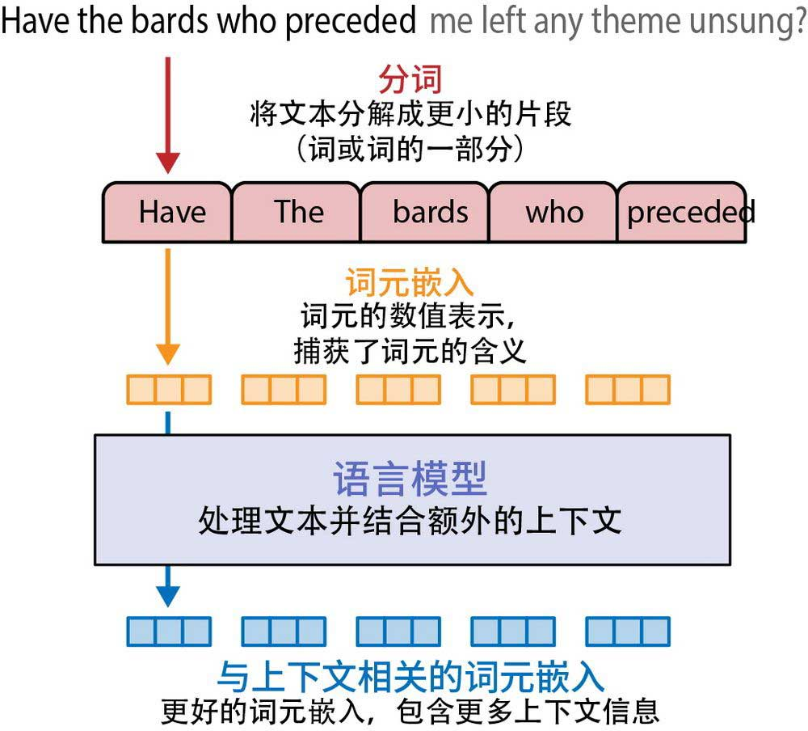

图2-9：语言模型以原始静态嵌入向量作为输入，并生成与上下文相关的文本嵌入

这样的可视化对于下一章研究基于Transformer的LLM如何工作至关重要。

### 2.3 文本嵌入（用于句子和整篇文档）

虽然词元嵌入是LLM运作的关键，但许多LLM应用需要处理完整的句子、段落甚至文本文档，这催生了一些特殊的语言模型，它们能够生成文本嵌入——用单个向量来表示长度超过一个词元的文本片段。

我们可以这样理解文本嵌入模型：它接收一段文本，最终生成单个向量，这个向量以某种形式表示该文本并捕捉其含义。图2-10展示了这个过程。


图2-10：第一步，我们使用嵌入模型提取特征并将输入文本转换为嵌入向量

生成**文本嵌入有多种方法。最常见的方法之一是对模型生成的所有词元**嵌入的值取平均值。然而，高质量的文本嵌入模型往往是专门为文本嵌入任务训练的。

1. Nils Reimers and Iryna Gurevych. “Sentence-BERT: Sentence Embeddings Using Siamese BERT-Networks.” arXiv preprint arXiv:1908.10084 (2019).

我们可以使用sentence-transformers生成文本嵌入，这是一个流行的利用预训练嵌入模型生成文本嵌入的软件包
 [](#footnote-10-60)。与前一章的transformers一样，该软件包可用于加载公开可用的模型。为了演示如何创建嵌入向量，我们使用all-mpnet-base-v2模型。在第4章中，我们将进一步探讨如何为你的任务选择合适的嵌入模型。

```
from sentence_transformers import SentenceTransformer
# 加载模型
model = SentenceTransformer("sentence-transformers/all-mpnet-base-v2")
# 将文本转换为文本嵌入
vector = model.encode("Best movie ever!")
```

嵌入向量的维度取决于底层的嵌入模型。让我们来探索一下模型的维度：

```
vector.shape
(768,)
```

现在这个句子被编码成一个维度为768的向量。在本书的第二部分，当我们开始研究应用时，我们将看到这些文本嵌入向量在分类、语义搜索和RAG等各种功能中的巨大作用。

### 2.4 LLM之外的词嵌入

嵌入不仅在文本和语言生成方面有用。事实证明，嵌入（即为对象分配有意义的向量表示）在许多领域都很有用，包括推荐引擎和机器人技术。在本节中，我们将学习如何使用预训练的word2vec嵌入，并简要介绍word2vec是如何创建词嵌入的。了解word2vec的训练方式将为你在第10章学习对比训练做好准备。在下一节中，我们将看到这些嵌入如何用于推荐系统。

**2.4.1使用预训练词嵌入**

让我们看看如何使用Gensim库下载预训练词嵌入（如word2vec或GloVe）：

```
import gensim.downloader as api
# 下载嵌入（66 MB，glove，训练数据来自维基百科，向量大小：50）
# 其他选项包括"word2vec-google-news-300"
# 更多选项请访问gensim-data的GitHub仓库
model = api.load("glove-wiki-gigaword-50")
```

这里，我们下载了在维基百科上训练的大量词的嵌入。然后，我们可以通过查看特定词（例如king）的最近邻来探索嵌入空间：

```
model.most_similar([model['king']], topn=11)
```

输出结果：

```
[('king', 1.0000001192092896),
('prince', 0.8236179351806641),
('queen', 0.7839043140411377),
('ii', 0.7746230363845825),
('emperor', 0.7736247777938843),
('son', 0.766719400882721),
('uncle', 0.7627150416374207),
('kingdom', 0.7542161345481873),
('throne', 0.7539914846420288),
('brother', 0.7492411136627197),
('ruler', 0.7434253692626953)]
```

**2.4.2word2vec算法与对比训练**

“Efficient Estimation of Word Representations in Vector Space”一文介绍的word2vec算法，在文章“The Illustrated Word2vec”中有详细说明。在这里我们将浓缩其核心思想，因为在下一节讨论推荐引擎的嵌入创建方法时会以此为基础。

与LLM一样，word2vec也是在从文本生成的样本上进行训练的。假设我们有Frank Herbert的小说*Dune*中的一段文本：“Thou shalt not make a machine in the likeness of a human mind”。该算法使用滑动窗口来生成训练样本。比如，我们可以设置窗口大小为2，即考虑中心词两侧各两个相邻词。

嵌入向量是通过分类任务生成的。这种任务用于训练神经网络，以预测词是否经常出现在相同的上下文中（这里的**上下文**指的是我们建模的训练数据集中的多个句子）。我们可以将其理解为一个神经网络，它接收两个词作为输入，如果这两个词倾向于出现在相同的上下文中则输出1，否则输出0。

在滑动窗口的第一个位置，我们可以生成四个训练样本，如图2-11所示。


图2-11：滑动窗口用于生成word2vec算法的训练样本，以便后续预测两个词是否为相邻词

在每个生成的训练样本中，中心词作为第一个输入，在各个训练样本中，其相邻词分别作为第二个输入。我们期望最终训练好的模型能够对这种相邻关系进行分类，当接收到的两个输入词是相邻词时输出1。这些训练样本如图2-12所示。

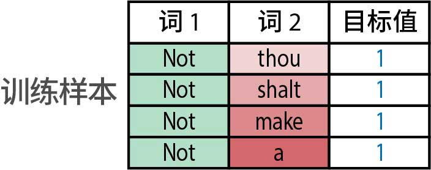

图2-12：每个生成的训练样本展示了一对相邻词

然而，如果我们的数据集中只有目标值为1的样本（正例），那么模型可能会投机取巧，通过一直输出1来获得完美表现。为了解决这个问题，我们需要用非典型相邻词的样本来丰富训练数据集。这些被称为负例，如图2-13所示。

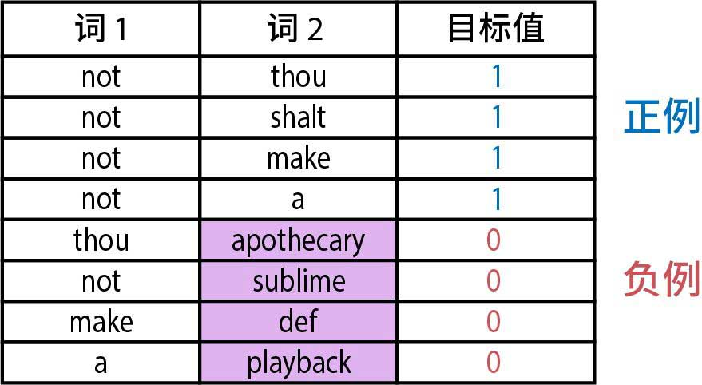

图2-13：我们需要向模型展示负例，即通常不相邻的词。更好的模型能够更好地区分正例和负例

事实证明，在选择负例时并不需要过于严谨。仅仅是借助从随机生成的样本中检测正例的能力，就能得到很多有用的模型[ 这受到了**噪声对比估计**（noise-contrastive estimation）这一重要概念的启发，详见论文“Noise-Contrastive Estimation: A New Estimation Principle for Unnormalized Statistical Models”]。因此在这种情况下，我们随机获取一些词，将它们添加到数据集中，并将其标注为非相邻词（模型看到它们时应该输出0）。

至此，我们已经了解了word2vec的两个主要概念（见图2-14）：skip-gram，选择相邻词的方法；负采样（negative sampling），通过从数据集中随机采样来添加负例。

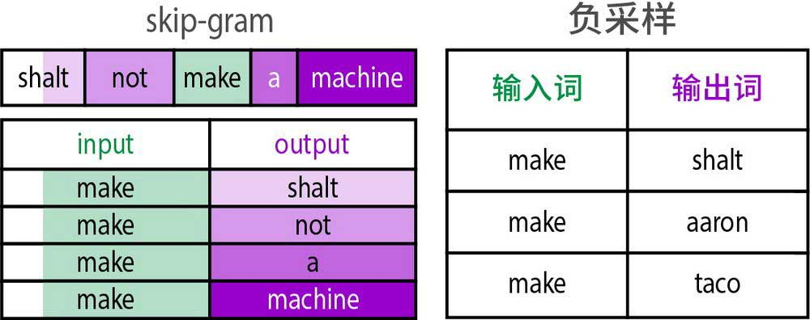

图2-14：skip-gram和负采样是word2vec算法背后的两个主要思想，它们在许多可以表述为词元序列问题的问题中很有用

我们可以从连续文本中生成数百万甚至数十亿个这样的训练样本。在开始用这个数据集训练神经网络之前，我们需要做一些分词决策，就像我们在LLM分词器中看到的那样，包括如何处理大小写和标点符号，以及词表中包含多少词元。

然后，我们为每个词元创建一个嵌入向量并随机初始化，如图2-15所示。在实践中，这是一个矩阵，其维度为：词表大小 × 嵌入向量的维度。

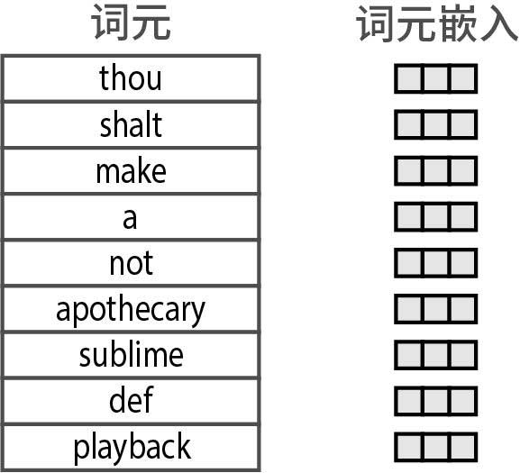

图2-15：词表中的词及其起始的、随机的、未初始化的嵌入向量

接下来，我们在每个样本上训练模型，输入两个嵌入向量并预测它们是否相邻。这个过程如图2-16所示。

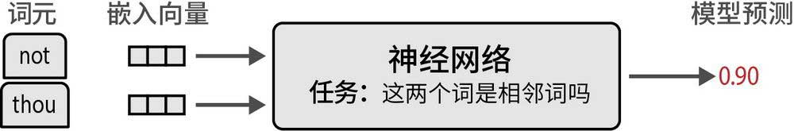

图2-16：训练神经网络来预测两个词是否相邻。它在训练过程中不断优化嵌入向量，最终生成训练好的嵌入表示

根据模型预测正确与否，典型的机器学习训练步骤会调整嵌入向量，以便模型在下次遇到这两个向量时，更准确地进行预测。在训练过程结束时，词表中的所有词元获得了更好的词嵌入表示。

这种接收两个向量并预测它们是否具有某种关系的模型思想，是机器学习中最强大的思想之一，并且在语言模型中屡试不爽。这就是为什么我们要在第10章专门讨论这个概念，以及它如何优化语言模型来完成特定任务（如句子嵌入和检索）。

这个思想也是连接文本和图像等不同模态的核心，这对AI图像生成模型来说至关重要，我们将在第9章详细讨论多模态模型。在多模态形式中，模型会接收一张图片和一段描述文本，然后预测该文本是否描述了这张图片。

### 2.5 推荐系统中的嵌入

正如我们提到的，嵌入的概念在许多其他领域都很有用。在工业界，它被广泛应用于推荐系统。

**2.5.1基于嵌入的歌曲推荐**

在本节中，我们将使用word2vec算法，利用人工创建的音乐播放列表来嵌入歌曲。想象一下，我们把每首歌曲都当作一个词或词元来处理，把每个播放列表当作一个句子，这些嵌入就可以用来推荐经常出现在同一个播放列表中的歌曲。

我们将使用的Playlist数据集是由康奈尔大学的Shuo Chen收集的。它包含了来自美国数百个广播电台的播放列表。图2-17展示了这个数据集的形式。


图2-17：为了获得捕捉歌曲相似性的歌曲嵌入，我们将使用由一系列播放列表组成的数据集，每个播放列表包含一组歌曲

在深入了解其构建方式之前，让我们先演示一下最终的效果。我们输入几首歌曲，看看它会推荐什么。

我们从Michael Jackson的“Billie Jean”（歌曲ID为3822）开始：

```
# 我们将在下面详细定义和探索这个函数
print_recommendations(3822)
```


看起来很合理，Madonna、Prince的歌曲，以及Michael Jackson的其他歌曲是最近邻。

让我们从流行乐转向说唱领域，看看2Pac的“California Love”的近邻：

```
print_recommendations(842)
```

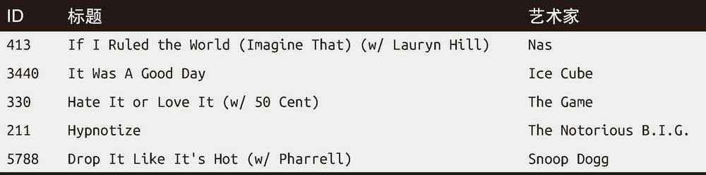

这个列表看起来也相当合理！现在我们已经看到它能工作，让我们看看如何构建这样一个系统。

**2.5.2训练歌曲嵌入模型**

首先加载包含歌曲播放列表的数据集，以及每首歌曲的元数据，如标题和艺术家：

```
import pandas as pd
from urllib import request
# 获取播放列表数据集文件
data = request.urlopen('https://storage.googleapis.com/maps-premium/data set/yes_complete/train.txt')
# 解析播放列表数据集文件。跳过前两行，因为它们只包含元数据
lines = data.read().decode("utf-8").split('\n')[2:]
# 删除只有一首歌的播放列表
playlists = [s.rstrip().split() for s in lines if len(s.split()) > 1]
# 加载歌曲元数据
songs_file = request.urlopen('https://storage.googleapis.com/maps-premium/data
set/yes_complete/song_hash.txt')
songs_file = songs_file.read().decode("utf-8").split('\n')
songs = [s.rstrip().split('\t') for s in songs_file]
songs_df = pd.DataFrame(data=songs, columns = ['id', 'title', 'artist'])
songs_df = songs_df.set_index('id')
```

现在我们已经保存了，让我们检查一下列表playlists。其中每个元素都是一个包含一系列歌曲ID的播放列表：

```
print( 'Playlist #1:\n ', playlists[0], '\n')
print( 'Playlist #2:\n ', playlists[1])
Playlist #1: ['0', '1', '2', '3', '4', '5', ..., '43']
Playlist #2: ['78', '79', '80', '3', '62', ..., '210']
```

让我们训练这个模型：

```
from gensim.models import Word2Vec
# 训练我们的word2vec模型
model = Word2Vec(
    playlists, vector_size=32, window=20, negative=50, min_count=1, workers=4
)
```

训练需要一两分钟的时间，最终会为每首歌曲计算出嵌入向量。现在我们可以像之前处理词语一样，使用这些嵌入向量来寻找相似的歌曲：

```
song_id = 2172
# 让模型找出与歌曲2172相似的歌曲
model.wv.most_similar(positive=str(song_id))
```

输出结果为：

```
[('2976', 0.9977465271949768),
 ('3167', 0.9977430701255798),
 ('3094', 0.9975950717926025),
 ('2640', 0.9966474175453186),
 ('2849', 0.9963167905807495)]
```

这是与歌曲2172具有最相似的嵌入表示的歌曲列表。

在这个例子中，这首歌是：

```
print(songs_df.iloc[2172])
title Fade To Black
artist Metallica
Name: 2172, dtype: object
```

推荐给出的都属于重金属和硬摇滚风格的歌曲：

```
import numpy as np
def print_recommendations(song_id):
    similar_songs = np.array(
        model.wv.most_similar(positive=str(song_id),topn=5)
    )[:,0]
    return songs_df.iloc[similar_songs]
# 提取推荐结果
print_recommendations(2172)
```


### 2.6 小结

在本章中，我们介绍了LLM词元、分词器以及使用词元嵌入的实用方法。这为我们下一章深入研究语言模型做好了准备，同时也为我们学习如何在语言模型之外使用嵌入打开了大门。

我们探讨了分词器如何作为处理LLM输入的第一步，将原始文本输入转换为词元ID。常见的分词方案包括将文本分解为词、子词、字符或字节，具体取决于特定应用的要求。

通过对现实世界预训练分词器（从BERT到GPT-2、GPT-4和其他模型）的探索，我们了解了某些分词器在某些方面表现更好（例如，保留大小写、换行符或其他语言的词元等信息）；而在其他方面，分词器之间仅存在差异（例如，它们如何分解某些词），并无优劣之分。

分词器设计中有三个主要决策点：分词器算法（如BPE、WordPiece、SentencePiece）、分词参数（包括词表大小、特殊词元、大小写处理策略和不同语言的处理）以及用于训练分词器的数据集。

语言模型能够生成高质量与上下文相关的词元嵌入，这种嵌入改进了原始的静态嵌入。这些与上下文相关的词元嵌入可以用于命名实体识别、抽取式文本摘要和文本分类等任务。除了生成词元嵌入，语言模型还可以生成涵盖整个句子甚至文档的文本嵌入。这为本书第二部分将要展示的众多语言模型应用提供了强大支持。

在LLM之前，word2vec、GloVe和fastText等词嵌入方法非常流行。在语言处理中，这些方法已经在很大程度上被语言模型产生的与上下文相关的词嵌入所取代。word2vec算法依赖两个主要思想：skip-gram模型和负采样。它还使用了与我们将在第10章看到的类似的对比训练方法。

从根据播放列表构建音乐推荐系统的例子中我们看到，嵌入对于创建和改进推荐系统非常有用。

在下一章中，我们将深入探讨分词后的处理过程：LLM如何处理这些词元并生成文本？我们将探讨使用Transformer架构的LLM的主要工作原理。


---

## 第3章 LLM的内部机制

在了解了分词和词嵌入之后，我们已经准备好深入探究语言模型的工作原理了。在本章中，我们将探讨Transformer LLM的主要工作原理。我们将重点关注文本生成模型，以便更深入地理解生成式LLM。

我们将探讨相关概念并通过一些代码示例来演示这些概念。我们先加载一个语言模型，并定义流水线，以备生成文本。在第一次阅读时，你可以跳过代码部分，专注于理解概念。然后在第二次阅读时，通过代码来动手应用这些概念。

```
import torch
from transformers import AutoModelForCausalLM, AutoTokenizer, pipeline
# 加载模型和分词器
tokenizer = AutoTokenizer.from_pretrained("microsoft/Phi-3-mini-4k-instruct")
model = AutoModelForCausalLM.from_pretrained(
    "microsoft/Phi-3-mini-4k-instruct",
    device_map="cuda",
    torch_dtype="auto",
    trust_remote_code=True,
)
# 创建流水线
generator = pipeline(
    "text-generation",
    model=model,
    tokenizer=tokenizer,
    return_full_text=False,
    max_new_tokens=50,
    do_sample=False,
)
```

### 3.1 Transformer模型概述

我们先了解Transformer的基础知识，再了解Transformer模型自2017年问世以来的改进。

**3.1.1已训练TransformerLLM的输入和输出**

要理解Transformer LLM的行为，最常见的方式是将其视为一个接收文本输入并生成响应文本的软件系统。当一个足够大的文本输入-输出模型在足够大的高质量数据集上完成训练后，它就能够生成令人印象深刻且实用的输出。图3-1展示了一个用于撰写电子邮件的此类模型。

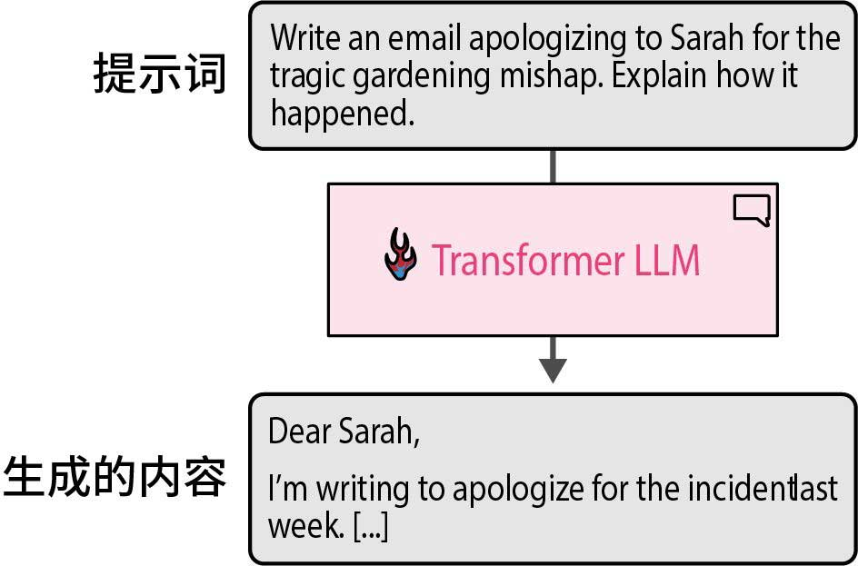

图3-1：从整体来看，Transformer LLM接收提示词输入，并输出生成的文本

模型并不是一次性生成所有文本，而是一次生成一个词元。图3-2展示了响应输入提示词时的四个词元生成步骤。每个词元生成步骤都是模型的一次前向传播（在机器学习中，前向传播指的是输入进入神经网络并流经计算图，最终在另一端产生输出所需的计算过程）。

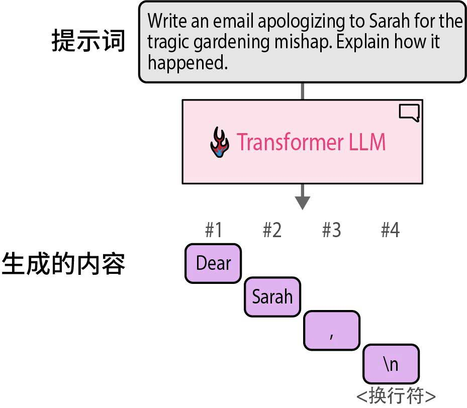

图3-2：Transformer LLM一次生成一个词元，而不是一次生成全部文本

在生成当前词元后，我们将输出词元追加到输入提示词的末尾，从而调整下一次生成的输入提示词。我们可以在图3-3中看到这一点。

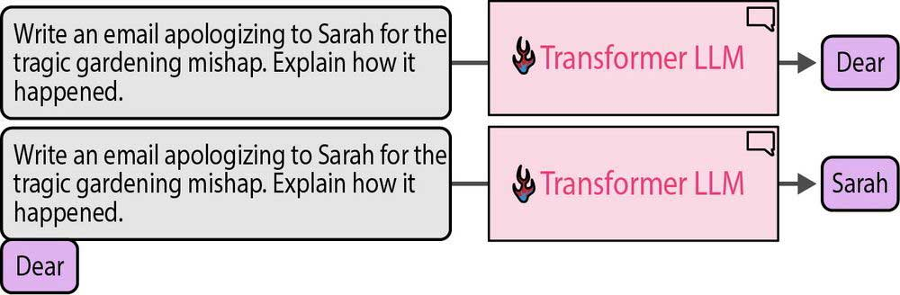

图3-3：输出词元被追加到提示词末尾后，得到的新文本会再次提供给模型进行另一次前向传播，以生成下一个词元

这让我们对模型有了更准确的认识，它只是基于输入提示词预测下一个词元。神经网络外围的软件基本上就是在循环运行这个模型，按顺序扩展生成的文本，直到完成。

在机器学习中，有一个专门的词用来描述使用早期预测来进行后续预测的模型（例如，模型使用生成的第一个词元来生成第二个词元），这类模型被称为**自回归模型**（autoregressive model）。这就是为什么文本生成式LLM也被称为自回归模型。这一名称通常用于区分文本生成模型与像BERT这样的非自回归的文本表示模型。

如下所示，当我们使用LLM生成文本时，在底层发生的就是这种自回归的、逐词元生成的过程。

```
prompt = "Write an email apologizing to Sarah for the tragic gardening mishap.
Explain how it happened."
output = generator(prompt)
print(output[0]['generated_text'])
```

这生成了以下文本：

```
Solution 1:
Subject: My Sincere Apologies for the Gardening Mishap
Dear Sarah,
I hope this message finds you well. I am writing to express my deep
```

我们可以看到模型从Subject（主题）一行开始写这封邮件。它突然停止，是因为达到了我们设置的max_new_tokens为50的限制。如果我们将这个值设置得更大，它会继续生成内容，直到完成这封邮件。

**3.1.2前向传播的组成**

除了循环之外，前向传播还有两个关键的内部组件：分词器和语言建模头（language modeling head，LM head）。图3-4展示了这些组件在系统中的位置。在上一章中，我们看到了分词器如何将文本分解成词元ID序列，然后用作模型的输入。

分词器之后是神经网络，由一系列Transformer块堆叠而成，负责执行所有的处理工作。在这些堆叠的块之后是语言建模头，它将Transformer块的输出转换为预测下一个词元的概率分数。

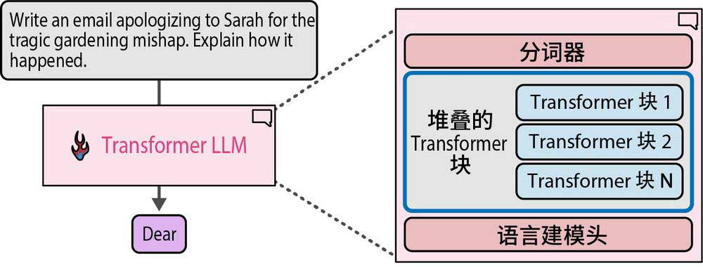

图3-4：Transformer LLM由分词器、堆叠的Transformer块和语言建模头组成

回顾第2章的内容，分词器包含一个词元表，即分词器的**词表**。模型为词表中的每个词元都关联了一个向量表示（词元嵌入）。图3-5展示了一个拥有50000个词元的词表及其对应的词元嵌入。

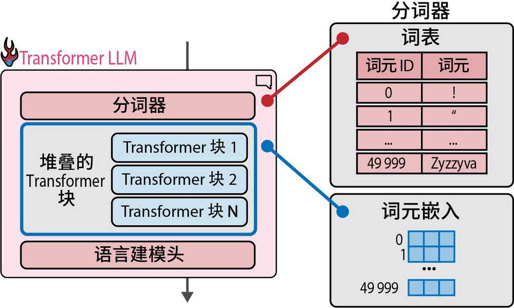

图3-5：分词器拥有50000个词元的词表，模型为这些词元关联了词元嵌入

计算流按照箭头方向从上到下进行。对于每个生成的词元，处理过程会按顺序依次经过堆叠成一列的所有Transformer块，然后到达语言建模头，最后输出下一个词元的概率分布，如图3-6所示。

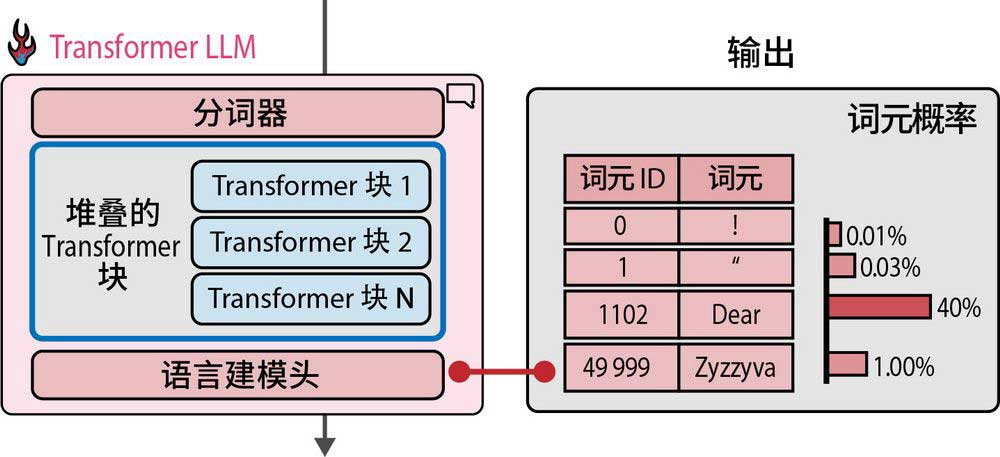

图3-6：在前向传播结束时，模型为词表中的每个词元预测一个概率分数

语言建模头本身是一个简单的神经网络层。它可以连接到堆叠的Transformer块上的多种可能的“头”之一，用于构建不同类型的系统。其他类型的Transformer头包括序列分类头和词元分类头。

我们只需打印模型变量，就可以按顺序显示所有层。对于这个模型，我们得到：

```
Phi3ForCausalLM(
  (model): Phi3Model(
    (embed_tokens): Embedding(32064, 3072, padding_idx=32000)
    (embed_dropout): Dropout(p=0.0, inplace=False)
    (layers): ModuleList(
      (0-31): 32 x Phi3DecoderLayer(
        (self_attn): Phi3Attention(
          (o_proj): Linear(in_features=3072, out_features=3072, bias=False)
          (qkv_proj): Linear(in_features=3072, out_features=9216, bias=False)
          (rotary_emb): Phi3RotaryEmbedding()
        )
        (mlp): Phi3MLP(
          (gate_up_proj): Linear(in_features=3072, out_features=16384, bias=False)
          (down_proj): Linear(in_features=8192, out_features=3072, bias=False)
          (activation_fn): SiLU()
        )
        (input_layernorm): Phi3RMSNorm()
        (resid_attn_dropout): Dropout(p=0.0, inplace=False)
        (resid_mlp_dropout): Dropout(p=0.0, inplace=False)
        (post_attention_layernorm): Phi3RMSNorm()
      )
    )
    (norm): Phi3RMSNorm()
  )
  (lm_head): Linear(in_features=3072, out_features=32064, bias=False)
)
```

观察这个结构，我们可以注意到以下几个重点。

·这个结构展示了模型的各种嵌套层。模型的主要部分标记为model，随后是lm_head。

·在Phi3Model内部，我们可以看到嵌入矩阵embed_tokens及其维度。它有32064个词元，每个词元的向量大小为3072。

·暂时跳过dropout层，我们可以看到下一个主要组件是堆叠的Transformer解码器层。它包含32个Phi3DecoderLayer类型的块。

·这些Transformer块中的每一个都包含一个注意力层和一个前馈神经网络（也称为MLP或多层感知器）。我们将在本章后面详细介绍这些内容。

·最后，我们看到lm_head接收一个大小为3072的向量，并输出一个大小等于模型所知词元数量的向量。该输出是每个词元的概率分数，帮助我们选择输出词元。

**3.1.3从概率分布中选择单个词元（采样/解码）**

在处理结束时，模型会为词表中的每个词元输出一个概率分数，正如我们在图3-6中看到的那样。从概率分布中选择单个词元的方法称为**解码策略**。图3-7展示了示例是如何选择词元Dear的。

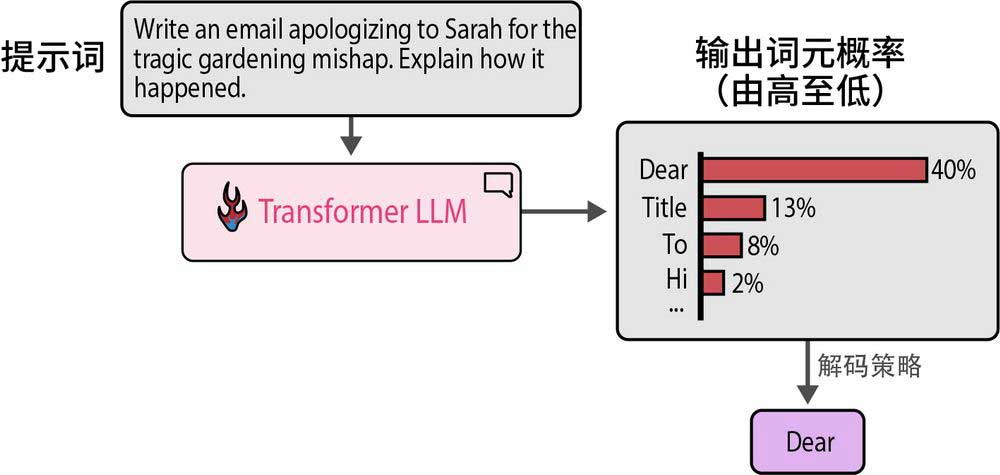

图3-7：经过模型前向传播后，基于上下文，模型可能输出的概率最高的几个词元。我们的解码策略通过基于概率的采样来决定输出哪个词元

最简单的解码策略就是始终选择概率分数最高的词元。但在实践中，对于大多数使用场景来说，这种方法往往无法产生最佳输出。一个更好的方法是引入一些随机性，有时选择概率第二高或第三高的词元。用统计学家的话来说，这种思想就是根据概率分数对概率分布进行**采样**。

对于图3-7中的例子来说，如果Dear作为下一个词元的概率为40%，那么它被选中的概率就是40%（而不是像贪心搜索那样，直接选择这个得分最高的词元）。这样，其他词元也有机会根据其分数被选中。

每次都选择概率分数最高的词元的策略被称为**贪心解码**。这就是在LLM中将温度（temperature）参数设为零时会发生的情况。我们将在第6章讨论温度的概念。

让我们仔细看看演示这个过程的代码。在这个代码块中，我们将输入词元传递给模型，然后传给lm_head：

```
prompt = "The capital of France is"
# 对输入提示词进行分词
input_ids = tokenizer(prompt, return_tensors="pt").input_ids
# 将词元ID移动到GPU上
input_ids = input_ids.to("cuda")
# 获取模型在lm_head之前的输出
model_output = model.model(input_ids)
# 获取lm_head的输出
lm_head_output = model.lm_head(model_output[0])
```

现在，lm_head_output的形状是[1, 5, 32064]。我们可以使用lm_head_output[0,-1]来访问最后生成的词元的概率分数，其中索引0用于批次维度，表示一批数据中的第一个，索引 -1用于获取序列中的最后一个词元。现在我们得到了全部32064个词元的概率分数列表。接下来我们可以获取得分最高的词元ID，然后解码，以得到生成的输出词元的文本：

```
token_id = lm_head_output[0,-1].argmax(-1)
tokenizer.decode(token_id)
```

结果是：

```
Paris
```

**3.1.4并行词元处理和上下文长度**

Transformer最引人注目的特性之一是，它比之前的语言处理神经网络架构更适合并行计算。在文本生成中，观察每个词元是如何处理的，就能初步了解这一点。我们从上一章知道，分词器会将文本分解成词元。然后每个输入词元都会流经自己的计算路径（这种直觉有助于我们更轻松地理解）。我们可以在图3-8中看到这些独立的计算流（也可以理解为处理路径）。

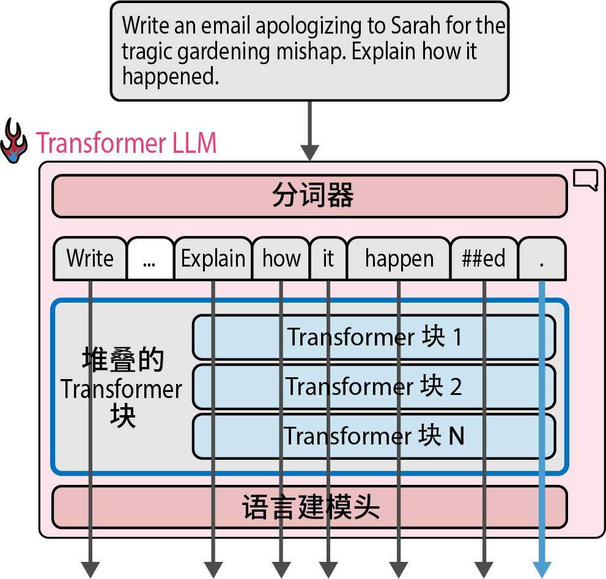

图3-8：每个词元都通过自己的计算流进行处理（之后我们会看到，它们在注意力步骤中会有一些交互）

当前的Transformer模型对一次可以处理的词元数量有限制，这个限制被称为模型的上下文长度。一个具有4K上下文长度的模型只能处理4000个词元，也就是只有4000条这样的流。

每条计算流都从一个输入向量开始（包括嵌入向量和一些位置信息。我们将在本章后面讨论位置嵌入）。在流的末尾，另一个向量作为模型处理的结果出现，如图3-9所示。

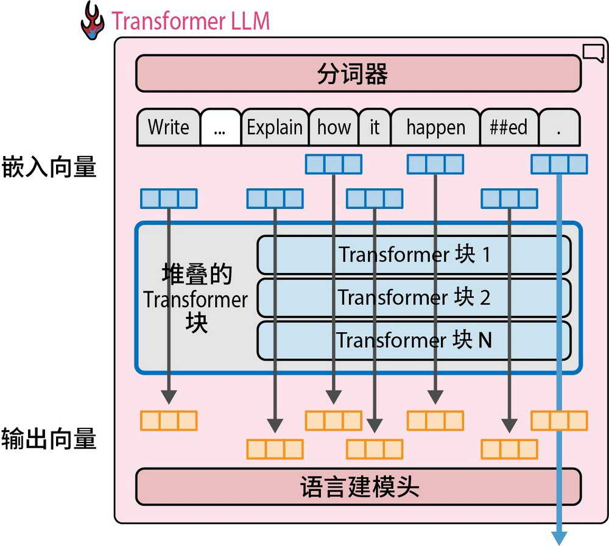

图3-9：每条处理流接收一个向量作为输入，并生成一个大小相同的最终结果向量（这一大小通常称为模型维度）

对于文本生成来说，只有最后一条计算流的输出结果用于预测下一个词元。当语言建模头计算下一个词元的概率时，该输出向量是唯一的输入。

你可能会疑惑，既然最终只用到最后一个词元的输出，为什么还需要所有的计算流？答案是，之前的流的计算结果是最终的流所必需的。没错，我们不会使用它们的最终输出向量，但会在每个Transformer块的注意力机制中使用其早期输出。

如果你在跟着代码示例学习，回想一下，lm_head的输出形式为[1, 5, 32064]，这是因为它的输入形式为[1, 5, 3072]，代表一个批次中包含一个输入字符串，该字符串包含5个词元，每个词元都由一个大小为3072的向量表示，这些向量对应着堆叠的Transformer块处理后的输出向量。

我们可以打印这些矩阵，以查看它们的维度：

```
model_output[0].shape
```

输出结果为：

```
torch.Size([1, 5, 3072])
```

同样，我们可以打印语言建模头的输出：

```
lm_head_output.shape
```

输出结果为：

```
torch.Size([1, 5, 32064])
```

**3.1.5通过缓存键-值加速生成过程**

回想一下，在生成第二个词元时，我们只是简单地将输出词元追加到输入的末尾，然后再次通过模型进行前向传播。如果模型能够缓存之前的计算结果（特别是注意力机制中的一些特定向量），就不需要重复计算之前的流，而只需要计算最后一条流了。这种优化技术被称为键 - 值（key-value，KV）缓存，它能显著加快生成过程。键和值是注意力机制的核心组件，我们将在本章后面详细介绍。

如图3-10所示，在生成第二个词元时，由于我们缓存了之前流的结果，只有一条计算流是活跃的。

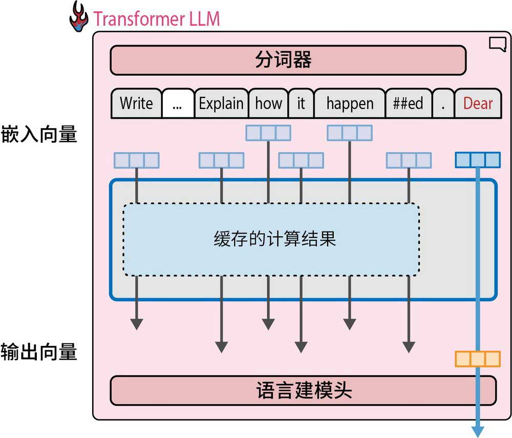

图3-10：在生成文本时，重要的是缓存之前词元的计算结果，而不是反复进行相同的计算

在Hugging Face Transformers中，缓存默认是启用的，可以将use_cache设置为False来禁用。我们可以请求一个较长的生成任务，并对比启用和禁用缓存的生成时间，从而感受差异：

```
prompt = "Write a very long email apologizing to Sarah for the tragic gardening
mishap. Explain how it happened."
# 对输入提示词进行分词
input_ids = tokenizer(prompt, return_tensors="pt").input_ids
input_ids = input_ids.to("cuda")
```

然后我们测量启用缓存后生成100个词元所需的时间。我们可以在Jupyter或Colab中使用%%timeit魔法命令来计时（它会多次运行命令并取用时的平均值）：

```
%%timeit -n 1
# 生成文本
generation_output = model.generate(
  input_ids=input_ids,
  max_new_tokens=100,
  use_cache=True
)
```

在配备T4 GPU的Colab上，这需要4.5秒。如果我们禁用缓存，需要多长时间呢？

```
%%timeit -n 1
# 生成文本
generation_output = model.generate(
  input_ids=input_ids,
  max_new_tokens=100,
  use_cache=False
)
```

用时变成了21.8秒，差异非常显著。事实上，从用户体验的角度来看，即使是4秒的生成时间，对于正盯着屏幕等待模型输出的用户来说也是很长的。这就是为什么LLM API会在模型生成过程中流式输出词元，而不是等待整个生成过程完成再输出。

**3.1.6Transformer块的内部结构**

现在我们来讨论Transformer模型的核心处理单元——Transformer块。如图3-11所示，Transformer LLM由一系列Transformer块组成（在原始Transformer论文中约为6个，而在许多LLM中超过100个）。每个块处理其输入，然后将其处理结果传递给下一个块。

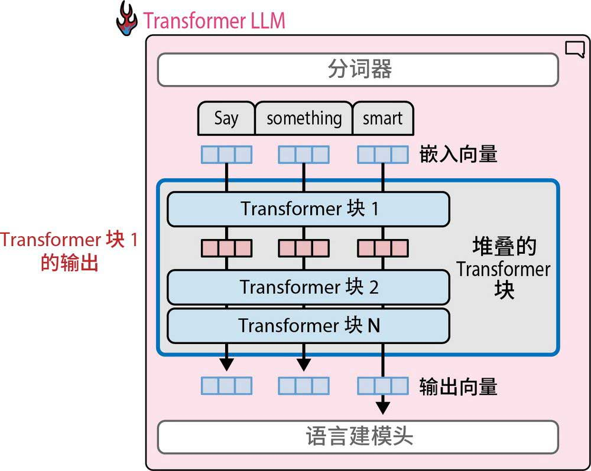

图3-11：Transformer LLM的大部分处理过程发生在一系列Transformer块中，每个块将其处理结果作为输入传递给下一个块

Transformer块由以下两个首尾相接的组件构成（图3-12）。

·**自注意力层**，主要负责整合来自其他输入词元和位置的相关信息。

·**前馈神经网络层**，包含模型的主要处理能力。

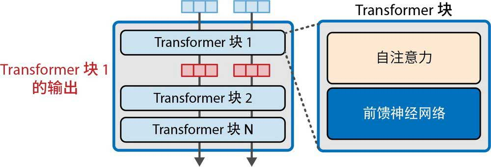

图3-12：Transformer块由一个自注意力层和一个前馈神经网络层组成

**1.前馈神经网络层概览**

让我们用一个简单的例子来理解前馈神经网络的工作原理：我们向语言模型输入“The Shawshank”，期望它生成“Redemption”（指1994年的电影《肖申克的救赎》）。

如图3-13所示，前馈神经网络（分布在所有模型层中）就是这些信息的来源。当模型在大规模文本数据（包含大量对“The Shawshank Redemption”的引用）上完成训练后，它学习并存储了完成这项任务所需的信息（和行为）。

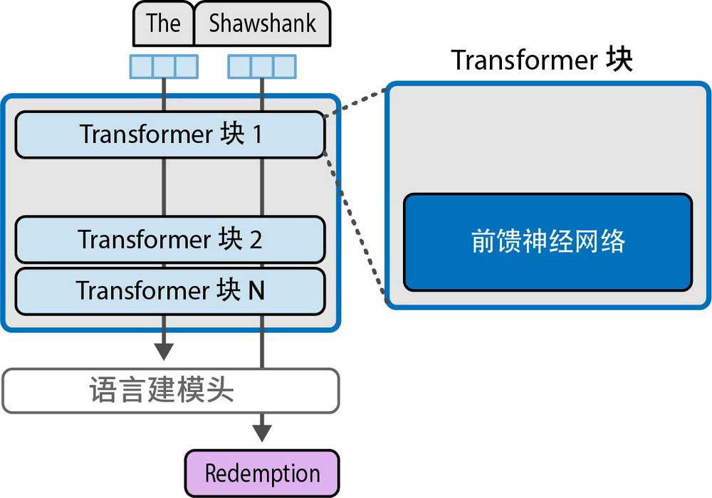

图3-13：Transformer块中的前馈神经网络层可能承担了模型大部分的记忆和插值工作

要想成功训练一个LLM，需要让它记住大量信息。但它并不仅仅是一个大型数据库。记忆只是生成出色文本的众多要素之一。模型能够利用相同的机制在数据点之间进行插值，识别更复杂的模式，从而实现泛化，这意味着它能够很好地处理以前从未见过、不在训练数据集中的输入。


当你使用现代商用LLM时，你得到的输出并不是前文中严格意义上的“语言模型”的输出。如果向GPT-4这样的对话型LLM输入“The Shawshank”，它会输出：

```
"The Shawshank Redemption" is a 1994 film directed
by Frank Darabont and is based on the novella "Rita
Hayworth and Shawshank Redemption" written by Stephen
King. ...etc.
```

这是因为原始语言模型（如GPT-3）对用户来说很难用，因此语言模型需要通过指令微调和基于人类偏好与反馈的微调，来满足人们对模型输出的期望。

**2.自注意力层概览**

上下文对于正确建模语言至关重要。仅仅依靠基于前一个词元的简单记忆和插值是远远不够的。我们能得出这个结论，是因为这是神经网络出现之前构建语言模型的主要方法之一（参见Daniel Jurafsky和James H. Martin的*SpeechandLanguageProcessing*第3章“*N*-gram Language Models”）。

注意力机制帮助模型在处理特定词元时整合上下文信息。考虑以下提示词：

The dog chased the squirrel because **it（狗追松鼠，因为它）**

为了预测it之后的内容，模型需要知道it指代什么，是狗还是松鼠？

在已训练的Transformer LLM中，注意力机制负责做出这种判断。注意力机制将上下文信息添加到it词元的表示中。我们可以在图3-14中看到一个简单的示例。

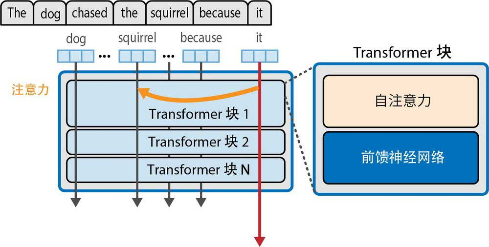

图3-14：自注意力层整合了来自前序位置的相关信息，用于处理当前词元

模型是基于从训练数据集中观察和学习到的模式来实现这一点的。前文中的句子可能提供了更多线索，比如前文中用she指代狗，那就表明it指代的是松鼠。

**3.注意力机制的重要性**

我们有必要深入地了解注意力机制。图3-15展示了注意力机制的极简版本。它显示了多个进入自注意力层的词元位置，最后一个是当前正在处理的位置（粉色箭头）。注意力机制作用于该位置的输入向量，它将上下文中的相关信息整合到该位置的输出向量中。

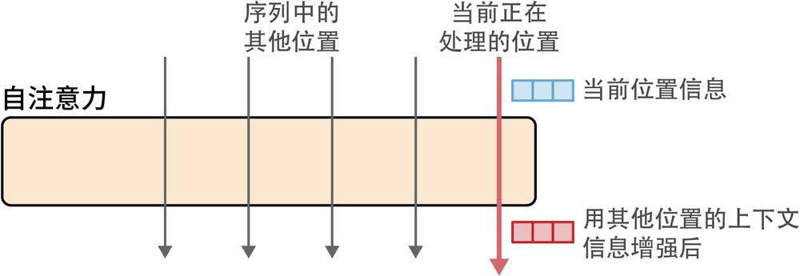

图3-15：注意力机制的简化示意图：一个输入序列和当前正在处理的位置。由于我们主要关注的是这个位置，图中显示了一个输入向量和一个输出向量，其中输出向量基于注意力机制整合了序列中前面元素的信息

注意力机制包含以下两个主要步骤。

·对当前处理的词元（粉色箭头所示）与之前输入词元的相关性评分。

·利用这些分数，将不同位置的信息组合成单一的输出向量。

图3-16展示了这两个步骤。

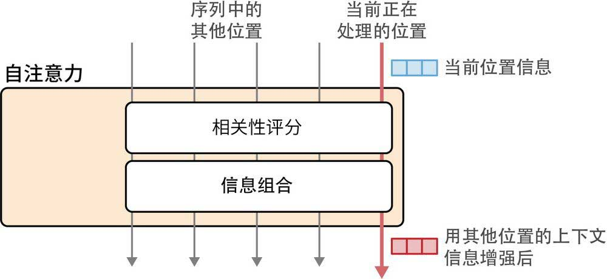

图3-16：注意力机制由两个主要步骤组成：对每个位置进行相关性评分，然后基于这些评分进行信息组合

为了赋予Transformer更强大的注意力能力，注意力机制被复制多份，并行执行。这些并行的注意力执行过程被称为**注意力头**（attention head）。这提高了模型对输入序列中复杂模式的建模能力，使其能够同时关注不同的模式。

图3-17直观地展示了多个注意力头如何并行运行，包括前面的信息分割步骤和后面的所有注意力头的结果合并步骤。

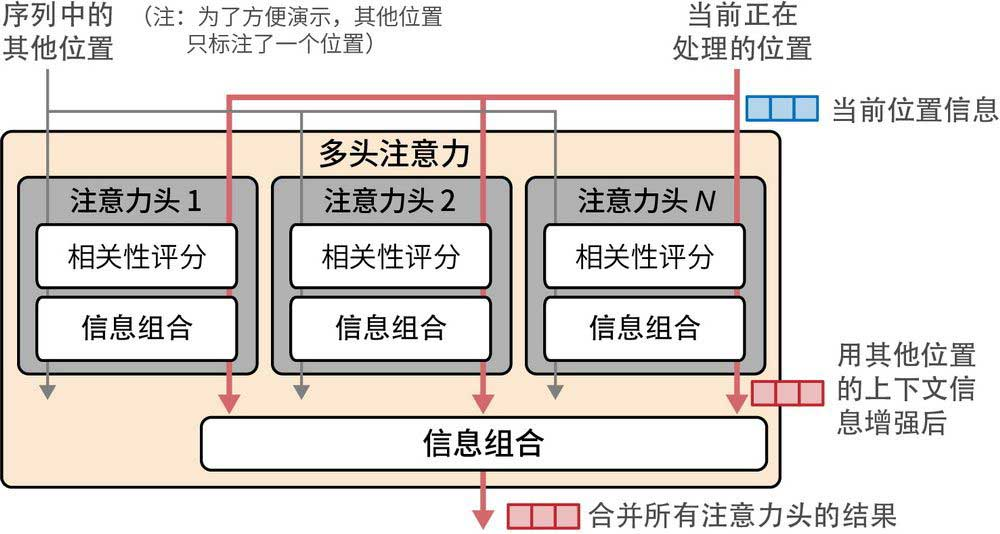

图3-17：通过并行执行多次注意力计算来获得更好的LLM，提高模型关注不同类型的信息的能力

**4.注意力的计算方式**

让我们来看看单个注意力头内的注意力是如何计算的。在开始计算之前，我们先观察以下起始状态。

·（生成式LLM中的）注意力层正在为单个位置处理注意力。

·该层的输入包括：

·当前位置或词元的向量表示

·前序词元的向量表示

·目标是为当前位置生成一个新的表示，其中包含来自前序词元的相关信息。例如，我们正在处理句子“Sarah fed the cat because it”（Sarah喂了猫，因为它）的最后一个位置，我们希望it表示那只猫，所以注意力机制会融入来自cat词元的“猫的信息”。

·训练过程会产生三个投影矩阵，用于生成参与计算的组件：

·查询投影矩阵

·键投影矩阵

·值投影矩阵

图3-18展示了注意力计算开始前这些组件的起始状态。为简单起见，我们只考察一个注意力头，因为其他注意力头进行的是同样的计算，只是使用各自的投影矩阵。

注意力首先将输入与投影矩阵相乘，得到三个新矩阵，称为查询矩阵、键矩阵和值矩阵。这些矩阵包含了投影到三个不同空间的输入词元信息，用于执行注意力的两个步骤：

·相关性评分

·信息组合

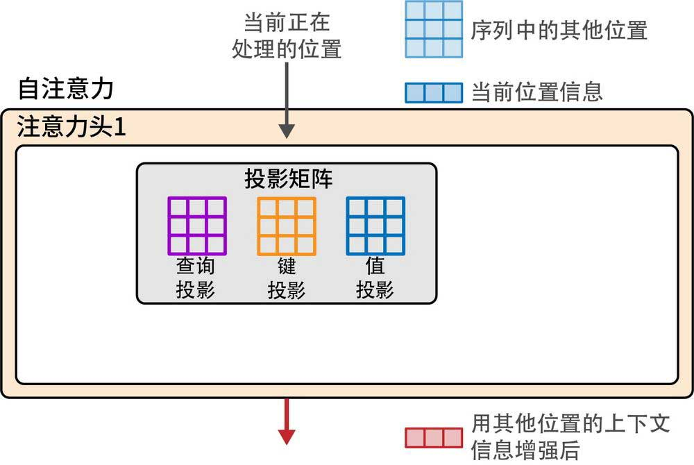

图3-18：在开始注意力计算之前，该层的输入和查询、键、值的投影矩阵已准备就绪

图3-19展示了这三个新矩阵，以及三个矩阵的最后一行如何与当前位置相关联，而上面的行则与前序位置相关联。

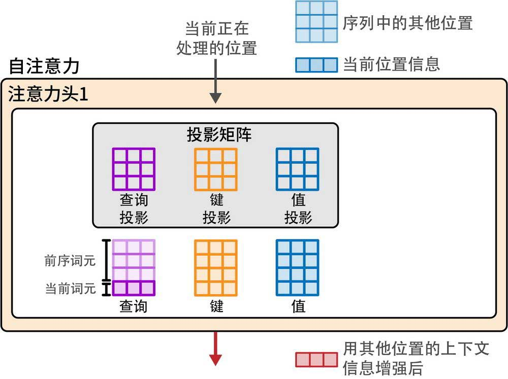

图3-19：注意力是通过查询矩阵、键矩阵和值矩阵的交互来执行的。这些矩阵是将层的输入与投影矩阵相乘得到的

**5.自注意力：相关性评分**

在生成式Transformer中，一次生成一个词元意味着一次处理一个位置。因此，注意力机制在这里只关注这一个位置（当前位置），以及如何从其他位置提取信息来为当前位置提供参考。

注意力机制的相关性评分步骤是通过将当前位置的查询向量与键矩阵相乘来实现的。这一操作会产生一组分数，用以衡量当前位置之前的每一个词元的相关性。接下来，通过softmax操作对这些分数进行归一化，使它们的和为1。图3-20展示了计算得到的相关性分数。

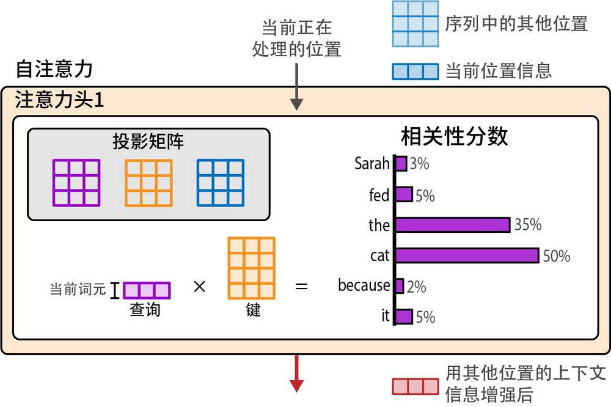

图3-20：将与当前位置相关的查询向量和键矩阵相乘，以完成对前序词元的相关性评分

**6.自注意力：信息组合**

有了相关性分数，我们用每个词元对应的值向量乘以该词元的分数，然后将这些结果向量相加，就得到了注意力步骤的输出，如图3-21所示。

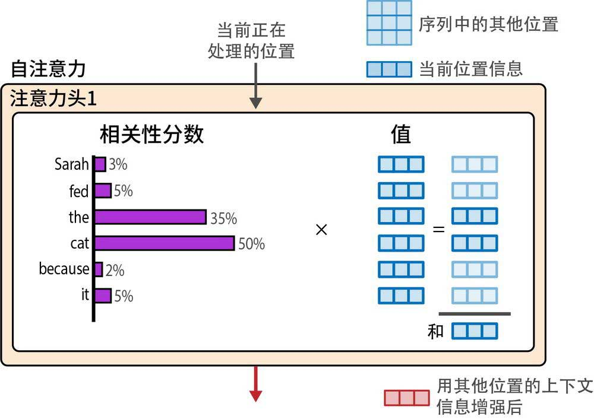

图3-21：注意力将前序位置的相关性分数与其对应的值向量相乘，来组合相关信息

### 3.2 Transformer架构的最新改进

自Transformer架构发布以来，已经有大量工作致力于对其进行改进，以提升模型性能和效率。这些改进包括在更大的数据集上进行训练、优化训练过程和学习率，以及对架构本身的调整。截至本书撰写之时，原始Transformer的一些核心架构理念依旧沿用，同时，有几个新的架构理念被提出并已经被证明是很有价值的，为提升Llama 2等Transformer模型的性能做出了贡献。在本章的最后一节，我们将回顾关于Transformer架构的一些重要的近期发展。

**3.2.1更高效的注意力机制**

Transformer的自注意力层是学术界最关注的部分。这是因为注意力计算是整个过程中计算开销最大的部分。

**1.稀疏注意力**

随着Transformer规模越来越大，稀疏注意力（参见论文“Generating Long Sequences with Sparse Transformers”）和滑动窗口注意力（参见论文“Longformer: The Long-Document Transformer”）等理念提高了注意力计算的效率。如图3-22所示，稀疏注意力限制了模型可以关注的前序词元的上下文。

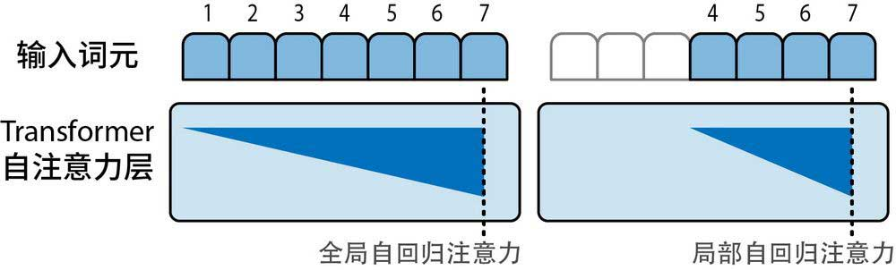

图3-22：稀疏注意力通过只关注少量前序位置来提升性能

GPT-3就是一个集成了这种机制的模型。但它并不是在所有Transformer块中都使用这种机制——如果模型只能看到少量的前序词元，生成质量会大幅下降。GPT-3架构交替使用全注意力和稀疏注意力的Transformer块。因此，Transformer块在全注意力（如模块1和模块3）和稀疏注意力（如模块2和模块4）之间交替。

图3-23展示了不同类型的注意力机制的工作方式，其中每张图显示了在处理当前词元（深蓝色）时可以关注哪些前序词元（浅蓝色）。

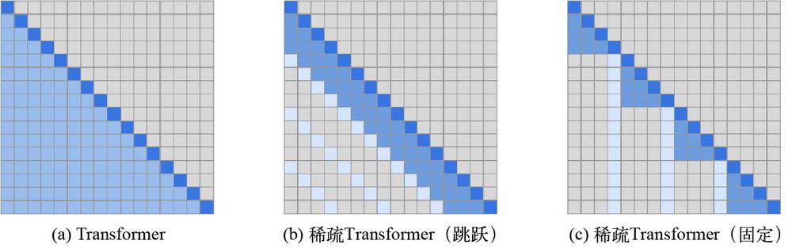

图3-23：全注意力与稀疏注意力的对比。图3-24解释了颜色的含义（图片来源：论文“Generating Long Sequences with Sparse Transformers”）

图3-23的每一行对应正在处理一个词元。颜色编码表示模型在处理深蓝色单元格中的词元时能够关注哪些词元。图3-24更清晰地描述了这一点。

图3-24还展示了（构成大多数文本生成模型的）解码器Transformer块的自回归特性：它们只能关注前序词元。与此相比，BERT可以关注两个方向（BERT中的B代表bidirectional，即“双向”）。

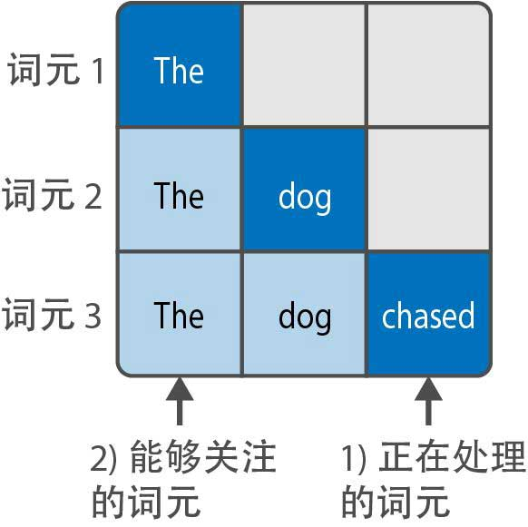

图3-24：注意力机制的工作方式，图中显示正在处理的词元，以及注意力机制允许它关注的前序词元

**2.多查询注意力和分组查询注意力**

关于Transformer中的注意力，最近一项提高效率的改进是分组查询注意力（grouped-query attention，GQA，参见论文“GQA: Training Generalized Multi-Query Transformer Models from Multi-Head Checkpoints”），它被Llama 2和Llama 3等模型使用。图3-25展示了这些不同类型的注意力，下一节将进一步解释。

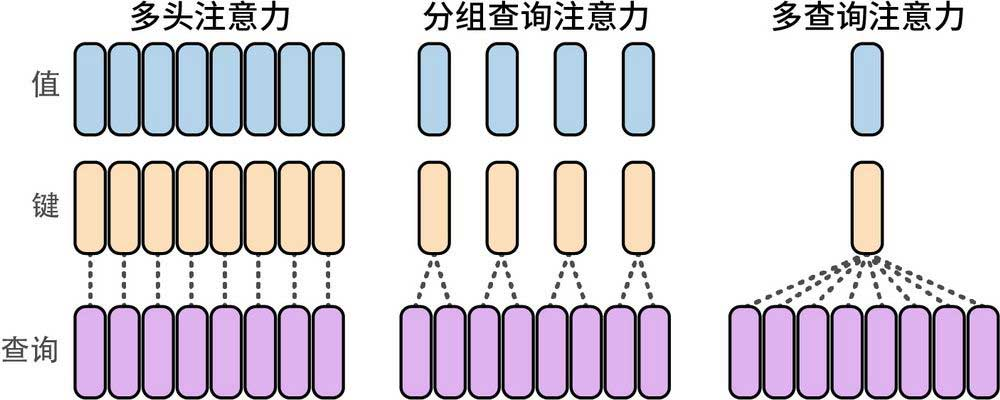

图3-25：不同类型注意力的比较：原始的多头注意力、分组查询注意力和多查询注意力（图片来源：论文“Fast Transformer Decoding: One Write-Head is All You Need”）

分组查询注意力建立在多查询注意力（参见“Fast Transformer Decoding: One Write-Head is All You Need”）的基础之上。这些方法通过减小涉及的矩阵的大小来提高大模型推理的可扩展性。

**3.优化注意力机制：从多头到多查询再到分组查询**

在本章前面，我们展示了Transformer的论文如何描述多头注意力。“The Illustrated Transformer”一文详细讨论了如何使用查询矩阵、键矩阵和值矩阵来进行注意力计算。图3-26展示了每个注意力头如何为给定输入计算其独特的查询矩阵、键矩阵和值矩阵。

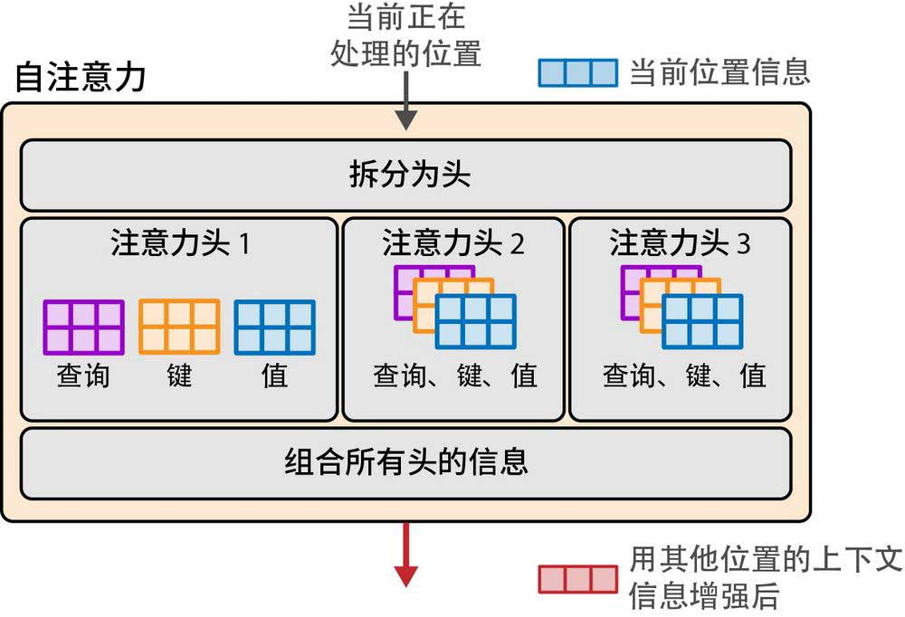

图3-26：注意力机制通过查询矩阵、键矩阵和值矩阵来实现。在多头注意力中，每个注意力头都有一组独立的查询矩阵、键矩阵和值矩阵

多查询注意力通过在所有注意力头之间共享键矩阵和值矩阵来实现优化。如图3-27所示，每个注意力头只保留独特的查询矩阵。

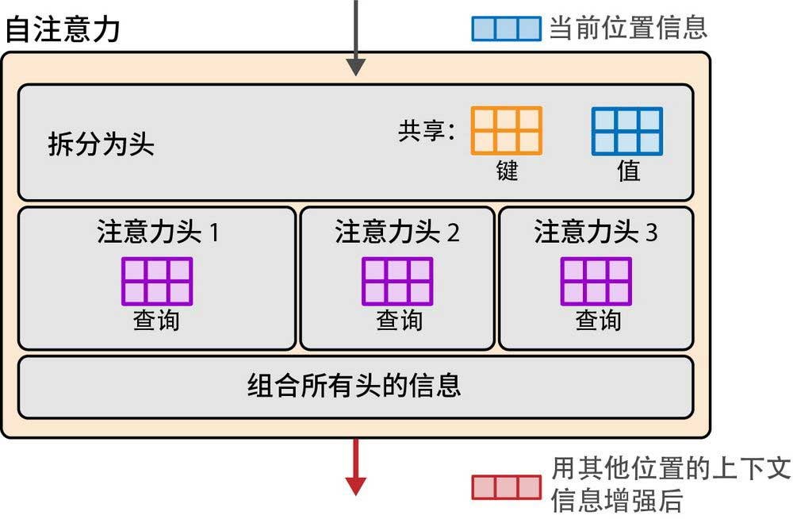

图3-27：多查询注意力通过在所有注意力头之间共享键矩阵和值矩阵，提供了一种更高效的注意力机制

然而，随着模型规模的增长，这种优化可能会带来过大的性能损失，此时我们可以牺牲一些内存来提升模型质量。这就是分组查询注意力的用武之地。它不是将键矩阵和值矩阵的数量减少到各一个，而是允许使用更多的矩阵（但少于注意力头的数量）。图3-28展示了这些分组，以及每组注意力头如何共享键矩阵和值矩阵。

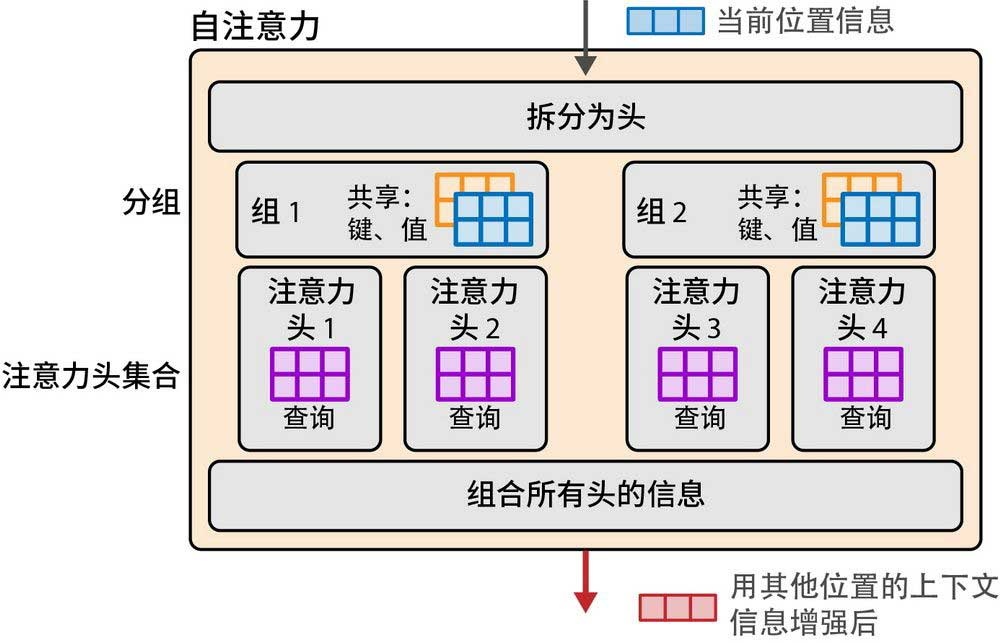

图3-28：分组查询注意力利用多组共享的键矩阵和值矩阵，牺牲了一些多查询注意力的效率来换取质量的大幅提升。每个分组都有其对应的注意力头集合

**4.FlashAttention**

Flash Attention是一种广受欢迎的方法和实现，可以显著提升GPU上Transformer LLM的训练和推理速度。它通过优化GPU共享内存（GPU's shared memory，SRAM）和高带宽内存（high bandwidth memory，HBM）之间的数据加载和迁移来加速注意力计算。详细内容可参见论文“FlashAttention: Fast and Memory-Efficient Exact Attention with IO-Awareness”以及后续的“FlashAttention-2: Faster Attention with Better Parallelism and Work Partitioning”。

**3.2.2Transformer块**

回顾一下，Transformer块的两个主要组成部分是自注意力层和前馈神经网络层。如图3-29所示，深入Transformer块的细节，还能发现残差连接和层归一化操作。

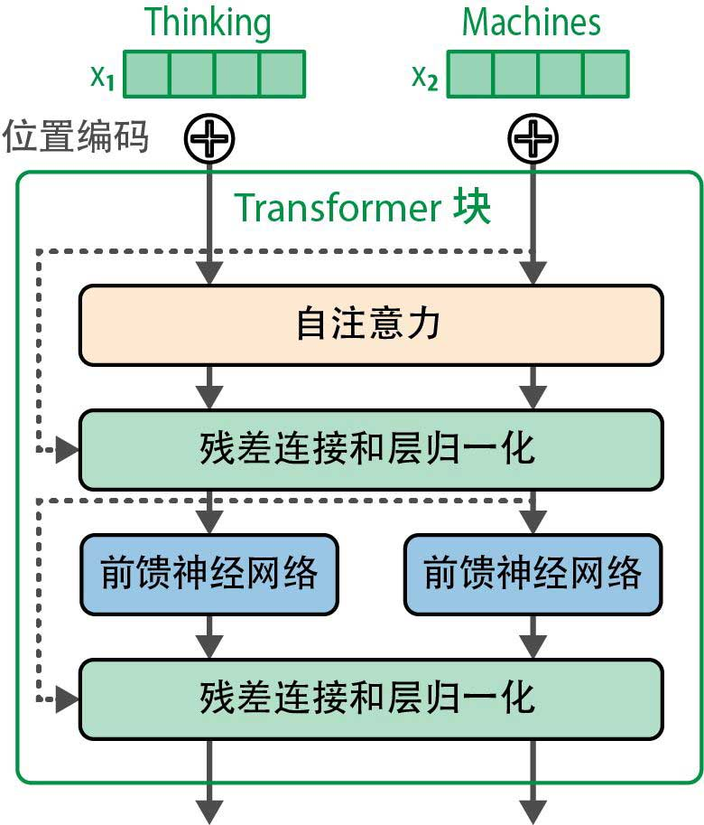

图3-29：原始Transformer论文中的Transformer块

在撰写本书时，最新的Transformer模型仍然保留了主要组件，但进行了一些调整，如图3-30所示。

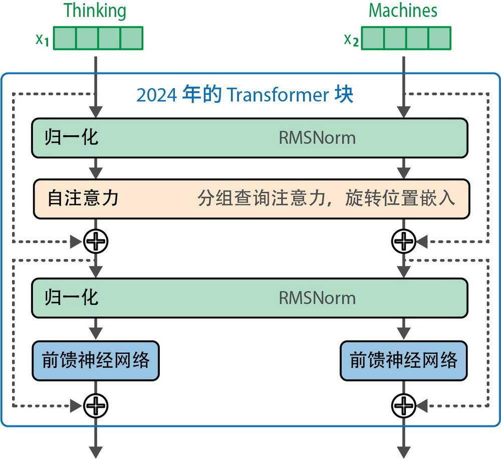

图3-30：2024年的Transformer（如Llama 3）的Transformer块有一些新的改进，如预归一化（通过RMSNorm实现），以及通过分组查询注意力和旋转位置嵌入优化的注意力机制

在这个版本的Transformer块中，我们看到的一个区别是归一化发生在自注意力层和前馈神经网络层之前。据称，这种方式可以减少所需的训练时间（参见论文“On Layer Normalization in the Transformer Architecture”）。这里对归一化的另一个改进是使用RMSNorm，它比原始Transformer中使用的LayerNorm更简单、更高效（参见论文“Root Mean Square Layer Normalization”）。最后，相比原始Transformer的ReLU激活函数，现在像SwiGLU这样的新变体（参见论文“GLU Variants Improve Transformer”）更为常见。

**3.2.3位置嵌入：RoPE**

位置嵌入自原始Transformer以来一直是关键组件。它们使模型能够跟踪序列 / 句子中词元 / 词的顺序，这是语言中不可或缺的信息来源。在过去几年提出的众多位置编码方案中，旋转位置嵌入（rotary position embedding，RoPE，参见论文“RoFormer: Enhanced Transformer with Rotary Position Embedding”）尤其值得关注。

原始Transformer论文和一些早期变体采用绝对位置嵌入，本质上是将第一个词元标记为位置1，第二个标记为位置2，以此类推。这些方法可以是静态的（使用几何函数生成位置向量）或可学习的（模型在训练过程中为它们赋值）。当我们将模型扩展到更大的规模时，这些方法会带来一些挑战，这要求我们找到提高其效率的途径。

举例来说，在训练长上下文模型时的一个挑战是，训练集中有很多文档的长度都远小于上下文长度。如果为一个只有10个词的短句分配整个4K的上下文空间，这显然是很低效的。因此在模型训练过程中，多个文档会被一同打包到每个训练批次的上下文中，如图3-31所示。

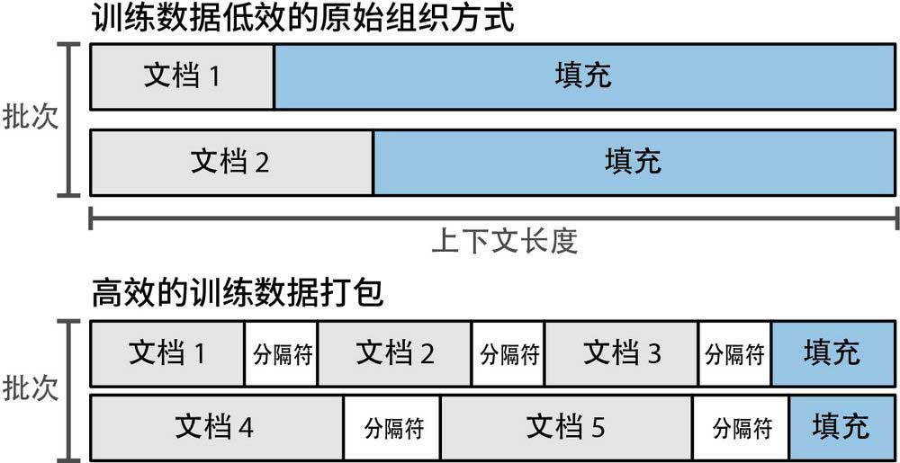

图3-31：打包是一个将短训练文档高效组织到上下文中的过程，包括在单个上下文中对多个文档进行分组，同时最小化上下文末尾的填充

如需了解更多关于打包的信息，可以参考论文“Efficient Sequence Packing without Cross-Contamination: Accelerating Large Language Models without Impacting Performance”，以及“Introducing Packed BERT for 2X Training Speed-up in Natural Language Processing”视频和文章中的精彩可视化内容。

除了必须适应打包过程，位置嵌入方法还需要考虑实践中的其他因素。如果文档50从位置50开始，那么告诉模型第一个词元是第50个就会误导模型，并影响其性能（因为它会假设存在前文，而实际上前面的词元属于另一个无关的文档，模型应该忽略）。

与在前向传播开始时添加的静态绝对嵌入不同，旋转位置嵌入是一种以捕获绝对和相对词元位置信息的方式来编码位置信息的方法，其思想的基础是嵌入空间中旋转的向量。在前向传播中，旋转位置嵌入是在注意力步骤中添加的，如图3-32所示。

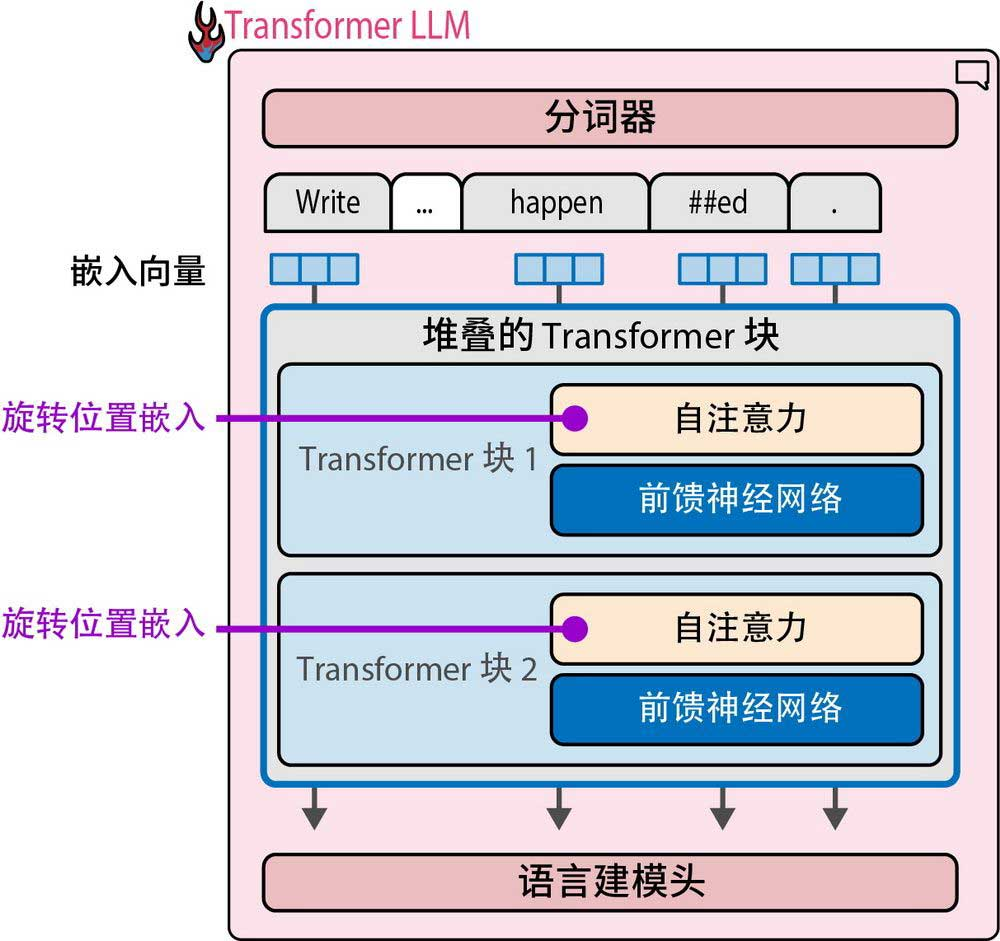

图3-32：旋转位置嵌入是应用在注意力步骤中的，而不是应用在前向传播的开始

在注意力步骤中，我们特意把位置信息混合到查询矩阵和键矩阵中。这个混合过程发生在我们将查询向量和键矩阵相乘，进行相关性评分之前，如图3-33所示。

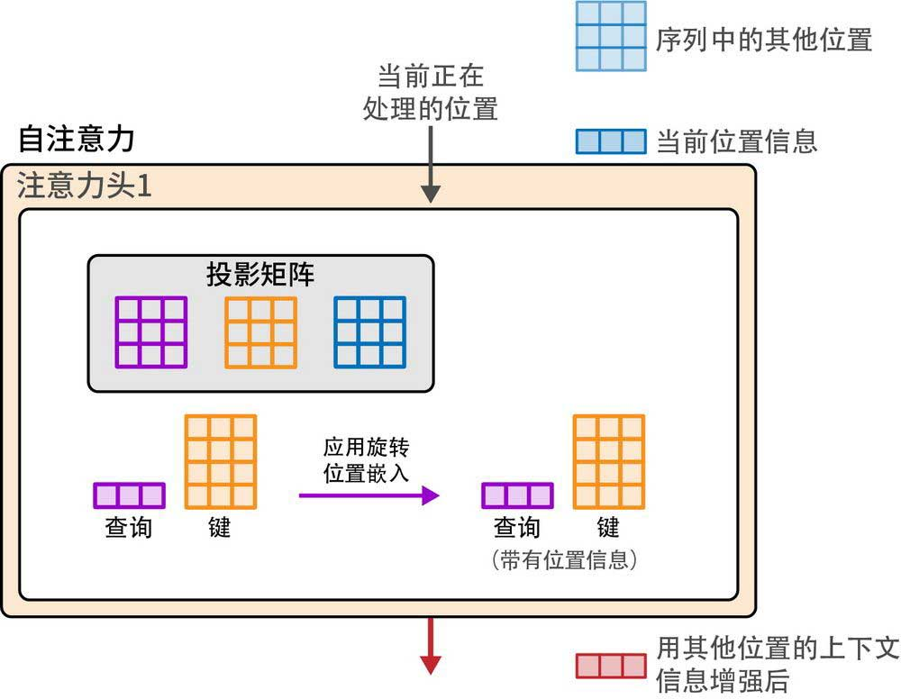

图3-33：旋转位置嵌入在自注意力中的相关性评分步骤之前，被添加到词元的表示中

**3.2.4其他架构实验和改进**

学术界持续提出和研究了许多Transformer的改进方案。论文“A Survey of Transformers”介绍了这些改进方案的一些主要方向。Transformer架构也在不断适应LLM之外的领域。计算机视觉是一个有大量Transformer架构研究参与的领域（参见论文“Transformers in Vision: A Survey”和“A Survey on Vision Transformer”）。其他领域包括机器人技术（参见论文“Open X-Embodiment: Robotic Learning Datasets and RT-X Models”）和时间序列（参见论文“Transformers in Time Series: A Survey”）。

### 3.3 小结

在本章中，我们讨论了Transformer的核心工作原理，以及最新的Transformer LLM背后的技术进展。我们介绍了许多新概念，下面总结一下本章讨论的关键概念。

·Transformer LLM **每次生成一个词元**。

·生成的词元会**被追加到提示词中**，然后，这个更新后的提示词会再次被输入模型进行下一次前向传播，以生成下一个词元。

·Transformer LLM的**三个主要组件**是分词器、一系列Transformer块和语言建模头。

·分词器包含模型的**词元词表。模型中包含与这些词元相关联的词元嵌入**。将文本分解成词元，然后使用这些词元的嵌入向量，是词元生成过程的第一步。

·前向传播会**依次**经过所有阶段。

·在处理接近尾声时，语言建模头会对**下一个可能的词元进行概率评分**。解码策略决定了在这一生成步骤中选择哪个实际词元作为输出（有时是概率最高的下一个词元，但并非总是如此）。

·Transformer表现出色的原因之一是它能够并行处理词元。每个输入词元都流入其**独立的计算流**（也称为处理路径）。这些流的数量就是模型的“上下文长度”，代表模型可以处理的最大词元数量。

·由于Transformer LLM通过循环来一次生成一个词元的文本，因此**缓存**每个步骤的处理结果是一种很好的策略，这样可以避免重复处理工作（这些结果以各种矩阵的形式存储在层中）。

·大部分处理发生在**Transformer块中。这些块由两个组件组成，其中一个是前馈神经网络**，它能够存储信息，并根据训练数据进行预测和插值。

·Transformer块的另一个主要组件是**自注意力**。自注意力整合了上下文信息，使模型能够更好地捕捉语言的细微差别。

·注意力过程分为两个主要步骤：相关性评分；信息组合。

·Transformer的自注意力层并行执行多个注意力操作，每个操作都发生在**注意力头**内，它们的输出被聚合成自注意力层的输出。

·通过在所有注意力头或一组注意力头（**分组查询注意力）**之间共享键矩阵和值矩阵，可以加速注意力计算。

·**FlashAttention**等方法通过优化在GPU不同显存系统上的操作方式来加速注意力计算。

Transformer架构在不断发展和创新，研究人员持续提出改进方案，使其能更好地适应语言模型以及其他领域和应用场景。

在本书的第二部分，我们将介绍LLM的一些实际应用。在第4章中，我们从文本分类这一语言人工智能中的常见任务开始，介绍生成模型和表示模型的应用。


---

# 第二部分

# 使用预训练语言模型


---

## 第4章 文本分类

文本分类是NLP中的一项常见任务。该任务的目标是训练一个模型，为输入的文本分配标签或类别（见图4-1）。从情感分析和意图识别，到实体提取和语言检测，文本分类在全球范围内被广泛应用。表示模型和生成模型在文本分类中的重要作用不容忽视。


图4-1：使用语言模型进行文本分类

本章将介绍几种使用语言模型进行文本分类的方法，作为前置内容，帮你了解如何使用预训练语言模型。由于文本分类涉及领域广泛，我们将结合几种技术，借此探索语言模型领域。

·4.2节展示了表示模型在分类方面的灵活性。我们将介绍特定任务模型和嵌入模型。

·4.6节关注生成模型，它们大多同样可用于分类。我们将涵盖一个开源和一个专有的模型。

在本章中，我们将重点关注如何利用预训练语言模型（已经在大量数据上训练过的模型）来完成文本分类任务。如图4-2所示，我们将同时研究表示模型和生成模型，探索它们之间的差异。

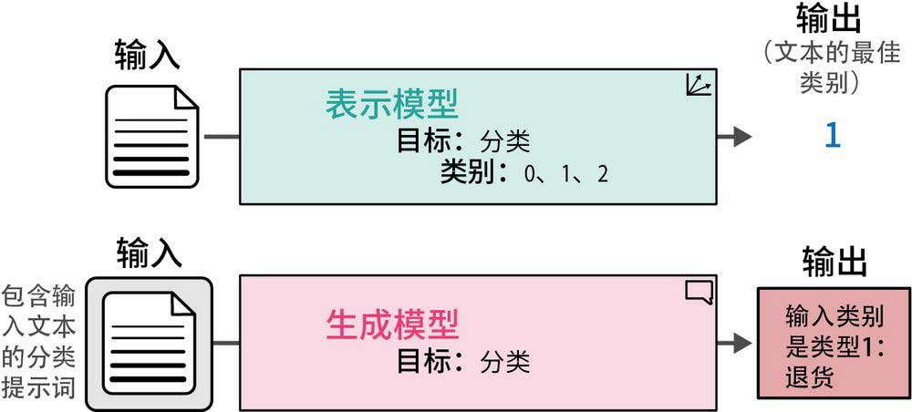

图4-2：虽然表示模型和生成模型都可用于分类，但它们的方法不同

本章还可以作为各种语言模型（包括生成模型和表示模型）的入门指南，我们将接触一些常用的工具包，帮助你加载和使用这些模型。


尽管本书主要关注LLM，但强烈建议将这些示例与经典、强大的基准方法进行比较，比如使用TF-IDF表示文本并在其基础上训练逻辑回归分类器。

### 4.1 电影评论的情感分析

1. Bo Pang and Lillian Lee. “Seeing Stars: Exploiting Class Relationships for Sentiment Categorization with Respect to Rating Scales.” arXiv preprint cs/0506075 (2005).

本章用于探索文本分类技术的数据可以在Hugging Face上找到。我们将使用著名的rotten_tomatoes数据集来训练和评估我们的模型
 [](#footnote-13-71)。该数据集包含来自烂番茄（Rotten Tomatoes）的5331条正面的和5331条负面的电影评论。

为了加载这些数据，我们使用datasets包，此包的使用也将贯穿全书：

```
from datasets import load_dataset
# 加载数据
data = load_dataset("rotten_tomatoes")
data
DatasetDict({
    train: Dataset({
        features: ['text', 'label'],
        num_rows: 8530
    })
    validation: Dataset({
        features: ['text', 'label'],
        num_rows: 1066
    })
    test: Dataset({
        features: ['text', 'label'],
        num_rows: 1066
    })
})
```

数据被分为**训练集、测试集和验证集**。在本章中，我们将使用训练集来训练模型，使用测试集来验证结果。请注意，如果你使用训练集和测试集进行超参数调优，那么附加的验证集可以用来进一步验证模型的泛化能力。

让我们看看训练集中的一些例子：

```
data["train"][0, -1]
{'text': ['the rock is destined to be the 21st century\'s new " conan " and
that he\'s going to make a splash even greater than arnold schwarzenegger ,
jean-claud van damme or steven segal .',
  'things really get weird , though not particularly scary : the movie is all
portent and no content .'],
 'label': [1, 0]}
```

这些简短的评论被标记为正例（1）或负例（0）。这意味着我们将专注于二元情感分类。

### 4.2 使用表示模型进行文本分类

使用预训练表示模型进行分类，通常有两种方式：要么使用特定任务模型，要么使用嵌入模型。正如我们在上一章所探讨的，这些模型是通过在特定下游任务上微调基础模型（如BERT）而创建的，如图4-3所示。

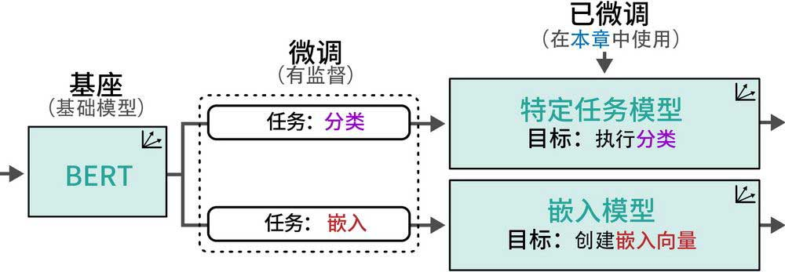

图4-3：基础模型针对特定任务进行微调，例如执行分类任务或生成通用嵌入向量

特定任务模型是一种表示模型（如BERT），它针对特定任务（如情感分析）进行训练。正如我们在第1章所探讨的，嵌入模型可以生成通用嵌入向量，这些嵌入向量可用于各种任务，不仅限于分类，还包括语义搜索（参见第8章）。

第11章将介绍为分类任务微调BERT模型的过程，而第10章将讲解如何构建嵌入模型。在本章中，我们让这两种模型保持在**冻结**（frozen，即不可训练）状态，仅使用它们的输出，如图4-4所示。

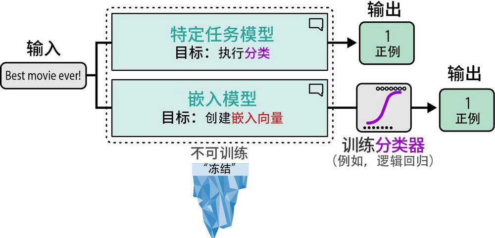

图4-4：使用特定任务模型直接进行分类，或使用通用嵌入向量间接进行分类

我们将利用其他人已经微调好的预训练模型，探索如何对我们选定的电影评论进行分类。

### 4.3 模型选择

1. 截至本书中文版出版，数量已分别超过90000和10000。——编者注

选择合适的模型并不像你想象的那么简单。在撰写本书时，Hugging Face上有超过60000个用于文本分类的模型和超过8000个生成嵌入向量的模型
 [](#footnote-13-74)。此外，选择适合你的用例的模型至关重要，还需要考虑其语言兼容性、底层架构、规模和性能。

让我们从底层架构开始。正如我们在第1章中所探讨的，BERT这个著名的仅编码器架构，是创建特定任务模型和嵌入模型的热门选择。虽然像GPT系列这样的生成模型非常出色，但仅编码器模型在特定任务用例中表现同样出色，而且规模往往小得多。

1. Yinhan Liuet et al. “RoBERTa: A Robustly Optimized BERT Pretraining Approach.” arXiv preprint arXiv:1907.11692 (2019).

1. Victor Sanh et al. “DistilBERT, A Distilled Version of BERT: Smaller, Faster, Cheaper and Lighter.” arXiv preprint arXiv:1910.01108 (2019).

1. Zhenzhong Lan et al. “ALBERT: A Lite BERT for Self-Supervised Learning of Language Representations.” arXiv preprint arXiv:1909.11942 (2019).

1. Pengcheng He et al. “DeBERTa: Decoding-Enhanced BERT with Disentangled Attention.” arXiv preprint arXiv:2006.03654 (2020).

多年来，BERT发展出了许多变体，包括RoBERTa
 [](#footnote-13-26)、DistilBERT
 [](#footnote-13-38)、ALBERT
 [](#footnote-13-46)和DeBERTa
 [](#footnote-13-55)，不同变体针对不同的场景进行了训练。在图4-5中，你可以看到一些著名的类BERT模型的概况。

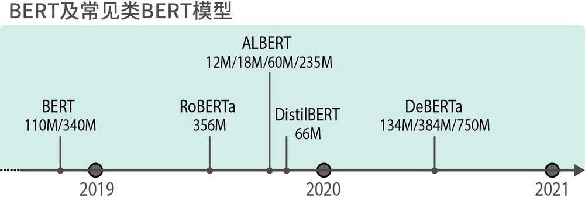

1. 图中M表示百万，用于描述模型参数量。——编者注

图4-5：BERT及常见类BERT模型的发布时间线
 [](#footnote-13-25)。这些模型被视为基础模型，主要用于在下游任务上进行微调

为任务选择合适的模型本身就是一门艺术。在Hugging Face上尝试数千个预训练模型是不现实的，所以我们需要高效地选择模型。话虽如此，以下几个模型是很好的起点，可以让你了解这类模型的基础性能。你可以将它们视为可靠的基准。

·BERT基座模型（大小写不敏感）

·RoBERTa基座模型

·DistilBERT基座模型（大小写不敏感）

·DeBERTa基座模型

·bert-tiny

·ALBERT base v2

对于特定任务模型，我们选择Twitter-roBERTa-base for Sentiment Analysis模型。这是一个在推文上针对情感分析进行微调的RoBERTa模型。尽管该模型并非专门针对电影评论进行训练的，但探索这个模型的泛化能力也是一个有趣的过程。

在选择用于生成嵌入向量的模型时，MTEB排行榜是一个很好的起点。它包含了在多个任务上进行基准测试的开源模型和专有模型。请注意，不要仅仅考虑性能表现，在实际应用中，推理速度的重要性也不容忽视。因此，在本节中我们将使用sentence-transformers/all-mpnet-base-v2作为嵌入模型。这是一个小巧但性能优秀的模型。

### 4.4 使用特定任务模型

现在我们已经选择了特定任务模型，让我们先来加载模型：

```
from transformers import pipeline
# 我们的Hugging Face模型路径
model_path = "cardiffnlp/twitter-roberta-base-sentiment-latest"
# 将模型加载到流水线中
pipe = pipeline(
    model=model_path,
    tokenizer=model_path,
    return_all_scores=True,
    device="cuda:0"
)
```

在加载模型时，我们还加载了**分词器**，它负责将输入文本转换为单个词元，如图4-6所示。尽管这个参数不是必需的（因为它会自动加载），但它展示了底层的行为。

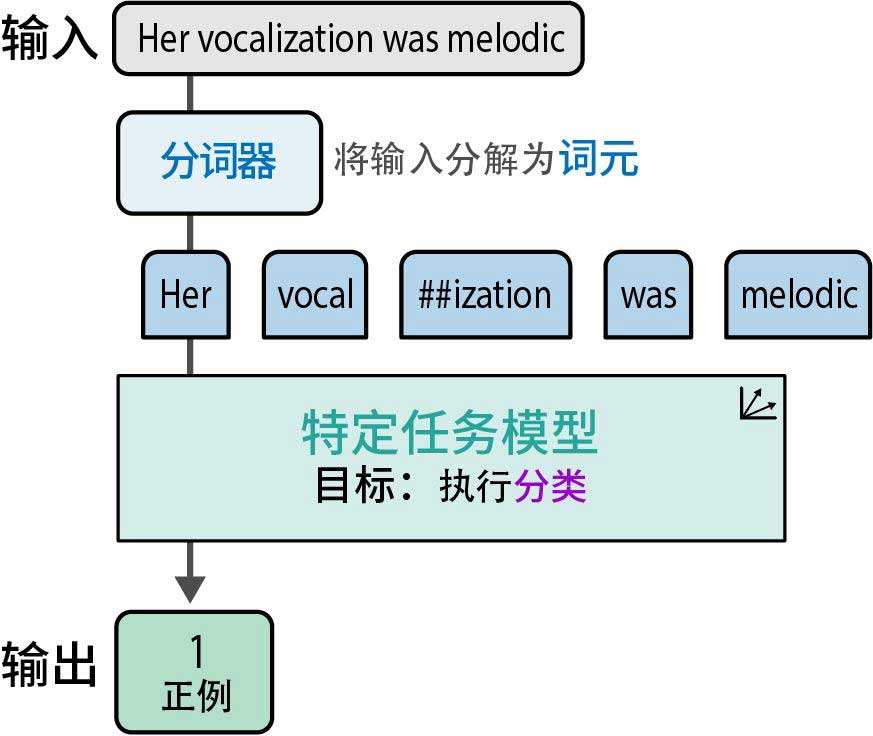

图4-6：输入句子首先被送入分词器，然后才能被特定任务模型处理

如第2章深入探讨的那样，这些词元是大多数语言模型的核心。词元的一个主要优势是，即使它们不在训练数据中，也可以组合起来，生成语义的表示，如图4-7所示。

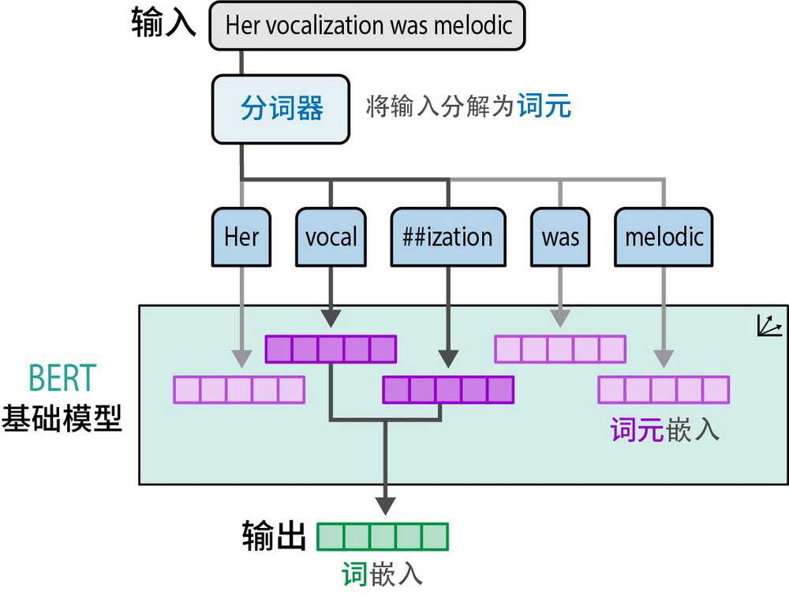

图4-7：通过将未知词分解为词元，仍然可以生成词嵌入

在加载完所有必要组件后，我们就可以在测试集上使用我们的模型了：

```
import numpy as np
from tqdm import tqdm
from transformers.pipelines.pt_utils import KeyDataset
# 运行推理
y_pred = []
for output in tqdm(pipe(KeyDataset(data["test"], "text")),
total=len(data["test"])):
    negative_score = output[0]["score"]
    positive_score = output[2]["score"]
    assignment = np.argmax([negative_score, positive_score])
    y_pred.append(assignment)
```

现在我们已经生成了预测结果，剩下的就是评估了。我们创建一个简单的函数，在本章各个部分均可以方便地使用：

```
from sklearn.metrics import classification_report
def evaluate_performance(y_true, y_pred):
    """创建并打印分类报告"""
    performance = classification_report(
        y_true, y_pred,
        target_names=["Negative Review", "Positive Review"]
    )
    print(performance)
```

接下来，我们创建分类报告：

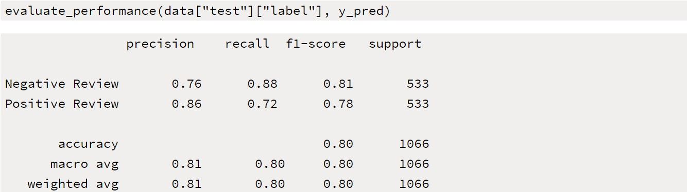

要理解生成的分类报告，我们首先探讨如何识别正确和错误的预测。根据预测结果是正确（True）还是错误（False），以及预测的分类是正例（Positive，此处即正面评论）还是负例（Negative，此处即负面评论），有四种组合。我们可以将这些组合用矩阵形式表示，通常称为**混淆矩阵**（confusion matrix），如图4-8所示。

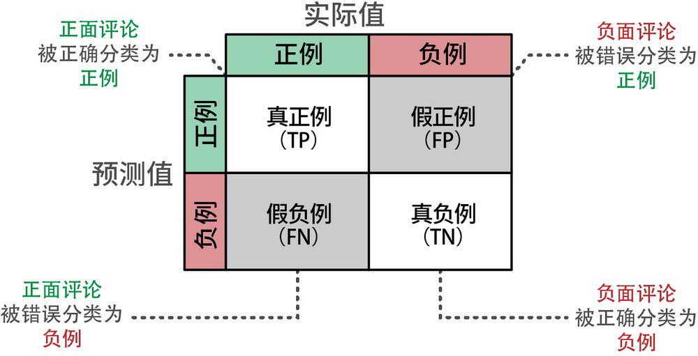

图4-8：混淆矩阵描述了我们可以做出的四种类型的预测

使用混淆矩阵，我们可以推导出几个评估指标的计算公式来描述模型的质量。在上述分类报告中，我们可以看到四个常用的指标：**精确率、召回率、准确率和F1分数**。

·**精确率**（precision）衡量模型识别出的结果中有多少是相关的，用来评估相关结果的准确性。

·**召回率**（recall）指的是所有相关类别中有多少被成功识别出来，用来评估模型找到所有相关结果的能力。

·**准确率**（accuracy）指的是模型在所有预测中做出正确预测的比例，用来评估模型的整体准确性。

·**F1分数**（F1 score）平衡了精确率和召回率，用于衡量模型的整体性能。

如图4-9所示，上述分类报告描述了这四个指标。

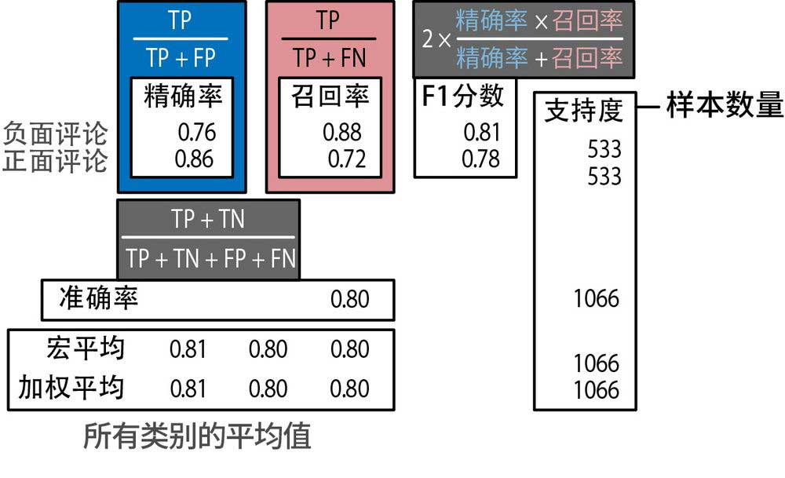

图4-9：分类报告描述了评估模型性能的几个指标

在本书的示例中，我们将采用F1分数的加权平均值作为评估指标，以确保每个类别被平等对待。我们的预训练BERT模型给出了0.80的F1分数（该数值取自分类报告的weighted avg行和f1-score列），对于一个未经过特定领域数据训练的模型来说，这是一个很好的成绩！

为了提升所选模型的性能，我们可以尝试几种方法，包括选择在特定领域数据（在本例中是电影评论）上训练的模型，比如基于大小写不敏感版本的DistilBERT base的微调模型SST-2；也可以将注意力转向另一类表示模型，即嵌入模型。

### 4.5 利用嵌入向量的分类任务

在前面的示例中，我们使用了预训练的特定任务模型进行情感分析。但如果找不到针对这个特定任务预训练的模型呢？是否需要自己微调表示模型？答案是否定的。

如果你有足够的计算资源，可能会有想要自己微调模型的时候（见第11章）。然而，并非每个人都能获得大量的计算资源。这就是通用嵌入模型发挥作用的地方。

**4.5.1监督分类**

与前面的示例不同，我们可以从更传统的角度出发，自己执行部分训练过程。我们不直接使用表示模型进行分类，而是使用嵌入模型生成特征。这些特征随后可以输入到分类器中，从而创建一个如图4-10所示的两步法。

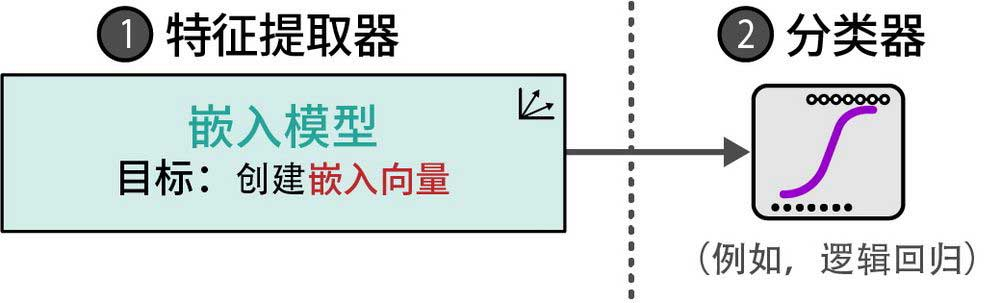

图4-10：特征提取步骤和分类步骤是分离的

这种分离架构的一个主要优点是，我们不需要微调嵌入模型，耗费大量资源，而是可以在CPU上训练逻辑回归等传统分类器。

在第一步中，我们使用嵌入模型将文本输入转换为嵌入向量，如图4-11所示。注意，这个模型同样保持冻结状态，在训练过程中不会更新。

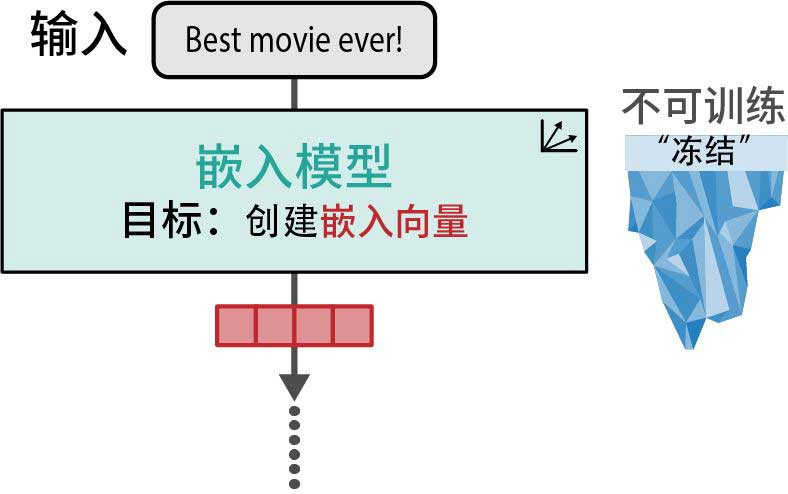

图4-11：在第一步中，我们使用嵌入模型提取特征并将输入文本转换为嵌入向量

1. Nils Reimers and Iryna Gurevych. “Sentence-BERT: Sentence Embeddings Using Siamese BERT-Networks.” arXiv preprint arXiv:1908.10084 (2019).

在这一步中，我们可以使用sentence-transformers这个流行的包来调用预训练的嵌入模型
 [](#footnote-13-50)。创建嵌入向量的过程很简单：

```
from sentence_transformers import SentenceTransformer
# 加载模型
model = SentenceTransformer("sentence-transformers/all-mpnet-base-v2")
# 将文本转换为嵌入向量
train_embeddings = model.encode(data["train"]["text"], show_progress_bar=True)
test_embeddings = model.encode(data["test"]["text"], show_progress_bar=True)
```

正如在第1章中所讨论的，这些嵌入向量是输入文本的数值表示。嵌入向量的值的个数（维度）取决于底层的嵌入模型。让我们来探索一下我们的模型：

```
train_embeddings.shape
(8530, 768)
```

这表明8530个输入文档中的每一个文档都有一个768维的嵌入向量，因此每个嵌入向量包含768个数值。

在第二步中，这些嵌入向量将作为分类器的输入特征，如图4-12所示。分类器是可训练的，不限于逻辑回归，可以采用任何形式，只要它能执行分类任务即可。

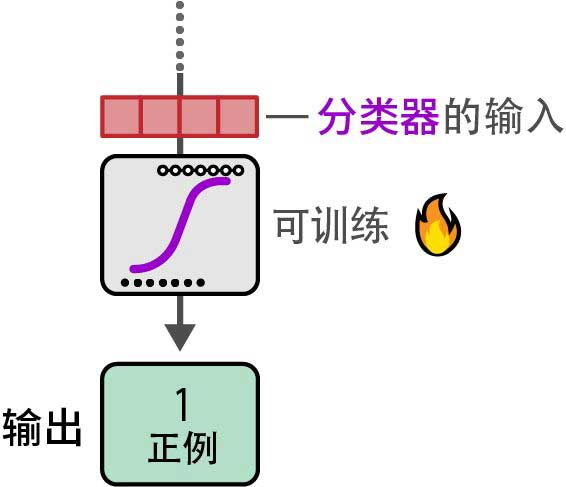

图4-12：使用嵌入向量作为特征，在训练数据上训练逻辑回归模型

我们将在这一步中采用简单的实现方案，直接使用逻辑回归作为分类器。训练过程只需要使用生成的嵌入向量和对应的标签：

```
from sklearn.linear_model import LogisticRegression
# 基于训练嵌入向量构建逻辑回归模型
clf = LogisticRegression(random_state=42)
clf.fit(train_embeddings, data["train"]["label"])
```

接下来，我们评估模型：

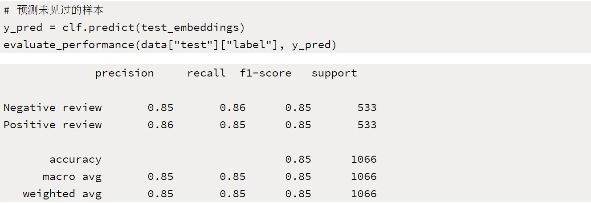

通过在嵌入向量之上训练分类器，我们获得了0.85的F1分数。这展示了在保持底层嵌入模型冻结的前提下，训练轻量级分类器的可行性。


在这个例子中，我们使用sentence-transformers提取嵌入向量，它可以利用GPU加速推理。我们也可以通过使用外部API来生成嵌入向量，从而消除对GPU的依赖。Cohere和OpenAI的服务是生成嵌入向量的热门选择。这样一来，整个流程就可以完全在CPU上运行。

**4.5.2没有标注数据怎么办**

在前面的例子中，我们有可以利用的标注数据，但在实践中可能并非总是如此。收集标注数据是一项资源密集型任务，可能需要大量人力。此外，收集这些标注数据是否真的值得？

为了验证这一点，我们可以执行零样本分类（zero-shot classification），即在没有标注数据的情况下探索分类任务是否可行。虽然我们知道标签的定义（它们的名称），但没有支持它们的标注数据。零样本分类尝试在模型未针对这些标签进行训练的情况下预测输入文本的标签，如图4-13所示。

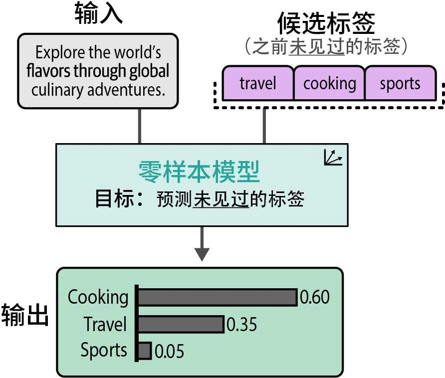

图4-13：在零样本分类中，我们没有标注数据，只有标签本身。零样本模型决定输入与候选标签的关系

要借助嵌入向量执行零样本分类，我们可以使用一个巧妙的方法：基于标签应该表示的内容来描述它们。例如，电影评论的负例标签可以描述为“一条负面影评”。通过描述标签和文档并生成嵌入向量，我们就有了可用的数据。这个过程如图4-14所示，这允许我们在实际上没有任何标注数据的情况下生成目标标签。

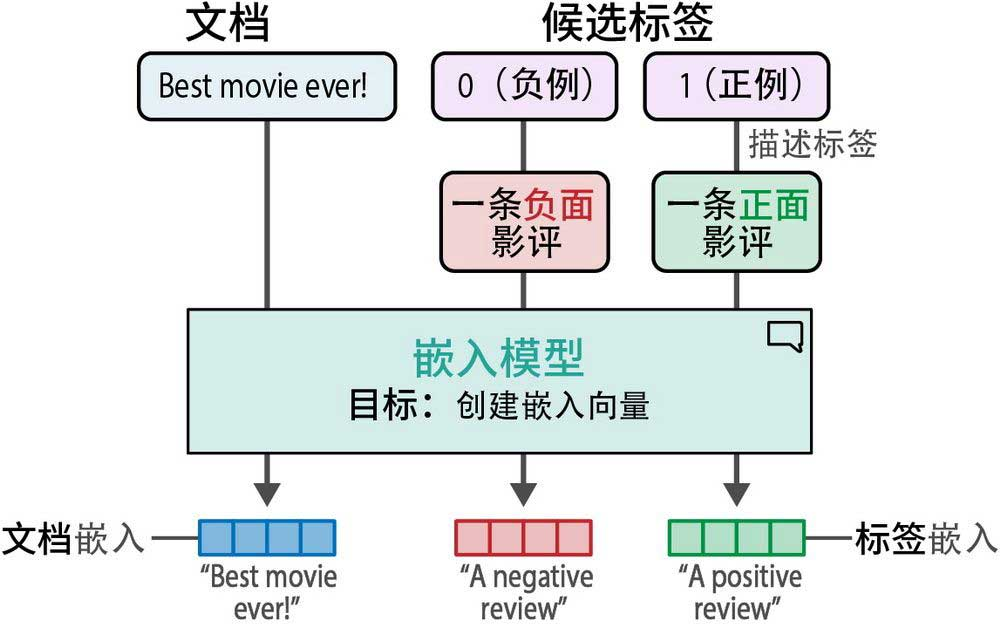

图4-14：要嵌入标签，我们首先需要给它们一个描述，比如“一条负面影评”，然后可以通过sentence-transformers生成嵌入向量

我们可以像之前一样使用.encode函数生成标签的嵌入向量：

```
# 为标签创建嵌入向量
label_embeddings = model.encode(["A negative review", "A positive review"])
```

为了给文档分配标签，可以计算文档 - 标签对的余弦相似度。余弦相似度是两个向量夹角的余弦值，通过嵌入向量的点积除以它们长度的乘积来计算，如图4-15所示。

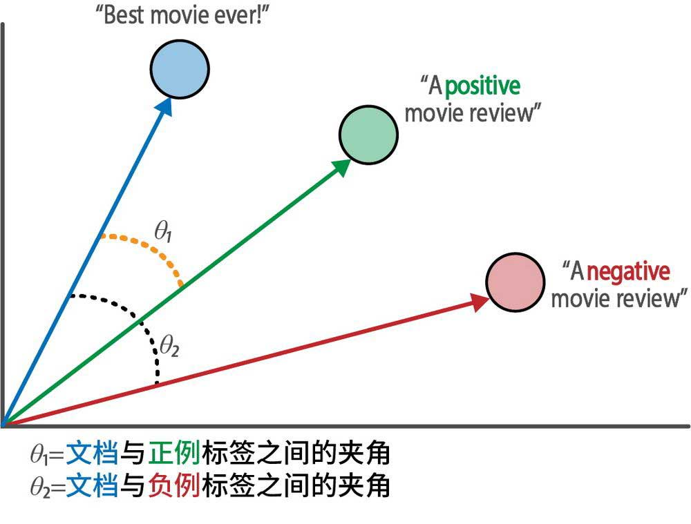

图4-15：余弦相似度是两个嵌入向量夹角的余弦值。在这个例子中，我们计算一个文档与两个候选标签（正例和负例）之间的余弦相似度

我们可以使用余弦相似度来检查给定文档与候选标签描述的相似程度，并选择与文档相似度最高的标签，如图4-16所示。

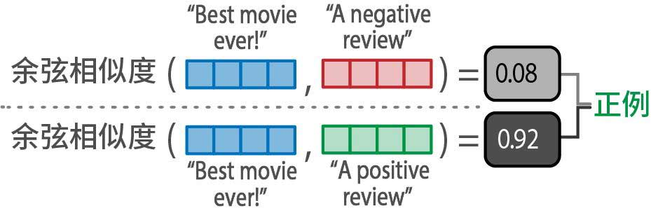

图4-16：在为标签描述和文档分别创建嵌入向量之后，计算每个标签 - 文档对的余弦相似度

要对嵌入向量执行余弦相似度计算，我们只需要比较文档嵌入与标签嵌入，并获取最佳匹配对：

```
from sklearn.metrics.pairwise import cosine_similarity
# 为每个文档找到最匹配的标签
sim_matrix = cosine_similarity(test_embeddings, label_embeddings)
y_pred = np.argmax(sim_matrix, axis=1)
```

就是这样！我们只需要为标签想出名称就可以执行分类任务了。让我们看看这种方法的效果如何：

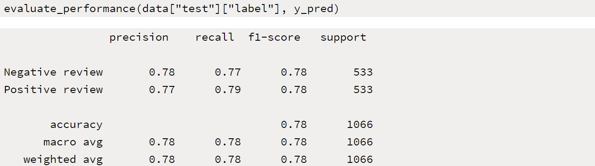


如果你熟悉基于Transformer模型的零样本分类，你可能想知道为什么我们选择用嵌入向量而不是其他方式来演示。虽然自然语言推理模型在零样本分类中表现惊人，但这个例子旨在展示嵌入向量在各种任务中的灵活性。正如你将在本书中看到的，嵌入向量几乎存在于所有语言人工智能应用场景中，它们往往被低估，但实际上能够发挥极其重要的作用。

考虑到我们完全没有使用任何标注数据，0.78的F1分数已经相当令人印象深刻了！这恰恰说明了嵌入向量的多功能性和实用性，特别是当你能够创造性地使用它们时。


让我们来测试一下这种创造性。我们之前将标签命名为“一条负面 / 正面影评”，但其实可以进一步优化。针对我们的电影评论数据集，可以使用“一条非常负面 / 正面的影评”这类更具体的表述。这样，嵌入将捕捉到这是关于电影的评论，并更加关注两个标签的极端性。你可以自己试试看这会如何影响结果。

### 4.6 使用生成模型进行文本分类

使用生成模型（如OpenAI的GPT模型）进行分类的方式，与我们之前所做的有所不同。生成模型接收文本输入并生成文本，因此有时称其为序列到序列模型是很恰当的。这与特定任务模型形成鲜明对比，后者输出的是类别，如图4-17所示。

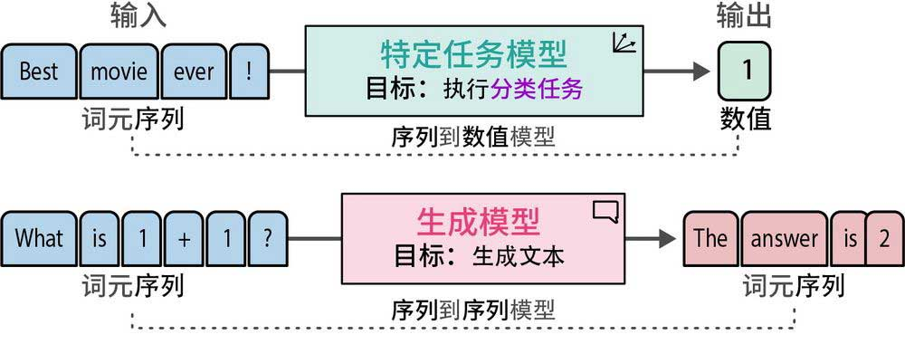

图4-17：特定任务模型从词元序列生成数值，而生成模型从词元序列生成词元序列

生成模型通常在多种多样的任务上进行训练，但往往无法直接满足你的场景需求。例如，我们给生成模型一条没有任何上下文的电影评论，它根本不知道该如何处理。

我们需要帮助它理解上下文，并引导它得出我们想要的答案。如图4-18所示，这种引导过程主要通过给模型输入指令或**提示词来完成。迭代改进提示词以获得期望的输出的过程被称为提示工程**（prompt engineering）。

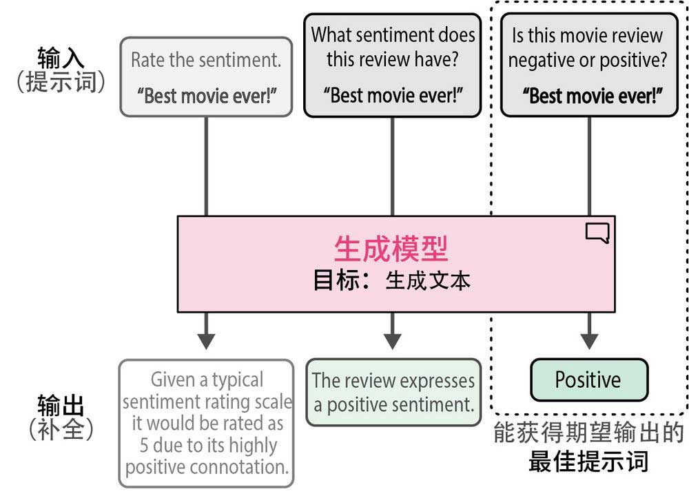

图4-18：提示工程允许更新提示词来改进模型生成的输出

在本节中，我们将演示如何利用不同类型的生成模型，在不使用烂番茄数据集的情况下对影评进行分类。

**4.6.1使用T5**

在本书中，我们主要探讨仅编码器（表示）模型（如BERT）和仅解码器（生成）模型（如ChatGPT）。然而，正如第1章所讨论的，原始Transformer架构实际上由编码器 - 解码器架构组成。与仅解码器模型一样，这些编码器 - 解码器模型也是序列到序列模型，通常被归类为生成模型。

1. Colin Raffel et al. “Exploring the Limits of Transfer Learning with a Unified Text-to-Text Transformer.” The Journal of Machine Learning Research 21.1 (2020): 5485-5551.

T5（Text-to-Text Transfer Transformer，文本到文本迁移Transformer）模型是一个有趣的模型系列，它利用了这种架构。如图4-19所示，其架构与原始Transformer类似，将12个解码器和12个编码器堆叠在一起
 [](#footnote-13-126)。

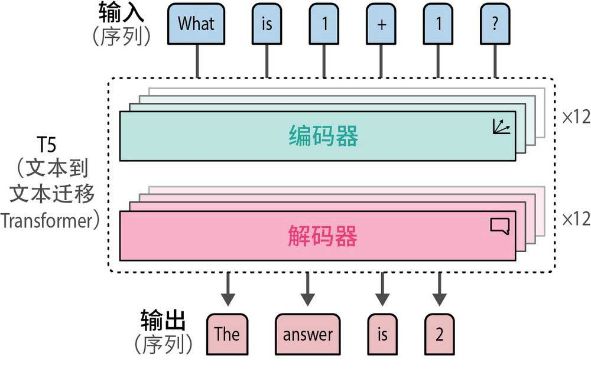

图4-19：T5模型与原始Transformer模型类似，采用解码器 - 编码器架构

通过这种架构，T5系列模型首先使用掩码语言建模进行预训练。在训练的第一步，如图4-20所示，预训练过程不是仅对单个词元进行掩码，而是对词元集合（也称**词元跨度**，token span）整体进行掩码。

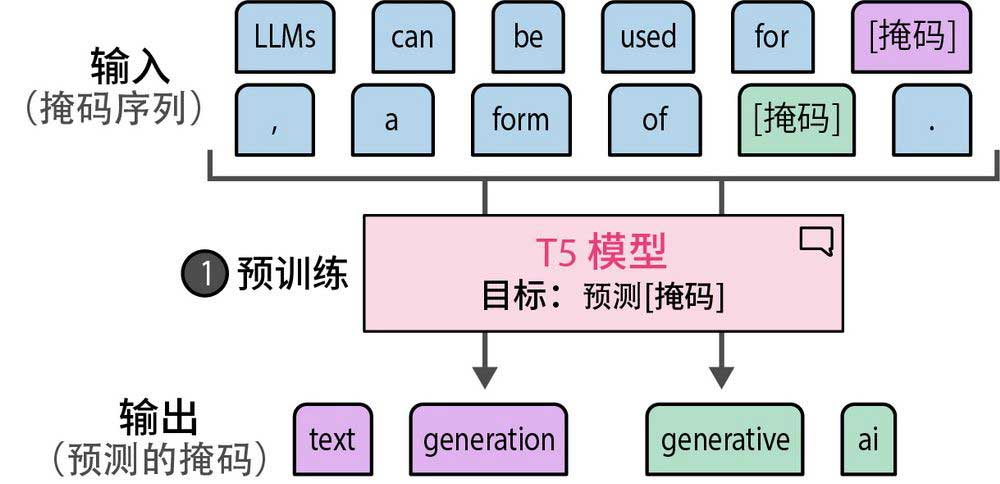

图4-20：在训练的第一步（预训练）中，T5模型需要预测可能包含多个词元的掩码

在训练的第二步，即微调基础模型过程中，真正的“魔法”才开始发生。模型不是针对单个特定任务进行微调，而是将每个任务转换为序列到序列任务并同时进行训练。如图4-21所示，这使得模型可以在多种任务上进行训练。

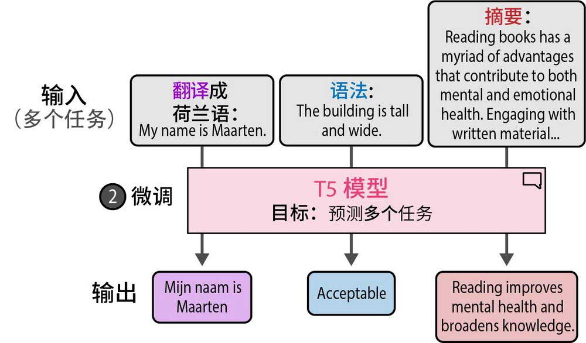

图4-21：通过将特定任务转换为文本指令，T5模型可以在微调过程中针对各种任务进行训练

1. Hyung Won Chung et al. “Scaling Instruction-Finetuned Language Models.” arXiv preprint arXiv:2210.11416 (2022).

这种微调方法在论文“Scaling Instruction-Finetuned Language Models”中得到了进一步扩展，研究人员在微调过程中引入了超过1000个任务，这些任务更接近我们所熟知的GPT模型中的指令
 [](#footnote-13-111)。这最终催生了FLAN-T5系列模型，它们即受益于这种大规模多样化的任务。

要使用预训练的FLAN-T5模型进行分类，先通过"text2text-generation"任务加载模型，这类任务通常是为编码器 - 解码器模型预留的：

```
# 加载模型
pipe = pipeline(
    "text2text-generation",
    model="google/flan-t5-small",
    device="cuda:0"
)
```

FLAN-T5模型有多种规模（small/base/large/XL/XXL），为了省时，我们将使用最小的版本。你可以尝试更大的模型，看看是否能改善结果。

与特定任务模型相比，我们不能仅仅给模型一些文本就期望它输出情感分类，而是必须明确指示模型如何做。

因此，我们在每个文档前加上提示词：“Is the following sentence positive or negative?”（以下句子是正面的还是负面的？）。

```
# 准备数据
prompt = "Is the following sentence positive or negative? "
data = data.map(lambda example: {"t5": prompt + example['text']})
data
DatasetDict({
    train: Dataset({
        features: ['text', 'label', 't5'],
        num_rows: 8530
    })
    validation: Dataset({
        features: ['text', 'label', 't5'],
        num_rows: 1066
    })
    test: Dataset({
        features: ['text', 'label', 't5'],
        num_rows: 1066
    })
})
```

数据更新后，我们可以像之前特定任务的例子一样运行流水线：

```
# 运行推理
y_pred = []
for output in tqdm(pipe(KeyDataset(data["test"], "t5")),
total=len(data["test"])):
    text = output[0]["generated_text"]
    y_pred.append(0 if text == "negative" else 1)
```

由于这个模型生成文本，我们需要将文本输出转换为数值。输出词negative映射为0，而positive映射为1。

有了这些数值，我们可以用与之前相同的方式来检验模型质量：

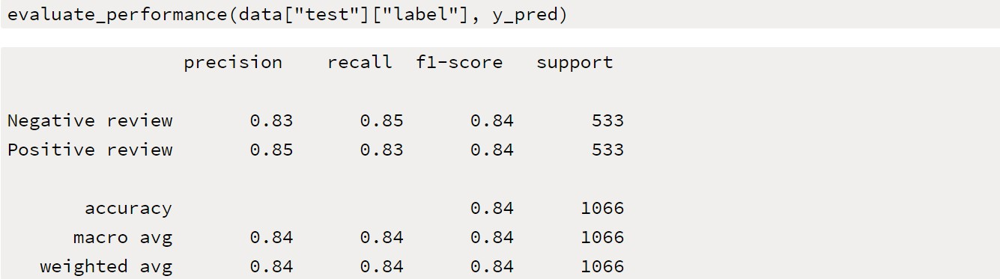

F1分数达到了0.84，这个结果充分展示了FLAN-T5这类生成模型在文本分类任务上的能力。

**4.6.2使用ChatGPT进行分类**

尽管在本书中我们主要关注开源模型，但专有模型（特别是ChatGPT）是语言人工智能领域另一个不可或缺的部分。

虽然原始ChatGPT模型（GPT-3.5）的底层架构并未公开，但从其名称我们可以推测，它是基于我们在GPT模型中所见的仅解码器架构的。

幸好，OpenAI分享了关于训练过程的大体情况，其中涉及一个重要组件，即偏好调优（preference tuning）。如图4-22所示，OpenAI首先手动创建了输入提示词（指令数据）的期望输出，并使用这些数据创建了模型的第一个版本。

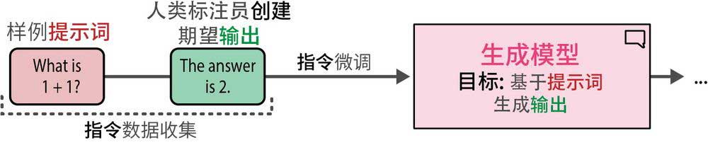

图4-22：由指令（提示词）和输出组成的手动标注数据被用于执行微调（指令微调）

OpenAI使用上述过程得到的模型生成多个输出，并手动对这些输出从最好到最差进行排序。如图4-23所示，这种排序展示了对某些输出的偏好（偏好数据），并被用于创建最终的模型，即ChatGPT。

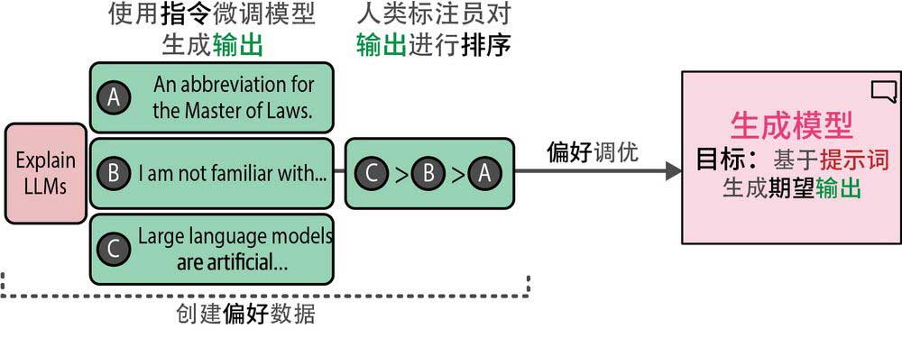

图4-23：手动排序的偏好数据被用于生成最终的模型ChatGPT

使用偏好数据而非指令数据的一个主要优势在于，它能够体现细微的差别。通过展示好的输出和更好的输出之间的差异，生成模型学会了生成符合人类偏好的文本。在第12章中，我们将探讨这些微调和偏好调优方法的工作原理，以及如何自行实现它们。

使用专有模型的过程与我们迄今所见的开源模型示例很不同。我们无须加载模型，而是通过OpenAI的API来访问模型。

1. 如果你暂时不能使用OpenAI提供的服务，可以考虑使用DeepSeek、豆包、通义、Moonshot、Step、Yi、ChatGLM、混元、文心一言等国内大模型，或使用SiliconFlow（硅基流动）提供的开源模型。大多数国内大模型兼容OpenAI API，操作方式可以参考相关大模型平台的文档。获取平台API密钥后，通常仅需修改base_url为对应平台的API地址，修改model为对应模型的名称即可。——译者注

在进入分类任务之前，需要先在OpenAI官网创建一个免费账户，并在API密钥管理页面创建一个API密钥。完成之后，你就可以使用你的API与OpenAI的服务器进行通信了
 [](#footnote-13-84)。

我们可以使用这个密钥创建一个客户端：

```
import openai
# 创建客户端
client = openai.OpenAI(api_key="YOUR_KEY_HERE")
```

使用这个客户端创建chatgpt_generation函数，该函数允许我们基于特定的提示词、输入文档和选定的模型生成文本：

```
def chatgpt_generation(prompt, document, model="gpt-3.5-turbo-0125"):
    """基于提示词和输入文档生成输出"""
    messages=[
        {
            "role": "system",
            "content": "You are a helpful assistant."
            },
        {
            "role": "user",
            "content": prompt.replace("[DOCUMENT]", document)
            }
    ]
    chat_completion = client.chat.completions.create(
      messages=messages,
      model=model,
      temperature=0
    )
    return chat_completion.choices[0].message.content
```

接下来，我们需要创建一个提示词模板来要求模型执行分类任务：

```
# 定义一个基础提示词模板
prompt = """Predict whether the following document is a positive or negative
movie review:
[DOCUMENT]
If it is positive return 1 and if it is negative return 0. Do not give any
other answers.
"""
# 使用GPT预测目标
document = "unpretentious , charming , quirky , original"
chatgpt_generation(prompt, document)
```

这个模板仅仅是一个示例，你可以根据需要进行任何修改。目前，我们尽可能保持简单，以说明如何使用这样的模板。

1. 目前gpt-3.5-turbo-0125模型已经过时。对于对模型能力要求不高的场景，推荐使用GPT-4o mini这个成本较低的模型，它的效果比GPT-3.5更好，并且成本更低。由于大模型领域发展很快，读者阅读本书时，GPT-4o mini可能也已经过时，请参考OpenAI最新文档。——译者注

在你使用模型API处理大型数据集之前，一定要注意始终追踪使用情况。在使用像OpenAI提供的这类外部API服务时，如果执行大量请求，费用可能会快速增长。在撰写本书时，使用gpt-3.5-turbo-0125模型
 [](#footnote-13-105)运行我们的测试数据集花费了3美分，这个花费在免费账户额度内，但可能在未来发生变化。


在使用外部API时，你可能会遇到速率限制错误。调用API过于频繁可能会出现这类错误，因为某些API可能会限制你每分钟或每小时的使用量。

为了避免这些错误，我们可以实现几种重试请求的方法，包括指数退避（exponential backoff），也就是每次遇到速率限制错误时执行短暂的休眠，然后重试未成功的请求。每当再次失败时，休眠时间会增加，直到请求成功或达到最大重试次数。

对此，OpenAI提供了一份很好的入门指南，大家可在OpenAI Platform阅读“Rate limits”了解具体的应对策略。

接下来，我们可以对测试数据集中的所有影评运行这个函数来获取预测结果。如果你想为其他任务省下（免费）API额度，可以跳过这一步。

```
# 如果你想节省模型调用成本，可以跳过这一步
predictions = [
    chatgpt_generation(prompt, doc) for doc in tqdm(data["test"]["text"])
]
```

与前面的例子类似，我们需要将输出从字符串转换为整数以评估其性能：

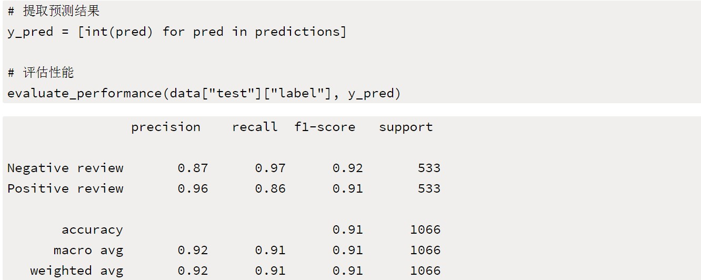

0.91的F1分数让我们得以看到GPT-3.5模型性能的冰山一角。就是这个模型让生成式AI走向了大众。然而，由于我们不知道模型是用什么数据训练的，因此无法轻易使用这类指标来评估模型。就我们所知，它可能在我们所用的数据集上训练过！

在第12章中，我们将探索如何在更通用的任务上评估开源模型和专有模型。

### 4.7 小结

在本章中，我们讨论了执行各种分类任务的技术：从对整个模型进行微调，到完全不进行微调。对文本数据进行分类并不像表面上看起来那么简单，且有大量创新的技术可以应用。

在本章中，我们探索了使用生成模型和表示模型进行文本分类。我们的目标是根据输入文本分配标签或类别，用于对评论的情感进行分类。

我们探索了两种类型的表示模型：特定任务模型和嵌入模型。特定任务模型是在大型数据集上专门针对情感分析进行预训练的，它表明预训练模型对文档分类而言是一种很好的技术。嵌入模型用于生成通用嵌入向量，我们将其作为训练分类器的输入。

同样，我们探索了两种类型的生成模型：开源的编码器-解码器模型（FLAN-T5）和专有的仅解码器模型（GPT-3.5）。我们在文本分类中使用这些生成模型时，无须在领域数据或标记数据集上进行特定的（额外）训练。

在下一章中，我们将继续讨论分类，但重点是无监督分类。如果拥有一些无标签的文本数据，我们应该怎么做？我们可以提取哪些信息？我们将专注于对数据进行聚类，并使用主题建模技术为聚类结果命名。


---

## 第5章 文本聚类和主题建模

尽管监督技术（如分类）过去几年在业界占据主导地位，但像文本聚类这样的无监督技术的潜力也不容小觑。

文本聚类旨在基于文本的语义内容、含义和关系对相似文本进行分组。如图5-1所示，将语义相似的文档聚类成簇，不仅可以高效地分类大量非结构化文本，还能实现快速的探索性数据分析。

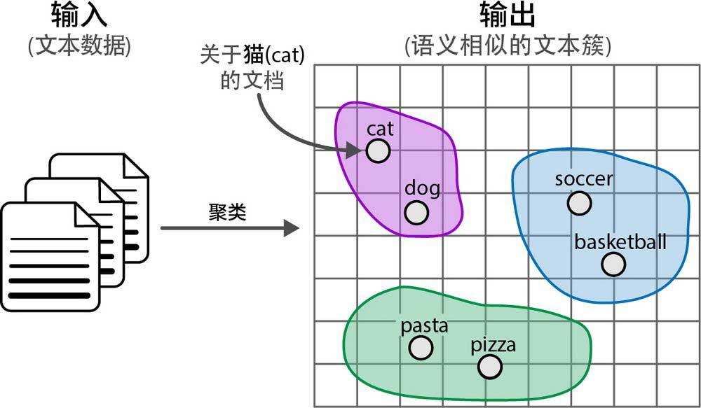

图5-1：非结构化文本数据聚类

近年来语言模型的发展使文本的上下文和语义表示成为可能，这提升了文本聚类的效果。语言不仅仅是词袋，最新的语言模型已经证明，它们能够很好地捕捉语言的上下文和语义概念。文本聚类不受监督的约束，可以实现创造性的解决方案和多样化的应用，如寻找离群点、加速标注和发现标注错误的数据。

文本聚类也在主题建模领域，即我们希望在大量文本数据集合中发现（抽象的）主题时发挥作用。如图5-2所示，我们通常使用关键词或关键短语来描述主题，理想情况下会有一个总体的概括性标签。

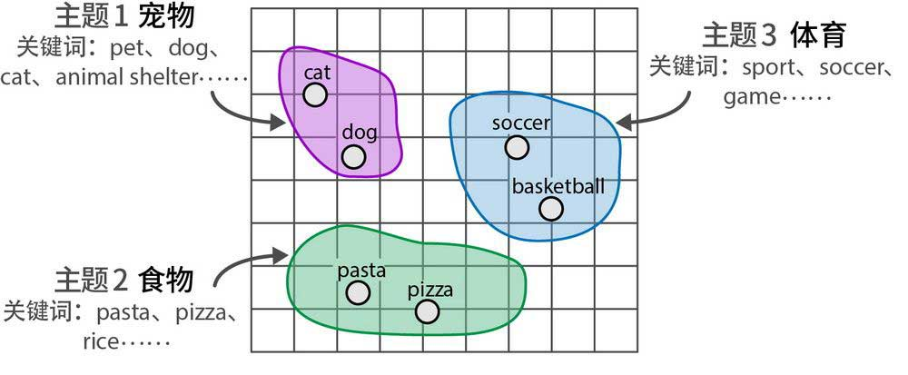

图5-2：主题建模是一种为文本文档簇赋予含义的方法

在本章中，我们将首先探索如何使用嵌入模型进行聚类，然后过渡到一种受文本聚类启发的主题建模方法，即BERTopic。

文本聚类和主题建模在本书中扮演着重要角色，因为它们探索了结合各种语言模型的创新方法。我们将探索如何将仅编码器（嵌入）、仅解码器（生成）甚至经典方法（词袋）结合起来，从而产生令人惊叹的新技术和新流程。

### 5.1 ArXiv文章：计算与语言

在本章中，我们将在ArXiv文章上运行聚类和主题建模算法。ArXiv是一个主要面向计算机科学、数学和物理领域的开放的学术文章平台。为了与本书主题保持一致，我们将探索计算与语言领域的文章。arxiv_nlp这一数据集包含1991年至2024年间来自ArXiv cs.CL（计算与语言）板块的44949篇摘要。

我们加载数据，并为每篇文章的摘要、标题和年份创建单独的变量：

```
# 从Hugging Face加载数据
from datasets import load_dataset
dataset = load_dataset("maartengr/arxiv_nlp")["train"]
# 提取元数据
abstracts = dataset["Abstracts"]
titles = dataset["Titles"]
```

### 5.2 文本聚类的通用流程

文本聚类不仅可以发现已知的数据模式，更可以挖掘不为人知的数据模式。它可以帮助你直观地理解任务（如分类任务）及其复杂性。因此，文本聚类的应用范围广阔，不仅限于快速、探索性的数据分析。

虽然文本聚类的方法有很多，从基于图的神经网络到基于质心的聚类技术，但当前比较流行的通用流程主要包含以下三个步骤（每一步对应一种算法）：

第一步，使用**嵌入模型**（embedding model）将输入文档转换为嵌入向量；

第二步，使用**降维模型**（dimensionality reduction model）将嵌入向量降至更低维度空间；

第三步，使用**聚类模型**（cluster model）对降维后的嵌入向量进行聚类。

**5.2.1嵌入文档**

第一步是将我们的文本数据转换为嵌入向量，如图5-3所示。回顾前几章的内容，嵌入向量是试图捕捉文本含义的数值表示。

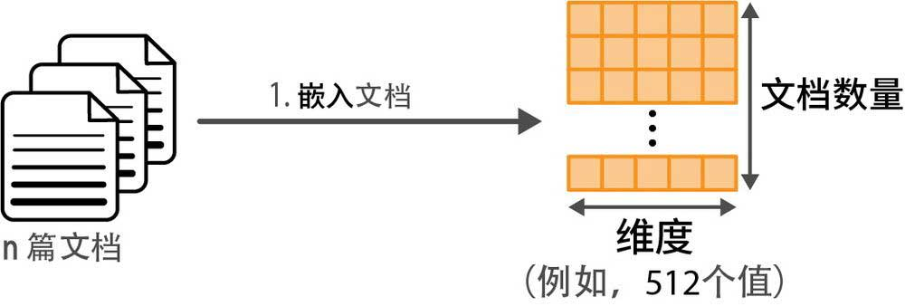

图5-3：第一步，使用嵌入模型将输入文档转换为嵌入向量

选择为语义相似度任务优化的嵌入模型对聚类任务特别重要，因为我们是在寻找语义相似的一组文档。幸运的是，在撰写本书时，大多数嵌入模型专注于语义相似度。

与上一章一样，我们将使用MTEB排行榜来选择嵌入模型。我们需要一个在聚类任务上表现不错且足够小，能快速运行的嵌入模型。这次我们不使用上一章中的sentence-transformers/all-mpnet-base-v2模型，而是选择thenlper/gte-small模型。这是一个较新的模型，在聚类任务上的表现优于前者，而且由于体积小，推理速度更快。当然，你也可以随意尝试其他新近发布的模型。

```
from sentence_transformers import SentenceTransformer
# 为每个摘要创建嵌入向量
embedding_model = SentenceTransformer("thenlper/gte-small")
embeddings = embedding_model.encode(abstracts, show_progress_bar=True)
```

检查一下每个文档嵌入包含多少个值：

```
# 检查生成的嵌入向量的维度
embeddings.shape
(44949, 384)
```

每个嵌入向量包含384个值，这些值共同构成了文档的语义表示。你可以将这些嵌入向量视为我们要进行聚类的特征。

**5.2.2嵌入向量降维**

在进行聚类之前，首先需要考虑嵌入向量的高维特性。随着维度的增加，每个维度中可能的取值数量呈指数级增长，在每个维度中寻找所有子空间变得越来越复杂。

因此，高维数据对许多聚类技术来说是一个难题，因为识别有意义的聚类变得更加困难。我们可以通过降维来解决这个问题。如图5-4所示，降维技术允许我们减小维度空间的大小，用更少的维度来表示相同的数据。降维技术的目标是通过寻找低维表示来保持高维数据的全局结构。

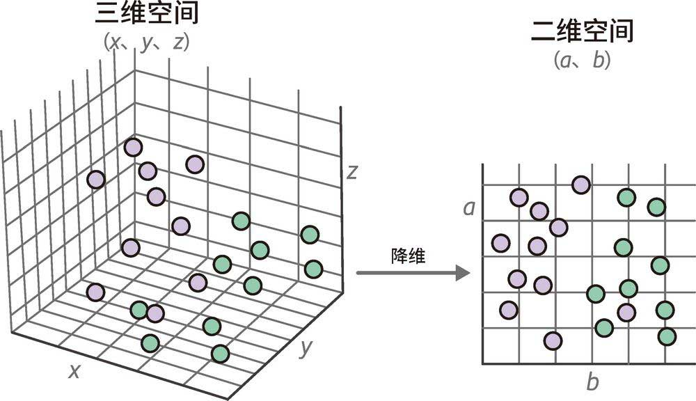

图5-4：降维是将高维空间中的数据压缩为低维表示

请注意，降维是一种压缩技术，其底层算法并不是随意删除维度这么简单。为了帮助聚类模型更高效地创建有意义的簇，如图5-5所示，我们的聚类流程中的第二步采用了降维处理。

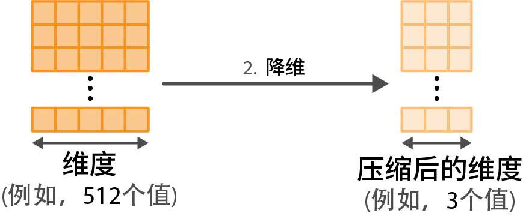

图5-5：第二步，通过降维将嵌入向量降至更低维度空间

1. Harold Hotelling. “Analysis of a Complex of Statistical Variables into Principal Components.” Journal of Educational Psychology 24.6 (1933): 417.

1. Leland McInnes, John Healy, and James Melville. “UMAP: Uniform Manifold Approximation and Projection for Dimension Reduction.” arXiv preprint arXiv:1802.03426 (2018).

主成分分析（Principal Component Analysis，PCA）
 [](#footnote-14-39)以及统一流形逼近和投影（Uniform Manifold Approximation and Projection，UMAP）
 [](#footnote-14-103)是著名的降维方法。对于这个流程，我们选择使用UMAP，因为它在处理非线性关系和结构方面比PCA表现更好。


 需要注意的是，降维技术并非完美无缺。它们无法完美地将高维数据压缩到低维表示中。这个过程总是会损失一些信息。因此，需要在降维和保留尽可能多的信息之间找到平衡点。

要执行降维，需要实例化UMAP类并将生成的嵌入向量传递给它：

```
from umap import UMAP
# 将输入嵌入向量从384维降至5维
umap_model = UMAP(
    n_components=5, min_dist=0.0, metric="cosine", random_state=42
)
reduced_embeddings = umap_model.fit_transform(embeddings)
```

我们可以使用n_components参数来决定低维空间的形状，这里设为5维。通常，5和10之间的值能很好地捕捉高维全局结构。

min_dist参数是嵌入点之间的最小距离。我们将其设为0，通常这会产生更紧密的簇。我们将metric设置为"cosine"，因为基于欧氏距离的方法在处理高维数据时会遇到问题。

请注意，在UMAP中设置random_state将使结果在不同会话中可重现，但会禁用并行处理，因此会导致训练速度变慢。

**5.2.3对降维后的嵌入向量进行聚类**

如图5-6所示，第三步是对降维后的嵌入向量进行聚类。

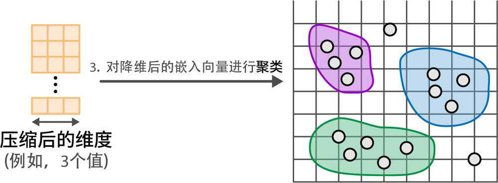

图5-6：第三步，使用降维后的嵌入向量进行文档聚类

虽然我们通常选择像*k*均值聚类（*k*-means）这样的基于质心的算法，但它需要生成一组预设的簇，而我们事先并不知道簇的数量。而基于密度的算法可以自由计算簇的数量，并且不会强制所有数据点属于某个簇，如图5-7所示。

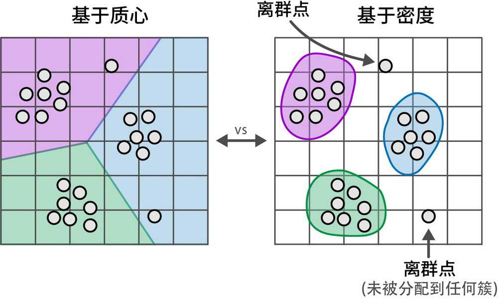

图5-7：聚类算法不仅影响簇的生成方式，还影响簇的呈现方式

1. Leland McInnes, John Healy, and Steve Astels. “hdbscan: Hierarchical Density Based Clustering.” J. Open Source Softw. 2.11 (2017): 205.

1. Martin Ester et al. “A Density-Based Algorithm for Discovering Clusters in Large Spatial Databases with Noise.” KDD'96, Aug. 1996: 226-231.

一个常见的基于密度的算法是HDBSCAN（Hierarchical Density-Based Spatial Clustering of Applications with Noise，具有噪声的分层密度空间聚类）
 [](#footnote-14-108)。HDBSCAN是聚类算法DBSCAN的层次化变体，它无须显式指定簇的数量就能发现密集的（微型）簇
 [](#footnote-14-158)。作为一种基于密度的方法，HDBSCAN还可以检测数据中的**离群点**，即不属于任何簇的数据点。这些离群点不会被分配或强制归属于任何簇，换句话说，它们会被忽略。由于ArXiv文章可能包含一些小众论文，使用能够检测离群点的模型可能会很有帮助。

与之前的包一样，使用HDBSCAN也很简单。我们只需要实例化模型，并将降维后的嵌入向量传递给它：

```
from hdbscan import HDBSCAN
# 拟合模型并提取簇
hdbscan_model = HDBSCAN(
    min_cluster_size=50, metric="euclidean", cluster_selection_method="eom"
).fit(reduced_embeddings)
clusters = hdbscan_model.labels_
# 我们生成了多少个簇？
len(set(clusters))
156
```

使用HDBSCAN，我们在数据集中生成了156个簇。要创建更多簇，需要减小min_cluster_size的值，它代表一个簇的最小规模。

**5.2.4检查生成的簇**

现在我们已经生成了簇，可以手动检查每个簇并探索每个簇中分配的文档，以了解其内容。例如，从簇0中随机抽取几个文档：

```
import numpy as np
# 打印簇0中的前三个文档
cluster = 0
for index in np.where(clusters==cluster)[0][:3]:
    print(abstracts[index][:300] + "... \n")
This works aims to design a statistical machine translation from English text
to American Sign Language (ASL). The system is based on Moses tool with some
modifications and the results are synthesized through a 3D avatar for
interpretation. First, we translate the input text to gloss, a written fo...
Researches on signed languages still strongly dissociate lin- guistic issues
related on phonological and phonetic aspects, and gesture studies for
recognition and synthesis purposes. This paper focuses on the imbrication of
motion and meaning for the analysis, synthesis and evaluation of sign lang...
Modern computational linguistic software cannot produce important aspects of
sign language translation. Using some researches we deduce that the majority of
automatic sign language translation systems ignore many aspects when they
generate animation; therefore the interpretation lost the truth inf...
```

从打印的文档来看，这个簇似乎主要包含有关手语翻译的文档，很有趣！

我们可以更进一步，尝试可视化结果，这样就不用手动检查所有文档了。为此，我们需要将文档嵌入降至二维，这样就可以在*x-y*平面上绘制文档：

```
import pandas as pd
# 将384维的嵌入向量降至二维以便于可视化
reduced_embeddings = UMAP(
    n_components=2, min_dist=0.0, metric="cosine", random_state=42
).fit_transform(embeddings)
# 创建数据框
df = pd.DataFrame(reduced_embeddings, columns=["x", "y"])
df["title"] = titles
df["cluster"] = [str(c) for c in clusters]
# 选择离群点和非离群点（聚类）
clusters_df = df.loc[df.cluster != "-1", :]
outliers_df = df.loc[df.cluster == "-1", :]
```

我们还分别为簇和离群点创建了数据框（clusters_df和outliers_df），通常我们想要关注并突出显示这些簇。


 出于可视化目的使用任何降维技术都会造成信息损失，其结果仅仅是原始嵌入向量的一个近似表示。尽管它很有参考价值，但可能会使簇靠得更近或远离其实际位置。因此，人工评估（也就是我们自己检查簇）是聚类分析的关键组成部分！

为了生成静态图，我们将使用广为人知的绘图库matplotlib：

```
import matplotlib.pyplot as plt
# 分别绘制离群点和非离群点
plt.scatter(outliers_df.x, outliers_df.y, alpha=0.05, s=2, c="grey")
plt.scatter(
    clusters_df.x, clusters_df.y, c=clusters_df.cluster.astype(int),
    alpha=0.6, s=2, cmap="tab20b"
)
plt.axis("off")
```

结果如图5-8所示，它很好地捕捉到了主要的簇。注意观察那些颜色相同的点，颜色相同表明HDBSCAN将它们分到了同一组。由于我们有大量的簇，绘图库会在簇之间循环使用颜色，所以并非所有绿色的点都属于同一个簇。

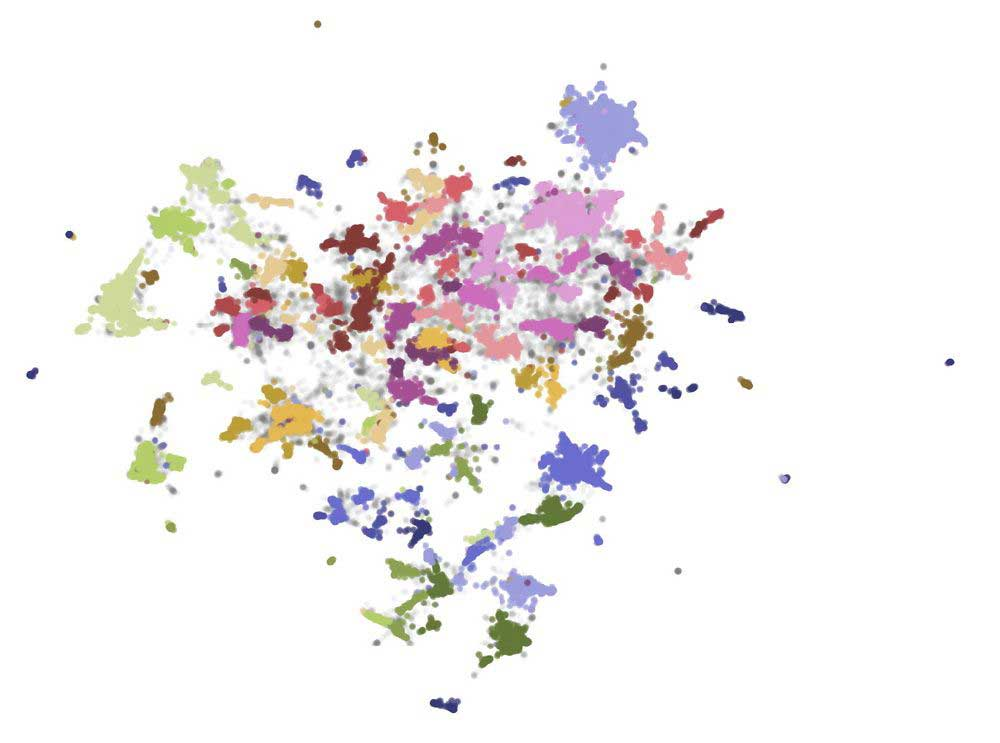

图5-8：生成的簇（彩色）和离群点（灰色）以二维可视化方式表示

这种可视化效果很吸引人，但还不足以让我们看到聚类过程内部发生了什么。要扩展这种可视化效果，我们可以从文本聚类转向主题建模。

### 5.3 从文本聚类到主题建模

文本聚类是在大型文档集合中发现结构的有力工具。在之前的例子中，我们可以手动检查每个簇，并根据其文档集合来识别它们。例如，我们分析了一个包含手语相关文档的簇，因此可以说这个簇的主题是“手语”。

这种在文本数据集合中寻找主题或潜在语义的思路，通常被称为**主题建模**。如图5-9所示，传统上，主题建模的目标是找到一组最能代表、捕捉主题含义的关键词或短语。

主题建模技术并非将主题标记为“手语”，而是使用诸如“手势”“语言”“翻译”等关键词来描述主题。因此，结果并不是单一的标签，用户需要通过这些关键词来理解主题的含义。

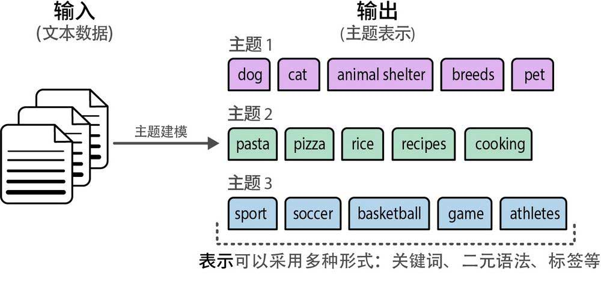

图5-9：传统上，主题通过若干关键词来表示，但也可以采用其他形式

1. David M. Blei, Andrew Y. Ng, and Michael I. Jordan. “Latent Dirichlet Allocation.” Journal of Machine Learning Research 3. Jan (2003): 993-1022.

经典方法，如潜在狄利克雷分配（latent Dirichlet allocation，LDA），假设每个主题都由语料库词表中词的概率分布来表示
 [](#footnote-14-71)。图5-10展示了词表中的每个词是如何根据其与每个主题的相关性被评分的。

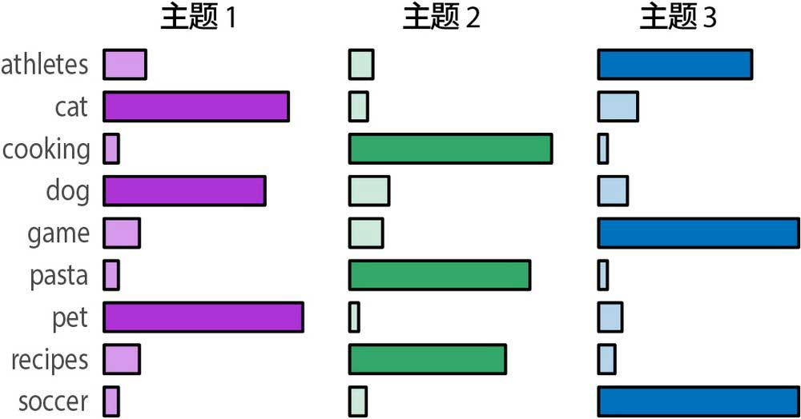

图5-10：关键词是基于它们在单个主题上的分布来提取的

这些经典方法通常使用词袋技术提取文本数据的主要特征，而没有考虑词和短语的上下文及含义。相比之下，文本聚类示例则考虑了这两方面，因为它依赖基于Transformer的嵌入向量，这种嵌入向量通过注意力机制针对语义相似性和上下文含义进行了优化。

在本节中，我们将通过一个高度模块化的文本聚类和主题建模框架BERTopic，将文本聚类扩展到主题建模领域。

**5.3.1BERTopic：一个模块化主题建模框架**

1. Maarten Grootendorst. “BERTopic: Neural Topic Modeling with a Class-Based TF-IDF Procedure.” arXiv preprint arXiv:2203.05794 (2022).

BERTopic是一种主题建模技术，它利用语义相似的文本聚类来提取各种类型的主题表示
 [](#footnote-14-42)。BERTopic处理流程可以分为两个部分。

第一部分是聚类。首先，如图5-11所示，我们采用与前面文本聚类示例相同的步骤进行主题建模。我们对文档进行嵌入、降维，最后对降维后的嵌入向量进行聚类，从而创建语义相似的文档组。

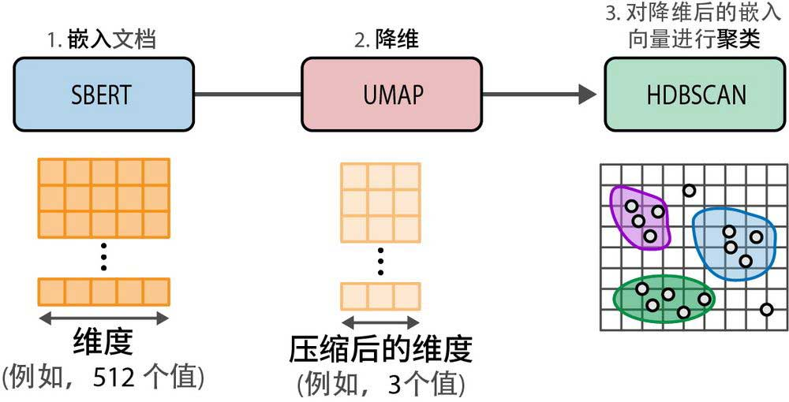

图5-11：BERTopic处理流程的第一部分是创建语义相似文档的聚类

其次，它利用经典的词袋方法，对词表中的词在语料库中的分布建模。正如我们在第1章中简要讨论的，词袋模型将文档看作由一组词组成的“袋子”，统计每个词在文档中出现的次数。由此产生的表示，可以用来提取文档中出现最频繁的那些词。

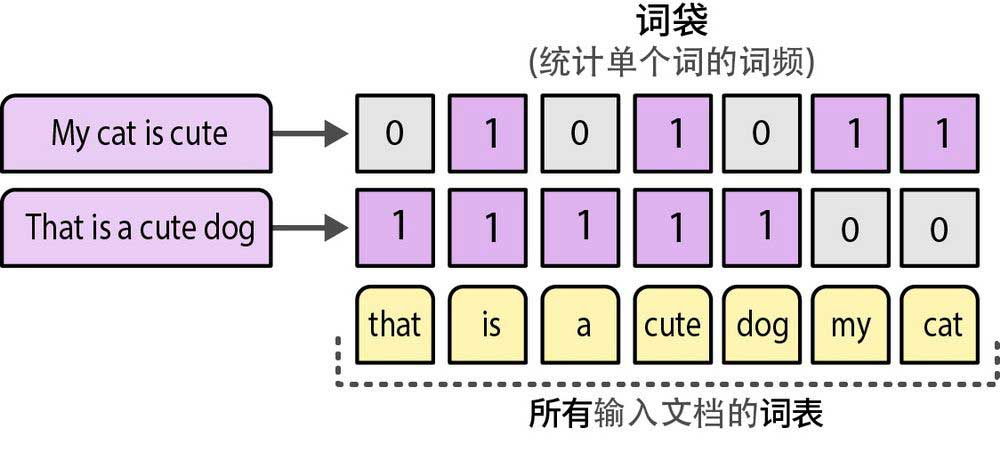

图5-12：用词袋统计每个词在文档中出现的次数

然而，这里有两个需要注意的问题。其一，这是文档级别的表示，而我们需要的是簇级别的视角。为了解决这个问题，我们统计整个簇中而不是单个文档中的词频，如图5-13所示。

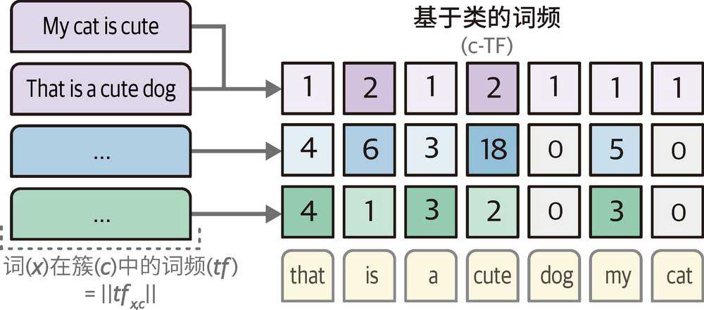

图5-13：通过统计每个簇中而不是每个文档中的词频来生成c-TF

其二，像the和I这样的停用词（stop word）在文档中经常出现，但对文档的实际含义贡献很小。BERTopic使用基于类的词频 - 逆文档频率（c-TF-IDF），来提升对单个簇更有意义的词的权重，降低在所有簇中都常用的词的权重。

词袋中的每个词的词频（c-TF-IDF中的c-TF）都要乘以每个词的IDF值。如图5-14所示，IDF值的计算方法是：所有簇中所有词的平均频次（*A*）除以当前词的总频次（*cfx*），加上1，再取对数（本书此处及后续取对数操作的底数均为e）。

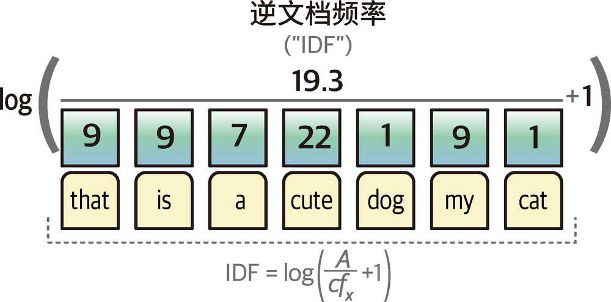

图5-14：创建权重方案

结果是每个词的权重（IDF），我们可以将其与词频（c-TF）相乘得到加权值（c-TF-IDF）。

BERTopic处理流程的第二部分是主题表示。如图5-15所示，此处允许我们生成之前看到的词分布。我们可以使用scikit-learn的CountVectorizer来生成词袋（或词频）表示。在这里，每个簇被视为一个主题，对语料库的词表有特定的排序。

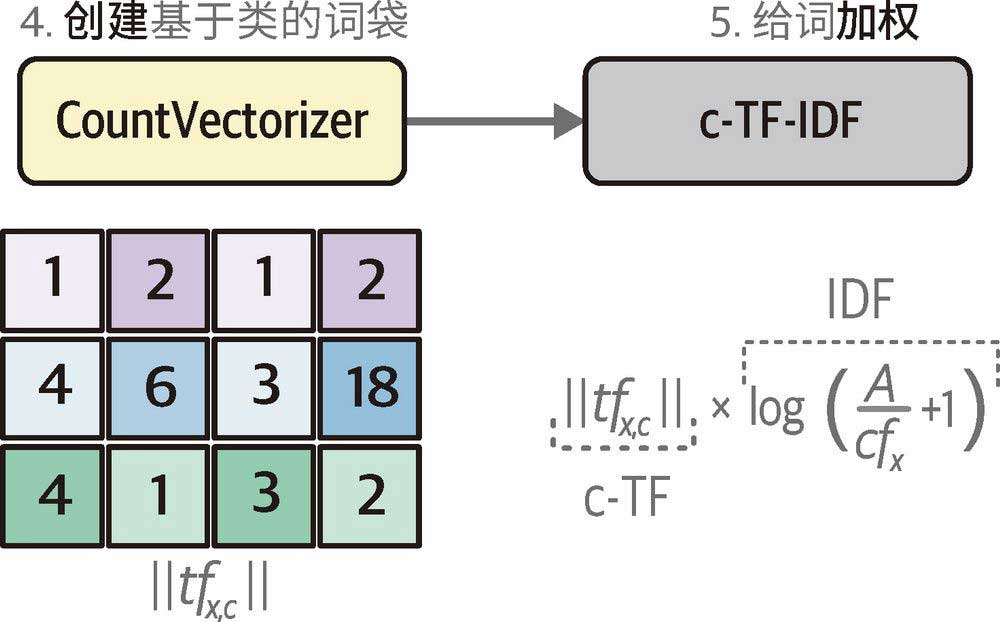

图5-15：BERTopic处理流程的第二部分是主题表示：计算词（*x*）在类（*c*）中的权重

将聚类和主题表示这两个部分结合在一起，就形成了完整的BERTopic处理流程，如图5-16所示。通过这个处理流程，我们可以聚类语义相似的文档，并从簇中生成由几个关键词表示的主题。一个词在主题中的权重越高，它就越能代表该主题。

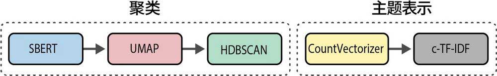

图5-16：完整的BERTopic处理流程大致包含聚类和主题表示两个部分

该处理流程的一个主要优势是，聚类和主题表示这两个部分在很大程度上是相互独立的。例如，使用c-TF-IDF时，我们不依赖于聚类文档时使用的模型。这使得处理流程的每个组件都具有显著的模块化特性。正如我们将在本章后面探讨的那样，这是微调主题表示的绝佳起点。

如图5-17所示，sentence-transformers是默认的嵌入模型，但可以用任何其他嵌入技术替换。这同样适用于所有其他步骤。如果你不想使用HDBSCAN生成离群点，可以使用*k*均值聚类替代。

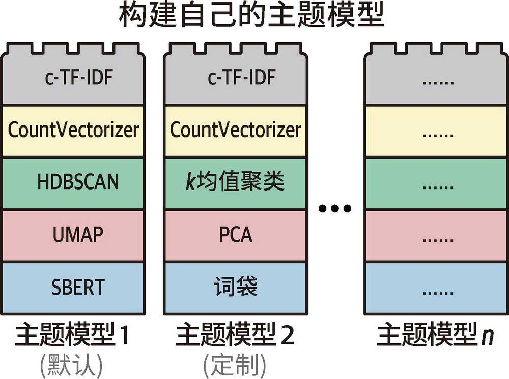

图5-17：模块化是BERTopic的一个关键特性，允许你按照自己的方式构建主题模型

你可以把这种模块化看作乐高积木：处理流程的每个部分都可以完全被另一个类似的算法替换。通过这种模块化的方式，新发布的模型可以被整合到其架构中。随着语言人工智能领域的发展，BERTopic也在不断成长！

**BERTopic的模块化特性**

BERTopic的模块化设计还有另一个优势：它可以在使用同一个基础模型的前提下，根据不同的使用场景灵活调整。例如，BERTopic支持多种算法变体：

·引导式主题建模

·（半）监督主题建模

·层次化主题建模

·动态主题建模

·多模态主题建模

·多视角主题建模

·在线和增量主题建模

·零样本主题建模

·……

模块化和算法的灵活性是作者将BERTopic打造成主题建模一站式解决方案的基础。你可以在BERTopic的官方文档或GitHub仓库中找到其完整功能概述。

要在我们的ArXiv数据集上运行BERTopic，可以使用之前定义的模型和嵌入向量（虽然这不是必需的）：

```
from bertopic import BERTopic
# 使用之前定义的模型训练我们的模型
topic_model = BERTopic(
    embedding_model=embedding_model,
    umap_model=umap_model,
    hdbscan_model=hdbscan_model,
    verbose=True
).fit(abstracts, embeddings)
```

让我们先来探索一下创建的主题。get_topic_info()方法可以帮助我们快速了解所发现的主题：

```
topic_model.get_topic_info()
```

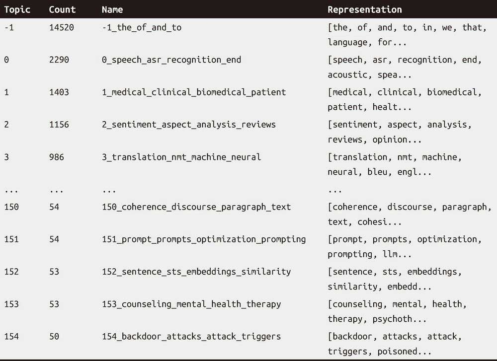

每个主题都由几个关键词表示，这些关键词在Name列中用“_”连接。Name列显示了最能代表该主题的四个关键词，让我们能够快速了解主题的内容。


 你可能已经注意到，第一个主题被标记为-1。该主题包含了所有无法归入某个主题的文档，这些文档被视为离群点。这是聚类算法HDBSCAN的结果，它不会强制所有点都被聚类。要删除离群点，可以使用非离群算法（如*k*均值聚类），或使用BERTopic的reduce_outliers()函数将离群点重新分配到主题中。

我们可以使用get_topic()函数查看特定的主题，探索哪些关键词最能代表它们。例如，主题0包含以下关键词：

```
topic_model.get_topic(0)
[('speech', 0.028177697715245358),
 ('asr', 0.018971184497453525),
 ('recognition', 0.013457745472471012),
 ('end', 0.00980445092749381),
 ('acoustic', 0.009452082794507863),
 ('speaker', 0.0068822647060204885),
 ('audio', 0.006807649923681604),
 ('the', 0.0063343444687017645),
 ('error', 0.006320144717019838),
 ('automatic', 0.006290216996043161)]
```

主题0包含关键词speech、asr和recognition等。基于这些关键词，该主题看起来是关于自动语音识别（automatic speech recognition，ASR）的。

我们可以使用find_topics()函数基于搜索词来查找特定主题。让我们搜索一个关于主题建模的主题：

```
topic_model.find_topics("topic modeling")
([22, -1, 1, 47, 32],
 [0.95456535, 0.91173744, 0.9074769, 0.9067007, 0.90510106])
```

这表明主题22与我们的搜索词具有较高的相似度（超过0.95）。进一步查看该主题，可以看到它确实是一个关于主题建模的主题：

```
topic_model.get_topic(22)
[('topic', 0.06634619076655907),
 ('topics', 0.035308535091932707),
 ('lda', 0.016386314730705634),
 ('latent', 0.013372311924864435),
 ('document', 0.012973600191120576),
 ('documents', 0.012383715497143821),
 ('modeling', 0.011978375291037142),
 ('dirichlet', 0.010078277589545706),
 ('word', 0.008505619415413312),
 ('allocation', 0.007930890698168108)]
```

尽管已知这个主题是关于主题建模的，我们还是看看BERTopic文章的摘要是否也被分配到了这个主题：

```
topic_model.topics_[titles.index("BERTopic: Neural topic modeling with a class-based TF-IDF procedure")]
22
```

确实如此！这些功能让我们能够快速找到感兴趣的主题。


 BERTopic的模块化设计为用户提供了大量选择，可能因此会让人感到无从下手。为此，BERTopic的作者编写了最佳实践指南（参见GitHub上关于BERTopic的“Best Practices”），其中介绍了加快训练速度、改进表示等常见做法。

为了让主题探索变得更容易，我们可以回顾一下文本聚类示例。在例子中，我们创建了一个静态可视化工具来查看所创建主题的一般结构。借助BERTopic，我们可以创建一个交互式版本，快速探索主题模型识别出了哪些主题以及特定主题下的相关文档。

要做到这一点，我们需要使用通过UMAP创建的二维嵌入向量reduced_embeddings。此外，将鼠标悬停在文档上将显示标题（而不是摘要），这样能够快速了解主题中的文档：

```
# 可视化主题和文档
fig = topic_model.visualize_documents(
    titles,
    reduced_embeddings=reduced_embeddings,
    width=1200,
    hide_annotations=True
)
# 更新图例字体设置以便于可视化
fig.update_layout(font=dict(size=16))
```

如图5-18所示，这个交互式图表让我们能够快速了解所创建的主题。你可以放大查看单个文档，或者双击右侧的主题单独查看。

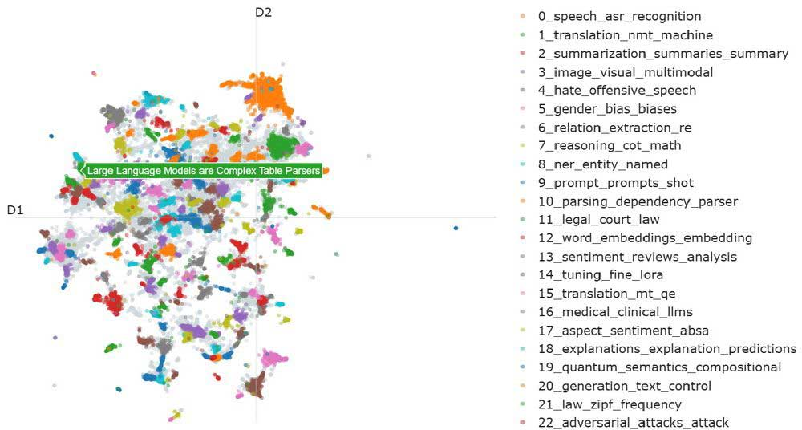

图5-18：文档和主题的可视化输出

BERTopic提供了多种可视化选项，其中有三种值得探索，有助于了解主题之间的关系：

```
# 可视化带有关键词排名的条形图
topic_model.visualize_barchart()
# 可视化主题之间的关系
topic_model.visualize_heatmap(n_clusters=30)
# 可视化主题的潜在层次结构
topic_model.visualize_hierarchy()
```

**5.3.2添加特殊的“乐高积木块”**

我们目前介绍的BERTopic处理流程虽然具有快速且模块化的优点，但仍有一个缺点：它仍然通过词袋模型来表示主题，没有考虑语义结构。

解决方案是利用词袋表示的优势，即它能够快速生成有意义的表示，结合更强大但速度较慢的技术（如嵌入模型）来优化它。如图5-19所示，我们可以对词的初始分布进行重新排序，以改进最终的表示。需要注意的是，对初始结果集进行重新排序的思想是语义搜索的主要特点之一，我们将在第8章详细讨论相关主题。

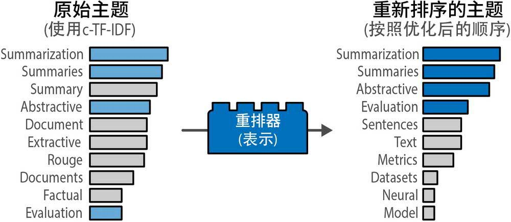

图5-19：通过对原始的c-TF-IDF分布重排序来微调主题表示

因此，如图5-20所示，我们可以设计一个新的“乐高积木块”，它接收这个初始主题表示，输出改进后的表示。

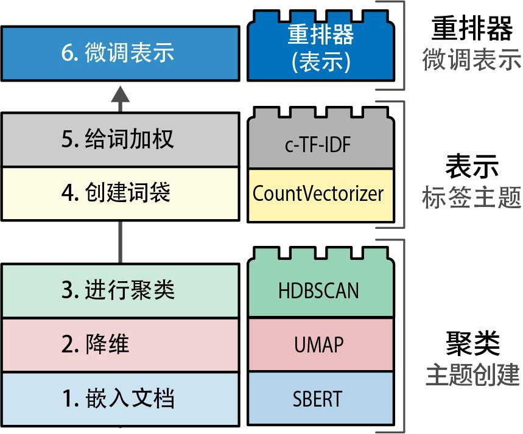

图5-20：重排序（表示）模块建立在c-TF-IDF表示之上

在BERTopic中，这类重排序模型被称为**表示模型**。这种方法的一个主要优势是，优化主题表示的过程只需要循环执行与主题数量相等的次数。例如，我们有数百万个文档和一百个主题，表示模块只需要对每个主题应用一次，而无须对每个文档都应用一次。

如图5-21所示，BERTopic设计了多种表示模块，允许你微调表示。表示模块甚至可以多次堆叠，使用不同的方法来微调表示。

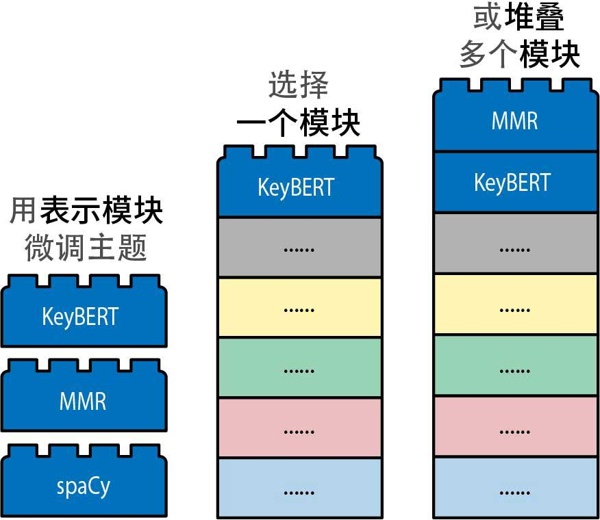

图5-21：在应用c-TF-IDF权重后，主题可以通过各种表示模型进行微调，其中许多是LLM

在探索如何使用这些表示模块之前，我们需要做两件事。第一，我们要保存原始的主题表示，这样就更容易比较使用和不使用表示模型的结果：

```
# 保存原始表示
from copy import deepcopy
original_topics = deepcopy(topic_model.topic_representations_)
```

第二，我们创建一个简单的封装函数，用于快速可视化主题词的差异，以比较使用和不使用表示模型的结果：

```
def topic_differences(model, original_topics, nr_topics=5):
    """显示两个模型之间主题表示的差异"""
    df = pd.DataFrame(columns=["Topic", "Original", "Updated"])
    for topic in range(nr_topics):
        # 每个模型、每个主题提取前5个词
        og_words = " | ".join(list(zip(*original_topics[topic]))[0][:5])
        new_words = " | ".join(list(zip(*model.get_topic(topic)))[0][:5])
        df.loc[len(df)] = [topic, og_words, new_words]
    return df
```

**1.KeyBERTInspired**

1. Maarten Grootendorst. “KeyBERT: Minimal Keyword Extraction with BERT.”(2020).

我们要探索的第一个表示模块是KeyBERTInspired。顾名思义，KeyBERTInspired是受关键词提取包KeyBERT
 [](#footnote-14-65)启发的方法。KeyBERT通过计算、比较词嵌入和文档嵌入之间的余弦相似度来提取文本中的关键词。

BERTopic使用了类似的方法。KeyBERTInspired使用c-TF-IDF来提取每个主题中最具代表性的文档，方法是计算文档的c-TF-IDF值与其对应主题的相似度。如图5-22所示，它计算每个主题的平均文档嵌入，并将其与候选关键词的嵌入向量进行比较，以重新排序关键词。

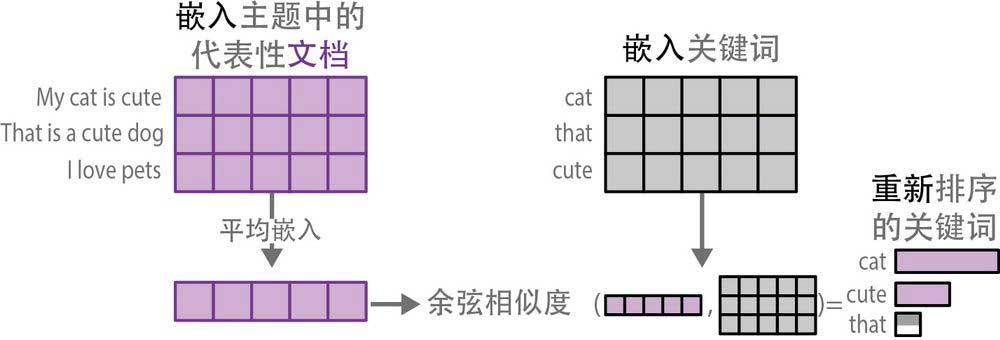

图5-22：KeyBERTInspired表示模块的流程

由于BERTopic的模块化特性，我们可以使用KeyBERTInspired更新初始主题表示，而无须执行降维和聚类步骤：

```
from bertopic.representation import KeyBERTInspired
# 使用KeyBERTInspired更新主题表示
representation_model = KeyBERTInspired()
topic_model.update_topics(abstracts, representation_model=representation_model)
# 展示主题差异
topic_differences(topic_model, original_topics)
```

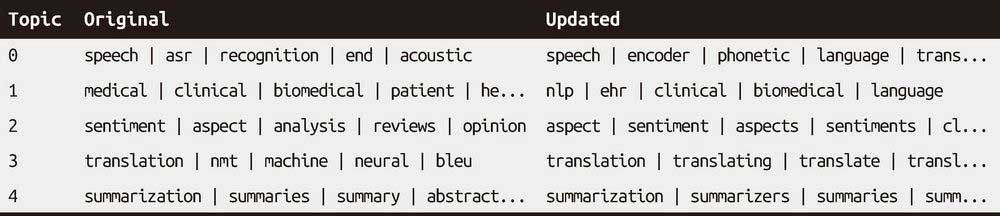

与原始模型相比，更新后的模型提取出的主题更易于阅读。这也展示了基于嵌入的技术的缺点。在原始模型中，像nmt（主题3）这样代表神经机器翻译的词被删除了，因为模型无法正确表示这个实体。对于领域专家来说，这些缩写的信息是非常有价值的。

**2.最大边际相关性**

使用c-TF-IDF和前面展示的KeyBERTInspired技术，生成的主题表示中仍然存在显著的冗余。例如，在主题表示中同时出现了summaries和summary这样相似的词，这就形成了冗余。

我们可以使用最大边际相关性（maximal marginal relevance，MMR）来使主题表示更加多样化。该算法的目的是找到一组相互之间具有差异性，但仍然与所比较的文档相关的关键词。它实现这一点的原理是嵌入一组候选关键词，并迭代计算下一个最佳关键词。这需要设置一个多样性参数，用于指示关键词需要多大的差异性。

在BERTopic中，我们使用MMR将初始关键词集（比如30个）转换为更小但更多样化的关键词集（比如10个）。它过滤掉冗余词，只保留对主题表示有新贡献的词。

实现这一点相当简单：

```
from bertopic.representation import MaximalMarginalRelevance
# 将主题表示更新为最大边际相关性
representation_model = MaximalMarginalRelevance(diversity=0.2)
topic_model.update_topics(abstracts, representation_model=representation_model)
# 展示主题差异
topic_differences(topic_model, original_topics)
```

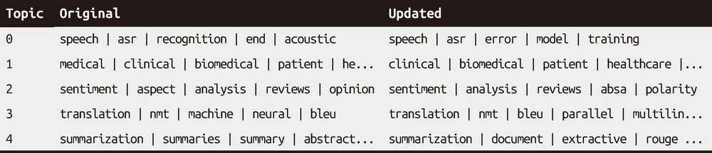

生成的主题显示出更多样化的表示。例如，主题4不仅显示了summary的相关词，还添加了几个其他可能对整体表示有更多贡献的词。


 KeyBERTInspired和MMR都是改进初始主题表示的出色技术。特别是KeyBERTInspired，由于它注重词和文档之间的语义关系，因此几乎去除了所有的停用词。

**5.3.3文本生成的“乐高积木块”**

在前面的例子中，BERTopic中的表示模块一直用作重排序模块。然而，正如我们在上一章探讨的那样，生成模型在各种任务中都具有巨大潜力。

我们可以通过遵循重排序过程的一部分，在BERTopic中高效地使用生成模型。我们不使用生成模型来识别所有文档的主题（可能有数百万个），而是使用生成模型为我们的主题生成标签。如图5-23所示，我们不是生成或重排关键词，而是要求模型基于先前生成的关键词和一小组典型文档生成简短的标签。

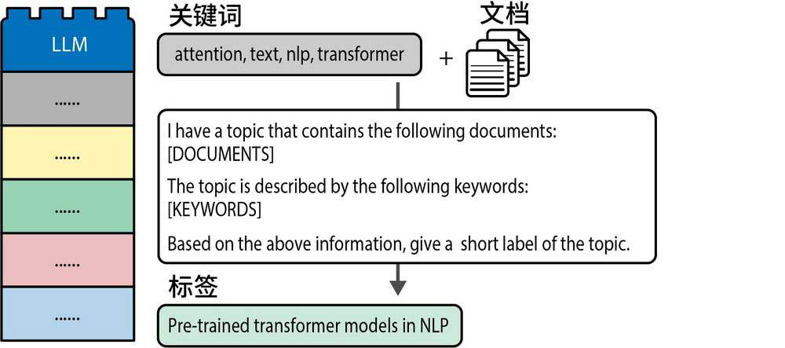

图5-23：使用文本生成LLM和提示工程，根据与每个主题相关的关键词和文档创建主题标签

图5-23中的提示词包含两个组成部分。首先，通过[DOCUMENTS]标签插入的文档是最能代表该主题的一小部分文档，通常是4个，这些文档是基于其c-TF-IDF值与主题的余弦相似度最高而选择的。其次，构成主题的关键词也会传递给提示词，并使用[KEYWORDS]标签引用。这些关键词可以由c-TF-IDF或我们之前讨论过的任何其他表示方法生成。

因此，我们只需要为每个主题使用一次生成模型（可能有数百个主题），而无须为每个文档使用一次（可能有数百万个文档）。我们可以从多种生成模型中选择，包括开源模型和专有模型。让我们从上一章探讨过的FLAN-T5模型开始。

我们创建一个适用于该模型的提示词，并通过representation_model参数在BERTopic中使用它：

```
from transformers import pipeline
from bertopic.representation import TextGeneration
prompt = """I have a topic that contains the following documents:
[DOCUMENTS]
The topic is described by the following keywords: '[KEYWORDS]'.
Based on the documents and keywords, what is this topic about?"""
# 使用FLAN-T5更新主题表示
generator = pipeline("text2text-generation", model="google/flan-t5-small")
representation_model = TextGeneration(
    generator, prompt=prompt, doc_length=50, tokenizer="whitespace"
)
topic_model.update_topics(abstracts, representation_model=representation_model)
# 展示主题差异
topic_differences(topic_model, original_topics)
```

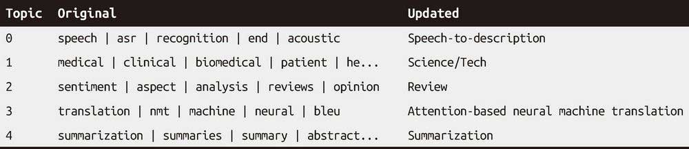

将这些标签与原始表示进行比较，有些标签，如Summarization（摘要），看起来很合理。然而，其他一些标签，如Science/Tech（科学 / 技术）似乎过于宽泛，没有很好地体现原始主题。让我们看看OpenAI的GPT-3.5表现如何，这个模型不仅更大，而且应该具有更强的语言能力：

```
import openai
from bertopic.representation import OpenAI
prompt = """
I have a topic that contains the following documents:
[DOCUMENTS]
The topic is described by the following keywords: [KEYWORDS]
Based on the information above, extract a short topic label in the following
format:
topic: <short topic label>
"""
# 使用GPT-3.5更新主题表示
client = openai.OpenAI(api_key="YOUR_KEY_HERE")
representation_model = OpenAI(
    client, model="gpt-3.5-turbo", exponential_backoff=True, chat=True,
prompt=prompt
)
topic_model.update_topics(abstracts, representation_model=representation_model)
# 展示主题差异
topic_differences(topic_model, original_topics)
```

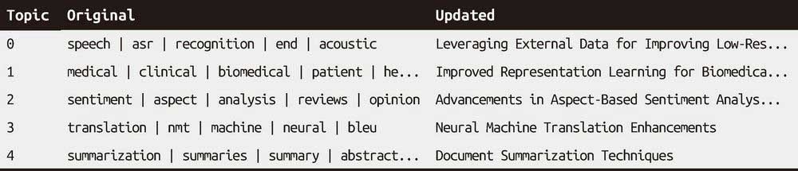

生成的标签令人印象深刻！我们甚至还没有使用GPT-4，但得到的标签似乎比之前的例子更有信息量。需要注意的是，BERTopic不仅限于使用OpenAI的产品，还支持本地后端。


 虽然看起来我们不再需要关键词了，但关键词仍然能代表输入文档的特征。没有任何模型是完美的，因此通常建议生成多个主题表示。BERTopic支持通过不同的方式来表示所有主题。例如，你可以同时使用KeyBERTInspired、MMR和GPT-3.5从不同的视角解释同一主题。

有了这些由GPT-3.5生成的标签，我们可以使用datamapplot包创建精美的可视化图表（图5-24）：

```
# 可视化主题和文档
fig = topic_model.visualize_document_datamap(
    titles,
    topics=list(range(20)),
    reduced_embeddings=reduced_embeddings,
    width=1200,
    label_font_size=11,
    label_wrap_width=20,
    use_medoids=True,
)
```

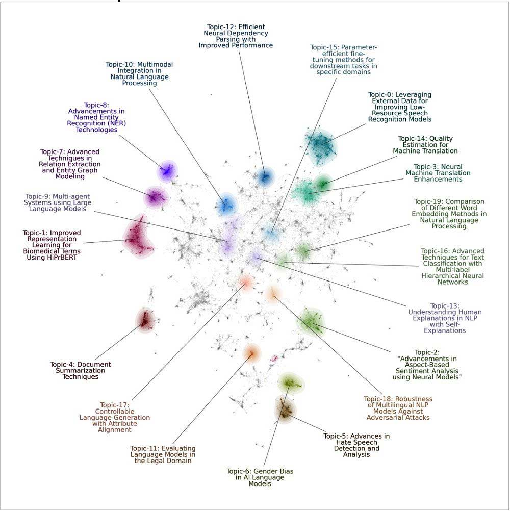

图5-24：可视化的前20个主题

### 5.4 小结

在本章中，我们探讨了生成模型和表示模型如何在无监督学习领域发挥作用。尽管近年来监督方法（如分类）盛行，但无监督方法（如文本聚类）由于能够在无须预先标注的情况下基于语义内容对文本进行分组，仍然具有巨大潜力。

我们介绍了一个常见的文本聚类流程。首先将输入文本转换为数值表示，即嵌入向量。然后对这些嵌入向量进行降维，以简化高维数据，获得更好的聚类效果。最后，对降维后的嵌入向量应用聚类算法，来对输入文本进行聚类。通过手动查看这些簇，我们可以更好地理解每个簇包含哪些文档，以及如何解释这些簇。

为了免于手动查看，我们探索了BERTopic如何通过自动表示聚类的方法来扩展这个文本聚类流程。这种方法通常被称为主题建模，它试图在大量文档中发现主题。BERTopic通过结合c-TF-IDF的词袋方法生成这些主题表示，该方法根据词在簇中的相关性和在所有簇中的频率来给词加权。

BERTopic的一大优势在于其模块化特性。在BERTopic中，你可以自由选择流程中的任意模型，从而为同一主题创建多个视角的表示。我们探索了利用最大边际相关性和KeyBERTInspired来微调由c-TF-IDF生成的主题表示。此外，我们还使用了上一章介绍的生成式LLM（FLAN-T5和GPT-3.5），通过生成高度可解释的标签，进一步提高主题的可解释性。

在下一章中，我们将转换焦点，探索改进生成模型输出的常用方法——提示工程。


---

## 第6章 提示工程

在本书的前几章中，我们初步探索了LLM的世界。我们深入研究了各种应用，如监督分类和无监督分类；使用了专注于文本表示的模型，如BERT及其衍生模型。

随着学习的深入，我们使用了主要为文本生成而训练的模型，这类模型通常被称为**生成式预训练Transformer（GPT）。它们具有强大的能力，可以根据用户的提示词生成文本。通过提示工程**，我们可以设计更高效的提示词，从而提高生成文本的质量。

在本章中，我们将更详细地探索这些生成模型，并深入研究提示工程、基于生成模型的推理、输出的验证和评估。

### 6.1 使用文本生成模型

在开始学习提示工程的基础知识之前，了解文本生成模型的基础知识至关重要。我们如何选择模型？是使用专有模型还是开源模型？如何控制生成的输出？这些问题将作为我们使用文本生成模型的起点。

**6.1.1选择文本生成模型**

选择文本生成模型首先需要在专有模型和开源模型之间做出选择。虽然专有模型通常性能更好，但在本书中我们更多关注开源模型，因为它们提供了更强的灵活性，且可以免费使用。

图6-1展示了一些具有影响力的基础模型，这些LLM在海量文本数据上进行了预训练，通常会针对特定应用进行微调。

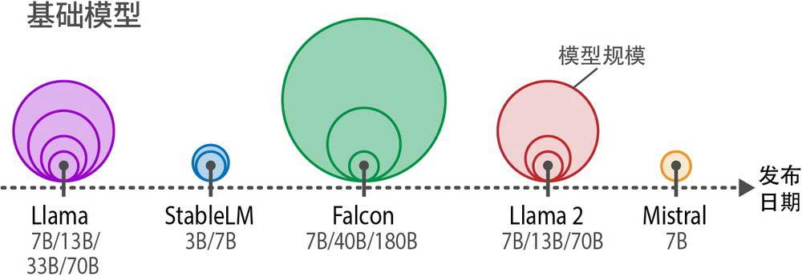

图6-1：基础模型通常以多种参数规模发布

这些基础模型经过微调，已经产生了数百甚至数千个模型，每种模型在特定任务上的表现各有千秋。选择使用哪个模型可能是一项艰巨的任务。

我们建议从小型基础模型开始。因此，我们继续使用Phi-3-mini，它有38亿个参数，可以在显存容量不超过8 GB的设备上运行。总的来说，从小模型逐步扩展到大模型的学习体验通常比反之更顺畅。较小的模型不仅是入门的绝佳选择，还为后续进阶到更大的模型奠定了坚实的基础。

**6.1.2加载文本生成模型**

正如前几章所述，加载模型最直接的方法是使用transformers库：

```
import torch
from transformers import AutoModelForCausalLM, AutoTokenizer, pipeline
# 加载模型和分词器
model = AutoModelForCausalLM.from_pretrained(
    "microsoft/Phi-3-mini-4k-instruct",
    device_map="cuda",
    torch_dtype="auto",
    trust_remote_code=True,
)
tokenizer = AutoTokenizer.from_pretrained("microsoft/Phi-3-mini-4k-instruct")
# 创建流水线
pipe = pipeline(
    "text-generation",
    model=model,
    tokenizer=tokenizer,
    return_full_text=False,
    max_new_tokens=500,
    do_sample=False,
)
```

与前几章相比，本章将更深入地探讨提示词模板的开发和使用。

为了说明这一点，让我们回顾一下第1章的例子，当时我们要求LLM讲一个关于鸡的笑话：

```
# 提示词
messages = [
    {"role": "user", "content": "Create a funny joke about chickens."}
]
# 生成输出
output = pipe(messages)
print(output[0]["generated_text"])
Why don't chickens like to go to the gym? Because they can't crack the eggsistence
of it!
```

在底层，transformers.pipeline首先将我们的消息转换为特定的提示词模板。我们可以通过访问底层分词器来探索这个过程：

```
# 应用提示词模板
prompt = pipe.tokenizer.apply_chat_template(messages, tokenize=False)
print(prompt)
<s><|user|>
Create a funny joke about chickens.<|end|>
<|assistant|>
```

你可能还记得我们在第2章学习的特殊词元<|user|>和<|assistant|>。这个提示词模板（如图6-2所示）是模型训练期间使用的。它不仅提供了对话中“谁说了什么”的信息，还可以通过<|end|>词元指示模型应该在何时停止生成文本。这个提示词会直接传递给LLM并一次性处理完毕。

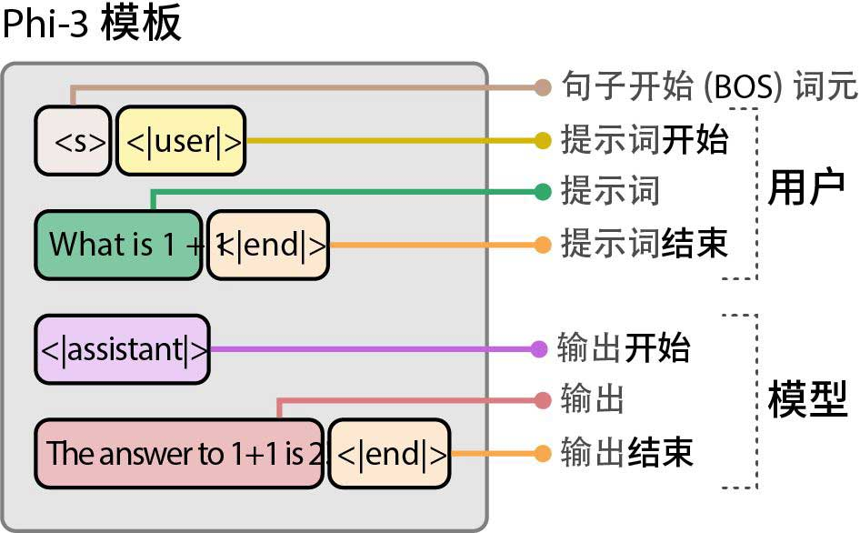

图6-2：Phi-3与模型交互所需的模板

在下一章中，我们将自定义这个模板的某些部分。在本章中，我们可以使用transformers.pipeline来帮助我们处理聊天模板。接下来，让我们探索如何控制模型的输出。

**6.1.3控制模型输出**

除了提示工程，我们还可以通过调整模型参数来控制输出类型。下面我们来介绍一下最常用的模型参数：temperature和top_p。

模型参数控制着输出的随机性。LLM令人兴奋的技术特点之一是，它能够为完全相同的提示词生成不同的响应。每当LLM需要生成一个词元时，它都会为每个可能的词元分配一个可能性分数。

如图6-3所示，在句子“I am driving a...”（我正在开……）中，a后面接词元car（车）或truck（卡车）的可能性通常比接词元elephant（大象）要大。然而，生成elephant的可能性仍然存在，只是要小得多。

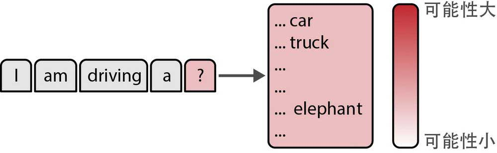

图6-3：模型根据可能性分数选择下一个要生成的词元

在加载模型时，我们特意设置了do_sample=False，以确保输出具有一定的一致性。这意味着模型不会进行采样，只会选择最可能的下一个词元。然而，要使用temperature和top_p参数，我们需要设置do_sample=True。

**1.temperature**

temperature（温度）决定生成文本的随机性或创造性。它定义了选择本来不太可能出现的词元的概率。其基本原理是，temperature为0时每次都会生成相同的响应，因为它总是选择可能性最大的词。如图6-4所示，较高的temperature值允许生成可能性更小的词。

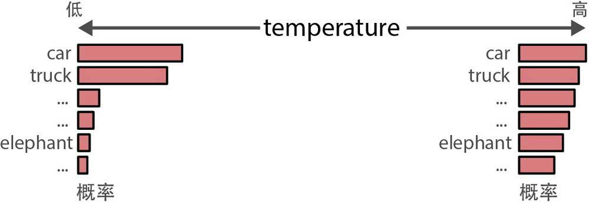

图6-4：temperature越高，生成可能性更小词元的概率越高，反之亦然

因此，较高的temperature（如0.8）通常会产生更多样化的输出，而较低的temperature（如0.2）会产生更具确定性的输出。

你可以在流水线中这样使用temperature：

```
# 使用较高的温度
output = pipe(messages, do_sample=True, temperature=1)
print(output[0]["generated_text"])
Why don't chickens like to go on a rollercoaster? Because they're afraid they might suddenly become chicken-soup!
```

注意，每次重新运行这段代码时，输出都会改变。temperature引入了随机行为，因为模型现在会随机选择词元。

**2.top_p**

top-*p*采样，也称为核采样（nucleus sampling），是一种控制LLM可以考虑哪些词元子集（核）的采样技术。它会考虑概率最高的若干词元，直到达到其累积概率限制。如果我们将top_p设置为0.1，模型会从概率最高的词元开始考虑，直到这些词元的累积概率达到0.1。如果我们将top_p设置为1，模型会考虑所有词元。

如图6-5所示，降低top_p值会减少LLM考虑的词元数量，通常会生成“更具确定性”的输出；而提高top_p值则允许LLM从更多词元中进行选择，从而生成“更具创造性”的输出。

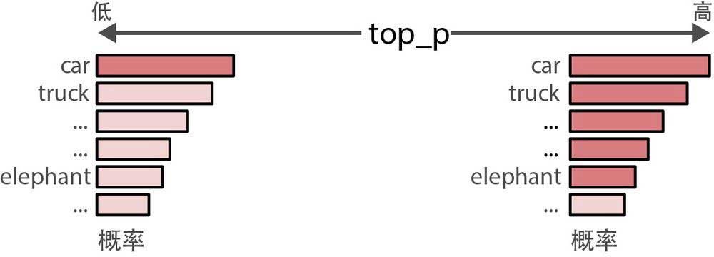

图6-5：较高的top_p会增加生成词元的候选集合中的词元数量，反之亦然

同样，top_k参数精确控制LLM可以考虑的词元数量。如果你将其值更改为100，LLM将只考虑可能性最大的前100个词元。

你可以在流水线中这样使用top_p：

```
# 使用较高的top_p
output = pipe(messages, do_sample=True, top_p=1)
print(output[0]["generated_text"])
Why don't chickens make good comedians? Because their 'jokes' always 'feather' the truth!
```

如表6-1所示，这些参数允许用户在创造性（高temperature和高top_p）和可预测性（低temperature和低top_p）之间进行调节。

表6-1：选择temperature和top_p值的用例

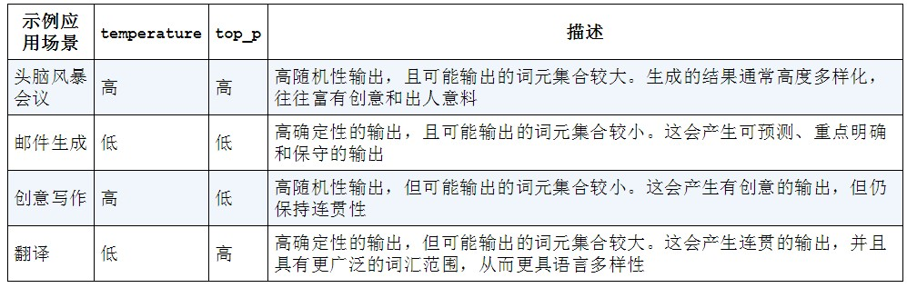

### 6.2 提示工程简介

在使用文本生成类LLM的过程中，提示工程是一个至关重要的部分。通过精心设计提示词，我们可以引导LLM生成所需的响应。无论提示词是问题、陈述还是指令，提示工程的主要目标都是引导模型生成有用的回复。

提示工程不仅仅是设计效果良好的提示词这么简单。它可以用作评估模型输出的工具，也可用于设计保障措施和风险控制方法。提示词优化的迭代过程需要不断实验。目前没有，未来也不太可能有完美的提示词设计。

在本节中，我们将介绍提示工程的常用方法，以及一些小技巧，有助于理解某些提示词的效果。这些技能让我们能够理解LLM的能力，这是与这类模型交互的基础。

我们首先回答一个问题：提示词中应该包含什么？

**6.2.1提示词的基本要素**

LLM是一个预测引擎。基于某个输入（即提示词），它试图预测可能跟随其后的词。从本质上讲，只需少数几个词，就能激发LLM做出响应（见图6-6）。

然而，尽管这个基本示例看起来可以工作，但它无法完成指定的任务。我们通常向LLM提出特定问题或任务，从而实现提示工程。为了获得所需的响应，我们需要一个结构更完善的提示词。

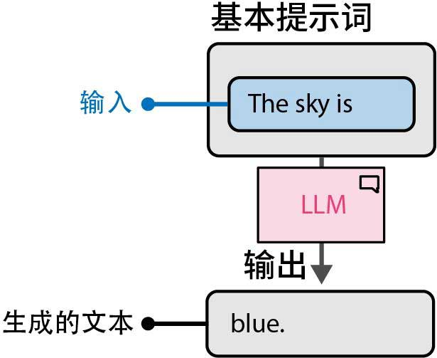

图6-6：一个基本的提示词示例。由于没有给出指令，LLM将简单地尝试补全这个句子

例如，如图6-7所示，我们可以让LLM将一个句子分类为正面或负面情感。我们扩展最基本的提示词，使其包含两个组件——指令本身和与指令相关的数据。

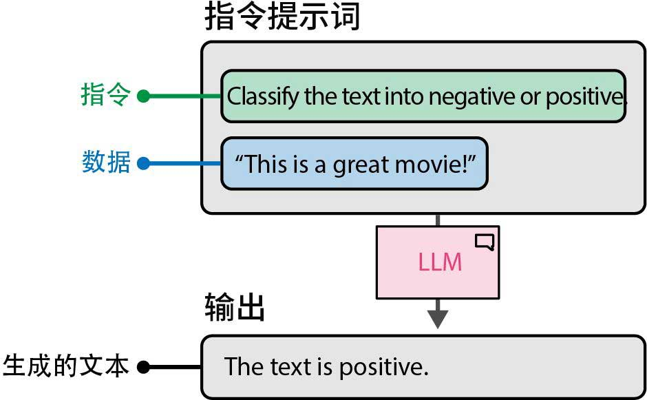

图6-7：基本指令提示词的两个组件：指令本身及其相关的数据

更复杂的用例可能需要在提示词中包含更多组件。例如，为了确保模型只输出negative（负面）或positive（正面），我们可以用输出指示器来引导模型。在图6-8中，我们在句子前加上“Text:”（文本：），并添加“Sentiment:”（情感：），以防止模型生成完整的句子。这种结构表明我们期望输出为negative或positive。尽管模型可能没有直接在这些组件上训练过，但它接收了足够多的指令，能够泛化到这种结构。

我们可以继续添加或更新提示词的组件，直到获得我们想要的响应。我们可以添加更多示例、更详细地描述用例、提供额外的上下文等。上述组件仅仅是示例，并未展示所有的可能。设计这些组件，关键要靠创造力。

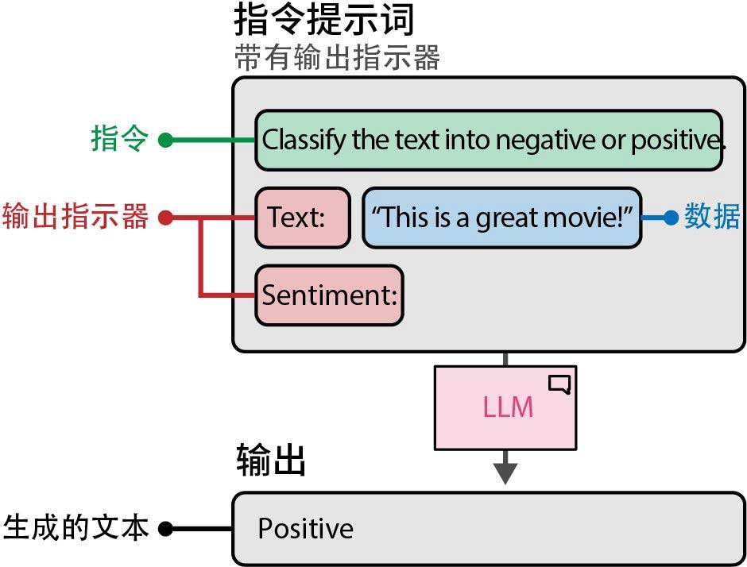

图6-8：扩展提示词，添加输出指示器以获得特定输出

虽然提示词是单个文本片段，但将其分解为一个更大的系统的组件，会很有帮助。例如，我是否描述了问题的上下文？提示词中是否包含输出示例？

**6.2.2基于指令的提示词**

虽然提示词有多种形式，可以是与LLM讨论哲学，也可以是与你最喜欢的超级英雄玩角色扮演，但提示词通常用于让LLM回答特定问题或解决特定任务。这称为基于指令的提示词。

图6-9展示了基于指令的提示词发挥重要作用的一些用例。我们在前面的示例中已经展示了其中之一，即监督分类。

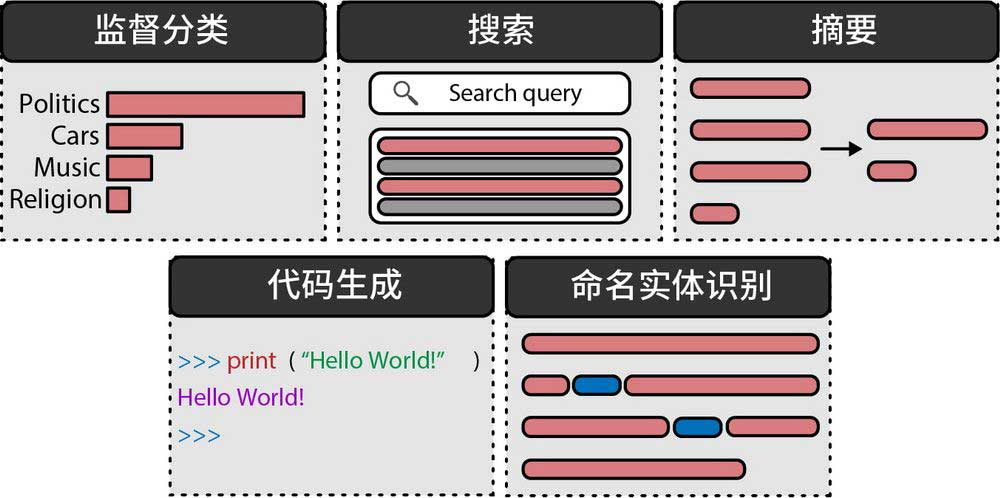

图6-9：基于指令的提示词的应用场景

这些任务需要不同的提示词格式，更具体地说，需要向LLM提出不同的问题。这样，让LLM提炼一段文本的摘要时，就不会突然得到文本分类的结果。图6-10展示了一些应用场景下的提示词示例。

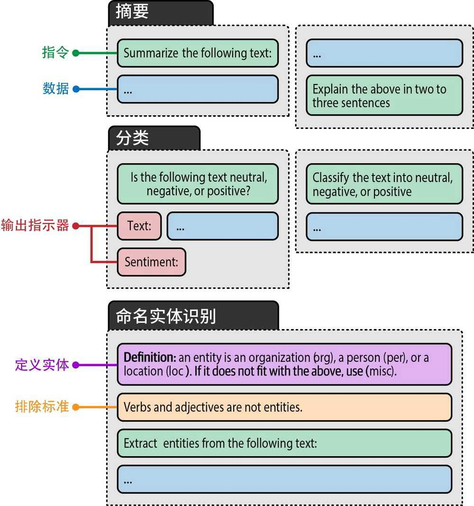

图6-10：常见应用场景的提示词示例。注意在同一个应用场景中，指令的结构和位置可以改变

虽然这些任务需要不同的指令，但用于提高输出质量的提示词优化技术实际上有很多共通之处。这些技术包括但不限于：

具体性

准确描述你想要达到的目标。让LLM“为产品写一段描述”，不如让它“用不超过两句话撰写一段正式风格的产品描述”。

幻觉

LLM可能会自信地生成错误信息，这被称为幻觉（hallucination）。为了降低其影响，我们可以要求LLM只在知道答案时才生成答案。如果不知道答案，可以回答“我不知道”。

顺序

1. Nelson F. Liu et al. “Lost in the Middle: How Language Models Use Long Contexts.” arXiv preprint arXiv: 2307.03172 (2023).

在提示词的开头或结尾放置指令。特别是对于长提示词，中间的信息往往会被遗忘
 [](#footnote-15-36)。LLM往往会关注提示词的开头部分（首位效应）或结尾部分（近因效应）。

其中，具体性可以说是最重要的。通过限制和明确模型应该生成的内容，可以减小生成与使用场景无关内容的可能性。例如，如果我们不添加“in two to three sentences”这个指令，它可能会生成完整的段落。就像人类对话一样，如果没有具体的指令或附加的上下文，模型很难判断实际任务是什么。

### 6.3 高级提示工程

从表面上看，创建一个好的提示词似乎很简单，只需要提出一个具体的问题，做到准确，添加一些示例就可以了。然而，提示工程实际上可能会很快变得很复杂，在使用LLM时，这个环节常常被低估。

在这里，我们将介绍几种构建提示词的高级技术，从构建复杂提示词的迭代工作流开始，到使用一连串的LLM获得更好的结果。最终，我们甚至会讲到高级推理技术。

**6.3.1提示词的潜在复杂性**

正如我们在6.2节中探讨的那样，提示词通常由多个组件组成。在我们的第一个示例中，提示词包含了指令、数据和输出指示器。如前所述，提示词并不限于这三个组件，你可以根据需要构建任意复杂的提示词。

这些高级组件可以很快让提示词变得相当复杂。一些常见的组件如下。

角色定位

描述LLM应该扮演什么角色。例如，如果你想问一个关于天体物理学的问题，可以使用“你是一位天体物理学专家”。

### 指令

任务本身。指令应该尽可能具体，避免留下太大的解释空间。

上下文

描述问题或任务背景的附加信息。它回答了“为什么提出这个指令”这样的问题。

格式

LLM输出生成文本的格式。如果不指定格式，LLM会自行决定格式，这在自动化系统中会造成麻烦。

受众

生成文本的目标对象。这也描述了输出的水平。在教育目的下，使用ELI5（Explain like I'm 5，“向5岁的孩子解释”）通常很有帮助。

语气

LLM在生成文本中应该使用的语气。如果你要给老板写一封正式的邮件，你肯定不想使用非正式的语气。

数据

与任务本身相关的主要数据。

为了进一步说明，我们扩展之前的分类提示词，使用上述所有组件，如图6-11所示。

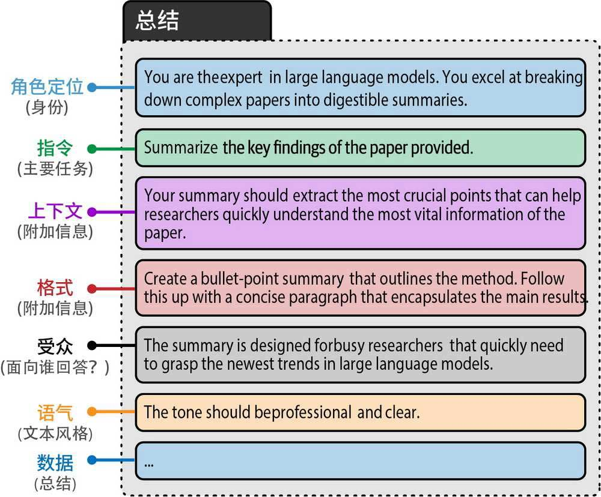

图6-11：一个包含多个组件的复杂提示词示例

这个复杂的提示词展示了提示词的模块化特性。我们可以自由地添加和删除组件，并判断它们对输出的影响。如图6-12所示，我们可以逐步构建提示词，探索每次更改的效果。

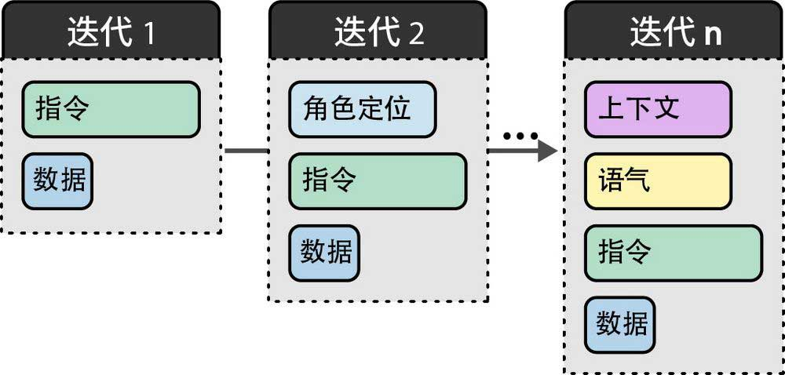

图6-12：对模块化组件进行迭代是提示工程的重要步骤

这些变化不仅限于简单地添加或删除组件。正如我们之前在首因效应和近因效应中看到的那样，它们的顺序也会影响LLM输出的质量。换句话说，在为你的应用场景寻找最佳提示词时，实验是至关重要的。在提示工程中，我们本质上是在进行一个迭代的实验循环。

亲自动手试一试，在复杂提示词的基础上添加、删除部分组件，观察它对所生成输出的影响。你很快就会注意到哪些组件值得保留。你可以将自己的数据添加到data变量中：

```
# 提示词的组件
persona = "You are an expert in Large Language models. You excel at breaking down
complex papers into digestible summaries.\n"
instruction = "Summarize the key findings of the paper provided.\n"
context = "Your summary should extract the most crucial points that can help
researchers quickly understand the most vital information of the paper.\n"
data_format = "Create a bullet-point summary that outlines the method. Follow this
up with a concise paragraph that encapsulates the main results.\n"
audience = "The summary is designed for busy researchers that quickly need to grasp the newest trends in Large Language Models.\n"
tone = "The tone should be professional and clear.\n"
text = "MY TEXT TO SUMMARIZE"
data = f"Text to summarize: {text}"
# 完整提示词（删除和添加片段以查看它对输出的影响）
```

`query = persona + instruction + context + data_format + audience + tone + data
`

1. Cheng Li et al. “EmotionPrompt: Leveraging Psychology for Large Language Models Enhancement via Emotional Stimulus.” arXiv preprint arXiv:2307.11760 (2023).

 我们可以添加各种组件，包括创意性组件，比如情感刺激（例如，“这对我的职业生涯非常重要”
 [](#footnote-15-44)）。提示工程的乐趣之一在于，你可以尽可能发挥创造力，探索哪些组件的组合最适合你的应用场景。在开发适合你自己需求的格式时，几乎没有限制。

从某种意义上说，这是在对LLM所学习的内容以及它如何响应某些提示词进行逆向工程。然而，请注意，某些提示词在不同的模型上效果不同，因为这些模型的训练数据不一样，或者它们的训练目标各异。

**6.3.2上下文学习：提供示例**

在前面的章节中，我们尝试准确描述LLM应该做什么。虽然准确和具体的描述有助于LLM理解用例，但我们可以更进一步：与其描述任务，为什么不直接展示任务呢？

1. Tom Brown et al. “Language Models Are Few-Shot Learners.” Advances in Neural Information Processing Systems 33 (2020): 1877-1901.

我们可以为LLM提供我们想要完成的目标任务的具体示例。这通常被称为**上下文学习**（in-context learning），其中，我们为模型提供正确的示例
 [](#footnote-15-75)。

如图6-13所示，根据向LLM展示的示例数量，上下文学习可以有多种形式。零样本提示不使用示例，单样本提示使用一个示例，少样本提示使用两个或更多示例。

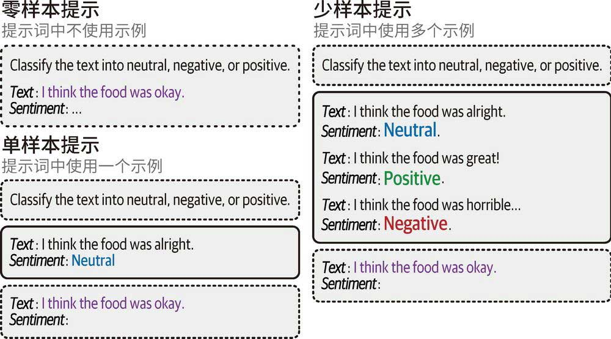

图6-13：上下文学习中使用示例的不同形式

我们相信“一例胜千言”。这些示例直接展示了LLM应该实现什么以及如何实现。

1. Tom Brown et al. “Language Models Are Few-Shot Learners.” Advances in Neural Information Processing Systems 33 (2020): 1877-1901.

我们可以用一个简单的例子来说明这种方法，这个例子来自描述该方法的原始论文
 [](#footnote-15-36)。提示词的目标是生成一个包含虚构词的句子。为了提高生成句子的质量，我们可以向生成模型展示一个包含虚构词的句子的示例。

为此，我们需要区分用户（user）的问题和模型（assistant）提供的答案。我们还展示了如何使用模板处理这种交互：

```
# 使用虚构词的单个句子示例
one_shot_prompt = [
    {
        "role": "user",
        "content": "A 'Gigamuru' is a type of Japanese musical instrument. An example of a sentence that uses the word Gigamuru is:"
    },
    {
        "role": "assistant",
        "content": "I have a Gigamuru that my uncle gave me as a gift. I love to play it at home."
    },
    {
        "role": "user",
        "content": "To 'screeg' something is to swing a sword at it. An example of a sentence that uses the word screeg is:"
    }
]
print(tokenizer.apply_chat_template(one_shot_prompt, tokenize=False))
<s><|user|>
A 'Gigamuru' is a type of Japanese musical instrument. An example of a sentence that uses the word Gigamuru is:<|end|>
<|assistant|>
I have a Gigamuru that my uncle gave me as a gift. I love to play it at home.<|end|>
<|user|>
To 'screeg' something is to swing a sword at it. An example of a sentence that uses the word screeg is:<|end|>
<|assistant|>
```

提示词展示了区分user和assistant的必要性。如果我们不这样做，就会看起来像是在自言自语。通过这些交互，我们可以生成如下输出：

```
# 生成输出
outputs = pipe(one_shot_prompt)
print(outputs[0]["generated_text"])
During the intense duel, the knight skillfully screeged his opponent's shield, forcing him to defend himself.
```

它正确生成了回答！

与所有提示词组件一样，单样本或少样本提示并不是提示工程的终极解决方案。我们可以将它作为组件，进一步增强我们给出的描述。通过随机采样，模型仍然可以“选择”忽略指令。

**6.3.3链式提示：分解问题**

在前面的例子中，我们探讨了将提示词分解成模块化组件以提高LLM的性能。虽然这种方法适用于许多场景，但对于高度复杂的提示词或应用场景可能并不可行。

除了在提示词内部分解问题，我们还可以在提示词之间这样做。本质上，我们是将一个提示词的输出作为下一个提示词的输入，从而创建一个连续的交互链来解决我们的问题。

为了说明这一点，假设我们想要使用LLM基于一些产品特征创建产品名称、口号和销售宣传语。我们可以要求LLM一次性完成这些任务，但这里我们将问题分解成几个部分。

如图6-14所示，我们得到一条流水线：首先创建产品名称，然后将其与产品特征结合起来作为输入来创建口号，最后使用特征、产品名称和口号来创建销售宣传语。

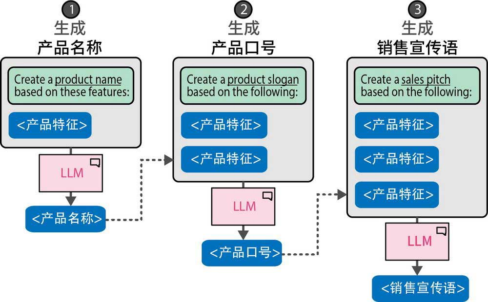

图6-14：使用产品特征描述，通过链式提示创建合适的产品名称、口号和销售宣传语

链式提示技术让LLM能够在每个独立问题上投入更多时间，而不是一次性解决整个问题。让我们用一个小例子来说明这一点。首先，我们为一个聊天机器人创建名称和口号：

```
# 为产品创建名称和口号
product_prompt = [
    {"role": "user", "content": "Create a name and slogan for a chatbot that leverages LLMs."}
]
outputs = pipe(product_prompt)
product_description = outputs[0]["generated_text"]
print(product_description)
Name: 'MindMeld Messenger'
Slogan: 'Unleashing Intelligent Conversations, One Response at a Time'
```

然后，我们可以使用生成的输出作为LLM的输入来生成销售宣传语：

```
# 基于产品名称和口号生成销售宣传语
sales_prompt = [
    {"role": "user", "content": f"Generate a very short sales pitch for the
 following product: '{product_description}'"}
]
outputs = pipe(sales_prompt)
sales_pitch = outputs[0]["generated_text"]
print(sales_pitch)
Introducing MindMeld Messenger - your ultimate communication partner! Unleash
intelligent conversations with our innovative AI-powered messaging platform.
With MindMeld Messenger, every response is thoughtful, personalized, and
timely. Say goodbye to generic replies and hello to meaningful interactions.
Elevate your communication game with MindMeld Messenger - where every message
is a step toward smarter conversations. Try it now and experience the future
of messaging!
```

虽然我们需要调用两次模型，但这样做的一个重要优势是我们可以为每次调用设置不同的参数。例如，名称和口号所需的词元数量相对较少，而宣传语可以更长。

这种方法可以用于多种场景。

响应验证

让LLM对之前生成的输出进行二次检查。

并行提示

并行创建多个提示词，最后合并结果。例如，让多个LLM并行生成多个食谱，然后使用组合结果创建购物清单。

写故事

通过将问题分解成多个组件来利用LLM写书或故事。比如，先写一个概要，再发展人物角色，接着构建叙事节奏，然后深入创作对话。

在下一章中，我们将自动化这个过程，解决简单的LLM链带来的局限性。我们将把其他技术组件串联在一起，如记忆、工具等。在此之前，接下来的一节将进一步探讨链式提示的理念，介绍更复杂的链式提示方法，如自洽性、思维链和思维树。

### 6.4 使用生成模型进行推理

在前面的章节中，我们主要关注提示词的模块化组件，通过迭代来构建它们。这些高级提示工程技术，如链式提示，被证明是实现生成模型复杂推理的第一步。

推理是人类智能的核心组成部分，经常被拿来与LLM展现的类似推理的涌现行为进行比较。我们强调“类似”是因为在撰写本书时，这些模型通常被认为是通过记忆训练数据和模式匹配展现出这种行为的。

然而，它们的输出的确可以展现出复杂的行为，尽管这可能不是“真正的”推理，但仍被称为推理能力。换句话说，我们通过提示工程与LLM合作，从而模仿推理过程，改进LLM的输出。

为了实现这种推理行为，我们先来回顾人类行为中的推理。简单来说，我们的推理方法可以分为系统1和系统2两种思维过程。

1. Daniel Kahneman. Thinking, Fast and Slow. Macmillan (2011).

系统1思维代表一种自动的、直觉的、几乎即时的过程。它与自动生成词元而没有任何自我反思行为的生成模型有相似之处。相比之下，系统2思维是一个有意识的、缓慢的、有逻辑性的过程，类似于头脑风暴和自我反思
 [](#footnote-15-97)。

如果我们能赋予生成模型模仿某种形式的自我反思的能力，我们实际上就是在模拟系统2思维的方式，这往往比系统1思维产生更深思熟虑的响应。在本节中，我们将探索几种模仿人类推理的这类思维过程的技术，目的是改进模型的输出。

**6.4.1思维链：先思考再回答**

1. Jason Wei et al. “Chain-of-Thought Prompting Elicits Reasoning in Large Language Models.” Advances in Neural Information Processing Systems 35 (2022): 24824-24837.

生成模型迈向复杂推理的第一个重要步骤是应用一种称为思维链的方法。思维链的目标是让生成模型先“思考”，而不是不经任何推理就直接回答问题
 [](#footnote-15-66)。

如图6-15所示，我们在提示词中提供了一些示例，展示了模型在生成响应之前应该进行的推理。这些推理过程被称为“思考”。这对于涉及较高复杂度的任务（如数学问题）帮助很大。添加这个推理步骤使模型能够在推理过程中充分利用更多的计算资源。相比于基于几个词元直接计算出完整的答案，在推理过程中每增加一个词元都能让LLM的输出更稳定。

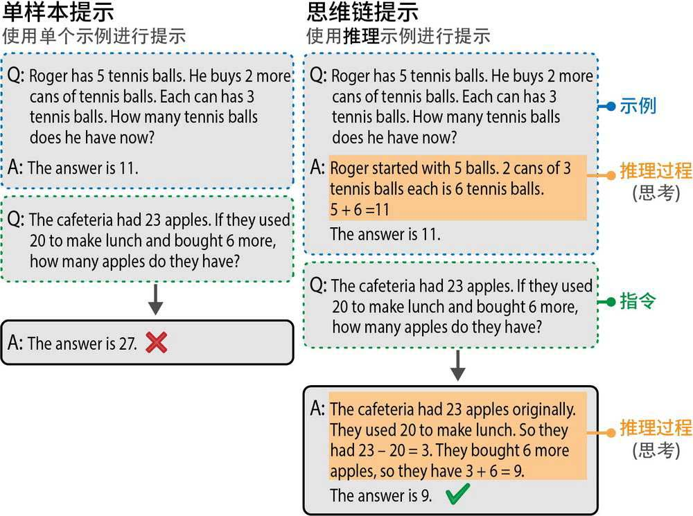

图6-15：思维链提示通过推理示例，引导生成模型在回答中运用推理

我们使用论文作者的例子来展示这种现象：

```
# 使用思维链回答
cot_prompt = [
    {"role": "user", "content": "Roger has 5 tennis balls. He buys 2 more cans of tennis balls. Each can has 3 tennis balls. How many tennis balls does he have now?"},
    {"role": "assistant", "content": "Roger started with 5 balls. 2 cans of 3 tennis balls each is 6 tennis balls. 5 + 6 = 11. The answer is 11."},
    {"role": "user", "content": "The cafeteria had 23 apples. If they used 20 to make lunch and bought 6 more, how many apples do they have?"}
]
# 生成输出
outputs = pipe(cot_prompt)
print(outputs[0]["generated_text"])
The cafeteria started with 23 apples. They used 20 apples, so they had 23 – 20
= 3 apples left. Then they bought 6 more apples, so they now have 3 + 6 = 9
apples. The answer is 9.
```

注意，模型不仅生成了答案，还在给出答案之前提供了解释。通过这种方式，它可以利用前面生成的知识来计算最终答案。

虽然思维链是一种增强生成模型输出的好方法，但它需要在提示词中包含一个或多个推理示例，而用户可能无法获取这些示例。我们也可以不提供示例，而是直接要求生成模型进行推理（零样本思维链）。这种方法有多种形式，一种常见且有效的方法是使用“让我们逐步思考”（Let's think step-by-step），如图6-16所示。

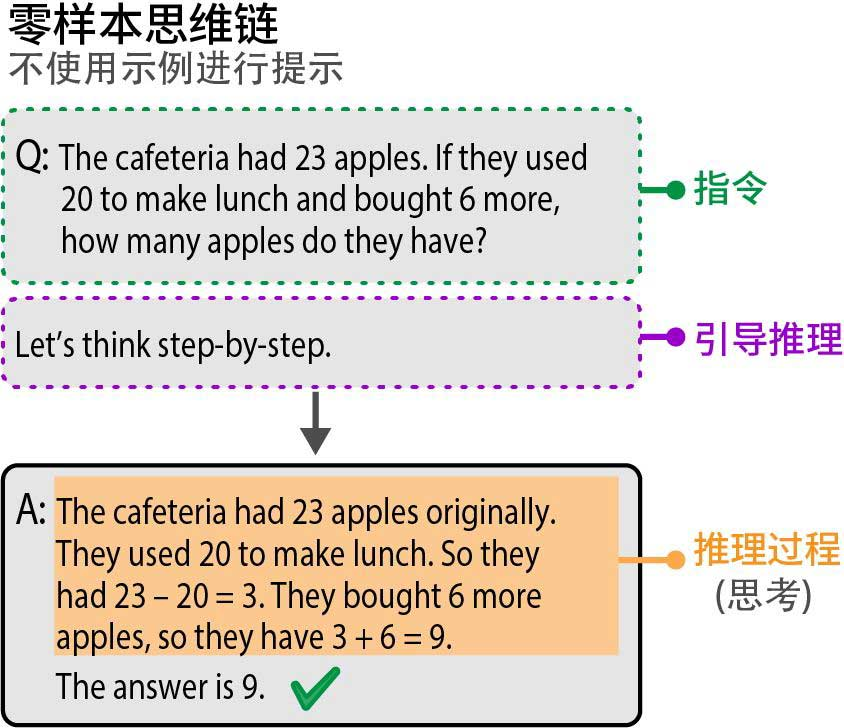

图6-16：不使用示例的思维链提示。它用“让我们逐步思考”来引导推理

用之前的例子，我们可以简单地在提示词后面加上这句话来实现类似思维链的推理：

```
# 零样本思维链
zeroshot_cot_prompt = [
    {"role": "user", "content": "The cafeteria had 23 apples. If they used 20 to make lunch and bought 6 more, how many apples do they have? Let's think step-by-step."}
]
# 生成输出
outputs = pipe(zeroshot_cot_prompt)
print(outputs[0]["generated_text"])
Step 1: Start with the initial number of apples, which is 23.
Step 2: Subtract the number of apples used to make lunch, which is 20. So, 23
- 20 = 3 apples remaining.
Step 3: Add the number of apples bought, which is 6. So, 3 + 6 = 9 apples.
The cafeteria now has 9 apples.
```

无须提供示例，我们就能再次得到相同的推理行为。这就是为什么在做计算时“展示解题过程”如此重要。通过阐述推理过程，LLM可以将先前生成的信息作为指导，最终得出答案。


1. Chengrun Yang et al. “Large Language Models as Optimizers.” arXiv preprint arXiv:2309.03409 (2023).

 虽然“让我们逐步思考”可以改善输出，但不要局限于这句话的字面表述。还存在一些替代方案，比如“深呼吸，让我们逐步思考”和“让我们一步一步解决这个问题”
 [](#footnote-15-75)。

**6.4.2自洽性：采样输出**

如果我们通过temperature和top_p等参数允许一定程度的创造性，多次使用相同的提示词，可能会得到不同的结果。此时，根据词元的随机选择，输出的质量可能会提高或降低。换句话说，全靠运气！

1. Xuezhi Wang et al. “Self-Consistency Improves Chain of Thought Reasoning in Language Models.” arXiv preprint arXiv:2203.11171 (2022).

为了抵消这种随机性并提高生成模型的性能，研究人员引入了自洽性（self-consistency）的概念。这种方法会用相同的提示词向生成模型多次提问，并将占多数的结果作为最终答案
 [](#footnote-15-88)。在此过程中，可以通过调整不同的temperature和top_p值来影响每个答案，以提高采样的多样性。

如图6-17所示，通过添加思维链提示来提升模型的推理能力，同时仅将答案用于投票过程，可以进一步改进这种方法。

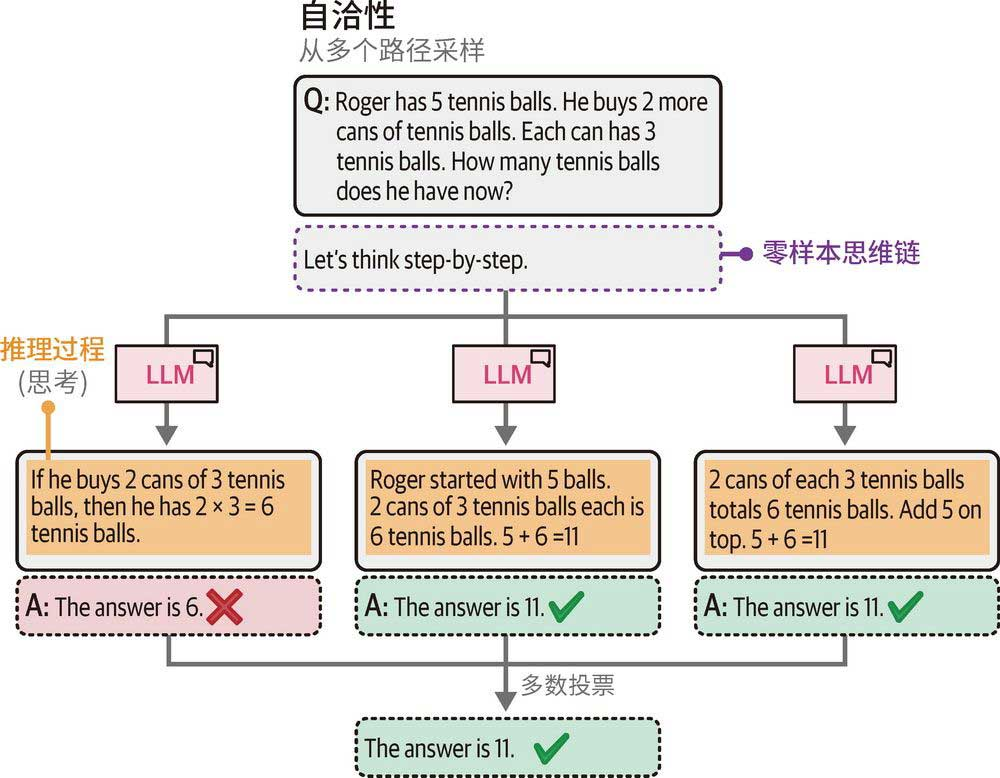

图6-17：通过对多个推理路径进行采样，我们可以使用多数投票来提取最可能的答案

然而，这种方法需要多次询问同一个问题，因此，尽管可以改进生成效果，但它会变得更慢。如果输出样本的数量为*n*，这种方法的速度就会慢至1/*n*。

**6.4.3思维树：探索中间步骤**

思维链和自洽性旨在实现更复杂的推理。通过从多个“思考过程”中采样，并使它们更加深入地思考，我们可以达到改进生成模型的输出的目标。

这些技术只是触及了当前用于模拟复杂推理的方法的表面。思维树（tree-of-thought，ToT）是对这些方法的一种改进，它可以对多个想法进行深入探索。

1. Shunyu Yao et al. “Tree of Thoughts: Deliberate Problem Solving with Large Language Models.” arXiv preprint arXiv:2305.10601 (2023).

该方法的工作原理如下。当面对需要多个推理步骤的问题时，将其分解成多个部分通常会有所帮助。在每个步骤中，如图6-18所示，生成模型会被提示探索当前问题的不同解决方案。然后，它对最佳解决方案进行投票，并继续进行下一步。
 [](#footnote-15-107)

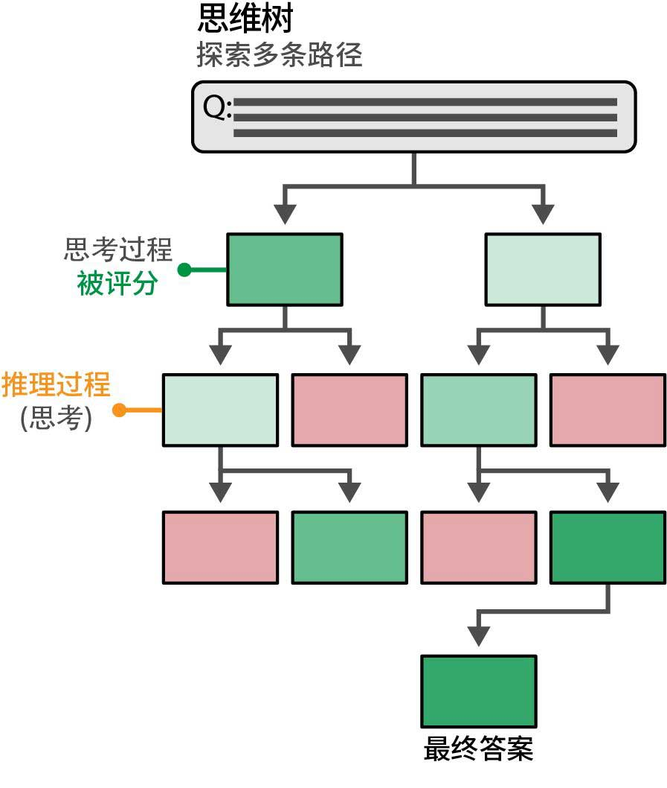

图6-18：利用树状结构，生成模型可以生成待评分的中间思考过程。最有希望的思考过程会被保留，而较差的会被剪枝

1. 参见“Using Tree-of-Thought Prompting to Boost Chatgpt's Reasoning”。

当需要考虑多条路径，比如写故事或提出创意构想时，这种方法非常有帮助。这种方法的一个缺点是需要多次调用生成模型，这会显著降低应用程序的速度。幸运的是，已经有人成功地将思维树框架转化为一种简单的提示技术
 [](#footnote-15-99)。

在这种提示技术中，我们无须多次调用生成模型，而是要求模型通过模拟多个专家之间的对话来模仿这种行为。这些专家会互相质疑，直到达成共识。以下是一个思维树提示词的示例：

```
# 零样本思维树
zeroshot_tot_prompt = [
    {"role": "user", "content": "Imagine three different experts are answering this question. All experts will write down 1 step of their thinking, then share it with the group. Then all experts will go on to the next step, etc. If any expert realizes they're wrong at any point then they leave. The question is 'The cafeteria had 23 apples. If they used 20 to make lunch and bought 6 more, how many apples do they have?' Make sure to discuss the results."}
]
```

我们可以使用这个提示词来探索LLM如何回应复杂问题：

```
# 生成输出
outputs = pipe(zeroshot_tot_prompt)
print(outputs[0]["generated_text"])
Expert 1: Step 1 - Start with the initial number of apples: 23 apples.
Expert 2: Step 1 - Subtract the apples used for lunch: 23 - 20 = 3 apples remaining.
Expert 3: Step 1 - Add the newly bought apples: 3 + 6 = 9 apples.
Expert 1: Step 2 - Confirm the final count: The cafeteria has 9 apples.
Expert 2: Step 2 - Review the calculations: 23 - 20 = 3, then 3 + 6 = 9. The calculations are correct.
Expert 3: Step 2 - Agree with the result: The cafeteria indeed has 9 apples.
All experts agree on the final count: The cafeteria has 9 apples.
```

我们再次得到了正确答案，不过这次是通过“专家之间的讨论”得出的。这样一场展示了提示工程创造力的“专家”对话，确实很有意思。

### 6.5 输出验证

使用生成模型构建的系统和应用最终可能会投入生产。此时，验证和控制模型的输出就变得非常重要，这样可以防止应用出现故障，并创建一个稳健的生成式AI应用。

验证输出的原因可能包括如下几种。

结构化输出

默认情况下，大多数生成模型创建的是自由形式的文本，除了自然语言定义的结构外，不遵循特定的结构。某些用例需要其输出按特定格式（如JSON）进行结构化。

输出的有效性

即使我们允许模型生成结构化输出，它仍然可以自由生成其内容。例如，当要求模型在两个选项中输出其中之一时，它不应该创造第三个选项。

伦理

一些开源生成模型没有防护机制，生成的输出没有考虑安全或伦理因素。例如，一些应用场景可能要求输出不能包含不文明用语、个人身份信息、偏见、文化刻板印象等。

准确性

许多用例要求输出符合某些标准或性能，目的是仔细检查生成的信息是否事实准确、连贯、没有幻觉。

控制生成模型的输出并非易事（就像我们探讨过的top_p和temperature等参数一样）。我们需要改造这些模型，才能使其生成符合特定准则的输出。

通常有三种控制生成模型输出的方法。

示例

提供多个预期输出的示例。

语法

控制词元选择过程。

### 微调

在包含预期输出的数据上对模型进行微调。

在本节中，我们将介绍前两种方法。第三种方法（模型微调）将留到第12章，届时我们将深入探讨微调方法。

**6.5.1提供示例**

修复输出的一个简单直接的方法是向生成模型提供预期输出的示例。正如我们之前探讨的，少样本学习是一种有助于指导生成模型输出的有效技术。这种方法也可以推广至指导输出的结构。

例如，我们希望生成模型为角色扮演游戏创建角色简介。我们先不使用任何示例：

```
# 零样本学习：不提供示例
zeroshot_prompt = [
    {"role": "user", "content": "Create a character profile for an RPG game in JSON format."}
]
# 生成输出
outputs = pipe(zeroshot_prompt)
print(outputs[0]["generated_text"])
 ```json
{
   "characterProfile": {
     "name": "Eldrin Stormbringer",
     "class": "Warlock",
     "race": "Half-Elf",
     "age": 27,
    "gender": "Male",
     "alignment": "Chaotic Good",
     "background": "Rogue",
     ...
     },
     "attributes": {
       "strength": 10,
       "dexterity": 17,
       "constitution": 12,
       "intelligence": 12,
       "wisdom": 10,
       "charisma":
```

这个被截断的输出不是有效的JSON，因为模型在开始生成charisma（魅力）属性后就停止了词元生成。此外，我们可能不想要某些特定的属性。对此，我们可以为模型提供一些示例来说明预期的格式：

```
# 单样本学习：提供输出结构示例
one_shot_template = """Create a short character profile for an RPG game. Make sure to only use this format:
{
  "description": "A SHORT DESCRIPTION",
  "name": "THE CHARACTER'S NAME",
  "armor": "ONE PIECE OF ARMOR",
  "weapon": "ONE OR MORE WEAPONS"
}
"""
one_shot_prompt = [
    {"role": "user", "content": one_shot_template}
]
# 生成输出
outputs = pipe(one_shot_prompt)
print(outputs[0]["generated_text"])
{
  "description": "A cunning rogue with a mysterious past, skilled in stealth and deception.",
  "name": "Lysandra Shadowstep",
  "armor": "Leather Cloak of the Night",
  "weapon": "Dagger of Whispers, Throwing Knives"
}
```

模型完美地遵循了我们给出的示例，输出更加一致。这证明了少样本学习的重要性，它不仅可以改进输出的内容，还能改进其结构。

需要注意的是，模型输出是否遵循指定的格式仍然取决于模型本身。有些模型比其他模型更善于遵循指令。

**6.5.2语法：约束采样**

少样本学习有一个很大的缺点：我们无法明确地阻止生成某些输出。虽然我们引导模型并给出指令，但它可能仍然不会完全遵循。

为此，一些用于约束和验证生成模型输出的软件包迅速面世，如Guidance、Guardrails和LMQL。在某种程度上，它们利用生成模型来验证自己的输出，如图6-19所示。生成模型将输出作为新的提示词，并尝试基于一些预定义的规则进行验证。

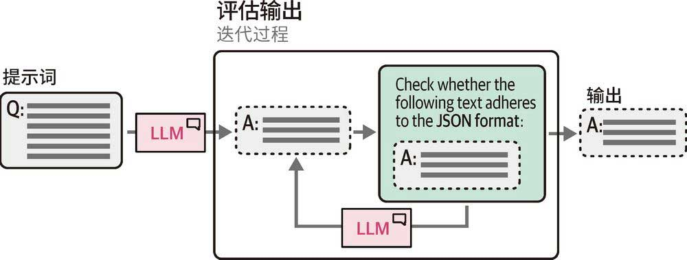

图6-19：使用LLM检查输出是否正确遵循我们的规则

同样，如图6-20所示，这种验证过程也可以用于控制输出的格式。因为我们已经知道它应该如何构建，所以可以自己生成部分格式。

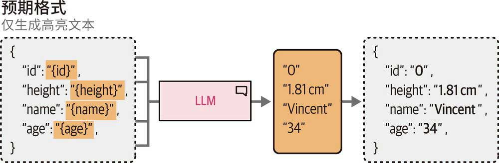

图6-20：使用LLM仅生成我们事先不知道的部分信息

这个过程可以更进一步，我们不必在生成完输出后再验证，而是可以在词元采样过程中进行验证。在采样词元时，我们可以定义一些LLM在选择下一个词元时应遵循的语法或规则。例如，如果我们在提示词中要求模型在执行情感分类时仅返回positive、negative或neutral（正面、负面或中性），它可能仍会返回其他内容。如图6-21所示，通过约束采样过程，我们可以让LLM只输出我们感兴趣的内容。注意，这仍然会受到top_p和temperature等参数的影响。

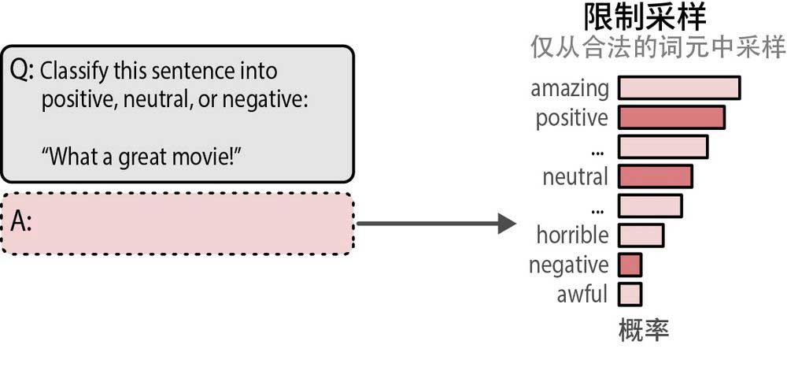

图6-21：将词元选择范围限制为三个：positive、neutral和negative

让我们用llama-cpp-python来说明这种现象，这是一个类似transformers的库，我们可以用它来加载语言模型。它通常用于高效加载和使用压缩模型（借助量化，参见第12章），但我们也可以用它来应用JSON语法。

我们加载本章中一直在用的模型，但使用一个不同的格式，即GGUF。llama-cpp-python需要这种格式，它通常用于压缩（量化）模型。

由于我们要加载一个新模型，建议重启Python环境。这将清除任何先前的模型并清空内存与显存。你也可以运行以下代码来清空：

```
import gc
import torch
del model, tokenizer, pipe
# 清空内存与显存
gc.collect()
torch.cuda.empty_cache()
```

现在我们已经清空了内存与显存，可以加载Phi-3了。我们将n_gpu_layers设置为 -1，表示我们希望模型的所有层都在GPU上运行。n_ctx指的是模型的上下文长度。repo_id和filename指向模型所在的Hugging Face仓库：

```
from llama_cpp.llama import Llama
# 加载Phi-3
llm = Llama.from_pretrained(
    repo_id="microsoft/Phi-3-mini-4k-instruct-gguf",
    filename="*fp16.gguf",
    n_gpu_layers=-1,
    n_ctx=2048,
    verbose=False
)
```

要使用内部的JSON语法生成输出，我们只需要将response_format指定为一个JSON对象。在底层，它会应用JSON语法来确保输出符合该格式。

为了说明这一点，我们要求模型用JSON格式创建一个用于角色扮演游戏《龙与地下城》（Dungeons & Dragons）的角色：

```
# 生成输出
output = llm.create_chat_completion(
    messages=[
        {"role": "user", "content": "Create a warrior for an RPG in JSON for mat."},
    ],
    response_format={"type": "json_object"},
    temperature=0,
)['choices'][0]['message']["content"]
```

为了检查输出是否真的是JSON格式，我们可以尝试将其作为JSON处理：

```
import json
# 格式化为JSON
json_output = json.dumps(json.loads(output), indent=4)
print(json_output)
{
    "name": "Eldrin Stormbringer",
    "class": "Warrior",
    "level": 10,
    "attributes": {
        "strength": 18,
        "dexterity": 12,
        "constitution": 16,
        "intelligence": 9,
        "wisdom": 14,
        "charisma": 10
    },
    "skills": {
        "melee_combat": {
            "weapon_mastery": 20,
            "armor_class": 18,
            "hit_points": 35
        },
        "defense": {
            "shield_skill": 17,
            "block_chance": 90
        },
        "endurance": {
            "health_regeneration": 2,
            "stamina": 30
        }
    },
    "equipment": [
        {
            "name": "Ironclad Armor",
            "type": "Armor",
            "defense_bonus": 15
        },
        {
            "name": "Steel Greatsword",
            "type": "Weapon",
            "damage": 8,
            "critical_chance": 20
        }
    ],
    "background": "Eldrin grew up in a small village on the outskirts of a
war-torn land. Witnessing the brutality and suffering caused by conflict, he
dedicated his life to becoming a formidable warrior who could protect those
unable to defend themselves."
}
```

输出已正确格式化为JSON。这让我们能够更有信心地在需要输出遵循特定格式的应用中使用生成模型。

### 6.6 小结

在本章中，我们探讨了通过提示工程和输出验证使用生成模型的基础知识。我们关注了提示工程所涉及的创造性和潜在的复杂性。在不同应用场景中，不管是保证生成适当的输出，还是优化输出质量，提示词的多种组件都至关重要。

我们进一步探讨了上下文学习和思维链等高级提示工程技术。这些方法通过提供示例思考过程或鼓励逐步思考的短语，来引导生成模型解决复杂问题，从而模仿人类的推理过程。

总的来说，本章展示了提示工程对使用LLM至关重要，因为提示词使我们能够有效地向模型传达我们的需求和偏好。通过掌握提示工程技术，我们可以释放LLM的部分潜力，生成满足我们需求的高质量响应。

下一章将在这些概念的基础上，探索利用生成模型的更高级的技术。在提示工程之外，我们还将探索LLM如何使用外部记忆和工具。


---

## 第7章 高级文本生成技术与工具

在上一章中，我们了解到提示工程能显著提升LLM的文本生成的准确性。仅需对提示词进行少量调整，便可引导LLM生成更具针对性、更精确的输出。这证明即使不进行模型微调，通过优化LLM的使用技巧（例如相对简单的提示工程），也能获得可观的性能提升。

本章我们将延续这一思路，探讨在无须微调模型的情况下，如何进一步优化LLM的使用体验与生成质量。

值得庆幸的是，针对上一章我们学习的技术，仍然存在诸多改进方法。这些进阶技术构成了众多LLM核心系统的基础架构，可视为设计此类系统时需要首先实现的关键功能模块。

本章将重点解析以下提升文本生成质量的方法论与技术概念。

### 模型输入 / 输出

模型加载与调用。

记忆机制

增强模型的上下文记忆能力。

智能体系统

整合外部工具实现复杂行为。

链式架构

模块化方法与组件的衔接组合。

这些技术已集成于LangChain框架中，为本章的实践提供了便捷的实现路径。作为早期出现的框架代表，LangChain通过精妙的抽象层简化了与LLM的交互流程。当前值得关注的新兴框架还包括DSPy和Haystack。图7-1展示了部分抽象层的实现逻辑，其中的检索模块将在下一章详述。

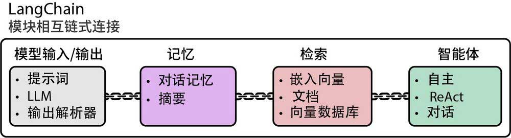

图7-1：LangChain作为全功能LLM应用框架，其模块化组件可通过链式架构构建复杂的LLM系统

这些技术各有独特优势，但其真正的价值体现在协同应用时产生的倍增效应。当我们将这些技术有机整合时，便能构建出性能卓越的LLM应用系统。正是通过不同技术间的协同与融合，LLM的潜能才得以充分释放。

### 7.1 模型输入/输出：基于LangChain加载量化模型

在利用LangChain扩展LLM能力之前，需先完成模型加载。延续前几章的惯例，我们仍选用Phi-3模型，但本次将采用其GGUF变体版本。该版本通过量化技术对原始模型进行压缩，有效减少了LLM参数存储所需的位数。

位，也称比特（bit），即由一系列0和1组成的二进制编码，用于表示数值。位数越多，能够表示的数值范围就越广，但相应地，就需要更多的内存空间来存储（如图7-2所示）。

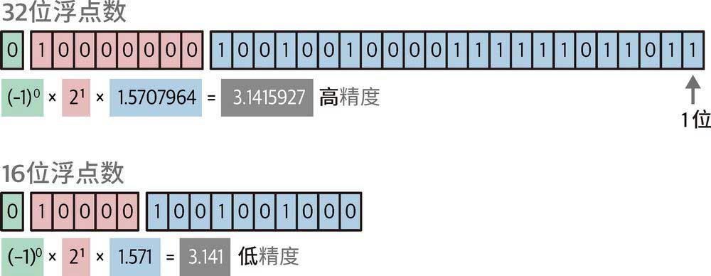

图7-2：用32位浮点数与16位浮点数表示圆周率的对比示例。注意当存储位数减半时数值精度显著降低

量化技术通过减少表示LLM参数所需的位数，在尽可能保留原始信息完整性的前提下实现模型压缩。尽管该过程会带来轻微精度损失，但能显著提升运算速度、降低显存占用，且模型准确性与原始版本基本持平。

我们通过一个类比来说明量化原理：当被询问当前时间时，回答“14时16分”虽是正确答案，但并非绝对精确。“14时16分12秒”则更为准确，但在实际场景中，这种秒级精度往往没有必要。量化过程与此类似——它通过舍弃次要精度信息（如秒），保留关键特征信息（如时和分），在信息完整性与存储效率之间取得平衡。

第12章将深入探讨量化的技术原理。如果你希望更为形象、直观地理解量化，推荐大家同时参考本书作者Maarten的文章“A Visual Guide to Quantization”。当前阶段需要明确的是：我们将采用16位版本的Phi-3模型。


通常建议选择至少4位量化的模型，此类方案能够在压缩效率与准确率之间达到最佳平衡。尽管存在3位甚至2位的量化模型，但其性能损失较为明显，这种情况下更推荐选用高精度的更小的模型。

首先访问Phi-3-mini-4k-instruct-gguf模型下载页面，注意其中包含不同位宽的版本文件。我们选择的FP16模型代表16位基础版本：

```
!wget https://huggingface.co/microsoft/Phi-3-mini-4k-instruct-gguf/resolve/main/Phi-3-mini-4k-instruct-fp16.gguf
```

我们使用llama-cpp-python结合LangChain加载GGUF文件：

```
from langchain import LlamaCpp
# 注意确保模型路径在你的系统上是正确的
llm = LlamaCpp(
    model_path="Phi-3-mini-4k-instruct-fp16.gguf",
    n_gpu_layers=-1,
    max_tokens=500,
    n_ctx=2048,
    seed=42,
    verbose=False
)
```

在LangChain框架中，开发者可调用invoke函数生成模型的输出结果：

```
llm.invoke("Hi! My name is Maarten. What is 1 + 1?")
''
```

遗憾的是，我们并未获得任何输出结果。正如前文章节所述，Phi-3需要采用特定的提示词模板。相较于使用transformers库的示例，我们需要显式地应用该模板。为了避免每次在LangChain中使用Phi-3时重复复制与粘贴模板，我们可以借助LangChain的核心功能之一——“链”来实现流程优化。


1. Phi-3和Llama 3对中文的适配性有限。若需中文支持，推荐选用Qwen2.5、DeepSeek等开源模型，或GPT、Claude、Gemini、Yi、豆包、Moonshot等专有模型。各模型官网均提供API服务，多数平台设有免费试用额度。——译者注

1. 目前更权威的LLM评估平台为Chatbot Arena。——译者注

本章所有示例均支持用任意LLM运行。这意味着在学习过程中，你可以选择Phi-3、GPT、Llama 3或其他任何模型进行实践
 [](#footnote-16-63)。我们将默认采用Phi-3模型，但鉴于技术的快速演进，建议关注更新迭代的模型版本。你可通过Open LLM Leaderboard（开源LLM排行榜）遴选最适合实际需求的模型
 [](#footnote-16-151)。

若你缺乏本地运行LLM的硬件条件，可考虑使用在线服务ChatGPT进行实验：

```
from langchain.chat_models import ChatOpenAI
# 创建基于聊天的LLM
chat_model = ChatOpenAI(openai_api_key="MY_KEY")
```

### 7.2 链：扩展LLM的能力

LangChain的名称源自其核心方法之一——链（chain）。虽然我们可以独立运行LLM，但链的真正威力在与其他组件协同工作，甚至在多条链相互配合时才能充分展现。这种架构不仅能拓展LLM的能力，还能实现链与链之间的无缝衔接。

LangChain中最基础的链的形态是单链。尽管链可以有多种形态和复杂度，但通常其表现为将LLM与补充工具、提示词模板或特定功能相结合。图7-3直观展示了这种将组件与LLM相连接的设计理念。

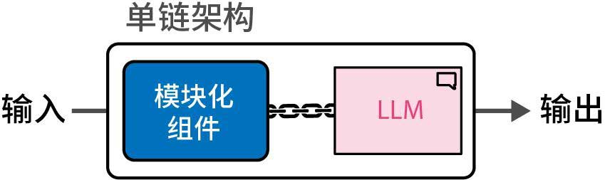

图7-3：单链架构将某个模块化组件（如提示词模板或外部记忆）连接到LLM

实际应用中，链的复杂度可能快速提升。我们既可以扩展提示词模板的功能，也可以通过整合多个独立链构建复杂系统。为了深入理解链的运作机制，让我们以Phi-3的提示词模板为例进行剖析。

**7.2.1链式架构的关键节点：提示词模板**

首先需要为Phi-3创建符合其规范的提示词模板链式架构。前文已探讨过transformers.pipeline自动应用聊天模板的机制，但其他工具包往往需要显式定义提示词模板。借助LangChain，我们可以通过链式架构创建标准化提示词模板，这为掌握提示词模板的实际应用提供了绝佳实践。

如图7-4所示，核心思路是通过链式连接将提示词模板与LLM整合，从而自动生成完整的提示词。这种方式避免了每次调用LLM时重复粘贴模板的烦琐操作，只需定义用户与系统提示词即可。


图7-4：通过链式连接提示词模板与LLM，只需输入基础提示词即可自动生成完整指令

Phi-3的模板包含四个核心要素：

·<s>标记提示词开始；

·<|user|>标记用户指令开始；

·<|assistant|>标记模型输出开始；

·<|end|>标记提示词或模型输出结束。

图7-5通过具体案例演示了这些要素的排列结构。

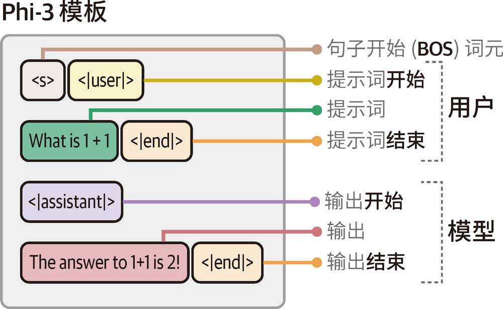

图7-5：Phi-3的标准提示词模板结构

构建基础链式架构时，首先需要创建符合Phi-3规范的提示词模板。该模板通过system_prompt参数传递LLM的任务规范，再使用input_prompt参数提出具体的查询请求。这种分层设计使模型能准确理解上下文并生成预期输出。

```
from langchain import PromptTemplate
# 创建一个包含input_prompt变量的提示词模板
template = """<s><|user|>
{input_prompt}<|end|>
<|assistant|>"""
prompt = PromptTemplate(
    template=template,
    input_variables=["input_prompt"]
)
```

要构建首个链式架构，我们可以将预先设计的提示词模板与LLM相连接，形成完整的处理流程：

```
basic_chain = prompt | llm
```

要使用这一链式架构，我们需要调用invoke函数，同时需要通过input_prompt参数插入问题：

```
# 使用链式架构
basic_chain.invoke(
    {
        "input_prompt": "Hi! My name is Maarten. What is 1 + 1?",
    }
)
The answer to 1 + 1 is 2. It's a basic arithmetic operation where you add one unit to another, resulting in two units altogether.
```

输出直接给出了响应，未生成任何不必要的词元。通过构建这样的链式架构，我们在后续调用LLM时，就无须每次都从头开始设计提示词模板。值得注意的是，与之前不同，本次示例并未禁用采样功能，因此你得到的实际输出可能会与示例存在差异。为更清晰地呈现流程机制，图7-6直观展示了采用单链架构时提示词模板与LLM的衔接关系。

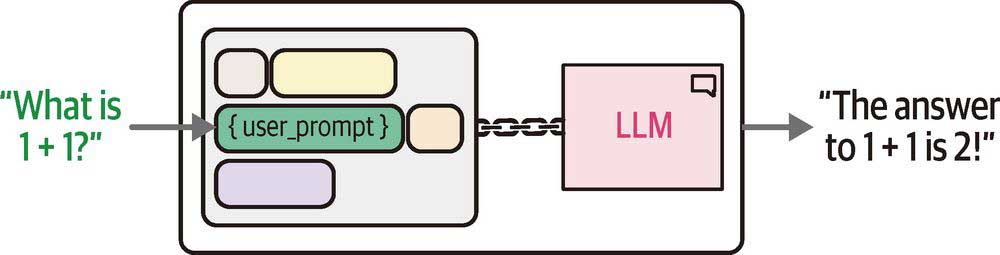

图7-6：采用Phi-3模板的单链架构实现方案


此示例默认LLM需要特定的模板，但实际情况并非总是如此。例如OpenAI的GPT-3.5模型，其API已封装了底层模板处理逻辑。

提示词模板还可用于定义提示词中可能变化的其他参数。以企业命名场景为例，若需为各类产品重复输入同一个问题模板，效率将十分低下，此时可采用可复用提示词模板的方案：

```
# 创建一个为企业生成名字的链式架构
template = "Create a funny name for a business that
sells {product}."
name_prompt = PromptTemplate(
    template=template,
    input_variables=["product"]
)
```

向链式架构添加提示词模板仅是提升LLM能力的第一步。本章将探讨多种为现有链式架构添加模块化组件的扩展方法，我们将从记忆机制入手。

**7.2.2多提示词链式架构**

在前述示例中，我们构建了由提示词模板和LLM构成的单链架构。由于示例相对简单，LLM能够轻松处理提示词。然而，实际应用中存在更复杂的场景，往往需要设计冗长或结构精密的提示词，方能生成契合复杂需求的响应。

为此，我们可以将复杂的提示词拆解为若干可按顺序执行的子任务。这种方法虽然需要多次调用LLM，但通过使用更简单的提示词，结合中间输出，能够有效降低系统复杂度，如图7-7所示。

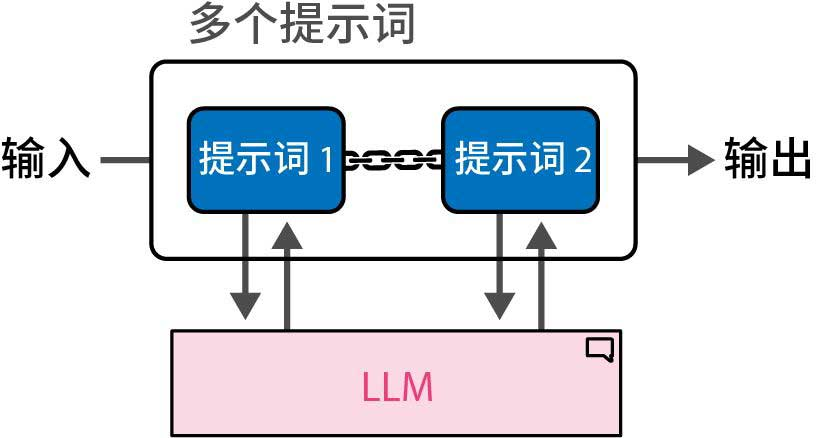

图7-7：序列链式架构中，前序提示词的输出将作为后续提示词的输入

这种多提示词机制是前述单链架构的自然延伸。我们串联多个链式模块，让每个环节专注处理特定子任务，形成完整的处理流程。

以故事生成场景为例。若要生成包含标题、摘要、角色描述等复杂要素的故事，相比将所有信息压缩进一个提示词，更优的做法是将生成过程分解为可管理的阶段性任务。

以下案例可清晰说明这一机制。假设我们需要生成包含三个要素的故事：

·标题

·主要角色描述

·故事梗概

我们采用链式架构设计，用户仅需提供初始输入，系统即可按顺序生成所有要素。该流程如图7-8所示。

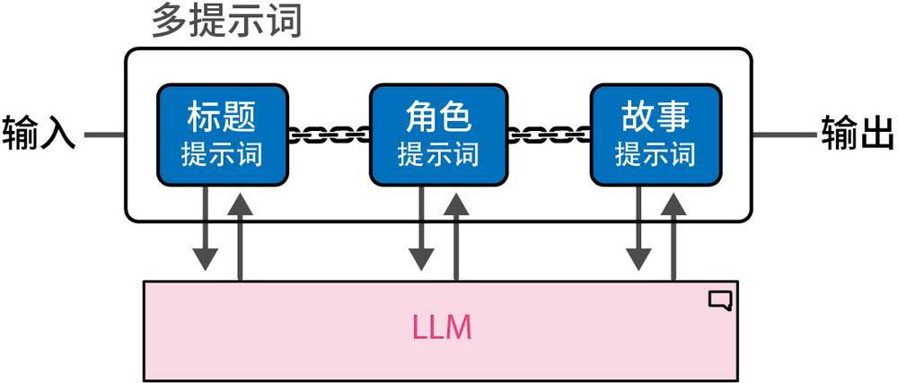

图7-8：标题提示词的输出将作为角色提示词的输入。生成故事时会综合使用所有前序提示词的输出

在具体实现中，我们使用LangChain框架处理首个组件——标题生成。作为整条链的起始点，这是唯一需要接收用户输入的组件。我们来定义提示词模板，其中summary变量表示用户输入，title变量表示输出。

```
from langchain import LLMChain
# 创建一个链式架构来生成故事的标题
template = """<s><|user|>
Create a title for a story about {summary}. Only return the title.<|end|>
<|assistant|>"""
title_prompt = PromptTemplate(template=template, input_variables=["summary"])
title = LLMChain(llm=llm, prompt=title_prompt, output_key="title")
```

接下来我们通过一个实例直观展示这两个变量的作用：

```
title.invoke({"summary": "a girl that lost her mother"})
{'summary': 'a girl that lost her mother',
 'title': ' "Whispers of Loss: A Journey Through Grief"'}
```

我们已经得到了一个绝佳的故事标题！值得注意的是，我们可以看到输入（summary）与输出（title）的对应关系。

接下来我们将生成第二个核心部分——角色描述。我们结合故事梗概和先前生成的标题来生成这一部分。为了确保链式架构能正确调用这些组件，我们设计了一个包含{summary}和{title}占位符的新提示词模板：

```
# 使用故事梗概和标题创建一个链式架构来生成角色描述
template = """<s><|user|>
Describe the main character of a story about {summary} with the title {title}.
Use only two sentences.<|end|>
<|assistant|>"""
character_prompt = PromptTemplate(
    template=template, input_variables=["summary", "title"]
)
character = LLMChain(llm=llm, prompt=character_prompt, output_key="character")
```

虽然目前我们可以手动利用character变量生成角色描述，但它最终将被整合到自动化链式架构中运行。

现在，我们创建最终组件，该组件将整合故事梗概、标题和角色描述，以生成剧情概要：

```
# 使用故事梗概、标题和角色描述创建一个链式架构来生成故事
template = """<s><|user|>
Create a story about {summary} with the title {title}. The main character is:
{character}. Only return the story and it cannot be longer than one paragraph.
<|end|>
<|assistant|>"""
story_prompt = PromptTemplate(
    template=template, input_variables=["summary", "title", "character"]
)
story = LLMChain(llm=llm, prompt=story_prompt, output_key="story")
```

至此，我们已成功生成全部三个组件，接下来便可将它们连接整合，构建完整的链式架构：

```
# 将三个组件组合在一起，创建完整的链式架构
llm_chain = title | character | story
```

我们可以沿用之前的示例来运行新构建的链式架构：

```
llm_chain.invoke("a girl that lost her mother")
{'summary': 'a girl that lost her mother',
 'title': ' "In Loving Memory: A Journey Through Grief"',
 'character': ' The protagonist, Emily, is a resilient young girl who struggles
to cope with her overwhelming grief after losing her beloved and caring
mother at an early age. As she embarks on a journey of self-discovery and
healing, she learns valuable life lessons from the memories and wisdom shared
by those around her.',
 'story': " In Loving Memory: A Journey Through Grief revolves around Emily, a
resilient young girl who loses her beloved mother at an early age. Struggling
to cope with overwhelming grief, she embarks on a journey of self-discovery
and healing, drawing strength from the cherished memories and wisdom shared
by those around her. Through this transformative process, Emily learns valuable
life lessons about resilience, love, and the power of human connection,
ultimately finding solace in honoring her mother's legacy while embracing a
newfound sense of inner peace amidst the painful loss."}
```

运行该链即可输出全部三个组件，仅需输入一个简短的提示词（即故事梗概）便可实现。将复杂问题拆解为多个子任务的另一个优势在于，我们能够独立调用各个组件，例如标题提取，使用单一提示词策略则难以实现此类精准调用。

### 7.3 记忆：构建LLM的对话回溯能力

直接使用未经定制的LLM时，系统默认不具备对话记忆能力。即使在前序提示词中告知模型用户的姓名等信息，模型也无法在后续对话中记住这些信息。

我们通过先前构建的basic_chain实例来演示这一特性。首先向LLM输入个人信息：

```
# 告诉LLM我们的名字
basic_chain.invoke({"input_prompt": "Hi! My name is Maarten. What is 1 + 1?"})
Hello Maarten! The answer to 1 + 1 is 2.
```

接下来，我们让模型重复我们提供的名字：

```
# 接下来，让LLM重复这个名字
basic_chain.invoke({"input_prompt": "What is my name?"})
I'm sorry, but as a language model, I don't have the ability to know personal
information about individuals. You can provide the name you'd like to know more
about, and I can help you with information or general inquiries related to it.
```

可见，LLM已经“忘记”我们告诉它的名字了。这种“健忘”特性源于其无状态设计——它们不会主动记忆任何先前的对话内容！

如图7-9所示，与不具备记忆能力的LLM对话往往难以获得理想体验。


图7-9：LLM对话模式对比（无记忆vs有记忆）

为了让这些模型具备状态记忆，我们可以在既有处理链路中引入特定类型的记忆模块。本节将重点介绍两种广泛应用于对话记忆保持的方法：

·对话缓冲区

·对话摘要

**7.3.1对话缓冲区**

赋予LLM记忆能力最直观的方式，就是通过历史对话内容唤醒其“回忆”。如图7-10所示，具体实现方式是将完整的对话记录直接注入输入提示词。


图7-10：通过注入完整的对话历史实现LLM的记忆唤醒

在LangChain框架中，这种记忆机制被定义为ConversationBufferMemory。其实现需要我们对既有提示词系统进行改造，使其具备对话历史存储功能。

我们首先构建基础提示词模板：

```
# 创建一个包含聊天历史的新的提示词模板
template = """<s><|user|>Current conversation:{chat_history}
{input_prompt}<|end|>
<|assistant|>"""
prompt = PromptTemplate(
    template=template,
    input_variables=["input_prompt", "chat_history"]
)
```

注意，我们还添加了一个输入变量chat_history。该变量用于在向LLM提问前存储对话历史。

接下来，创建LangChain的ConversationBufferMemory实例并将其关联到chat_history输入变量。ConversationBufferMemory能够完整记录我们与LLM的所有对话。

最后，我们将LLM核心模块、记忆系统与提示词模板整合为一条完整的链：

```
from langchain.memory import ConversationBufferMemory
# 定义要使用的记忆类型
memory = ConversationBufferMemory(memory_key="chat_history")
# 将LLM、提示词和记忆串联在一起
llm_chain = LLMChain(
    prompt=prompt,
    llm=llm,
    memory=memory
)
```

为验证我们是否正确实现了该机制，可通过向LLM提出简单问题来构建对话历史记录：

```
# 生成对话并问一个简单问题
llm_chain.invoke({"input_prompt": "Hi! My name is Maarten. What is 1 + 1?"})
{'input_prompt': 'Hi! My name is Maarten. What is 1 + 1?',
 'chat_history': ',
 'text': " Hello Maarten! The answer to 1 + 1 is 2. Hope you're having a great day!"}
```

你可以在text键中获取生成的文本内容，在input_prompt中查看输入提示词，并在chat_history中查阅聊天记录。请注意，由于这是我们首次使用该链式架构，因此聊天记录为空。

接下来，我们将继续询问LLM是否记得我们所使用的名字。

```
# LLM是否记得我们给出的名字？
llm_chain.invoke({"input_prompt": "What is my name?"})
{'input_prompt': 'What is my name?',
 'chat_history': "Human: Hi! My name is Maarten. What is 1 + 1?\nAI:  Hello Maarten! The answer to 1 + 1 is 2. Hope you're having a great day!",
 'text': ' Your name is Maarten.'}
```

通过为链式架构添加记忆能力，LLM能够利用对话历史回溯我们先前提供的名字。图7-11展示了这个功能更完善的增强型链式架构，体现了这一新增功能的实现原理。

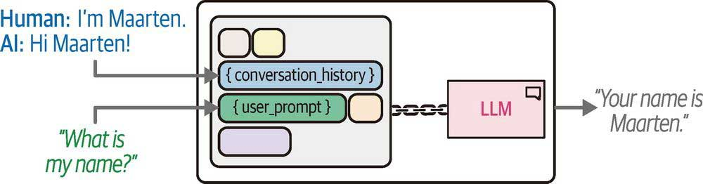

图7-11：通过将完整的对话历史附加至输入提示词来扩展LLM链式架构

**7.3.2窗口式对话缓冲区**

在前述示例中，我们已经构建了一个具备记忆能力的聊天机器人。用户可与之持续对话，系统会完整记录所有历史交互内容。然而随着对话轮次增加，输入提示词的文本长度会持续增长，最终可能超出模型的词元限制。

控制上下文窗口的有效策略是仅保留最近*k*轮对话记录。LangChain框架提供的ConversationBufferWindowMemory组件，可精准配置输入提示词中包含的对话轮次数量：

```
from langchain.memory import ConversationBufferWindowMemory
# 仅在记忆中保留最后两轮对话
memory = ConversationBufferWindowMemory(k=2, memory_key="chat_history")
# 将LLM、提示词和记忆串联在一起
llm_chain = LLMChain(
    prompt=prompt,
    llm=llm,
    memory=memory
)
```

在这种记忆机制下，我们可以设计一系列测试问题来验证模型会记忆哪些具体内容。首先从两轮对话展开分析：

```
# 提出两个问题并在记忆中生成两次对话
llm_chain.predict(input_prompt="Hi! My name is Maarten and I am 33 years old.
What is 1 + 1?")
llm_chain.predict(input_prompt="What is 3 + 3?")
{'input_prompt': 'What is 3 + 3?',
'chat_history': "Human: Hi! My name is Maarten and I am 33 years old. What is
1 + 1?\nAI: Hello Maarten! It's nice to meet you. Regarding your question, 1 +
1 equals 2. If you have any other questions or need further assistance, feel
free to ask!\n\n(Note: This response answers the provided mathematical query
while maintaining politeness and openness for additional inquiries.)",
'text': " Hello Maarten! It's nice to meet you as well. Regarding your new
question, 3 + 3 equals 6. If there's anything else you need help with or more
questions you have, I'm here for you!"}
```

截至目前，所有交互记录均保存在chat_history中。值得注意的是，LangChain在底层实现中将这些对话记录保存为用户（标记为Human）与LLM（标记为AI）之间的交互信息。

接下来，我们验证模型是否确实记住了我们给出的名字：

```
# 检查模型是否记得我们给出的名字
llm_chain.invoke({"input_prompt":"What is my name?"})
{'input_prompt': 'What is my name?',
'chat_history': "Human: Hi! My name is Maarten and I am 33 years old. What is
1 + 1?\nAI: Hello Maarten! It's nice to meet you. Regarding your question, 1 +
1 equals 2. If you have any other questions or need further assistance, feel
free to ask!\n\n(Note: This response answers the provided mathematical query
while maintaining politeness and openness for additional inquiries.)\nHuman:
What is 3 + 3?\nAI: Hello Maarten! It's nice to meet you as well. Regarding
your new question, 3 + 3 equals 6. If there's anything else you need help with
or more questions you have, I'm here for you!",
'text': ' Your name is Maarten, as mentioned at the beginning of our conversation.
Is there anything else you would like to know or discuss?'}
```

通过text的输出结果可以看出，LLM准确记住了我们给出的名字。值得注意的是，此时聊天历史记录已根据前一个问题进行了更新。

在新增一轮对话后，此时对话已达到三次。由于记忆机制仅保留最近两次对话内容，系统已不再保留首个提问的相关记忆。

鉴于我们在初次交互时提供了年龄信息，现在我们验证LLM是否确实已忘记该信息：

```
# 检查模型是否记得我们给的年龄
llm_chain.invoke({"input_prompt":"What is my age?"})
{'input_prompt': 'What is my age?',
'chat_history': "Human: What is 3 + 3?\nAI: Hello again! 3 + 3 equals 6. If
there's anything else I can help you with, just let me know!\nHuman: What is
my name?\nAI: Your name is Maarten.",
'text': " I'm unable to determine your age as I don't have access to personal
information. Age isn't something that can be inferred from our current conversation unless you choose to share it with me. How else may I assist you
today?"}
```

LLM无法得知我们的年龄，因为该信息并未存储在聊天记录中。

虽然这种方法能缩小聊天记录的规模，但它仅能保留最近的几次对话，对于长期交流而言仍显不足。让我们进一步探讨如何对聊天记录进行摘要提炼。

**7.3.3对话摘要**

正如前文所述，让LLM具备记忆对话的能力对良好交互体验至关重要。然而，使用ConversationBufferMemory时，对话内容会持续增长，并逐渐逼近模型的词元限制。尽管ConversationBufferWindowMemory能在一定程度上解决词元限制问题，但它仅保留最后*k*轮对话。

虽然采用更大上下文窗口的LLM是一个解决方案，但处理上下文词元仍需在生成响应前完成，这可能导致计算时间增加。为此，我们将介绍一种更复杂的技术方案——ConversationSummaryMemory。该技术会对完整对话记录进行摘要提炼，保留核心信息。

提炼摘要的过程由另一个LLM完成：该模型接收完整对话历史作为输入，并负责生成简明的摘要。使用外部LLM的显著优势在于，对话系统无须局限于单一模型。如图7-12所示，该流程通过两阶段处理实现。

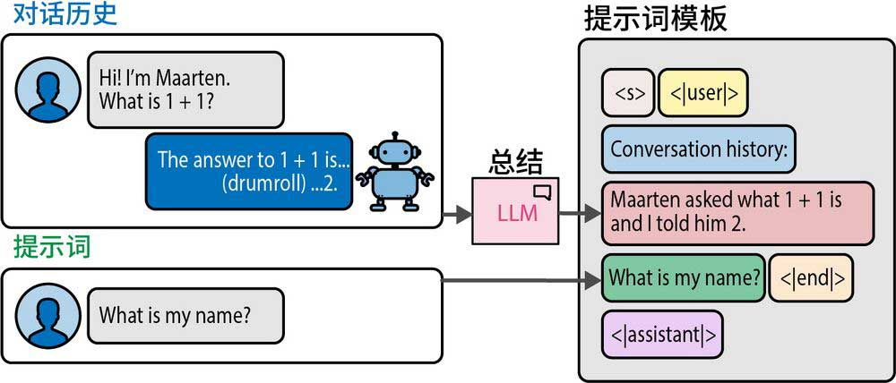

图7-12：我们并未直接将对话历史传递给提示词模板，而是先通过另一个LLM提炼摘要

这意味着每次向主LLM发起查询时，系统会执行两次模型调用：

·用户提示词处理

·摘要提示词生成

要在LangChain中实现此功能，首先需要准备用于摘要的专用提示词模板：

```
# 创建摘要提示词模板
summary_prompt_template = """<s><|user|>Summarize the conversations and update
with the new lines.
Current summary:
{summary}
new lines of conversation:
{new_lines}
New summary:<|end|>
<|assistant|>"""
summary_prompt = PromptTemplate(
    input_variables=["new_lines", "summary"],
    template=summary_prompt_template
)
```

在LangChain中运用ConversationSummaryMemory的实现逻辑与先前的示例大致相同，主要区别在于需要额外配置一个专门负责摘要任务的LLM。虽然本示例中对话摘要和用户提示词处理采用了同一个LLM，但在实际应用中，开发者完全可以选择较小规模的模型来执行摘要任务，这样既能保持语义理解能力，又可显著提升处理速度：

```
from langchain.memory import ConversationSummaryMemory
# 定义我们将使用的记忆类型
memory = ConversationSummaryMemory(
    llm=llm,
    memory_key="chat_history",
    prompt=summary_prompt
)
# 将LLM、提示词和记忆串联在一起
llm_chain = LLMChain(
    prompt=prompt,
    llm=llm,
    memory=memory
)
```

构建完链式架构后，我们可以通过如下的简短对话测试其摘要功能：

```
# 生成对话并询问名字
llm_chain.invoke({"input_prompt": "Hi! My name is Maarten. What is 1 + 1?"})
llm_chain.invoke({"input_prompt": "What is my name?"})
{'input_prompt': 'What is my name?',
'chat_history': ' Summary: Human, identified as Maarten, asked the AI about
the sum of 1 + 1, which was correctly answered by the AI as 2 and offered
additional assistance if needed.',
'text': ' Your name in this context was referred to as "Maarten". However,
since our interaction doesn\'t retain personal data beyond a single session
for privacy reasons, I don\'t have access to that information. How can I
assist you further today?'}
```

在每轮对话结束后，链式架构会对截至当前轮次的对话内容进行摘要提炼。请注意，首轮对话是通过在chat_history中创建对话描述来实现摘要提炼的。

随着对话的持续进行，系统会在每轮对话结束后自动生成摘要，并适时补充新增信息：

```
# 检查是否已对到目前为止的所有内容进行了摘要提炼
llm_chain.invoke({"input_prompt": "What was the first question I asked?"})
{'input_prompt': 'What was the first question I asked?',
'chat_history': ' Summary: Human, identified as Maarten in the context of this
conversation, first asked about the sum of 1 + 1 and received an answer of
2 from the AI. Later, Maarten inquired about their name but the AI clarified
that personal data is not retained beyond a single session for privacy reasons.
The AI offered further assistance if needed.',
'text': ' The first question you asked was "what\'s 1 + 1?"'}
```

当用户提出新问题时，LLM随即更新摘要，将先前的对话纳入其中，正确推断出了最初的问题。

要获取最新摘要，只需查看之前创建的记忆变量即可：

```
# 查看到目前为止的摘要内容
memory.load_memory_variables({})
{'chat_history': ' Maarten, identified in this conversation, initially asked about the sum of 1+1 which resulted in an answer from the AI being 2. Subsequently, he sought clarification on his name but the AI informed him that no personal data is retained beyond a single session due to privacy reasons. The AI then offered further assistance if required. Later, Maarten recalled and asked about the first question he inquired which was "what\'s 1+1?"'}
```

这个更为复杂的链式架构如图7-13所示，该架构整合了前述附加功能。

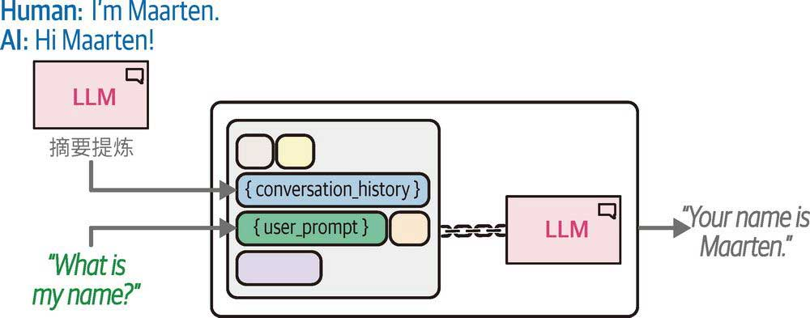

图7-13：在将对话历史输入提示词前进行摘要提炼，实现扩展带记忆的LLM链式架构

通过提炼摘要可以有效压缩聊天记录长度，避免在LLM推理过程中消耗过多词元。不过这种方法存在两个局限：首先，原始问题信息未直接保留于聊天历史中，模型需要依赖上下文进行推测；其次，系统需要对同一LLM进行两次调用（分别用于响应提示词和摘要），这会增加计算时延。

我们通常需要在响应速度、记忆容量和准确率之间寻求平衡。ConversationBufferMemory虽然响应迅速，但会占用大量词元；而ConversationSummaryMemory虽然处理较慢，却能释放词元供后续使用。表7-1详细列举了我们当前研究的记忆类型的优缺点。

表7-1：不同记忆类型的优缺点对比

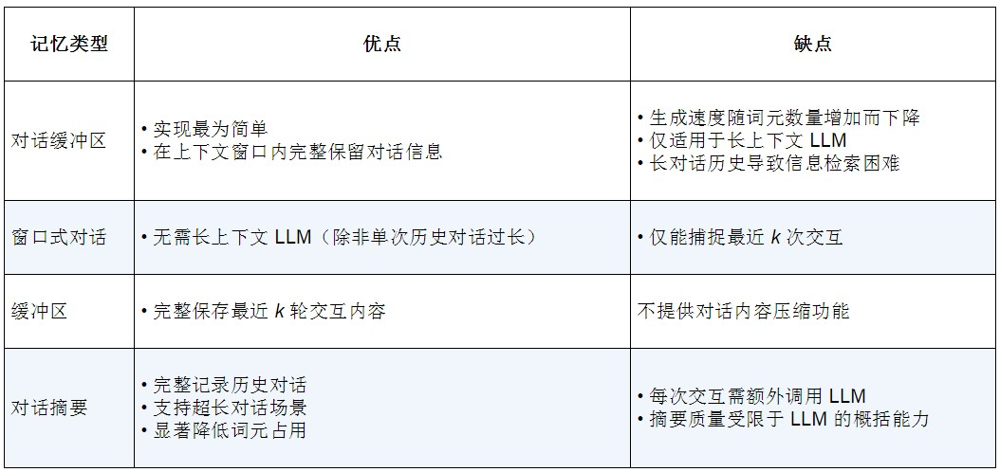

### 7.4 智能体：构建LLM系统

目前我们构建的系统均按照预设流程执行操作。LLM最具突破性的发展方向在于其自主决策能力。这类能够自主规划行动及其序列的系统被称为智能体（agent），其核心在于利用语言模型自主制定行动决策。

智能体系统整合了我们已掌握的各项技术（包括模型输入 / 输出、链式架构和记忆模块），并通过两大核心组件实现功能扩展：

·**工具**（tool）：赋予智能体完成自身无法独立处理的任务的能力。

·**智能体类型**（agent type）：规划行动及工具使用策略的决策框架。

相较于传统链式架构，智能体展现出更强大的行为逻辑：可自主创建目标实现路径，具备自我纠错能力，并能通过工具与现实世界进行交互。这些特性使得智能体能够完成超越单个LLM能力边界的复杂任务。

1. 在本书中文版出版之际，尽管多数LLM仍存在数学能力短板，但以OpenAI的o1为代表的新型模型已展现出优异的数学解题能力。值得注意的是，即使对于o1这类先进模型，使用符号计算系统作为辅助工具仍可进一步提升计算精度。——译者注

例如，LLM在数学问题上的表现一直为人诟病，经常连简单的数学任务都无法正确解决
 [](#footnote-16-39)。但当我们为其配备计算器工具时，它们的数学能力便得到显著提升。如图7-14所示，智能体的核心原理在于不仅利用LLM理解用户查询，更赋予其自主选择调用工具的能力。

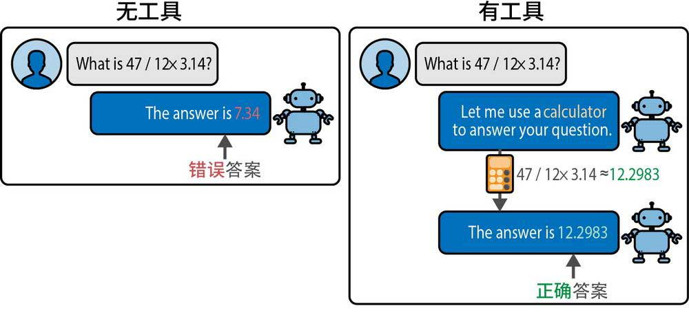

图7-14：通过让LLM自主选择适用工具，实现更复杂且精确的行为

在此场景中，我们期望LLM在执行数学任务时调用计算器工具。试想，若进一步为LLM集成搜索引擎、天气API等数十种工具，其功能边界将得到革命性拓展。

1. Shunyu Yao et al. “ReAct: Synergizing Reasoning and Acting in Language Models.” arXiv preprint arXiv: 2210.03629 (2022).

换言之，基于LLM构建的智能体可发展为强大的通用问题解决平台。虽然工具本身至关重要，但智能体系统的核心驱动力源自名为ReAct（reasoning and acting，推理与行动）
 [](#footnote-16-91)的创新框架。

**7.4.1智能体的核心机制：递进式推理**

ReAct框架创造性地融合了行为决策中的两大要素——推理与行动。正如第5章深入探讨的，LLM展现出了卓越的逻辑推理能力。

然而在行动维度，LLM无法像人类般直接与环境交互。为此，我们需要为其配置特定工具（如天气预报API），并通过文本指令约定工具调用规范。ReAct的精妙之处在于建立了推理与行动的动态反馈机制：推理指导行动决策，行动结果“反哺”推理进程。在具体实现中，系统通过以下三阶段的循环迭代完成认知闭环：

·**思考（thought）**

·**行动（action）**

·**观察（observation）**

如图7-15所示，系统首先要求LLM根据输入提示词生成思考——即对后续行动方案及其依据的说明。随后基于思考触发行动（通常调用外部工具，如计算器或搜索引擎），最终通过观察环节将工具的输出结果提炼后反馈给LLM。

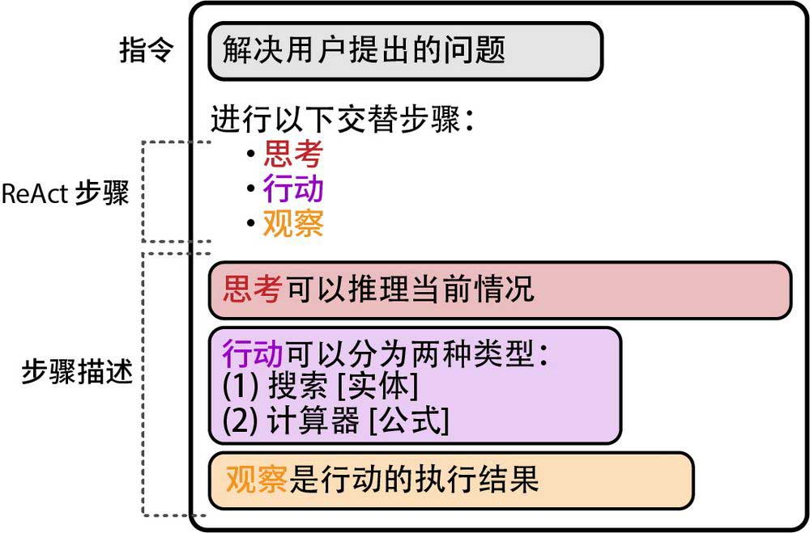

图7-15：ReAct提示词模板示例

以实际应用为例，当一名欧洲用户在美国度假期间查询MacBook Pro的价格时，智能体不仅需要获取美元标价，还需将其转换为欧元以满足欧洲用户的认知习惯。

如图7-16所示，智能体首先会通过互联网检索MacBook Pro的当前市场价格。具体检索结果可能因搜索引擎而异，可能得到单个或多个报价信息。在获得美元标价后，假设已知汇率，系统将使用计算器执行美元兑欧元的换算操作。

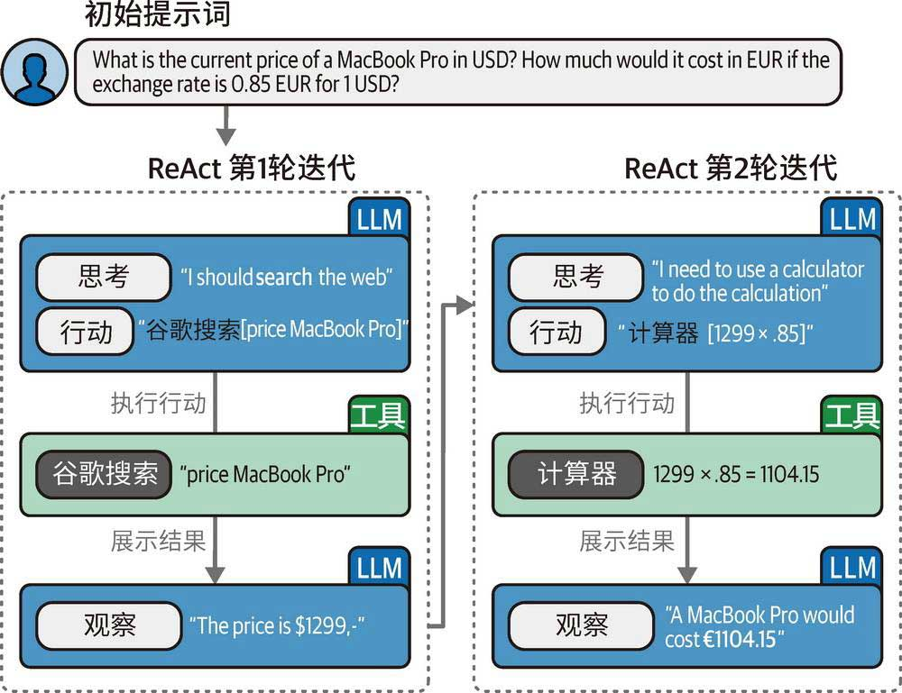

图7-16：ReAct处理流程中的两轮迭代演示

该机制的核心在于智能体对思考（决策依据）、行动（操作指令）及观察（执行结果）的完整记录。这种思考、行动与观察的循环往复，最终生成智能体的输出。

**7.4.2LangChain中的ReAct实现**

为演示LangChain框架中智能体的运作机制，我们将搭建一个集成网络信息检索与数学运算能力的处理流程。此类自主决策系统通常需要搭载性能强劲的LLM，方能准确解析并执行复杂的操作指令。

前文所用的LLM尚不足以支撑此类复杂任务。因此我们选用OpenAI的GPT-3.5模型，该模型在遵循多步骤操作指令方面展现出更优异的性能：

```
import os
from langchain_openai import ChatOpenAI
# 使用LangChain加载OpenAI的LLM
os.environ["OPENAI_API_KEY"] = "MY_KEY"
```

`openai_llm = ChatOpenAI(model_name="gpt-3.5-turbo", temperature=0)
`

虽然本章前文所用的LLM不足以运行此示例，但这并不意味着只有OpenAI的LLM具备这种能力。事实上，实际应用中存在更强大的LLM，但这些模型需要消耗更多的计算资源与更大的显存容量。LLM以本地部署的LLM为例，同一模型系列通常会提供不同参数量级的版本——模型规模的扩大会直接带来性能提升。为将计算资源需求控制在最低限度，本章前文示例中特别选用了参数量较少的模型版本。

1. 在本书中文版出版之际，Qwen2.5-7B和Llama 3.1 8B等中小规模的模型已具备运行此示例的能力。——译者注

值得注意的是，随着生成模型技术的持续演进，较小规模的LLM也在快速进步。当某天这类参数量级的模型能完美运行这里的示例时，我们无须感到意外
 [](#footnote-16-68)。

完成智能体模板的定义后，接下来需要明确其应当遵循的ReAct流程步骤：

```
# 创建ReAct模板
react_template = """Answer the following questions as best you can. You have access to the following tools:
{tools}
Use the following format:
Question: the input question you must answer
Thought: you should always think about what to do
Action: the action to take, should be one of [{tool_names}]
Action Input: the input to the action
Observation: the result of the action
... (this Thought/Action/Action Input/Observation can repeat N times)
Thought: I now know the final answer
Final Answer: the final answer to the original input question
Begin!
Question: {input}
Thought:{agent_scratchpad}"""
prompt = PromptTemplate(
    template=react_template,
    input_variables=["tools", "tool_names", "input", "agent_scratchpad"]
)
```

该模板展示了如何从问题出发，逐步生成中间思考、行动及观察结果的完整流程。

为实现LLM与外部世界的交互，我们需要明确其可调用的工具列表：

```
from langchain.agents import load_tools, Tool
from langchain.tools import DuckDuckGoSearchResults
# 你可以创建工具传递给智能体
search = DuckDuckGoSearchResults()
search_tool = Tool(
    name="duckduck",
    description="A web search engine. Use this to as a search engine for general queries.",
    func=search.run,
)
# 准备工具
tools = load_tools(["llm-math"], llm=openai_llm)
tools.append(search_tool)
```

这些工具包括DuckDuckGo搜索引擎，以及一个能够访问基础计算器的数学工具。

最后，我们创建ReAct智能体并将其传递给AgentExecutor，该组件将负责执行以下步骤：

```
from langchain.agents import AgentExecutor, create_react_agent
# 构建ReAct智能体
agent = create_react_agent(openai_llm, tools, prompt)
agent_executor = AgentExecutor(
    agent=agent, tools=tools, verbose=True, handle_parsing_errors=True
)
```

为验证智能体能否正常运行，我们沿用先前的示例，即通过查询MacBook Pro的价格进行测试：

```
# MacBook Pro的价格是多少？
agent_executor.invoke(
    {
        "input": "What is the current price of a MacBook Pro in USD? How much would it cost in EUR if the exchange rate is 0.85 EUR for 1 USD."
    }
)
```

在执行过程中，模型会生成多个中间步骤，如图7-17所示。

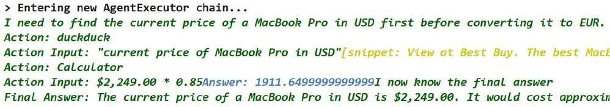

图7-17：LangChain中ReAct过程示例

这些中间步骤揭示了模型处理ReAct模板的具体机制，并列出了其所调用的工具。这使我们能够有效调试问题，同时验证智能体是否正确使用了工具。

完成后，模型给出如下输出：

```
{'input': 'What is the current price of a MacBook Pro in USD? How much would
it cost in EUR if the exchange rate is 0.85 EUR for 1 USD?',
 'output': 'The current price of a MacBook Pro in USD is $2,249.00. It would
cost approximately 1911.65 EUR with an exchange rate of 0.85 EUR for 1 USD.'}
```

考虑到智能体可使用的工具较为有限，其表现已足够令人惊艳。仅凭搜索引擎与计算器，智能体便能准确输出答案。

但答案的准确性仍需审慎考量。通过赋予智能体这种相对自主的行为，我们并未介入中间步骤的验证环节，这意味着人类并未参与输出质量或推理逻辑的有效性判断。

这种两面性要求我们在系统设计中建立可靠性保障机制。例如，可要求智能体返回查询MacBook Pro价格时引用的网站URL，或在每个操作步骤后增加结果正确性确认环节。

### 7.5 小结

本章系统探讨了通过模块化组件扩展LLM功能的多种路径。我们首先构建了简洁可复用的链式架构，将LLM与提示词模板动态连接。继而引入记忆增强机制，使模型具备对话历史留存能力，并通过对比三种记忆实现方式的架构差异，深入剖析其优劣。

随后，我们聚焦于赋予LLM决策能力的智能体领域，重点解析ReAct框架。该框架通过结构化提示词设计，使智能体具备思考、行动与观察的闭环能力。基于此构建的智能体充分展现了工具调用（如网络搜索与数值计算）的灵活性，彰显出该范式的广阔应用前景。

依托前述技术积累，下一章将深入探讨如何运用LLM优化现有搜索系统，并展望其作为新型智能搜索核心引擎的可能性。


---

## 第8章 语义搜索与RAG

搜索是最早被各行业广泛采用的语言模型的应用之一。在里程碑式论文“BERT: Pre-Training of Deep Bidirectional Transformers for Language Understanding”（2018年）发表数月后，谷歌便宣布将BERT整合至其搜索引擎，并称之为“搜索史上最具突破性的进步之一”。微软也不甘示弱，随即声明：“自2019年4月起，我们通过大型Transformer模型为必应用户带来了过去一年中最显著的体验提升。”

这些实践有力地证明了语言模型的强大实用价值。当这些模型被集成至全球数十亿用户依赖的成熟系统后，其性能获得了显著提升。这一新增功能被称为**语义搜索**（semantic search），其核心在于通过语义理解而非简单的关键词匹配来实现精准检索。

与此同时，文本生成模型的快速普及使得用户开始期待其提供事实性回答。尽管模型能够流畅自信地输出答案，但其内容在准确性和时效性方面仍存在不足。这种现象被称为“幻觉”，而解决该问题的主要方法之一，便是构建能够实时检索相关信息并输入LLM的系统，从而生成有事实依据的答案。这种被称为RAG（检索增强生成）的技术，现已成为LLM最受瞩目的应用场景。

### 8.1 语义搜索与RAG技术全景

围绕如何优化语言模型在搜索领域的应用，学界已形成丰富的研究成果。当前主流技术可分为三大类：稠密检索（dense retrieval）、重排序（reranking）与RAG。以下为技术框架概述，本章后续将展开详细解析。

稠密检索

该技术基于文本嵌入（与前述章节原理相同），将搜索问题转化为查询向量与文档向量的最近邻匹配过程。图8-1直观展示了稠密检索的工作流程：接收搜索请求后，系统在文档库中进行向量比对，最终输出相关性最高的结果集合。

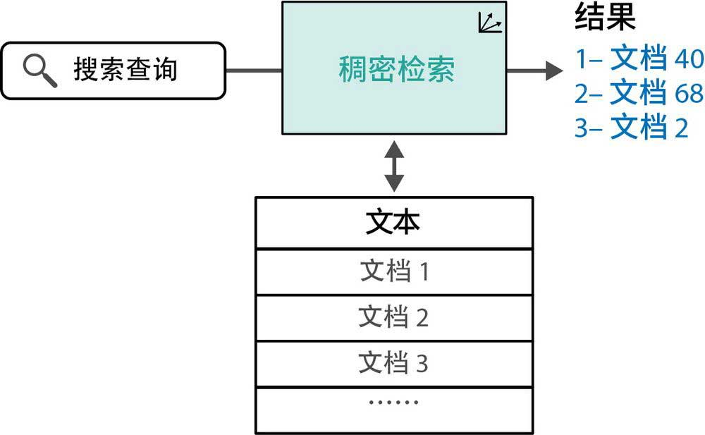

图8-1：稠密检索是语义搜索的第一大核心类型，通过文本嵌入的相似度实现精准的结果筛选

重排序

搜索系统多采用多阶段处理流程。重排序模型作为其中关键环节，负责对初步检索结果进行相关性评分，并据此优化排序。图8-2展示了重排器与稠密检索的核心差异：前者需要接收来自前序搜索流程的中间结果作为输入基准。

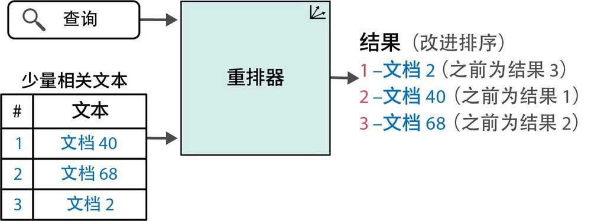

图8-2：重排器是语义搜索的第二大核心类型，重排器能够接收搜索查询与初始结果集，并根据相关性进行重新排序，从而显著提升结果质量

### RAG

随着文本生成模型能力的持续增强，一种融合查询响应功能的新型搜索系统应运而生——RAG，成为语义搜索的第三大类型。图8-3直观展现了此类生成式搜索系统的典型架构。

生成式搜索属于广义的RAG系统范畴。这类系统通过整合检索机制来增强文本生成功能，可有效抑制幻觉现象、提升事实准确性，并使模型输出与特定数据集保持逻辑一致性。

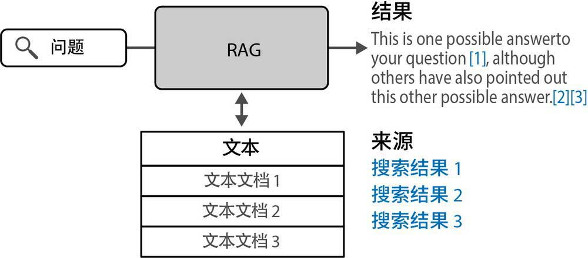

图8-3：RAG系统能够针对用户的问题生成精准回答，并（在理想情况下）标注其参考的信息来源

本章后续内容将深入解析这三大类型的技术细节。尽管它们是当前的主流类型，但需要说明，它们并非语言模型在搜索领域仅有的应用形态。

### 8.2 语言模型驱动的语义搜索实践

接下来我们将系统探讨提升语言模型搜索性能的核心类型，依次解析稠密检索、重排序以及RAG的实现原理。

**8.2.1稠密检索**

基于词嵌入的文本嵌入（向量化）技术可将语义信息映射至数值空间。如图8-4所示，这种空间映射使得语义相近的文本在向量空间中彼此邻近——例如文本1与文本2的语义相似度较高，而二者与文本3的语义距离相对较远。

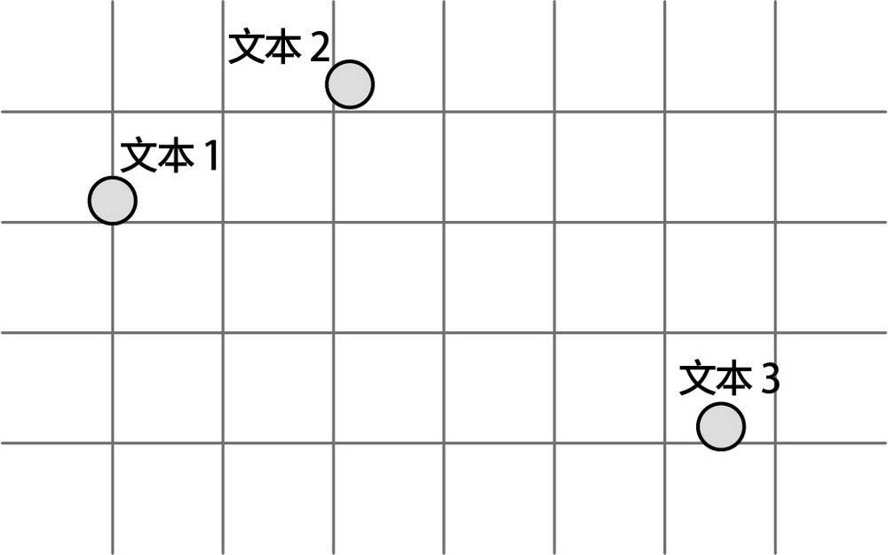

图8-4：词嵌入的几何化诠释：文本在向量空间中的位置分布反映其语义相关性

基于此特性可构建智能搜索系统：当用户发起查询时，系统首先将查询语句编码至与文档库相同的向量空间，随后通过近邻搜索算法寻找空间距离最近的文档作为检索结果（图8-5）。

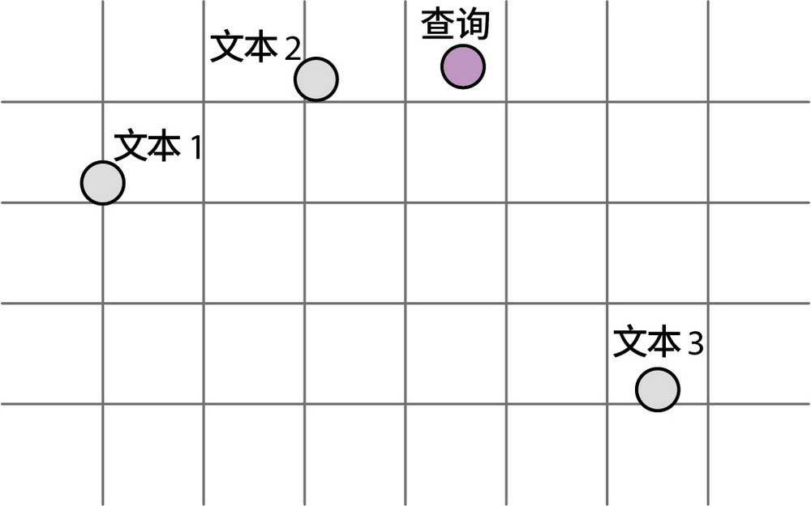

图8-5：稠密检索依赖于查询对象与相关结果在嵌入空间中的相似性

从图8-5中的距离分布可以看出，对于该查询而言，文本2是最佳匹配结果，文本1次之。但这里可能引发两个值得探讨的问题。

·是否应该将文本3纳入结果？这取决于系统设计者的决策。通常需要设置相似度阈值来过滤无关结果（特别是在语料库中缺乏相关文档时）。

·查询与最佳结果的语义是否真正相关？答案并非绝对肯定的。正因如此，语言模型需要通过问 - 答对训练来提升检索能力，这一过程将在第10章详细阐述。

图8-6展示了文档在嵌入前的分块处理流程。经过分块的文档通过嵌入模型转化为向量表示，最终存储在向量数据库中以备检索。

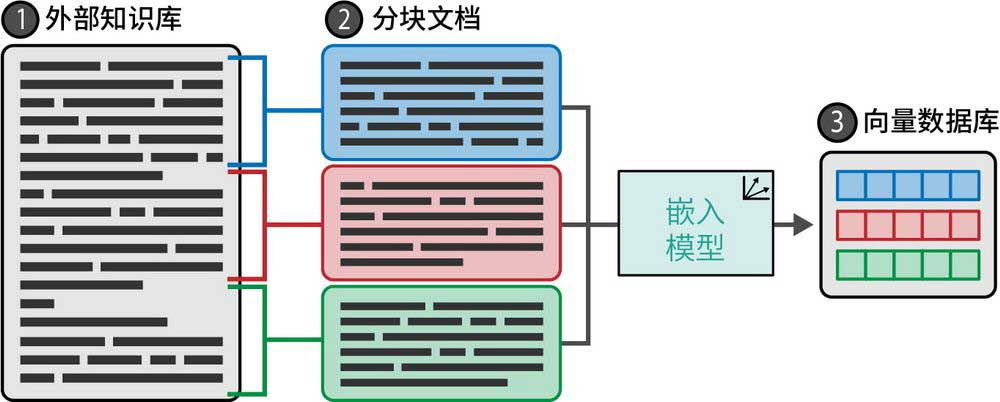

图8-6：将外部知识库转换为向量数据库，通过嵌入处理实现知识库的智能化查询

**1.稠密检索实例解析**

以下以电影《星际穿越》（*Interstellar*）英文维基百科页面的检索为例，演示Cohere平台的稠密检索流程。具体实施步骤包括：

（1）对目标文本进行预处理和句子分割；

（2）生成句子的向量表示；

（3）建立搜索索引；

（4）执行搜索并分析结果。

请访问Cohere网站，注册并获取Cohere API密钥，将其填入下方代码区域即可免费运行本示例。

首先导入必要的库：

```
import cohere
import numpy as np
import pandas as pd
from tqdm import tqdm
# 在此粘贴你的API密钥，切记不要公开分享
api_key = ''
# 从os.cohere.ai创建并获取Cohere API密钥
co = cohere.Client(api_key)
```

1. 截至本书中文版出版，维基百科页面中的内容已有变化，示例仅供参考。——编者注

**获取文本语料库并进行分块处理**。我们以电影《星际穿越》的英文维基百科页面的开头部分的内容为例
 [](#footnote-17-45)，首先获取原始文本数据，随后将其按句子进行切分：

```
text = """
Interstellar is a 2014 epic science fiction film co-written, directed, and produced by Christopher Nolan.
It stars Matthew McConaughey, Anne Hathaway, Jessica Chastain, Bill Irwin, Ellen Burstyn, Matt Damon, and Michael Caine.
Set in a dystopian future where humanity is struggling to survive, the film follows a group of astronauts who travel through a wormhole near Saturn in search of a new home for mankind.
Brothers Christopher and Jonathan Nolan wrote the screenplay, which had its origins in a script Jonathan developed in 2007.
Caltech theoretical physicist and 2017 Nobel laureate in Physics[4] Kip Thorne was an executive producer, acted as a scientific consultant, and wrote a tie-in book, The Science of Interstellar.
Cinematographer Hoyte van Hoytema shot it on 35 mm movie film in the Panavision anamorphic format and IMAX 70 mm.
Principal photography began in late 2013 and took place in Alberta, Iceland, and Los Angeles.
Interstellar uses extensive practical and miniature effects and the company Double Negative created additional digital effects.
Interstellar premiered on October 26, 2014, in Los Angeles.
In the United States, it was first released on film stock, expanding to venues using digital projectors.
The film had a worldwide gross over $677 million (and $773 million with subse quent re-releases), making it the tenth-highest grossing film of 2014.
It received acclaim for its performances, direction, screenplay, musical score, visual effects, ambition, themes, and emotional weight.
It has also received praise from many astronomers for its scientific accuracy and portrayal of theoretical astrophysics. Since its premiere, Interstellar gained a cult following,[5] and now is regarded by many sci-fi experts as one of the best science-fiction films of all time.
Interstellar was nominated for five awards at the 87th Academy Awards, winning Best Visual Effects, and received numerous other accolades"""
# 将文本分割成句子列表
texts = text.split('.')
# 清理空格和换行符
texts = [t.strip(' \n') for t in texts]
```

**嵌入文本片段**。现在我们开始对文本执行嵌入操作。我们将这些文本发送至Cohere API，即可获得每一段文本对应的向量表示：

```
# 获取嵌入向量
response = co.embed(
  texts=texts,
  input_type="search_document",
).embeddings
embeds = np.array(response)
print(embeds.shape)
```

输出结果为(15, 4096)，表明存在15个向量，每个向量的维度均为4096。

**构建搜索索引**。在实施搜索前，需预先构建搜索索引。该索引用于存储嵌入向量，其核心优化目标是实现海量数据点场景下的高效最近邻检索：

```
import faiss
dim = embeds.shape[1]
index = faiss.IndexFlatL2(dim)
print(index.is_trained)
index.add(np.float32(embeds))
```

**通过索引进行搜索**。现在，我们可以使用任意查询语句来搜索数据集。只需将查询语句编码为嵌入向量，并将其输入索引系统，系统便会从维基百科页面中检索出语义最相近的句子。

接下来定义搜索函数：

```
def search(query, number_of_results=3):
  # 1. 获取查询的嵌入向量
  query_embed = co.embed(texts=[query],
                input_type="search_query",).embeddings[0]
  # 2. 检索最近邻
  distances , similar_item_ids = index.search(np.float32([query_embed]), number_of_results)
  # 3. 格式化结果
  texts_np = np.array(texts) # 将文本列表转换为numpy数组以便索引
  results = pd.DataFrame(data={'texts': texts_np[similar_item_ids[0]],
                              'distance': distances[0]})
  # 4. 打印并返回结果
  print(f"Query:'{query}'\nNearest neighbors:")
  return results
```

至此，我们已经可以编写查询指令并执行文本搜索了！

```
query = "how precise was the science"
results = search(query)
results
```

此时将生成如下输出：

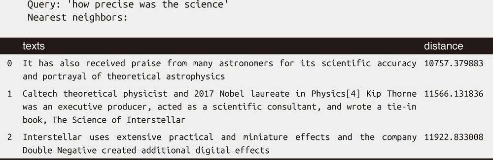

第一个结果与查询的相似度最高，因此成为最匹配的检索结果。从示例中可以看出，该结果完美解答了提出的问题。值得注意的是，这种结果在单纯使用关键词搜索时是不可能实现的，因为关键词搜索结果中排名最靠前的条目并未包含查询语句中的原始关键词。

为验证这一现象，我们可以定义一个关键词搜索函数。这里采用BM25算法，该算法是当前使用最广泛的词汇搜索方法之一。

```
from rank_bm25 import BM25Okapi
from sklearn.feature_extraction import _stop_words
import string
def bm25_tokenizer(text):
    tokenized_doc = []
    for token in text.lower().split():
        token = token.strip(string.punctuation)
        if len(token) > 0 and token not in _stop_words.ENGLISH_STOP_WORDS:
            tokenized_doc.append(token)
    return tokenized_doc
tokenized_corpus = []
for passage in tqdm(texts):
    tokenized_corpus.append(bm25_tokenizer(passage))
bm25 = BM25Okapi(tokenized_corpus)
def keyword_search(query, top_k=3, num_candidates=15):
    print("Input question:", query)
    ##### BM25搜索（词汇搜索） #####
    bm25_scores = bm25.get_scores(bm25_tokenizer(query))
    top_n = np.argpartition(bm25_scores, -num_candidates)[-num_candidates:]
    bm25_hits = [{'corpus_id': idx, 'score': bm25_scores[idx]} for idx in top_n]
    bm25_hits = sorted(bm25_hits, key=lambda x: x['score'], reverse=True)
    print(f"Top-3 lexical search (BM25) hits")
    for hit in bm25_hits[0:top_k]:
        print("\t{:.3f}\t{}".format(hit['score'], texts[hit['cor
pus_id']].replace("\n", " ")))
```

#

###

现在，当我们针对同一查询进行搜索时，得到的结果与稠密检索的呈现方式有所不同：

```
keyword_search(query = "how precise was the science")
```

结果：

```
Input question: how precise was the science
Top-3 lexical search (BM25) hits
      1.789 Interstellar is a 2014 epic science fiction film co-written, directed, and produced by Christopher Nolan
      1.373 Caltech theoretical physicist and 2017 Nobel laureate in Physics[4] Kip Thorne was an executive producer, acted as a scientific consultant, and wrote a tie-in book, The Science of Interstellar
      0.000 It stars Matthew McConaughey, Anne Hathaway, Jessica Chastain, Bill Irwin, Ellen Burstyn, Matt Damon, and Michael Caine
```

注意，尽管第一个结果与查询都包含science这个词，但它并未真正回答问题。在下一节中，我们将探讨如何通过添加重排器来改进搜索系统。但在深入讨论之前，让我们先完成对这一技术的全面概述，了解稠密检索的缺陷及文本分块方法。

**2.稠密检索的缺陷**

理解稠密检索的局限性及其解决方案具有重要意义。例如，当文本中完全不存在答案时会发生什么？系统仍会返回结果及其相似度距离。示例场景如下：

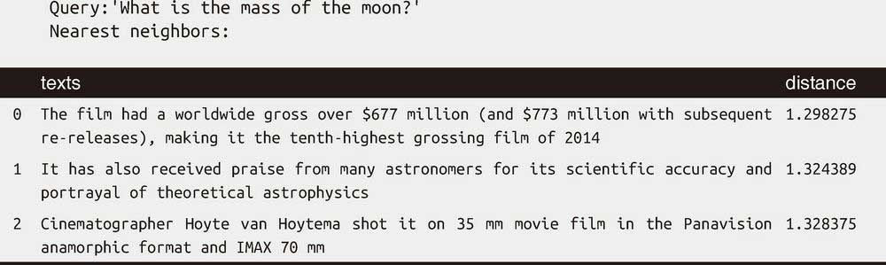

在这种情况下，一种可行的方法是设定相关性阈值，例如设置最大距离阈值。而许多搜索系统会将能得到的最佳匹配结果呈现给用户，由用户自行判断相关性。通过追踪用户对搜索结果的点击行为及满意度反馈，可以持续优化搜索系统的迭代版本。

稠密检索的另一短板在于无法精准匹配特定短语，这类场景更适合关键词匹配技术。这正是建议采用混合搜索（结合语义搜索与关键词搜索）而非单纯依赖稠密检索的重要原因。

当将稠密检索系统应用于其训练数据之外的领域时，其性能也会显著下降。例如，若检索模型基于互联网和维基百科数据进行训练，而后部署于法律文本场景（假设训练数据中法律领域内容不足），则模型在法律领域的表现将大打折扣。

需要特别指出的是，本示例中的每个句子都包含独立信息单元，而我们所展示的查询恰好精准对应这些信息单元。但答案分布于多个句子中的复杂问题应如何处理？这揭示了稠密检索系统的关键设计参数：如何实现长文本的最优分块处理？为何必须进行分块处理？

**3.长文本分块策略**

Transformer语言模型的上下文长度限制带来了技术挑战——我们无法输入超过模型词元限制的超长文本。那么应如何有效嵌入长文本呢？

图8-7展示了两种主流方案：单文档单向量方案与单文档多向量方案。


图8-7：虽然采用单个向量表示整个文档可行，但对篇幅较长的文档建议采用分块嵌入方案

**单文档单向量方案**。该方案使用单个向量表示整个文档。常见实现方式包括以下两种。

·仅嵌入文档的代表性段落，忽略剩余内容。例如仅嵌入标题或文档开头部分。这种方式虽适用于快速搭建演示系统，但会导致大量信息未被索引而无法检索。该方法适合文档首段即能概括核心观点的情况（如维基百科条目），但在实际系统中并非最佳选择，因其会排除大量可检索信息。

·将文档分割为多个块并对各块进行嵌入处理，随后将这些块聚合为单个向量。常用聚合方式是对各向量取平均值，但此方式存在信息高度压缩的缺陷，导致文档中的大量细节丢失。

这种方案或许能满足某些信息检索需求，却难以覆盖其他情况。在实际应用中，用户往往需要搜索文章中的特定信息片段，若这些概念能拥有独立向量则更有利于精准捕获。

**单文档多向量方案**。该方案将文档切分为较小的块并进行块级嵌入，使搜索索引转变为块嵌入索引，而非文档整体嵌入索引。图8-8展示了多种文本分块方式的对比效果。

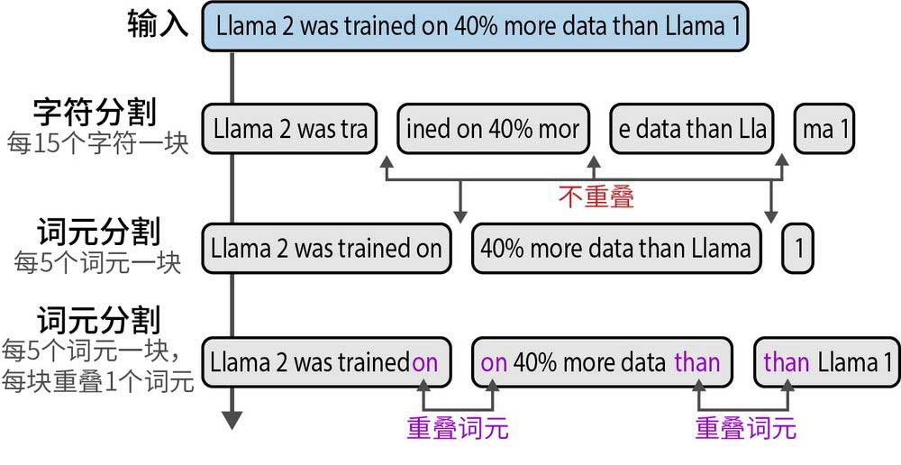

图8-8：不同分块方法对输入文本的分割效果，其中重叠块能有效防止上下文割裂

分块策略的优势在于实现文本的完整覆盖，使向量能够捕捉文本中的独立语义单元，从而构建表达力更强的搜索索引。图8-9列举了若干典型的实现方式。


图8-9：文档分块生成嵌入向量的多种方式

针对长文本的最佳分块方式，要根据系统需处理的文本类型和查询特征进行选择。

·以句子作为独立块的处理方式可能粒度过小，导致向量无法捕捉足够的上下文信息。

·以段落为单位进行分块是更优的选择。当文本段落较短时，这种方法效果良好；若段落较长，则建议每3 ～ 8个句子划分为一个块。

·某些文本块的含义高度依赖上下文，可通过以下方式增强上下文相关性。

·在块中附加文档标题。

·引入一部分上下文内容。通过构建重叠块结构（即相邻块包含部分重复文本），可有效地保留上下文信息。图8-10所示即为这种方式的典型应用。

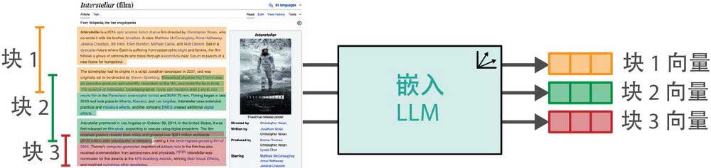

图8-10：采用重叠式文本分块策略可有效保留不同片段间的上下文相关性

随着稠密检索技术的持续演进，更多创新的分块策略正在涌现——部分方案已开始利用LLM实现动态智能分块，以生成语义连贯的文本单元。

**4.最近邻搜索与向量数据库**

完成查询嵌入后，如图8-11所示，我们需要在文档库中检索与之最相似的向量。最基础的实现方式是直接计算查询向量与文档库向量之间的距离。对于数千至数万量级的向量，使用NumPy即可高效完成这种计算。

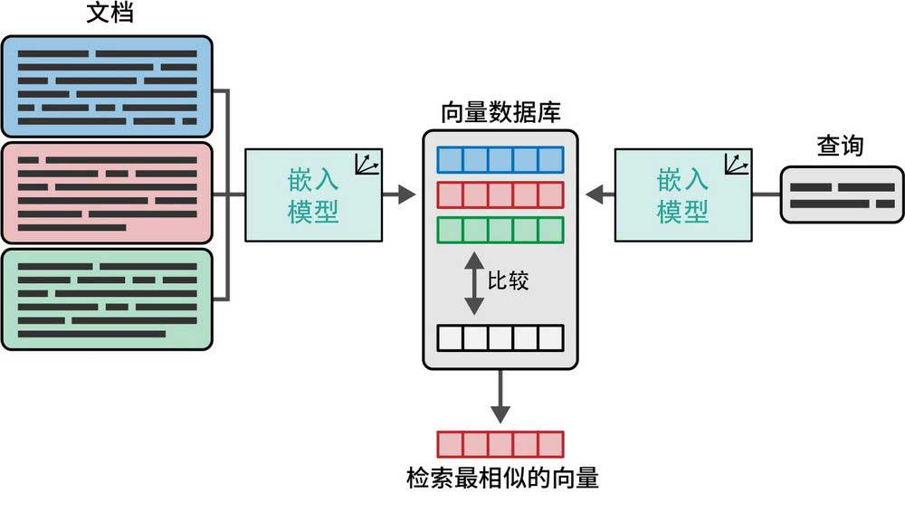

图8-11：如第4章所述，通过比较向量相似度可快速定位与查询最匹配的文档

当处理百万量级的向量时，建议采用Annoy或FAISS等近似最近邻（approximate nearest neighbor，ANN）搜索库进行优化检索。这些工具可在毫秒级响应时间内处理海量数据，部分方案还可借助GPU加速和分布式集群部署实现超大规模索引的高效服务。

另一类解决方案是专为向量检索设计的数据库系统（如Weaviate、Pinecone）。这类向量数据库支持动态增删向量而无须重建索引，并提供向量距离之外的过滤搜索、自定义搜索等高级功能。

**5.面向稠密检索的嵌入模型微调**

如第4章所述，通过微调可显著提升LLM在特定任务中的表现。在检索场景中，优化目标需要从词元嵌入扩展至文本级语义嵌入。该过程的核心在于构建由查询语句和相关文档组成的训练数据集。

以某数据集中的例句“*Interstellar* premiered on October 26, 2014, in Los Angeles”（《星际穿越》于2014年10月26日在洛杉矶首映）为例，其对应的有效查询可能如下所示。

·相关查询1：“*Interstellar* release date”（《星际穿越》上映日期）。

·相关查询2：“When did *Interstellar* premiere”（《星际穿越》是什么时候首映的）。

微调过程的目标是使这些查询的嵌入向量更接近目标句子的嵌入向量。同时，模型需要处理与句子无关的查询，例如下面这个例子。

·不相关查询：“*Interstellar* cast”（《星际穿越》演员阵容）。

基于这些样本，我们得到三组数据——两对正例和一对负例。如图8-12所示，假设微调前这三个查询与结果文档的嵌入距离相等——这种情况也算合理，因为它们都涉及《星际穿越》。

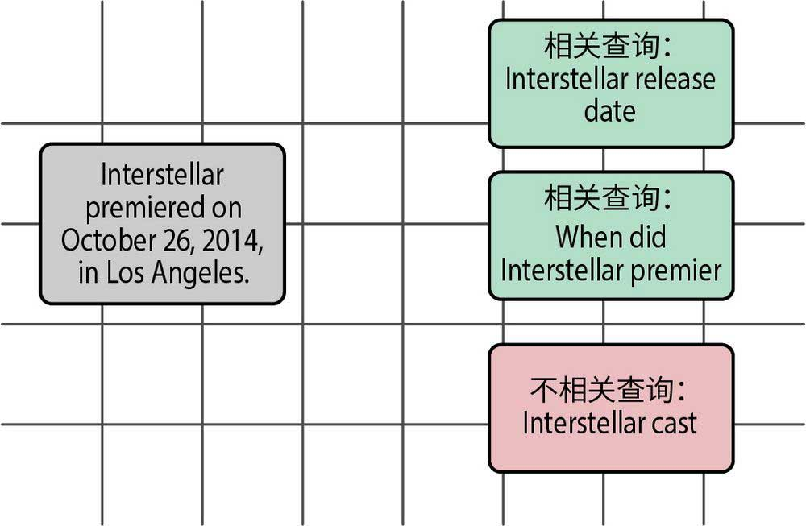

图8-12：在微调前，相关与不相关查询的嵌入向量可能均与特定文档邻近

微调的核心作用是拉近相关查询与文档的距离，同时推离不相关查询。这种效果可通过图8-13直观呈现。

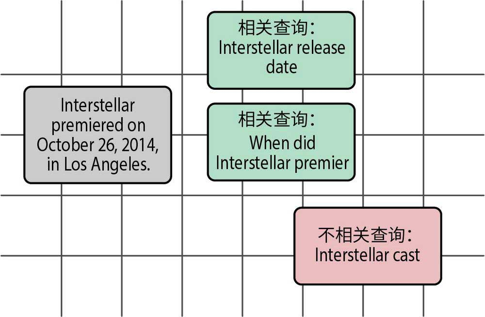

图8-13：经过微调后，文本嵌入模型利用提供的相关与不相关文档示例优化搜索任务表现，更贴合数据集的相关性定义

**8.2.2重排序**

许多组织已构建自有搜索系统。对于这些组织而言，将语言模型整合至搜索流程的最终环节是更便捷的实现方式。此环节通过调整搜索结果顺序提升查询的相关性，能显著改善搜索质量——微软必应正是采用类似BERT的模型实现了这一优化。图8-14展示了作为两阶段搜索系统中第二阶段的重排序的架构。

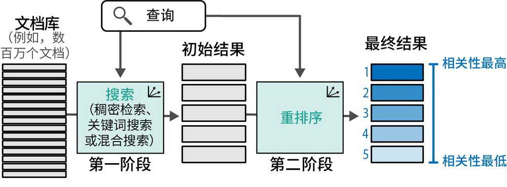

图8-14：LLM重排器作为搜索流程组件，其目标是根据相关性对候选搜索结果重新排序

**1.重排序示例**

重排器接收搜索查询与一组搜索结果，返回按相关性优化排序的文档列表，使相关性最高的结果位于前列。Cohere的Rerank端点提供了一种简单的方式来使用重排器，仅需传入查询和文本即可获得优化排序，无须训练或调参：

```
query = "how precise was the science"
results = co.rerank(query=query, documents=texts, top_n=3, return_docu
ments=True)
results.results
```

我们可以打印这些结果：

```
for idx, result in enumerate(results.results):
  print(idx, result.relevance_score , result.document.text)
0 0.1698185 It has also received praise from many astronomers for its scientific accuracy and portrayal of theoretical astrophysics
1 0.07004896 The film had a worldwide gross over $677 million (and $773 million with subsequent re-releases), making it the tenth-highest grossing film of 2014
2 0.0043994132 Caltech theoretical physicist and 2017 Nobel laureate in Physics[4]
Kip Thorne was an executive producer, acted as a scientific consultant, and wrote a tie-in book, The Science of Interstellar
```

### 输出：

这表明重排器对第一个结果更具信心，为其分配了超过0.16的相关性分数，而其他结果的相关性分数则显著偏低。

在这个基础示例中，我们向重排器传递了全部15个文档。但在实际应用中，索引可能包含成千上万个条目，通常需要先筛选出100或1000个候选结果，再将其提交给重排器。这个筛选过程被称为搜索流程的第一阶段检索。

第一阶段检索可采用关键词搜索、稠密检索，或是更优的方案——结合两者的混合搜索。通过回顾前面的示例，我们可以看到，在关键词搜索系统后加入重排器是如何提升系统性能的。

我们调整关键词搜索函数的工作流程：首先通过关键词搜索获取前10个结果，随后使用重排器从中精选出最优的3个结果：

```
def keyword_and_reranking_search(query, top_k=3, num_candidates=10):
    print("Input question:", query)
    ##### BM25搜索（词汇搜索）#####
    bm25_scores = bm25.get_scores(bm25_tokenizer(query))
    top_n = np.argpartition(bm25_scores, -num_candidates)[-num_candidates:]
    bm25_hits = [{'corpus_id': idx, 'score': bm25_scores[idx]} for idx in top_n]
    bm25_hits = sorted(bm25_hits, key=lambda x: x['score'], reverse=True)
    print(f"Top-3 lexical search (BM25) hits")
    for hit in bm25_hits[0:top_k]:
        print("\t{:.3f}\t{}".format(hit['score'], texts[hit['corpus_id']].replace("\n", " ")))
    # 添加重排序
    docs = [texts[hit['corpus_id']] for hit in bm25_hits]
    print(f"\nTop-3 hits by rank-API ({len(bm25_hits)} BM25 hits re-ranked)")
    results = co.rerank(query=query, documents=docs, top_n=top_k, return_documents=True)
    # print(results.results)
    for hit in results.results:
        # print(hit)
        print("\t{:.3f}\t{}".format(hit.relevance_score, hit.document.text.replace("\n", " ")))
```

现在，我们可以发送查询请求：首先检查关键词搜索的结果，从中筛选出前10个相关结果，再将其传递给重排器进行处理。

```
keyword_and_reranking_search(query = "how precise was the science")
```

结果：

```
Input question: how precise was the science
Top-3 lexical search (BM25) hits
1.789 Interstellar is a 2014 epic science fiction film co-written, directed, and produced by Christopher Nolan
1.373 Caltech theoretical physicist and 2017 Nobel laureate in Physics[4] Kip
Thorne was an executive producer, acted as a scientific consultant, and wrote a tie-in book, The Science of Interstellar
0.000 Interstellar uses extensive practical and miniature effects and the company Double Negative created additional digital effects
Top-3 hits by rank-API (10 BM25 hits re-ranked)
0.004 Caltech theoretical physicist and 2017 Nobel laureate in Physics[4] Kip
Thorne was an executive producer, acted as a scientific consultant, and wrote a tie-in book, The Science of Interstellar
0.004 Set in a dystopian future where humanity is struggling to survive, the film follows a group of astronauts who travel through a wormhole near Saturn in search of a new home for mankind
0.003 Brothers Christopher and Jonathan Nolan wrote the screenplay, which had its origins in a script Jonathan developed in 2007
```

通过观察可以发现，关键词搜索仅对均包含部分关键词的两个结果进行评分。在重排序后的第二组结果中，重排器成功将第二个结果提升为与查询相关性最高的结果。虽然这只是一个简单的示例，但足以让我们直观感受重排序的效果。在实际应用中，这样的处理流程能显著提升搜索质量。例如在多语言基准测试MIRACL中，重排器可使性能指标nDCG@10从36.5提升至62.8（本章后续将详细说明评估方法）。

**2.使用sentence-transformers实现开源检索与重排序**

若需在本地部署检索与重排序系统，可采用sentence-transformers（SBERT）库。具体配置方法请参考官方文档，并查阅“Retrieve & Re-Rank”（检索与重排序）部分获取详细的步骤说明和代码实现。

**3.重排序模型工作机制**

构建LLM搜索重排器的常规方法是将查询与每个候选结果共同输入**交叉编码器**架构的LLM。如图8-15所示，这种机制允许模型同时分析查询文本与文档内容后生成相关性评分。尽管文档采用批量处理方式，但每个文档都会单独跟查询进行匹配评估。最终模型根据这些分数重新排列搜索结果。该技术在论文“Multi-Stage Document Ranking with BERT”中有详尽阐述，学界常称其为monoBERT方法。

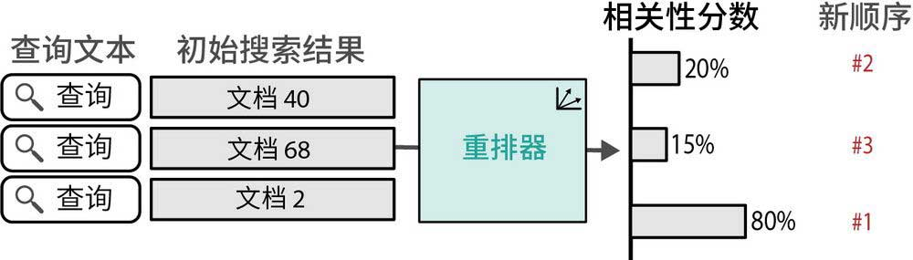

图8-15：重排器通过联合分析文档与查询生成相关性分数

这种基于相关性分数的搜索机制本质上可视为分类任务。模型接收输入后输出0和1之间的分数，0代表完全不相关，1代表高度相关。这与第4章讨论的分类问题原理相通。

欲深入了解LLM在搜索领域的发展脉络，强烈推荐阅读“Pretrained Transformers for Text Ranking: BERT and Beyond”，该论文系统梳理了截至2021年的相关技术演进。

**8.2.3检索评估指标体系**

1. mAP更常见的中文译法是均值平均精度。本书中precision一般译为精确率，涉及模型性能评估的情况译为精度。——编者注

语义搜索系统的评估沿用信息检索（information retrieval，IR）领域的经典指标。我们重点解析其中最具代表性的指标之一：均值平均精确率
 [](#footnote-17-75)（mean average precision，mAP）。

完整的搜索系统评估框架包含三大要素：文档库、查询集合，以及表明查询与文档对应关系的相关性判断。如图8-16所示，这些组件共同构成评估基础。

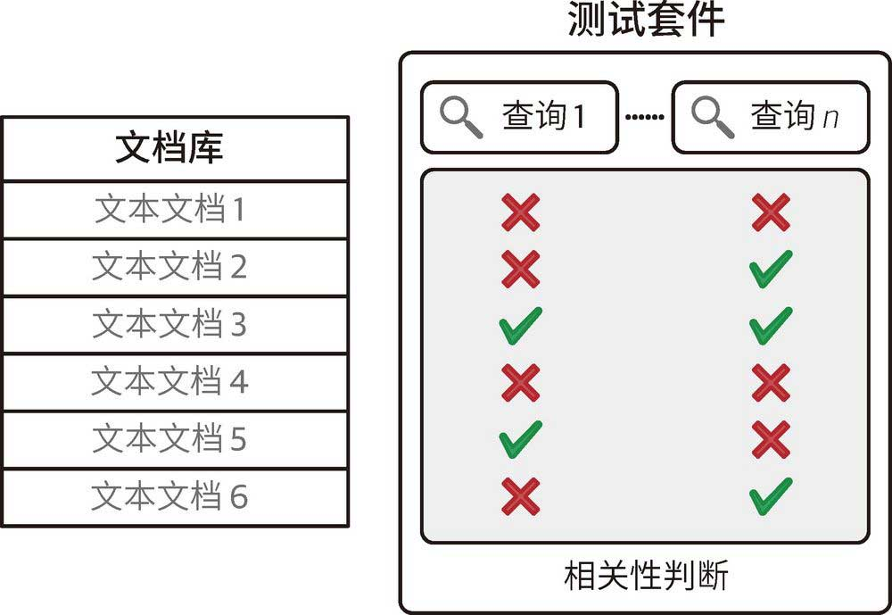

图8-16：评估搜索系统所需的测试套件构成，其中包含查询集合以及表明查询与库中文档对应关系的相关性判断

基于该测试套件，我们可进一步探讨搜索系统的评估方法。让我们从简单的案例入手：假设将查询1输入两个搜索系统后，我们获得两组结果。若将返回结果限定为三个（如图8-17所示），即可展开对比分析。

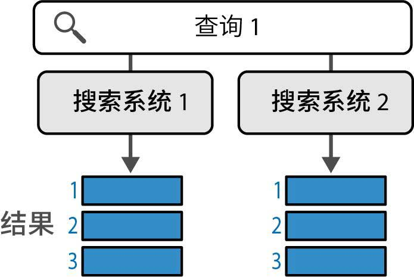

图8-17：使用同一个查询对两个搜索系统进行测试时，各自输出的前序结果对比

要判定系统优劣，需参照该查询的相关性标注数据。图8-18直观呈现了两个系统的返回结果中相关文档的分布情况。

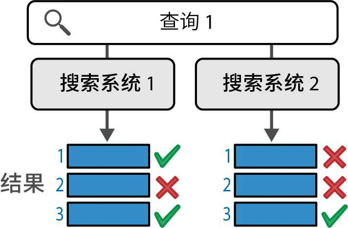

图8-18：通过对照测试套件的相关性标注，我们能够清晰判断系统1的检索效果优于系统2

此案例中系统1的优越性显而易见。直觉上，我们可以直接统计各系统召回的相关结果数量——系统1在三个结果中命中两个相关文档，而系统2仅命中一个。但若如图8-19所示，两个系统在三个结果中都只召回一个相关文档，但排序位置不同，又该如何评判？

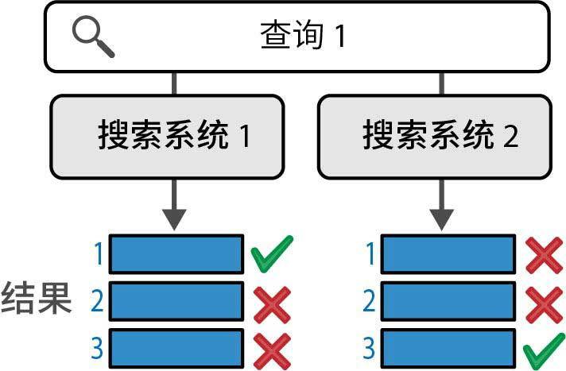

图8-19：需要设计能够区分排序优劣的评分机制——即使两个系统在前三个结果中均只包含一个相关文档，也应体现系统1将相关文档置于更高排位的优势

此情境下，我们可直观认为系统1表现更优，因为其将相关结果放置在更重要的首位。但如何将这种优势转化为可量化的数值指标？

针对此类情况，通常采用平均精确率（average precision，AP）进行评分：系统1在该查询上的得分为1，而系统2的得分仅为0.3。接下来我们将解析平均精确率的计算逻辑，并说明如何通过该指标基于测试套件的全部查询综合评估系统表现。

**1.基于平均精确率的单查询评分**

基于单个查询对搜索系统进行评分时，我们聚焦于相关文档的识别与排序。首先考察测试套件中仅含单个相关文档的查询场景。

第一种情况很简单：搜索系统将相关结果（这是该查询唯一可用的相关结果）置于首位。这使得系统获得了满分1。计算过程如图8-20所示，在第一个位置存在一个相关结果，因此位置1的精确率达1（计算方法为前*k*个位置的相关结果的数量除以当前查看的位置序号）。

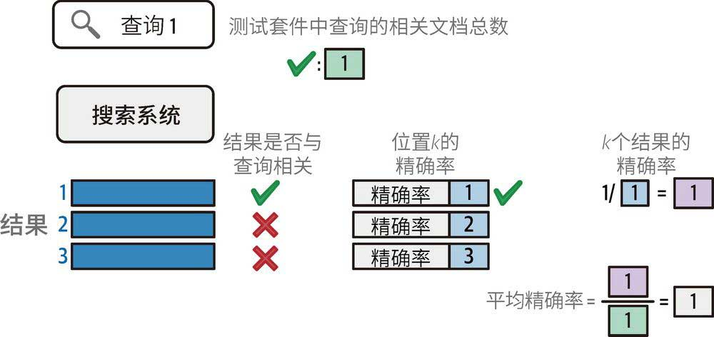

图8-20：计算平均精确率时需从位置1开始逐项计算各位置的精确率

由于我们仅对相关文档进行评分，可以忽略不相关文档的分数并终止计算。但若系统将唯一相关结果置于第三位会如何？这种情况对评分的影响如图8-21所示，系统会因提前呈现不相关文档而受到得分惩罚。

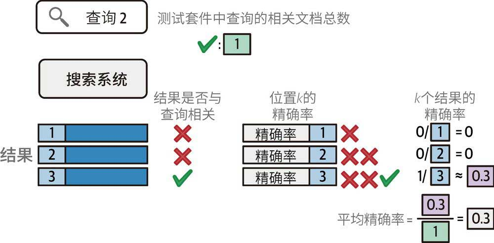

图8-21：当系统将不相关文档排列在相关文档之前时，其精确率得分将受到惩罚

接下来我们观察包含多个相关文档的查询案例。如图8-22所示，计算过程中需将所有相关文档处*k*个结果的精确率纳入平均值的计算。

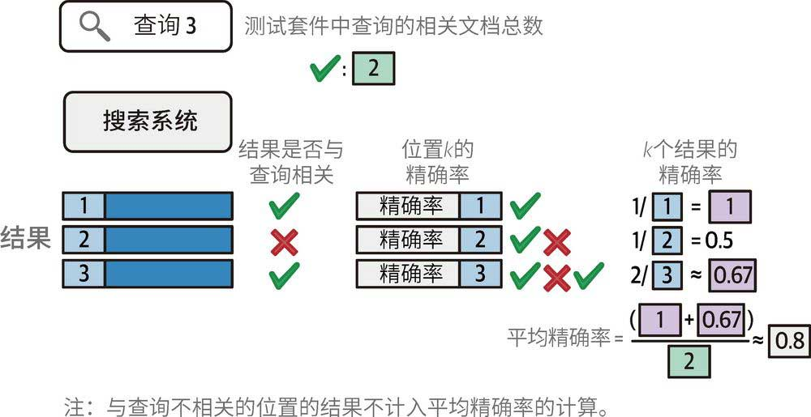

图8-22：对于含多个相关文档的查询，平均精确率需综合所有相关文档处*k*个结果的精确率

**2.基于均值平均精确率的多查询评分**

在理解*k*个结果的精确率与单查询平均精确率后，我们可将其扩展至适用于测试套件中所有查询的评估指标——均值平均精确率。如图8-23所示，该指标通过取各查询平均精确率的均值计算得出。

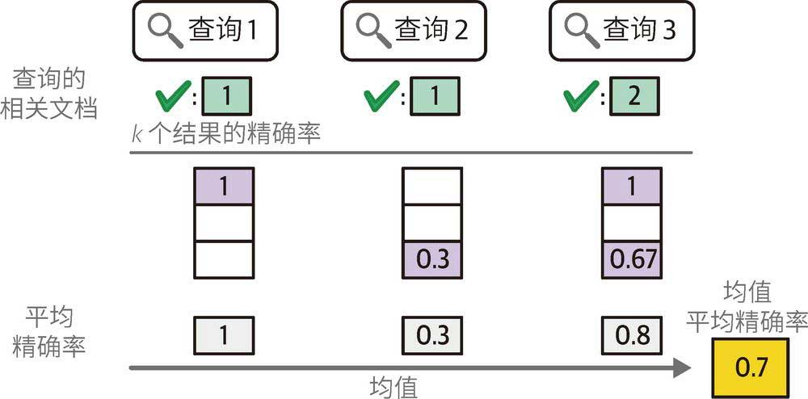

图8-23：均值平均精确率考虑了系统在测试套件中每个查询的平均精确率得分，通过对这些得分取均值，生成一个单一指标，便于比较不同搜索系统的性能

你可能会疑惑，为什么同样涉及“取平均数”的操作，要分别称“平均”和“均值”。这应该是出于美观和通顺的考虑，“均值平均精确率”要好于“平均平均精确率”。

1. 中文版《信息检索导论（修订版）》由人民邮电出版社出版。——编者注

现在我们已经有了可用于系统间横向对比的单一指标。若需深入了解信息检索评估指标，可参阅Christopher D. Manning、Prabhakar Raghavan和Hinrich Schütze合著的*IntroductiontoInformationRetrieval*（Cambridge University Press出版）中“Evaluation in Information Retrieval”一章
 [](#footnote-17-209)。

除均值平均精确率外，搜索系统还常使用归一化折损累积增益（normalized discounted cumulative gain，nDCG）作为评估指标。该指标具有更精细的考量维度，因为在测试套件和评分机制中，文档的相关性并非二元的（只有相关与不相关），而是允许标注不同等级的相关程度。

### 8.3 RAG

1. Patrick Lewis et al. “Retrieval-Augmented Generation for Knowledge-Intensive NLP Tasks.” Advances in Neural Information Processing Systems 33 (2020): 9459-9474.

随着LLM的大规模应用，用户开始频繁向其提问并期待事实性回应。模型虽然能正确回答部分问题，但也会出现大量看似自信实则错误的答案。业界主流解决方案是采用RAG技术，该技术最早在2020年的论文“Retrieval-Augmented Generation for Knowledge-Intensive NLP Tasks”
 [](#footnote-17-161)中提出，其架构如图8-24所示

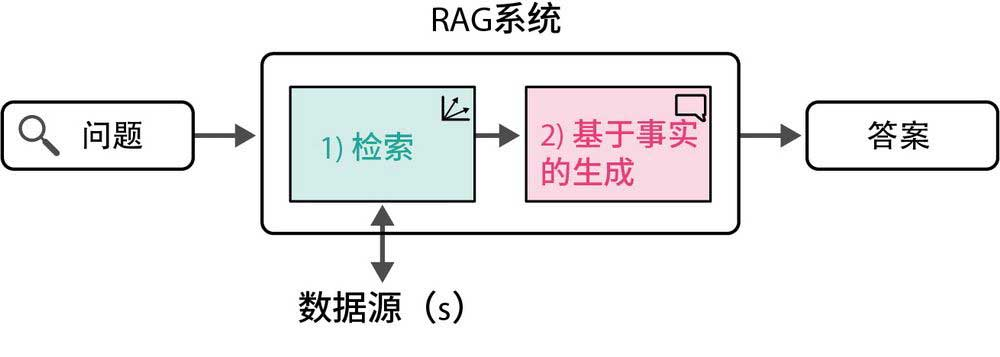

图8-24：基础RAG流程包含检索与生成两个核心环节。LLM接收用户问题时，检索模块获取的信息将作为提示词被输入LLM，进而生成基于事实的答案

RAG系统兼具检索与生成的双重能力，可视为传统生成系统的升级版：既有效减少了幻觉现象，又显著提升了回答的事实准确性。该技术还支持“与数据对话”（chat with my data）的应用场景，使企业和个人能够将LLM与内部数据或特定数据源（如书籍内容）对接。

1. 现为Microsoft Copilot。——编者注

这种模式同样适用于搜索引擎领域。当前越来越多的搜索引擎（例如Perplexity、Microsoft Bing AI
 [](#footnote-17-58)和Google Gemini）正在集成LLM，用于生成搜索结果摘要或直接回答用户提问。

**8.3.1从搜索到RAG**

现在我们尝试将普通搜索系统升级为RAG系统，核心方法是在搜索流程末端接入LLM。具体实现方式是将用户的问题与检索获得的前若干个相关文档共同输入LLM，使其基于检索提供的上下文生成答案。图8-25展示了该过程的典型示例。

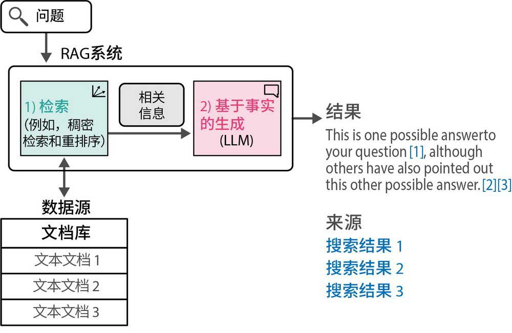

图8-25：生成式搜索在搜索流程的末端生成答案和摘要，同时引用其来源（由搜索系统的前序步骤返回）

这种生成过程被称为**基于知识的生成**，因为检索系统提供的相关信息为模型构建了特定上下文，使其能够在目标领域内进行定向生成。延续前文嵌入式搜索的案例，图8-26直观展示了如何在搜索流程后衔接基于知识的生成环节。

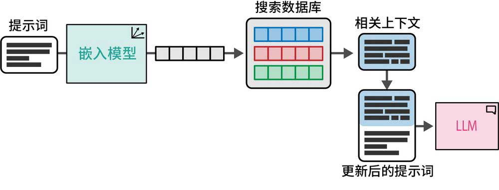

图8-26：通过比较嵌入向量之间的相似度，找到与输入提示词相关性最高的信息。在将提示词提供给LLM之前，将其添加到提示词中

**8.3.2示例：使用LLMAPI进行基于知识的生成**

接下来我们了解如何在搜索结果后添加基于知识的生成步骤，构建首个RAG系统。本示例将使用Cohere的托管LLM（基于本章前文所述的搜索系统），通过嵌入式搜索获取相关性最高的文档后，将这些文档与问题共同输入co.chat端点，从而生成基于知识的答案：

```
query = "income generated"
# 1.检索
# 我们将使用嵌入式搜索，但理想情况下应该使用混合搜索
results = search(query)
# 2.基于知识的生成
docs_dict = [{'text': text} for text in results['texts']]
response = co.chat(
    message = query,
    documents=docs_dict
)
print(response.text)
```

结果：

```
The film generated a worldwide gross of over $677 million, or $773 million with subsequent re-releases.
```

我们对部分文本进行了高亮标记，因为模型识别出这些文本片段来源于我们输入的第一个文档：

```
citations=[ChatCitation(start=21, end=36, text='worldwide gross', document_ids=['doc_0']), ChatCitation(start=40, end=57, text='over $677 million', document_ids=['doc_0']), ChatCitation(start=62, end=103, text='$773 million with subsequent re-releases.', document_ids=['doc_0'])]
documents=[{'id': 'doc_0', text': 'The film had a worldwide gross over $677 million (and $773 million with subsequent re-releases), making it the tenth-highest grossing film of 2014'}]
```

**8.3.3示例：使用本地模型的RAG**

现在，让我们尝试使用本地模型复现这一基础功能。尽管较小的本地模型在性能上可能不及大型托管模型，且无法实现文本片段引用功能，但演示这一流程仍具有重要参考价值。首先，我们需要下载一个量化模型。

**1.加载生成模型**

通过以下步骤加载模型：

```
!wget https://huggingface.co/microsoft/Phi-3-mini-4k-instruct-gguf/resolve/main/Phi-3-mini-4k-instruct-q4.gguf
```

借助llama.cpp、llama-cpp-python与LangChain实现文本生成模型的加载流程：

```
from langchain import LlamaCpp
# 注意确保模型路径在你的系统上是正确的！
llm = LlamaCpp(
    model_path="Phi-3-mini-4k-instruct-q4.gguf",
    n_gpu_layers=-1,
    max_tokens=500,
    n_ctx=2048,
    seed=42,
    verbose=False
)
```

**2.加载嵌入模型**

现在，我们加载一个用于生成嵌入向量的语言模型。在本示例中，我们将选用BAAI/bge-small-en-v1.5模型。截至撰写本书时，该模型在MTEB排行榜的嵌入模型类别中名列前茅，同时模型体积较小。

```
from langchain.embeddings.huggingface import HuggingFaceEmbeddings
# 用于将文本转换为数值表示的嵌入模型
embedding_model = HuggingFaceEmbeddings(
    model_name='BAAI/bge-small-en-v1.5'
)
```

现在我们可以通过嵌入模型完成向量数据库的初始化流程：

```
from langchain.vectorstores import FAISS
# 创建本地向量数据库
db = FAISS.from_texts(texts, embedding_model)
```

**3.RAG提示词**

提示词模板在RAG流程中具有关键性作用，这是我们将相关文档信息传递给LLM的核心。为此，我们将创建名为context的附加输入变量，该变量专门用于向LLM提供检索所得的文档内容：

```
from langchain import PromptTemplate
# 创建提示词模板
template = """<|user|>
Relevant information:
{context}
Provide a concise answer the following question using the relevant information
provided above:
{question}<|end|>
<|assistant|>"""
prompt = PromptTemplate(
    template=template,
    input_variables=["context", "question"]
)
from langchain.chains import RetrievalQA
# RAG流程
rag = RetrievalQA.from_chain_type(
    llm=llm,
    chain_type='stuff',
    retriever=db.as_retriever(),
    chain_type_kwargs={
        "prompt": prompt
    },
    verbose=True
)
```

###

###

现在，我们可以调用模型并提出问题：

```
rag.invoke('Income generated')
```

结果：

```
The Income generated by the film in 2014 was over $677 million worldwide.
This made it the tenth-highest grossing film of that year. It should be noted, however, this figure includes both initial ticket sales as well as any subsequent re-releases. With these additional releases, total earnings surged to approximately $773 million. The release format transitioned from traditional film stock projection in theaters to digital projectors once it was expanded to various venues in the United States. This shift might have contributed to wider audience reach and potentially higher grossing figures over time.
However, specific data on how this affected total earnings isn't provided in the information above.
```

与之前一样，我们可以通过调整提示词来控制模型的生成效果（例如回答长度和语气等）。

**8.3.4高级RAG技术**

本节列举几种提升RAG系统性能的进阶技术。

**1.查询改写**

当RAG系统作为聊天机器人时，若用户提问冗长或需要关联对话上下文，基础RAG在信息检索环节可能表现欠佳。此时，使用LLM将原始查询转化为更利于检索的简洁形式是一种有效的策略。例如：

用户提问：“我们明天有一篇关于动物的作文要交。我喜欢企鹅，可以写关于企鹅的。但我也可以写海豚。它们是动物吗？也许是吧。我们写海豚吧。比如，它们生活在哪里？”

这个原始查询应被改写为：

查询：“海豚生活在哪里”

此类改写可通过特定提示词或API实现。例如，Cohere的co.chat便内置了专用的查询改写模式。

**2.多查询RAG**

此方法扩展查询改写能力，支持针对复杂问题生成多个关联查询。例如：

用户提问：“比较NVIDIA 2020年与2023年的财报。”

理想情况是找到同时包含两年数据的文档，但更有效的做法是生成两个独立查询：

查询1：“NVIDIA 2020年财报”

查询2：“NVIDIA 2023年财报”

随后将两次检索的最佳结果输入模型进行事实性回答。进一步改进，可赋予改写器自主判断能力：需要执行检索，或直接生成可靠的答案。

**3.多跳RAG**

针对需要分步推理的复杂问题，系统需执行连续检索。例如：

用户提问：“2023年排名最靠前的汽车制造商有哪几个？它们是否都生产电动汽车？”

处理流程如下：

第1步，查询1：“2023年排名最靠前的汽车制造商”

基于检索结果（如丰田、大众和现代），生成后续查询：

第2步，查询1：“丰田汽车公司电动汽车”

第2步，查询2：“大众汽车集团电动汽车”

第2步，查询3：“现代汽车公司电动汽车”

**4.查询路由**

该技术使模型具备多数据源定向检索能力。例如：

·用户提出人力资源相关问题 → 检索公司知识库（如Notion）

·用户提出客户数据相关问题 → 检索CRM系统（如Salesforce）

**5.智能体RAG**

至此，你可能已经意识到，前述增强功能正逐步将愈加复杂的任务交给LLM。这种演进依赖于LLM对信息价值的评估能力，以及其整合多源数据的处理能力。这种新特性使得LLM愈发接近于能在现实世界执行任务的智能体。值得注意的是，数据源本身亦可抽象为工具。正如我们已经见到基于Notion的搜索功能，同理应也能实现向Notion发布内容的技术路径。

需特别说明的是，并非所有LLM都具备本节讨论的RAG功能。截至本书撰写时，仅有少数头部托管模型尝试支持此类特性。值得关注的是，Cohere推出的Command R+ 在此类任务中表现卓越，且其开放权重版本也可供使用。

**8.3.5RAG效果评估**

1. Nelson F. Liu, Tianyi Zhang, and Percy Liang. “Evaluating Verifiability in Generative Search Engines.” arXiv preprint arXiv:2304.09848 (2023).

RAG模型的评估体系仍处于快速发展阶段。推荐阅读论文“Evaluating Verifiability in Generative Search Engines”（2023），该研究通过人工评估对比了多种生成式搜索系统
 [](#footnote-17-109)，其评估框架包含四个核心维度。

流畅性（fluency）

生成文本的语言流畅度与逻辑连贯性。

感知效用（perceived utility）

回答内容的信息价值与实用价值。

引用召回率（citation recall）

外部事实陈述中获得完整引证支持的比例。

引用精确率（citation precision）

引用内容对相关论断的支持的有效性。

尽管人工评估仍是黄金标准，但学界正探索通过LLM-as-a-judge范式实现自动化评估，即使用高性能LLM对生成结果进行多维度评分。Ragas便是实现此类评估的开源工具库，它还包含以下两个评估指标。

忠实度（faithfulness）

答案与所提供上下文的一致性程度。

答案相关性（answer relevance）

答案与提问主题的契合度。

Ragas官方文档详细阐述了各项指标的计算公式。

### 8.4 小结

本章系统探讨了语言模型在搜索系统中的创新应用。

·**稠密检索**：基于文本嵌入相似性的检索机制，通过将搜索查询向量化，匹配最相近的文档嵌入。

·**重排器**：以monoBERT为代表的系统，通过评估查询与候选文档的相关性分数实现结果排序优化。

·**RAG**：在搜索流程末端部署生成式LLM，基于检索所得文档生成附带引证的回答。

我们还介绍了一种可行的搜索系统评估方法。均值平均精确率允许我们为搜索系统评分，从而基于一组测试查询及已知的相关性数据进行系统间的比较。值得注意的是，RAG系统的评估需要涵盖多个维度，包括忠实度、流畅性等指标，这些维度既可以通过人工评估，也可以借助LLM-as-a-judge进行量化分析。

在下一章中，我们将深入探讨语言模型的多模态扩展技术，使其不仅能够处理文本信息，还具备理解视觉内容的能力。


---

## 第9章 多模态LLM

提及LLM时，我们通常不会第一时间联想到多模态。毕竟，LLM本质上是语言模型。但我们很快会发现，若能处理文本之外的数据类型，其应用价值将大幅提升。例如，当语言模型可“看到”图像并回答相关问题时，其效用将显著增强。这种能够处理文本与图像（每种数据类型称为一种**模态）的模型，即被称为多模态**（multimodal）模型，如图9-1所示。

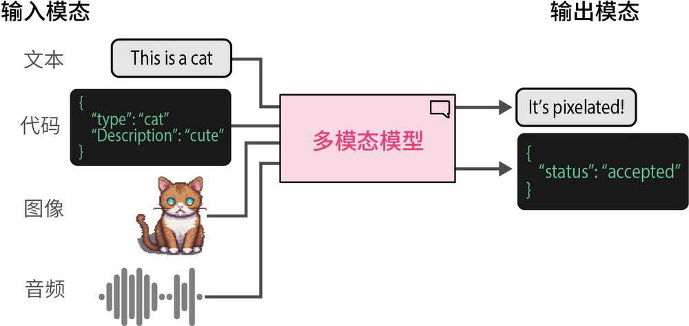

图9-1：能处理多种数据模态（如图像、音频、视频或传感器数据）的模型称为多模态模型。模型接收某种模态作为输入，但不一定能生成对应模态的输出

1. Jason Wei et al. “Emergent Abilities of Large Language Models.” arXiv preprint arXiv:2206.07682 (2022).

我们已见证LLM展现出包括泛化推理、数学运算及语言理解在内的涌现能力。随着模型规模的扩大与智能水平的提升，其技能图谱将持续拓展
 [](#footnote-18-63)。

接收并理解多模态输入的能力，或将进一步释放模型的潜能。事实上，语言并非孤立存在的，肢体动作、面部表情、语调变化等非语言要素，均能增强口语表达。这一原理同样适用于LLM。若赋予其理解多模态信息的能力，其功能边界将得以拓展，从而能够解决更多新型问题。

本章将探讨具备多模态能力的LLM及其实际应用场景。首先解析如何通过改进原始Transformer技术，将图像转换为数值表示。随后展示如何扩展LLM架构，使其具备视觉任务处理能力。

### 9.1 视觉Transformer

在本书各章节中，从分类、聚类到搜索生成，我们见证了基于Transformer的模型在语言建模任务中的卓越表现。自然，研究者开始尝试将Transformer的成功经验迁移至计算机视觉领域。

1. Alexey Dosovitskiy et al. “An Image is Worth 16x16 Words: Transformers for Image Recognition at Scale.” arXiv preprint arXiv:2010.11929 (2020).

由此诞生的视觉Transformer（Vision Transformer，ViT），在图像识别任务中展现出超越传统卷积神经网络（convolutional neural network，CNN）的性能
 [](#footnote-18-101)。与原始Transformer类似，ViT的核心功能是将非结构化的图像数据转换为可用于分类等任务的数值表示，如图9-2所示。

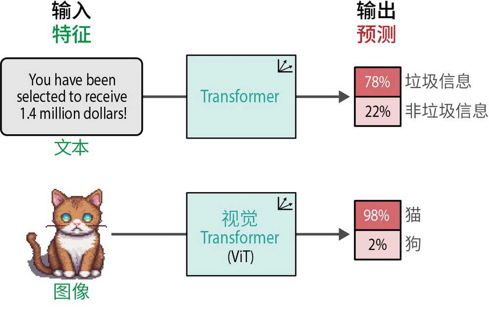

图9-2：原始Transformer与ViT均将非结构化数据转换为数值表示，最终应用于分类等任务

ViT的实现依赖Transformer架构的一个重要组件——编码器。正如我们在第1章所见，编码器负责将文本输入转换为数值表示，随后这些表示被传递至解码器。然而，在编码器发挥作用之前，必须先对文本输入进行分词，如图9-3所示。

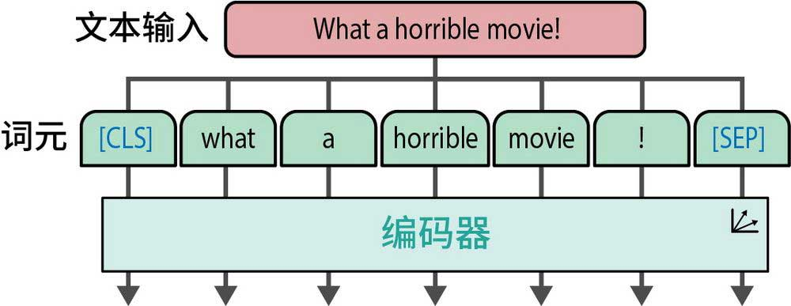

图9-3：文本在被传入一个或多个编码器之前，需要先通过分词器进行分词

由于图像并非由词构成，这种分词方法自然无法直接应用于视觉数据。为此，ViT的研究者创新性地提出将图像切割为“词”的策略，从而保留了原始Transformer编码器的架构特性。

假设我们有一张512像素 × 512像素的猫的图片。单个像素的信息量虽有限，但当我们将像素聚合成图像块（patch）时，就能逐步提取出更高层次的特征表示。

ViT正是基于这一思想进行设计的。不同于将文本分割为词元，它将原始图像切割为规则排列的图像块，进而实现特征提取。具体而言，ViT会沿图像的水平方向和垂直方向进行网格化切割，这一过程如图9-4所示。

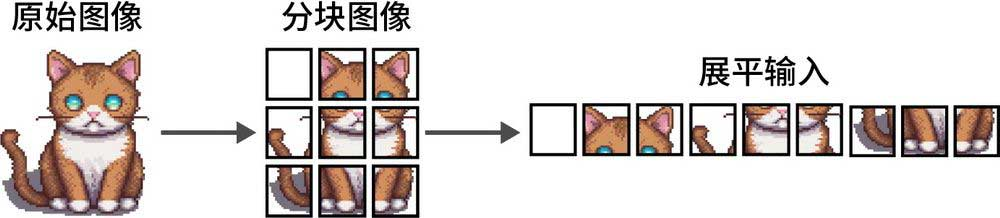

图9-4：图像输入的“分词”处理流程：将完整的图像转换为多个子图像块

类比文本的分词处理，图像块的展平输入可被视为视觉领域的“词元”。但需注意，无法像文本词元那样直接赋予图像块固定的ID——由于图像的多样性，图像块在不同场景中的重复概率远低于文本词元。

为解决这一问题，系统会对图像块实施线性嵌入操作，将其转换为数值化的嵌入向量。这些蕴含语义信息的向量便可作为Transformer模型的标准化输入，使得图像块能够以与文本词元完全相同的处理流程通过编码器。ViT核心算法架构如图9-5所示。

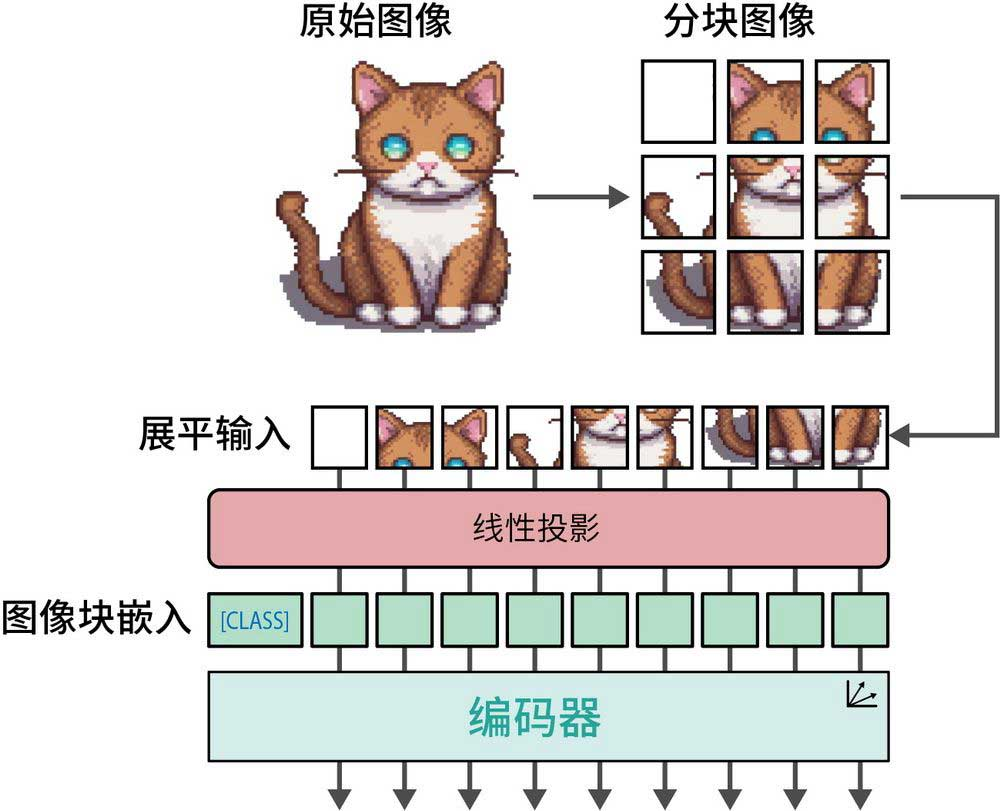

图9-5：ViT核心算法架构。图像经过分块处理和线性投影后，其嵌入向量将以与文本词元相同的方式进入编码器

需要说明的是，示例中采用的3 × 3分块仅为示意用途，原始论文方案实际采用了16 × 16的分割粒度——这呼应了论文标题“An Image is Worth 16x16 Words”（一图胜16 × 16言）。

该范式的革命性在于，当嵌入向量进入编码器后，视觉与文本模态的处理路径完全相同。这种架构统一性为多模态模型的构建奠定了重要基础。

正是得益于这种跨模态兼容性，ViT常被用作扩展语言模型多模态能力的关键模块，其中最典型的应用场景便是训练跨模态的联合嵌入模型。

### 9.2 多模态嵌入模型

在前文中，我们已深入探讨了嵌入模型在文本表示（如学术论文与技术文档）的语义提取中的应用。研究表明，这些数值化表示不仅能用于相似文档检索，还可有效支持分类任务与主题建模等高级应用。

正如我们之前多次提到的，嵌入技术通常是LLM应用背后的核心驱动力。它们作为捕捉海量信息并在数据洪流中定位关键要素的高效方法，发挥着不可替代的作用。

目前我们所讨论的均为纯文本处理型嵌入模型，其核心功能是生成文本表示的嵌入向量。尽管存在专门针对图像的嵌入模型，但我们将重点探讨能够同时捕捉文本与视觉信息的多模态嵌入模型。如图9-6所示，这种模型实现了跨模态的统一表示。

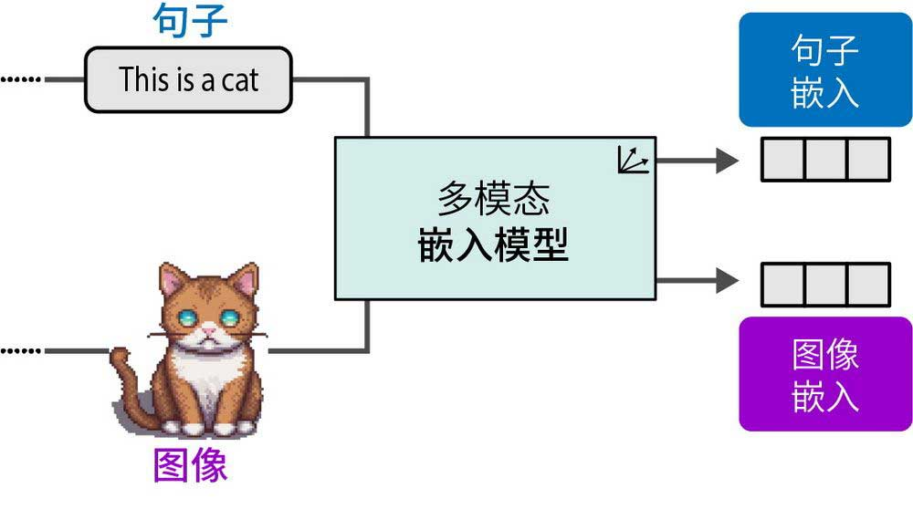

图9-6：多模态嵌入模型可在同一向量空间中为不同模态生成嵌入向量

得益于共享向量空间的特性，我们可以直接比较不同模态的语义表示（图9-7）。例如，使用此类多模态模型时，用户可通过输入文本检索相关图像：可以搜索与“pictures of a puppy”（小狗的图片）最相似的图像。反之亦然，也可以探究哪些文本信息与特定图像的相关性最高。

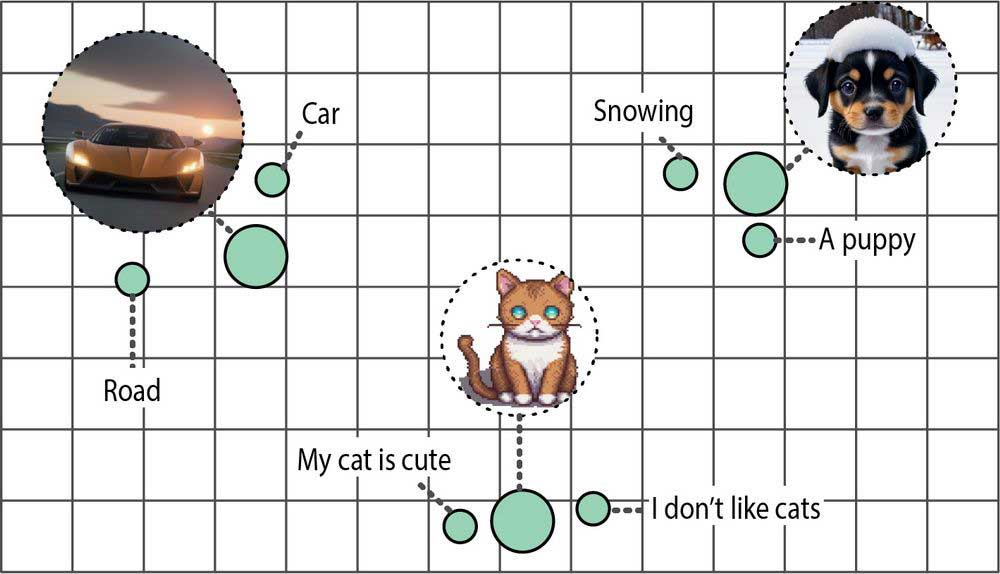

图9-7：不同模态的语义相近的嵌入向量，在向量空间中仍呈现邻近分布

在众多多模态嵌入模型中，对比语言 - 图像预训练（Contrastive Language-Image Pre-training，CLIP）模型以其卓越的性能和广泛的适用性成为当前最主流的解决方案。

**9.2.1CLIP：构建跨模态桥梁**

CLIP是一种能同时计算图像嵌入与文本嵌入的先进模型，其生成的跨模态嵌入共享同一向量空间，这意味着图像特征可直接与文本语义进行量化比较。这种独特的跨模态对齐能力使CLIP及其同类模型可支撑以下核心应用场景。

**零样本分类**

通过比对图像嵌入与类别描述文本的嵌入向量，实现无需训练数据的精准分类。

**语义聚类**

将图像集合与关键词库进行联合聚类，揭示视觉内容与文本概念的潜在关联。

**跨模态检索**

在海量多模态数据中，实现文本 - 图像的双向即时检索。

**生成引导**

1. Robin Rombach et al. “High-Resolution Image Synthesis with Latent Diffusion Models.” Proceedings of the IEEE/CVF Conference on Computer Vision and Pattern Recognition, 2022.

驱动图像生成模型（如稳定扩散模型
 [](#footnote-18-16)）实现更精准的文本 - 图像对齐。

**9.2.2CLIP的跨模态嵌入生成机制**

CLIP的实现逻辑相当简洁。设想存在一个包含数百万张图像及其对应描述文本的训练数据集（如图9-8所示），该数据集为构建跨模态对齐提供了基础。


图9-8：多模态嵌入模型训练所需数据形式

基于此数据集，可为每一组图像和描述文本创建两个向量表示。CLIP采用双编码器架构实现这一点：文本编码器处理描述文本，生成语义嵌入；图像编码器提取视觉特征，生成图像嵌入。如图9-9所示，经过联合训练后，配对的图文数据将在向量空间中获得高度对齐的嵌入向量表示。

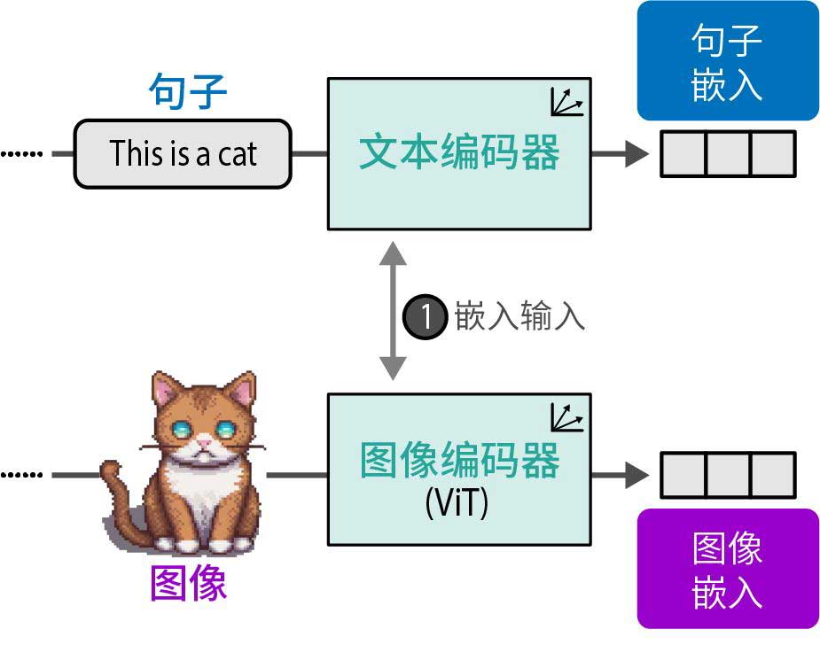

图9-9：在CLIP训练的第一步中，分别使用图像编码器和文本编码器对图像和文本进行嵌入处理

生成的这对嵌入向量通过余弦相似度进行比较。如第4章所述，余弦相似度是向量间夹角的余弦值，其计算方式为嵌入向量的点积除以各自长度的乘积。

在训练初始阶段，由于图像嵌入与文本嵌入尚未对齐到同一向量空间，二者间的相似度会处于较低水平。在训练过程中，我们对嵌入向量之间的相似度进行优化，旨在最大化匹配图文对的相似度，同时最小化非匹配对的相似度（图9-10）。

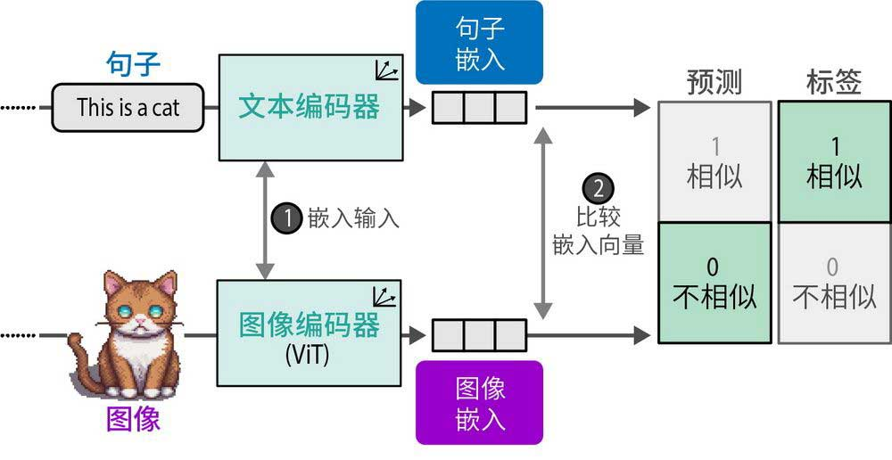

图9-10：在CLIP训练的第二步中，使用余弦相似度计算句子嵌入与图像嵌入之间的匹配程度

完成相似度计算后，模型参数将被更新，随后使用新的数据批次和更新后的表示重复这一过程（图9-11）。这种训练方法被称为**对比学习**（contrastive learning），我们将在第10章剖析其内在机制，并动手构建自定义的嵌入模型。

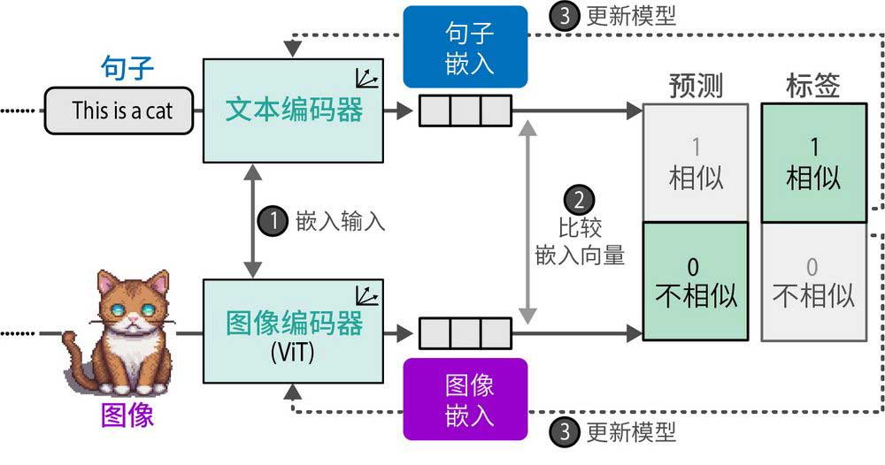

图9-11：在CLIP训练的第三步中，根据预期相似度更新文本编码器和图像编码器参数。这种参数更新使相似输入的嵌入向量在向量空间中的距离逐渐缩小

最终，我们期望实现猫的图像嵌入与句子“This is a cat”（这是一只猫）的文本嵌入具有高度相似性。如第10章将揭示的，为确保表示的准确性，训练过程中还需引入无关图像和文本描述作为负例。建模相似度的核心不仅在于捕捉事物的共性，更要建立区分异质样本的能力。

**9.2.3OpenCLIP**

接下来的示例将使用OpenCLIP这一开源CLIP实现。使用OpenCLIP或任何CLIP模型的关键在于两个核心处理环节：对输入文本和图像数据进行预处理，将其传入主模型。

在具体实践之前，我们先以一张AI生成的图像为例——这张Stable Diffusion生成的小狗在雪地里玩耍的图像（图9-12）正是我们先前展示过的案例：


图9-12：AI生成的一只在雪地中玩耍的小狗的图像

```
from urllib.request import urlopen
from PIL import Image
# 加载一张小狗在雪地里玩耍的AI生成的图像
puppy_path = "https://raw.githubusercontent.com/HandsOnLLM/Hands-On-Large-
Language-Models/main/chapter09/images/puppy.png"
image = Image.open(urlopen(puppy_path)).convert("RGB")
caption = "a puppy playing in the snow"
```

在获得该图像的文本描述后，我们可以使用OpenCLIP框架分别为其视觉内容和文本描述生成嵌入向量。

具体实现需要加载以下三个核心组件：

·用于对文本输入进行分词处理的分词器

·负责图像预处理的预处理器

·将上述处理后的输出转换为嵌入向量的主模型

```
from transformers import CLIPTokenizerFast, CLIPProcessor, CLIPModel
model_id = "openai/clip-vit-base-patch32"
# 加载分词器来预处理文本
clip_tokenizer = CLIPTokenizerFast.from_pretrained(model_id)
# 加载预处理器来预处理图像
clip_processor = CLIPProcessor.from_pretrained(model_id)
# 用于生成文本嵌入和图像嵌入的主模型
model = CLIPModel.from_pretrained(model_id)
```

在完成模型加载后，输入预处理就变得相对简单。我们以分词器为切入点，具体了解输入预处理的实际运作机制：

```
# 对输入进行分词
inputs = clip_tokenizer(caption, return_tensors="pt")
inputs
```

执行上述代码将输出一个包含输入ID的字典：

```
{'input_ids': tensor([[49406, 320, 6829, 1629, 530, 518, 2583, 49407]]),
'attention_mask': tensor([[1, 1, 1, 1, 1, 1, 1, 1]])}
```

要查看这些ID对应的具体含义，我们可以使用convert_ids_to_tokens函数将其转换为对应的词元：

```
# 将输入转换为词元
clip_tokenizer.convert_ids_to_tokens(inputs["input_ids"][0])
```

这生成了如下输出：

```
['<|startoftext|>',
 'a</w>',
 'puppy</w>',
 'playing</w>',
 'in</w>',
 'the</w>',
 'snow</w>',
 '<|endoftext|>']
```

正如前文多次提到的，文本会被分割为词元序列。文本首尾分别添加了起始词元和结束词元，以便与可能存在的图像嵌入相区分。你可能已经注意到，此处缺少了[CLS]词元——在CLIP模型中，该词元实际上专门用于提取图像嵌入特征。

完成描述文本的预处理后，现在可以生成相应的嵌入向量了：

```
# 创建文本嵌入
text_embedding = model.get_text_features(**inputs)
text_embedding.shape
```

这将为该字符串生成一个包含512个值的嵌入向量：

```
    torch.Size([1, 512])
```

在创建图像嵌入之前，我们需要像处理文本嵌入一样对图像进行预处理，因为模型对输入图像有特征要求，例如尺寸和形状。

此时可以使用我们先前创建的预处理器：

```
# 预处理图像
processed_image = clip_processor(
    text=None, images=image, return_tensors="pt"
)["pixel_values"]
processed_image.shape
```

原始图像的尺寸为512像素 × 512像素。需要注意的是，在预处理过程中该图像会被调整为224像素 × 224像素，因为该尺寸是模型预期的输入规格：

```
    torch.Size([1, 3, 224, 224])
```

我们可以通过可视化方式直观呈现预处理结果：

```
import torch
import numpy as np
import matplotlib.pyplot as plt
# 准备图像以进行可视化
img = processed_image.squeeze(0)
img = img.permute(*torch.arange(img.ndim - 1, -1, -1))
img = np.einsum("ijk->jik", img)
# 可视化预处理后的图像
plt.imshow(img)
plt.axis("off")
```

预处理后的图像如图9-13所示。


图9-13：CLIP预处理后的输入图像

要将预处理后的图像转换为嵌入向量，我们可以像先前一样调用模型，并查看其返回结果的形状：

```
# 创建图像嵌入
image_embedding = model.get_image_features(processed_image)
image_embedding.shape
```

我们得到如下形状：

```
torch.Size([1, 512])
```

需要特别注意的是，生成的图像嵌入的形状与文本嵌入完全一致。这一特性至关重要，它使得我们能够比较两者的嵌入向量，进而判断其相似性。

为衡量两者的相似程度，我们首先需要对嵌入向量进行归一化处理，随后通过计算点积来获得相似度分数：

```
# 对嵌入向量进化归一化处理
text_embedding /= text_embedding.norm(dim=-1, keepdim=True)
image_embedding /= image_embedding.norm(dim=-1, keepdim=True)
# 计算它们的相似度
text_embedding = text_embedding.detach().cpu().numpy()
image_embedding = image_embedding.detach().cpu().numpy()
score = np.dot(text_embedding, image_embedding.T)
score
```

由此得出以下分数：

```
array([[0.33149648]], dtype=float32)
```

我们得到了约0.33的相似度分数，但由于我们并不清楚模型判定相似度高低的依据，这一分数仍难以准确解读。为此，我们增加更多图像与对应描述文本，对示例进行扩展，如图9-14所示。

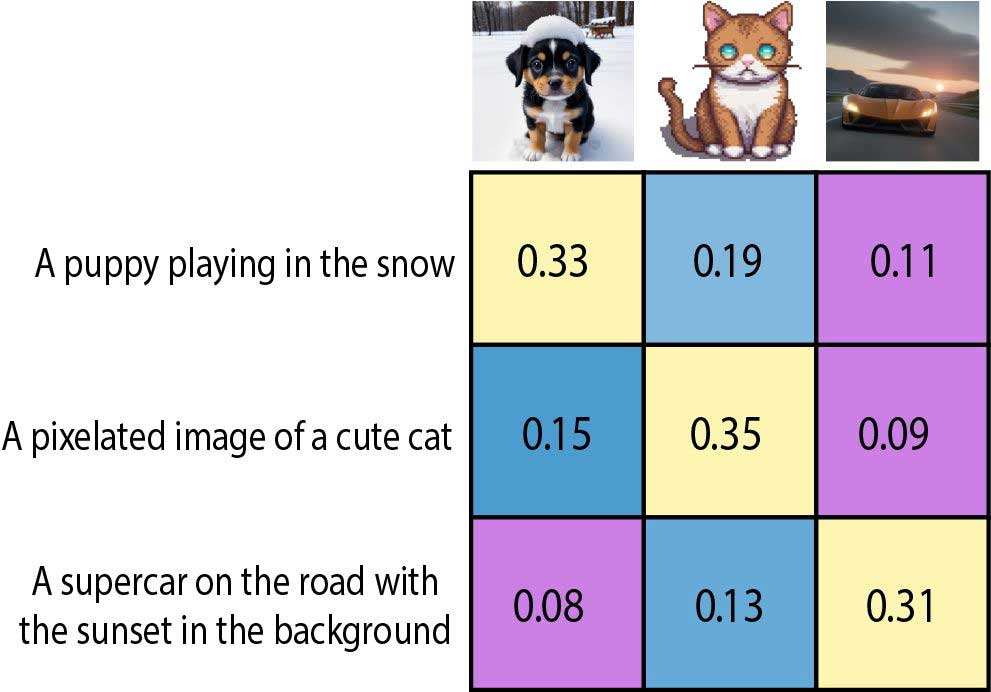

图9-14：三张图像与三段描述文本构成的相似度矩阵

考虑这段文本与其他图像之间的相似度分数普遍偏低，0.33这一数值确实相当可观。

**使用sentence-transformers加载CLIP**

sentence-transformers库已实现若干基于CLIP的模型，进一步简化了创建嵌入向量的过程：

```
from sentence_transformers import SentenceTransformer, util
# 加载兼容SBERT的CLIP模型
model = SentenceTransformer("clip-ViT-B-32")
# 对图像进行编码
image_embeddings = model.encode(images)
# 对描述文本进行编码
text_embeddings = model.encode(captions)
# 计算余弦相似度
sim_matrix = util.cos_sim(
    image_embeddings, text_embeddings
)
```

### 9.3 让文本生成模型具备多模态能力

传统意义上的文本生成模型，正如其名，是专精于文本表示解析的智能系统，这完全符合我们对这类模型的预期。以Llama 2和ChatGPT为代表的先进模型，在文本信息推理与自然语言交互方面展现出卓越能力。

然而，受限于训练数据的模态特性，这类模型仅能处理文本信息。正如前文探讨的多模态嵌入模型所示，视觉能力的引入能显著扩展模型的功能边界。

对于文本生成模型而言，我们期望其能理解并推理输入的视觉信息。例如，当输入比萨的图片时，模型应能辨识其食材构成；面对埃菲尔铁塔的照片，模型需准确回答其建造年代与地理位置。图9-15直观展示了这种跨模态对话能力。


图9-15：具备图像推理能力的多模态文本生成模型（BLIP-2）应用实例

为架设跨模态的沟通桥梁，研究者致力于为现有模型注入多模态理解能力。一种实现方法是BLIP-2技术，采用创新的模块化设计，为传统语言模型赋予视觉认知能力。

**9.3.1BLIP-2：跨越模态鸿沟**

从零构建多模态语言模型需耗费海量计算资源与多模态数据集。这种需要数十亿级图像、文本及图文配对数据的训练方式，实现难度可想而知。

1. Junnan Li et al. “BLIP-2: Bootstrapping Language-Image Pretraining with Frozen Image Encoders and Large Language Models.” International Conference on Machine Learning. PMLR, 2023.

BLIP-2的突破在于，通过构建名为查询式Transformer（Querying Transformer，Q-Former）的智能桥梁，巧妙连接预训练视觉编码器与预训练LLM，而非重新构建整个系统架构
 [](#footnote-18-101)。这种设计既保留了已有模型的优势，又实现了跨模态的信息传递。

该技术方案的精妙之处在于，仅需训练Q-Former模块，而无须从零训练视觉编码器与LLM。这种“借力使力”的智慧，使BLIP-2能最大化利用现有技术成果，其架构示意图见图9-16。

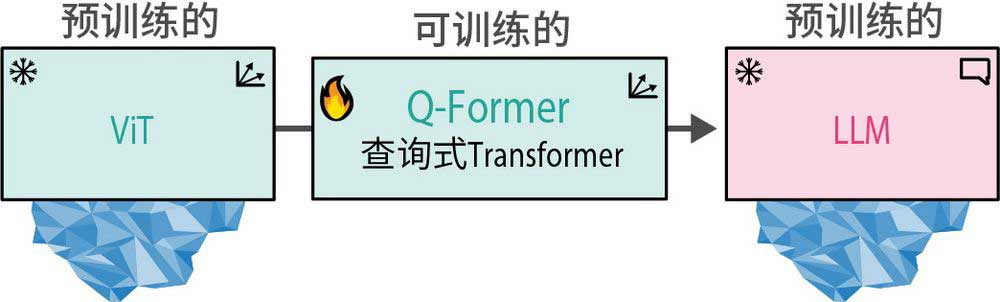

图9-16：Q-Former作为连接视觉（ViT）与文本（LLM）的桥梁，是系统中唯一需要训练的核心组件

为实现跨模态对接，Q-Former在架构设计上兼容双模态特性，包含两个共享注意力层的核心模块。

·图像Transformer：与冻结的ViT交互，提取深层视觉特征。

·文本Transformer：对接LLM，实现语义理解与生成。

该系统的训练流程分为两个阶段，针对两种模态分阶段优化。如图9-17所示，第一阶段使用图像 - 文本对（类似CLIP训练所用的图像和描述文本数据）进行联合表示学习，使模型同步掌握视觉与语言的对齐关系。

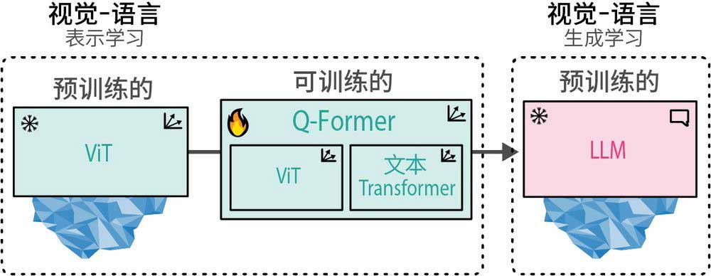

图9-17：步骤1通过表示学习同步构建视觉与语言的联合表示空间，步骤2将这些表示转化为软视觉提示词并输入LLM

图像首先被输入至冻结的ViT进行视觉特征提取。这些视觉嵌入随后作为Q-Former模块中ViT的输入，同时对应的描述文本则被输入至Q-Former的文本Transformer模块进行处理。

Q-Former通过这些输入接受训练，以完成三个目标任务。

**图像-文本对比学习**

该任务旨在对齐图像与文本的嵌入空间，通过最大化正例对的相似度实现跨模态关联。

**图像-文本匹配**

作为二分类任务，其目标是判断给定的图像 - 文本对是否构成正例（语义匹配）或负例（语义不匹配）。

**基于图像的文本生成**

训练模型根据视觉特征生成与输入图像内容相关的文本描述。

针对这三项目标进行联合优化，可有效提升从冻结ViT中提取的视觉表示的质量，其本质是通过文本信息对冻结ViT的嵌入空间进行语义注入，使其适配LLM的输入需求。

BLIP-2的步骤1具体如图9-18所示。

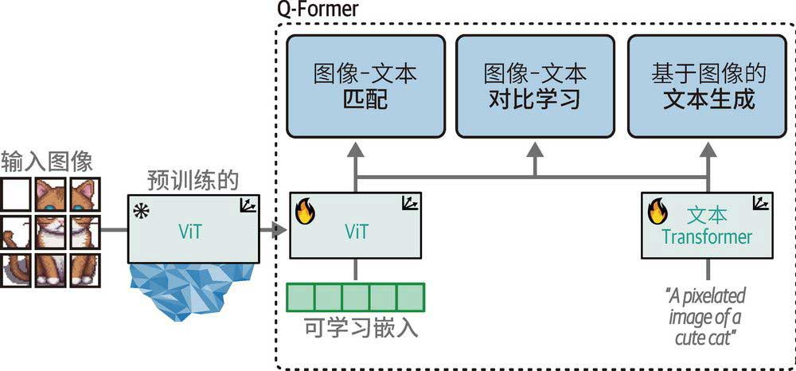

图9-18：步骤1中冻结的ViT输出与对应描述文本共同参与训练，通过三类对比任务学习视觉 - 文本联合表示

在步骤2中，经步骤1训练得到的可学习嵌入已具备与文本语义空间对齐的视觉信息。这些嵌入向量通过投影层输入LLM，本质上充当软视觉提示词，使LLM的生成过程受Q-Former提取的视觉表示调控。

特别地，系统通过全连接线性层对嵌入向量进行维度投影，确保其与LLM的输入维度兼容。这一视觉到语言的转换过程如图9-19所示。

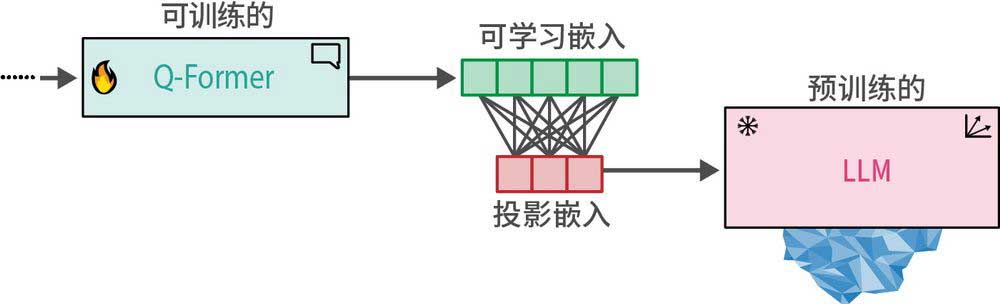

图9-19：步骤2中Q-Former学习到的嵌入向量经投影层输入预训练LLM，投影后的嵌入向量作为条件化生成的软视觉提示词

当我们将这些步骤有机结合时，Q-Former便能在同一维度空间中学习视觉与文本表示，作为LLM的软提示词。这使得LLM能够以类似于接收上下文提示词的方式，自然地融合图像信息。BLIP-2的完整实现流程见图9-20。

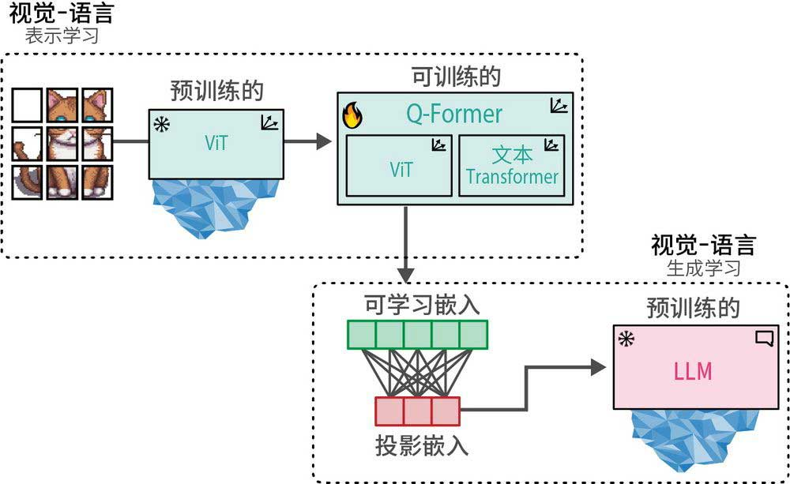

图9-20：BLIP-2的完整实现流程

1. Haotian Liu et al. “Visual Instruction Tuning.” Advances in Neural Information Processing Systems 36 (2024).

1. Hugo Laurençon et al. “What Matters when Building Vision-Language Models?” arXiv preprint arXiv: 2405.02246 (2024).

自BLIP-2问世以来，涌现出多个具有类似架构的视觉LLM，例如LLaVA，将文本LLM扩展为多模态的框架
 [](#footnote-18-53)，以及基于Mistral 7B构建的高效视觉LLM Idefics2
 [](#footnote-18-88)。尽管这些模型架构存在差异，但都采用预训练的类CLIP视觉编码器与文本LLM进行特征对接，其核心目标是将输入图像的视觉特征映射至语言嵌入空间，作为LLM的输入表示。这种思路与Q-Former殊途同归，均致力于弥合视觉模态与语言模态的语义鸿沟。

**9.3.2多模态输入预处理**

在深入探讨BLIP-2的构建原理后，我们发现这类模型具备丰富的应用场景，从图像描述生成、视觉问答，到复杂的提示工程任务均能胜任。

在具体实践前，让我们先完成模型加载并探索其使用方法：

```
from transformers import AutoProcessor, Blip2ForConditionalGeneration
import torch
# 加载处理器和主模型
blip_processor = AutoProcessor.from_pretrained("Salesforce/blip2-opt-2.7b")
model = Blip2ForConditionalGeneration.from_pretrained(
    "Salesforce/blip2-opt-2.7b",
    torch_dtype=torch.float16
)
# 将模型发送到GPU以加速推理
device = "cuda" if torch.cuda.is_available() else "cpu"
```

`model.to(device)
`

 通过model.vision_model和model.language_model这两个属性，我们可以查看BLIP-2模型加载时具体采用了哪种ViT和生成模型。

我们首先加载构成完整处理流程的两个核心组件：处理器和模型。处理器类似于语言模型中的分词器，其功能是将非结构化输入（例如图像和文本）转换为模型所需的规范化表示形式。

**1.图像预处理**

我们先了解处理器对图像的处理流程。这里我们以一张宽幅图像作为示例：

```
# 加载跑车图像
car_path = "https://raw.githubusercontent.com/HandsOnLLM/Hands-On-Large-
Language-Models/main/chapter09/images/car.png"
image = Image.open(urlopen(car_path)).convert("RGB")
image
```


该图像尺寸为520像素 × 492像素，属于相对少见的比例。我们可通过以下步骤观察处理器的运作机制：

```
# 预处理图像
inputs = blip_processor(image, return_tensors="pt").to(device, torch.float16)
inputs["pixel_values"].shape
```

由此我们可以得出以下形状：

```
torch.Size([1, 3, 224, 224])
```

最终得到的图像尺寸为224像素 × 224像素，这比原始输入尺寸缩小了许多。这意味着所有不同比例的原始图像都将被统一转换为正方形。因此需特别注意，当输入特别宽或特别高的图像时，可能会因尺寸调整而导致画面失真。

**2.文本预处理**

接下来我们深入解析处理器的文本处理机制。首先需要调用文本分词的专用工具——分词器：

```
blip_processor.tokenizer
```

经过处理，我们得到以下输出：

```
GPT2TokenizerFast(name_or_path='Salesforce/blip2-opt-2.7b', vocab_size=50265, model_max_length=1000000000000000019884624838656, is_fast=True, pad- ding_side='right', truncation_side='right', special_tokens={'bos_token': '</ s>', 'eos_token': '</s>', 'unk_token': '</s>', 'pad_token': '<pad>'}, clean_up_tokenization_spaces=True), added_tokens_decoder={
1: AddedToken("<pad>", rstrip=False, lstrip=False, single_word=False, normalized=True, special=True),
2: AddedToken("</s>", rstrip=False, lstrip=False, single_word=False, normalized=True, special=True),
}
```

此处的BLIP-2模型采用了GPT2Tokenizer。正如我们在第2章中所讨论的，不同的分词器处理输入文本的方式可能存在显著差异。

为深入理解GPT2Tokenizer的工作原理，我们可以通过一个短句进行演示。首先将句子转换为词元ID序列，再将其转换回词元：

```
# 预处理文本
text = "Her vocalization was remarkably melodic"
token_ids = blip_processor(image, text=text, return_tensors="pt")
token_ids = token_ids.to(device, torch.float16)["input_ids"][0]
# 将输入ID转换回词元
tokens = blip_processor.tokenizer.convert_ids_to_tokens(token_ids)
tokens
```

这将输出以下词元：

```
['</s>', 'Her', 'Ġvocal', 'ization', 'Ġwas', 'Ġremarkably', 'Ġmel', 'odic']
```

某些词元以特殊符号Ġ开头，这实际上代表空格。模型内部函数会将某些Unicode码位的字符值增加256，以便使其变为可打印字符，具体而言，空格字符（码位32）经过转换后就会呈现为Ġ符号（码位288）。

为便于直观理解，我们在展示时将其转换为下划线：

```
# 将空格词元替换为下划线
tokens = [token.replace("Ġ", "_") for token in tokens]
tokens
```

我们得到更美观的输出：

```
['</s>', 'Her', '_vocal', 'ization', '_was', '_remarkably', '_mel', 'odic']
```

在上述输出中，下划线表示词的起始位置。通过这种方式，由多个词元组成的词便能够被有效识别。

**9.3.3用例1：图像描述**

BLIP-2等模型最直观的应用就是为数据集中的图像生成描述文本。这类需求广泛存在于多个场景：服装电商可能需要为商品图自动生成卖点描述，摄影师则可能需要在短时间内完成上千张婚礼照片的自动化标注。

图像描述生成流程严格遵循标准处理范式。首先将图像转换为模型可识别的像素矩阵，这些视觉数据经过BLIP-2处理后会转换为软视觉提示词，供LLM解析并生成恰当的图像描述。

以跑车的图像为例，我们通过图像处理器将其转换为符合模型输入要求的像素矩阵：

```
# 加载一张AI生成的跑车图像
image = Image.open(urlopen(car_path)).convert("RGB")
# 将图像转换为输入并进行预处理
inputs = blip_processor(image, return_tensors="pt").to(device, torch.float16)
image
```


下一步是使用BLIP-2模型将图像转换为词元ID。随后，我们可将这些词元ID进一步转换为对应的文本描述，即通过模型生成的图像语义表示：

```
# 为图像生成将被传递给解码器（LLM）的词元ID
generated_ids = model.generate(**inputs, max_new_tokens=20)
# 从词元ID生成文本
generated_text = blip_processor.batch_decode(
    generated_ids, skip_special_tokens=True
)
generated_text = generated_text[0].strip()
generated_text
```

generated_text所包含的图像描述为：

```
an orange supercar driving on the road at sunset
```

这堪称对该图像的完美诠释！

在探讨更复杂的应用场景之前，图像描述任务为我们提供了一个绝佳的模型认知窗口。读者可自行尝试上传不同图像，观察模型在哪些情况下表现优异，哪些情况下存在识别局限。需要特别指出的是，某些专业领域的图像（例如特定卡通角色或虚构创作）可能无法被准确描述，这是因为模型主要是基于公开数据集进行训练的。

1. Roy Schafer. Psychoanalytic Interpretation in Rorschach Testing: Theory and Application (1954).

最后，我们来看一个有趣的示例，来自罗夏墨迹测验（Rorschach Test）的一张图像（如图9-21所示）。该测验源自一项古老的心理实验，旨在通过受试者对墨迹图像的感知解读其性格特征
 [](#footnote-18-92)。尽管这种通过视觉联想进行心理评估的方法颇具主观色彩，但正是这种开放性使其展现出独特的魅力。


图9-21：罗夏墨迹测验图像。你从中辨识出了哪些意象？

现在，让我们以图9-21中的测验图像作为输入示例：

```
# 加载测验图像
url = "https://upload.wikimedia.org/wikipedia/commons/7/70/Ror
schach_blot_01.jpg"
image = Image.open(urlopen(url)).convert("RGB")
# 生成描述
inputs = blip_processor(image, return_tensors="pt").to(device, torch.float16)
generated_ids = model.generate(**inputs, max_new_tokens=20)
generated_text = blip_processor.batch_decode(
    generated_ids, skip_special_tokens=True
)
generated_text = generated_text[0].strip()
generated_text
```

与之前相同，当我们查看generated_text变量时，就能看到模型生成的描述文本：

```
a black and white ink drawing of a bat
```

你应该完全能够理解模型为何会这样描述这张图像（“一张画着蝙蝠的黑白墨水画”）。既然这是一场测验，你认为这个回答反映出模型的哪些特性？

**9.3.4用例2：基于聊天的多模态提示词**

基于图像描述这一重要任务，我们仍能够进一步拓展其应用场景。在前述示例中，我们展示了如何将一种模态（图像）转换为另一种模态（描述文本）。

相较于遵循这种线性转换模式，我们可以尝试同时呈现两种模态——这种方法被称为视觉问答（visual question answering，VQA）。在此特定用例中，我们为模型提供一张图像及与之相关的问题，要求其进行解答。此时模型需要同步处理视觉信息与文本问题。

为演示这一过程，让我们从一张汽车图像开始，要求BLIP-2进行图像描述。首先需要按照先前多次操作的方式对图像进行预处理：

```
# 加载一张AI生成的跑车图像
image = Image.open(urlopen(car_path)).convert("RGB")
```

若要进行视觉问答任务，我们不仅需要向BLIP-2提供图像，还需输入相应的提示词。若缺少提示词，模型将如之前所述，仅生成图像描述。接下来，我们将引导模型对当前处理的图像进行描述：

```
# 视觉问答
prompt = "Question: Write down what you see in this picture. Answer:"
# 同时处理图像和提示词
inputs = blip_processor(image, text=prompt, return_tensors="pt").to(device, torch.float16)
# 生成文本
generated_ids = model.generate(**inputs, max_new_tokens=30)
generated_text = blip_processor.batch_decode(
    generated_ids, skip_special_tokens=True
)
generated_text = generated_text[0].strip()
generated_text
```

我们得到如下输出：

```
A sports car driving on the road at sunset
```

模型准确描述了这张图像的内容。不过这个例子较为基础，因为我们的提问本质上是在要求模型生成描述文本。我们还可以以对话形式追问。

为此，我们可以将之前的对话记录（包括模型对问题的回答）提供给模型，再提出后续问题：

```
# 类聊天式提示词
prompt = "Question: Write down what you see in this picture. Answer: A sports
car driving on the road at sunset. Question: What would it cost me to drive
that car? Answer:"
# 生成输出
inputs = blip_processor(image, text=prompt, return_tensors="pt").to(device, torch.float16)
generated_ids = model.generate(**inputs, max_new_tokens=30)
generated_text = blip_processor.batch_decode(
    generated_ids, skip_special_tokens=True
)
generated_text = generated_text[0].strip()
generated_text
```

我们得到如下输出：

```
$1,000,000
```

100万美元这个具体的数令人印象深刻！这展现了BLIP-2更趋近于聊天对话的特性，使我们能够展开妙趣横生的交流。

最后，我们可以借助ipywidgets构建交互式聊天机器人，让整个流程更加顺畅。ipywidgets作为Jupyter Notebook的扩展模块，支持创建交互式按钮、文本输入框等交互元素：

```
from IPython.display import HTML, display
import ipywidgets as widgets
def text_eventhandler(*args):
  question = args[0]["new"]
  if question:
    args[0]["owner"].value = ""
    # 创建提示词
    if not memory:
      prompt = " Question: " + question + " Answer:"
    else:
      template = "Question: {} Answer: {}."
      prompt = " ".join(
          [
              template.format(memory[i][0], memory[i][1])
              for i in range(len(memory))
          ]
      ) + " Question: " + question + " Answer:"
    # 生成文本
    inputs = blip_processor(image, text=prompt, return_tensors="pt")
    inputs = inputs.to(device, torch.float16)
    generated_ids = model.generate(**inputs, max_new_tokens=100)
    generated_text = blip_processor.batch_decode(
        generated_ids,
        skip_special_tokens=True
    )
    generated_text = generated_text[0].strip().split("Question")[0]
    # 更新记忆
    memory.append((question, generated_text))
    # 分配到输出
    output.append_display_data(HTML("<b>USER:</b> " + question))
    output.append_display_data(HTML("<b>BLIP-2:</b> " + generated_text))
    output.append_display_data(HTML("<br>"))
# 准备组件
in_text = widgets.Text()
in_text.continuous_update = False
in_text.observe(text_eventhandler, "value")
output = widgets.Output()
memory = []
# 显示聊天框
display(
    widgets.VBox(
        children=[output, in_text],
        layout=widgets.Layout(display="inline-flex", flex_flow="columnreverse"),
    )
)
```


通过延续当前对话和持续提问能力，我们实际上构建了一个具备图像理解能力的智能对话系统！

### 9.4 小结

本章系统探讨了连接文本与视觉表示的多种技术路径，揭示了LLM实现多模态能力的核心机制。首先解析了ViT的架构创新，重点阐述了图像编码器通过分块嵌入策略实现的多尺度图像表示能力。这种技术突破使模型能够有效捕捉从局部细节到全局语义的视觉信息。

在视觉 - 文本联合表示方面，我们深入剖析了CLIP模型的对比学习范式。该模型通过在共享嵌入空间中对齐图文特征，成功实现了零样本分类、跨模态检索等突破性应用。特别值得关注的是OpenCLIP开源实现，为多模态嵌入任务提供了灵活高效的技术方案。

针对多模态生成模型，本章着重解析了BLIP-2的创新架构，其核心创新在于将视觉特征动态投影至语言模型的语义空间，实现了视觉信息与文本生成的深度融合。这种架构不仅支持精准的图像描述生成，更开创了多模态对话交互的新范式。本章通过多个应用场景的展示，有力印证了多模态LLM在智能搜索、辅助创作等领域的变革性潜力。

本书第三部分将聚焦模型训练与优化技术。第10章将深入探讨文本嵌入模型的构建与微调方法，这是支撑语言模型应用的核心技术栈。后续章节将系统展开语言模型训练范式的全景解析，为读者构建完整的知识体系。


---

# 第三部分

# 训练和微调语言模型


---

## 第10章 构建文本嵌入模型

文本嵌入模型是许多强大的自然语言处理应用的基础，为增强文本生成模型等现有的强大技术奠定了基础。在本书中，我们已经将嵌入模型应用于多种场景，如监督分类、无监督分类、语义搜索等，甚至为ChatGPT等文本生成模型赋予记忆功能。

在自然语言处理领域，嵌入模型的重要性无论怎么强调都不为过，因为它们是众多应用背后的驱动力。因此，在本章中，我们将讨论多种构建和微调嵌入模型的方法，以提高其表征能力和语义能力。

我们首先了解一下什么是嵌入模型，以及它们通常是如何工作的。

### 10.1 嵌入模型

我们在很多章（第4章、第5章和第8章）中讨论过嵌入和嵌入模型，这充分说明了它们的实用性。在开始训练嵌入模型之前，我们先回顾一下嵌入模型的相关内容。

文本数据本身通常是非结构化的，很难处理。这些数据无法直接用于计算、可视化并生成可操作的结果。我们首先需要将文本数据转换成易于处理的形式，即数值表示。这个过程通常被称为嵌入（embedding），即对输入进行嵌入处理，以输出可用的向量，如图10-1所示。


图10-1：使用嵌入模型将文本输入（如文档、句子和短语）转换为数值表示，即嵌入

对输入进行嵌入通常由LLM执行，我们称之为**嵌入模型**。嵌入模型的主要目标是尽可能准确地将文本数据表示为嵌入向量。

什么是准确的表示呢？通常，我们想要捕捉文档的语义本质，即其含义。如果我们能够捕捉到文档传达的核心内容，就有望把握文档的主旨。在实践中，这意味着我们希望看到相似文档的向量彼此接近，而内容完全不相关的文档，其向量应该不同。我们在本书中已多次提及语义相似性这一概念，如图10-2所示。该图是一个简化的例子。虽然二维可视化有助于说明嵌入向量的接近度（proximity）和相似性（similarity），但这些嵌入向量通常存在于高维空间中。

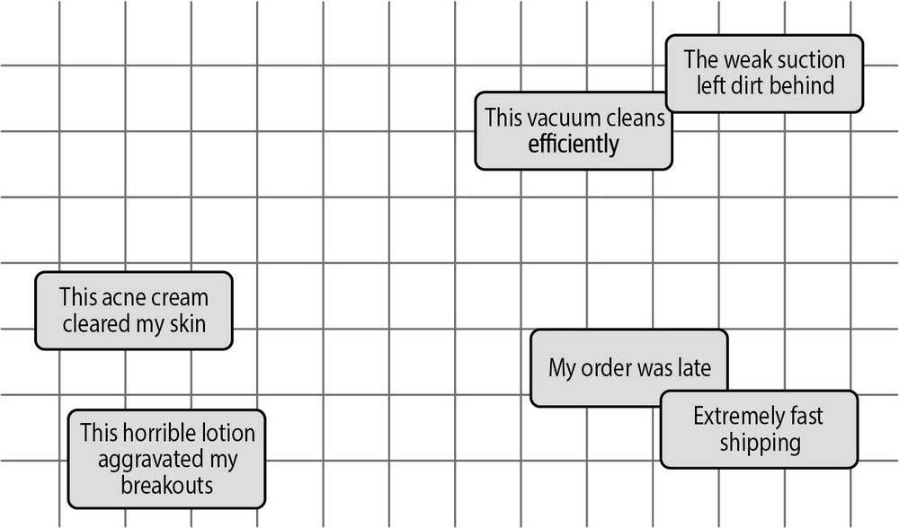

图10-2：语义相似性的理念是，我们期望具有相似含义的文本数据在*n*维空间中（这里展示了两个维度）彼此更接近

然而，嵌入模型可以针对多种目的进行训练。例如，在构建情感分类器时，我们更关注文本的情感倾向而非语义相似性。如图10-3所示，我们可以微调模型，使文档在*n*维空间中的距离基于它们的情感倾向而非语义特性。

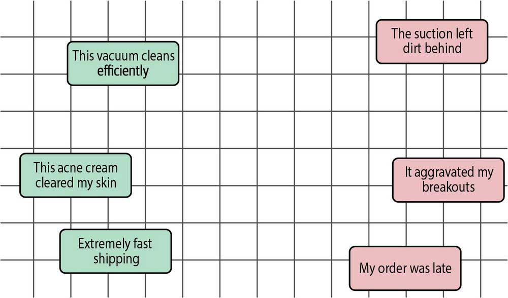

图10-3：除了语义相似性，嵌入模型还可以被训练以关注情感倾向。在该图中，负面评价（红色）彼此接近，并与正面评价（绿色）明显不同

无论如何，嵌入模型的目标都是学习使某些文档彼此相似的特征，而我们可以指导这个学习过程。通过向模型展示足够多的语义相似文档的示例，我们可以引导模型向语义分析的方向发展，而使用情感示例则会引导模型向情感分析的方向发展。

训练、微调和引导嵌入模型的方法很多，其中最强大且应用最广泛的技术是对比学习。

### 10.2 什么是对比学习

对比学习是训练和微调文本嵌入模型的一种主要技术。对比学习的目标是训练嵌入模型，使相似文档在向量空间中距离更近，而不相似文档相距更远。这看上去很熟悉，因为它与第2章中的word2vec方法非常相似。图10-2和图10-3也是对这一概念的运用。

对比学习的基本理念是，向模型输入相似的和不相似的文档对作为示例，这是学习文档之间的相似性或差异性并构建相关模型的最佳方式。为了准确地捕捉文档的语义特征，模型往往需要将一个文档与另一个文档进行对比，从而学习它们之间的相似之处或区别。这种对比过程非常有效，并且与文档写作的背景密切相关。图10-4展示了这一过程的整体框架。

1. Alan Garfinkel. Forms of Explanation: Rethinking the Questions in Social Theory. Yale University Press (1982).

1. Tim Miller. “Contrastive Explanation: A Structural-Model Approach.” The Knowledge Engineering Review 36 (2021): e14.

对比学习还可以通过解释的本质来理解。一个很好的例子是一则趣闻。一名记者问一个劫匪：“你为什么要抢银行？”劫匪回答：“因为银行里有钱。”
 [](#footnote-20-67)虽然这个答案在事实上是正确的，但记者的本意并不是问他为什么选择到银行抢劫，而是问他为什么要抢劫。这就叫作对比解释，指的是通过与其他选择进行对比来理解特定情况，即通过“为什么是P而不是Q”理解“为什么是P”
 [](#footnote-20-170)。在这个例子中，记者的问题可以有多种解释方式，而提供一个替代选项或许是最好的建模方式：“你为什么要抢银行（P）而不是遵守法律（Q）？”


图10-4：对比学习旨在教会嵌入模型判断文档之间的相似性。它通过向模型呈现具有不同程度相似性或差异性的文档组来实现这一目标

替代选项对于理解问题非常重要，在嵌入通过对比学习来进行学习时，替代选项同样非常重要。我们通过向模型展示相似的和不相似的文档对，让模型开始学习使这些文档相似或不相似的特征，更重要的是，明白为什么会这样。

例如，你可以通过让模型发现“尾巴”“鼻子”“四条腿”等特征来教会它理解什么是狗。这个学习过程可能相当困难，因为特征通常没有明确的定义，而且可以从多个角度进行解释。一个有“尾巴”和“鼻子”的“四条腿”的生物也可能是猫。为了帮助模型朝着我们感兴趣的方向发展，我们实际上是在问它：“为什么这是一只狗而不是一只猫？”我们通过提供两个概念之间的对比，让模型开始学习定义这个概念的特征，以及哪些特征与之无关。当将问题构建为对比形式时，我们能获得更多信息。图10-5进一步说明了对比解释的概念。

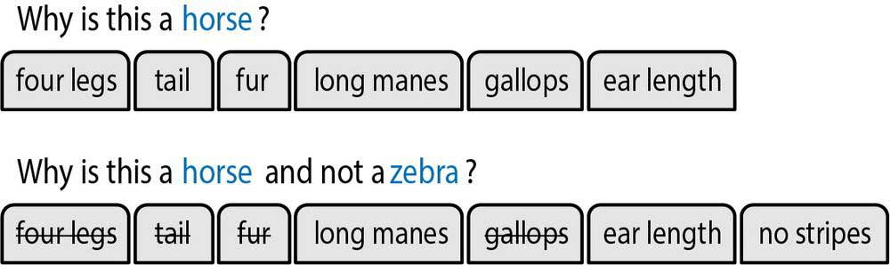

图10-5：当我们向嵌入模型输入不同的对比内容（不同程度的相似性）时，模型开始学习是什么让事物彼此不同，从而理解概念的独特特征


在自然语言处理领域，一个最早且最流行的对比学习的例子是我们在第1章和第2章中讨论过的word2vec。该模型通过在句子中训练单个词来学习词的表示。在一个句子中，靠近目标词的词被构建成正例对，而随机采样的词被构建成负例对（不相似的对）。换句话说，它通过将目标词的相邻词与非相邻词进行对比来训练模型。虽然并不广为人知，但这是自然语言处理领域利用神经网络进行对比学习的首批重大突破之一。

我们可以通过多种方式将对比学习应用于构建文本嵌入模型，最著名的技术和框架是sentence-transformers。

### 10.3 SBERT

1. Nils Reimers and Iryna Gurevych. “Sentence-BERT: Sentence Embeddings Using Siamese BERT-Networks.” arXiv preprint arXiv:1908.10084 (2019).

尽管对比学习有多种形式，但在自然语言处理领域，推广这种技术的一个框架是sentence-transformers
 [](#footnote-20-56)。该框架解决了原始BERT实现在创建句子嵌入时的一个主要问题，即计算开销。在sentence-transformers诞生前，句子嵌入通常使用交叉编码器（cross-encoder）架构，并结合BERT模型来实现。

交叉编码器允许两个句子同时通过Transformer网络进行处理，以预测两个句子的相似度。它通过在原始架构上添加分类头来实现这一点，该分类头可以输出相似度分数。然而，当你想在一个包含10000个句子的集合中找到相似度最高的配对时，计算量会迅速增加。这需要进行*n*·(*n*-1)/2=49995000次推理计算，因此会产生巨大的开销。此外，如图10-6所示，交叉编码器通常不会生成嵌入向量，而是输出输入句子之间的相似度分数。

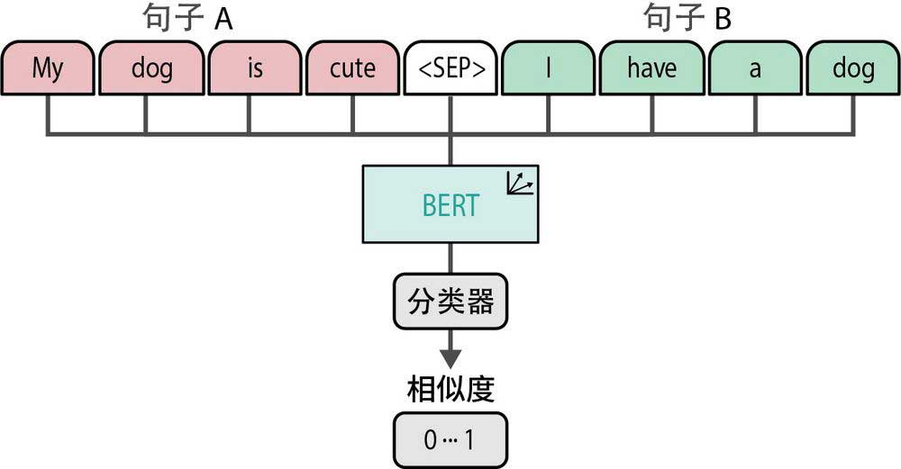

图10-6：交叉编码器的架构。两个句子被连接在一起，用<SEP>词元分隔，然后作为一个整体输入模型

1. Jeffrey Pennington, Richard Socher, and Christopher D. Manning. “GloVe: Global Vectors for Word Representation.” Proceedings of the 2014 Conference on Empirical Methods in Natural Language Processing (EMNLP). 2014.

降低上述开销的一种方法是通过计算BERT模型的输出层的平均值或使用[CLS]词元来生成嵌入向量。然而，这种方法的效果已被证明比简单地计算词向量的平均值（如GloVe
 [](#footnote-20-82)）还要差。

为解决这个问题，sentence-transformers的作者找到了一种方法来快速创建可以进行语义比较的嵌入向量，最终得到了一个优雅的方案来替代原始的交叉编码器架构。与交叉编码器不同，在sentence-transformers中，分类头被移除，取而代之的是在最终输出层上使用平均池化来生成嵌入向量。这个池化层通过对词嵌入取平均值，生成一个固定维度的输出向量，从而确保嵌入向量的大小固定。

sentence-transformers的训练使用孪生（siamese）架构。如图10-7所示，在这种架构中有两个完全相同的BERT模型，它们共享权重和神经网络架构。这两个模型接收句子作为输入，通过对词元嵌入进行池化来生成嵌入向量，然后根据句子嵌入的相似度进行优化。由于两个BERT模型的权重是相同的，因此我们可以使用单个模型，并依次输入句子。

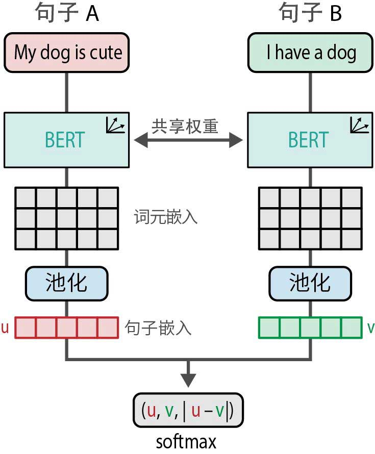

图10-7：原始sentence-transformers模型的架构，它采用了孪生网络（也称为双编码器）的结构

这些句子对的优化是通过损失函数完成的，而损失函数的设计会对模型性能产生重大影响。在训练过程中，每个句子的嵌入向量与它们之间的差向量会被拼接在一起，构成一个新的表示，然后softmax分类器对得到的嵌入向量进行优化。

这种架构也被称为双编码器（bi-encoder）或SBERT（sentence-BERT）。虽然双编码器的运算速度相当快并能创建精准的句子表示，但交叉编码器通常比双编码器具有更好的性能，并且无须生成嵌入向量。

双编码器和交叉编码器都基于对比学习。通过优化句子对之间的相似性或差异，模型最终学习到句子的本质特征。

要实现对比学习，需要两个条件。首先，需要构成相似 / 不相似对的数据。其次，需要明确模型如何定义和优化相似性。

### 10.4 构建嵌入模型

构建嵌入模型的方法有很多，我们通常采用对比学习。这对许多嵌入模型来说至关重要，因为通过对比学习，模型能够高效地学习语义表示。

然而，这不是一个“零成本”的过程。我们需要理解如何生成对比样本、如何训练模型，以及如何正确评估模型。

**10.4.1生成对比样本**

在预训练嵌入模型时，你会经常看到自然语言推理（NLI）数据集中的数据。NLI任务的目标是研究给定前提是否蕴含假设（蕴含）、是否与假设矛盾（矛盾）或者两者都不成立（中性）。

如图10-8所示，当前提是“He is in the cinema watching *Coco*”（他在电影院观看《寻梦环游记》），而假设是“He is watching *Frozen* at home”（他在家观看《冰雪奇缘》）时，这些陈述是矛盾的；当前提是“He is in the cinema watching *Coco*”（他在电影院观看《寻梦环游记》），而假设是“In the movie theater, he is watching the Disney movie *Coco*”（他在电影院观看迪士尼电影《寻梦环游记》）时，这些陈述是蕴含的。

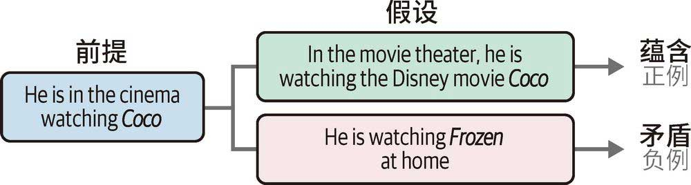

图10-8：我们可以利用NLI数据集的结构来生成用于对比学习的负例（矛盾）和正例（蕴含）

如果仔细观察“蕴含”和“矛盾”这两个概念，你会发现它们描述的是两个输入之间的相似度。因此，我们可以使用NLI数据集来生成对比学习所需的负例（矛盾）和正例（蕴含）。

在构建和微调嵌入模型的过程中，我们将使用来自通用语言理解评估基准（General Language Understanding Evaluation benchmark，简称GLUE基准）的数据。GLUE基准包含9个语言理解任务，用于评估和分析模型性能。

GLUE基准的任务之一是多类型自然语言推理（MNLI）语料库，它包含392702个有推理关系标注（矛盾、中性、蕴含）的句子对。我们将使用其中的50000个标注句子对来创建一个最小示例，这样就不需要长时间的训练。不过请注意，数据集越小，训练或微调嵌入模型就越不稳定。如果可能，在保证数据质量的前提下，最好使用更大的数据集：

```
from datasets import load_dataset
# 从GLUE加载MNLI数据集
# 0 = 蕴含，1 = 中性，2 = 矛盾
train_dataset = load_dataset(
    "glue", "mnli", split="train"
).select(range(50_000))
train_dataset = train_dataset.remove_columns("idx")
```

我们来看一个示例：

```
train_dataset[2]
{'premise': 'One of our number will carry out your instructions minutely.',
 'hypothesis': 'A member of my team will execute your orders with immense precision.',
 'label': 0}
```

这展示了一个前提和假设之间存在蕴含关系的示例，因为它们是正相关的，且含义几乎相同。

**10.4.2训练模型**

现在我们有了包含训练样本的数据集，接下来就可以创建嵌入模型了。通常我们会选择一个现有的sentence-transformers模型并进行微调，但在这个示例中，将从头开始训练一个嵌入模型。

这意味着我们必须明确两件事。首先，我们需要确定一个用于嵌入单词的预训练Transformer模型。我们将使用BERT基座模型（不区分大小写版）作为入门模型。当然，还有许多模型也经过了sentence-transformers的评估。最值得一提的是，当将microsoft/mpnet-base用作词嵌入模型时，通常能得到不错的结果：

```
from sentence_transformers import SentenceTransformer
# 使用一个基座模型
```

`embedding_model = SentenceTransformer('bert-base-uncased')
`

默认情况下，sentence-transformers中LLM的所有层都是可训练的。虽然可以冻结某些层，但通常不建议这样做，因为在所有层都解冻的情况下，模型性能往往更好。

其次，我们需要定义一个用于优化模型的损失函数。正如本节开始提到的，sentence-transformers最早使用的是softmax损失函数。为便于说明，我们先使用softmax，稍后再介绍性能更好的损失函数。

```
from sentence_transformers import losses
# 定义损失函数。在softmax损失函数中，我们还需要显式设置标签数量
train_loss = losses.SoftmaxLoss(
    model=embedding_model,
    sentence_embedding_dimension=embedding_model.get_sentence_embedding_dimension(),
    num_labels=3
)
```

在训练模型之前，我们定义一个评估器来评估训练过程中模型的性能，并根据评估结果保存表现最佳的模型。

我们可以使用语义文本相似度基准（Semantic Textual Similarity Benchmark，STSB）来评估模型的性能。这是一个由人工标注的句子对构成的数据集，相似度得分在1和5之间。

我们使用这个数据集来探索模型在语义相似度任务上的表现。此外，我们还要处理STSB数据，确保所有的值都在0和1之间。

```
from sentence_transformers.evaluation import EmbeddingSimilarityEvaluator
# 为STSB创建嵌入相似度评估器
val_sts = load_dataset("glue", "stsb", split="validation")
evaluator = EmbeddingSimilarityEvaluator(
    sentences1=val_sts["sentence1"],
    sentences2=val_sts["sentence2"],
    scores=[score/5 for score in val_sts["label"]],
    main_similarity="cosine",
)
```

现在我们有了评估器，接下来要创建SentenceTransformerTrainingArguments，这与使用Hugging Face Transformers进行训练类似（我们将在第11章中探讨）。

```
from sentence_transformers.training_args import SentenceTransformerTrainingArguments
# 定义训练参数
args = SentenceTransformerTrainingArguments(
    output_dir="base_embedding_model",
    num_train_epochs=1,
    per_device_train_batch_size=32,
    per_device_eval_batch_size=32,
    warmup_steps=100,
    fp16=True,
    eval_steps=100,
    logging_steps=100,
)
```

需要注意以下参数。

num_train_epochs

训练轮次。为了加快训练速度，我们将其设为1，但通常建议把这个值设置得大一些。

per_device_train_batch_size

在训练过程中每个设备（如GPU或CPU）同时处理的样本数量。一般来说，该参数的值越大，训练速度越快。

per_device_eval_batch_size

在评估过程中每个设备（如GPU或CPU）同时处理的样本数量。一般来说，该参数的值越大，评估速度越快。

warmup_steps

学习率从0线性增加到初始学习率所需的步数。注意，在本次训练过程中，我们没有指定自定义的学习率。

fp16

启用此参数后，我们可以进行混合精度训练，使用16位浮点数（FP16）而不是默认的32位浮点数（FP32）进行计算。这可以减少内存使用量并有可能提高训练速度。

至此，我们已经定义了数据、嵌入模型、损失函数和评估器，可以开始训练模型了。我们可以使用SentenceTransformerTrainer来训练模型：

```
from sentence_transformers.trainer import SentenceTransformerTrainer
# 训练嵌入模型
trainer = SentenceTransformerTrainer(
    model=embedding_model,
    args=args,
    train_dataset=train_dataset,
    loss=train_loss,
    evaluator=evaluator
)
trainer.train()
```

训练完模型后，我们可以使用评估器来获取这个任务的性能：

```
# 评估我们训练好的模型
evaluator(embedding_model)
{'pearson_cosine': 0.5982288436666162,
 'spearman_cosine': 0.6026682018489217,
 'pearson_manhattan': 0.6100690915500567,
 'spearman_manhattan': 0.617732600131989,
 'pearson_euclidean': 0.6079280934202278,
 'spearman_euclidean': 0.6158926913905742,
 'pearson_dot': 0.38364924527804595,
 'spearman_dot': 0.37008497926991796,
 'pearson_max': 0.6100690915500567,
 'spearman_max': 0.617732600131989}
```

1. 将代码中的原始值保留小数点后两位，或者四舍五入取小数点后两位。——译者注

在该过程中出现了几种不同的距离度量指标，我们最感兴趣的是pearson_cosine。它是中心化向量之间的余弦相似度，其值介于0和1之间，值越大表示相似度越高。我们得到的pearson_cosine的值为0.59
 [](#footnote-20-106)，它将在本章中作为基准值。

**10.4.3深入评估**

一个好的嵌入模型不仅仅能够在STSB测试中取得优异分数。正如上文所述，GLUE基准包含多个用于评估嵌入模型的任务。然而，用于评估嵌入模型的基准还有很多，为了统一评估过程，大规模文本嵌入基准（Massive Text Embedding Benchmark，MTEB）应运而生。MTEB涵盖8个嵌入任务，涉及58个数据集和112种语言。

为了公开比较前沿嵌入模型的性能，业界建立了MTEB排行榜，展示了各嵌入模型在相关任务上的得分。

```
from mteb import MTEB
# 选择评估任务
evaluation = MTEB(tasks=["Banking77Classification"])
# 计算结果
results = evaluation.run(model)
{'Banking77Classification': {'mteb_version': '1.1.2',
 'dataset_revision': '0fd18e25b25c072e09e0d92ab615fda904d66300',
 'mteb_dataset_name': 'Banking77Classification',
 'test': {'accuracy': 0.4926298701298701,
 'f1': 0.49083335791288685,
 'accuracy_stderr': 0.010217785746224237,
 'f1_stderr': 0.010265814957074591,
 'main_score': 0.4926298701298701,
 'evaluation_time': 31.83}}}
```

这为我们提供了针对特定任务的多个评估指标，我们可以利用这些指标来探索模型的性能。

MTEB的优点不仅在于任务和语言的多样性，还在于可以节省评估时间。尽管有许多嵌入模型，但我们通常需要高准确率与低延迟的模型。语义搜索等使用嵌入模型的任务通常需要快速推理。

由于在整个MTEB上测试模型可能需要几小时（取决于你的GPU），因此在本章中，我们将使用STSB来进行演示。


当你完成模型训练和评估后，重启Python环境很重要，这将为本章后续的训练示例清空显存。记得重启Python环境，确保所有显存都被清空。

**10.4.4损失函数**

我们使用softmax损失函数来训练模型，为的是说明最早的sentence-transformers模型是如何训练的。实际上，可供选择的损失函数种类繁多，我们通常不建议使用softmax，因为其他损失函数可能更高效。

我们不会详细介绍每一个损失函数，这里只介绍两个常用且表现普遍较好的损失函数：

·余弦相似度损失函数

·多负例排序损失函数


除了这里讨论的损失函数，还有许多损失函数可供选择。例如，MarginMSE损失函数非常适合训练或微调交叉编码器。sentence-transformers框架实现了许多有趣的损失函数。

**1.余弦相似度损失函数**

余弦相似度损失函数是一个直观且易用的损失函数，适用于多种用例和数据集。它通常用于语义文本相似度任务。在这些任务中，我们为文本对分配相似度分数，并据此优化模型。

我们不会严格区分句子对是正例还是负例，而是假设句子对在一定程度上相似或不相似。通常，这个值介于0和1之间，分别表示不相似和相似（见图10-9）。

余弦相似度损失函数的原理很简单——首先计算两段文本的两个嵌入向量之间的余弦相似度，然后将其与标注的相似度分数进行比较。模型将学会识别句子之间的相似度。

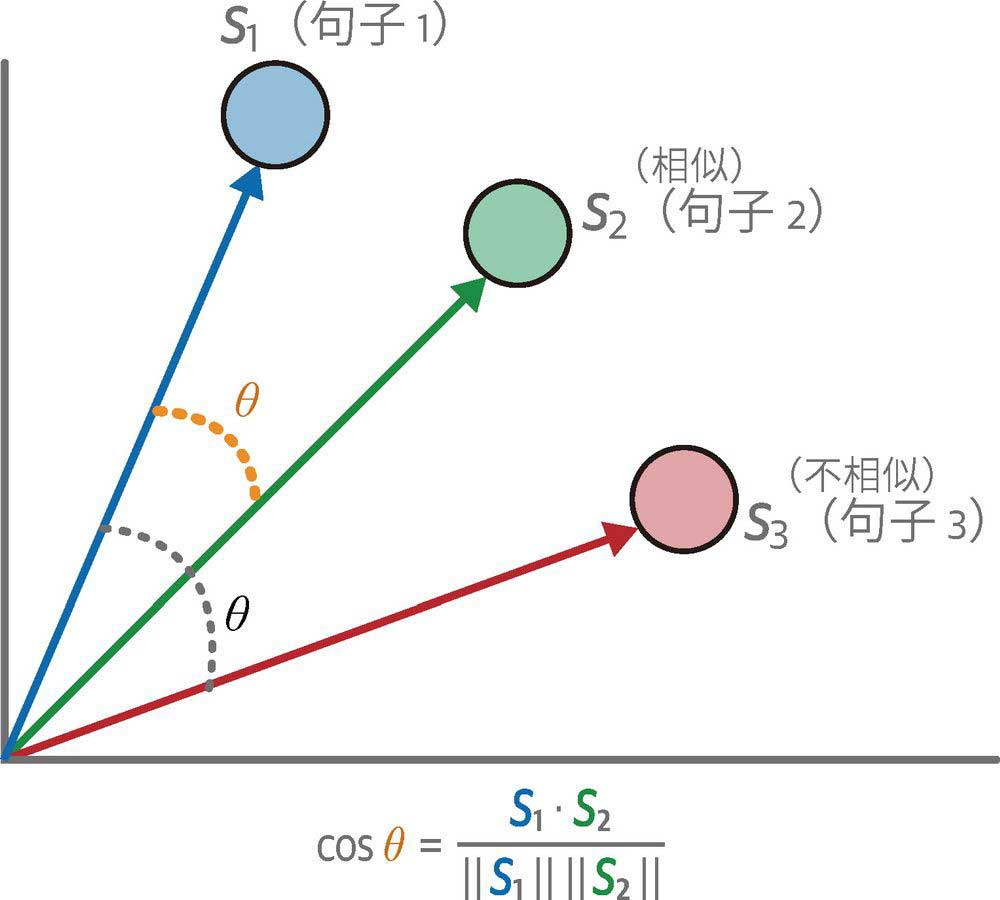

图10-9：余弦相似度损失函数的目标是最小化语义相似的句子之间的余弦距离，并最大化语义不相似的句子之间的余弦距离

余弦相似度损失函数最适合用于标注句子对数据，标注表示句子对之间的相似度，通常在0和1之间。要将余弦相似度损失函数用于NLI数据集，我们需要将蕴含（0）、中性（1）和矛盾（2）这3种标注转换为0和1之间的值。蕴含表示句子之间相似度高，所以我们将其相似度分数设为1。相比之下，中性和矛盾都表示相似度不高，所以我们将其相似度分数设为0。下面是使用余弦相似度损失函数的示例代码：

```
from datasets import Dataset, load_dataset
# 从GLUE加载MNLI数据集
# 0 = 蕴含, 1 = 中性, 2 = 矛盾
train_dataset = load_dataset(
    "glue", "mnli", split="train"
).select(range(50_000))
train_dataset = train_dataset.remove_columns("idx")
# 中性/矛盾 = 0，蕴含= 1
mapping = {2: 0, 1: 0, 0:1}
train_dataset = Dataset.from_dict({
    "sentence1": train_dataset["premise"],
    "sentence2": train_dataset["hypothesis"],
    "label": [float(mapping[label]) for label in train_dataset["label"]]
})
```

和之前一样，我们创建一个评估器：

```
from sentence_transformers.evaluation import EmbeddingSimilarityEvaluator
# 为STSB创建嵌入相似度评估器
val_sts = load_dataset("glue", "stsb", split="validation")
evaluator = EmbeddingSimilarityEvaluator(
    sentences1=val_sts["sentence1"],
    sentences2=val_sts["sentence2"],
    scores=[score/5 for score in val_sts["label"]],
    main_similarity="cosine"
)
```

然后，我们按照之前的步骤操作，但选择余弦相似度损失函数：

```
from sentence_transformers import losses, SentenceTransformer
from sentence_transformers.trainer import SentenceTransformerTrainer
from sentence_transformers.training_args import SentenceTransformerTrainingArguments
# 定义模型
embedding_model = SentenceTransformer("bert-base-uncased")
# 损失函数
train_loss = losses.CosineSimilarityLoss(model=embedding_model)
# 定义训练参数
args = SentenceTransformerTrainingArguments(
    output_dir="cosineloss_embedding_model",
    num_train_epochs=1,
    per_device_train_batch_size=32,
    per_device_eval_batch_size=32,
    warmup_steps=100,
    fp16=True,
    eval_steps=100,
    logging_steps=100,
)
# 训练模型
trainer = SentenceTransformerTrainer(
    model=embedding_model,
    args=args,
    train_dataset=train_dataset,
    loss=train_loss,
    evaluator=evaluator
)
trainer.train()
```

训练后评估模型，得到以下分数：

```
# 评估我们训练的模型
evaluator(embedding_model)
{'pearson_cosine': 0.7222322163831805,
 'spearman_cosine': 0.7250508271229599,
 'pearson_manhattan': 0.7338163436711481,
 'spearman_manhattan': 0.7323479193408869,
 'pearson_euclidean': 0.7332716434966307,
 'spearman_euclidean': 0.7316999722750905,
 'pearson_dot': 0.660366792336156,
 'spearman_dot': 0.6624167554844425,
 'pearson_max': 0.7338163436711481,
 'spearman_max': 0.7323479193408869}
```

pearson_cosine的值为0.72，与使用softmax损失函数的示例（pearson_cosine的值为0.59）相比有了很大的提升。这显示了损失函数对模型性能的影响。

请重启Python环境，下面我们将探索一个更常用且性能更好的损失函数，即多负例排序损失函数。

**2.多负例排序损失函数**

1. Matthew Henderson et al. “Efficient Natural Language Response Suggestion for Smart Reply.” arXiv preprint arXiv:1705.00652 (2017).

1. Aaron van den Oord, Yazhe Li, and Oriol Vinyals. “Representation Learning with Contrastive Predictive Coding.” arXiv preprint arXiv:1807.03748 (2018).

1. Ting Chen et al. “A Simple Framework for Contrastive Learning of Visual Representations.” International Conference on Machine Learning. PMLR, 2020.

多负例排序损失函数
 [](#footnote-20-9)也常被称为InfoNCE
 [](#footnote-20-22)或NTXentLoss
 [](#footnote-20-34)函数。它使用正例句子对或包含一对正例句子和一个不相关句子的三元组。这个不相关的句子被称为负例，它体现了正例句子与其他（不相关）内容之间的差异。

1. 因为它们语义紧密相关但形式多样，模型不一定容易识别。——编者注

例如，可能存在问题 / 答案、图片 / 图片说明、论文标题 / 论文摘要等配对样本。这些配对样本的特点在于，我们可以确信它们是难正例
 [](#footnote-20-66)（hard positive）对。在MNR损失函数中（见图10-10），负例对是通过将一个正例对中的元素与另一个正例对中的元素混合生成的。以论文标题和论文摘要为例，我们可以通过将一篇论文的标题与一个完全不相关的论文摘要组合起来生成负例对。这些负例被称为**批内负例**（in-batch negative），也可以用于生成三元组。

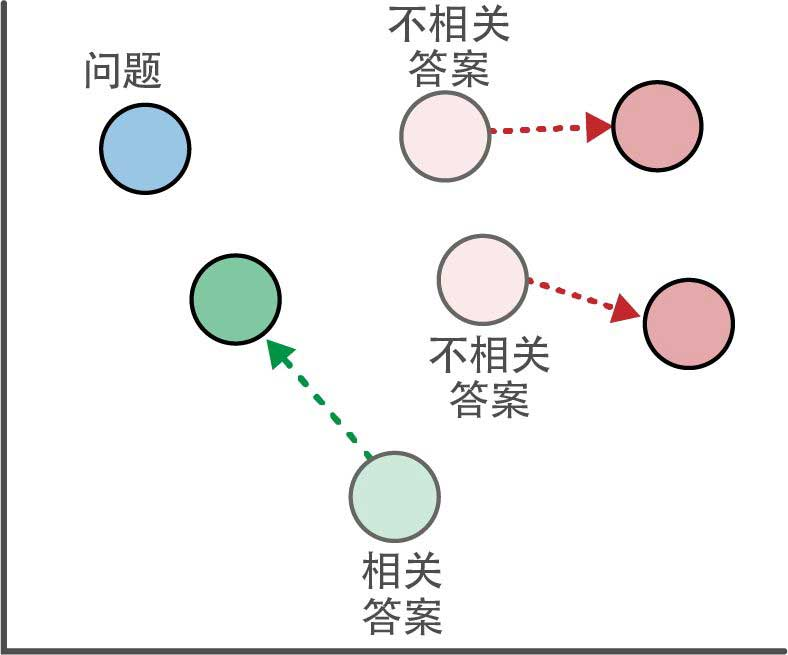

图10-10：MNR损失函数的目标是最小化相关文本对（如问题和相关答案）之间的距离，并最大化不相关文本对（如问题和不相关答案）之间的距离

在生成这些正例对和负例对之后，我们计算它们的嵌入向量和余弦相似度。相似度分数用于回答一个问题：这些文本对是负例对还是正例对？换句话说，这被视为一个分类任务，我们可以使用交叉熵损失来优化模型。

要构建三元组，我们首先从一个锚句（标注为premise）开始，用于与其他句子进行比较。然后，使用MNLI数据集，我们仅选择正例句子对（标注为entailment）。为了添加负例句子，我们随机采样句子作为hypothesis。

```
import random
from tqdm import tqdm
from datasets import Dataset, load_dataset
# 从GLUE加载MNLI数据集
mnli = load_dataset("glue", "mnli", split="train").select(range(50_000))
mnli = mnli.remove_columns("idx")
mnli = mnli.filter(lambda x: True if x["label"] == 0 else False)
# 准备数据并添加软负例
train_dataset = {"anchor": [], "positive": [], "negative": []}
soft_negatives = mnli["hypothesis"]
random.shuffle(soft_negatives)
for row, soft_negative in tqdm(zip(mnli, soft_negatives)):
    train_dataset["anchor"].append(row["premise"])
    train_dataset["positive"].append(row["hypothesis"])
    train_dataset["negative"].append(soft_negative)
train_dataset = Dataset.from_dict(train_dataset)
```

由于我们只选择了标注为entailment的句子，因此行数从50000减少到了16875。

接下来，我们定义一个评估器：

```
from sentence_transformers.evaluation import EmbeddingSimilarityEvaluator
# 为STSB创建嵌入相似度评估器
val_sts = load_dataset("glue", "stsb", split="validation")
evaluator = EmbeddingSimilarityEvaluator(
    sentences1=val_sts["sentence1"],
    sentences2=val_sts["sentence2"],
    scores=[score/5 for score in val_sts["label"]],
    main_similarity="cosine"
)
```

然后，我们像之前一样进行训练，但使用MNR损失函数：

```
from sentence_transformers import losses, SentenceTransformer
from sentence_transformers.trainer import SentenceTransformerTrainer
from sentence_transformers.training_args import SentenceTransformerTrainingArguments
# 定义模型
embedding_model = SentenceTransformer('bert-base-uncased')
# 损失函数
train_loss = losses.MultipleNegativesRankingLoss(model=embedding_model)
# 定义训练参数
args = SentenceTransformerTrainingArguments(
    output_dir="mnrloss_embedding_model",
    num_train_epochs=1,
    per_device_train_batch_size=32,
    per_device_eval_batch_size=32,
    warmup_steps=100,
    fp16=True,
    eval_steps=100,
    logging_steps=100,
)
# 训练模型
trainer = SentenceTransformerTrainer(
    model=embedding_model,
    args=args,
    train_dataset=train_dataset,
    loss=train_loss,
    evaluator=evaluator
)
trainer.train()
```

我们看看这个数据集和损失函数与之前的示例相比情况如何：

```
# 评估我们训练的模型
evaluator(embedding_model)
{'pearson_cosine': 0.8093892326162132,
 'spearman_cosine': 0.8121064796503025,
 'pearson_manhattan': 0.8215001523827565,
 'spearman_manhattan': 0.8172161486524246,
 'pearson_euclidean': 0.8210391407846718,
 'spearman_euclidean': 0.8166537141010816,
 'pearson_dot': 0.7473360302629125,
 'spearman_dot': 0.7345184137194012,
 'pearson_max': 0.8215001523827565,
 'spearman_max': 0.8172161486524246}
```

与我们之前使用余弦相似度损失函数训练的模型（pearson_cosine的值为0.72）相比，使用MNR损失函数训练的模型（pearson_cosine的值为0.80）似乎更加准确。


当使用MNR损失函数时，较大的批量大小通常表现更好，因为更大的批量会使任务更具挑战性。这是因为模型需要从更大的潜在句子对集合中找到最匹配的句子。你可以尝试设置不同的批量大小，以感受其效果。

我们使用MNR损失函数的方式存在一个缺点。由于负例是从其他问题 / 答案对中采样的，这些批内的或者说“简单”的负例可能与问题完全不相关，因此嵌入模型找到正确答案的任务变得相当容易。相反，我们希望有与问题非常相关但不是正确答案的负例。这样的负例被称为**难负例**（hard negative）。这会使嵌入模型的任务更具挑战性，因为它必须学习更细微的表示。因此，嵌入模型的性能通常会有显著提升。

下面是一个难负例的好例子。假设有这样一个问题：“How many people live in Amsterdam?”（阿姆斯特丹有多少人口？），与这个问题相关的一个答案是：“Almost a million people live in Amsterdam”（阿姆斯特丹的人口接近一百万）。要生成一个好的难负例，理想情况下答案应包含与阿姆斯特丹和该城市人口数量有关的信息。例如，“More than a million people live in Utrecht, which is more than Amsterdam”（乌得勒支的人口超过一百万，比阿姆斯特丹还多）。这个答案与问题相关，但不是真正的答案，所以这是一个好的难负例。图10-11展示了简单负例和难负例之间的差异。

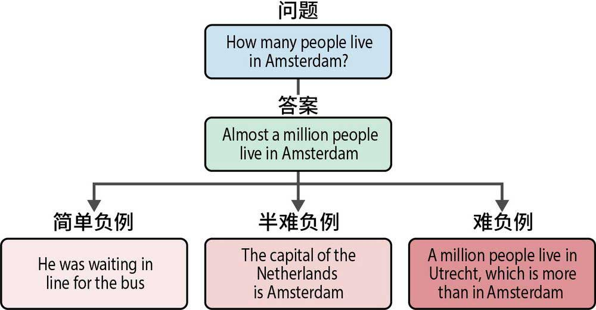

图10-11：简单负例通常与问题和答案都不相关。半难负例与问题和答案的主题有一些相似之处，但在某种程度上不相关。难负例与问题相关，但通常是错误答案

收集负例大致可以分为以下三个步骤。

·**获取简单负例**。像之前那样，通过随机采样文档来获取。

·**获取半难负例**。我们可以使用预训练的嵌入模型，对所有句子嵌入应用余弦相似度，以找到高度相关的句子。通常，这并不会生成难负例，因为这种方法仅会找到相似的句子，而不是问题 / 答案对。

·**获取难负例**。难负例通常需要手动标注（例如，通过生成半难负例的方式），或者使用生成模型来判断或生成句子对。

请重启Python环境，以便探索微调嵌入模型的不同方法。

### 10.5 微调嵌入模型

在10.4节中，我们介绍了从头开始训练嵌入模型的基础知识，并了解了如何利用损失函数来进一步优化其性能。这种方法虽然相当强大，但需要从头创建嵌入模型。这个过程可能相当耗费资源和时间。

相反，sentence-transformers框架允许几乎所有嵌入模型作为微调的基础。我们可以选择一个已经在大量数据上训练好的嵌入模型，并针对特定的数据或目的进行微调。

根据数据可用性和领域的不同，有多种微调模型的方法。我们将介绍其中的两种，并展示利用预训练嵌入模型的优势。

**10.5.1监督学习**

微调嵌入模型最直接的方法是重复之前的模型训练过程，但要将bert-base-uncased替换为预训练的sentence-transformers模型。有很多模型可供选择，但通常来说，all-MiniLM-L6-v2在许多用例中表现良好，而且由于规模较小，其运行速度非常快。

我们使用与MNR损失函数示例中相同的数据来训练模型，但这次使用预训练的嵌入模型进行微调。和之前一样，我们先加载数据并创建评估器：

```
from datasets import load_dataset
from sentence_transformers.evaluation import EmbeddingSimilarityEvaluator
# 从GLUE加载MNLI数据集
# 0 = 蕴含, 1 = 中性, 2 = 矛盾
train_dataset = load_dataset(
    "glue", "mnli", split="train"
).select(range(50_000))
train_dataset = train_dataset.remove_columns("idx")
# 为STSB创建嵌入相似度评估器
val_sts = load_dataset("glue", "stsb", split="validation")
evaluator = EmbeddingSimilarityEvaluator(
    sentences1=val_sts["sentence1"],
    sentences2=val_sts["sentence2"],
    scores=[score/5 for score in val_sts["label"]],
    main_similarity="cosine"
)
```

训练步骤与之前示例中的训练步骤类似，但我们可以使用预训练的嵌入模型来替代bert-base-uncased：

```
from sentence_transformers import losses, SentenceTransformer
from sentence_transformers.trainer import SentenceTransformerTrainer
from sentence_transformers.training_args import SentenceTransformerTrainingArguments
# 定义模型
embedding_model = SentenceTransformer('sentence-transformers/all-MiniLM-L6-v2')
# 损失函数
train_loss = losses.MultipleNegativesRankingLoss(model=embedding_model)
# 定义训练参数
args = SentenceTransformerTrainingArguments(
    output_dir="finetuned_embedding_model",
    num_train_epochs=1,
    per_device_train_batch_size=32,
    per_device_eval_batch_size=32,
    warmup_steps=100,
    fp16=True,
    eval_steps=100,
    logging_steps=100,
)
# 训练模型
trainer = SentenceTransformerTrainer(
    model=embedding_model,
    args=args,
    train_dataset=train_dataset,
    loss=train_loss,
    evaluator=evaluator
)
trainer.train()
```

对这个模型进行评估，我们得到以下分数：

```
# 评估我们训练的模型
evaluator(embedding_model)
{'pearson_cosine': 0.8509553350510896,
 'spearman_cosine': 0.8484676559567688,
 'pearson_manhattan': 0.8503896832470704,
 'spearman_manhattan': 0.8475760325664419,
 'pearson_euclidean': 0.8513115442079158,
 'spearman_euclidean': 0.8484676559567688,
 'pearson_dot': 0.8489553386816947,
 'spearman_dot': 0.8484676559567688,
 'pearson_max': 0.8513115442079158,
 'spearman_max': 0.8484676559567688}
```

0.85的分数是我们目前看到的最高分，但别忘了我们用于微调的预训练模型已经在完整的MNLI数据集上进行了训练，而我们只使用了50000个样本。这可能看起来有些多余，但这个示例演示了如何在自己的数据上微调预训练的嵌入模型。


除了使用预训练的BERT模型（如bert-base-uncased）或可能的领域外模型（如all-mpnet-base-v2），你也可以在预训练的BERT模型上执行掩码语言建模，将其适配到自己的目标领域，然后将这个经过微调的BERT模型作为基础训练嵌入模型。这是一种领域适配方法。在第11章中，我们将在预训练模型上应用掩码语言建模。

请注意，训练或微调模型的主要难点在于找到合适的数据。对于这些模型，我们不仅需要庞大的数据集，数据本身的质量也必须很高。开发正例对通常比较直接，但增加难负例对会显著加大创建高质量数据的难度。

和之前一样，请重启Python环境，为接下来的示例释放显存。

**10.5.2增强型SBERT**

训练或微调这些嵌入模型的一个缺点是它们通常需要大量的训练数据。许多这类模型是用超过十亿个句子对训练的。对于我们的用例而言，提取如此多的句子对通常是不可能的，因为在许多情况下，只有几千个标注数据点可用。

1. Nandan Thakur et al. “Augmented SBERT: Data Augmentation Method for Improving Bi-Encoders for Pairwise Sentence Scoring Tasks.” arXiv preprint arXiv:2010.08240 (2020).

幸运的是，有一种方法可以增强数据，使得我们在只有少量标注数据的情况下也能微调嵌入模型。这个过程被称为**增强型SBERT**
 [](#footnote-20-58)。

在这个过程中，我们的目标是增强少量的标注数据，使其可用于常规训练。增强型SBERT利用速度较慢但更精准的交叉编码器架构（BERT）来增强和标注更大的输入对集合。这些新标注的数据对随后被用于微调双编码器（SBERT）。

如图10-12所示，增强型SBERT包含以下步骤：

步骤1，使用小型标注数据集（黄金数据集）微调交叉编码器（BERT）；

步骤2，创建新的句子对；

步骤3，使用微调后的交叉编码器标注新的句子对（白银数据集）；

步骤4，在扩展数据集（黄金数据集 + 白银数据集）上训练双编码器（SBERT）。

这里，黄金数据集是一个规模较小但完全标注的数据集，包含真实标注。白银数据集也是完全标注的，但不一定是真实标注，因为它是通过交叉编码器的预测生成的。

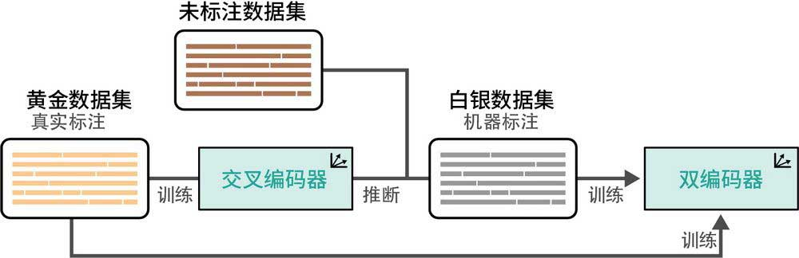

图10-12：增强型SBERT的工作原理是：先在小型黄金数据集上训练交叉编码器，然后用它来标注未标注数据集以生成更大的白银数据集。最后，同时使用黄金数据集和白银数据集来训练双编码器

在执行上述步骤之前，我们先准备数据。在原始的50000个文档中选取10000个文档组成小数据集，以模拟只有有限标注数据的情况。就像在余弦相似度损失函数的示例中那样，我们将蕴含的相似度分数设为1，而将中性和矛盾的相似度分数设为0。

```
import pandas as pd
from tqdm import tqdm
from datasets import load_dataset, Dataset
from sentence_transformers import InputExample
from sentence_transformers.datasets import NoDuplicatesDataLoader
# 为交叉编码器准备具有10000个文档的小数据集
dataset = load_dataset("glue", "mnli", split="train").select(range(10_000))
mapping = {2: 0, 1: 0, 0:1}
# 数据加载器
gold_examples = [
    InputExample(texts=[row["premise"], row["hypothesis"]], label=map
ping[row["label"]])
    for row in tqdm(dataset)
]
gold_dataloader = NoDuplicatesDataLoader(gold_examples, batch_size=32)
# 使用pandas DataFrame，以更方便地处理数据
gold = pd.DataFrame(
    {
    "sentence1": dataset["premise"],
    "sentence2": dataset["hypothesis"],
    "label": [mapping[label] for label in dataset["label"]]
    }
)
```

这就是黄金数据集，因为它是有标注的，且代表了我们的真实标注。

使用这个黄金数据集训练交叉编码器（步骤1）。

```
from sentence_transformers.cross_encoder import CrossEncoder
# 在黄金数据集上训练交叉编码器
cross_encoder = CrossEncoder("bert-base-uncased", num_labels=2)
cross_encoder.fit(
    train_dataloader=gold_dataloader,
    epochs=1,
    show_progress_bar=True,
    warmup_steps=100,
    use_amp=False
)
```

在训练完交叉编码器后，我们使用剩余的40000个句子对（来自包含50000个句子对的原始数据集）作为白银数据集（步骤2）。

```
# 通过使用交叉编码器预测标注来准备白银数据集
silver = load_dataset(
    "glue", "mnli", split="train"
).select(range(10_000, 50_000))
```

`pairs = list(zip(silver["premise"], silver["hypothesis"]))
`

如果你没有额外的未标注句子对，也可以从原始的黄金数据集中随机采样。例如，你可以从一行中取premise，从另一行中取hypothesis来创建新的句子对。这样你就可以轻松地生成10倍于原始数据的句子对，并用交叉编码器对其进行标注。

然而，这种策略可能生成明显更多的不相似的句子对而非相似的句子对。作为替代方案，我们可以使用预训练的嵌入模型来嵌入所有候选句子对，并通过语义搜索为每个输入句子检索排名前*k*的句子。这种粗略的重排序过程让我们能够关注那些可能更相似的句子对。尽管由于预训练的嵌入模型并未在我们的数据上训练过，这些句子的选择仍然基于近似，但这种方法比随机采样要好得多。

请注意，在这个示例中，我们假设这些句子对是未标注的。我们将使用经过微调的交叉编码器来标注这些句子对（步骤3）。

```
import numpy as np
# 使用经过微调的交叉编码器标注句子对
output = cross_encoder.predict(
    pairs, apply_softmax=True,
show_progress_bar=True
)
silver = pd.DataFrame(
    {
        "sentence1": silver["premise"],
        "sentence2": silver["hypothesis"],
        "label": np.argmax(output, axis=1)
    }
)
```

现在我们有了黄金数据集和白银数据集，只需要将它们组合，然后像之前那样训练我们的嵌入模型：

```
# 组合黄金数据集和白银数据集
data = pd.concat([gold, silver], ignore_index=True, axis=0)
data = data.drop_duplicates(subset=["sentence1", "sentence2"], keep="first")
train_dataset = Dataset.from_pandas(data, preserve_index=False)
```

和之前一样，我们需要定义一个评估器：

```
from sentence_transformers.evaluation import EmbeddingSimilarityEvaluator
# 为STSB创建嵌入相似度评估器
val_sts = load_dataset("glue", "stsb", split="validation")
evaluator = EmbeddingSimilarityEvaluator(
    sentences1=val_sts["sentence1"],
    sentences2=val_sts["sentence2"],
    scores=[score/5 for score in val_sts["label"]],
    main_similarity="cosine"
)
```

我们像之前一样训练模型，只是现在使用增强后的数据集：

```
from sentence_transformers import losses, SentenceTransformer
from sentence_transformers.trainer import SentenceTransformerTrainer
from sentence_transformers.training_args import SentenceTransformerTrainingArguments
# 定义模型
embedding_model = SentenceTransformer("bert-base-uncased")
# 损失函数
train_loss = losses.CosineSimilarityLoss(model=embedding_model)
# 定义训练参数
args = SentenceTransformerTrainingArguments(
    output_dir="augmented_embedding_model",
    num_train_epochs=1,
    per_device_train_batch_size=32,
    per_device_eval_batch_size=32,
    warmup_steps=100,
    fp16=True,
    eval_steps=100,
    logging_steps=100,
)
# 训练模型
trainer = SentenceTransformerTrainer(
    model=embedding_model,
    args=args,
    train_dataset=train_dataset,
    loss=train_loss,
    evaluator=evaluator
)
trainer.train()
```

最后，我们对模型进行评估：

```
evaluator(embedding_model)
{'pearson_cosine': 0.7101597020018693,
 'spearman_cosine': 0.7210536464320728,
 'pearson_manhattan': 0.7296749443525249,
 'spearman_manhattan': 0.7284184255293913,
 'pearson_euclidean': 0.7293097297208753,
 'spearman_euclidean': 0.7282830906742256,
 'pearson_dot': 0.6746605824703588,
 'spearman_dot': 0.6754486790570754,
 'pearson_max': 0.7296749443525249,
 'spearman_max': 0.7284184255293913}
```

余弦相似度损失函数示例的原始版本在使用完整数据集时得分为0.72，而我们仅使用其中20%的数据，就获得了0.71的分数！

这种方法能够扩展现有数据集的规模，而无须人工标注成千上万的句子对。你可以通过仅在黄金数据集上训练嵌入模型来测试白银数据集的质量。性能差异反映了白银数据集在提升模型质量方面具有多大的潜在作用。

请再次重启Python环境，我们将进入最后一个示例，即无监督学习。

### 10.6 无监督学习

1. Tianyu Gao, Xingcheng Yao, and Danqi Chen. “SimCSE: Simple Contrastive Learning of Sentence Embeddings.” arXiv preprint arXiv:2104.08821 (2021).

1. Fredrik Carlsson et al. “Semantic Re-tuning with Contrastive Tension.” International Conference on Learning Representations, 2021.

1. Kexin Wang, Nils Reimers, and Iryna Gurevych. “TSDAE: Using Transformer-based Sequential Denoising Auto-Encoder for Unsupervised Sentence Embedding Learning.” arXiv preprint arXiv:2104.06979 (2021).

1. Kexin Wang et al. “GPL: Generative Pseudo Labeling for Unsupervised Domain Adaptation of Dense Retrieval.” arXiv preprint arXiv:2112.07577 (2021).

要创建嵌入模型，我们通常需要标注数据。然而，并非所有现实世界的数据集都带可用的标注集。因此，我们转而寻找无须预定义标注就能训练模型的技术——无监督学习。目前存在许多方法，如SimCSE（Simple Contrastive Learning of Sentence Embeddings，句子嵌入的简单对比学习）
 [](#footnote-20-156)、CT（Contrastive Tension，对比张力）
 [](#footnote-20-186)、TSDAE（Transformer-based Sequential Denoising Auto-Encoder，基于Transformer的序列去噪自编码器）
 [](#footnote-20-269)和GPL（Generative Pseudo-Labeling，生成式伪标签）
 [](#footnote-20-309)。

在本节中，我们将重点介绍TSDAE，因为它在无监督任务和领域适配方面都表现出色。

**10.6.1TSDAE**

TSDAE是一种非常优雅的通过无监督学习创建嵌入模型的方法。该方法假设我们完全没有标注数据，也不要求我们人为创建标签。

TSDAE的基本思想是通过删除输入句子中一定比例的词来为其添加噪声。这个“受损”的句子被输入编码器中，编码器的上方有一个池化层，将其映射为句子嵌入。基于这个句子嵌入，解码器尝试重建原始句子，但不包含人为添加的噪声。这里的核心概念是：句子嵌入越准确，重建的句子就越准确。

这种方法与掩码语言建模非常相似。在掩码语言建模中，我们试图重建和学习某些被掩码的词。这里，我们不是重建被掩码的词，而是尝试重建整个句子。

训练完成后，我们可以使用编码器从文本生成嵌入向量，因为解码器仅用于判断嵌入向量是否能准确地重建原始句子（见图10-13）。

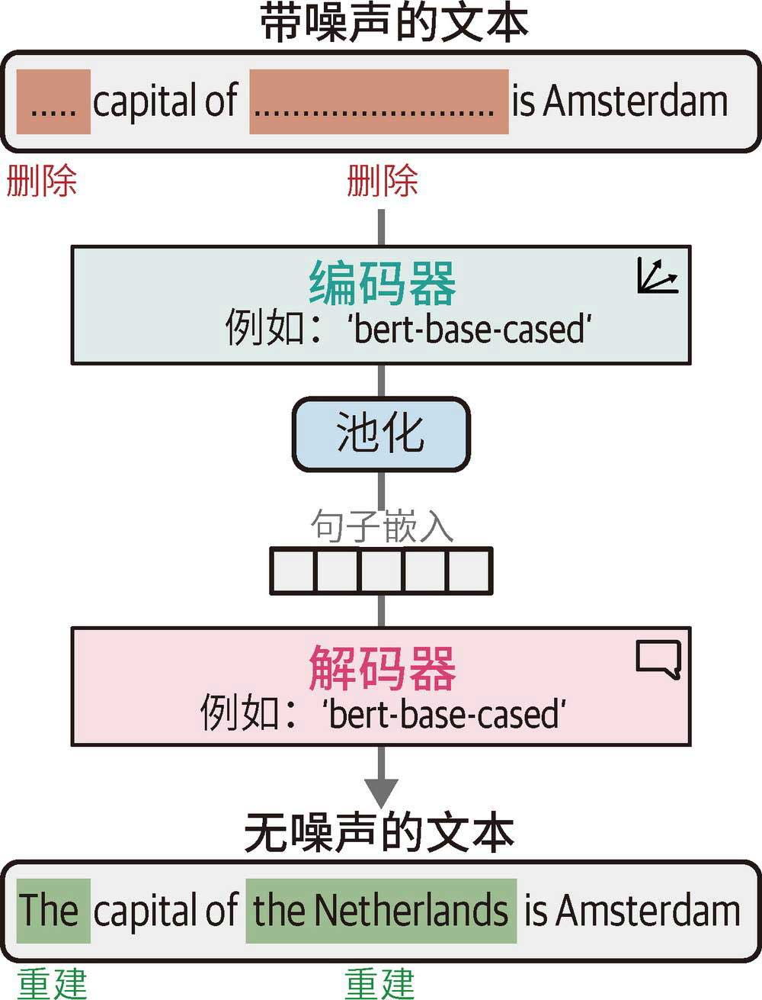

图10-13：TSDAE随机删除输入句子中的词，然后将这个句子传入编码器生成句子嵌入，再基于这个句子嵌入重建原始句子

由于我们只需要一组不带任何标注的句子，因此训练这个模型非常简单直接。首先，下载一个外部分词器，用于去噪过程：

```
# 下载额外的分词器
import nltk
nltk.download("punkt")
```

然后，从数据中创建普通的句子，并移除所有标签以模拟无监督的设置：

```
from tqdm import tqdm
from datasets import Dataset, load_dataset
from sentence_transformers.datasets import DenoisingAutoEncoderDataset
# 创建一个一维的句子列表
mnli = load_dataset("glue", "mnli", split="train").select(range(25_000))
flat_sentences = mnli["premise"] + mnli["hypothesis"]
# 为输入数据添加噪声
damaged_data = DenoisingAutoEncoderDataset(list(set(flat_sentences)))
# 创建数据集
train_dataset = {"damaged_sentence": [], "original_sentence": []}
for data in tqdm(damaged_data):
    train_dataset["damaged_sentence"].append(data.texts[0])
    train_dataset["original_sentence"].append(data.texts[1])
train_dataset = Dataset.from_dict(train_dataset)
```

这将创建一个包含50000个句子的数据集。当我们检查数据时，可以发现第一个句子是损坏的句子，第二个句子是原始句子。

```
train_dataset[0]
{'damaged_sentence': 'Grim jaws are.',
 'original_sentence': 'Grim faces and hardened jaws are not people-friendly.'}
```

第一个句子展示了带噪声的数据，而第二个句子展示了原始句子。创建数据后，我们像之前一样定义一个评估器：

```
from sentence_transformers.evaluation import EmbeddingSimilarityEvaluator
# 为STSB创建嵌入相似度评估器
val_sts = load_dataset("glue", "stsb", split="validation")
evaluator = EmbeddingSimilarityEvaluator(
    sentences1=val_sts["sentence1"],
    sentences2=val_sts["sentence2"],
    scores=[score/5 for score in val_sts["label"]],
    main_similarity="cosine"
)
```

接下来，我们像之前一样进行训练，但使用[CLS]词元作为池化策略，而不是对词元嵌入进行平均池化。在关于TSDAE的论文中，这被证明更有效，因为平均池化会丢失位置信息，而使用[CLS]词元则不会。

```
from sentence_transformers import models, SentenceTransformer
# 创建嵌入模型
word_embedding_model = models.Transformer("bert-base-uncased")
pooling_model = models.Pooling(word_embedding_model.get_word_embedding_dimension(), "cls")
embedding_model = SentenceTransformer(modules=[word_embedding_model, pooling_model])
```

使用我们的句子对，我们需要一个损失函数来尝试使用噪声句子重构原始句子，这个损失函数即DenoisingAutoEncoderLoss（去噪自编码器损失函数）。这样，模型将学习如何准确地表示数据。这类似于掩码操作，但不需要知道实际掩码的位置。

此外，我们绑定了两个模型的参数。编码器的嵌入层和解码器的输出层不使用单独的权重，而是共享权重。这意味着一个层的权重更新也会反映在另一个层中。

```
from sentence_transformers import losses
# 使用去噪自编码器损失函数
train_loss = losses.DenoisingAutoEncoderLoss(
    embedding_model, tie_encoder_decoder=True
)
train_loss.decoder = train_loss.decoder.to("cuda")
```

最后，与之前一样训练模型，但我们减小了批量大小，因为使用这个损失函数会增加内存使用量：

```
from sentence_transformers.trainer import SentenceTransformerTrainer
from sentence_transformers.training_args import SentenceTransformerTrainingArguments
# 定义训练参数
args = SentenceTransformerTrainingArguments(
    output_dir="tsdae_embedding_model",
    num_train_epochs=1,
    per_device_train_batch_size=16,
    per_device_eval_batch_size=16,
    warmup_steps=100,
    fp16=True,
    eval_steps=100,
    logging_steps=100,
)
# 训练模型
trainer = SentenceTransformerTrainer(
    model=embedding_model,
    args=args,
    train_dataset=train_dataset,
    loss=train_loss,
    evaluator=evaluator
)
trainer.train()
```

训练完成后，我们评估模型，以探索这种无监督技术的表现如何：

```
# 评估训练好的模型
evaluator(embedding_model)
{'pearson_cosine': 0.6991809700971775,
 'spearman_cosine': 0.713693213167873,
 'pearson_manhattan': 0.7152343356643568,
 'spearman_manhattan': 0.7201441944880915,
 'pearson_euclidean': 0.7151142243297436,
 'spearman_euclidean': 0.7202291660769805,
 'pearson_dot': 0.5198066451871277,
 'spearman_dot': 0.5104025515225046,
 'pearson_max': 0.7152343356643568,
 'spearman_max': 0.7202291660769805}
```

在拟合模型后，我们获得了0.70的分数。考虑到我们是使用无标注数据完成所有训练的，这个分数着实令人赞叹。

**10.6.2使用TSDAE进行领域适配**

当我们只有很少或完全没有标注数据时，通常使用无监督学习的方法来创建文本嵌入模型。然而，无监督学习技术的表现通常不如监督学习技术，而且难以学习特定领域的概念。

这时**领域适配**（domain adaptation）就派上用场了。它的目标是将现有的嵌入模型更新到一个包含不同于源领域主题的特定文本领域。图10-14展示了不同领域在内容上的差异。目标领域（域外）通常包含未在源领域（域内）中出现的词语和主题。

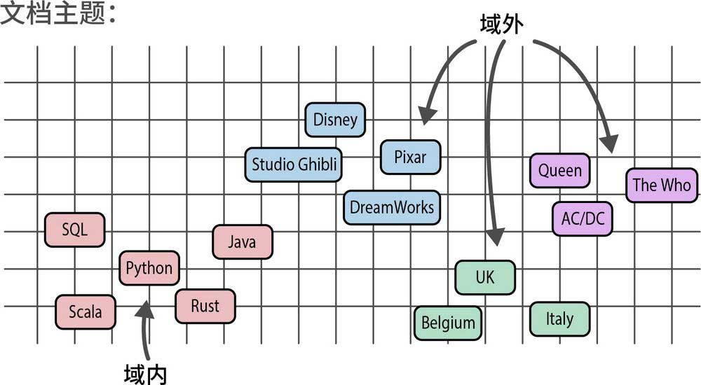

图10-14：领域适配的目标是创建一个嵌入模型，并使其从一个领域泛化到另一个领域

领域适配的一种方法称为自适应预训练。首先，使用无监督学习技术（如前面讨论的TSDAE或掩码语言建模）对特定领域的语料库进行预训练。然后，如图10-15所示，使用域内或域外的训练数据集对该模型进行微调。虽然目标领域的数据是首选，但由于我们从目标领域的无监督训练开始，域外数据也同样有效。

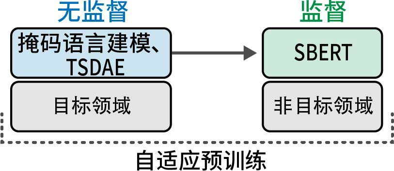

图10-15：领域适配可以通过自适应预训练和自适应微调来实现

运用本章所学的所有知识，你应该能够复现这个流程。首先，可以使用TSDAE在目标领域训练嵌入模型，然后使用常规监督训练或增强版SBERT进行微调。

### 10.7 小结

在本章中，我们探讨了通过多种任务创建和微调嵌入模型的方法。我们首先讨论了嵌入的概念及其在将文本数据表示为数值格式中的作用，然后探索了许多嵌入模型的基础技术，即对比学习，它主要从文档的相似 / 不相似对中学习。

基于流行的嵌入框架sentence-transformers，我们使用预训练的BERT模型创建了嵌入模型，并探索了多种损失函数，如余弦相似度损失函数和MNR损失函数。我们还讨论了收集文档的相似 / 不相似对或三元组对最终模型性能的重要性。

随后，我们研究了微调嵌入模型的技术。我们讨论了监督学习技术和无监督学习技术，如用于领域适配的增强版SBERT和TSDAE。与创建嵌入模型相比，微调通常需要较少的数据，是将现有嵌入模型适配到所需领域的一个很好的方法。

在第11章中，我们将讨论微调用于分类的表示模型的方法，涉及BERT模型和嵌入模型，还将介绍各种微调技术。


---

## 第11章 为分类任务微调表示模型

在第4章中，我们使用预训练模型完成了文本分类任务，当时完全保留了预训练模型的原始参数，没有进行任何调整。这种处理方式自然引出一个疑问：如果对这些模型进行微调，结果会如何？

实践证明，当具备充足数据时，微调通常能获得最佳性能。本章将系统讲解BERT模型的多种微调方法和应用场景。11.1节将演示微调分类模型的一般流程；11.2节将介绍SetFit方法——一种利用少量训练样本高效微调高性能模型的创新方案；11.3节将探索预训练模型的持续训练策略；11.4节将深入探讨词元级别的分类任务。

本章将重点探讨非生成式任务，生成模型的相关内容将留待第12章专门论述。

### 11.1 监督分类

回顾第4章，我们利用预训练的表示模型处理监督分类任务时，采用的模型可分为两类：专门用于情感分析的特定任务模型和用于创建嵌入向量的嵌入模型，如图11-1所示。

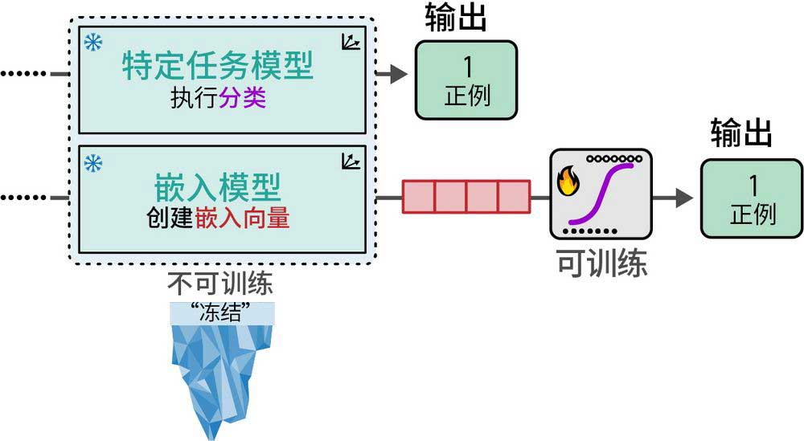

图11-1：第4章使用预训练模型进行分类时保持模型权重冻结状态

为充分展示预训练模型的分类潜力，两种模型均保持参数冻结（不可训练状态）。嵌入模型通过独立可训练的分类头（分类器）来实现影评情感预测。

本节将采用类似的架构，但允许模型参数与分类头在训练过程中同步更新。如图11-2所示，我们不再使用嵌入模型，而是直接微调预训练的BERT模型，以构建类似于我们在第4章中使用的特定任务模型。相较于嵌入模型方案，该方法将表示模型与分类头作为一个整体架构进行端到端微调。

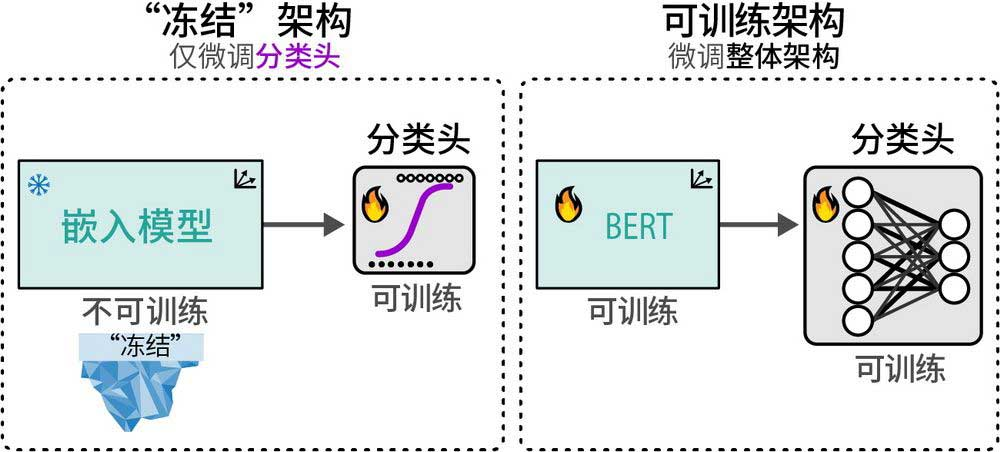

图11-2：相较于“冻结”架构方案，新方法实现了BERT模型与分类头的联合训练。反向传播过程将从分类头开始，逐层贯穿整个BERT模型

为此，我们不再冻结模型参数，而是允许其保持可训练状态，在训练过程中动态更新。如图11-3所示，我们将采用一个预训练的BERT模型作为基础架构，并为其添加一个神经网络分类头，二者都将通过微调来适应具体分类任务的需求。

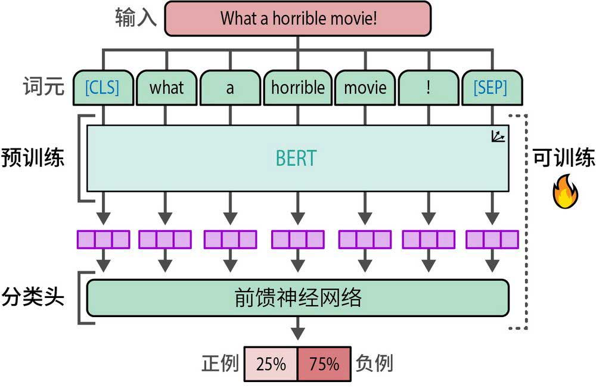

图11-3：面向特定任务的模型架构示意图。该架构由预训练的表示模型（如BERT）和针对任务设计的附加分类头组成

在实际训练过程中，预训练的BERT模型与分类头将共同进行参数更新。二者不再是彼此独立的训练组件，而是通过参数联动实现协同优化，从而生成更具判别力的语义表征。

**11.1.1微调预训练的BERT模型**

我们将沿用第4章使用的烂番茄数据集进行模型的微调。该数据集包含来自影评网站的5331条正面影评与5331条负面影评。

```
from datasets import load_dataset
# 准备数据并进行数据划分
tomatoes = load_dataset("rotten_tomatoes")
train_data, test_data = tomatoes["train"], tomatoes["test"]
```

1. Jacob Devlin et al. “BERT: Pre-Training of Deep Bidirectional Transformers for Language Understanding.” arXiv preprint arXiv:1810.04805 (2018).

分类任务的第一步是选择合适的基础模型。在本示例中，我们选用bert-base-cased模型，该模型已在英文维基百科和一个由未出版书籍组成的大型数据集上完成了预训练
 [](#footnote-21-82)。

我们需要预先确定想要预测的标签数量。这一步是必要的，因为要在预训练模型的基础上构建前馈神经网络。

```
from transformers import AutoTokenizer, AutoModelForSequenceClassification
# 加载模型和分词器
model_id = "bert-base-cased"
model = AutoModelForSequenceClassification.from_pretrained(
    model_id, num_labels=2
)
tokenizer = AutoTokenizer.from_pretrained(model_id)
```

接下来，我们将对数据进行分词处理：

```
from transformers import DataCollatorWithPadding
# 对批次中的序列进行填充，使其长度与最长序列一致
data_collator = DataCollatorWithPadding(tokenizer=tokenizer)
def preprocess_function(examples):
    """对输入数据进行分词处理"""
    return tokenizer(examples["text"], truncation=True)
# 对训练数据和测试数据进行分词处理
tokenized_train = train_data.map(preprocess_function, batched=True)
tokenized_test = test_data.map(preprocess_function, batched=True)
```

在构建训练器（Trainer）之前，我们需要准备一个专用的数据收集器（DataCollator）。数据收集器的主要功能是构建数据批次，同时支持数据增强技术的应用。

如第9章所述的分词处理流程，我们需要对输入文本进行填充操作，以确保生成大小一致的表示。这正是DataCollatorWithPadding工具的核心作用。

完整的训练示例还需要明确定义若干评估指标：

```
import numpy as np
from datasets import load_metric
def compute_metrics(eval_pred):
   """计算F1分数"""
   logits, labels = eval_pred
   predictions = np.argmax(logits, axis=-1)
   load_f1 = load_metric("f1")
   f1 = load_f1.compute(predictions=predictions, references=labels)["f1"]
   return {"f1": f1}
```

通过compute_metrics函数，我们可以定义任意数量的评估指标，这些指标在训练过程中被实时显示或记录保存。该功能对于监测模型训练尤为重要，因为它能帮助我们及时检测过拟合现象。

下面我们初始化Trainer对象：

```
from transformers import TrainingArguments, Trainer
# 用于参数调优的训练参数
training_args = TrainingArguments(
   "model",
   learning_rate=2e-5,
   per_device_train_batch_size=16,
   per_device_eval_batch_size=16,
   num_train_epochs=1,
   weight_decay=0.01,
   save_strategy="epoch",
   report_to="none"
)
# 执行训练过程的Trainer
trainer = Trainer(
   model=model,
   args=training_args,
   train_dataset=tokenized_train,
   eval_dataset=tokenized_test,
   tokenizer=tokenizer,
   data_collator=data_collator,
   compute_metrics=compute_metrics,
)
```

TrainingArguments类定义了模型调优所需的超参数，例如学习率与训练轮次（epochs），而Trainer则负责具体执行训练流程。

最后，我们训练模型并进行评估：

```
trainer.evaluate()
{'eval_loss': 0.3663691282272339,
 'eval_f1': 0.8492366412213741,
 'eval_runtime': 4.5792,
 'eval_samples_per_second': 232.791,
 'eval_steps_per_second': 14.631,
 'epoch': 1.0}
```

该模型的F1分数为0.85，这明显高于第4章中特定任务模型的F1分数（0.80）。这表明自行微调模型可能比直接使用预训练模型更具优势，整个训练过程仅需数分钟即可完成。

**11.1.2冻结层**

为进一步展示训练整个网络的重要性，以下示例将演示如何使用Hugging Face Transformers冻结网络的部分层。

本例将冻结BERT模型的主体结构，仅允许对分类头进行更新。这种对比实验设计极具参考价值，因为我们维持其他条件不变，仅对指定层进行冻结操作。

首先，我们需要重新初始化模型以重置参数状态：

```
# 加载模型和分词器
model = AutoModelForSequenceClassification.from_pretrained(
    model_id, num_labels=2
)
tokenizer = AutoTokenizer.from_pretrained(model_id)
```

我们预训练的BERT模型包含多个可冻结层。通过检查这些层，我们能够深入理解网络结构，并确定可能需要冻结的部分。

```
# 打印层的名称
for name, param in model.named_parameters():
    print(name)
bert.embeddings.word_embeddings.weight
bert.embeddings.position_embeddings.weight
bert.embeddings.token_type_embeddings.weight
bert.embeddings.LayerNorm.weight
bert.embeddings.LayerNorm.bias
bert.encoder.layer.0.attention.self.query.weight
bert.encoder.layer.0.attention.self.query.bias
...
bert.encoder.layer.11.output.LayerNorm.weight
bert.encoder.layer.11.output.LayerNorm.bias
bert.pooler.dense.weight
bert.pooler.dense.bias
classifier.weight
classifier.bias
```

该模型由12个（编号为0~11）编码器块构成，每个块均包含注意力头、前馈神经网络以及层归一化组件。图11-4详细地展示了该架构，并标注了所有可被冻结的模块。在基础架构上方还配置了独立的分类头模块。

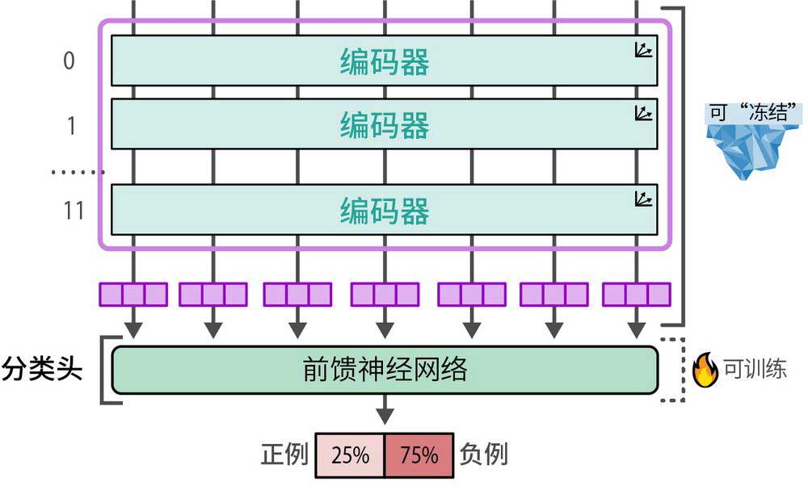

图11-4：BERT基础架构及其扩展分类头

通过选择性冻结特定网络层，我们能在提升计算效率的同时，仍使模型主体通过分类任务进行参数更新。在典型配置中，建议将冻结层与可训练层进行交替排列。

如第4章所述，我们将冻结除分类头之外的所有结构：

```
for name, param in model.named_parameters():
     # 可训练的分类头
     if name.startswith("classifier"):
        param.requires_grad = True
      # 冻结其他所有结构
     else:
        param.requires_grad = False
```

如图11-5所示，我们冻结了除前馈神经网络（分类头）之外的所有结构。

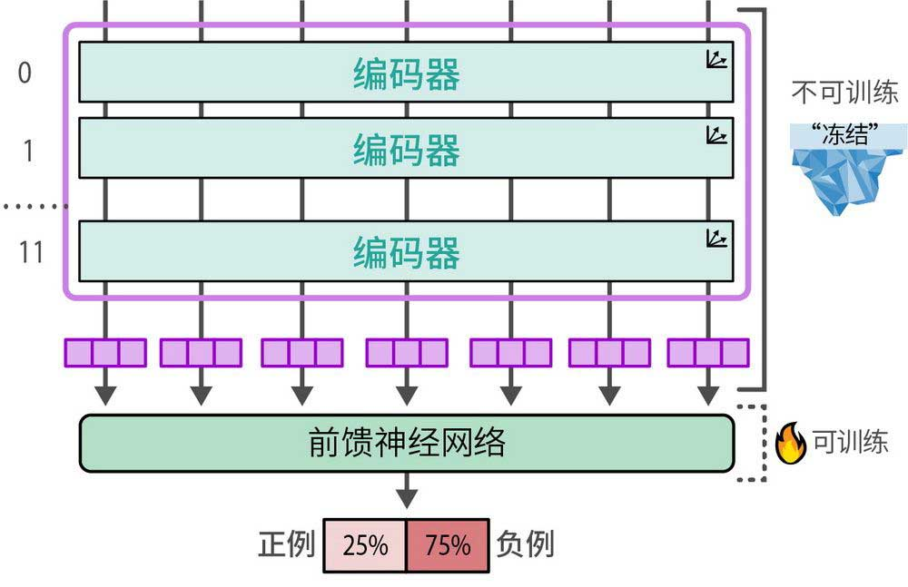

图11-5：我们冻结所有编码器块和嵌入层，使得BERT模型在微调过程中不会学习新的表示

在成功冻结除分类头之外的所有结构后，即可继续进行模型训练：

```
from transformers import TrainingArguments, Trainer
# 执行训练过程的Trainer
trainer = Trainer(
   model=model,
   args=training_args,
   train_dataset=tokenized_train,
   eval_dataset=tokenized_test,
   tokenizer=tokenizer,
   data_collator=data_collator,
   compute_metrics=compute_metrics,
)
trainer.train()
```

你可能已经注意到训练速度明显提升。这是因为我们仅对分类头进行训练，相比微调整个模型，这能显著提升训练速度。

```
trainer.evaluate()
{'eval_loss': 0.6821751594543457,
 'eval_f1': 0.6331058020477816,
 'eval_runtime': 4.0175,
 'eval_samples_per_second': 265.337,
 'eval_steps_per_second': 16.677,
 'epoch': 1.0}
```

该模型的F1分数仅为0.63，相较于最初的分数（0.85）显著下降。与其冻结几乎所有层，不如如图11-6所示，仅冻结前10个编码器块，然后观察这种调整对模型性能的影响。这种策略的显著优势在于：既能有效降低计算开销，又能使梯度更新通过部分预训练模型进行反向传播。

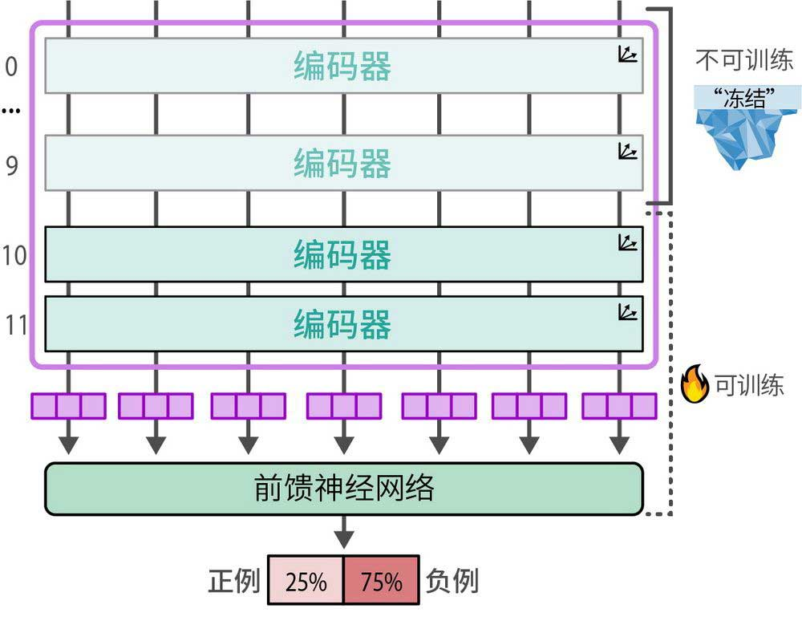

图11-6：我们仅冻结BERT模型的前10个编码器块，其余部分均为可训练的并将进行微调

```
# 加载模型
model_id = "bert-base-cased"
model = AutoModelForSequenceClassification.from_pretrained(
    model_id, num_labels=2
)
tokenizer = AutoTokenizer.from_pretrained(model_id)
# 编码器块11从索引165开始
# 我们冻结该块之前的所有结构
for index, (name, param) in enumerate(model.named_parameters()):
    if index < 165:
        param.requires_grad = False
# 执行训练过程的Trainer
trainer = Trainer(
   model=model,
   args=training_args,
   train_dataset=tokenized_train,
   eval_dataset=tokenized_test,
   tokenizer=tokenizer,
   data_collator=data_collator,
   compute_metrics=compute_metrics,
)
trainer.train()
```

在完成训练后，我们对模型性能进行全面评估：

```
trainer.evaluate()
{'eval_loss': 0.40812647342681885,
 'eval_f1': 0.8,
 'eval_runtime': 3.7125,
 'eval_samples_per_second': 287.137,
 'eval_steps_per_second': 18.047,
 'epoch': 1.0}
```

该模型的F1分数为0.8，这比我们之前冻结全部层时取得的0.63有了显著提升。这一结果表明，尽管我们通常会优先考虑训练尽可能多的层，但在计算资源受限的情况下，仅训练部分层仍能取得可接受的效果。

为进一步验证这种效果，我们延续之前的实验范式，逐步冻结编码器块并实施微调操作，同时评估模型性能。如图11-7所示，仅需训练前5个编码器块（垂直虚线标注位置）即可获得接近完整训练所有编码器块的性能表现。

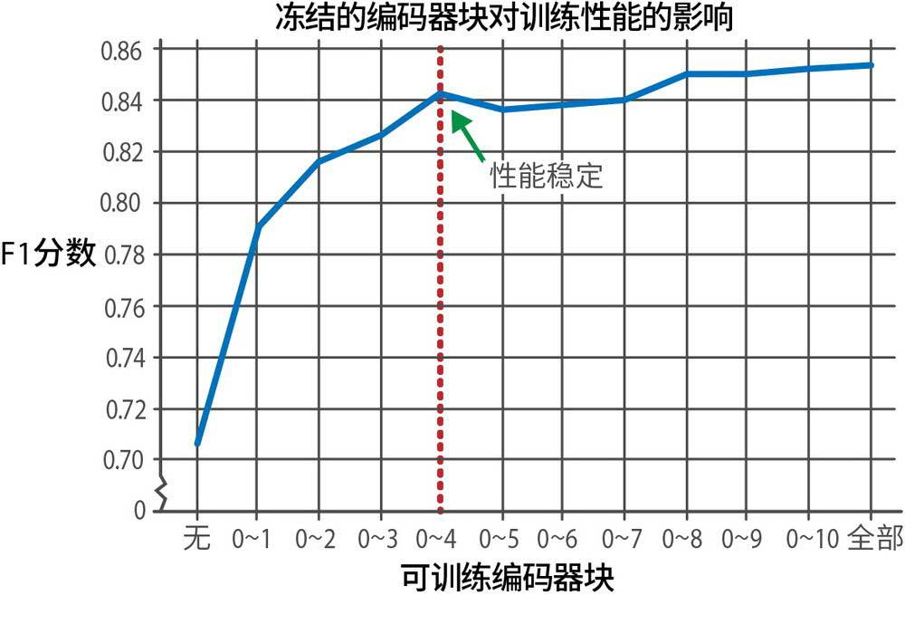

图11-7：冻结特定编码器块对模型性能的影响。训练更多模块带来的性能提升会快速趋于平缓


 随着训练轮次的增加，冻结与不冻结策略在训练耗时和资源消耗方面的差异将越发显著。因此建议尝试不同的冻结配置方案，在性能与效率之间找到最优平衡点。

### 11.2 少样本分类

少样本分类作为监督学习分类的一种特殊技术，能使分类器仅通过少量标注样本即可学习并识别不同的目标标签。对于缺乏现成的标注数据的分类任务而言，这种技术尤为实用。这种技术的核心思想是通过为每个类别精心标注少量高质量的数据点来完成模型训练。图11-8直观地展示了基于少量标注数据进行模型训练的方法。

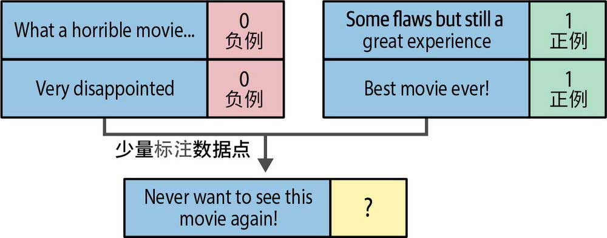

图11-8：少样本分类仅需少量标注数据即可完成模型训练

**11.2.1SetFit：少样本场景下的高效微调方案**

1. Lewis Tunstall et al. “Efficient Few-Shot Learning without Prompts.” arXiv preprint arXiv:2209.11055 (2022).

为实现少样本文本分类，我们采用名为SetFit的高效框架
 [](#footnote-21-28)。该框架基于sentence-transformers架构构建，能够在训练过程中动态优化文本表示质量。仅需少量标注样本，SetFit框架的表现即可媲美前文示例中基于大规模标注数据集微调的BERT模型。

SetFit的核心算法流程包含三个关键阶段。

·**采样训练数据**。通过对标注数据的类内与类间样本选择，生成包含正例（相似）与负例（不相似）的句子对。

·**微调嵌入模型**。利用生成的训练数据，对预训练的嵌入模型进行微调。

·**训练分类器**。在优化后的嵌入模型的基础上构建分类头，并使用之前生成的训练数据对其进行训练。

在微调嵌入模型之前，我们需要生成训练数据。该模型假设训练数据为包含正例（相似）和负例（不相似）的句子对。然而，当我们处理分类任务时，原始输入数据通常并不具备此类标签。

以图11-9所示的训练数据集为例，该数据集将文本分为两类：关于编程语言的文本和关于宠物的文本。

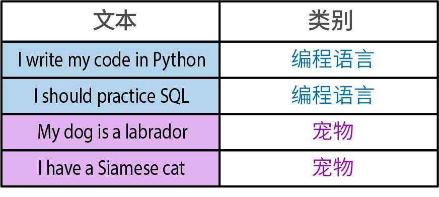

图11-9：两个类别的数据：关于编程语言的文本和关于宠物的文本

如步骤1所示（见图11-10），SetFit通过类内和类间的选择机制生成所需数据。例如，在有16个运动类句子的情况下，我们可创建16 × (16-1)/2=120个正例句子对，通过跨类别采样创建负例句子对。

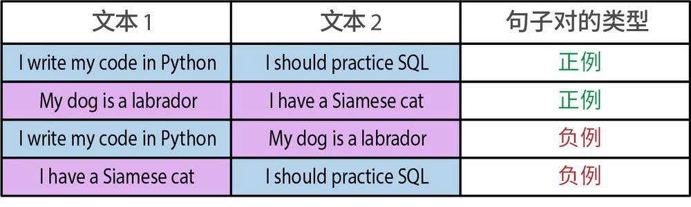

图11-10：步骤1，采样训练数据。我们假设同一类别内的句子具有相似性并构建正例对，不同类别中的句子则构成负例对

步骤2的核心是利用生成的句子对微调嵌入模型。具体而言，我们采用对比学习方法对预训练的BERT模型进行微调。正如第10章所述，对比学习可通过正例（相似的句子对）和负例（不相似的句子对）的对比训练，获得精准的句子嵌入。

由于步骤1已生成所需的句子对，因此我们可以直接使用这些数据微调SentenceTransformer模型。虽然对比学习的概念前文已有阐述，但为便于理解，图11-11仍对此方法进行了可视化说明。

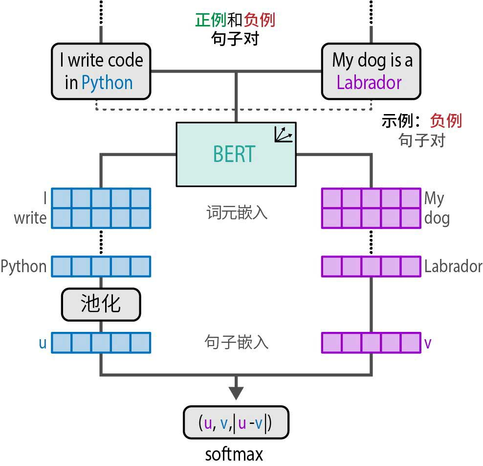

图11-11：步骤2，微调SentenceTransformer模型。通过对比学习，从正例和负例句子对中学习嵌入向量

微调嵌入模型的目标是使其生成适应分类任务的嵌入向量。通过微调嵌入模型，类别的相关性及其相对关系被提炼至嵌入向量中。

在步骤3中，我们为所有句子生成嵌入向量，并将这些嵌入向量作为分类器的输入。我们可以使用微调后的SentenceTransformer模型将句子转化为嵌入向量，作为特征使用。分类器通过学习经过优化的嵌入向量，实现对未知句子的准确预测。步骤3的流程如图11-12所示。

通过整合所有步骤，我们最终构建出一个高效且优雅的流程，能够在每个类别仅有少量标注数据的情况下完成分类任务。该流程巧妙地利用了现有的标注数据资源，尽管这些数据与目标任务并不完全匹配。图11-13整合了三个步骤，完整展示了SetFit在少样本场景下的全流程架构。

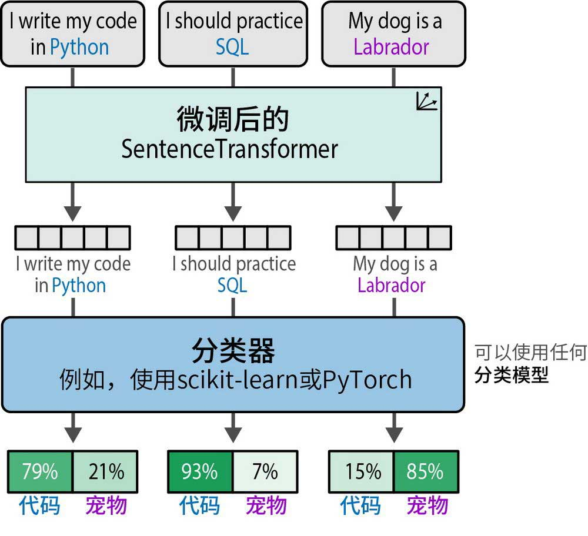

▲图11-12：步骤3，训练分类器。可选择任意scikit-learn提供的分类模型或分类头作为分类器

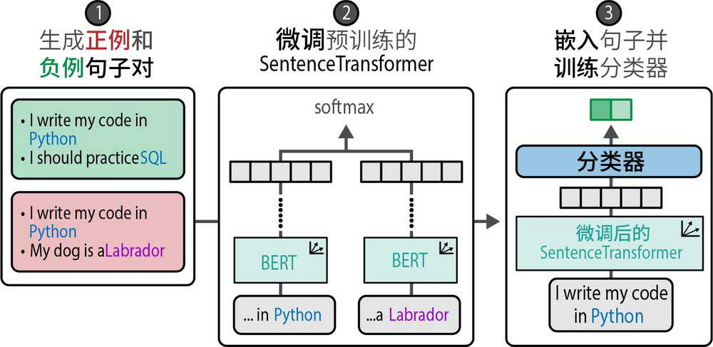

▲图11-13：SetFit的三个核心阶段

SetFit的具体实现包含三个核心阶段：首先，通过类内和类间选择生成句子对；其次，利用这些句子对微调预训练的SentenceTransformer模型；最后，采用微调后的模型生成句子嵌入，并基于此训练分类器。

**11.2.2少样本分类的微调**

在前述示例中，我们在包含约8500条影评的数据集上进行训练。然而，由于这是一个少样本学习场景，我们仅需从每个类别中抽取16个样本。对于二分类任务，这意味着仅使用32个句子即可完成训练。相较于常规训练所需的8500条影评，样本规模缩减了3个数量级，差异尤为显著。

```
from setfit import sample_dataset
# 我们通过从每个类别中抽取16个样本来模拟少样本设置
sampled_train_data = sample_dataset(tomatoes["train"], num_samples=16)
```

在完成数据采样后，我们将选取预训练的SentenceTransformer模型进行微调。官方文档提供了预训练的SentenceTransformer模型的详细列表，本次选用的是sentence-transformers/all-mpnet-base-v2。该模型在MTEB排行榜中名列前茅，MTEB排行榜全面展示了嵌入模型在语义搜索、聚类分析等多类任务中的性能表现。

```
from setfit import SetFitModel
# 加载预训练的SentenceTransformer模型
model = SetFitModel.from_pretrained("sentence-transformers/all-mpnet-base-v2")
```

加载预训练的SentenceTransformer模型后，我们即可创建训练器SetFitTrainer了。该训练器默认采用逻辑回归模型作为待训练的分类器。

与使用Hugging Face Transformers时的操作类似，我们可以通过训练器来配置相关参数。例如将num_epochs参数设为3，这意味着对比学习过程将完成3轮迭代训练。

```
from setfit import TrainingArguments as SetFitTrainingArguments
from setfit import Trainer as SetFitTrainer
# 定义训练参数
args = SetFitTrainingArguments(
    num_epochs=3, # 用于对比学习的轮次
    num_iterations=20 # 要生成的文本对数量
)
args.eval_strategy = args.evaluation_strategy
# 创建训练器
trainer = SetFitTrainer(
    model=model,
    args=args,
    train_dataset=sampled_train_data,
    eval_dataset=test_data,
    metric="f1"
)
```

我们只需调用train函数即可启动训练循环。执行该操作后，可得到如下输出：

```
# 训练循环
trainer.train()
*** Running training ***
  Num unique pairs = 1280
  Batch size = 16
  Num epochs = 3
  Total optimization steps = 240
```

经过微调的SentenceTransformer模型共生成了1280个句子对。默认情况下，系统会为数据集中的每个样本生成20个句子对组合，即20 × 32=640个基础样本。由于每个正例对和负例对都需要进行双向扩展，因此实际数量为640 × 2=1280个句子对。考虑到最初我们仅有32个标注句子，能够生成1280个句子对已经非常出色！


 当未明确定义分类头时，系统默认采用逻辑回归模型。若需自定义分类头，可以在SetFitTrainer中通过指定以下模型来实现。

```
# 从Hub加载SetFit模型
model = SetFitModel.from_pretrained(
    "sentence-transformers/all-mpnet-base-v2",
    use_differentiable_head=True,
    head_params={"out_features": num_classes},
)
# 创建训练器
trainer = SetFitTrainer(
    model=model,
    ...
)
```

此处的num_classes表示我们需要预测的类别总数。

接下来，我们将对模型进行评估以考察其性能表现：

```
# 在测试数据上评估模型
trainer.evaluate()
{'f1': 0.8363988383349468}
```

仅用32个标注句子，F1分数就达到了0.84。考虑到模型仅在原始数据的一小部分上进行训练，这个结果堪称惊艳！值得注意的是，在第4章中，我们也获得了相同的性能表现，但当时是在完整数据的嵌入向量上训练逻辑回归模型的。这一流程充分体现了投入时间标注少量样本的巨大潜力。


 SetFit不仅能胜任少样本分类任务，还适用于完全无标注的零样本分类场景。SetFit的工作原理是，通过标注名称生成合成样本来模拟分类任务，随后在这些样本上训练SetFit模型。例如，当目标标签为happy和sad时，系统可能自动生成类似The example is happy和This example is sad的合成句子。

### 11.3 基于掩码语言建模的继续预训练

在前述示例中，我们主要采用预训练模型并通过微调来完成分类任务。整个过程可分为两个步骤：首先对模型进行预训练（已完成的基础工作），然后针对特定任务进行微调。图11-14直观地展示了这一流程。

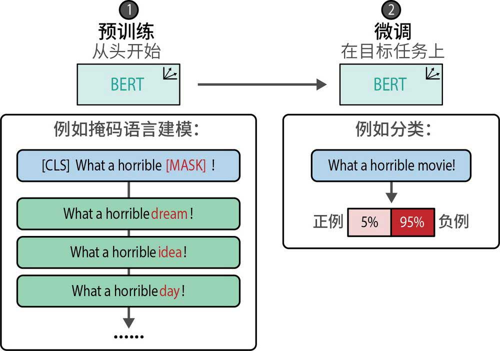

图11-14：要在目标任务（如分类）上微调模型，我们可以从预训练BERT模型开始，或使用预训练好的BERT模型

这种两步法虽被广泛应用，但在处理特定领域数据时具有一定的局限性。预训练模型通常基于非常通用的数据（如维基百科内容）进行训练，可能无法充分适应特定领域的专业词汇。

为此，我们可以在两个步骤之间增加继续预训练（continued pretraining）环节。具体而言，就是在预训练好的BERT模型的基础上，继续使用特定领域的数据实施掩码语言建模（MLM）训练。比如从一个通用的BERT模型优化到专门用于医学领域的BioBERT模型，再微调至用于药物分类的BioBERT模型。

1. Chi Sun et al. “How to Fine-Tune BERT for Text Classification?” Chinese Computational Linguistics: 18th China National Conference, CCL 2019, Kunming, China, October 18-20, 2019, proceedings 18. Springer International Publishing, 2019.

这将更新子词表示，使其更好地适应特定领域的词汇。如图11-15所示，新增的继续预训练环节通过领域数据上的MLM任务优化模型。实践证明，在预训练的BERT模型上继续进行预训练能显著提升模型在分类任务中的性能，是微调过程中极具价值的增强手段
 [](#footnote-21-118)。

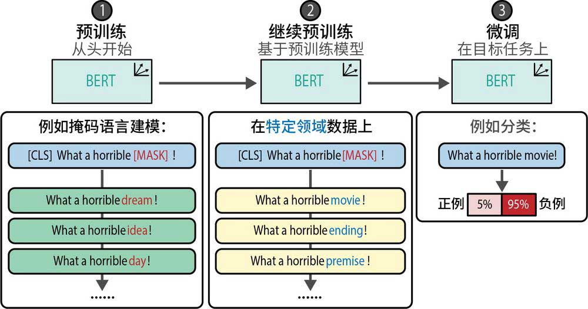

图11-15：区别于两步法，我们可以在针对目标任务进行微调之前对预训练模型进行继续预训练。需注意的是，在步骤1中掩码被填充为抽象概念，而在步骤2中掩码被填充为与电影相关的具体概念

我们无须从头开始预训练整个模型，只需在对其进行微调以用于分类任务之前简单地进行继续预训练。这种方法还能帮助模型更好地适应特定领域，甚至是特定组织的专业术语。图11-16进一步展示了企业可能采用的模型演进路径。

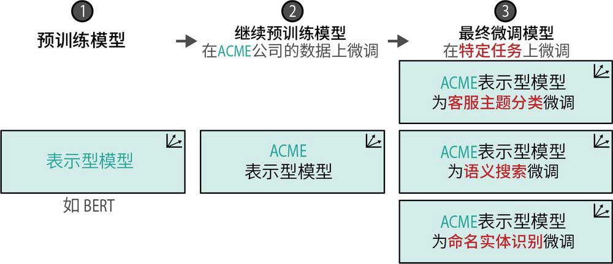

图11-16：针对特定用例的三步法示意图

在本示例中，我们将演示如何实施步骤2——对预训练好的BERT模型进行继续预训练。我们使用与之前相同的数据集，即烂番茄影评数据集。

首先加载我们迄今一直使用的bert-base-cased模型，并为其配置掩码语言建模任务：

```
from transformers import AutoTokenizer, AutoModelForMaskedLM
# 加载掩码语言建模(MLM)模型
model = AutoModelForMaskedLM.from_pretrained("bert-base-cased")
tokenizer = AutoTokenizer.from_pretrained("bert-base-cased")
```

我们需要对原始句子进行分词处理。由于本任务不属于监督学习范畴，我们还需移除标签。

```
def preprocess_function(examples):
   return tokenizer(examples["text"], truncation=True)
# 对数据进行分词处理
tokenized_train = train_data.map(preprocess_function, batched=True)
tokenized_train = tokenized_train.remove_columns("label")
tokenized_test = test_data.map(preprocess_function, batched=True)
tokenized_test = tokenized_test.remove_columns("label")
```

此前，我们使用过能够动态填充输入内容的DataCollatorWithPadding。

本例将采用能够执行词元的掩码操作的数据整理器。掩码操作通常有两种实现方式：词元掩码和整词掩码。当使用词元掩码时，系统会随机掩码句子中15% 的独立词元，这可能导致某个单词的部分字符被掩码。为了实现对整个单词的掩码，我们可以使用整词掩码，如图11-17所示。

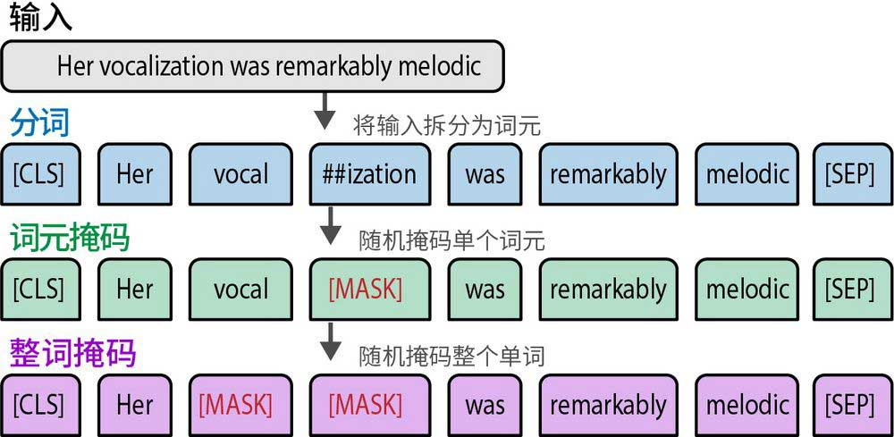

图11-17：随机掩码词元的不同方法

通常，预测整个单词比预测单个词元更具挑战性，这种设计会促使模型在训练过程中学习更准确和精细的语义表示，从而提升性能。但需注意的是，这种方法需要更长的收敛时间。为加快训练速度，本示例将采用DataCollatorForLanguageModeling实现词元掩码。若需实施整词掩码，只需将数据整理器替换为DataCollatorForWholeWordMask即可。另外，我们将掩码概率（mlm_probability参数）设置为0.15，即在每个句子中随机选择15% 的词元进行掩码处理。

```
from transformers import DataCollatorForLanguageModeling
# 掩码词元
data_collator = DataCollatorForLanguageModeling(
    tokenizer=tokenizer,
    mlm=True,
    mlm_probability=0.15
)
```

接下来，我们将创建用于执行掩码语言建模任务的Trainer，并指定下列参数配置：

```
# 用于参数调优的训练参数
training_args = TrainingArguments(
   "model",
   learning_rate=2e-5,
   per_device_train_batch_size=16,
   per_device_eval_batch_size=16,
   num_train_epochs=10,
   weight_decay=0.01,
   save_strategy="epoch",
   report_to="none"
)
# 初始化Trainer
trainer = Trainer(
    model=model,
    args=training_args,
    train_dataset=tokenized_train,
    eval_dataset=tokenized_test,
    tokenizer=tokenizer,
    data_collator=data_collator
)
```

这里有几个值得注意的关键参数。我们以20个训练周期进行训练，同时保持任务规模精简。建议尝试调整学习率与权重衰减系数，观察其对模型微调效果的影响。

在启动训练循环前，我们预先保存预训练的分词器。由于分词器参数在训练过程中不会更新，因此训练完成后无须重复保存。但值得注意的是，在继续预训练流程结束后，需完整保存更新后的模型状态。

```
# 保存预训练的分词器
tokenizer.save_pretrained("mlm")
# 训练模型
trainer.train()
# 保存更新后的模型
model.save_pretrained("mlm")
```

这样，我们便在mlm文件夹中得到了更新后的模型。为评估其性能，我们通常会在各类任务上对模型进行微调。但就当前阶段而言，我们可以通过运行若干掩码任务来检验模型是否从继续训练中获得了知识提升。

我们通过在继续预训练之前加载预训练模型来完成这一操作。以句子“What a horrible [MASK]!”为例，模型将对“[MASK]”位置的单词进行预测。

```
from transformers import pipeline
# 加载并创建预测
mask_filler = pipeline("fill-mask", model="bert-base-cased")
preds = mask_filler("What a horrible [MASK]!")
# 打印结果
for pred in preds:
    print(f">>> {pred["sequence"]}")
>>> What a horrible idea!
>>> What a horrible dream!
>>> What a horrible thing!
>>> What a horrible day!
>>> What a horrible thought!
```

输出中包含idea、dream和day等单词，这些预测结果都非常合理。接下来，我们看看更新后的模型会做出怎样的预测。

```
# 加载并创建预测
mask_filler = pipeline("fill-mask", model="mlm")
preds = mask_filler("What a horrible [MASK]!")
# 打印结果
for pred in preds:
    print(f">>> {pred["sequence"]}")
>>> What a horrible movie!
>>> What a horrible film!
>>> What a horrible mess!
>>> What a horrible comedy!
>>> What a horrible story!
```

这次输出中包含movie、film、mess等单词，相较于预训练模型，该模型更贴合我们输入的数据特征。

下一步便是在本章开头提到的分类任务上对这个模型进行微调，只需按照以下方式加载模型即可开始：

```
from transformers import AutoModelForSequenceClassification
# 用于分类的微调
model = AutoModelForSequenceClassification.from_pretrained("mlm", num_labels=2)
tokenizer = AutoTokenizer.from_pretrained("mlm")
```

### 11.4 命名实体识别

在本节中，我们将深入探讨如何为命名实体识别（NER）任务微调预训练的BERT模型。与对整个文档进行分类不同，这一过程能够对单个词元或单词进行细粒度分类（如人名、地点等）。当处理敏感数据时，这对去标识化与匿名化任务尤为实用。

命名实体识别与本章开头讨论的文档分类任务有相似之处，关键的区别体现在数据预处理和分类方式上。由于我们的目标是对单个单词而非整个文档进行分类，在数据预处理阶段必须充分考虑这种细粒度特征。图11-18直观地展示了这种词级分类方法。

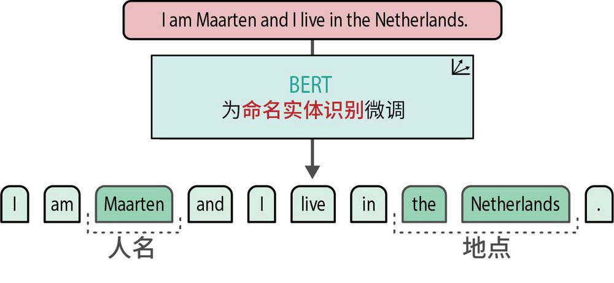

图11-18：微调后的BERT模型能够识别人名和地点等命名实体

微调预训练的BERT模型所采用的架构与文档分类任务中的架构相似，但分类机制存在本质差异。此时模型不再依赖词元嵌入的聚合或池化操作，而是直接对序列中的每个词元进行预测。需要特别说明的是，我们的词级分类任务并非作用于完整单词，而是针对构成单词的各个词元进行分类。图11-19清晰地呈现了这种词元级分类机制。

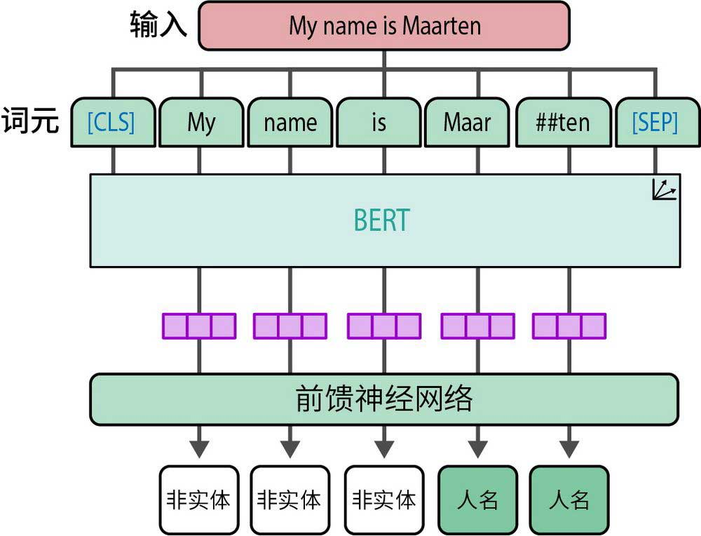

图11-19：在微调过程中，BERT模型执行的是词元级分类而非文档级或词级分类

**11.4.1数据准备**

1. Erik F. Sang and Fien De Meulder. “Introduction to the CoNLL-2003 Shared Task: Language-Independent Named Entity Recognition.” arXiv preprint cs/0306050 (2003).

本示例采用英文版的CoNLL-2003数据集。该数据集涵盖人名、组织、地点、其他实体及非实体等类别，共包含约14000个训练样本
 [](#footnote-21-64)。

```
# 用于命名实体识别的CoNLL-2003数据集
```

`dataset = load_dataset("conll2003", trust_remote_code=True)
`

1. Jingjing Liu et al. “Asgard: A Portable Architecture for Multilingual Dialogue Systems.” 2013 IEEE International Conference on Acoustics, Speech and Signal Processing. IEEE, 2013.

 在研究该示例数据集的过程中，我们还发现了其他一些值得分享的数据集。wnut_17数据集聚焦于新兴和罕见实体的识别任务，这类实体往往更难以识别。此外，tner/mit_movie_trivia和tner/mit_restaurant数据集也颇具研究价值。tner/mit_movie_trivia用于识别演员、情节与配乐等实体，tner/mit_restaurant则专注于设施、菜品及菜系等实体的识别
 [](#footnote-21-201)。

我们通过具体示例来观察数据组织结构：

```
example = dataset["train"][848]
example
{'id': '848',
 'tokens': ['Dean',
  'Palmer',
  'hit',
  'his',
  '30th',
  'homer',
  'for',
  'the',
  'Rangers',
  '.'],
 'pos_tags': [22, 22, 38, 29, 16, 21, 15, 12, 23, 7],
 'chunk_tags': [11, 12, 21, 11, 12, 12, 13, 11, 12, 0],
 'ner_tags': [1, 2, 0, 0, 0, 0, 0, 0, 3, 0]}
```

该数据集为句子中的每个单词提供了标签。这些标签存储于ner_tags字段中，对应以下实体类型：

```
label2id = {
    "O": 0, "B-PER": 1, "I-PER": 2, "B-ORG": 3, "I-ORG": 4,
    "B-LOC": 5, "I-LOC": 6, "B-MISC": 7, "I-MISC": 8
}
id2label = {index: label for label, index in label2id.items()}
label2id
{'O': 0,
 'B-PER': 1,
 'I-PER': 2,
 'B-ORG': 3,
 'I-ORG': 4,
 'B-LOC': 5,
 'I-LOC': 6,
 'B-MISC': 7,
 'I-MISC': 8}
```

这些实体对应特定类别：人名（PER）、组织（ORG）、地点（LOC）、其他实体（MISC）和非实体（O）。注意，这些实体的前缀为B（表示起始）或I（表示内部）。当两个连续的词元属于同一个短语时，起始词元使用B标记，后续词元则用I标记，表明它们属于同一个实体，而不是独立存在。

图11-20直观地展示了这一过程。由于Dean被标记为短语的开头，Palmer被标记为短语的一部分（后面没有其他标记，代表Palmer同时是短语的结尾），因此我们可以判定Dean Palmer是一个完整的人名，Dean和Palmer并不是两个独立的人名。

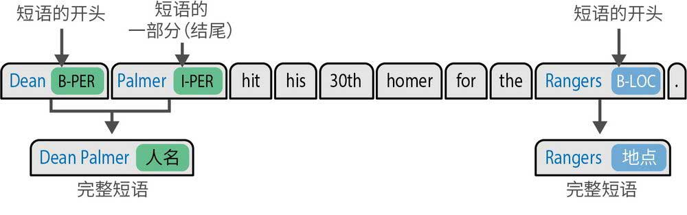

图11-20：通过用相同的实体标记短语的开头和结尾，实现完整短语的实体识别

我们的数据已经过预处理并被拆分成单词，但尚未被转换为词元。为此，我们将使用本章始终沿用的预训练模型bert-base-cased的分词器对其进行进一步分词处理，从而得到词元。

```
from transformers import AutoModelForTokenClassification
# 加载分词器
tokenizer = AutoTokenizer.from_pretrained("bert-base-cased")
# 加载模型
model = AutoModelForTokenClassification.from_pretrained(
    "bert-base-cased",
    num_labels=len(id2label),
    id2label=id2label,
    label2id=label2id
)
```

下面看一下分词器如何处理我们的示例：

```
# 将单个词元拆分成子词元
token_ids = tokenizer(example["tokens"], is_split_into_words=True)["input_ids"]
sub_tokens = tokenizer.convert_ids_to_tokens(token_ids)
sub_tokens
['[CLS]',
 'Dean',
 'Palmer',
 'hit',
 'his',
 '30th',
 'home',
 '##r',
 'for',
 'the',
 'Rangers',
 '.',
 '[SEP]']
```

正如我们在第2章和第3章中所学，分词器会添加[CLS]和[SEP]等特殊词元。值得注意的是，homer这个单词被进一步拆分为home和 ##r两个子词元。这引发了一个技术挑战：由于标注数据是基于完整单词而非子词元构建的，我们需要在分词过程中将原始标签与对应的子词元进行对齐。

以带B-PER标签（表示人名）的Maarten为例，当该词被分词器拆分为Ma、##arte和 ##n这三个子词元时，若简单地沿用原标签会导致错误——三个子词元都会被误判为独立的人名。当一个实体被拆分成多个词元时，首个词元应该带B（表示起始）标签，而接下来的词元应该带I（表示内部）标签。

因此，首个子词元Ma保留B-PER标签以表示短语的起始，后续的 ##arte和 ##n则使用I-PER标签以表示它们同属于一个短语。这一对齐过程如图11-21所示。

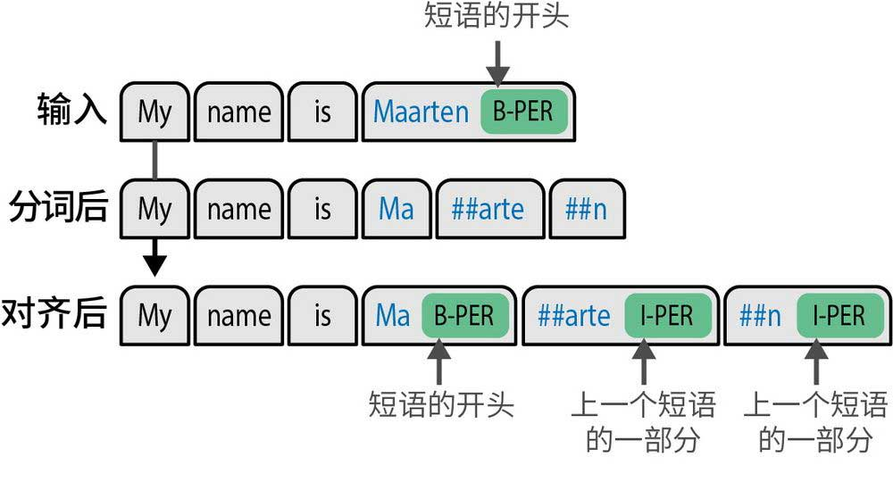

图11-21：分词输入标签的对齐过程

为此，我们创建了align_labels函数，该函数在完成文本分词的同时动态调整标签，使其与子词元对齐。

```
def align_labels(examples):
    token_ids = tokenizer(
        examples["tokens"],
        truncation=True,
        is_split_into_words=True
    )
    labels = examples["ner_tags"]
    updated_labels = []
    for index, label in enumerate(labels):
        # 将词元映射到它们各自的单词
        word_ids = token_ids.word_ids(batch_index=index)
        previous_word_idx = None
        label_ids = []
        for word_idx in word_ids:
            # 新单词的开始
            if word_idx != previous_word_idx:
                previous_word_idx = word_idx
                updated_label = -100 if word_idx is None else label[word_idx]
                label_ids.append(updated_label)
            # 将特殊词元标记为-100
            elif word_idx is None:
                label_ids.append(-100)
            # 如果标签是B-XXX，我们将其改为I-XXX
            else:
                updated_label = label[word_idx]
                if updated_label % 2 == 1:
                    updated_label += 1
                label_ids.append(updated_label)
        updated_labels.append(label_ids)
    token_ids["labels"] = updated_labels
    return token_ids
tokenized = dataset.map(align_labels, batched=True)
```

通过观察示例可以发现，我们在[CLS]和[SEP]词元中额外添加了特殊标签（-100）。

```
# 原始标签和更新后标签的区别
print(f"Original: {example["ner_tags"]}")
print(f"Updated: {tokenized["train"][848]["labels"]}")
Original: [1, 2, 0, 0, 0, 0, 0, 0, 3, 0]
Updated: [-100, 1, 2, 0, 0, 0, 0, 0, 0, 0, 3, 0, -100]
```

现在，我们已经完成了词元化并与标签对齐，接下来需要确定评估指标的定义方式。这与之前的任务有所不同：在此前的场景中，每个文档仅需生成一个预测结果，而当前的词元化任务要求为每个词元生成相应的预测。

为此，我们将使用Hugging Face的evaluate工具包构建一个compute_metrics函数，该函数能够在词元粒度上评估模型性能。这种细粒度的评估机制将帮助我们更精确地分析模型对文本结构的理解能力。

```
import evaluate
# 加载序列评估器
seqeval = evaluate.load("seqeval")
def compute_metrics(eval_pred):
    # 生成预测结果
    logits, labels = eval_pred
    predictions = np.argmax(logits, axis=2)
    true_predictions = []
    true_labels = []
    # 文档级循环
    for prediction, label in zip(predictions, labels):
      # 词元级循环
      for token_prediction, token_label in zip(prediction, label):
        # 忽略特殊词元
        if token_label != -100:
          true_predictions.append([id2label[token_prediction]])
          true_labels.append([id2label[token_label]])
    results = seqeval.compute(
    predictions=true_predictions, references=true_labels
)
    return {"f1": results["overall_f1"]}
```

**11.4.2命名实体识别的微调**

我们即将完成准备工作。与DataCollatorWithPadding不同，此处需要一个能够处理词元级分类任务的数据整理器——DataCollatorForTokenClassification。

```
from transformers import DataCollatorForTokenClassification
# 词元分类数据整理器
data_collator = DataCollatorForTokenClassification(tokenizer=tokenizer)
```

至此，我们完成了模型的加载工作，后续步骤与本章先前介绍的训练流程基本一致。我们需要通过定义包含特定参数的训练器来完成调优并实例化一个Trainer对象。

```
# 用于参数调优的训练参数
training_args = TrainingArguments(
   "model",
   learning_rate=2e-5,
   per_device_train_batch_size=16,
   per_device_eval_batch_size=16,
   num_train_epochs=1,
   weight_decay=0.01,
   save_strategy="epoch",
   report_to="none"
)
# 初始化训练器
trainer = Trainer(
    model=model,
    args=training_args,
    train_dataset=tokenized["train"],
    eval_dataset=tokenized["test"],
    tokenizer=tokenizer,
    data_collator=data_collator,
    compute_metrics=compute_metrics,
)
trainer.train()
```

接下来，我们对新构建的模型进行评估：

```
# 在测试数据上评估模型
trainer.evaluate()
```

最后，我们保存训练好的模型并将其应用于推理流程。通过这种方式，我们既可以调阅特定数据、人工检视推理过程的中间结果，又能系统地验证输出内容是否符合预期。

```
from transformers import pipeline
# 保存我们的微调模型
trainer.save_model("ner_model")
# 在微调模型上运行推理
token_classifier = pipeline(
    "token-classification",
    model="ner_model",
)
token_classifier("My name is Maarten.")
[{'entity': 'B-PER',
  'score': 0.99534035,
  'index': 4,
  'word': 'Ma',
  'start': 11,
  'end': 13},
 {'entity': 'I-PER',
  'score': 0.9928328,
  'index': 5,
  'word': '##arte',
  'start': 13,
  'end': 17},
 {'entity': 'I-PER',
  'score': 0.9954301,
  'index': 6,
  'word': '##n',
  'start': 17,
  'end': 18}]
```

在句子"My name is Maarten."中，Maarten及其子词元被正确地识别为人名。

### 11.5 小结

在本章中，我们探讨了在特定分类任务上微调预训练表示模型的若干方法。首先，我们展示了如何对预训练的BERT模型进行微调，并通过冻结其架构的特定层来扩展应用场景。

我们尝试使用了名为SetFit的少样本分类技术，该技术利用有限的标注数据，同时微调预训练的嵌入模型和分类头。仅使用少量标注数据点，该模型就展现出与我们在前几章中所探讨的模型相似的性能表现。

随后，我们深入研究了继续预训练。我们以预训练的BERT模型为起点，使用不同的数据对其继续进行训练。继续预训练的底层机制——掩码语言建模，不仅用于创建表示模型，也可用于对模型进行继续预训练。

最后，我们探讨了命名实体识别任务，该任务需要从非结构化文本中识别特定实体（如人名、地名等）。与之前的分类任务不同，此类分类作用于单词层面而非文档层面。

在第12章中，我们将继续探索语言模型的微调，重点转向生成模型。我们将分两个阶段展开：首先微调模型，使其准确执行指令；然后调整模型，使其输出符合人类偏好。


---

## 第12章 微调生成模型

在本章中，我们将对一个预训练文本生成模型进行微调。微调对于生成高质量的模型至关重要，也是我们让模型适应特定预期行为的重要工具。通过微调，我们可以使模型适配特定数据集或领域。

本章将介绍微调文本生成模型的两种最常见的方法：**监督微调（supervised fine-tuning）和偏好调优**（preference tuning）。我们将探索微调预训练文本生成模型的变革性潜力，使其成为对应用更有效的工具。

### 12.1 LLM训练三步走：预训练、监督微调和偏好调优

创建高质量的LLM通常包括三个步骤。

**1.语言建模（预训练）**

要创建高质量的LLM，第一步是在一个或多个大规模文本数据集上对模型进行预训练（见图12-1）。在训练过程中，模型尝试预测下一个词元，以准确学习文本中的语言和语义表示。正如我们在第3章和第11章中所看到的，这称为语言建模，是一种自监督学习方法。

这一步会生成一个**基座模型，通常也称为预训练模型或基础**模型。基座模型是训练过程的关键产物，但对最终用户来说较难直接使用。这就是为什么下一步非常重要。

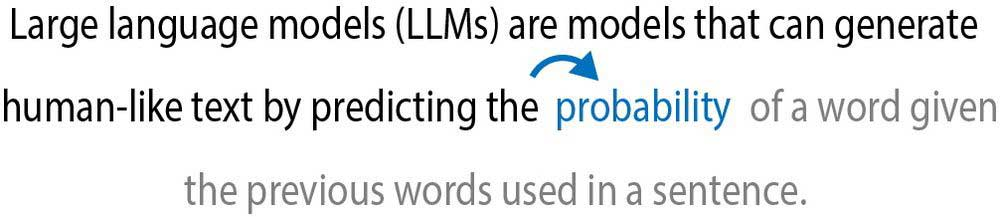

图12-1：在语言建模过程中，LLM旨在根据输入预测下一个词元。这是一个无数据标注的过程

**2.第一次微调（监督微调）**

LLM如果能够在响应和遵循指令方面做得更好，就会更实用。当我们要求模型写一篇文章时，我们期望模型生成完整的文章，而不是列出与“写文章”类似的指令（基座模型可能这样做）。

通过监督微调（SFT），我们可以使基座模型学会遵循指令。在微调过程中，基座模型的参数会更新，以更好地适应目标任务，比如遵循指令。与预训练模型类似，它使用下一个词元的预测任务进行训练，但不是仅预测已有文章中的下一个词元，而是基于用户输入，预测应该回复的下一个词元（见图12-2）。

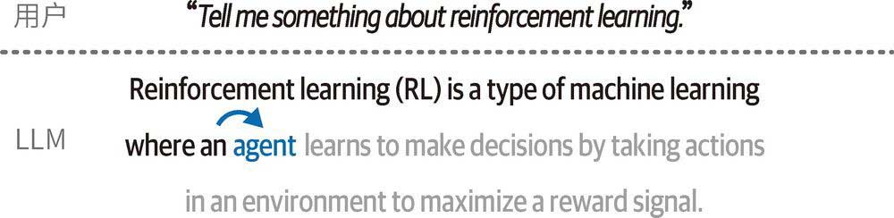

图12-2：在监督微调过程中，LLM旨在根据带附加标签的输入预测下一个词元。从某种意义上说，标签就是用户的输入

监督微调也可用于其他任务（如分类），但通常用于将基座生成模型转变为指令（或对话）生成模型。

**3.第二次微调（偏好调优）**

第二次微调的目的是进一步提高模型质量，使其更符合AI安全或人类偏好的预期行为。这称为偏好调优。偏好调优是微调的一种形式，顾名思义，它引导模型输出与我们的偏好保持一致，而偏好由我们提供的数据定义。与监督微调一样，偏好调优可以改进原始模型。此外，它还具有在训练过程中提炼输出偏好的优势。

图12-3展示了上述三个步骤，演示了从未训练的架构开始，到最终完成偏好调优LLM的过程。


图12-3：创建高质量LLM的三个步骤

在本章中，我们将使用一个已经在大规模数据集上训练好的基座模型，并探索如何通过两种微调策略对其进行微调。对于每种方法，我们都从理论基础开始，然后将其应用于实践。

### 12.2 监督微调

在大规模数据集上对模型进行预训练的目的是使其理解并生成符合语法和语义的语言。在这个过程中，模型学会补全输入短语，如图12-4所示。

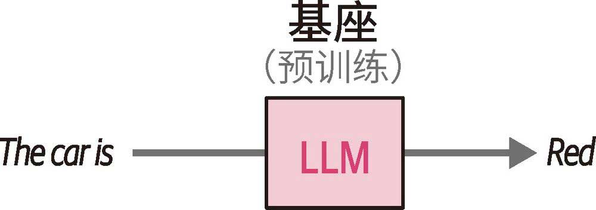

图12-4：基座LLM或预训练LLM被训练来预测下一个词

这个例子也说明模型并未被训练来遵循指令，它会尝试补全问题而不是回答问题（见图12-5）。

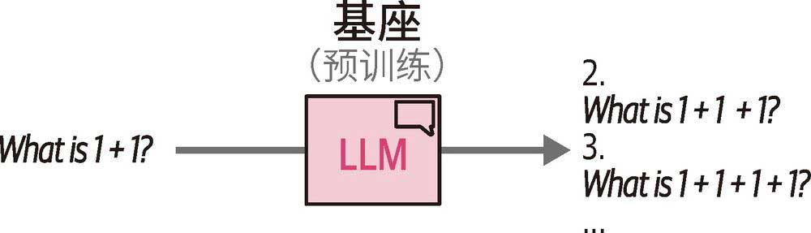

图12-5：基座LLM不会遵循指令，而是尝试预测下一个词，甚至可能创建新的问题

我们可以通过微调，使这个基座模型适配某些特定用例，比如遵循指令。

**12.2.1全量微调**

最常见的微调方式是全量微调。与预训练LLM类似，全量微调过程涉及更新模型的所有参数，使其符合目标任务的要求。二者的主要区别在于，全量微调使用的是较小但已标注的数据集，而预训练是在没有任何标注的大型数据集上完成的（见图12-6）。

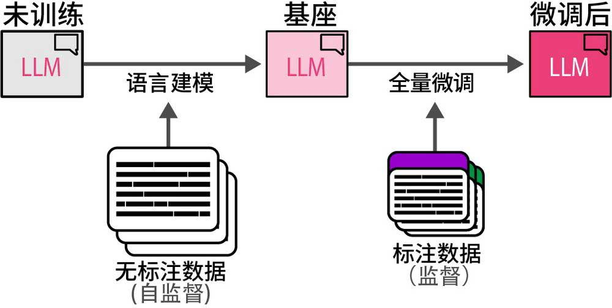

图12-6：与语言建模（预训练）相比，全量微调使用的是较小但已标注的数据集

你可以使用任何标注数据进行全量微调，这种灵活性使其成为学习领域特定表示的绝佳技术。为了让LLM遵循指令，我们需要问答数据，这是一种指令数据。如图12-7所示，指令数据包含用户的指令和相应的答案。

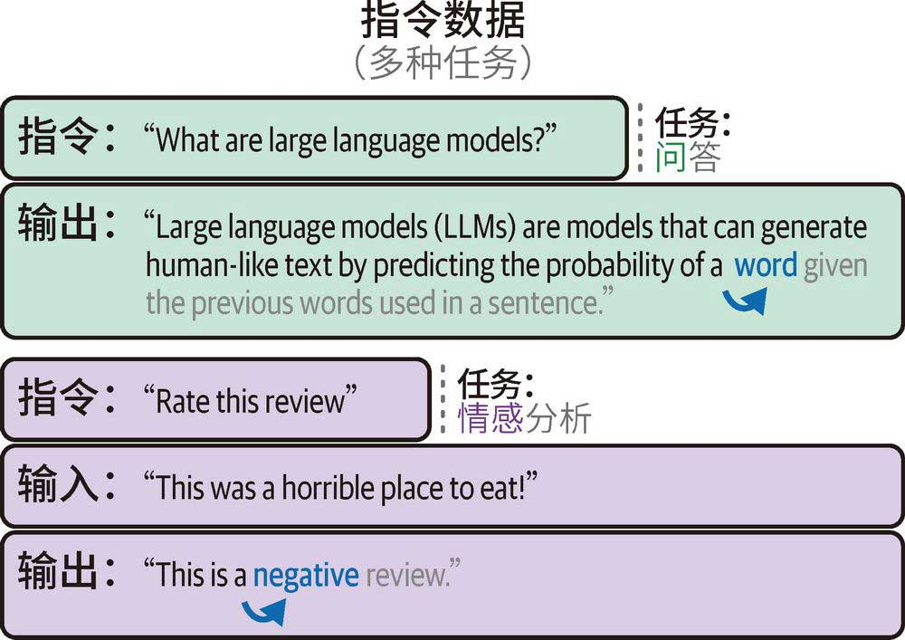

图12-7：指令数据包含用户的指令和相应的答案。这些指令可以包含多种任务

在全量微调期间，模型接收输入（指令）并对输出（回复）进行下一个词元预测。这样，模型就不会生成新的问题，而是会遵循指令。

**12.2.2参数高效微调**

更新模型的所有参数虽然可能显著提升模型的性能，但也有一些缺点，如训练成本高、训练时间长，并且需要大量存储空间等。为了解决这些问题，研究人员开始关注参数高效微调（parameter-efficient fine-tuning，PEFT）方法，这种方法旨在以更高的计算效率微调预训练模型。

**1.适配器**

适配器（adapter）是许多基于PEFT的技术的核心组件。使用适配器的方案是，在Transformer内部引入一组额外的模块化组件，通过微调这些组件来提升模型在特定任务上的性能，而无须微调模型的所有权重。这节省了大量时间和计算资源。

1. Neil Houlsby et al. “Parameter-Efficient Transfer Learning for NLP.” International Conference on Machine Learning. PMLR, 2019.

适配器是在论文“Parameter-Efficient Transfer Learning for NLP”中提出的。该论文表明，仅微调BERT模型的3.6% 的参数即可在特定任务上取得与微调全部模型权重相当的性能
 [](#footnote-22-107)。（这些参数通过适配器模块添加，并基于原始BERT模型进行了压缩处理。）在GLUE基准测试中，论文展示的性能与全量微调的性能差距不到0.4%。如图12-8所示，在单个Transformer块中，该论文提出的架构将适配器分别放置在自注意力层和前馈神经网络层之后。

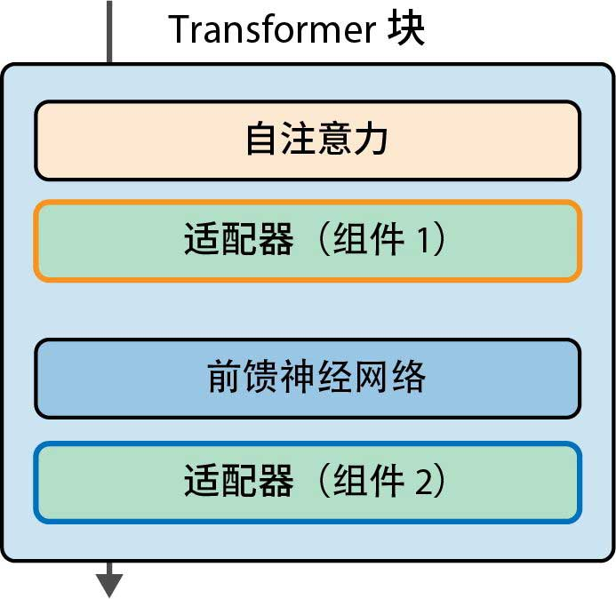

图12-8：适配器在网络的特定位置添加少量可以高效微调的权重，同时保持模型的大部分权重不变

然而，仅仅改变一个Transformer块是不够的，事实上，这些适配器被添加到了模型的每个Transformer块中，如图12-9所示。

通过观察模型中所有适配器组件的分布，我们可以清晰地看到单个适配器的结构，如图12-10所示。每个适配器可以专注于不同的任务，例如适配器1可以专门用于医疗文本分类，而适配器2可以专门用于命名实体识别。你可以从AdapterHub下载领域专用的适配器。

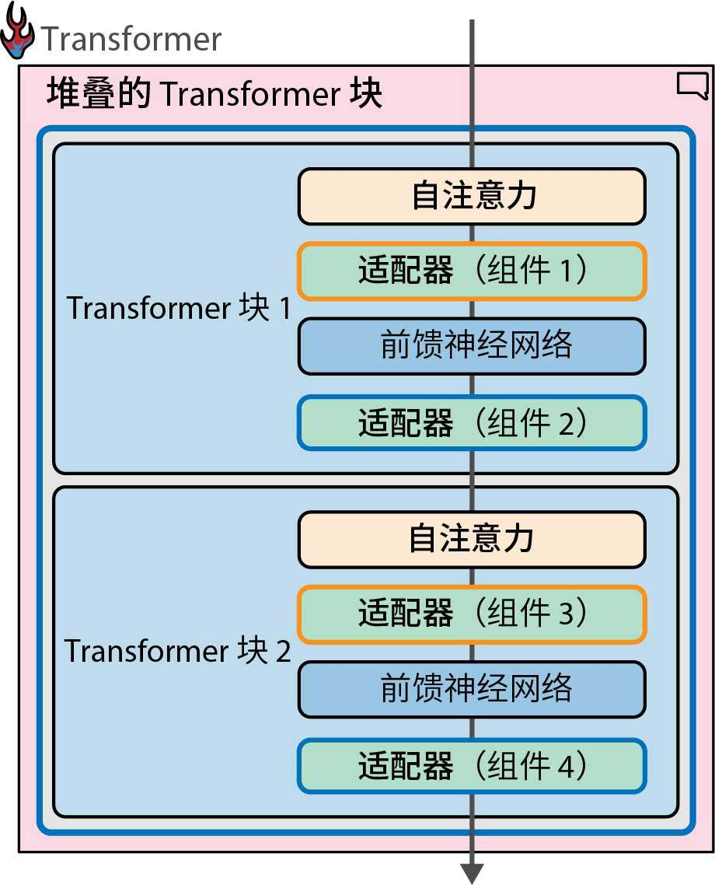

图12-9：适配器组件分布在模型的各个Transformer块中

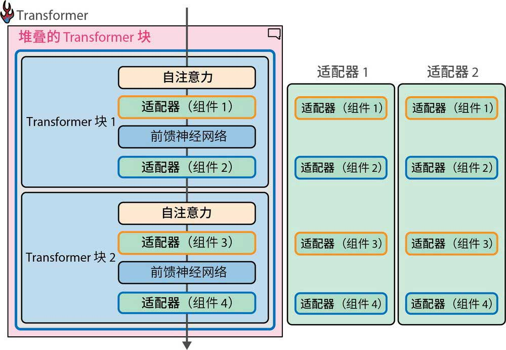

图12-10：专门用于特定任务的适配器可以被替换到相同的架构中，前提是它们共享原始模型架构和权重

1. Jonas Pfeiffer et al. “AdapterHub: A Framework for Adapting Transformers.” arXiv preprint arXiv:2007.07779 (2020).

1. Renrui Zhang et al. “LLaMA-Adapter: Efficient Fine-tuning of Language Models with Zero-init Attention.” arXiv preprint arXiv:2303.16199 (2023).

论文“AdapterHub: A Framework for Adapting Transformers”提出了AdapterHub这个中央仓库，可以分享适配器
 [](#footnote-22-80)。早期的许多适配器专注于BERT架构。近期，适配器已被应用到文本生成Transformer中，比如论文“LLaMA-Adapter: Efficient Fine-tuning of Language Models with Zero-init Attention”
 [](#footnote-22-214)中有相关阐述。

**2.低秩适配**

1. Edward J. Hu et al. “LoRA: Low-Rank Adaptation of Large Language Models.” arXiv preprint arXiv:2106.09685 (2021).

作为适配器的替代方案，低秩适配（low-rank adaptation，LoRA）被引入。当前，LoRA是一种应用广泛且有效的参数高效微调技术。与适配器类似，LoRA也只需要更新少量参数。如图12-11所示，它创建了基座模型的一个小型子集来进行微调，而没有向模型添加新层
 [](#footnote-22-135)。

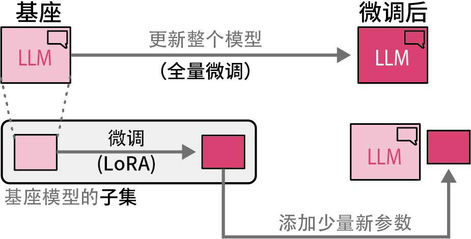

图12-11：LoRA只需要微调一小部分可以与基座LLM分开保存的参数

与适配器类似，由于只需要更新基座模型的一小部分，这种子集方法使得微调速度更快。我们通过用较小的矩阵近似原始LLM中的大矩阵来创建这个参数子集。然后，我们可以微调这些较小的矩阵，以替代直接微调原始的大矩阵。下面以图12-12所示的10 × 10矩阵为例进行介绍。


图12-12：LLM的一个主要瓶颈是其庞大的权重矩阵。仅其中一个权重矩阵就可能包含1.5亿个参数，而每个Transformer块都有自己的权重矩阵

我们可以构造两个较小的矩阵，将它们相乘可以重构一个10 × 10的矩阵。这将显著提高效率，因为我们现在只需使用20（10加10）个权重，而不是100（10乘以10）个权重，如图12-13所示。

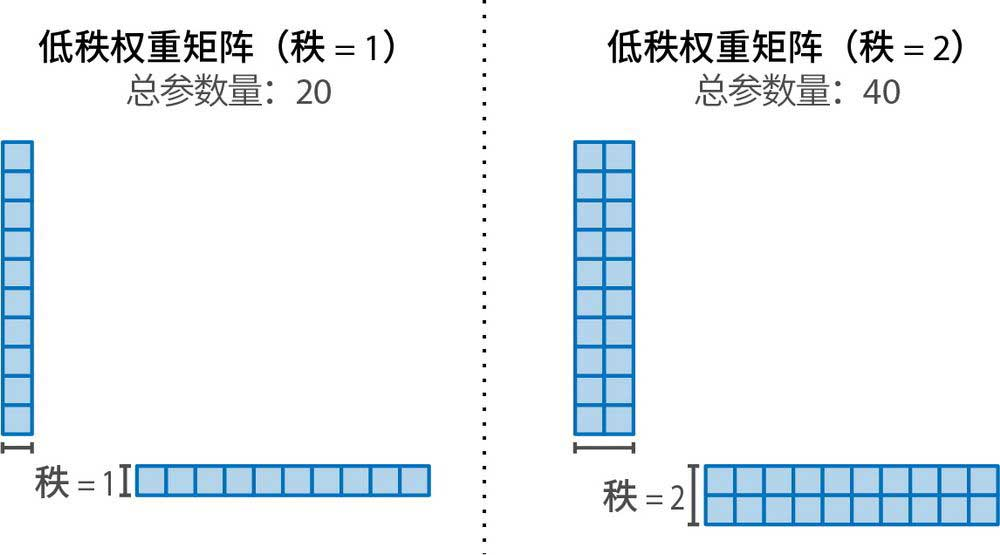

图12-13：将一个较大的权重矩阵分解为两个较小的矩阵，可以得到一个压缩的低秩矩阵，能够更高效地进行微调

在训练过程中，我们只需要更新这些较小的矩阵，而无须对全部权重进行更新。然后，将更新后的变化矩阵（较小的矩阵）与冻结的全部权重组合在一起，如图12-14所示。

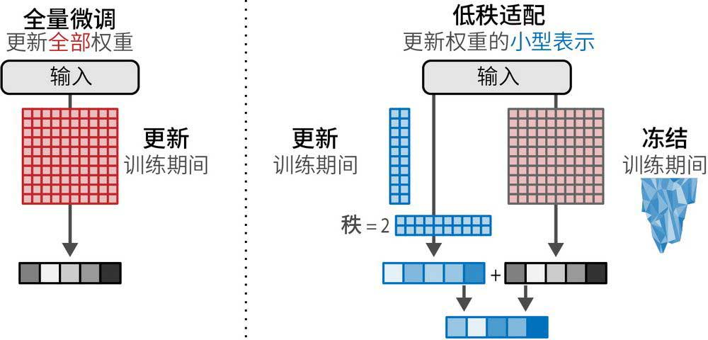

图12-14：与全量微调相比，LoRA在训练期间更新原始权重的小型表示

你可能会怀疑，使用适配器或LoRA方法会导致性能下降。确实如此。那么这种效率与性能的权衡在什么情况下是有意义的呢？

1. Armen Aghajanyan, Luke Zettlemoyer, and Sonal Gupta. “Intrinsic Dimensionality Explains the Effectiveness of Language Model Fine-Tuning.” arXiv preprint arXiv:2012.13255 (2020).

“Intrinsic Dimensionality Explains the Effectiveness of Language Model Fine-Tuning”等论文证明，语言模型“具有非常低的内在维度”（have a very low intrinsic dimension）
 [](#footnote-22-142)。这意味着我们可以找到能够近似LLM中巨大矩阵的低秩表示。例如，像GPT-3这样具有1750亿个参数的模型，在其96个Transformer块中，每一个Transformer块的内部都有一个12288 × 12288的权重矩阵，这意味着每个Transformer块有1.5亿个参数。如果我们能成功地将该矩阵适配到秩为8，那么每个块只需要两个12288 × 8的权重矩阵，也就是9.8万个参数。正如之前引用的论文“LoRA: Low-Rank Adaptation of Large Language Models”所解释的那样，这在速度、存储和计算方面大幅降低了成本。

这种低秩表示具有非常大的灵活性，它允许我们选择基座模型的特定部分进行微调。例如，我们可以只微调每个Transformer块中的查询（query）权重矩阵和值（value）权重矩阵。

**3.压缩模型以实现（更）高效的训练**

我们可以通过降低模型原始权重的内存需求来进一步提升LoRA的效率，然后将这些权重投影到较小的矩阵。LLM的权重是具有特定精度的数值，可以用float64或float32等位数来表示。如图12-15所示，如果我们减少表示数值的位数，结果的精度就会降低。然而，减少位数也意味着降低该模型的内存需求。

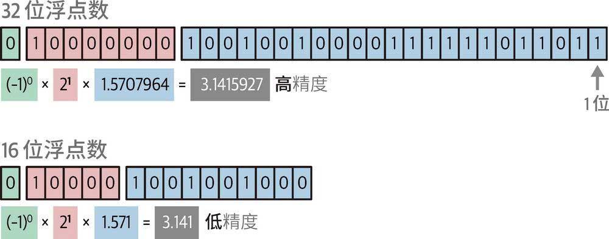

图12-15：尝试用32位浮点数和16位浮点数表示圆周率。注意，当我们将位数减半时，精度会降低

我们希望通过量化，在减少表示权重的位数的同时，仍然能够准确表示原始的权重值。然而，如图12-16所示，当直接将高精度值映射为低精度值时，多个高精度值可能被映射为相同的低精度值。

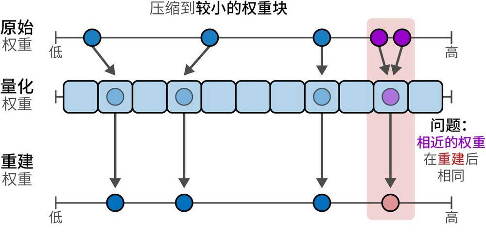

图12-16：量化相近的权重会导致重建后的权重相同，使得它们难以区分

1. Tim Dettmers et al. “QLoRA: Efficient Finetuning of Quantized LLMs.” arXiv preprint arXiv:2305.14314 (2023).

QLoRA（LoRA的量化版本）的作者发现了一种方法，可以在高位数精度和低位数精度之间进行转换，同时不会与原始权重产生太大差异
 [](#footnote-22-63)。

QLoRA使用分块量化的方法将某些高精度值块映射为低精度值。QLoRA并不是直接将高精度值映射为低精度值，而是创建额外的块来量化相似的权重。如图12-17所示，这样可以用低精度准确地表示这些值。

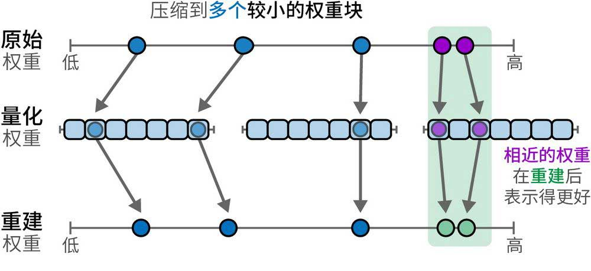

图12-17：分块量化可以通过量化块，以低精度准确地表示权重

神经网络的一个良好特性是其值通常在 -1和1之间呈正态分布。这个特性允许我们根据权重的相对密度将原始权重分配到较低的位数，如图12-18所示。因为考虑了权重的相对频率，所以权重之间的映射更加高效。这也减少了离群点带来的问题。

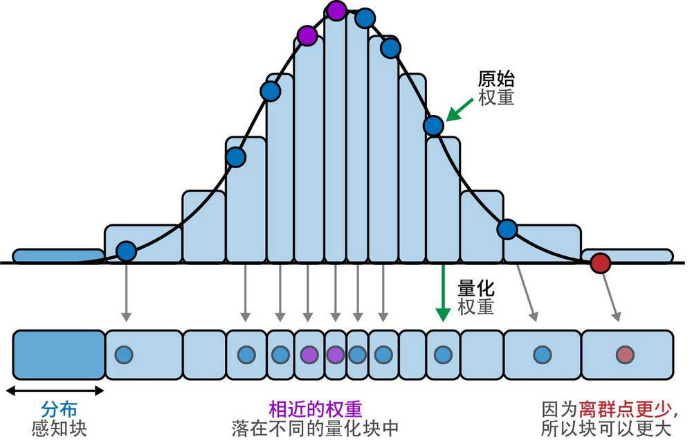

图12-18：使用分布感知块，可以防止相近的值被表示为相同的量化值

结合分块量化，这种标准化过程能够实现用低精度值准确地表示高精度值，同时LLM的性能只会略微降低。因此，我们可以从16位浮点数表示转换到仅需4位标准化浮点数表示。4位标准化浮点数表示显著降低了LLM在训练过程中的内存需求。请注意，LLM的量化通常对推理也很有帮助，因为量化后的LLM体积更小，所以需要的显存更少。

还有一些更优雅的方法可以进一步优化这一过程，比如双重量化和分页优化器。你可以在前面提到的关于QLoRA的论文“QLoRA: Efficient Finetuning of Quantized LLMs”中了解更多的相关内容。博客文章“A Visual Guide to Quantization”是关于量化的完整指南，且高度可视化。

### 12.3 使用QLoRA进行指令微调

在了解了QLoRA的工作原理后，我们将这些知识付诸实践。在本节中，我们将使用QLoRA微调Llama的一个完全开源且规模较小的版本——TinyLlama，使其能够遵循指令。我们可以将这个模型视为基座模型或预训练模型，它经过了语言建模训练，但还不能遵循指令。

**12.3.1模板化指令数据**

为了让LLM遵循指令，我们需要准备遵循对话模板的指令数据。如图12-19所示，这个对话模板能够区分LLM生成的内容和用户生成的内容。

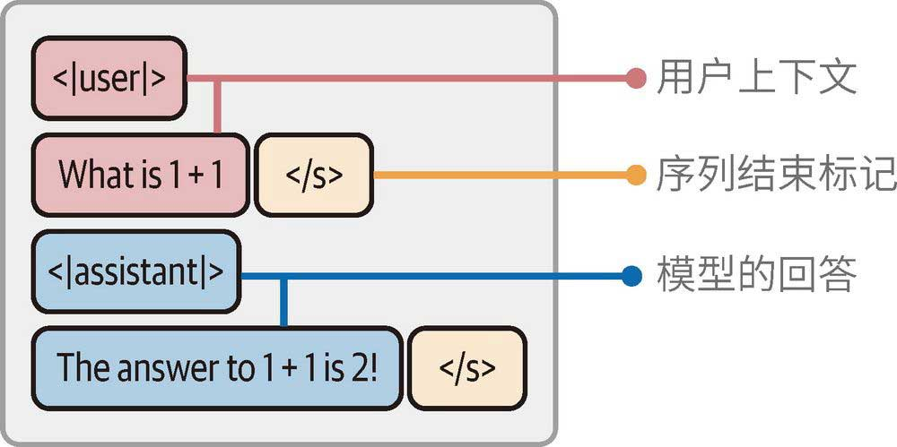

图12-19：我们在本章中使用的对话模板

1. Ning Ding et al. “Enhancing Chat Language Models by Scaling High-quality Instructional Conversations.” arXiv preprint arXiv:2305.14233 (2023).

我们选择使用这个对话模板来展示所有示例，因为TinyLlama的对话版本使用了相同的格式。我们使用的数据是UltraChat数据集的一个小子集
 [](#footnote-22-71)。这个数据集是原始UltraChat数据集的过滤版本，包含近20万条用户与LLM之间的对话。

首先创建一个函数format_prompt来确保对话遵循这个模板。

```
from transformers import AutoTokenizer
from datasets import load_dataset
# 加载分词器以使用其对话模板
template_tokenizer = AutoTokenizer.from_pretrained(
    "TinyLlama/TinyLlama-1.1BChat-v1.0"
)
def format_prompt(example):
    """利用TinyLlama使用的<|user|>模板格式化提示词"""
    # 格式化回答
    chat = example["messages"]
    prompt = template_tokenizer.apply_chat_template(chat, tokenize=False)
    return {"text": prompt}
# 加载数据并利用TinyLlama使用的模板进行格式化
dataset = (
    load_dataset("HuggingFaceH4/ultrachat_200k", split="test_sft")
      .shuffle(seed=42)
      .select(range(3_000))
)
dataset = dataset.map(format_prompt)
```

为了缩短训练时间，我们选择了包含3000个文档的子集。你可以扩大这个子集，以获得更准确的结果。

我们可以使用text列探索格式化后的提示词：

```
# 格式化后的提示词示例
print(dataset["text"][2576])
<|user|>
Given the text: Knock, knock. Who's there? Hike.
Can you continue the joke based on the given text material "Knock, knock. Who's there? Hike"?</s>
<|assistant|>
Sure! Knock, knock. Who's there? Hike. Hike who? Hike up your pants, it's cold outside!</s>
<|user|>
Can you tell me another knock-knock joke based on the same text material "Knock, knock. Who's there? Hike"?</s>
<|assistant|>
Of course! Knock, knock. Who's there? Hike. Hike who? Hike your way over here and let's go for a walk!</s>
```

**12.3.2模型量化**

现在我们有了数据，可以开始加载模型了。我们将应用QLoRA中的Q（量化），并使用bitsandbytes包将预训练模型压缩为4位表示。

我们可以在BitsAndBytesConfig中定义量化方案。我们将遵循原始QLoRA论文中的步骤，用4位精度加载模型（load_in_4bit），并使用标准化的浮点数表示（bnb_4bit_quant_type）和双重量化（bnb_4bit_use_double_quant）。

```
import torch
from transformers import AutoModelForCausalLM, AutoTokenizer, BitsAndBytesConfig
model_name = "TinyLlama/TinyLlama-1.1B-intermediate-step-1431k-3T"
# 4位量化配置——QLoRA中的Q
bnb_config = BitsAndBytesConfig(
    load_in_4bit=True,  # 用4位精度加载模型
    bnb_4bit_quant_type="nf4",  # 量化类型
    bnb_4bit_compute_dtype="float16",  # 计算数据类型
    bnb_4bit_use_double_quant=True,  # 应用嵌套量化
)
# 在GPU上加载要训练的模型
model = AutoModelForCausalLM.from_pretrained(
    model_name,
    device_map="auto",
    # 普通SFT可以忽略此设置
    quantization_config=bnb_config,
)
model.config.use_cache = False
model.config.pretraining_tp = 1
# 加载Llama分词器
tokenizer = AutoTokenizer.from_pretrained(model_name, trust_remote_code=True)
tokenizer.pad_token = "<PAD>"
tokenizer.padding_side = "left"
```

这种量化方法可以在保持大部分原始权重精度的同时减小原始模型的大小。量化后，加载模型只需要约1 GB显存。相比之下，不进行量化则需要约4 GB显存。请注意，在微调过程中，显存需求会增加，因此仅有加载模型所需的约1 GB显存是不够的。

**12.3.3LoRA配置**

下面需要使用peft库定义LoRA配置，这代表微调过程的超参数：

```
from peft import LoraConfig, prepare_model_for_kbit_training, get_peft_model
# 准备LoRA配置
peft_config = LoraConfig(
    lora_alpha=128,  # LoRA缩放
    lora_dropout=0.1,  # LoRA层的dropout
    r=64,  # 秩
    bias="none",
    task_type="CAUSAL_LM",
    target_modules= # 目标层
     ["k_proj", "gate_proj", "v_proj", "up_proj", "q_proj", "o_proj", "down_proj"]
)
# 准备用于训练的模型
model = prepare_model_for_kbit_training(model)
model = get_peft_model(model, peft_config)
```

需要注意以下参数。

### r

压缩矩阵的秩（回顾图12-13）。增大这个值会使压缩矩阵变大，从而降低压缩率，进而提高模型的表示能力。该参数的值通常在4和64之间。

lora_alpha

控制添加到原始权重的变化量。本质上，它平衡了原始模型的知识与新任务的知识。经验法则是将该参数的值设置为r值的两倍。

target_modules

控制哪些层作为目标。LoRA过程可以选择忽略特定层，如特定的投影层。这可以加快训练速度，但会降低性能，反之亦然。

调整以上参数是很有价值的实验，可以帮助你直观地理解哪些值有效，哪些值无效。你可以在Sebastian Raschka的Ahead of AI中找到关于LoRA微调的更多实用技巧。


 这个示例展示了一种高效的模型微调方式。如果你想进行全量微调，可以在加载模型时移除quantization_config参数，并跳过创建peft_config。这样，你就可以从使用QLoRA的指令微调转向全量微调。

**12.3.4训练配置**

最后，我们需要像第11章那样配置训练参数：

```
from transformers import TrainingArguments
output_dir = "./results"
# 训练参数
training_arguments = TrainingArguments(
    output_dir=output_dir,
    per_device_train_batch_size=2,
    gradient_accumulation_steps=4,
    optim="paged_adamw_32bit",
    learning_rate=2e-4,
    lr_scheduler_type="cosine",
    num_train_epochs=1,
    logging_steps=10,
    fp16=True,
    gradient_checkpointing=True
)
```

需要注意以下参数。

num_train_epochs

训练轮次。较大的值往往会降低性能，我们通常倾向于将该参数设为较小的值。

learning_rate

决定每次权重更新迭代的步长。QLoRA的作者发现，对于较大的模型（参数量超过330亿个），增大该参数的值，效果更好。

lr_scheduler_type

基于余弦的调度器，用于动态调整学习率。它会从零开始线性增加学习率，直到达到设定值。之后，学习率会按照余弦函数的值递减。

optim

原始QLoRA论文中使用的分页优化器。

优化这些参数是一项困难的任务，没有既定的指导方案。需要通过实验来找出最适合特定的数据集、模型大小和目标任务的参数取值。


 虽然本节描述的是指令微调，但我们也可以使用QLoRA来微调指令模型。例如，我们可以微调对话模型以生成特定的SQL代码，或创建符合特定格式的JSON输出。只要有可用的数据（包含适当的查询 - 回复对），QLoRA就是一个非常有效的技术，可以把现有的对话模型微调得更适合具体用例。

**12.3.5训练**

所有的模型和参数都已经准备就绪，我们可以开始对模型进行微调了。首先加载SFTTrainer，然后直接运行trainer.train()：

```
from trl import SFTTrainer
# 设置监督微调参数
trainer = SFTTrainer(
    model=model,
    train_dataset=dataset,
    dataset_text_field="text",
    tokenizer=tokenizer,
    args=training_arguments,
    max_seq_length=512,
    # 普通SFT可以忽略此设置
    peft_config=peft_config,
)
# 训练模型
trainer.train()
# 保存QLoRA权重
trainer.model.save_pretrained("TinyLlama-1.1B-qlora")
```

根据logging_steps参数的设置，训练过程中每10步就会打印一次损失值。如果你使用的是Google Colab提供的免费GPU（在撰写本书时是Tesla T4），训练可能需要一小时左右。你可以趁机休息一会儿！

**12.3.6合并权重**

在训练完QLoRA权重后，我们还需要将它们与原始权重结合才能使用。我们用16位精度而不是量化后的4位精度重新加载模型，以合并权重。虽然分词器在训练过程中没有更新，但为了便于访问，我们将其与模型保存在同一个文件夹中。

```
from peft import AutoPeftModelForCausalLM
model = AutoPeftModelForCausalLM.from_pretrained(
    "TinyLlama-1.1B-qlora",
    low_cpu_mem_usage=True,
    device_map="auto",
)
# 合并LoRA和基座模型
merged_model = model.merge_and_unload()
```

合并适配器和基座模型后，我们可以使用之前定义的提示词模板：

```
from transformers import pipeline
# 使用预定义的提示词模板
prompt = """<|user|>
Tell me something about Large Language Models.</s>
<|assistant|>
"""
# 运行我们的指令微调模型
pipe = pipeline(task="text-generation", model=merged_model, tokenizer=tokenizer)
print(pipe(prompt)[0]["generated_text"])
Large Language Models (LLMs) are artificial intelligence (AI) models that
learn language and understand what it means to say things in a particular
language. They are trained on huge amounts of text...
```

聚合权重后的输出表明，模型能够很好地遵循我们的指令，这是基座模型无法实现的。

### 12.4 评估生成模型

评估生成模型是一个重大挑战。生成模型被应用于许多不同的场景，这意味着依赖单一指标进行评判比较困难。与专用模型不同，解决数学问题能力超群的生成模型不一定在解决编程问题时也能表现不俗。

与此同时，评估这些模型至关重要，特别是在需要一致性的生产环境中。由于其概率性质，生成模型不一定能产生一致的输出，因此需要进行稳健的评估。

在本节中，我们将探讨一些常见的评估方法，但需要强调的是，目前没有金标准。没有一个指标能完美适用于所有场景。

**12.4.1词级指标**

1. Fred Jelinek et al. “Perplexity—A Measure of the Difficulty of Speech Recognition Tasks.” The Journal of the Acoustical Society of America 62.S1 (1977): S63.

1. Chin-Yew Lin. “ROUGE: A Package for Automatic Evaluation of Summaries.” Text Summarization Branches Out, 74-81. 2004.

1. Kishore Papineni, et al. “BLEU: A Method for Automatic Evaluation of Machine Translation.” Proceedings of the 40th Annual Meeting of the Association for Computational Linguistics. 2002.

1. Tianyi Zhang et al. “BERTScore: Evaluating Text Generation with BERT.” arXiv preprint arXiv:1904.09675 (2019).

评估生成模型的一类常见指标是词级指标。词级评估的经典技术在词元（集合）层面比较参考数据集与生成的词元。常见的词级指标包括困惑度（perplexity）
 [](#footnote-22-75)、ROUGE
 [](#footnote-22-82)、BLEU
 [](#footnote-22-88)和BERTScore
 [](#footnote-22-99)。

值得一提的是困惑度，它用于衡量语言模型对文本的预测能力。给定输入文本，模型预测下一个词元的概率。困惑度的基本假设是，如果模型给下一个词元一个较高的概率，则其表现更好。换句话说，当面对写得很好的文档时，模型不应该感到“困惑”。

如图12-20所示，当给出输入When a measure becomes a时，模型需要判断target作为下一个词的概率有多大。


图12-20：预测下一个词是许多LLM的核心特征

尽管困惑度和其他词级指标对于理解模型的置信度很有用，但它们并不是完美的评估方法。这些指标无法衡量生成文本的一致性、流畅度、创造力，甚至正确性。

**12.4.2基准测试**

1. Dan Hendrycks et al. “Measuring Massive Multitask Language Understanding.” arXiv preprint arXiv: 2009.03300 (2020).

1. Alex Wang et al. “GLUE: A Multi-Task Benchmark and Analysis Platform for Natural Language Understanding.” arXiv preprint arXiv:1804.07461 (2018).

1. Stephanie Lin, Jacob Hilton, and Owain Evans. “TruthfulQA: Measuring How Models Mimic Human Falsehoods.” arXiv preprint arXiv:2109.07958 (2021).

1. Karl Cobbe et al. “Training Verifiers to Solve Math Word Problems.” arXiv preprint arXiv:2110.14168 (2021).

1. Roman Zellers et al. “HellaSwag: Can a Machine Really Finish Your Sentence?” arXiv preprint arXiv: 1905.07830 (2019).

要评估生成模型在语言生成和理解任务上的表现，一种常见方法是使用广为人知的公共基准测试，如MMLU
 [](#footnote-22-48)、GLUE
 [](#footnote-22-54)、TruthfulQA
 [](#footnote-22-66)、GSM8k
 [](#footnote-22-73)和HellaSwag
 [](#footnote-22-84)。我们可以通过这些基准测试了解关于基础语言理解以及复杂的分析解答（如数学问题）的更多信息。

1. Mark Chen et al. “Evaluating Large Language Models Trained on Code.” arXiv preprint arXiv:2107.03374 (2021).

除了自然语言任务，一些模型专注于其他领域，如编程。这些模型通常会在不同的基准测试上进行评估，例如HumanEval
 [](#footnote-22-57)，该基准测试包含一些具有挑战性的编程任务供模型解决。生成模型的常见公共基准测试如表12-1所示。

表12-1：生成模型的常见公共基准测试

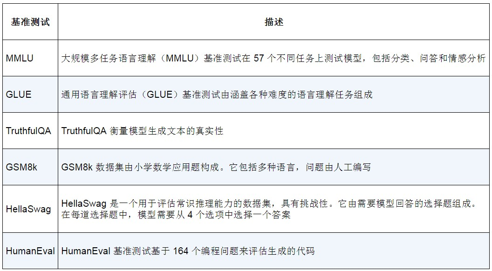

基准测试是了解模型在各种任务上的表现的好方法。然而，公共基准测试也有其缺点，为了得到最佳回复，模型可能会过拟合基准测试。此外，这些基准测试通常比较宽泛，可能无法覆盖非常具体的应用场景。最后，某些基准测试需要强大的GPU，且计算时间较长（历经数小时），这使得模型迭代比较困难。

**12.4.3排行榜**

由于基准测试种类繁多，选择适合自己模型的基准测试并不容易。新模型发布时，为了展示其在各项任务上的表现，通常会在多个基准测试上接受评估。

包含多个基准测试的排行榜应运而生。一个常见的排行榜是Open LLM Leaderboard。在撰写本书时，该排行榜包括HellaSwag、MMLU、TruthfulQA和GSM8k等6个基准测试。排行榜上名列前茅的模型（假设它们没有对数据过拟合）通常被认为是“最佳”模型。然而，由于这些排行榜通常包含公开可用的基准测试，因此存在模型对排行榜数据过拟合的风险。

**12.4.4自动评估**

评估生成模型的输出时，一个重要的指标是其文本的质量。例如，即使两个模型针对同一个问题给出了相同的正确答案，它们得出答案的方式也可能不同。我们通常不仅关注最终答案，还关注答案的构建过程。类似地，尽管两个摘要相似，但其中一个可能比另一个显著简短，这对于一个好的摘要来说往往很重要。

1. Lianmin Zheng et al. “Judging LLM-as-a-Judge with MT-Bench and Chatbot Arena.” Advances in Neural Information Processing Systems 36 (2024).

为了在最终答案的正确性之外对生成文本的质量进行评估，研究人员引入了LLM-as-a-judge
 [](#footnote-22-47)，也就是让另一个LLM来评判待评估的LLM的质量。这种方法的一个有趣的变体是成对比较，即两个不同的LLM分别生成针对同一个问题的答案，随后由第三个LLM作为裁判来判定哪个更好。

因此，这种方法允许对开放式问题进行自动评估，其主要优势在于，随着LLM的优化，它们评判输出质量的能力也会提高。换句话说，这种评估方法会随着技术的发展而不断改进。

**12.4.5人工评估**

尽管基准测试至关重要，但评估的金标准通常被认为是人工评估。即使一个LLM在广泛的基准测试中表现出色，在特定领域的任务中仍可能表现不佳。此外，基准测试无法完全反映人类偏好，前面讨论的所有方法都只是人类偏好的替代指标。

1. Wei-Lin Chiang et al. “Chatbot Arena: An Open Platform for Evaluating LLMs by Human Preference.” arXiv preprint arXiv:2403.04132 (2024).

Chatbot Arena是基于人工评估技术的绝佳示例
 [](#footnote-22-27)。在这个排行榜中有两个匿名的LLM与你互动。你提出的任何问题或提示词都会同时发送给这两个模型，然后你会收到它们的输出。之后，你可以决定更喜欢哪个输出。这个过程使得社区成员在不知道具体是哪些模型的情况下，对他们偏好的模型进行投票。只有在你投票之后，你才能看到是哪个模型生成了哪段文本。

在撰写本书时，这种方法已经收集了80多万张人工投票，用于生成一个排行榜。基于这些投票，计算出胜率，也就是LLM的相对能力水平。如果一个排名靠后的LLM击败了一个排名靠前的LLM，其排名就会发生显著变化。在国际象棋中，这被称为Elo评分系统。

这种方法使用众包投票的方式来帮助我们了解LLM的质量。但是，它仍然只是综合了众多不同用户的意见，可能与我们的实际应用场景并不相关。

因此，目前还没有一种评估LLM的完美方法。前面提到的方法和基准测试都提供了重要但有限的评估视角。我们建议根据预期应用场景来评估LLM。比如对于编程来说，HumanEval比GSM8k更合适。

最重要的是，我们相信你才是最好的评估者。人工评估之所以是金标准，是因为最终由你决定LLM是否适合你的预期应用场景。就像本章的示例一样，我们强烈建议你试用这些模型，或许还可以自己设计一些问题。例如，当本书的作者遇到新模型时，经常用母语（Jay Alammar使用阿拉伯语，Maarten Grootendorst使用荷兰语）提问。

关于这个话题，最后分享一句我们珍视的名言：

当一个指标成为目标时，它就不再是一个好的指标。

1. Mafilyn Strathern. “‘Improving Ratings’: Audit in the British University System.” European Review 5.3 (1997):305-321.

——古德哈特定律
 [](#footnote-22-8)

在LLM的语境下，当使用特定的基准测试时，我们往往会不顾后果地优化该基准测试。例如，当我们仅仅专注于优化生成语法正确的句子时，模型可能只学会输出一个句子：“这是一个句子。”这在语法上是正确的，但无法反映其语言理解能力。因此，模型可能在特定的基准测试上表现出色，但会牺牲其他有用的能力。

### 12.5 偏好调优、对齐

尽管模型现在已经能够遵循指令，但我们可以通过最后的训练来进一步改进其行为，使其与我们期望它在不同场景中的表现保持一致。例如，当我们问“什么是LLM”时，我们可能更倾向于得到一个详细描述LLM内部机制的答案，而不是“它是一个LLM”，不做进一步解释。那么，究竟如何将我们（人类）对一个答案优于另一个答案的偏好与LLM的输出对齐呢？

首先，回想一下LLM接收输入提示词并输出生成内容的情景，如图12-21所示。


图12-21：LLM接收输入提示词并输出生成内容

我们可以让一个人（偏好评估者）评估模型生成内容的质量。假设他给出一个特定分数，比如4（见图12-22）。

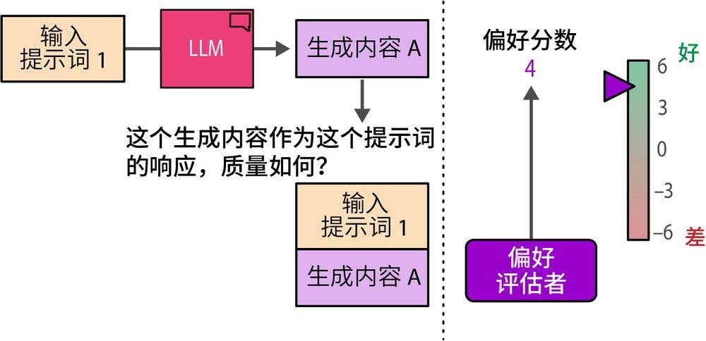

图12-22：让一个偏好评估者（人或其他方式）评估生成内容的质量

图12-23展示了基于该分数更新模型的偏好调优步骤。

·如果分数较高，就更新模型，以鼓励它产生更多这类生成内容。

·如果分数较低，就更新模型，以抑制它产生这类生成内容。

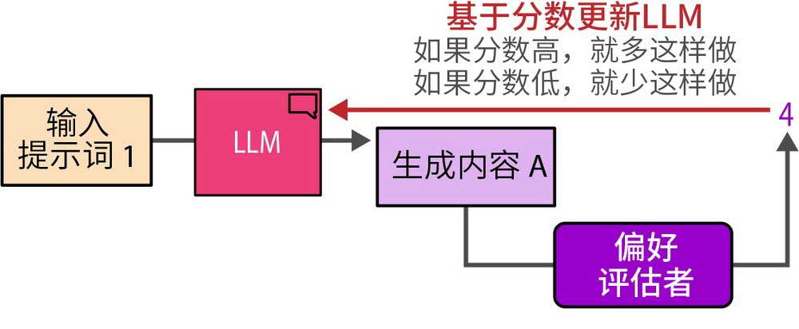

图12-23：偏好调优方法基于评估分数更新LLM

和之前一样，我们需要大量训练样本。那么我们能否实现偏好评估自动化呢？是的，我们可以通过训练一个叫作**奖励模型**（reward model）的模型来实现。

### 12.6 使用奖励模型实现偏好评估自动化

要实现偏好评估自动化，我们需要在偏好调优步骤之前增加一个步骤，即训练一个奖励模型，如图12-24所示。


图12-24：在微调LLM之前，我们先训练一个奖励模型

如图12-25所示，要创建奖励模型，我们可以复制经过指令微调的模型，并稍作修改，使其不再生成文本，而是输出一个单一的分数。


图12-25：通过将语言建模头替换为质量分类头，LLM变成了奖励模型

**12.6.1奖励模型的输入和输出**

奖励模型的预期工作方式是，我们给它一个提示词和一个生成内容，它会输出一个单一的数值，表示该生成内容对于该提示词的偏好 / 质量。图12-26展示了奖励模型生成这个单一数值的过程。

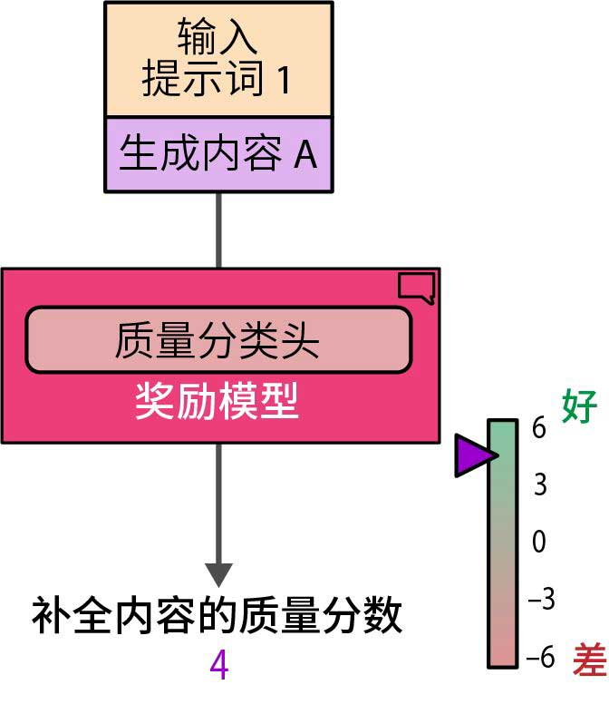

图12-26：使用经过人类偏好训练的奖励模型生成补全内容的质量分数

**12.6.2训练奖励模型**

我们不能直接使用奖励模型。奖励模型需要先经过训练才能正确地对生成内容进行评分。因此，我们需要获取一个模型可以学习的偏好数据集。

**1.奖励模型训练数据集**

偏好训练数据集的一种常见形式是，每个训练样本都包含一个提示词，以及一个被接受的生成内容和一个被拒绝的生成内容（注意，这并不总是“好”与“差”的对比，有时两个生成内容都很好，只是一个比另一个更好）。图12-27展示了包含两个训练样本的偏好训练数据集示例。

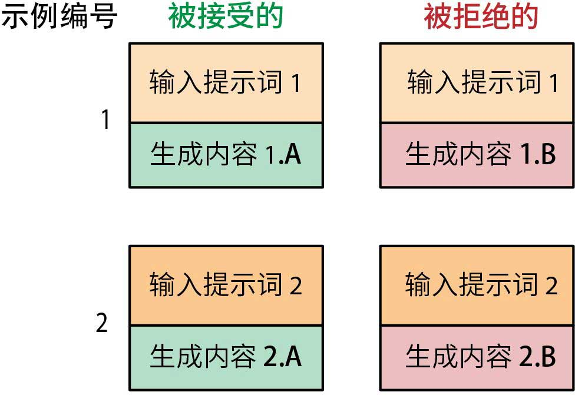

图12-27：偏好训练数据集通常由提示词及被接受和被拒绝的生成内容组成

生成偏好数据的一种方法是向LLM提供一个提示词，让它生成两个不同的结果。如图12-28所示，我们可以请人工标注员选择他们更偏好哪一个。

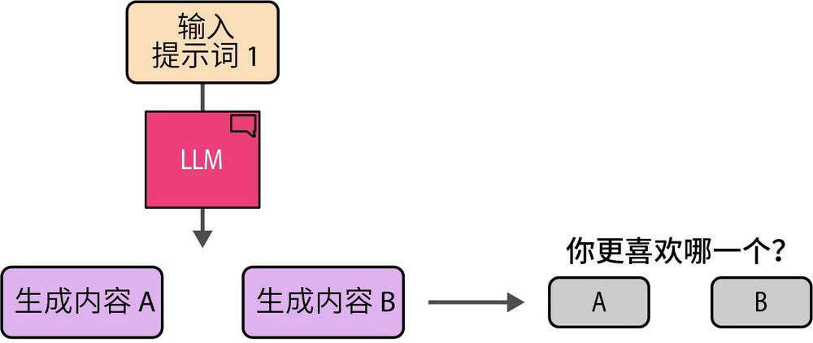

图12-28：输出两个生成内容并询问人工标注员更偏好哪一个

**2.奖励模型训练步骤**

有了偏好训练数据集之后，我们就可以开始训练奖励模型了。

一个简单的步骤是，我们使用奖励模型进行以下操作。

·对被接受的生成内容评分。

·对被拒绝的生成内容评分。

训练目标是确保被接受的生成内容的得分高于被拒绝的生成内容的得分，如图12-29所示。

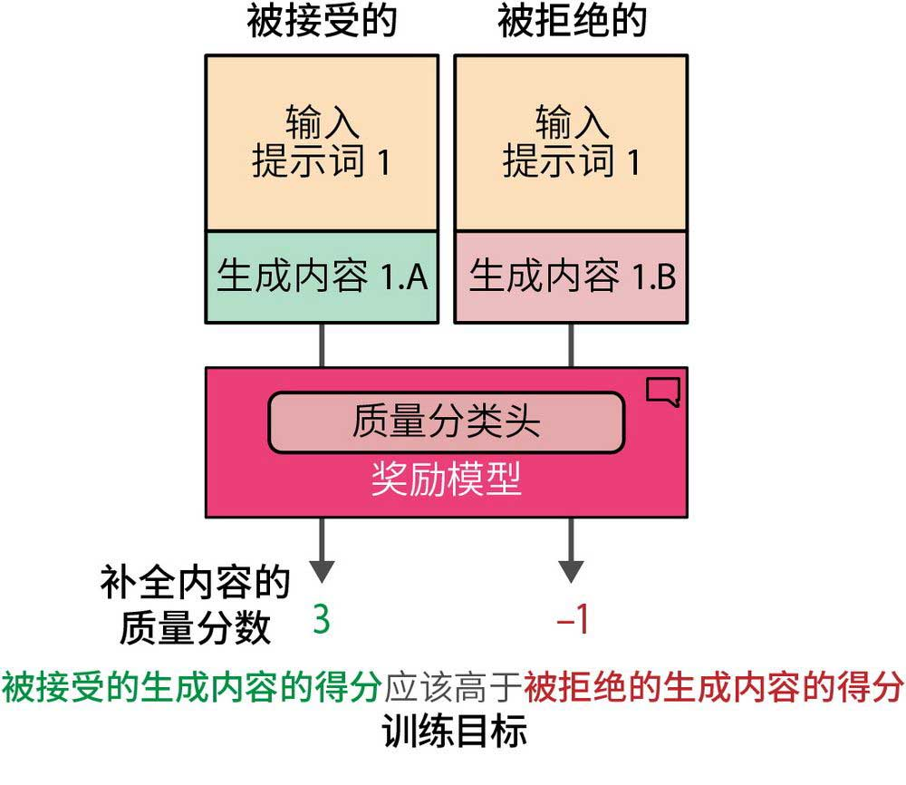

图12-29：奖励模型旨在评估针对提示词的生成内容的质量分数

如图12-30所示，将上述步骤组合在一起，就得到了偏好调优的三个阶段。

·收集偏好数据。

·训练奖励模型。

·微调LLM（奖励模型作为偏好评估器）。

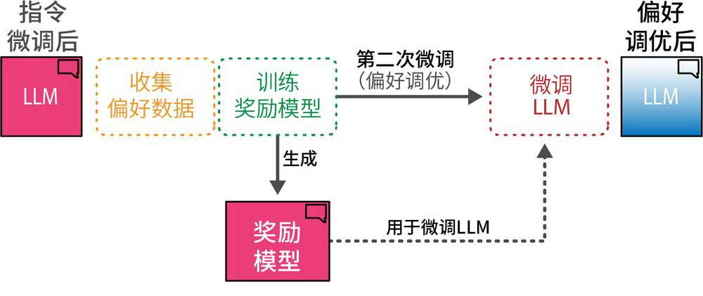

图12-30：偏好调优的3个阶段：收集偏好数据、训练奖励模型、微调LLM

奖励模型是一个很好的想法，可以进一步扩展和完善。例如，Llama 2训练了两个奖励模型：一个用于对有用性（helpfulness）评分，另一个用于对安全性（safety）评分（图12-31）。

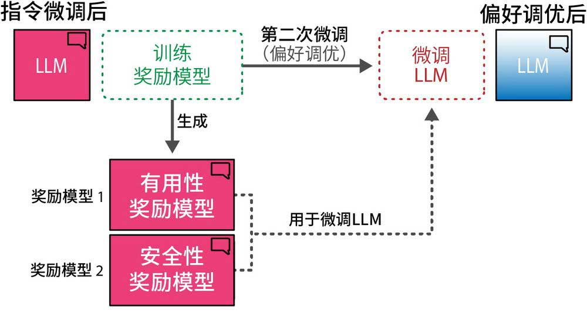

图12-31：我们可以使用多个奖励模型来进行评分

1. John Schulman et al. “Proximal Policy Optimization Algorithms.” arXiv preprint arXiv:1707.06347 (2017).

使用训练好的奖励模型来微调LLM的一种常用方法是近端策略优化（proximal policy optimization，PPO）。PPO是一种流行的强化学习技术，通过确保LLM不会过度偏离预期奖励来优化经过指令微调的LLM
 [](#footnote-22-111)。2022年发布的最初版本的ChatGPT甚至也使用PPO进行训练。

**12.6.3训练无奖励模型**

PPO的一个缺点是至少需要训练两个模型——奖励模型和LLM，这导致它的成本可能比实际所需的成本高。

1. Rafael Rafailov, et al. “Direct Preference Optimization: Your Language Model is Secretly a Reward Model.” arXiv preprint arXiv:2305.18290 (2023).

直接偏好优化（direct preference optimization，DPO）是PPO的一种替代方案，它摒弃了基于强化学习的训练过程
 [](#footnote-22-69)。DPO不再使用奖励模型来评判生成内容的质量，而是让LLM自己来完成这项工作。如图12-32所示，我们使用LLM的一个副本作为参考模型，评判参考模型和可训练模型在被接受的生成内容和被拒绝的生成内容的质量方面的偏移。

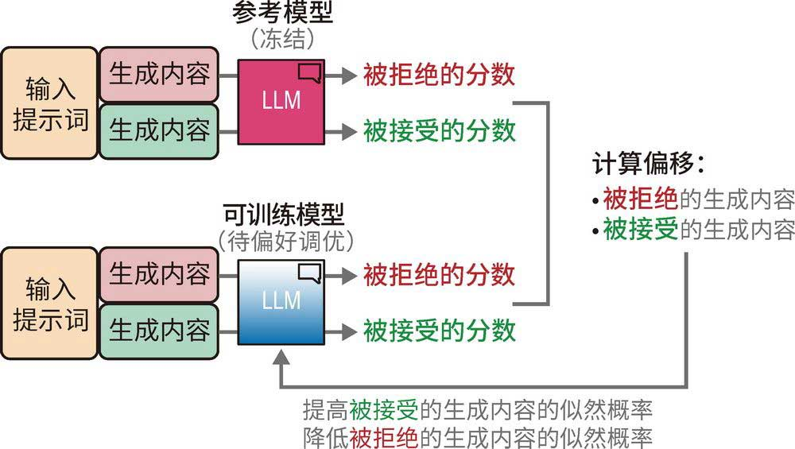

图12-32：通过比较参考模型和可训练模型的输出，将LLM自身作为奖励模型

通过在训练过程中计算这种偏移，我们可以通过跟踪参考模型和可训练模型之间的差异来优化被接受的生成内容相对于被拒绝的生成内容的似然概率。

为了计算这种偏移及其相关分数，我们需要从两个模型中提取被拒绝的生成内容和被接受的生成内容的对数概率。如图12-33所示，这个过程是在词元级别进行的，其中概率被组合起来，以计算参考模型和可训练模型之间的偏移。

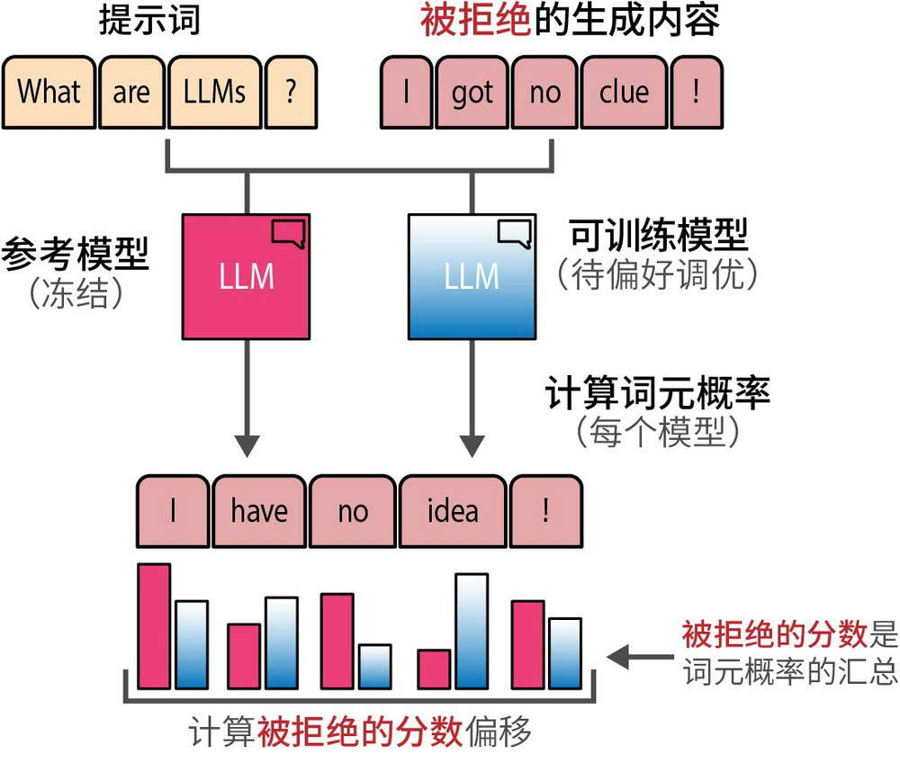

图12-33：通过在词元级别获取生成内容的概率来计算分数。参考模型和可训练模型之间的概率偏移得到优化。被接受的生成内容也遵循相同的流程

我们可以使用这些分数优化可训练模型的参数，使其在生成被接受的内容时更有信心，在生成被拒绝的内容时更缺乏信心。与PPO相比，DPO在训练过程中更加稳定，准确度也更高。由于DPO的稳定性，我们将使用它对先前经过指令微调的模型进行偏好调优。

### 12.7 使用DPO进行偏好调优

当使用Hugging Face技术栈时，偏好调优与我们之前介绍的指令微调非常相似，只有一些细微的差异。我们仍将使用TinyLlama模型，但这次使用的是一个经过指令微调的版本。该模型首先使用全量微调进行训练，然后通过DPO进一步对齐。与最初的指令微调模型相比，这个模型是在更大的数据集上训练的。

在本节中，我们将演示如何使用DPO和基于奖励的数据集来进一步对齐此模型。

**12.7.1对齐数据的模板化**

我们将使用一个数据集，其中每个提示词都包含一个被接受的生成内容和一个被拒绝的生成内容。这个数据集的一部分是由ChatGPT生成的，并对哪些输出应该被接受和哪些输出应该被拒绝进行了评分。

```
from datasets import load_dataset
def format_prompt(example):
    """使用TinyLlama的<|user|>模板格式化提示词"""
    # 格式化答案
    system = "<|system|>\n" + example["system"] + "</s>\n"
    prompt = "<|user|>\n" + example["input"] + "</s>\n<|assistant|>\n"
    chosen = example["chosen"] + "</s>\n"
    rejected = example["rejected"] + "</s>\n"
    return {
        "prompt": system + prompt,
        "chosen": chosen,
        "rejected": rejected,
    }
# 格式化数据集并选择相对简短的答案
dpo_dataset = load_dataset(
    "argilla/distilabel-intel-orca-dpo-pairs", split="train"
)
dpo_dataset = dpo_dataset.filter(
    lambda r:
        r["status"] != "tie" and
        r["chosen_score"] >= 8 and
        not r["in_gsm8k_train"]
)
dpo_dataset = dpo_dataset.map(
    format_prompt, remove_columns=dpo_dataset.column_names
)
dpo_dataset
```

注意，我们应用了额外的过滤条件，将数据规模从原来的13000个样本进一步减少到大约6000个样本。

**12.7.2模型量化**

我们加载基座模型和先前创建的LoRA。和之前一样，我们对模型进行量化以减少训练所需的显存。

```
from peft import AutoPeftModelForCausalLM
from transformers import BitsAndBytesConfig, AutoTokenizer
# 4位量化配置——QLoRA中的Q
bnb_config = BitsAndBytesConfig(
    load_in_4bit=True,  # 使用4位精度模型加载
    bnb_4bit_quant_type="nf4",  # 量化类型
    bnb_4bit_compute_dtype="float16",  # 计算数据类型
    bnb_4bit_use_double_quant=True,  # 使用嵌套量化
)
# 合并LoRA和基座模型
model = AutoPeftModelForCausalLM.from_pretrained(
    "TinyLlama-1.1B-qlora",
    low_cpu_mem_usage=True,
    device_map="auto",
    quantization_config=bnb_config,
)
merged_model = model.merge_and_unload()
# 加载Llama分词器
model_name = "TinyLlama/TinyLlama-1.1B-intermediate-step-1431k-3T"
tokenizer = AutoTokenizer.from_pretrained(model_name, trust_remote_code=True)
tokenizer.pad_token = "<PAD>"
tokenizer.padding_side = "left"
```

接下来，我们使用与之前相同的LoRA配置来执行DPO训练：

```
from peft import LoraConfig, prepare_model_for_kbit_training, get_peft_model
# 准备LoRA配置
peft_config = LoraConfig(
    lora_alpha=32,  # LoRA缩放
    lora_dropout=0.1,  # LoRA层的dropout
    r=64, # 秩
    bias="none",
    task_type="CAUSAL_LM",
    target_modules=  # 目标层
     ["k_proj", "gate_proj", "v_proj", "up_proj", "q_proj", "o_proj", "down_proj"]
)
# 准备训练模型
model = prepare_model_for_kbit_training(model)
model = get_peft_model(model, peft_config)
```

**12.7.3训练配置**

为简单起见，我们将使用与之前相同的训练参数，但有一点不同：我们不再运行一个完整的训练周期（这可能需要两小时），而仅运行200步用于演示。此外，我们添加了warmup_ratio参数，该参数在前10% 的训练步数中将学习率从0增加到我们设置的learning_rate值。在训练开始阶段（预热期）保持较小的学习率，能够让模型先适应数据，然后应用更大的学习率，从而避免发生有害的发散。

```
from trl import DPOConfig
output_dir = "./results"
# 训练参数
training_arguments = DPOConfig(
    output_dir=output_dir,
    per_device_train_batch_size=2,
    gradient_accumulation_steps=4,
    optim="paged_adamw_32bit",
    learning_rate=1e-5,
    lr_scheduler_type="cosine",
    max_steps=200,
    logging_steps=10,
    fp16=True,
    gradient_checkpointing=True,
    warmup_ratio=0.1
)
```

**12.7.4训练**

我们已经准备好所有模型和参数，可以开始微调模型了：

```
from trl import DPOTrainer
# 创建DPO训练器
dpo_trainer = DPOTrainer(
    model,
    args=training_arguments,
    train_dataset=dpo_dataset,
    tokenizer=tokenizer,
    peft_config=peft_config,
    beta=0.1,
    max_prompt_length=512,
    max_length=512,
)
# 使用DPO微调模型
dpo_trainer.train()
# 保存适配器
dpo_trainer.model.save_pretrained("TinyLlama-1.1B-dpo-qlora")
```

我们创建了第二个适配器。为了合并这两个适配器，我们通过迭代的方式将适配器与基座模型合并：

```
from peft import PeftModel
# 合并LoRA和基座模型
model = AutoPeftModelForCausalLM.from_pretrained(
    "TinyLlama-1.1B-qlora",
    low_cpu_mem_usage=True,
    device_map="auto",
)
sft_model = model.merge_and_unload()
# 合并DPO LoRA和SFT模型
dpo_model = PeftModel.from_pretrained(
    sft_model,
    "TinyLlama-1.1B-dpo-qlora",
    device_map="auto",
)
dpo_model = dpo_model.merge_and_unload()
```

SFT和DPO相结合是一个很好的方法，可以先对模型进行微调以实现基本对话功能，然后根据人类偏好来调整其回答。但是，这也需要付出代价，因为我们需要执行两轮训练，并且可能需要在两个过程中调整参数。

1. Jiwoo Hong, Noah Lee, and James Thorne,“ORPO: Monolithic Preference Optimization without Reference Model”. arXiv preprint arXiv:2403.07691 (2024).

自DPO发布以来，新的偏好对齐方法也不断出现。值得注意的是优势比偏好优化（odds ratio preference optimization，ORPO），它将SFT和DPO合并为一个训练过程
 [](#footnote-22-96)。ORPO不需要执行两轮训练，在允许使用QLoRA的同时，进一步简化了训练过程。

### 12.8 小结

在本章中，我们探讨了微调预训练LLM的不同步骤。我们通过使用低秩适配（LoRA）技术实现了参数高效微调（PEFT）。我们解释了如何通过量化（一种用于减少模型参数和适配器参数所占显存的技术）来扩展LoRA。

我们探讨的微调过程包含两个步骤。第一步，使用指令数据对预训练的LLM进行监督微调，这通常被称为指令调优。这使模型具备了类似对话的行为，并能够紧密地遵循指令。

第二步，基于对齐数据进行微调来进一步改进模型，这些对齐数据表示哪些类型的答案更受欢迎。这个过程被称为偏好调优，它将人类偏好提炼到之前经过指令微调的模型中。

总的来说，本章展示了微调预训练LLM的两个主要步骤，以及这些步骤如何带来更准确和更有价值的输出。


---

# 附录

# 图解DeepSeek-R1

DeepSeek-R1的发布如同人工智能进步长卷中新迸发的最强音。对于机器学习研发社区而言，这个版本具有里程碑意义，主要原因包括：

·它是一个公开权重的模型，并提供经过蒸馏的精简版本；

·它公开了如何复现类似OpenAI o1的推理模型的训练方法，并公开了训练过程中的一些反思。

本附录将深入解析该模型的构建过程。

## A.1 回顾：大模型的训练原理

与现有大多数大模型相同，DeepSeek-R1的训练采用了逐词元生成的范式。但DeepSeek-R1在处理数学与推理问题上表现尤为出色，这种能力源于特殊的训练方法——它能够生成可以解释其思维链的“思考词元”（thinking token），这样就能花更多时间来深入处理问题，如图A-1所示。


图A-1：思考词元

如图A-2展示了构建高质量大模型的通用方案，具体流程主要包含三个关键阶段。


图A-2：创建高质量LLM的三个关键阶段

·**语言建模阶段**：通过海量网络数据训练模型预测下一个词元，该阶段产出基座模型。

·**监督微调阶段**：使模型在遵循指令和回答问题方面更加实用，该阶段产出指令调优模型或监督微调模型。

·**偏好调优阶段**：最终通过人类偏好对齐进一步优化模型行为，生成可供应用程序交互的偏好调优大模型。

## A.2 DeepSeek-R1训练方案

DeepSeek-R1遵循这一通用方案。其中第一阶段的具体实施细节源自DeepSeek-V3模型的相关论文“DeepSeek-V3 Technical Report”。DeepSeek-R1使用该论文中的基座模型（而非最终的DeepSeek-V3模型），仍然经过监督微调和偏好调整阶段，但其具体实施方法存在创新性差异，如图A-3所示。

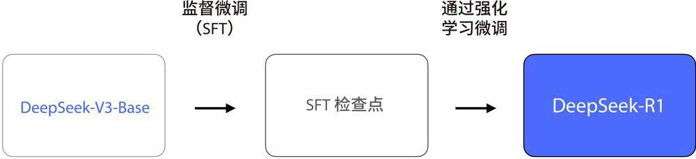

图A-3：DeepSeek-R1的训练过程

请注意，在DeepSeek-R1的创建过程中，有三个特别之处，接下来我们分别聊一聊。

**A.2.1长推理链监督微调数据**

基于基座模型进行监督微调需要用到数量庞大的长链思维推理示例（DeepSeek-R1的训练过程一共用到了60万个），如图A-4所示。如此规模的标注工作意味着，一方面数据极难获取，另一方面人工标注成本极为高昂。这也正是生成这些数据的过程成为值得强调的创新点的原因。

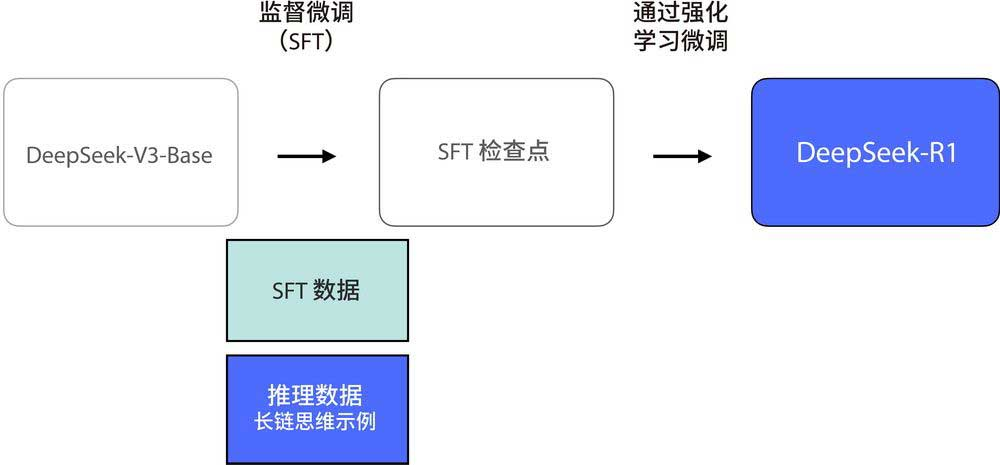

图A-4：推理数据：长链思维示例

**A.2.2临时性高质量推理大模型**

上述长链思维推理数据由DeepSeek-R1模型的前身生成，这是一个未命名的临时模型，专精于推理任务，其设计灵感源于另一个名为DeepSeek-R1-Zero的模型（稍后我们将详细讨论）。这个临时模型的重大意义不在于它作为一个实用的大模型具备多好的性能，而在于其构建过程仅需少量标注数据，配合大规模强化学习训练，最终造就了一个擅长解决推理问题的模型。

通过使用这个未命名的专精于推理（在非推理任务上表现欠佳）的临时模型生成输出结果，开发者得以训练出更通用的模型，如图A-5所示。最终得到的通用模型不仅能完成推理任务，同时，在非推理任务的处理水平上，也能达到用户对大模型的预期。

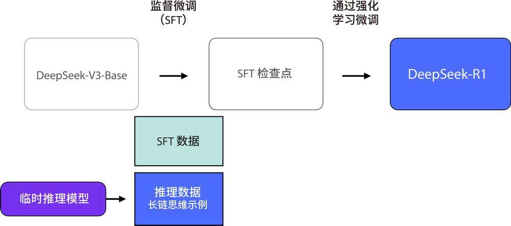

图A-5：专精于推理的临时推理模型

**A.2.3利用大规模强化学习构建推理模型**

构建临时推理模型的关键就在于大规模推理导向的强化学习，如图A-6所示。

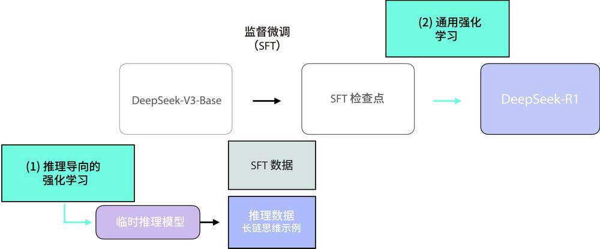

图A-6：推理导向的强化学习

具体分为两个步骤：

·大规模推理导向的强化学习（DeepSeek-R1-Zero）；

·使用临时推理模型构建监督微调推理数据。

在DeepSeek-R1的训练方法中，强化学习用于构建临时推理模型。该模型随后用于生成推理示例，进一步用于监督微调。但实现这一模型的关键在于研发团队之前进行的一项实验，即训练DeepSeek-R1-Zero初始模型的实验，如图A-7所示。

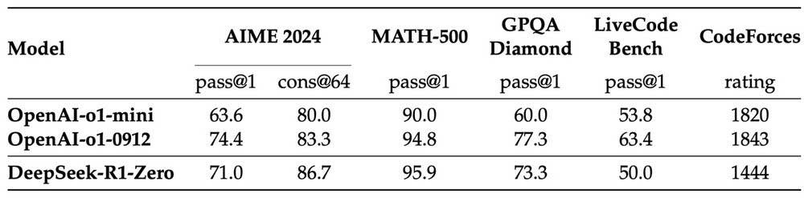

该截图中的表来自论文“DeepSeek-R1: Incentivizing Reasoning Capability in LLMs via Reinforcement Learning”，是DeepSeek-R1-Zero和OpenAI o1在推理相关基准测试上的表现对比。我们在后续内容中还会引用这篇论文中的内容，不妨将其简称为“DeepSeek-R1论文”。

图A-7：DeepSeek-R1-Zero和OpenAI o1在推理相关基准测试上的表现对比

DeepSeek-R1-Zero的特殊性在于，它无须依赖标注的监督微调训练集，就能在推理任务中表现得很出色。其训练过程直接从预训练的基座模型开始，通过强化学习训练流程完成（跳过了监督微调阶段），如图A-8所示。它的表现非常出色，甚至能够与o1媲美。

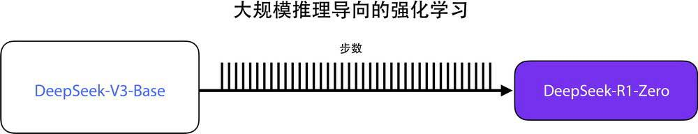

图A-8：DeepSeek-R1-Zero的训练：只有推理导向的强化学习

这一点之所以重要，是因为数据始终是机器学习模型能力的关键所在。DeepSeek-R1-Zero如何能突破这一历史定式？这指向两个关键事实。

·现代基座模型已经跨越了某个门槛，在质量和能力上有了质的提升（DeepSeek-V3-Base基于14.8万亿个高质量词元进行训练）。

·与通用对话或写作需求不同，推理问题可以实现自动验证与标注。让我们通过具体示例加以说明。

·**示例：推理问题的自动验证**

在强化学习训练阶段，假设给出如下提示词（或者输入如下问题）：


此类问题天然适合多种自动验证方式。假设我们将该问题输入正在训练的模型，并得到一个输出，以下多种方法都可以对输出做自动验证：

·通过代码检查工具（比如linter）验证输出是否为合法的Python代码；

·执行生成的Python代码，以检验其运行状态；

·借助其他现代编程大模型，创建单元测试来验证预期功能（这类模型自身无须具备推理能力）；

·我们甚至可以进一步测量执行时间，在训练过程中优先选择性能更好的解决方案——即使其他方案同样能解决问题。

在训练阶段，我们可以向模型提出此类问题，并生成多个可能的解决方案，如图A-9所示。

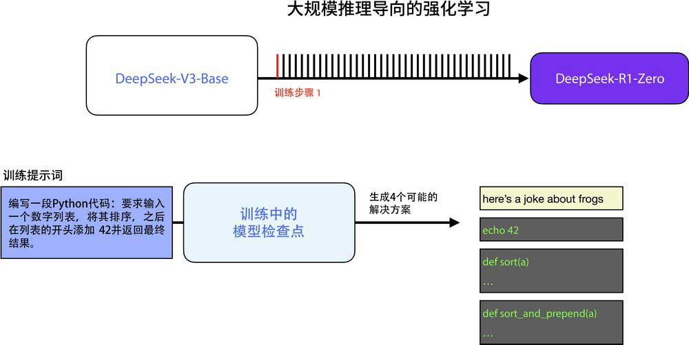

图A-9：在训练阶段生成多个解决方案

通过上述自动验证（无须人工干预），我们可以发现：

·第一个结果甚至不是有效的代码；

·第二个结果虽然是代码，但并不是Python语言编写的；

·第三个结果看似可行，但没有通过单元测试；

·第四个结果才是完全正确的解决方案。

这个自动验证的过程如图A-10所示。

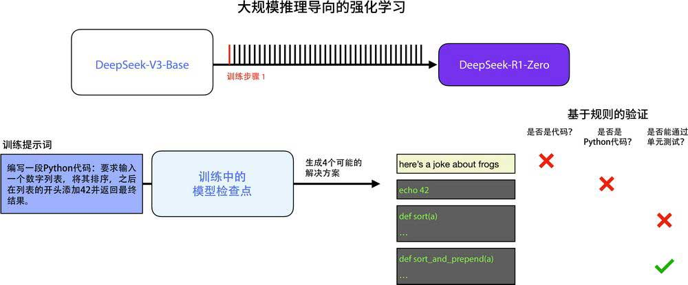

图A-10：在训练阶段进行自动验证

这类反馈信号都可以直接用于模型优化，如图A-11所示。训练过程自然需要基于大量的示例（以小批量形式）持续迭代，并通过反复的训练逐步实现。

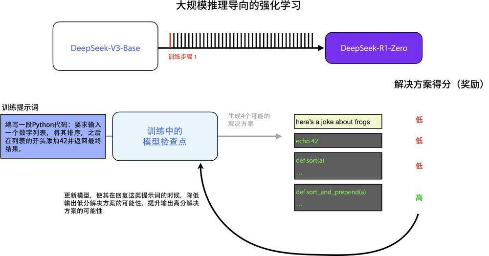

图A-11：反馈信号用于优化模型

这些奖励信号与模型参数更新机制，正是驱动模型在强化学习训练过程中持续提升任务表现的核心原理——该原理在DeepSeek-R1论文中亦有直观呈现，如图A-12所示。

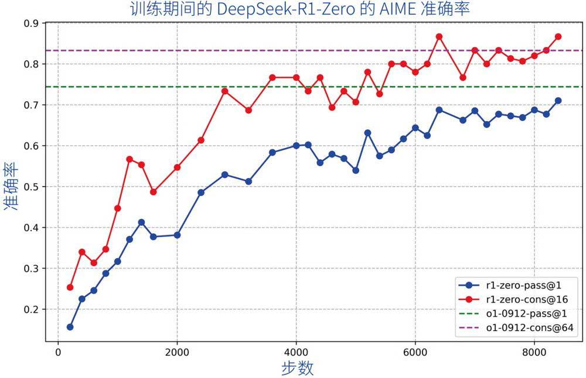

该注释图来自DeepSeek-R1论文。对于每个问题，DeepSeek研发团队随机抽取16个响应并计算整体平均准确率以确保评估的稳定性。

图A-12：反馈信号用于持续优化DeepSeek-R1-Zero

与这种能力提升相呼应的是生成响应的长度——模型会通过生成更多思考词元来处理复杂问题，如图A-13所示。

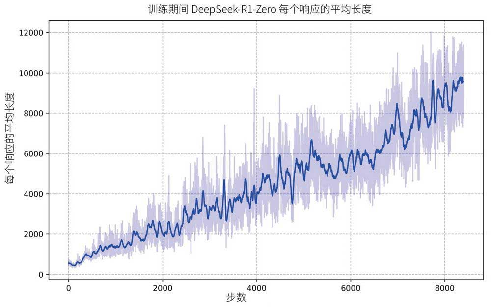

该注释图来自DeepSeek-R1论文。图中展示的是在强化学习训练期间，DeepSeek-R1-Zero在训练集上的平均响应长度。DeepSeek-R1-Zero自然而然地学会了通过更长时间的思考来解决推理任务。

图A-13：DeepSeek-R1-Zero在训练集上的平均响应长度

虽然这一流程行之有效，DeepSeek-R1-Zero模型在这些推理问题上得分也颇高，但它仍面临其他一些问题，导致其实际可用性不及预期。

尽管DeepSeek-R1-Zero展现出了出色的推理能力，并能自主发展出某些预料之外的强大的推理行为，但它也面临不少挑战，例如，生成的内容可读性差、语言混杂等。

DeepSeek-R1的目标就是成为更具实用价值的模型。因此，研发团队并未完全依赖强化学习流程，而是如前所述，在以下两个环节（如图A-14所示）应用强化学习：

·创建一个临时推理模型来生SFT数据点；

·训练DeepSeek-R1模型以提升其在推理类和非推理类问题上的表现（使用其他类型的验证器）。

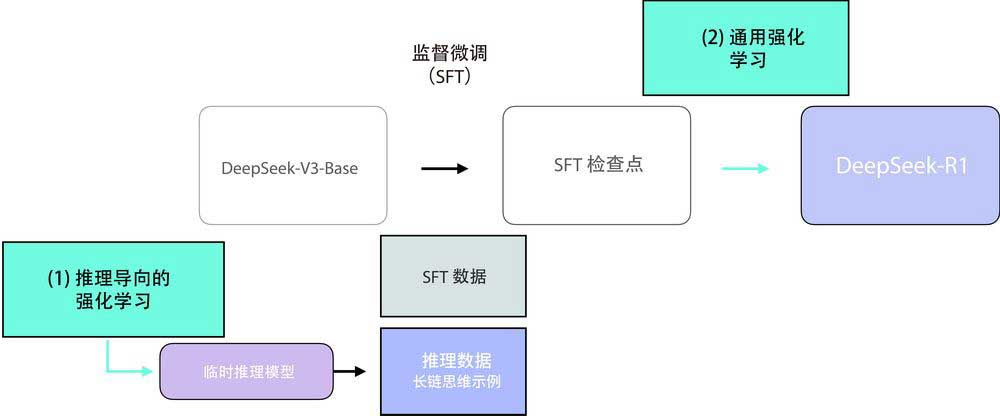

图A-14：应用强化学习的两个关键环节：（1）和（2）

·**使用临时推理模型构建监督微调推理数据**

为使临时推理模型更具实用性，需基于数千个推理问题示例（部分由DeepSeek-R1-Zero生成并经过了筛选）进行监督微调训练。研发团队将其称为“冷启动数据”（cold start data），如图A-15所示。

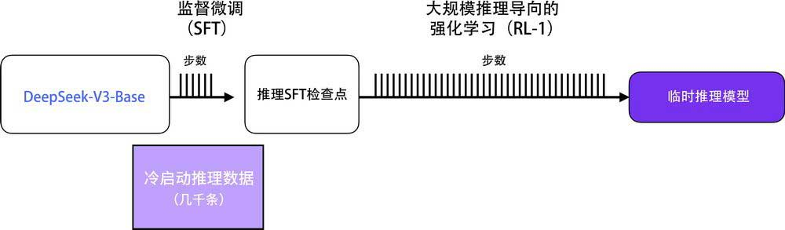

图A-15：冷启动数据

**冷启动**

与DeepSeek-R1-Zero不同，为了避免基座模型在强化学习训练初期出现不稳定的冷启动阶段，DeepSeek-R1采取了相应的措施。我们构建并收集了少量长链思维数据，对模型进行微调并将其作为强化学习训练的初始演员（actor）模型。为收集此类数据，我们探索了多种方法：使用包含长链思维示例的少样本提示词，直接通过提示词引导模型生成包含反思与验证的详细答案，将DeepSeek-R1-Zero生成的输出内容整理成易于阅读的格式，以及结合人工标注对结果进行后处理，进一步优化数据质量。

以上内容来自DeepSeek-R1论文。

不过稍等，既然我们已经有了这些数据，为何还要依赖强化学习过程？原因就在于数据的规模。这个冷启动数据集可能仅有5000个示例（这在实际操作中确实不难获取），但要训练DeepSeek-R1模型却需要60万个示例。这一临时模型的关键作用在于弥合数据量的鸿沟，使我们能够通过自动合成的方式生成那些极具训练价值的数据，如图A-16所示。

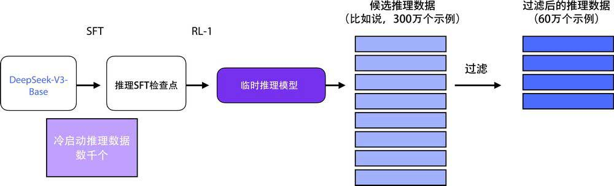

图A-16：临时模型的关键作用

如果你对监督微调的概念还不熟悉，这一过程的本质是向模型提供由提示词和正确的补全结果）构成的训练示例。图A-17展示了几个SFT训练示例。

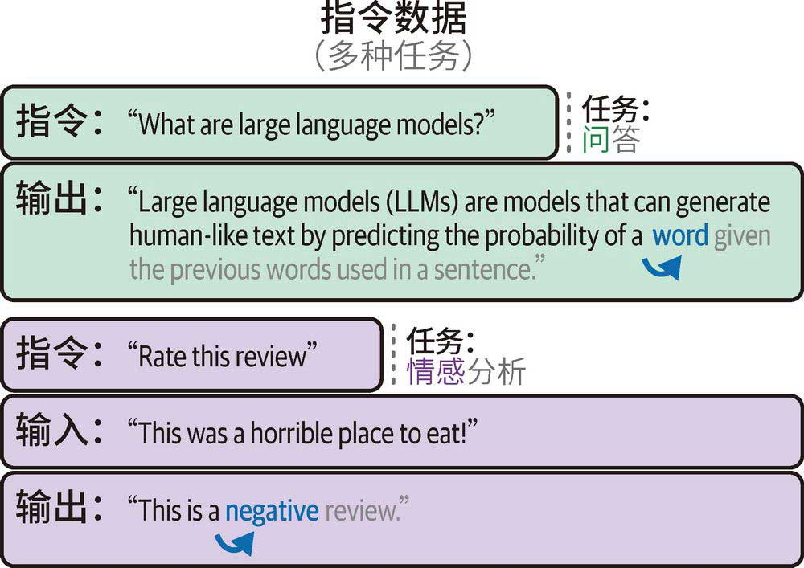

图A-17：监督微调训练示例：用户提供的指令数据及模型的回答

·**通用强化学习训练阶段**

这使得DeepSeek-R1不仅在推理任务上表现出色，也能胜任非推理任务。该流程与我们之前介绍的强化学习过程类似，但由于其应用范围扩展到了非推理领域，因此会针对属于这些应用场景的提示词，采用有用性奖励模型和安全性奖励模型（类似于Llama模型的机制）进行训练，如图A-18所示。

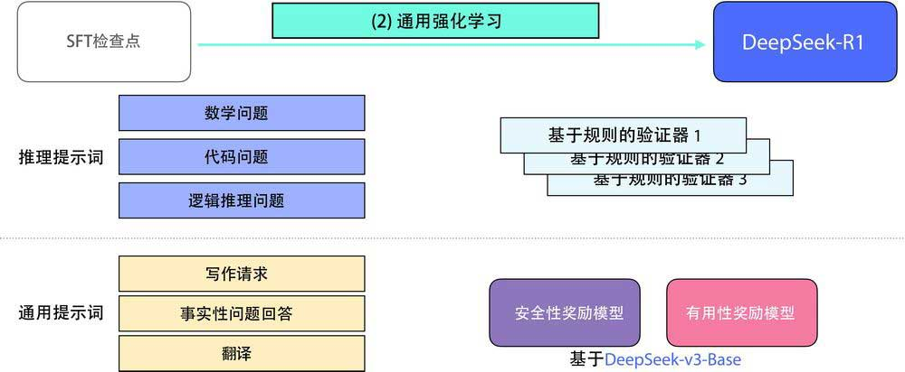

图A-18：通用强化学习训练流程


---

# 后记

感谢所有读者与我们一起探索LLM这个迷人的世界。感谢你们努力学习这些在语言处理领域掀起革命的强大模型。

在本书中，我们探讨了LLM的工作原理，以及如何将其用于创建各种应用，从简单的聊天机器人到更复杂的系统（如搜索引擎）。我们还探索了在特定任务上微调预训练LLM的各种方法，包括分类、生成和语言表示等任务。通过掌握这些技术，读者将能够释放LLM的潜力，创建能够充分利用LLM能力的创新解决方案。这些知识能够使读者立于技术的浪潮之巅，并适应LLM领域的新发展。

在本书结束之际，我们想强调，对LLM的探索才刚刚开始，未来还有许多令人兴奋的进展，我们鼓励读者持续关注。也请继续关注本书的资源库，我们将不断向其中添加资源。

希望通过阅读本书，读者能够更深入地理解如何在各种应用中使用LLM，以及它们改变各行各业的巨大潜力。

以本书为指南，我们相信读者能够在这个快速发展的领域中游刃有余，并做出有意义的贡献。


---

# 作者简介

**杰伊·阿拉马尔（JayAlammar）**是Cohere（领先的大模型API提供商）的总监兼工程研究员（Director and Engineering Fellow）。在这一职位上，他为企业和开发者社区提供咨询和教育，帮助大家将大模型应用于实际场景。通过广受欢迎的AI/ML博客，Jay帮助数百万名研究人员和工程师以直观的方式理解机器学习工具和概念，从基础知识（最终被收录在NumPy和pandas等包的文档中）到前沿技术（Transformers、BERT、GPT-3、Stable Diffusion），内容涵盖方方面面。Jay还是DeepLearning.AI和Udacity上热门机器学习和自然语言处理课程的共同创作者。

**马尔滕·格鲁滕多斯特（MaartenGrootendorst）**是IKNL（荷兰综合癌症中心）的高级临床数据科学家，拥有组织心理学、临床心理学和数据科学的硕士学位。他将这些学科的知识融合，向广大受众传达复杂的机器学习概念。通过广受欢迎的博客，Maarten从心理学角度解释人工智能的基本原理，吸引了数百万名读者。他创作和维护了多个与大模型相关的开源包，如BERTopic、PolyFuzz和KeyBERT，这些软件包已被全球的数据专业人士和组织下载数百万次。


---

# 封面简介

本书封面上的动物为红大袋鼠（*Osphranterrufus*）。作为袋鼠家族中体形最大者，其体长可达1.5米以上，尾长近1米。它们行动迅捷，跳跃行进时速超过56千米，单次跳跃高度可达1.8米，跨度可达7.6米。双眼独特的分布令其拥有近300度的广阔视野。

红大袋鼠之名源于其雄性个体的短毛呈红棕色，这种颜色来自其皮肤腺体分泌的红色油脂。雌性红大袋鼠则通常通体呈蓝灰色，毛色略泛棕。由于颜色特点，雄性红大袋鼠常被澳大利亚人称作“红色巨人”（big reds）；而雌性红大袋鼠因行动速度更胜雄性，常被澳大利亚人称作“蓝色飞影”（blue fliers）。

红大袋鼠栖息于开阔干旱的林间地带，广布澳大利亚大陆，唯北部、西南部及东海岸地区鲜见其踪。环境变化会直接影响红大袋鼠的繁殖策略，雌性红大袋鼠可通过独特的繁殖调控能力暂停或推迟受孕及分娩，直至环境改善，或至前代幼崽完全脱离育儿袋。

本书封面插画由Karen Montgomery基于古籍*Cassell'sPopularNaturalHistory*中的线雕版画创作。


---

1. 由于项目更新迭代，原书所提供链接内容可能过时或失效，仅供参考。——编者注

# 链接资源 [由于项目更新迭代，原书所提供链接内容可能过时或失效，仅供参考。——编者注](#footnote-27-4)

# 前言

·https://www.learnpython.org/

LearnPython网站

·https://colab.research.google.com/

Google Colab官网

·https://jalammar.github.io/illustrated-transformer/

Jay Alammar的文章“Illustrated Transformer”

·https://platform.openai.com/

OpenAI开发者平台

·https://dashboard.cohere.com/

Cohere开发者平台

·https://huggingface.co/

Hugging Face官网

**1.1节**

·http://jmc.stanford.edu/artificial-intelligence/what-is-ai/index.html

·https://cse.unl.edu/~choueiry/S09-476-876/Documents/whatisai.pdf

John McCarthy的文章“What is Artificial Intelligence?”

**1.2节**

·https://arxiv.org/abs/1409.0473

Dzmitry Bahdanau, Kyunghyun Cho, and Yoshua Bengio. “Neural Machine Translation by Jointly Learning to Align and Translate.”arXiv preprint arXiv:1409.0473 (2014).

·https://arxiv.org/abs/1706.03762

Ashish Vaswani et al. “Attention is All You Need.”Advances in Neural Information Processing Systems 30 (2017).

·https://s3-us-west-2.amazonaws.com/openai-assets/research-covers/language-unsupervised/language_understanding_paper.pdf

Alec Radford et al. “Improving Language Understanding by Generative Pre-training”, (2018)

【截至本书出版，链接已失效】

·https://newsletter.maartengrootendorst.com/p/a-visual-guide-to-mamba-and-state

“A Visual Guide to Mamba and State Space Models”

**1.6节**

·https://artificialintelligenceact.eu/

欧盟《人工智能法案》官方页面

**1.8节**

·https://github.com/openai/openai-python

openai-python的Github仓库

·https://github.com/ggml-org/llama.cpp

llama.cpp的Github仓库

·https://github.com/langchain-ai/langchain

LangChain的Github仓库

·https://github.com/huggingface/transformers

Transformers的Github仓库

·https://github.com/oobabooga/text-generation-webui

text-generation-webui的Github仓库

·https://github.com/LostRuins/koboldcpp

KoboldCpp的Github仓库

·https://lmstudio.ai/

LM Studio官网

**2.1节**

·https://platform.openai.com/tokenizer

OpenAI分词器页面

·https://arxiv.org/abs/2103.06874

论文“CANINE: Pre-Txraining an Efficient Tokenization-Free Encoder for Language Repre-sentation”

·https://arxiv.org/abs/2105.13626

论文“ByT5: Towards a Token-Free Future with Pre-trained Byte-to-Byte Models”

·https://www.oreilly.com/library/view/designing-large-language/9781098150495/

图书*DesigningLargeLanguageModelApplications*的O'Reilly官方页面

·https://huggingface.co/google-bert/bert-base-uncased

BERT基座模型（大小写不敏感）的Hugging Face模型仓库页面

·https://ieeexplore.ieee.org/document/6289079

论文“Japanese and Korean Voice Search”

·https://huggingface.co/google-bert/bert-base-cased

BERT基座模型（大小写敏感）的Hugging Face模型仓库页面

·https://huggingface.co/openai-community/gpt2

GPT-2的Hugging Face模型仓库页面

·https://arxiv.org/abs/1508.07909

论文“Neural Machine Translation of Rare Words with Subword Units”

·https://huggingface.co/google/flan-t5-xxl

Flan-T5 XXL的Hugging Face模型仓库页面

·https://arxiv.org/pdf/1808.06226

论文“SentencePiece: A Simple and Language Independent Subword Tokenizer And Detokenizer for Neural Text Processing”

·https://arxiv.org/abs/1804.10959

论文“Subword Regularization: Improving Neural Network Translation Models with Multiple Subword Candidates”

·https://arxiv.org/abs/2207.14255

论文“Efficient Training of Language Models to Fill In the Middle”

·https://huggingface.co/bigcode/starcoder2-15b

StarCoder2-15B的Hugging Face模型仓库页面

·https://arxiv.org/abs/2402.19173

论文“StarCoder 2 and The Stack v2: The Next Generation”

·https://arxiv.org/abs/2305.06161

论文“StarCoder: May the Source be with You!”

·https://huggingface.co/facebook/galactica-1.3b

GALACTICA 1.3B的Hugging Face模型仓库页面

·https://arxiv.org/abs/2211.09085

论文“GALACTICA: A Large Language Model for Science”

·https://huggingface.co/microsoft/Phi-3-mini-4k-instruct

Phi-3-Mini-4K-Instruct的Hugging Face模型仓库页面

·https://huggingface.co/meta-llama/Llama-2-7b-hf

Llama 2 7B的Hugging Face模型仓库页面

·https://huggingface.co/docs/transformers/tokenizer_summary

Hugging Face的分词器汇总页面

·https://huggingface.co/learn/nlp-course/chapter6/1?fw=pt

Hugging Face上的NLP课程中分词器相关部分

·https://www.oreilly.com/library/view/natural-language-processing/9781098136789/

图书*NaturalLanguageProcessingwithTransformers,RevisedEdition*的O'Reilly官方页面

**2.2节**

·https://www.bbc.com/news/technology-64538604

关于“Google杀手”的文章

·https://openreview.net/forum?id=sE7-XhLxHA

论文“DeBERTaV3: Improving DeBERTa Using ELECTRA-Style Pre-training with Gradient-Disentangled Embedding Sharing”

**2.3节**

·https://github.com/UKPLab/sentence-transformers

sentence-transformers的Github仓库

·https://huggingface.co/sentence-transformers/all-mpnet-base-v2

all-mpnet-base-v2模的Hugging Face模型仓库页面

**2.4节**

·https://radimrehurek.com/gensim/

Gensim官网

·https://arxiv.org/abs/1301.3781

论文“Efficient Estimation of Word Representations in Vector Space”

·https://jalammar.github.io/illustrated-word2vec/

文章“The illustrated word2vec”

·https://proceedings.mlr.press/v9/gutmann10a/gutmann10a.pdf

论文“Noise-Contrastive Estimation: A New Estimation Principle for Unnormalized Statistical Models”

**2.5节**

·https://www.cs.cornell.edu/~shuochen/lme/data_page.html

Playlist数据集

**3.1节**

·https://kipp.ly/transformer-inference-arithmetic/

文章“Transformer Inference Arithmetic”，其中介绍了键-值缓存相关内容

·https://web.stanford.edu/~jurafsky/slp3/

*SpeechandLanguageProcessing* (3rd ed. draft) 在线阅读

**3.2节**

·https://arxiv.org/pdf/1904.10509

论文“Generating Long Sequences with Sparse Transformers”

·https://arxiv.org/pdf/2004.05150

论文“Longformer: The Long-Document Transformer”

·https://arxiv.org/abs/2305.13245

论文“GQA: Training Generalized Multi-Query Transformer Models from Multi-Head Checkpoints”

·https://arxiv.org/abs/1911.02150

论文“Fast Transformer Decoding: One Write-Head is All You Need”

·https://arxiv.org/abs/2205.14135

论文“FlashAttention: Fast and Memory-Efficient Exact Attention with IO-Awareness”

·https://tridao.me/publications/flash2/flash2.pdf

论文“FlashAttention-2: Faster Attention with Better Parallelism and Work Partitioning”

·https://arxiv.org/abs/2002.04745

论文“On Layer Normalization in the Transformer Architecture”

·https://arxiv.org/abs/1910.07467

论文“Root Mean Square Layer Normalization”

·https://arxiv.org/pdf/2002.05202

论文“GLU Variants Improve Transformer”

·https://arxiv.org/abs/2104.09864v4

论文“RoFormer: Enhanced Transformer with Rotary Position Embedding”

·https://arxiv.org/abs/2107.02027

论文“Efficient Sequence Packing without Cross-Contamination: Accelerating Large Language Models without Impacting Performance”

·https://www.graphcore.ai/posts/introducing-packed-bert-for-2x-faster-training-in-natural-lan-guage-processing

视频 + 文章“Introducing Packed BERT for 2X Training Speed-Up in Natural Language Processing”

·https://arxiv.org/abs/2106.04554

论文“A Survey of Transformers”

·https://dl.acm.org/doi/abs/10.1145/3505244

论文“Transformers in Vision: A Survey”

·https://ieeexplore.ieee.org/abstract/document/9716741

论文“A Survey on Vision Transformer”

·https://robotics-transformer-x.github.io/

论文“Open X-Embodiment: Robotic Learning Datasets and RT-X Models”

·https://arxiv.org/abs/2202.07125

论文“Transformers in Time Series: A Survey”

**4.1节**

·https://huggingface.co/datasets

Hugging Face的数据集仓库主页

·https://huggingface.co/datasets/cornell-movie-review-data/rotten_tomatoes

rotten_tomatoes数据集的Hugging Face页面

**4.3节**

·https://huggingface.co/models?pipeline_tag=text-classification

Hugging Face上用于文本分类的模型一览

·https://huggingface.co/models?pipeline_tag=feature-extraction

Hugging Face上生成嵌入向量（特征提取）的模型一览

·https://huggingface.co/FacebookAI/roberta-base

RoBERTa基座模型的Hugging Face模型仓库页面

·https://huggingface.co/distilbert/distilbert-base-uncased

DistilBERT基座模型（大小写不敏感）的Hugging Face模型仓库页面

·https://huggingface.co/microsoft/deberta-base

DeBERTa基座模型的Hugging Face模型仓库页面

·https://huggingface.co/prajjwal1/bert-tiny

bert-tiny的Hugging Face模型仓库页面

·https://huggingface.co/albert/albert-base-v2

ALBERT base v2的Hugging Face模型仓库页面

·https://huggingface.co/cardiffnlp/twitter-roberta-base-sentiment-latest

Twitter-roBERTa-base for Sentiment Analysis的Hugging Face模型仓库页面

·https://huggingface.co/spaces/mteb/leaderboard

MTEB排行榜

**4.4节**

·https://huggingface.co/distilbert/distilbert-base-uncased-finetuned-sst-2-english

基于DistilBERT base大小写不敏感版本的微调模型SST-2（DistilBERT base uncased finetuned SST-2）的Hugging Face模型仓库页面

**4.5节**

·https://huggingface.co/tasks/zero-shot-classification

关于零样本分类的介绍

**4.6节**

·https://arxiv.org/abs/2210.11416

论文“Scaling Instruction-Finetuned Language Models”

·https://openai.com/index/chatgpt/

OpenAI对ChatGPT的介绍，包含对其训练过程的概述

·https://openai.com/

OpenAI官网

·https://platform.openai.com/api-keys

OpenAI API密钥管理页面

·https://platform.openai.com/docs/guides/rate-limits/retrying-with-exponential-backoff

OpenAI关于使用指数退避策略进行请求重试的指南

**5.1节**

·https://arxiv.org/

ArXiv平台官网

·https://huggingface.co/datasets/MaartenGr/arxiv_nlp

arxiv_nlp数据集

·https://arxiv.org/list/cs.CL/recent

ArXiv cs.CL（计算与语言）板块

·https://huggingface.co/thenlper/gte-small

gte-small的Hugging Face模型仓库页面

**5.3节**

·https://maartengr.github.io/BERTopic/

BERTopic官方文档页面

·https://github.com/MaartenGr/BERTopic

BERTopic的Github仓库页面

·https://maartengr.github.io/BERTopic/getting_started/best_practices/best_practices.html

BERTopic的最佳实践指南

·https://github.com/MaartenGr/KeyBERT

KeyBERT的Github仓库页面

·https://maartengr.github.io/BERTopic/getting_started/multiaspect/multiaspect.html

BERTopic官方文档中关于生成不同表示的内容

·https://github.com/TutteInstitute/datamapplot

datamapplot的Github仓库页面

**6.4节**

·https://github.com/dave1010/tree-of-thought-prompting

文章“Using Tree-of-Thought Prompting to Boost ChatGPT's Reasoning”

**6.5节**

·https://github.com/guidance-ai/guidance

Guidance的Github仓库页面

·https://github.com/guardrails-ai/guardrails

Guardrails的Github仓库页面

·https://github.com/eth-sri/lmql

LMQL的Github仓库页面

·https://github.com/abetlen/llama-cpp-python

llama-cpp-python的Github仓库页面

·https://huggingface.co/microsoft/Phi-3-mini-4k-instruct-gguf

Phi-3-mini-4k-instruct-gguf的Hugging Face模型仓库页面

## 第7章

·https://github.com/stanfordnlp/dspy

DSPy的Github仓库页面

·https://github.com/deepset-ai/haystack

Haystack的Github仓库页面

**7.1节**

·https://newsletter.maartengrootendorst.com/p/a-visual-guide-to-quantization

Maarten Grootendorst的文章“A Visual Guide to Quantization”

·https://huggingface.co/spaces/open-llm-leaderboard/open_llm_leaderboard

Open LLM Leaderboard（开源大语言模型排行榜）

·https://lmarena.ai/

Chatbot Arena官网

**7.4节**

·https://duckduckgo.com/

DuckDuckGo搜索引擎

## 第8章

·https://arxiv.org/abs/1810.04805

论文“BERT: Pre-training of Deep Bidirectional Transformers for Language Understanding”

·https://blog.google/products/search/search-language-understanding-bert/

谷歌的文章“Understanding Searches Better than Ever Before”，其中提到BERT是“搜索史上最具突破性的进步之一”

·https://azure.microsoft.com/en-us/blog/bing-delivers-its-largest-improvement-in-search-experience-using-azure-gpus/

微软说明BERT为必应搜索带来显著用户体验提升的文章

**8.2节**

·https://en.wikipedia.org/wiki/Interstellar_(film)

电影《星际穿越》英文维基百科页面

·https://docs.cohere.com/reference/rerank

Cohere Rerank端点文档

·https://cohere.com/blog/rerank-3

Cohere关于Rerank 3的介绍文章

·https://www.sbert.net/

Sentence Transformers官方文档

·https://www.sbert.net/examples/applications/retrieve_rerank/README.html

Sentence Transformers官方文档“Retrieve & Re-Rank”一章

·https://arxiv.org/abs/1910.14424

论文“Multi-Stage Document Ranking with BERT”

·https://arxiv.org/abs/2010.06467

论文“Pretrained Transformers for Text Ranking: BERT and Beyond”

·https://nlp.stanford.edu/IR-book/html/htmledition/irbook.html

“Introduction to Information Retrieval”

·https://nlp.stanford.edu/IR-book/html/htmledition/evaluation-in-information-retrieval-1.html

*IntroductiontoInformationRetrieval*一书中“Evaluation in Information Retrieval”一章

**8.3节**

·https://proceedings.neurips.cc/paper/2020/file/6b493230205f780e1bc26945df7481e5-Paper.pdf

论文“Retrieval-Augmented Generation for Knowledge-Intensive NLP Tasks”

·https://www.perplexity.ai/

Perplexity

·https://copilot.microsoft.com/

Microsoft Copilot

·https://gemini.google.com/

Google Gemini

·https://huggingface.co/BAAI/bge-small-en-v1.5

bge-small-en-v1.5的Hugging Face模型仓库页面

·https://cohere.com/blog/command-r-plus-microsoft-azure

Cohere介绍Command R+ 的文章

·https://huggingface.co/CohereForAI/c4ai-command-r-plus

c4ai-command-r-plus（Command R+ 的开放权重版本）的Hugging Face模型仓库页面

·https://arxiv.org/abs/2304.09848

论文“Evaluating Verifiability in Generative Search Engines”

·https://github.com/explodinggradients/ragas

Ragas的Github仓库页面

·https://docs.ragas.io/en/stable/

Ragas官方文档

**9.2节**

·https://github.com/mlfoundations/open_clip

OpenCLIP的Github仓库页面

**9.3节**

·https://github.com/haotian-liu/LLaVA

LLaVA的Github仓库页面

·https://huggingface.co/mistralai/Mistral-7B-v0.1

Mistral-7B-v0.1的Hugging Face模型仓库页面

·https://huggingface.co/HuggingFaceM4/idefics2-8b

Idefics2-8b的Hugging Face模型仓库页面

**10.4节**

·https://gluebenchmark.com/

GLUE基准测试集

·https://www.sbert.net/docs/training/overview.html#best-transformer-model

SBERT关于最佳Transformer模型的说明文档

·https://www.sbert.net/docs/package_reference/sentence_transformer/losses.html

SBERT损失函数文档

**10.5节**

·https://www.sbert.net/docs/sentence_transformer/pretrained_models.html

sentence-transformers库的文档页面，关于预训练模型的部分

**10.6节**

·https://arxiv.org/abs/2104.08821

论文“SimCSE: Simple Contrastive Learning of Sentence Embeddings”

·https://www.diva-portal.org/smash/record.jsf?pid=diva2%3A1684806&dswid=-528

论文“Semantic Re-tuning with Contrastive Tension”

·https://arxiv.org/abs/2104.06979

论文“TSDAE: Using Transformer-based Sequential Denoising Auto-Encoder for Unsupervised Sentence Embedding Learning”

·https://arxiv.org/abs/2112.07577

论文“GPL: Generative Pseudo Labeling for Unsupervised Domain Adaptation of Dense Retrieval”

**11.2节**

·https://github.com/huggingface/setfit

Hugging Face官方GitHub仓库中的SetFit项目

·https://arxiv.org/abs/1902.00751

论文“Parameter-Efficient Transfer Learning for NLP”

·https://adapterhub.ml/

AdapterHub，适配器网站

·https://arxiv.org/abs/2007.07779

论文“AdapterHub: A Framework for Adapting Transformers”

·https://arxiv.org/abs/2303.16199

论文“LLaMA-Adapter: Efficient Fine-tuning of Language Models with Zero-init Attention”

·https://arxiv.org/abs/2012.13255

论文“Intrinsic Dimensionality Explains the Effectiveness of Language Model Fine-Tuning”

·https://arxiv.org/abs/2305.14314

论文“QLoRA: Efficient Finetuning of Quantized LLMs”

**12.3节**

·https://huggingface.co/TinyLlama/TinyLlama-1.1B-intermediate-step-1431k-3T

Hugging Face模型库中TinyLlama-1.1B模型的页面

·https://huggingface.co/TinyLlama/TinyLlama-1.1B-Chat-v1.0

Hugging Face模型库中TinyLlama-1.1B-Chat-v1.0模型的页面

·https://huggingface.co/datasets/HuggingFaceH4/ultrachat_200k

Hugging FaceH4/ultrachat_200k数据集的介绍页面

·https://github.com/bitsandbytes-foundation/bitsandbytes

bitsandbytes包的GitHub仓库

·https://github.com/huggingface/peft

peft库的GitHub仓库

·https://magazine.sebastianraschka.com/p/practical-tips-for-finetuning-llms

用LoRA微调LLM的更多相关内容，作者分享了通过大量实验得出的实用技巧，并解答了关于LoRA的常见问题

**12.4节**

·https://github.com/hendrycks/test

MMLU基准测试的资源

·https://github.com/sylinrl/TruthfulQA

TruthfulQA基准测试的资源

·https://huggingface.co/datasets/gsm8k

GSM8k基准测试的资源

·https://rowanzellers.com/hellaswag/

HellaSwag基准测试的资源

·https://github.com/openai/human-eval

HumanEval基准测试的资源

·https://huggingface.co/spaces/HuggingFaceH4/open_llm_leaderboard

关于LLM的排行榜

**12.7节**

·https://huggingface.co/datasets/argilla/distilabel-intel-orca-dpo-pairs

Hugging Face数据集库中argilla/distilabel-intel-orca-dpo-pairs数据集的页面

·https://arxiv.org/abs/2403.07691

论文“ORPO: Monolithic Preference Optimization without Reference Model”

**附录A原文中的其他资源推荐**

·https://newsletter.maartengrootendorst.com/p/a-visual-guide-to-reasoning-llms

Maarten Grootendorst的文章“A Visual Guide to Reasoning LLMs”

·https://www.interconnects.ai/p/deepseek-r1-recipe-for-o1

Nathan Lambert的文章“DeepSeek R1's Recipe to Replicate o1 and the Future of Reasoning LMs”

·https://newsletter.maartengrootendorst.com/p/a-visual-guide-to-mixture-of-experts

Maarten Grootendorst的文章“A Visual Guide to Mixture of Experts (MoE)”

·https://www.youtube.com/watch?v=6PEJ96k1kiw

Sasha Rush的YouTube视频“Speculations on Test-Time Scaling (o1)”

·https://www.youtube.com/watch?v=bAWV_yrqx4w

Yannis Kilcher的YouTube视频“[GRPO Explained] DeepSeekMath: Pushing the Limits of Mathematical Reasoning in Open Language Models”

·https://github.com/huggingface/open-r1

复现DeepSeek-R1的项目Open R1的GitHub仓库

·https://huggingface.co/blog/putting_rl_back_in_rlhf_with_rloo

文章“Putting RL back in RLHF”

·https://arxiv.org/abs/2211.09085

论文“Galactica: A Large Language Model for Science”

# 作者简介

·https://jalammar.github.io

作者Jay Alammar的博客

·https://newsletter.maartengrootendorst.com

作者Maarten Grootendorst的博客


---

# 大模型面试题200问

李博杰

为了帮助大家更好地理解《图解大模型：生成式AI原理与实战》，也为了方便部分有面试需求的朋友更有针对性地阅读这本书，围绕本书各章主题，译者李博杰系统梳理了大模型领域常见的面试题，其中的大多数问题可以在书中直接找到答案，部分进阶问题可以从本书的参考文献或网络上的最新论文中找到答案。希望所有的朋友都能够带着这些问题阅读本书。

**第1章大模型简介**

Q1：Transformer中的编码器和解码器有什么区别，只有编码器或者只有解码器的模型是否有用？

Q2：GPT跟原始Transformer论文的模型架构有什么区别？

Q3：仅编码器（BERT类）、仅解码器（GPT类）和完整编码器 - 解码器架构各有什么优缺点？

Q4：为什么说Transformer的自注意力机制相对于早期RNN中的注意力机制是一个显著的进步？

Q5：大模型为什么有最长上下文长度的概念？为什么它是指输入和输出的总长度？

Q6：大模型的首字延迟、输入吞吐量、输出吞吐量分别是如何计算的？不同应用场景对首字延迟、输入吞吐量和输出吞吐量的需求分别是什么？

Q7：预训练和微调的两步范式为什么如此重要？基础模型通过预训练获得了哪些核心能力？微调在引导模型遵循指令、回答问题和对齐人类价值观方面起到什么作用？

Q8：Llama-3 8B的综合能力比Llama-1 70B的能力还强，是如何做到的？

## 第2章 词元和嵌入

Q9：大模型的分词器和传统的中文分词有什么区别？对于一个指定的词表，一句话是不是只有一种唯一的分词方式？

Q10：为什么传统BM25检索对中文分词的质量很敏感，而大模型对分词器的选取不敏感？

Q11：GPT-4、Llama等现代大模型采用的字节级BPE分词器相比传统的BPE分词器有什么优点？

Q12：国内预训练的大模型与海外模型相比，是如何做到用相对更少的词元表达中文语料的？

Q13：大模型是如何区分聊天历史中用户说的话和AI说的话的？

Q14：大模型做工具调用的时候，输出的工具调用参数是如何与文本回复区分开来的？

Q15：参考章节中用播放列表数据训练歌曲嵌入的案例，设计一个使用嵌入技术解决电子商务产品推荐的系统。使用什么数据作为“句子”的等价物？如何将用户行为融入嵌入模型？

Q16：word2vec的训练过程中，负例的作用是什么？

Q17：传统的静态词嵌入（如word2vec）与大模型产生的与上下文相关的嵌入相比，有什么区别？有了与上下文相关的嵌入，静态词嵌入还有什么价值？

Q18：与上下文相关的嵌入是如何解决一词多义问题的，如技术语境下，英文token可能表示词元、代币、令牌，而中文“推理”可能表示reasoning或inference？

Q19：在word2vec等词嵌入空间中，存在king - man + woman ≈ queen的现象，这是为什么？大模型的词元嵌入空间是否也有类似的属性？

## 第3章  LLM的内部机制

Q20：大模型怎么知道它的输出该结束了？

Q21：训练时如何防止模型看到未来的词元？


Q22：注意力机制是如何计算上下文各个词元之间的相关性的？每个注意力头是只关注一个词元吗？softmax之前为什么要除以？

Q23：Q和K在注意力的表达式里看起来是对称的，但KV缓存里为什么只有KV，没有Q ？

Q24：如果没有KV缓存，推理性能会降低多少？

Q25：为什么Transformer中需要残差连接？

Q26：Transformer中的LayerNorm跟ResNet中的BatchNorm有什么区别，为什么Llama-3换用了RMSNorm ？

Q27：Transformer中前馈神经网络的作用是什么？注意力层中已经有softmax非线性层，那么前馈神经网络是否必要？

Q28：如果需要通过修改尽可能少的参数值，让模型忘记某一特定知识，应该修改注意力层还是前馈神经网络层的参数？

Q29：大模型在数学计算时，为什么经常不准确？

Q30：模型深度（层数）与宽度（隐藏维度大小）、注意力头数量、上下文长度等参数之间是如何相互影响的？如果要训练一个比当前模型参数规模大10倍的模型，你会如何调整这些参数？

Q31：以一个你熟悉的开源模型为例，介绍模型中每个矩阵的大小和形状。

Q32：大模型推理过程中，内存带宽和算力哪个是瓶颈？以一个你熟悉的开源模型为例，计算输入批次大小达到多少时，能够平衡利用内存带宽和算力？

Q33：从统计学角度看，Transformer输出层假设词元符合什么分布？

Q34：给定一个支持8K上下文的开源模型，如何把它扩展成支持32K上下文的模型？上下文长度增加后对KV缓存会带来什么挑战？

Q35：为什么注意力机制需要多个头？GQA、MQA优化跟简单减少注意力头的数量相比，有什么不同？GQA、MQA优化的是训练阶段还是推理阶段？

Q36：Flash Attention并不能减少计算量，为什么能实现加速？Flash Attention是如何实现增量计算softmax的？

Q37：RoPE（旋转位置嵌入）相比Transformer论文中的绝对位置编码有什么优点？RoPE在长上下文外推时会面临什么挑战？

Q38：由于训练样本长度往往小于最大上下文长度，把多个训练样本放到同一个上下文中训练时，如何避免它们互相干扰？

Q39：如何利用一个小规模的大模型提升大规模模型的推理性能，并尽量不影响大模型的推理结果？推测解码并没有减少计算量，为什么能提升推理性能？

## 第4章 文本分类

Q40：如何基于表示模型生成的嵌入向量实现文本分类？

Q41：使用嵌入向量实现分类和使用生成模型直接分类的方法相比，有什么优缺点？

Q42：如果没有标注数据，如何基于嵌入模型实现文本分类？如何优化标签描述来提高零样本分类的准确率？

Q43：书中嵌入模型 + 逻辑回归的分类方式获得了0.85的F1分数，而零样本分类方式获得了0.78的F1分数，如果有标注数据，什么情况下会选择零样本分类？

Q44：Transformer为什么比朴素贝叶斯分类器效果好很多？朴素贝叶斯分类器的条件独立性假设有什么问题？

Q45：掩码语言建模与BERT的掩蔽策略相比有何不同？这种预训练方式如何帮助模型在下游的文本分类任务中获得更好的性能？

Q46：假设你有一个包含100万条客户评论的数据集，但只有1000条带有标签的数据，同时利用有标签和无标签数据，结合表示模型和生成模型的优势，构建一个分类系统？

Q47：使用生成模型进行文本分类时，以下三个提示词哪个会更有效？

·“Is the following sentence positive or negative?”

·“Classify the sentiment of this movie review as positive or negative.”

·“You are a sentiment analysis expert. Given a movie review, determine if it expresses a positive or negative opinion. Return only the label ‘positive’ or ‘negative’.”

## 第5章 文本聚类和主题建模

Q48：有了强大的生成式大模型，嵌入模型还有什么用？请举一个适合嵌入模型但不适合生成模型的例子。（提示：推荐系统）

Q49：给定大量的文档，如何把它们聚类成几簇，并总结出每一簇的主题？

Q50：词袋法和文档嵌入在实现原理上有什么区别？词袋法是不是一无是处了？

Q51：BERTopic中的c-TF-IDF与传统TF-IDF有何不同？这种差异如何帮助改进主题表示的质量？

Q52：LDA、BTM、NMF、BERTopic、Top2Vec等主题模型有什么优缺点？对长文档、短文档、高质量需求的垂直领域分别应使用何种模型？

Q53：基于质心的和基于密度的文本聚类算法有什么优缺点？

Q54：为什么在主题建模流程中，将聚类和主题表示这两个步骤分开处理是有益的？

Q55：在一个主题建模项目中，你发现生成的主题中有大量重叠的关键词，如何使用本章介绍的技术来改进主题之间的区分度？

Q56：在使用BERTopic时，如果很大比例的文档被归类为离群值，这可能是什么原因导致的？如何调整聚类参数？

Q57：在新闻或社交媒体推荐系统中，主题往往随时间快速演化，如何检测新兴主题？

Q58：如何构建一个内容平台的推荐系统，冷启动时通过文本聚类和主题建模提供推荐，有一定量用户交互数据后又能利用这些数据提升推荐效果？

## 第6章 提示工程

Q59：针对翻译类任务、创意写作类任务、头脑风暴类任务，temperature和top_p分别该怎么设置？如何验证你选择的参数设置是否最优？

Q60：为什么一些模型把温度设置成0，输出的内容仍然有一定的不确定性？（提示：推测解码）

Q61：对于指定的大模型，如何通过提示词减少其幻觉？

Q62：一个专业的提示词模板应该由哪几部分构成？为什么提示词中需要描述角色定义？

Q63：对于一个复杂的提示词，如何测试其中哪些部分是有用的，哪些部分是无用的？

Q64：如何设计提示词模板，尽量防止提示词注入？如何在系统层面检测提示词注入攻击？

Q65：如果把用户信息放在系统提示词中，但在对话轮数较多后，大模型经常忘记用户信息，如何解决？

Q66：如何让ChatGPT输出它自己的系统提示词？

Q67：在没有推理模型之前，如何让模型先思考后回答？思维链、自洽性、思维树等几种技术有什么优缺点？

Q68：在创意写作任务中，如何让模型生成多个可能输出，再从中选取一个最好的？

Q69：如果需要模型遵循指定的格式输出，提示词应该怎么写？

Q70：如何保证模型的输出一定是合法的JSON格式？（提示：限制采样）

Q71：将大模型用于分类任务时，如何保证其输出一定是几个类别之一，不会输出无关内容？（提示：限制采样）

Q72：如果做一个学英语的应用，如何保证它说的话一定在指定的词汇表中，绝不会出现超纲的生词？（提示：限制采样）

## 第7章 高级文本生成技术与工具

Q73：如果我们需要生成小说的标题、角色描述和故事梗概，单次模型调用生成效果不佳时，如何分步生成？

Q74：如果用户跟模型对话轮次过多，超出了模型的上下文限制，但又希望尽可能保留用户的对话信息，该怎么办？

Q75：在角色扮演场景中，用户跟模型对话轮次过多后（但没有超过上下文限制），模型经常没有注意到过去对话中发生过的关键事件，怎么办？

Q76：用户跟模型对话轮数较多后，处理输入词元的预填延迟升高，应该如何解决？（提示：持久化KV缓存）

Q77：如何编写一个智能体（agent），让它像OpenAI Deep Research一样，能够自主思考下一步该搜索什么关键词，浏览哪个网页？

Q78：如何编写一个智能体，帮助用户规划一次包含机票预订、酒店安排和景点游览的旅行？需要配置哪些工具？如何确保系统在面对不完整或矛盾信息时仍能提供合理建议？

Q79：如果单一智能体的提示词过长，导致性能下降，如何将其拆分为多个智能体，并在合适的时机调用不同的智能体？不同智能体间如何进行有效的上下文传递和结果整合？

Q80：不同基础模型在不同任务上的表现不同，如何基于任务特性自动选择最合适的模型？

Q81：如果一个工具的调用时间较长，如何让智能体在等待工具调用返回前能够持续与用户交互或调用其他工具，并在工具调用返回时及时做出下一步动作？

Q82：对于角色扮演场景下的持续对话任务，如何缓存角色设定和历史对话，降低输入词元的成本和延迟？

Q83：智能体如何处理记忆中的时间信息，例如“昨天讨论的问题”？如何在用户长时间不回复时，主动询问用户？

Q84：多个智能体在同一房间里讨论时，如何防止多个智能体互相抢话，又避免冷场？

Q85：支持实时语音的智能体如何既保持低延迟，又避免与用户抢话？

Q86：支持语音输入的智能体，如何用非声学方法，通过语义理解用户是在对旁边人说话还是对它说话？

Q87：PTQ和QAT量化方法的区别是什么，有什么优缺点？

## 第8章 语义搜索与RAG

Q88：在RAG中，为什么要把文档划分成多个块进行索引？如何解决文档分块后，内容上下文缺失的问题？如何处理跨片段的依赖关系？

Q89：如果发现向量相似度检索的匹配效果不佳，除了更换嵌入模型，还有哪些办法？

Q90：向量相似度检索不能实现关键词的精确匹配，传统关键词检索不能匹配语义相近的词，如何解决这对矛盾？

Q91：向量相似度检索已经是根据语义相似度匹配，为什么还需要重排序模型？

Q92：为什么要在向量相似度检索前，对用户输入的话进行改写？

Q93：RAG系统检索的文档可能包含冲突信息或过时数据，如何在生成回答时防止被这些信息误导？

Q94：如何使检索模块能够从生成模块获得反馈并动态调整检索策略，例如给不同的文档标注可信度？

Q95：如何提升RAG系统的可解释性，包括清晰标注生成内容的来源，以及量化展示系统对回答的确信度？

Q96：智能体如何把处理企业任务的经验总结到知识库中，并在后续任务中引入知识库中的经验？如何保证经验不断积累，而不是简单用新的经验覆盖已有的经验？

Q97：如果需要根据一本长篇小说的内容回答问题，小说长度远远超出上下文限制，应该如何综合利用摘要总结和RAG技术，使其能同时回答故事梗概和故事细节？

Q98：如何将RAG系统从纯文本扩展到多模态，支持检索图像、视频、图文并茂的文档等多模态信息，并在生成回答时以多模态形式呈现，例如包含原始文档中的图表和视频？

Q99：如果需要设计一个AI智能伴侣，每天记录用户说过的所有话、做过的所有事，持续多个月，如何在需要的时候快速检索出相关的记忆，让AI能够根据记忆回答问题？综合对话历史窗口化、摘要总结、RAG等技术。

**第9章多模态大模型**

Q100：为什么ViT不能简单地像处理文本词元那样，为每个图像块分配一个唯一的、离散的ID，而是必须采用线性投影生成连续的嵌入向量？

Q101：在CLIP训练过程中，为什么需要同时最大化匹配图文对的相似度和最小化非匹配对的相似度？

Q102：BLIP-2采用了冻结预训练ViT和LLM，仅训练Q-Former的策略。这种设计的核心动机和优势是什么？

Q103：BLIP-2是如何连接预训练的图片编码器和预训练LLM的？为何不直接将视觉编码器的输出连接到语言模型，而要引入Q-Former这一中间层结构？

Q104：将多模态特征映射到文本特征空间时不可避免会产生信息损失，交叉注意力、Q-Former和线性映射等方法的信息保留能力有什么区别？

Q105：BLIP-2模型的图像 - 文本对比学习、图像 - 文本匹配、基于图像的文本生成三个任务分别是什么作用？与今天的Qwen-VL等多模态模型有什么区别？

Q106：基于已经预训练好的模态编码器、模态解码器、文本大模型做多模态模型，多模态预训练和多模态微调两个阶段分别需要什么数据，需要冻结模型的哪些参数？

Q107：CLIP和BLIP-2在处理图像时，都会将其预处理成固定尺寸。如何处理长宽差异巨大的图像？

Q108：在BLIP-2实现视觉问答（VQA）时，模型是如何同时处理输入的图像和文本问题的？

Q109：以一个你熟悉的开源多模态模型为例，输入一张512 × 512的图片和一个100词元的问题，其首字延迟大约是多少，其中模态编码器、Q-Former和LLM部分各占多少？

Q110：能够操作计算机图形界面的多模态大模型每步操作的延迟通常需要几秒，延迟的构成是什么？

Q111：人类对不熟悉的界面操作较慢，但对熟悉的界面操作很快。如何让多模态模型像人类一样快速操作熟悉的界面？

Q112：现有一个能力较弱的多模态模型和一个能力较强的文本模型（如DeepSeek-R1），如何结合两者的能力，回答多模态问题？

Q113：如果一个垂直领域（如医学）的图文对训练数据极为有限，如何为该领域构建多模态大模型？

Q114：如何构建一个AI照片助手，能够索引用户的上万张照片，根据用户的查询高效地检索到相关照片？

Q115：端到端语音模型中，语音是如何转换成词元表示的？

Q116：端到端语音模型是如何实现在工具调用进行过程中，继续与用户实时语音交互的？工具调用的结果与用户的语音输入在模型的上下文中如何区分？

Q117：图像生成模型（如Stable Diffusion）与图像理解模型（如CLIP、BLIP-2）在技术路线上有什么异同？为什么扩散模型在推理时需要噪声，而自回归模型不需要？

## 第10章 构建文本嵌入模型

Q118：为什么通过对比（相似 / 不相似样本）学习通常比仅学习相似样本能更有效地捕捉文本的语义或特定任务特征？

Q119：如何生成负例以提升模型性能？如何构建高质量的难负例？

Q120：双编码器和交叉编码器有什么区别？假设你需要构建一个大规模语义搜索引擎，你会优先选择哪种架构来计算查询与文档的相似度，为什么？如果任务变为对少量候选对进行精确重排序，你的选择会改变吗？

Q121：多负例排序损失（MNR）、余弦相似度损失和softmax损失在训练嵌入模型时有哪些优缺点？在什么场景下，余弦相似度损失可能比MNR损失更合适？

Q122：为什么TSDAE选择使用特殊词元而非平均池化作为句子表征？

Q123：相比有监督方法，TSDAE这类无监督预训练方法在处理领域外数据或进行领域适配时有何优缺点？

Q124：MTEB相比基础的语义相似度测试（STSB）有哪些改进？其中包括哪些类别的嵌入任务？

Q125：如何根据用户偏好反馈数据，持续提升RAG系统的重排序模型性能？

Q126：如果一个RAG系统没有人类用户，仅供AI agent使用，如何自动收集AI agent的反馈，持续提升RAG系统的重排序模型性能？

Q127：如果要构建一个类似Google图片搜索的文本嵌入模型，根据输入图片找到相似图片，应该如何训练？

Q128：如果要构建一个非自然语言垂直领域（如氨基酸序列、集成电路设计）的语义搜索系统，但该领域标注数据极少，应该如何训练嵌入模型？

Q129：随着新数据和新概念的不断产生，如何检测何时需要更新文本嵌入模型，实现增量的持续学习？

## 第11章 为分类任务微调表示模型

Q130：在微调任务中，应该冻结哪些层的权重？微调编码器前几层、编码器后几层、前馈神经网络层有什么区别？

Q131：如果有标注的训练数据很少，如何扩增训练数据的数量？（提示：SetFit）

Q132：SetFit在训练分类头之前，会先利用对比学习微调Sentence Transformer。为什么这个微调步骤对于在极少标注样本下取得高性能至关重要？

Q133：相比直接使用一个冻结的通用Sentence Transformer提取嵌入向量再训练分类器，SetFit的对比学习微调方法能让嵌入向量学习到哪些更适用于下游分类任务的特性？

Q134：在继续预训练时，如何在保证模型获得特定领域知识的同时，最大程度保留其通用能力？

Q135：请比较以下三种方案在垂直领域文本分类任务上的优缺点：(a) 直接使用通用BERT模型微调；(b) 在医疗文本上继续预训练BERT后再微调；(c) 从头开始用医疗文本预训练模型再微调。

Q136：在基于掩码语言建模的继续预训练中，应该如何设计掩码出现的位置和概率？

Q137：在微调过程中，为什么模型对学习率等超参数通常比预训练阶段更敏感？

Q138：在命名实体识别任务中，当BERT将单词拆分成多个词元时，如何解决标签对齐问题？

Q139：如何用领域数据训练一个在嵌入式设备上使用的小模型，同时处理文本分类、命名实体识别和语义搜索三个任务？

Q140：假设一个嵌入模型的训练语料主要由英文构成，其中文表现不佳，如何用较低的继续预训练成本，提升其中文能力？

Q141：对于一个关键场景的分类任务，例如将“严重不良反应”误分类为“轻微不良反应”比反向错误更危险，如何选择评估指标，解决数据集类别不平衡的问题，并修改损失函数？

## 第12章 微调生成模型

Q142：在Llama-3 70B开源模型基础上，如何微调模型以使其输出风格更简洁、更像微信聊天，并保证输出的内容符合中国的大模型安全要求？你认为需要准备多少数据，用多少GPU训练多长时间？

Q143：有人声称一篇文章是用DeepSeek-R1生成的，并给了你生成所用的完整提示词，你应该如何证实或证伪这个说法？如何量化计算这个提示词生成这篇文章的概率？（提示：利用困惑度）

Q144：计算一个拥有96个Transformer块，且每个块有12288 × 12288权重矩阵的模型，使用秩为8的LoRA后，需要微调的参数量是多少？微调过程中的每一步需要多少计算量？相比全量微调减少了多少？

Q145：QLoRA中的分块量化如何解决了普通量化导致的信息损失问题？

Q146：现有一个若干篇文章组成的企业知识库，希望通过SFT方法让模型记住，如何将其转换成适合SFT的数据集？如何确定SFT所需数据集的大小？

Q147：如果微调数据模板中缺少了结束标记</s>会产生什么影响？

Q148：微调模型时，学习率、LoRA alpha、LoRA rank等超参数通常应该如何设置？应该如何决定模型何时停止训练，是不是验证集损失函数越低效果就越好？

Q149：在微调过程中，损失函数应该仅计算输出部分，还是同时计算输入和输出部分？两种方案各有什么优缺点？

Q150：微调后的模型上线后发现一些反复出错的用例，应当怎样修改SFT数据集？

Q151：模型对话轮次较多后，出现模型重复用户的提问或者之前轮次的回答等“复读机”问题，应该怎样通过微调方法解决？

Q152：目前最流行的几个模型分别在什么领域表现较好？为什么有些模型在排行榜中表现突出，但在实际使用中表现不佳？

Q153：Chatbot Arena的模型评估方法相比固定测试集有什么优缺点？

Q154：PPO和DPO在计算效率上、实现复杂度上、训练稳定程度上有什么区别？

Q155：如果现有人类偏好数据集质量高但数量有限，应该用PPO还是DPO ？

Q156：PPO中的Proximal（近端）是什么意思？如何防止模型在微调数据集以外的问题上泛化能力下降？如何防止模型收敛到单一类型高奖励回答？

Q157：PPO中演员模型、评论家模型、奖励模型、参考模型的作用分别是什么？

Q158：PPO是如何解决RL中经典的稀疏奖励和奖励黑客（reward hacking）问题的？

Q159：PPO中的归一化优势函数、值函数剪裁、熵正则化等关键技巧有什么作用？

Q160：DPO中beta参数是什么意思，增大或减小它会有什么影响？

Q161：设想一个网站上都是AI生成的内容，统计了每篇内容的平均用户停留时长，如何将其转化为DPO所需的偏好数据？对于小红书和知乎两种类型的网站，处理方式有什么区别？

Q162：对一个ChatGPT类型的网站，如何把用户行为转化为DPO数据？例如点赞点踩、重新生成、复制、分享、后续追问等。

Q163：什么是大模型的对齐问题？如何避免大模型输出训练语料中的个人隐私信息？

Q164：如何通过模型微调，尽量解决提示词注入的问题？

Q165：现有100条回答用户问题的规则，完全放在提示词中指令遵循效果不佳，如何构建微调数据集和利用RL训练，让模型微调后能够遵从这100条规则？

**图解推理大模型**

Q166：根据缩放定律，如何估算训练一个特定规模的大模型所需的预训练数据集大小和所需算力？

Q167：从大模型原理的角度说明，为什么Llama-3 70B模型不可能在不输出思维链的前提下，可靠地解决24点问题。（即输入24点的问题描述和4个100以内的整数，要求立即输出一个单词Yes或No）

Q168：通过“let's think step by step”提示词触发的思维链模式，与推理模型的原理有什么不同？同样是测试时计算，为什么推理模型的上限更高？

Q169：推理模型的RL与非推理模型的RLHF有什么区别？

Q170：根据AlphaZero玩桌游的研究，训练时计算和测试时计算的算力最优配比是多少？

Q171：如果需要针对垂直领域微调推理模型，过程奖励模型（PRM）和结果奖励模型（ORM）分别适合什么场景？

Q172：在MCTS方法中，如何平衡探索和利用？探索和利用分别使用什么方式来评估？

Q173：STaR方法是如何让模型通过自我生成的推理数据来改进自身的？它有什么优缺点？

Q174：推理模型在后训练过程中，思维链会越来越长，这样结果的准确率提升了，但响应延迟也增加了。如何处理推理深度与响应延迟的权衡？

Q175：如何让推理模型根据问题复杂度、用户需求和系统负载自动调整推理深度？

Q176：为什么推理模型每个输出词元的成本一般高于架构和参数量相同的非推理模型？

Q177：在实时语音对话应用中，如何利用推理模型，又不让用户忍受过高的响应延迟？

Q178：如何用RL方法提升一个大模型的工具调用能力？如何训练模型，使其能够智能地决定何时依靠内部推理能力以及何时调用外部工具，例如写一段代码来解决复杂的推理问题，而不是在输出的推理过程中穷举所有可能？

Q179：提示工程、RAG、SFT、RL、RLHF方法应该分别在什么场景下应用？例如：快速迭代基本能力（提示工程）、用户个性化记忆（提示工程）、案例库和事实知识（RAG）、输出格式和语言风格（SFT）、领域基础能力（SFT）、领域深度思考能力（RL）、领域工具调用能力（RL）、根据用户反馈持续优化（RLHF）。

# DeepSeek-R1

Q180：DeepSeek-R1与DeepSeek-R1-Zero的训练过程有什么区别，各自有什么优缺点？既然R1-Zero生成的推理过程可读性差，在非推理任务上的表现也不如R1，R1-Zero存在的价值是什么？R1训练过程是如何解决R1-Zero的上述问题的？

Q181：为什么说DeepSeek-R1-Zero可能开启了一条让模型智力水平超越人类的路径？

Q182：为什么DeepSeek-R1在创意写作任务中，只需较短的思考过程，就能写出比DeepSeek-V3基座模型有趣很多的内容？

Q183：DeepSeek-R1为什么没有使用PRM、MCTS、集束搜索等方法？

Q184：DeepSeek-R1使用的GRPO与PPO有什么区别？优势值归一化是如何解决传统PPO算法中的值函数估计问题的？

Q185：GRPO中的KL惩罚项有什么作用？为什么过大或过小的KL惩罚项会影响训练效果？

Q186：DeepSeek-R1在SFT阶段，为什么要加入20万条与推理无关的训练样本？

Q187：DeepSeek是如何把R1的推理能力蒸馏到较小的模型中的？如果我们要自己蒸馏一个较小的垂直领域模型，如何尽可能保留R1在特定领域的能力？

Q188：DeepSeek MLA相比MQA占用的KV缓存事实上更多，那么MLA为什么比MQA更好？MLA是对哪个维度做了低秩压缩？

Q189：DeepSeek MLA是如何解决RoPE位置编码与低秩KV不兼容的问题的？如果采用其他基于注意力偏置的位置编码，会有什么问题？

Q190：DeepSeek MoE模型为什么前3层采用稠密连接而后续采用MoE ？如果所有层都使用MoE，会有什么影响？

Q191：DeepSeek MoE和Mixtral MoE有什么区别？DeepSeek MoE的细粒度专家分割和共享专家隔离有什么优点？

Q192：DeepSeek MoE中的专家负载均衡是如何解决路由崩溃问题的？

Q193：从大模型对语言中概念建模的角度分析，为什么R1-Zero的思维链会出现多语言混杂现象？

Q194：R1-Zero的方法主要适用于有明确验证机制的任务（如数学、编程），如何将这一方法扩展到更主观的领域（如创意写作或战略分析）？

Q195：如果要在一个非推理模型基础上通过RL后训练出一个1000以内整数四则运算错误率低于1% 的模型，基座模型预计最少需要多大，RL过程预计需要多少GPU训练多长时间？（提示：TinyZero）

Q196：在QwQ-32B推理模型基础上，通过RL在类似OpenAI Deep Research的场景中强化垂直领域能力，如何构建训练数据集，如何设计奖励函数？

Q197：DeepSeek-R1不支持多模态，如果要在R1基础上支持图片推理，例如学会走迷宫、根据照片推断地理位置，如何构建训练数据集，如何设计奖励函数？

Q198：DeepSeek-V3的多词元预测方法在样本利用效率和推理效率方面相比一次预测一个词元，有什么优势？

Q199：DeepSeek-V3的混合精度训练在哪些矩阵计算中使用了FP8量化？为了减少对模型精度的影响，DeepSeek-V3是如何对激活值和权重做分组量化的？

Q200：DeepSeek的DualPipe并行训练算法相比传统流水线并行有什么优势？它如何与专家并行协同工作，以解决MoE模型的负载均衡问题？


---

1. Copyright Copyright 2010, 2012 Adobe Systems Incorporated (http://www.adobe.com/), with Reserved Font Name ‘Source’. License This Font Software is licensed under the SIL Open Font License, Version 1.1. This license is copied below, and is also available with a FAQ at: http://scripts.sil.org/OFL SIL OPEN FONT LICENSE Version 1.1 - 26 February 2007 PREAMBLE The goals of the Open Font License (OFL) are to stimulate worldwide development of collaborative font projects, to support the font creation efforts of academic and linguistic communities, and to provide a free and open framework in which fonts may be shared and improved in partnership with others. The OFL allows the licensed fonts to be used, studied, modified and redistributed freely as long as they are not sold by themselves. The fonts, including any derivative works, can be bundled, embedded, redistributed and/or sold with any software provided that any reserved names are not used by derivative works. The fonts and derivatives, however, cannot be released under any other type of license. The requirement for fonts to remain under this license does not apply to any document created using the fonts or their derivatives. DEFINITIONS "Font Software" refers to the set of files released by the Copyright Holder(s) under this license and clearly marked as such. This may include source files, build scripts and documentation. "Reserved Font Name" refers to any names specified as such after the copyright statement(s). "Original Version" refers to the collection of Font Software components as distributed by the Copyright Holder(s). "Modified Version" refers to any derivative made by adding to, deleting, or substituting — in part or in whole — any of the components of the Original Version, by changing formats or by porting the Font Software to a new environment. "Author" refers to any designer, engineer, programmer, technical writer or other person who contributed to the Font Software. PERMISSION & CONDITIONS Permission is hereby granted, free of charge, to any person obtaining a copy of the Font Software, to use, study, copy, merge, embed, modify, redistribute, and sell modified and unmodified copies of the Font Software, subject to the following conditions: 1) Neither the Font Software nor any of its individual components, in Original or Modified Versions, may be sold by itself. 2) Original or Modified Versions of the Font Software may be bundled, redistributed and/or sold with any software, provided that each copy contains the above copyright notice and this license. These can be included either as stand-alone text files, human-readable headers or in the appropriate machine-readable metadata fields within text or binary files as long as those fields can be easily viewed by the user. 3) No Modified Version of the Font Software may use the Reserved Font Name(s) unless explicit written permission is granted by the corresponding Copyright Holder. This restriction only applies to the primary font name as presented to the users. 4) The name(s) of the Copyright Holder(s) or the Author(s) of the Font Software shall not be used to promote, endorse or advertise any Modified Version, except to acknowledge the contribution(s) of the Copyright Holder(s) and the Author(s) or with their explicit written permission. 5) The Font Software, modified or unmodified, in part or in whole, must be distributed entirely under this license, and must not be distributed under any other license. The requirement for fonts to remain under this license does not apply to any document created using the Font Software. TERMINATION This license becomes null and void if any of the above conditions are not met. DISCLAIMER THE FONT SOFTWARE IS PROVIDED "AS IS", WITHOUT WARRANTY OF ANY KIND, EXPRESS OR IMPLIED, INCLUDING BUT NOT LIMITED TO ANY WARRANTIES OF MERCHANTABILITY, FITNESS FOR A PARTICULAR PURPOSE AND NONINFRINGEMENT OF COPYRIGHT, PATENT, TRADEMARK, OR OTHER RIGHT. IN NO EVENT SHALL THE COPYRIGHT HOLDER BE LIABLE FOR ANY CLAIM, DAMAGES OR OTHER LIABILITY, INCLUDING ANY GENERAL, SPECIAL, INDIRECT, INCIDENTAL, OR CONSEQUENTIAL DAMAGES, WHETHER IN AN ACTION OF CONTRACT, TORT OR OTHERWISE, ARISING FROM, OUT OF THE USE OR INABILITY TO USE THE FONT SOFTWARE OR FROM OTHER DEALINGS IN THE FONT SOFTWARE.

\*文中代码字体版权说明
 [![Copyright Copyright 2010, 2012 Adobe Systems Incorporated (http://www.adobe.com/), with Reserved Font Name ‘Source’. License This Font Software is licensed under the SIL Open Font License, Version 1.1. This license is copied below, and is also available with a FAQ at: http://scripts.sil.org/OFL SIL OPEN FONT LICENSE Version 1.1 - 26 February 2007 PREAMBLE  The goals of the Open Font License (OFL) are to stimulate worldwide development of collaborative font projects, to support the font creation efforts of academic and linguistic communities, and to provide a free and open framework in which fonts may be shared and improved in partnership with others. The OFL allows the licensed fonts to be used, studied, modified and redistributed freely as long as they are not sold by themselves. The fonts, including any derivative works, can be bundled, embedded, redistributed and/or sold with any software provided that any reserved names are not used by derivative works. The fonts and derivatives, however, cannot be released under any other type of license. The requirement for fonts to remain under this license does not apply to any document created using the fonts or their derivatives. DEFINITIONS  ](images/image_0384.png)](#footnote-29-11)